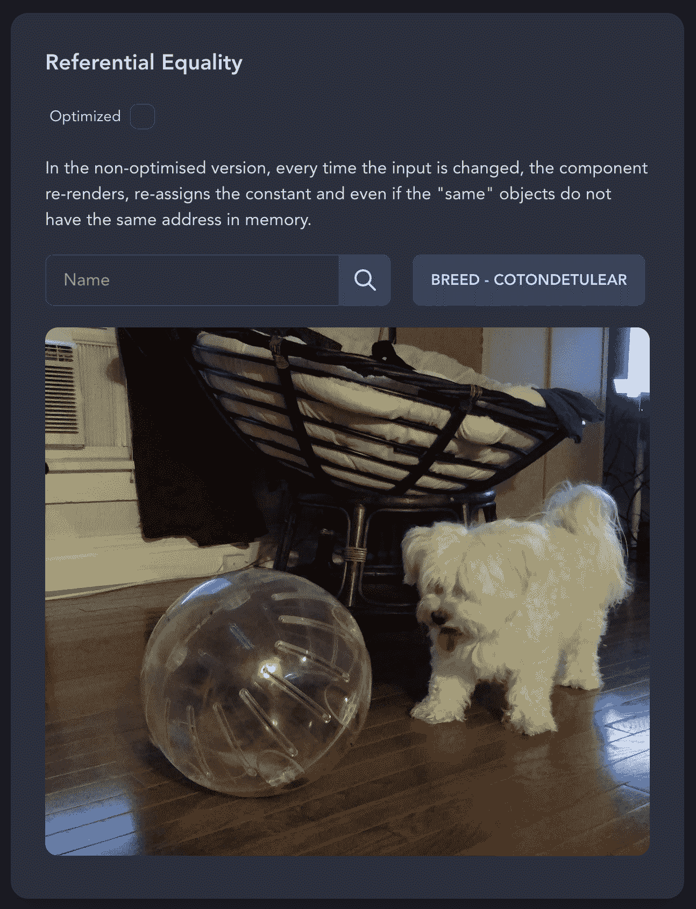
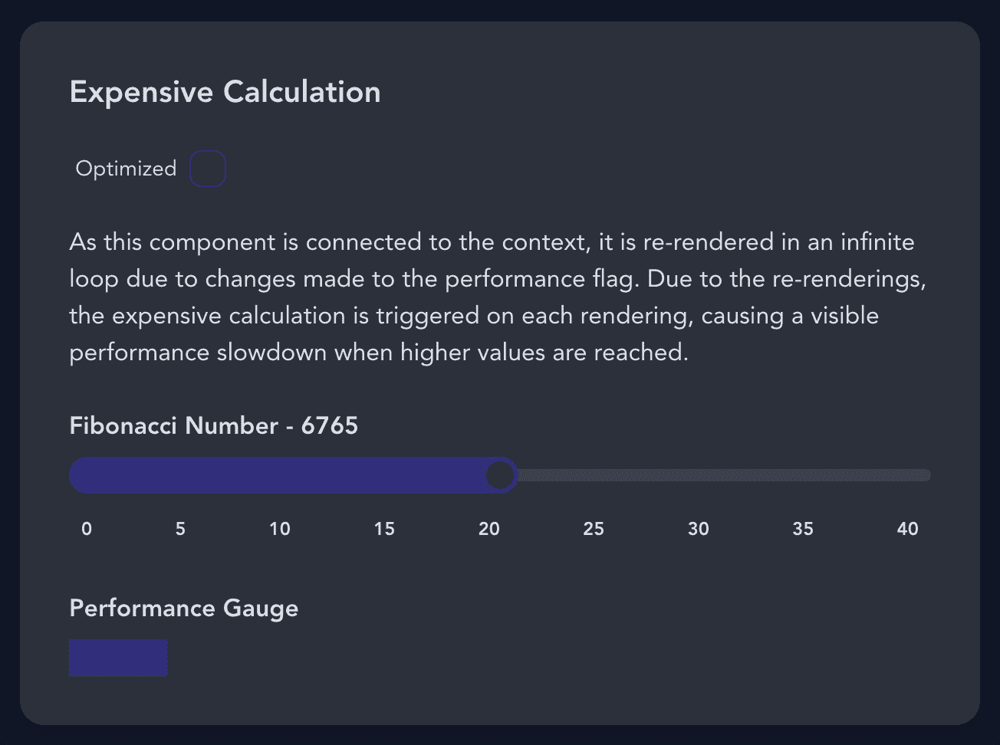
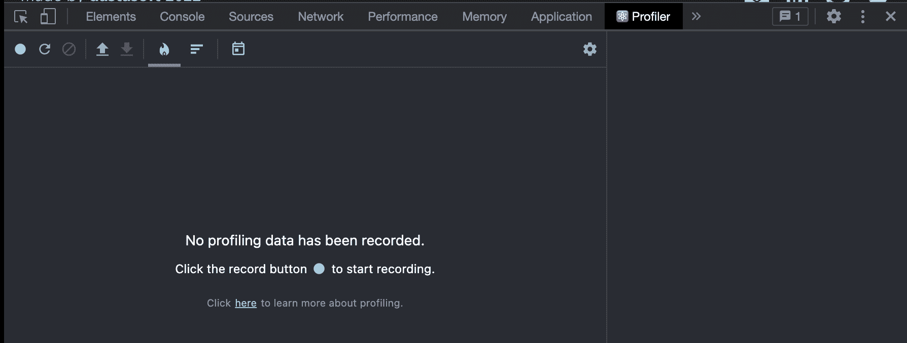
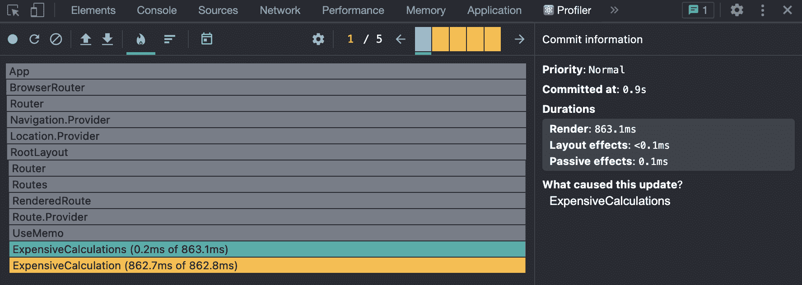
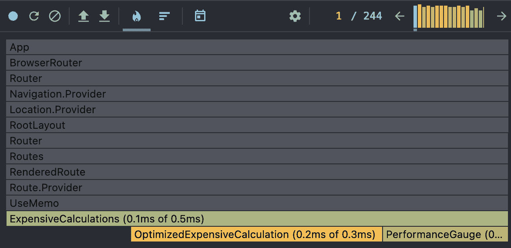

# 更好的反应性能——何时使用 useCallback 与 useMemo 挂钩

> 原文：<https://www.freecodecamp.org/news/better-react-performance-usecallback-vs-usememo/>

我们都想构建强大的应用程序，避免不必要的渲染。有一些钩子可以帮助解决这个问题，但是你可能不确定什么时候使用哪一个。

在本文中，您将了解到`useCallback`和`useMemo`之间的区别，以及如何衡量您在代码库中获得的改进。

在我们开始之前，您应该注意到以下优化 React 的方法实际上是最后的选择。在应用这些实用程序之前，您自己的代码将为您提供更多的改进机会，而不是通过使用您将在这里学到的内容来获得更多的性能提升。

尽管如此，了解这些工具并在发现机会时知道何时使用它们还是很重要的。

## 您需要跟进的资源

*   [使用回调](https://beta.reactjs.org/apis/react/useCallback)和[使用备忘录](https://beta.reactjs.org/apis/react/useMemo)的官方测试版文档
*   [示例项目源代码](https://github.com/dastasoft/optimizing-react)
*   [示例项目现场演示](https://react-optimisation.dastasoft.com/)

一如既往，我提供了一个示例项目，以便您可以在一个简化的环境中测试这里解释的所有内容。没什么大不了的，示例项目只是你现在要学习的要点的总结。

在我们开始比较这两个钩子之前，让我们回顾一些必要的背景概念。

## 什么是指称平等？

当 React 比较依赖数组(如`useEffect`、`useCallback`或传递给子组件的 props)中使用的值时，它使用`Object.is()`。

你可以在这里找到 [Object.is 的详细解释](http://Object.is)但简而言之:

*   原始值是相等的(查看上面的链接，了解一些例外情况)。
*   非原始值指的是内存中的同一个对象。

在一个简化的例子中:

```
"string" === "string" // true
0 === 0 // true
true === true // true
{} === {} // false
[] === [] // false

const f = () => 'Hi'
const f1 = f
const f2 = f

f1 === f1 // true
f1 === f2 // false 
```

## React.memo 如何工作

现在我将简要解释一下`React.memo`是如何工作的(但我们也会在文章后面讨论)。在适当的时候，您可以使用它来提高性能。

当你想避免子组件上不必要的重新渲染时(即使父组件改变了)，你可以用`React.memo`包装整个组件——只要道具没有改变。另外，**注意这里的引用相等**——子组件不会被重新渲染。

```
import { memo } from 'react';

const ChildComponent = (props) => {
  // ...
}

export default memo(ChildComponent) 
```

现在你知道了`React.memo`是如何工作的，让我们开始吧。

## useCallback 钩子如何工作

是我们可以用来优化代码的内置钩子之一。但是正如您将看到的那样，它并不是一个真正的挂钩，因为直接的性能原因。

简而言之，`useCallback`将允许你保存组件渲染之间的*函数定义*。

```
import { useCallback } from "react"

const params = useCallback(() => {
		// ...
    return breed
  }, [breed]) 
```

用法非常简单:

*   从 React 导入`useCallback`，因为它是一个内置的钩子。
*   包装要保存定义的函数。
*   和在`useEffect`中一样，传入一个依赖关系数组，它将告诉 React 什么时候需要刷新这个存储值(本例中是函数定义)。

首先要注意的是*函数定义*部分。它存储的是定义，而不是执行本身，也不是结果——所以每次调用该函数时都会执行它。正因为如此，不要使用这个钩子来避免冗长的计算。

那么存储一个函数定义有什么好处呢？

### 回到参照平等

如果使用函数本身，而不是返回值，例如:

*   对`useEffect`或任何其他钩子的依赖。
*   子组件、上下文等的属性。

为了实现渲染之间的真正平等，`useCallback`将在内存中存储与**相同的对象引用的函数定义。**

如果没有这个钩子，在每次渲染时，函数将被重新创建并指向不同的内存引用。所以 React 会明白，即使你在子组件中使用了`React.memo`也是不一样的。

您可以在示例项目中测试这种行为。你会发现，在非优化版本中，每次你写的时候都会触发一个子组件的副作用。

在那个演示中，你只能得到一个抓取和一个假减速。但是想象一下，在一个大型项目中，在客户机上运行昂贵的计算或者在服务器上花费很多，也会出现同样的问题。


## 挂钩是如何工作的

这是你今天将看到的第二个内置挂钩。在这种情况下，您可以将这个挂钩视为直接优化，因为它存储了函数的结果，并防止它在依赖关系改变之前再次被执行。

因为它可以存储函数的结果，还可以防止组件呈现之间的执行，所以可以在两种情况下使用这个钩子。

### 指称平等

正如你在`useCallback`中看到的，我们也可以用这个钩子实现引用相等——但是这次是针对结果本身。

如果一个函数返回一些在每次渲染中被不同对待的东西，最常见的是对象和数组，你可以使用`useMemo`来获得真正的相等。

```
import { useMemo } from "react"

const params = useMemo(() => {
    // ...
    return { breed }
  }, [breed]) 
```

在上面的例子中，你可以看到`useMemo`的用法:

*   从 React 导入`useMemo`，因为它是一个内置的钩子。
*   包装要保存结果的函数。
*   和在`useEffect`中一样，它传递一个依赖关系数组，告诉 React 这个存储值(函数返回的值)何时需要刷新。

在这种情况下，函数返回一个对象。如你所知，比较对象与 [Object.is](http://Object.is) 是不一样的，因为它们存储在不同的内存地址。使用 useMemo，您可以保存相同的参考。

在示例项目中，您可以像上一节一样测试这种行为，结果也是一样的。在非优化版本中，每次击键都会检索图像。使用`useMemo`，等式保持不变，子组件不再检索图像。



### 昂贵的计算

因为您正在存储一个值，并且完全避免使用`useMemo`执行函数，所以您可以使用它来避免执行不必要的昂贵计算，并使您的站点更有性能。

让我们通过示例项目来看看这一点:



有一个组件，给定一个数字 n，打印出第 n 个斐波那契数。但是这种算法的递归版本执行得相当差。

你还会发现随着时间的推移，强制渲染会不断变化。性能指标将改变状态(每秒添加和删除数据块 60 次)。因为这种状态是一直在变化的，所以计算斐波那契数的函数也是不断地一遍又一遍地运行，即使给定的数总是相同的。

这样，当您对非优化版本使用更高的值时，您将看到性能如何明显下降。优化版本只会在您更改滑块中的数字时(当数字更改时)出现性能峰值，但其余的渲染将跳过计算并直接提供结果。

这里的问题是，在我们的日常工作中，我们不会遇到被称为“昂贵计算”的计算，并且何时使用`useMemo`的决定不一定总是或从不。

## 何时优化

到目前为止，您已经看到了一些何时使用不同钩子来避免不必要的渲染和/或副作用的指示。但是，让我们定义一些通用规则，以决定在那些不太明确的情况下何时使用它们:

*   首先回顾你的代码，重新思考你是如何构建的。您会发现在代码本身中提高性能的最大机会。你可以在丹·阿布拉莫夫的这篇文章中找到更多信息。
*   如果你没有证据证明优化给你带来了有益的结果，那就不要优化——这不是免费的。
*   如果你不想做额外的工作来证明优化给你带来了有益的结果，坦白说:你也不想优化。

## 如何衡量绩效影响/收益

优化的最重要的规则(总是在首先检查你自己的代码之后)是能够测量改变是否生效以及增加的百分比是多少。你这样做不仅仅是为了在下一次绩效评估中丢掉那%的分数。

为此，当您怀疑存在性能问题或只是想检查主要的改进领域时，我们将看看如何继续的两个选项。

### 笨重的版本

我将添加这个选项，因为让我们面对它:你到处都在用`console.log`调试你的代码，不是吗？别担心，我们在同一条船上。


试图测量性能问题的一种快速而激烈的方法是找出执行某个动作需要多长时间，以及该动作执行了多少次。一种方法是:

```
const t0 = performance.now()
expensiveCalculation(targetNumber)
const t1 = performance.now()
console.log(`Call to expensiveCalculation took ${t1 - t0} milliseconds.`)
console.count('Expensive Calculation') 
```

但是，这些信息本身将检测出很少的明显的情况，在这些情况下，您已经怀疑出了问题。

也要小心`StrictMode`，因为稳定性原因，它会通过重复一些渲染来欺骗你的`console.count`。

现在让我们来看看做这件事的正确方法。

### 专业版

在这个版本中，你将使用官方的 [React 开发者工具](https://chrome.google.com/webstore/detail/react-developer-tools/fmkadmapgofadopljbjfkapdkoienihi)来检查你的代码的某些部分的性能。一旦你安装了这个浏览器扩展，打开浏览器的开发者工具并搜索`Profiler`。



我将用示例项目给出例子，但是您可以用自己的项目来做，并检查结果。

如果您按下`record`按钮并开始执行您认为可能需要一些性能调整的操作，概要分析器将保存并打印一份详细的解释。

例如，在昂贵的计算示例项目中，我们将并排比较非优化版本和 useMemo 版本:





我按下录制按钮，等了几秒钟，然后再次按下录制按钮，得到了这两个版本的结果。正如你所看到的，由于这是一个准备好的极端情况，两者之间的巨大改善是显而易见的。

但是让我们更仔细地看看分析器中出现了什么:

*   灰色行是尚未重新渲染的组件，因此在性能方面没有什么可担心的。
*   绿色和黄色的行是已经重新渲染的组件，您可以看到渲染花了多长时间。
*   如果你点击每一块，你可以看到更多数据的详细解释。

我将写一篇关于分析器的全面深入的文章，但是现在这里有一些快速提示:

*   在设置图标“常规”下，勾选`Highlight updates when components render.`。这将显示正在呈现的确切内容，并可以检测在某些操作下不打算呈现的子组件。
*   在设置图标 Profiler 下，勾选`Record why each component rendered while profiling.`。这将添加一个组件正在呈现的内容的简要说明，并可能为您提供需要在何处放置升级的线索。

## 结论

正如您所看到的，这两个常见的被误解的钩子有非常不同的功能和场景，在哪里使用它们才能获得真正的好处。现在是时候回顾一下你现在/过去的一些项目，找出你使用不当的地方或者其他需要的地方。

React 中的优化在未来可以由库自动完成。但是，在写这篇文章的时候，这是一个过程，你应该小心谨慎，并经过彻底的分析。

我希望本教程对你有用，它将帮助你用 React 构建性能更好的应用程序。感谢阅读！