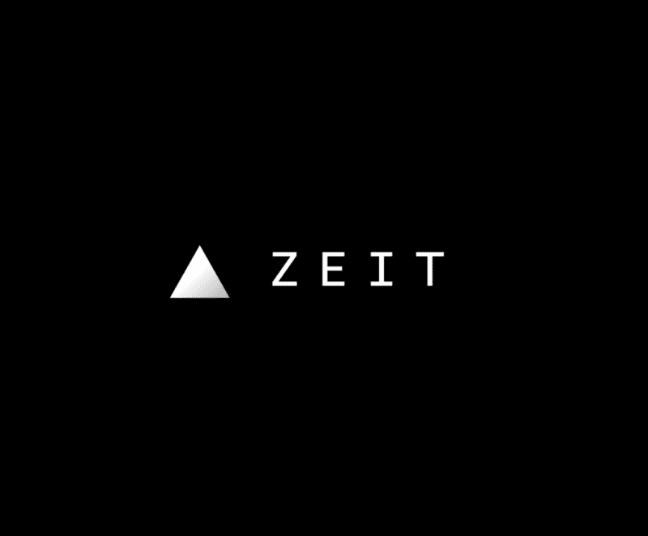

# 电线之间:采访开发商和企业家吉列尔莫劳奇

> 原文：<https://www.freecodecamp.org/news/between-the-wires-an-interview-with-developer-and-entrepreneur-guillermo-rauch-1ce38774056a/>

薇薇安·克伦威尔

# 电线之间:采访开发商和企业家吉列尔莫劳奇

(Credit to Vivian Cromwell, Fuji X-T1 )

*我采访了 zeit.co的创始人* *吉列尔莫·劳赫。Zeit 的使命是让云部署变得简单、全球化和实时。Rauch 还建立了 [socket.io](http://socket.io/) 并在此前创立了两家创业公司:LearnBoost 和 CloudUp。*

*这篇文章最初由[的](https://medium.com/between-the-wires/between-the-wires-guillermo-rauch-2819177beedc)发布在[的](http://betweenthewires.org)网站上，这是一个采访那些构建开发者产品的人的系列。*

#### 告诉我们一些关于你童年的事情，以及你在哪里长大的。

我在阿根廷布宜诺斯艾利斯外的一个小镇长大。这是一个很小的住宅区，几乎没有互联网接入，也没有电脑。

我爸爸非常喜欢工程学和《星际迷航》,所以他总是想给家里买些又新又酷的东西。我大约七岁时，我们有了一台电脑。我仍然记得我们得到它的第一天，我记得 Windows 95 启动。一切都是从那时开始的。

#### 是什么让你特别喜欢编程？

早期发生了一些事情。一个是早期接触另类操作系统。例如，当我第一次听说 Linux 时，它很难使用。

Guillermo, 12, explaining to Richard Stallman that vi > emacs

由于我接触过终端，而且编写文件、运行 GCC 和获取二进制文件只需要很少的步骤，编程对我来说非常有用。

有一种观点认为 shell 本身也是一种编程语言，对吗？这一切都配合得非常好。

> "我实际上可以从黑屏上的这几个字符中提取出如此多的兴奋."

我想那是我第一次意识到编程对我来说非常令人兴奋。我实际上可以从黑屏上的这几个字符中提取如此多的兴奋。对编程的兴奋与此有很大关系，因为在这个过程中有太多的负面反馈，以至于胜利会让你非常兴奋。让我真正兴奋的是一些小事情，比如屏幕上有一串绿点的测试通过。

#### 那好像是 [Hyper.app](https://hyper.is/) 的影响吧？

绝对的。对我来说，Hyper.app 是这一想法的延续。

此外，在早期的某个时候，我通过许多用 PHP MySQL 编写的项目发现了开源。使用 PHP，我第一次尝到了由比我更有经验的人编写庞大代码库的滋味。当我能够编辑作品并获得即时反馈时，我被迷住了。

#### MooTools 是你第一个重要的开源项目吗？

MooTools 是一个 JavaScript 实用程序集合，专为中高级 JavaScript 开发人员设计。

我记得我为一个音乐目录建立了一个非常简单的网站。有许多行，每一行的右边都有三个按钮:检查、编辑和删除。我希望 remove 按钮只删除客户端的那一行。我不想再次获取整个网站。所以我们最终使用了一个隐藏的 iFrame，我们可以向它发送消息，然后检测 iFrame 回调事件。后来我发现这个 iFrame 的东西是黑客。这就是我真正喜欢 MooTools 的原因。

这是我第一个真正重要的开源角色，也是我第一份工作的来源。当时我 16 岁，被任命为 MooTools 的核心开发人员。

接下来的一年，我被邀请去瑞士，因为一家初创公司决定为他们所有的前端应用程序代码押注 MooTools。这家公司的另一位核心开发顾问亚伦·牛顿推荐了我。我想这就是为什么让人们尽早对你下赌注是如此重要。

一周后，他们带我去了瑞士。我记得在火车站见过首席执行官。他说，“等一下。这孩子迷路了吗？你真的是我们的新工程师吗？”我说“好，我们走吧。让我们把这件事做好。”

然后，他们在旧金山这里开了一家办事处，就在那时，我决定继续前进，创办自己的公司，因为为什么不呢？

#### 你的第一个创业公司 LearnBoost，产生了这么多开源项目，并在早期帮助推动了 Node JS 的采用，你是如何做到的，或者这是一个副作用？

[Learnboost](https://www.learnboost.com/) 是我的第一家创业公司，我们希望帮助教师使用数字成绩簿在一个地方管理他们的教室。

很有意思，因为这是副作用，但是后来初创企业的很多副作用变成了你的主要效应。这是一个你听过的经典故事，公司的特色之一成为了公司最大的业务。

我认为我们一开始就打算使用 Node。当我们第一次开始编写代码库时，后端是一种语言，前端是 JavaScript。然后 Node 出来的时候，我们决定 100%赌 JavaScript 的每一行代码。为什么不呢？

需要注意的是，它涉及到使用许多正在开发的东西，就像 Express 最初的几个版本之一。有时我们会使用早期版本的软件，发现它们不够好，于是我们会构建自己的开源软件。

开源是我们能够做到这一点的唯一途径，因为我们在内部使用了大量的开源软件。我们从创建这些开源项目的人那里招募人才，然后我们回馈社会，作为一种在这个平台上推动增长的方式。

这也是我们出名的原因，开源。

#### 我们已经谈了很多 LearnBoost 和 Cloudup 好的一面，你想分享一下你所面临的挑战吗？

很多挑战。一开始，我真的很热衷于建立一个教育产品，但正如我刚才讲述的我自己的故事，我没有读完高中，也没有上大学。

因此，我认为我们正在打造的产品并没有真正体现出我在那之前建立职业生涯的方式。如果我必须再次建立或推荐一个教育工具，我会推荐那些让我成功的工具。

我几乎从网上学到了所有的东西。我是如何学习英语的就是一个很好的例子。我通过阅读我在网上找到的大量文档来学习，这些文档通常只有英文版。所以我别无选择，只能学着去读。

学习编码是另一个例子。你可以在家自学编程。如果你使用正确的工具，你可以立即得到反馈。这是那种我希望我们曾尝试用产品为他人构建的东西。而不仅仅是做一个通用的教育工具。

早些时候，我们问老师，“好吧，你觉得这个座位表怎么样？对此你怎么看？”相反，我认为最好的初创企业有办法告诉其他人，“好吧，你为什么不试试这个？这是一种新的做事方式”，也是一种冒险。

回到“我当时怎么能做得更好？”我也会试着鼓励那些正在学习提问的人，比如:你会怎么处理你学到的这些东西？以后怎么拿工资，全职做这个？

我认为，对于很多与知识获取有关的事情来说，如果你试图免费获取，你会为自己带来更好的回报，然后你把你的创造力放在首位，然后你再把它投入市场。那基本上是 100%的利润。

我认为我们也可以通过开源做很多这样的事情。我们必须继续寻找人们可以学习并为开源做出贡献的方法，然后使之成为一个完整的系统。这不是一个基于对可能永远不会到来的捐赠的希望的系统，而是一个基于它的使用，真正把那种力量还给创造者的系统。

> “这是我们现在在开源社区中缺少的东西之一。有些人对我们赖以建立的世界做出了巨大贡献，但由于他们做出的一系列决定，他们无法维持下去。”

这实际上是开放 SSL 的情况。开放 SSL，全世界最广泛、最重要的基础设施之一。它资金不足，充满了安全漏洞。

#### 除了与产品相关的挑战，还有任何团队或情感驱动的挑战吗？

我认为有两种情感挑战。一种是你直接面对的——也许你试图销售你的产品，但因为他们选择了你的竞争对手而被拒绝了，或者你被一个投资者拒绝了。这种类型的挑战是“哦，出问题了”的直接反馈

另一个不那么微妙的问题是，当你接手这些多年项目时，看不到尽头。

有可能明天你会被收购，而你的同行会认为你花了一大笔钱。可能会发生这样的情况，你不得不花 20 年时间扎实地建立一个企业，然后最终为你的同事和雇员找到某种报复。

这很微妙，当你每天都在不断地进行一场艰苦的战斗时，你就带着这种情绪包袱。我想这就是我所说的，也许你所追求的想法，并不完全符合你的身份或对世界的看法，但你觉得改变它为时已晚。

我认为对我们来说，我们做的最伟大的事情是，我们不觉得改变它为时已晚。我们似乎在说，这是我们的新焦点。这很难，然后你会面临很多直接的负面反馈，因为你所有的员工都会问，“为什么？为什么我们要改变一切？我有点喜欢我之前做的工作。我们做得很好。”

我认为这一切都是为了让公司的使命和你对它的看法保持一致。这也是为什么不要太执着于坏主意是很重要的。有时候很棘手，因为涉及到钱。还牵扯到别人的钱。

我认为这也是开源的一大教训。你在某个解决方案上投入了很多，但是你必须意识到在某个点上它将耗尽它的进化，并且它不能再增长了。明智的做法是不去管它，重新开始。

#### 有意思。很明显，你已经用 ZEIT 和 HyperTerm 重新开始了，所以第一次启动并没有让你失望。我很想知道，现在你正在构建它，你认为 ZEIT 和 HyperTerm 的成功的长期结果是什么？

> “我的一个梦想是，下一个脸书或下一个 Snapchat 将由一个不必经历所有这些教育或不必发展所有这些联系并雇用所有这些聪明人的人来创建。真的，可以是一个非洲女孩。可以是孟加拉国的男生。”

我们的使命是让世界上的每个人都能非常轻松地部署应用和服务。我们认为互联网的整体结构非常非常难以把握。从 DNS 到 SSL 到 IP 到 TCP 到 HTTP，再到实现性能的不同方式，涉及到这么多层次、这么多技术和这么多行话。我们衡量成功的方式显然是让更多的人把他们的工作放在那里，并通过更频繁地改变这些东西来提高生产率。

我们的愿景是，公司中的任何人都将能够自己完成整个产品或体验并进行部署。你把权力交给一个人，否则需要一整队人来完成。你可以在 100 毫秒内给他们反馈，而过去需要几分钟、几小时或几周。

一个人创造了脸书，而且是一个在哈佛宿舍里受过良好教育的人，然后他们花了一定的时间达到他们的第一个一百万用户。你可以看到变化非常快，对吗？发起下一次大革命的人的教育水平不一定那么高，他们达到 100 万用户所需的时间每次都更短。我们做得特别好的一件事是，我们接受您的部署，并代表您进行扩展。

我的一个梦想是，下一个脸书或下一个 Snapchat 将由一个人创建，这个人不必经历所有这些教育，也不必发展所有这些联系，并雇用所有这些聪明人来帮助他们扩大业务或技术。真的，可以是一个非洲女孩。可以是孟加拉国的一个男孩。

这将是我们的梦想场景，给予个人如此大的力量。我认为这是我们的工业和这项技术赋予我们的力量。因为从零开始建造特朗普大厦太难了。

#### Zeit 有一个非常分散的团队，包括你的联合创始人。你能谈谈你在团队生产力和沟通方面的最佳实践吗？你使用什么工具？

> “在我看来，分布式团队是唯一的出路，因为否则你会错过所有这些惊人的创造力和多样性，这些创造力和多样性来自那些不在同一物理空间的人。”

Zeit team and their largest customer in Europe

我给你举一个我认为分布式团队最大优势的例子:

我们推出了 Hyper.app，这是我自己花了大约两周时间开发的。然后我向世界开放了。接下来发生的事会让你大吃一惊。在我们发布它的一个星期后，我们已经有 50 个贡献者提出了拉取请求。我们在它上面写了 100 个插件。

我认为有所帮助的是我们让主题非常容易创建。看到这样的回应是非常值得的，因为你正在创建一个平台，我们将在这个平台上提供乐高积木的组合。

想象一下这种努力的物理或亲自对应？你如何协调 50 个人围绕一个项目，围绕一个办公空间？怎么这么快就招到他们了？你如何与他们一对一交谈，或者解决他们如何工作的细节等等？

我认为开源向我们展示了生产力的这种戏剧性的指数增长。因为物理协作很慢，所以除了通过互联网之外没有其他方法。

我们还成立了 Slack，每个人都加入进来，开始交流想法。再一次，这一大群陌生人几乎自发地聚集在一起，并拥有所有这些工具来合作。对我来说，这就像是一夜之间发生的。对我来说，我想在我自己的公司复制这一点。我不希望我制造真正伟大产品的能力受到物质的限制。我不想给人们增加不必要的协议和不必要的程序的负担，这些不必要的程序可能会给他们带来不便。

在我看来，分布式团队是唯一的出路，因为否则你会错过所有这些惊人的创造力和多样性，这些都来自那些不在同一个物理空间的人。

#### 你的创业公司目前面临的最大挑战是什么？

我认为有很多挑战与产品教育有关。最好的办法是不要为每一种类型的工作流创建一个拥有每一种功能的产品。相反，我们希望教育用户如何以最好的方式使用产品。

有时你会遇到热情的客户，也许是真正的大客户，他们可能对如何使用产品或平台有不同的想法。对我们来说，这是关于在随着时间的推移添加特性，但保持简单性和保持对 API 开发的最佳模型的信念之间取得微妙的平衡。这又回到了对很多事情说不，即使从财务角度来看非常诱人。

#### 你心目中的编程英雄是谁？

莱斯利·兰波特，排名第一。他是计算机科学的英雄，因为他的贡献的广度和深度是我们领域中任何人都无法比拟的。在我看来，他可以与[艾伦·图灵](https://en.wikipedia.org/wiki/Alan_Turing)相提并论，因为他开启了一个全新的领域，即分布式系统。我们仍在努力掌握他的贡献大小，并继续研究他的想法，特别是最近的作品，如 Raft 和 Flexible Paxos。对于这个问题，具有讽刺意味的是，何[认为](http://research.microsoft.com/en-us/um/people/lamport/pubs/state-machine.pdf)当简单的数学工具(集合、函数和基本逻辑)足以表达任何程序时，我们过于强调编程**语言**。

[丹·伯恩斯坦](https://en.wikipedia.org/wiki/Daniel_J._Bernstein)在密码学和安全领域无人能及。广泛的理论和低级系统贡献，但也以有品味、实用、平易近人和广泛使用的软件而闻名，如 Qmail。

我也是我们日常使用的软件背后那些鲜为人知的英雄的忠实粉丝。想到了 git 的主要维护者 Junio Hamano 。Git 是 Linus 的一个非常短期的项目，从那以后就一直熟练地进行着。

#### 转到更一般的问题，除了编程，你还有什么爱好或兴趣？

编程是我的主要爱好。除此之外，我喜欢体重健身，也称为健美操，这是在没有体重或健身房或类似事情的情况下锻炼自己的身体。对我来说这是一种冥想。这也是一种设置几乎无法实现的挑战的方式。

我有一只柴犬。是的，我从我的狗身上学到了很多，因为它已经为自己找到了美好的生活。他很有禅意。他是一只来自日本的狗，有着惊人的个性。我认为我们为他们做了很多，但我们也从他们那里得到了很多，比如对不同生活的欣赏。

Dei, so zen.

我也对设计充满热情，我总是在想我能创造出什么样的小应用程序或项目来产生巨大的影响。

[捐款支持本项目](https://opencollective.com/betweenthewires)。

这个项目得到了来自[frontendmasters.com](https://frontendmasters.com/)、 [egghead.io](https://egghead.io/) 、[微软 Edge](https://www.microsoft.com/en-us/windows/microsoft-edge) 和[谷歌开发者](https://developers.google.com/)的赞助。

Our sponsors.

要推荐一位您希望听到其声音的制造商，请填写此[表格](https://goo.gl/forms/XhR1IyLXJHNMljcp1)。

您也可以在 Twitter 上向 betweenthewires 发送反馈。