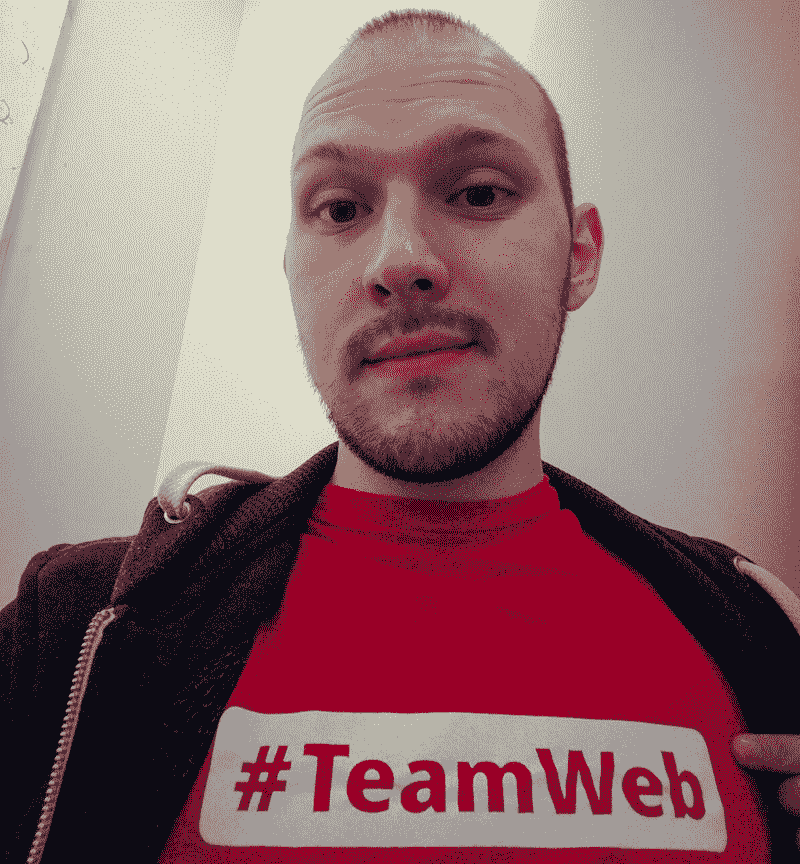
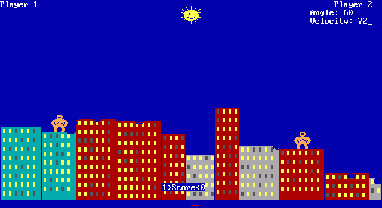
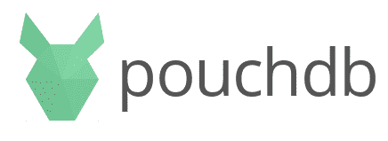
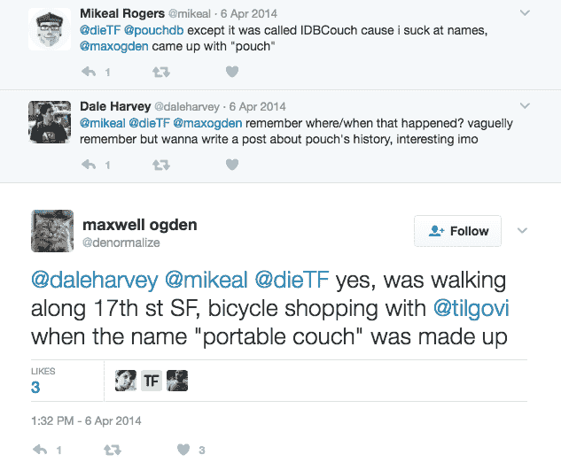
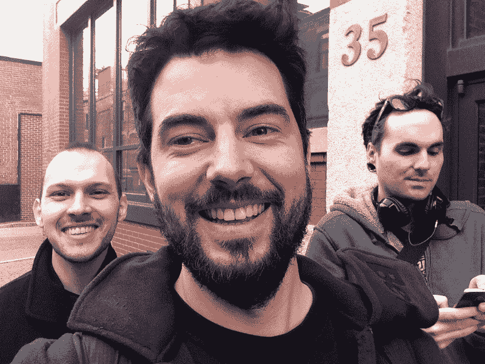
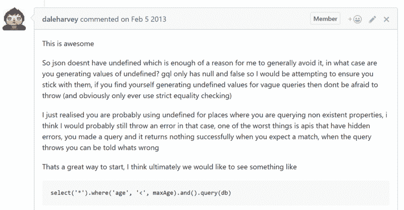
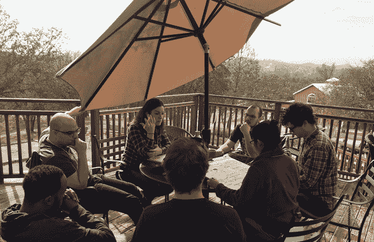
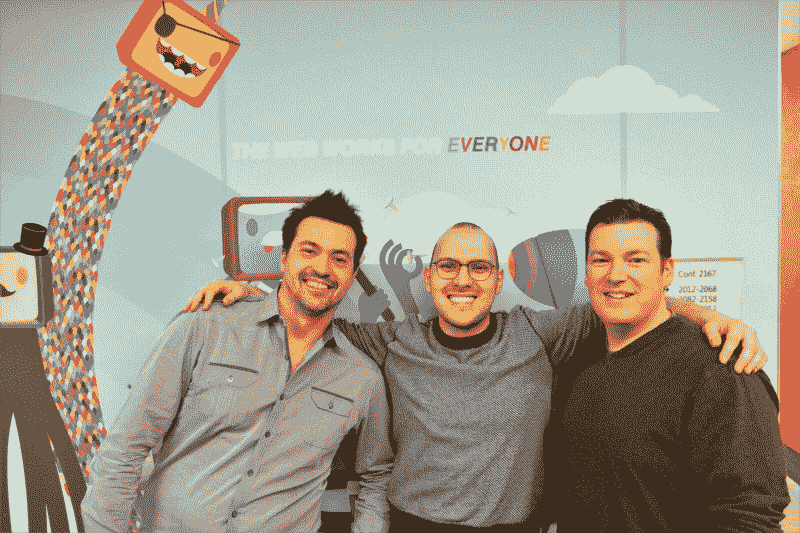
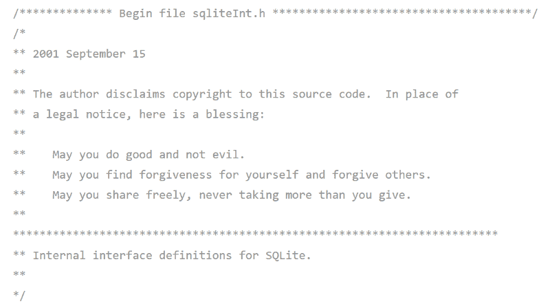

# 连线之间:微软 Edge 性能项目经理诺兰·劳森访谈

> 原文：<https://www.freecodecamp.org/news/between-the-wires-an-interview-with-microsoft-edge-performance-pm-nolan-lawson-ca3240dec2eb/>

薇薇安·克伦威尔

# 连线之间:微软 Edge 性能项目经理诺兰·劳森访谈

*我采访了微软 Edge 的网络性能项目经理诺兰·劳森。他还和其他人一起维护流行的开源库 [PouchDB](https://github.com/pouchdb/pouchdb) 。*

#### 告诉我们一点关于你的童年和你在哪里长大的。

我在西雅图附近一个叫布雷默顿的海军小镇长大。我有一个非常典型的中产阶级教养:我的继父在海军造船厂工作，我的母亲是一名学校护士，后来成为一名学校教师。

小时候，我是一个如饥似渴的读者。我读了很多奇幻和恐怖书籍，从《纳尼亚传奇》到斯蒂芬·金的《万物》。我的老师怀疑我读成人恐怖小说，但他们容忍了，因为至少我在阅读。我也非常喜欢电子游戏。

由于早年在童子军的经历，我非常喜欢户外活动。我也经常去法国，因为我的生父是法国人。这让我对旅行有点着迷，成年后，我搬到了渥太华、日内瓦，然后去了纽约，最后才回到西雅图。我每隔几年就搬一次家，只是一时兴起。

(Nolan, 2009)

在某个时候，我意识到回家，离家人近一点是个好主意。我的女朋友也想在那里定居，因为她的家人也来自那里。我开始在西雅图周围找工作，微软成了一个相当明显的选择。

#### 告诉我们一点你的第一次编程经历。

当我六七岁的时候，我叔叔给了我一台旧的 MS-DOS 机，配有一个 5 英寸的软驱。以今天的标准来看，它是古老的。它基本上有两个游戏:[蛇](https://en.wikipedia.org/wiki/Snake_(video_game))和[大猩猩](https://en.wikipedia.org/wiki/Gorillas_(video_game))，它实际上显示了它们启动前的基本代码。这两场比赛是我唯一能想到的。

(8-inch, 5¼-inch, and 3½-inch floppy disks)

(Gorillas, is a [video game](https://en.wikipedia.org/wiki/Video_game "Video game") first distributed with [MS-DOS 5](https://en.wikipedia.org/wiki/MS-DOS "MS-DOS") and published in 1991 by [IBM](https://en.wikipedia.org/wiki/IBM "IBM") corporation.)

> "直到上了大学，我才重新开始编程。"

我还有一本关于 MS-DOS 编程的书，所以我花了一些时间写了一个非常简单的批处理脚本。当计算机启动时，它会打印:

“你好，诺兰。你想玩哪个游戏？1.大猩猩 2。蛇？”

你可以根据你想玩的游戏输入一个或两个。我为那个剧本感到非常自豪！

当我大约九岁的时候，我的托儿所有一台类似的电脑，上面有更多的游戏，所以我决定把我的批处理技能应用到它上面。不幸的是，我把电脑搞坏了，让你不能再玩游戏了。我感到内疚，这让我有点害怕。直到上了大学，我才重新开始编程。

作为一名大学生，我学习语言学，主要是因为我当时正在学习法语和日语。我对语言很着迷。但毕业后，我意识到在语言学领域找工作有点难。然而，事实证明，我在华盛顿大学的系里有一个计算语言学的硕士项目，从职业角度来看，这似乎是一个很好的选择。这就是我最终重返编程的方式。

#### 是什么促使你加入 PouchDB 的？

2012 年左右，我在日内瓦的一个非政府组织工作。我们正在为一个使用 [CouchDB](http://couchdb.apache.org/) 的客户构建一个 web 应用程序。后来，我开始用 CouchDB 做兼职项目。通过这个我找到了 [PouchDB](https://pouchdb.com) ，它可以在服务器上的 CouchDB 和浏览器中的 I [ndexedDB](https://www.w3.org/TR/IndexedDB/) 之间同步数据。我觉得这太棒了。

(Pouchdb logo)

在进行那个项目时，我注意到 PouchDB 中有几个 bug。我意识到我知道足够多的 Android 和 JavaScript 来解决这些错误。最终，我修复了更多的 bug，并更频繁地为项目做贡献。2014 年初，我成为了主要的[贡献者](https://github.com/pouchdb/pouchdb/graphs/contributors)之一，现在依然如此。

PouchDB 如何起步的故事非常有趣。早在 2010 年， [Mikeal Rogers](https://twitter.com/mikeal) 做了一个名为[IDB touch](https://github.com/pouchdb/pouchdb/commit/d600081962d3f54b410e5cfcf78cd413ad94abb9)的一次性实验，这个实验只在 Firefox Nightly 上有效，因为 IndexedDB 在当时太新了。[马克斯·奥格登](https://twitter.com/denormalize)后来把它改名为 PouchDB，当时他在三藩市骑自行车购物，想出了这个名字“[便携式沙发](https://twitter.com/denormalize/status/452906716426797056)然后在 Mozilla 工作的 Dale Harvey 接手了这个项目，做了大量的工作让它在 Firefox 和 Chrome 上运行良好。

(source: [https://twitter.com/denormalize/status/452906716426797056)](https://twitter.com/denormalize/status/452906716426797056))

当我在 2013 年末加入这个项目时，我希望 PouchDB 可以在所有浏览器中工作，比如 jQuery，但不能用于数据库。我认为人们应该可以把它放进去，而且它应该可以在旧版本的 Android、IE 和 Safari 上“正常工作”。我早期的很多工作都是关于跨浏览器兼容性的，这确实帮助 PouchDB 变得更加流行。

PouchDB 是一个很好的例子，说明了 IndexedDB 作者在编写规范时最初的意图。本着可扩展网络宣言的精神，他们希望人们在此基础上建立图书馆。最初的规范作者 Nikunj Mehta 甚至怀疑是否有人会写一个[“JavaScript couch db”](http://web.archive.org/web/20120430114822/http://blog.o-micron.com/2009/09/now-published-alternative-to-sql-for.html)如今，有很多有趣的库建立在 IndexedDB 之上，包括 PouchDB、[local feed](https://github.com/localForage/localForage)、 [Dexie.js](http://dexie.org/) 和 [Lovefield](https://github.com/google/lovefield) ，这些库提供了一种对开发者更加友好的体验。

#### PouchDB 是否向大公司和社区寻求资助？

> “我一直有一个有点理想化的想法，PouchDB 应该是一个不受金钱腐蚀的激情项目。我不想被一个或另一个组织左右，去推动它向某个特定的方向发展。它应该是对用户最好的。”

我们在很早的时候，大约在 2013 年，就试图寻求资金。戴尔建立了一个赏金系统，每个 GitHub 问题都可能有一个通知，上面写着:“嘿，如果你解决了这个问题，就有赏金。”这有一些问题。

随机的人可以进来提交一份 PR 来解决一个赏金问题。我记得有一个问题，公关没有完全解决，但它已经解决了一半，所以我进去解决了另一半。当时，还不清楚奖金应该给谁。应该一分为二吗？最后，提供赏金的人甚至没有支付赏金。所以这个系统不太好用，我们就报废了。

今天，PouchDB 已经发展到超过 200 名贡献者，但本质上戴尔是 T2 BDFL，我是中尉。最近我们又开始了[融资讨论](https://github.com/pouchdb/pouchdb/issues/6229)，但是我们需要首先建立一个正式的治理模式。这对企业来说尤为重要。IBM 通过 [Cloudant](https://cloudant.com/) 对 CouchDB 进行了大量投资，希望能够告诉他们的客户 CouchDB 和 PouchDB 是他们问题的坚如磐石的解决方案。然而，尽管 CouchDB 隶属于 Apache Foundation，并且有非常清晰的治理模型，PouchDB 却没有。因此，一些企业客户可能会有点担心。

(PouchDB team reunion 2015, Nolan Lawson, Gregor Martynus and Calvin Metcalf)

我一直有一个有点理想化的想法，PouchDB 应该是一个不受金钱腐蚀的激情项目。我不想被一个或另一个组织左右，去推动它向某个特定的方向发展。它应该是对用户最好的。然而，我们正处于项目的成熟期，我们需要开始问一些困难的问题。例如，我们想弄清楚如何筹集和分配资金，这样我们就可以公平地把钱分给捐款人。我们现在正在探索各种选择，但我们还没有做出任何承诺。

#### 当谈到 OSS 可持续性时，你从 PouchDB 项目中学到了什么？

> “这就是为什么我认为记住初学者是什么样子很重要。当你刚刚起步时，甚至与开源维护者交谈都会令人生畏。”

PouchDB 是我的第一个大型开源项目。我得把它交给戴尔。他从一开始就是我的导师。他教会了我如何在开源项目中互动的所有基础知识。

(Dale Harvey)

一开始，甚至只是在 IRC 上与戴尔·哈维交谈都令人生畏。他是那种在会议上发言的人；人们尊敬他。我只是网络上的一个普通人。但是戴尔对新的贡献者总是很有耐心。他会回答每个人的问题。即使他认为某件事是个坏主意，他也会委婉地告诉他们。慢慢地，我意识到戴尔只是一个普通人，他很高兴有人参与这个项目。

(Dale commenting on Github issue)

这就是为什么我认为记住初学者是什么样子是很重要的。当你刚刚起步的时候，甚至和一个开源维护者交谈都是令人生畏的。我从戴尔那里学会了成为一个有思想的维护者，并且总是鼓励人们做出贡献。

如今的 PouchDB 已经非常成熟，需要海量的知识才能入门，这对新的贡献者来说是一个挑战。我想解决的一件事是让新来者更容易加入。这是我认为现在缺少的东西。

#### “线下先行”是我们从 2010 年就开始讲的。你认为我们最终准备好了吗？当今 it 面临的主要挑战是什么？

线下真的很难。这是大学计算机科学教育中缺少的东西之一。人们没有意识到的是，当你在构建一个离线优先的应用程序时，你实际上是在构建一个分布式系统:客户机和服务器。仅仅通过在这两个节点上存储数据，你就有了[上限定理](https://en.wikipedia.org/wiki/CAP_theorem)的所有理论问题:一致性、可用性和分区容差——选择两个。

因此，如果你正在建立这样一个系统，但没有意识到它的存在，你可能最终只是拼凑了一些东西。你可能认为你已经 100%完成了，但实际上你只完成了 90%，剩下的 10%可能需要几年才能完成。修复 PouchDB 的所有边缘案例花费了数年时间。

我们试图用 PouchDB 做的事情之一是提高意识，帮助人们思考离线优先架构的内在问题。PouchDB 有一个内置的冲突管理概念，因为 CouchDB 从一开始就考虑了这些问题。它采用[多版本并发控制](https://en.wikipedia.org/wiki/Multiversion_concurrency_control)模型设计，回答了客户端和服务器不同步会发生什么的问题。

用户体验是 offline-first 还没有真正解决的另一个大问题。我认为像[渐进式网络应用](https://developers.google.com/web/progressive-web-apps/)这样的新模式将迫使我们开始思考如何与用户沟通。有一个来自[杰西比奇](https://twitter.com/jessebeach)的[很棒的帖子](https://medium.com/@jessebeach/my-biggest-takeaway-from-the-second-offline-camp-in-santa-margarita-ca-d0dd930cd02b#.rkrwj3sbw)，她谈到了如何有效地交流离线状态，在[离线营](http://offlinefirst.org/camp/)我们讨论了其中的一些技巧，比如当应用离线时将用户界面切换到灰度。它不像警告那样消极或不和谐，但它微妙地表明你离线了。

(Nolan at Offline Camp with Jesse Beach and others, 2016)

离线优先已经有了很大的进步，但它仍然肯定是一个未解决的问题。

#### 是什么让你决定加入微软 Edge 团队？你对前六个月的印象是什么，从小创业到大机构？

> “但现在整个公司都有一种普遍的感觉，当我们透明并寻求社区反馈时，对我们来说效果很好。”

我来到微软 Edge 是因为我想帮助让网络平台变得更好。我认为这将是一个很好的机会来建立我所热衷的许多标准。例如，我们正在开发[服务人员](https://www.w3.org/TR/service-workers/)和[渐进式网络应用](https://developers.google.com/web/progressive-web-apps/)，以及对 IndexedDB 的改进。我想在第一层看到这些事情发生。

微软很值得关注，因为它是一家转型中的公司。它正从相当封闭走向更加开放。某些团队比其他团队更喜欢这种开放性，甚至同一团队中的某些人也是如此。但是现在整个公司有一种普遍的感觉，当我们变得透明并从社区中寻求反馈时，对我们来说效果很好。

我仍然积极参与 PouchDB 项目，但我倾向于将我在微软和 PouchDB 的工作分开。我会在上班的路上对 GitHub 问题进行分类，然后在晚上或周末为 PouchDB 编写一些程序。但我发现这两者正以积极的方式越来越融合在一起。例如，在处理 PouchDB 问题时，我可能会在 IndexedDB on Edge 中发现一个 bug。

#### 向我们介绍一下在 Microsoft Edge 担任绩效项目经理的一天。

我是性能团队的一员，所以我的大部分工作都围绕着识别浏览器中的性能问题，并将这些问题传达给 web 开发人员和浏览器团队。

(Nolan with Todd Reifsteck and Rob Hwacinski of the Microsoft Edge Team)

我一直在做的一个项目是“性能俱乐部”，我们邀请网络团队来谈论他们网站的性能。通常这些是微软的网站，如 Outlook.com 和 MSN，但有时他们也是外部合作伙伴。当他们进来时，我们会使用构建浏览器本身所用的工具对网站进行深入的性能分析。然后我们给他们提供性能建议，这样他们就可以回去更快地制作他们的网站。我还将网站作者报告的问题归档，并编写测试用例。

表演俱乐部现在是私人的。不是每个人都想把自己网站上不值得骄傲的部分拿出来公开展示；就像晾你的脏衣服一样。已经有一些关于匿名化和发布数据的讨论，但是不暴露你正在分析的网站是非常困难的。最近有一些关于公共绩效审计的争议；并不总是受欢迎的。

#### 鉴于最近的热烈讨论，浏览器厂商和框架作者如何在 web 性能上更紧密地合作？

> “……这里能提供最大价值的人是 JavaScript 库和框架作者。他们可以做到不偏不倚，比较不同浏览器的性能，这对浏览器厂商来说非常有价值。”

我认为对于 web 开发人员来说，理解为什么性能是一个如此敏感的话题是很重要的。浏览器不在 API 特性上竞争——当我们同意实现 web 标准时，我们停止了这样做——但是浏览器确实在性能上竞争。速度是浏览器的一个巨大卖点。每个浏览器都声称自己是最快的，有点像麦当劳和汉堡王都声称自己有最好的汉堡。显然他们不可能都是对的。

一般来说，浏览器厂商只会公开谈论他们做得好的地方。如果你和在浏览器团队工作的人私下交谈，他们可以很容易地告诉你浏览器做得好的 50 件事和做得不好的 50 件事；他们熟记于心。但在公开场合，我们倾向于只谈论我们做得好的东西，因为那里有商业含义。

例如，当 WebKit 团队推出了[速度计](https://goo.gl/NLU9ch)基准测试或[运动标记](https://webkit.org/blog/6943/motionmark-a-new-graphics-benchmark/)基准测试时，Safari 胜出就不足为奇了。同样，当微软写一篇关于我们如何拥有一个伟大的 JavaScript 引擎的博文时，我们倾向于谈论 [Octane](https://github.com/chromium/octane) 和 [JetStream](https://webkit.org/blog/3418/introducing-the-jetstream-benchmark-suite/) 。惊喜，惊喜:我们在这些基准上取得了胜利。

我认为这里能提供最大价值的人是 JavaScript 库和框架作者。他们可以不偏不倚地比较不同浏览器的性能，这对浏览器厂商来说非常有价值。不幸的是，我觉得他们中的许多人在这方面可以做得更好。

如今，人们对 web 性能非常感兴趣，你会看到许多 JavaScript 框架在性能上相互竞争，比如 [React](https://github.com/facebook/react) 、 [Inferno](https://github.com/infernojs/inferno) 、 [Preact](https://github.com/developit/preact) 、 [Vue](http://vuejs.org/) 、[svelite](http://svelte.technology/)等等。但当你看他们的基准测试时，他们通常只在 Chrome 或*也许是* Mobile Safari 中测试。有时他们甚至不指定在哪个浏览器上测试，所以你只能假设它是 Chrome。

一个与这种趋势背道而驰的框架，我非常喜欢，是 [Ember](http://emberjs.com/) 。他们创建了自己的基准，T2 Ember 基准 T3，他们有时会在 Twitter 上指出 Chrome 在基准测试中不如 Safari，也许 T4 会对此表示惊讶。

这对浏览器厂商来说是很好的反馈。即使我们不公开表达我们对基准的感受，我们也可能会在内部使用它，并努力使我们的浏览器变得更好。我希望看到更多的跨浏览器基准测试，以及 JavaScript 框架作者对跨浏览器测试价值的更多认识。这是我现在看到的最大的缺失。

Edge 拥有相当不错的浏览器市场份额；反正在进步。我认为仅仅因为浏览器的市场份额太低而忽视它们是不安全的，尤其是因为许多 web 开发者对市场份额的理解非常扭曲。Windows 是世界上占主导地位的操作系统；大约 90%的桌面用户使用它。安卓是[到目前为止这个星球上最受欢迎的移动操作系统。](https://www.netmarketshare.com/operating-system-market-share.aspx?qprid=8&qpcustomd=1)

不过，如果你只看网络开发者大会，你可能会认为这个世界纯粹是 Mac，或者每个人都在使用 Chrome，或者大多数人都带着 iPhone。但现实却大相径庭。我要说，如果 web 开发者生活在那个泡沫中，并假设其他人也生活在那个泡沫中，那么他们对用户是一种极大的伤害。

#### 除了编程，你还有什么其他爱好或兴趣？

我弹一点吉他，唱一点，主要是为自己。我有一个 YouTube 频道，在那里我上传了一些我的表演。我不公开表演。

#### 我对电子竞技真的很感兴趣。我花很多时间看超级粉碎兄弟锦标赛或看视频游戏极速奔跑。极速跑其实让我想起了很多浏览器性能。你试图尽可能快地优化这个东西，有时你做了很多手脚，比如让你的角色穿墙而过。有时候，我发现一个精心设计的网站就像一次精心设计的速度赛跑——你会为了领先而作弊。看到相似之处有点好笑。

#### 谁是你的编程英雄？

我真的很钦佩 SQLite 的创始人 D. Richard Hipp，他可以说是这个星球上最流行的数据库。SQLite 是一款严谨的软件，其测试代码[是代码](https://www.sqlite.org/testing.html)的 745 倍。你可以把那东西送上月球。

Richard Hipp 也是一个编程文艺复兴时期的人；他实现了很多有趣的东西。他写了一整套版本控制系统叫做 [Fossil](http://fossil-scm.org/index.html/doc/trunk/www/index.wiki) 。他对 Git 不满意，所以他写了一个完整的版本控制系统，这就是用于 SQLite 的版本控制系统。

如果您查看 SQLite 源代码，您还会发现我一直最喜欢的开源许可证，上面写着“代替许可证，我为您提供这个祈祷。”真的很漂亮，像一首诗。

(SQLite license file ♥)

然而，尽管取得了成功，Hipp 也非常谦虚。他从不在任何采访中自夸。我发现看到有人如此谦逊，却又如此精通软件世界，这很鼓舞人心。

这个项目得到了来自[frontendmasters.com](https://frontendmasters.com/)、 [egghead.io](https://egghead.io/) 、[微软 Edge](https://www.microsoft.com/en-us/windows/microsoft-edge) 和[谷歌开发者](https://developers.google.com/)的赞助。

Our sponsors.

[捐款支持本项目](https://opencollective.com/betweenthewires)。

要推荐一位您希望听到其声音的制造商，请填写此[表格](https://goo.gl/forms/XhR1IyLXJHNMljcp1)。

您也可以在 Twitter 上向 betweenthewires 发送反馈。