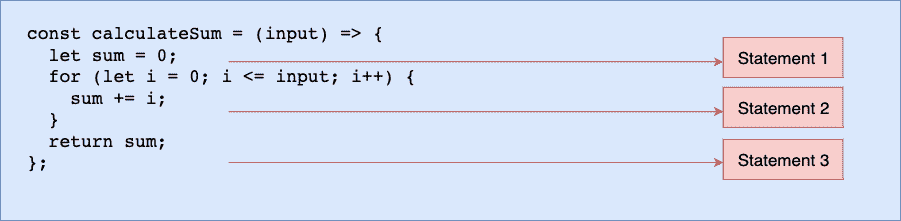
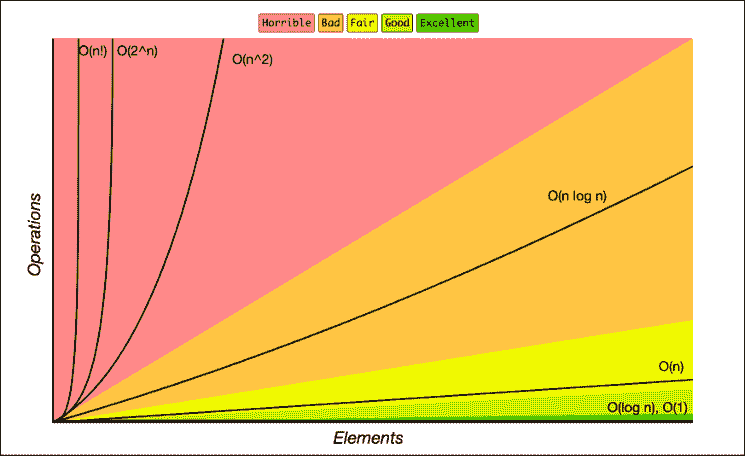

# 大 O 备忘单-时间复杂性图表

> 原文：<https://www.freecodecamp.org/news/big-o-cheat-sheet-time-complexity-chart/>

算法是用于解决特定问题的一组明确定义的指令。你可以用各种方法解决这些问题。

这意味着你用来得到相同解决方案的方法可能与我的不同，但是我们应该得到相同的结果。

因为解决一个问题有各种各样的方法，所以必须有一种方法从性能和效率(你的算法运行/执行所需要的时间和它所消耗的内存总量)的角度来评估这些解决方案或算法。

这对程序员来说至关重要，以确保他们的应用程序正常运行，并帮助他们编写干净的代码。

这就是大 O 符号的用武之地。大 O 符号是一个衡量算法效率的指标。它允许您估计您的代码将在不同的输入集上运行多长时间，并度量随着输入大小的增加，您的代码的伸缩效率如何。

## 什么是大 O？

大 O，也称为大 O 符号，代表算法最坏情况的复杂度。它使用代数术语来描述算法的复杂性。

Big O 通过识别算法的性能如何随着输入大小的增长而变化，来定义执行算法所需的运行时间。但是它没有告诉你你的算法的运行时间有多快。

大 O 符号使用时间和空间复杂度来衡量算法的效率和性能。

### 什么是时空复杂度？

影响程序性能和效率的一个主要潜在因素是您使用的硬件、操作系统和 CPU。

但是当你分析一个算法的性能时，你不会考虑这一点。相反，作为输入大小函数的时间和空间复杂度才是重要的。

算法的时间复杂度指定了执行一个算法**需要多长时间，作为其输入大小**的函数。类似地，算法的空间复杂度将执行算法所需的空间或内存总量**指定为输入**大小的函数。

在本指南中，我们将重点关注时间复杂性。这将是一个深入的备忘单，帮助你理解如何计算任何算法的时间复杂度。

### 为什么时间复杂度是其输入大小的函数？

为了更好地理解“作为输入大小的函数”的概念，假设您有一个算法可以根据您的输入计算数字的总和。如果你的输入是 4，它会加 1+2+3+4 输出 10；如果你的输入是 5，它会输出 15(意思是 1+2+3+4+5)。

```
const calculateSum = (input) => {
  let sum = 0;
  for (let i = 0; i <= input; i++) {
    sum += i;
  }
  return sum;
}; 
```

在上面的代码中，我们有三个语句:



看上面的图像，我们只有三个语句。尽管如此，因为有一个循环，第二条语句将根据输入大小执行，所以如果输入是 4，第二条语句(语句 2)将执行 4 次，这意味着整个算法将运行 6(4+2)次。

简单地说，算法将运行 **input + 2** 次，其中 input 可以是任何数字。这表明**它是用输入来表达的。换句话说，它是输入大小**的函数。

在大 O 中，有六种主要类型的复杂性(时间和空间):

*   常数:O(1)
*   线性时间:O(n)
*   对数时间:O(n log n)
*   二次时间:O(n^2)
*   指数时间:O(2^n)
*   阶乘时间:O(n！)

在我们看每个时间复杂度的例子之前，让我们先理解大 O 时间复杂度图。

## 大 O 复杂性图表

大 O 图，也称为大 O 图，是一种渐近符号，用于表示算法的复杂性或其性能，作为输入大小的函数。

这有助于程序员识别并完全理解最坏的情况以及算法所需的执行时间或内存。

下图的[说明了大 O 的复杂性:](https://www.freecodecamp.org/news/big-o-cheat-sheet-time-complexity-chart/bigocheatsheet.com)



上面的大 O 图显示，代表恒定时间复杂度的 O(1)是最好的。这意味着您的算法只处理一条语句，没有任何迭代。然后是 O(log n)，很好，别人也喜欢，如下图:

*   O(1) -优秀/最佳
*   **O(log n)** -好
*   **O(n)** -尚可
*   **O(n log n)** -坏
*   **O(n^2)** ， **O(2^n)** 和 **O(n！)** -可怕/最糟糕

你现在理解了各种各样的时间复杂性，你可以识别最好的、好的和公平的，以及坏的和最差的(总是避免坏的和最差的时间复杂性)。

我想到的下一个问题是，假设这是一个备忘单，你如何知道哪个算法具有哪个时间复杂度😂。

*   当您的计算不依赖于输入大小时，它是一个常数时间复杂度(O(1))。
*   当输入大小减少一半时，可能是在迭代、处理递归或其他什么的时候，这是一个对数时间复杂度(O(log n))。
*   当算法中只有一个循环时，它是线性时间复杂度(O(n))。
*   当你的算法中有嵌套循环时，意味着循环中的循环，这是二次时间复杂度(O(n^2)).
*   当投入每增加一倍，增长率就增加一倍，这就是指数时间复杂性(O2^n).)

让我们从用例子描述每次的复杂性开始。需要注意的是，我将在本指南的例子中使用 JavaScript，但是只要你理解这个概念和每次的复杂性，编程语言并不重要。

## 时间复杂度很高的例子

### 常数时间:O(1)

当您的算法不依赖于输入大小 n 时，它被称为具有 O(1)阶的恒定时间复杂度。这意味着无论输入大小如何，运行时间总是相同的。

例如，如果算法要返回数组的第一个元素。即使数组有 100 万个元素，如果使用这种方法，时间复杂度也将保持不变:

```
const firstElement = (array) => {
  return array[0];
};

let score = [12, 55, 67, 94, 22];
console.log(firstElement(score)); // 12 
```

上面的函数将只需要一个执行步骤，这意味着该函数处于时间复杂度为 O(1)的常数时间中。

但是正如我前面所说的，在编程中有各种方法可以实现解决方案。另一个程序员可能决定在返回第一个元素之前先遍历数组:

```
const firstElement = (array) => {
  for (let i = 0; i < array.length; i++) {
    return array[0];
  }
};

let score = [12, 55, 67, 94, 22];
console.log(firstElement(score)); // 12 
```

这只是一个例子，可能没有人会这样做。但如果存在循环，这就不再是常数时间，而是现在时间复杂度为 O(n)的线性时间。

### 线性时间:O(n)

当算法的运行时间随着输入的大小线性增加时，就会得到线性时间复杂度。这意味着，当一个函数有一个迭代，迭代的输入大小为 n 时，它的时间复杂度为 O(n)阶。

例如，如果一个算法要返回任何输入数字的阶乘。这意味着如果你输入 5，那么你要循环 1 乘以 2 乘以 3 乘以 4 再乘以 5，然后输出 120:

```
const calcFactorial = (n) => {
  let factorial = 1;
  for (let i = 2; i <= n; i++) {
    factorial = factorial * i;
  }
  return factorial;
};

console.log(calcFactorial(5)); // 120 
```

运行时间依赖于输入大小的事实意味着时间复杂度与 O(n)阶成线性关系。

### 对数时间:O(log n)

这类似于线性时间复杂度，除了运行时间不依赖于输入大小，而是依赖于输入大小的一半。当输入大小在每次迭代或每步减少时，算法被称为具有对数时间复杂度。

这是第二个最好的方法，因为你的程序只运行一半的输入大小，而不是完整的大小。毕竟，输入大小随着每次迭代而减小。

一个很好的例子是二分搜索法函数，它根据目标值划分排序后的数组。

例如，假设您使用二分搜索法算法来查找数组中给定元素的索引:

```
const binarySearch = (array, target) => {
  let firstIndex = 0;
  let lastIndex = array.length - 1;
  while (firstIndex <= lastIndex) {
    let middleIndex = Math.floor((firstIndex + lastIndex) / 2);

    if (array[middleIndex] === target) {
      return middleIndex;
    }

    if (array[middleIndex] > target) {
      lastIndex = middleIndex - 1;
    } else {
      firstIndex = middleIndex + 1;
    }
  }
  return -1;
};

let score = [12, 22, 45, 67, 96];
console.log(binarySearch(score, 96)); 
```

在上面的代码中，因为它是一个二分搜索法，所以首先获取数组的中间索引，将其与目标值进行比较，如果相等，则返回中间索引。否则，您必须检查目标值是大于还是小于中间值，以调整第一个和最后一个索引，从而将输入大小减半。

因为对于每一次迭代，输入大小减少一半，所以时间复杂度是 O 阶的对数(log n)。

### 二次时间:O(n^2)

当你执行嵌套迭代时，意味着在一个循环中有一个循环，时间复杂度是二次的，这是可怕的。

解释这一点的最佳方式是，如果你有一个包含 n 个元素的数组。对于外部循环的每次迭代，外部循环将运行 n 次，内部循环将运行 n 次，这将给出总的 n^2 印数。如果数组有十项，十项将打印 100 次(10^2).

下面是 Jared Nielsen 的一个例子，当两个元素相似时，比较数组中的每个元素以输出索引:

```
const matchElements = (array) => {
  for (let i = 0; i < array.length; i++) {
    for (let j = 0; j < array.length; j++) {
      if (i !== j && array[i] === array[j]) {
        return `Match found at ${i} and ${j}`;
      }
    }
  }
  return "No matches found 😞";
};

const fruit = ["🍓", "🍐", "🍊", "🍌", "🍍", "🍑", "🍎", "🍈", "🍊", "🍇"];
console.log(matchElements(fruit)); // "Match found at 2 and 8" 
```

在上面的示例中，有一个嵌套循环，这意味着时间复杂度与 O(n^2).阶数成二次关系

### 指数时间:O(2^n)

当增长率随着输入(n)的每一次增加而加倍时，您会得到指数级的时间复杂度，这通常会遍历输入元素的所有子集。每当一个输入单元增加 1，执行的操作数就增加一倍。

递归斐波那契数列就是一个很好的例子。假设给你一个数字，你想找到斐波那契数列的第 n 个元素。

斐波纳契数列是一个数学数列，其中每个数字是前面两个数字的和，0 和 1 是前两个数字。序列中的第三个数字是 1，第四个是 2，第五个是 3，依此类推...(0, 1, 1, 2, 3, 5, 8, 13, …).

这意味着如果你传入 6，那么斐波那契数列中的第 6 个元素就是 8:

```
const recursiveFibonacci = (n) => {
  if (n < 2) {
    return n;
  }
  return recursiveFibonacci(n - 1) + recursiveFibonacci(n - 2);
};

console.log(recursiveFibonacci(6)); // 8 
```

在上面的代码中，该算法指定了一个增长率，该增长率在每次添加输入数据集时都会翻倍。这意味着时间复杂度与 O(2^n).阶数成指数关系

## 包扎

在本指南中，您已经了解了时间复杂性是什么，如何使用大 O 符号来确定性能，以及示例中存在的各种时间复杂性。

你可以通过 freeCodeCamp 的 [JavaScript 算法和数据结构课程](https://www.freecodecamp.org/learn/javascript-algorithms-and-data-structures/)了解更多。

快乐学习！