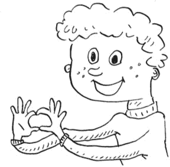
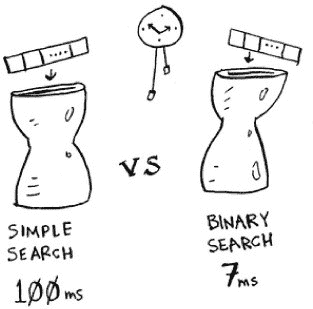
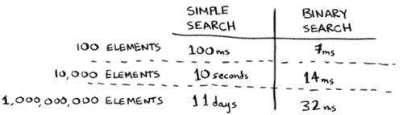
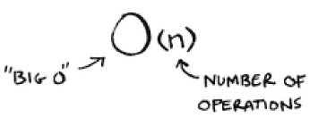
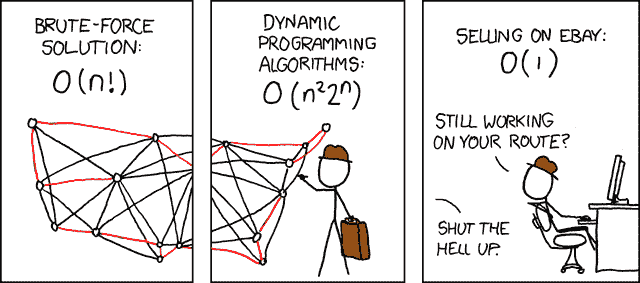
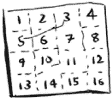
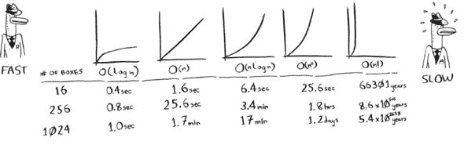

# 大 O 符号—用插图和视频简单解释

> 原文：<https://www.freecodecamp.org/news/big-o-notation-simply-explained-with-illustrations-and-video-87d5a71c0174/>

Illustration (and most in this article) by Adit Bhargava

大 O 符号用来表示一个算法有多快。这在评估别人的算法和评估你自己的算法时很重要！在本文中，我将解释什么是大 O 符号，并给出使用它的算法最常见的运行时间列表。

### 算法运行时间以不同的速度增长

My son explains big ‘O’ notation.

我儿子犹大有很多玩具。事实上，他已经获得了一个*亿*的玩具！如果一个孩子是双方家庭中的第一个孙子，你会惊讶地发现他这么快就能得到这么多玩具。？？

总之，犹大有个问题。当他的朋友来访并想玩某个特定的玩具时，可能要花很长时间才能找到这个玩具。所以他想创建一个搜索算法来帮助他尽快找到一个特定的玩具。他试图在两种不同的搜索算法之间做出选择:简单搜索和二分搜索法。(不熟悉这些算法也不用担心。)

选择的算法需要既快速又正确。一方面，二分搜索法更快。在他的朋友厌倦寻找玩具之前，Judah 通常只有大约 3*0 秒*。另一方面，简单的搜索算法更容易编写，引入 bug 的机会也更少。如果他的朋友在他的代码中发现错误，那就太尴尬了！为了格外小心，Judah 决定用 100 个玩具的列表来计时这两个算法。

假设检查一个玩具需要 1 毫秒。使用简单搜索，Judah 必须检查 100 个玩具，因此搜索需要 100 毫秒来运行。另一方面，他只需要用二分搜索法检查 7 个玩具(log2 100 大约是 7，不要担心这个数学问题，因为它不是本文的重点)，所以搜索需要 7 毫秒来运行。但是真的，这个列表会有十亿个玩具。如果有，简单搜索需要多长时间？二分搜索法需要多长时间？

### 简单搜索与二分搜索法的运行时间，包含 100 个元素的列表

Judah 用 10 亿个玩具管理二分搜索法，它需要 30 毫秒(log2 1，000，000，000 大约是 30)。“32 ms！”他认为。“二分搜索法比简单搜索快 15 倍左右，因为简单搜索用了 100 个元素 100 ms，二分搜索法用了 7 ms，所以简单搜索会用 30 × 15 = 450 ms，对吧？不到 30 秒，我的朋友就会感到厌烦。”Judah 决定进行简单搜索。这是正确的选择吗？

不，事实证明，犹大错了，他失去了一个终生的朋友。？10 亿个项目的简单搜索的运行时间将是 10 亿毫秒，即 11 天！问题是，二分搜索法和简单搜索的运行时间不能以同样的速度增长。

运行时间以非常不同的速度增长！随着项目数量的增加，二分搜索法需要更多的时间来运行，但是简单搜索需要更多的时间来运行。因此，随着数字列表变得越来越大，二分搜索法突然变得比简单搜索快了很多。

所以犹大错了，二分搜索法总是比简单搜索快 15 倍。如果有 10 亿个玩具，它更像是快了 3300 万倍。

了解运行时间如何随着列表大小的增加而增加是非常重要的。这就是大 O 符号的由来。

大 O 符号告诉你一个算法有多快。例如，假设您有一个大小为 *n* 的列表。简单的搜索需要检查每个元素，所以需要进行 *n* 次操作。大 O 符号中的运行时间是 O( *n* )。

秒在哪里？没有——大 O 不会告诉你秒的速度。*大 O 符号让你比较运算次数。*它告诉你算法增长有多快。

再来做一个例子。二分搜索法需要 log *n* 操作来检查大小为 *n* 的列表。大 O 记数法的运行时间是多少？是 O(log *n* )。一般来说，大 O 符号是这样写的。

这告诉你一个算法将进行的运算次数。之所以称之为大 O 记法，是因为你在运算次数前面加了个“大 O”。

#### 大 O 建立了最坏情况下的运行时间

假设您使用简单搜索在用户数据库中查找用户。你知道简单的搜索需要 O( *n* )时间来运行，这意味着在最坏的情况下，你的算法将不得不检查数据库中的每个用户。在本例中，您要查找名为“aardvark213”的用户。这是列表中的第一个用户。所以你的算法不必查看每一个条目——它第一次尝试就找到了。算法花了 O( *n* 时间吗？还是因为第一次尝试就找到了人，所以花了 O(1)时间？

简单搜索仍然需要 O( *n* )时间。在这种情况下，算法立即找到了它正在寻找的东西。这是最好的情况。但是大 O 符号是关于*最坏情况*的场景。所以你可以说，在*最坏的情况下*，算法将不得不检查数据库中的每个用户一次。那是 O( *n* )时间。这是一个定心丸——你知道简单搜索永远不会比 O( *n* )时间慢。

### 一些常见的大运行时间

From [xkcd](https://xkcd.com/399/). If you don’t get the joke, learn more about the traveling salesman problem in my course from Manning Publications. :)

以下是你会经常遇到的五大运行时间，从最快到最慢排序如下:

*   O(log *n* )，又称*日志时间。*例如:二分搜索法。
*   O( *n* )，又称*线性时间*。例如:简单搜索。
*   O( *n* * log *n* )。例如:快速排序算法，如 quicksort。
*   O( *n* 2)。例子:一个缓慢的排序算法，如选择排序。
*   O( *n* ！).例子:一个非常慢的算法，就像旅行中的销售人员。

### 可视化不同的大 O 运行时间

假设你正在画一个由 16 个盒子组成的网格，你可以从 5 种不同的算法中进行选择。如果使用第一种算法，绘制网格将花费 O(log *n* )的时间。每秒可以做 10 次操作。用 O(log *n* )的时间，画一个 16 格的格子(log 16 底数 2 是 4)需要你 4 次运算。所以画网格要花你 0.4 秒。如果要画 1024 个盒子呢？你需要记录 1，024 = 10 次操作，或者 1 秒钟来绘制 1，024 个盒子的网格。这些数字使用的是第一种算法。

第二种算法比较慢:需要 O( *n* )时间。画 16 个盒子需要 16 次运算，画 1024 个盒子需要 1024 次运算。以秒为单位的时间是多少？

以下是为其余算法绘制网格所需的时间，从最快到最慢:

还有其他运行时间，但这是最常见的五个。

这是一种简化。在现实中，你不能把一个大的运行时间转换成这么多的操作，但是这是一个很好的估计。

### 结论

以下是主要要点:

*   算法速度不是以秒来衡量的，而是以运算次数的增长来衡量的。
*   相反，我们讨论的是随着输入的增加，算法的运行时间增加得有多快。
*   算法的运行时间用大 O 符号表示。
*   O(log *n* )比 O( *n* )快，但是随着你要搜索的项目列表的增长，它会变得更快。

这里有一个视频，涵盖了本文中的许多内容，甚至更多。

我希望这篇文章能让你对大 O 符号有更清晰的了解。这篇文章基于我在曼宁出版公司的视频课程中的一课，叫做运动中的算法。这个课程是基于阿迪特·巴尔加瓦的*惊人的*书[探索算法](https://www.amazon.com/gp/product/1617292230/ref=as_li_qf_sp_asin_il_tl?ie=UTF8&tag=bcar08-20&camp=1789&creative=9325&linkCode=as2&creativeASIN=1617292230&linkId=83471c93327ff24766dd812f9799f95a)。这篇文章里所有有趣的插图都是他画的。

如果你通过书本学得最好，[拿本书](https://www.amazon.com/gp/product/1617292230/ref=as_li_qf_sp_asin_il_tl?ie=UTF8&tag=bcar08-20&camp=1789&creative=9325&linkCode=as2&creativeASIN=1617292230&linkId=83471c93327ff24766dd812f9799f95a)！如果你通过视频学习效果最好，可以考虑[购买我的课程](https://www.manning.com/livevideo/algorithms-in-motion?a_aid=algmotion&a_bid=9022d293)。使用代码'**39 卡内斯**'可以享受我的课程 39%的优惠。