# 大 O 符号解释的是什么:空间和时间复杂性

> 原文：<https://www.freecodecamp.org/news/big-o-notation-why-it-matters-and-why-it-doesnt-1674cfa8a23c/>

你真的了解大 O 吗？如果是这样，那么这将在面试前刷新你的理解。如果没有，不要担心——来加入我们，为计算机科学而努力。

如果你上过一些算法相关的课程，你可能听说过术语**大 O 符号**。如果您还没有，我们将在这里回顾一下，然后更深入地了解它到底是什么。

大 O 符号是计算机科学家分析算法成本的最基本工具之一。对于软件工程师来说，深入理解也是一个很好的实践。

本文是在假设您已经处理了一些代码的情况下编写的。此外，一些深入的材料还需要高中数学基础，因此对初学者来说可能有点不太舒服。但是如果你准备好了，那就开始吧！

在本文中，我们将对大 O 记数法进行深入探讨。我们将从一个示例算法开始，打开我们的理解。然后，我们将进入数学领域，有一个正式的理解。之后，我们将回顾大 O 符号的一些常见变体。最后，我们将讨论大 O 在实际场景中的一些局限性。可以在下面找到目录。

### 目录

1.  什么是大 O 符号，为什么它很重要
2.  大 O 符号的形式定义
3.  大 O，小 O，ω&θ
4.  典型大型操作系统的复杂性比较
5.  时间和空间复杂性
6.  最佳、一般、最差、预期复杂性
7.  为什么大 O 不重要
8.  最后…

所以让我们开始吧。

### 1.什么是大 O 符号，为什么它很重要

> “大 O 符号是一种数学符号，它描述了当自变量趋向特定值或无穷大时函数的极限行为。它是保罗·巴赫曼、埃德蒙·朗道和其他人发明的记数法家族的一员，统称为巴赫曼-朗道记数法或渐近记数法
> 
> —维基百科对大 O 符号的定义

简单地说，大 O 符号使用代数术语来描述代码的复杂性。

要理解什么是大 O 记数法，我们可以看一下一个典型的例子，***【O(n)】***，通常读作 ***“大 O 平方”*** 。这里的字母***【n】***代表**输入大小**，而***【O()】***内的函数***【g(n)= n】***让我们了解了算法相对于输入大小的复杂程度。

复杂度为 O(n)的典型算法是**选择排序**算法。选择排序是一种排序算法，它遍历列表以确保索引 ***i*** 处的每个元素都是列表中最小/最大的元素*。下面的**代码笔**给出了一个直观的例子。*

 *[https://codepen.io/iMultiThinker/embed/preview/yEpRVr?height=300&slug-hash=yEpRVr&default-tabs=js,result&host=https://codepen.io](https://codepen.io/iMultiThinker/embed/preview/yEpRVr?height=300&slug-hash=yEpRVr&default-tabs=js,result&host=https://codepen.io)* 

*该算法可以用下面的代码来描述。为了确保第*个*元素是列表中第*个*最小的元素，该算法首先使用 for 循环遍历列表。然后，对于每个元素，它使用另一个 for 循环来查找列表剩余部分中的最小元素。*

```
*`SelectionSort(List) {
  for(i from 0 to List.Length) {
    SmallestElement = List[i]
    for(j from i to List.Length) {
      if(SmallestElement > List[j]) {
        SmallestElement = List[j]
      }
    }
    Swap(List[i], SmallestElement)
  }
}`*
```

*在这个场景中，我们考虑变量 ***列表*** 作为输入，因此输入大小 n 是列表 中元素的 ***数量。假设 if 语句和由 if 语句限定的值赋值需要恒定的时间。然后，我们可以通过分析语句执行的次数来找到 SelectionSort 函数的大 O 符号。****

*首先，内部 for 循环将语句运行 n 次。然后 ***i*** 递增后，内部 for 循环运行 n-1 次……直到运行一次，然后两个 for 循环都达到终止条件。*

*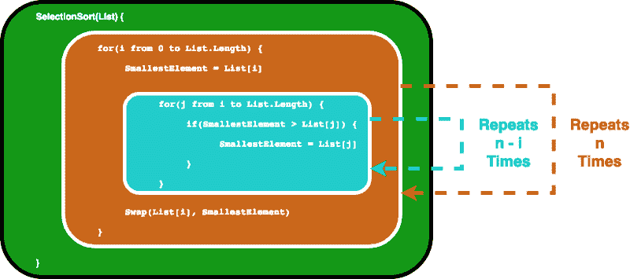

Selection Sort Loops Illustrated* 

*这实际上最终给了我们一个几何和，通过一些[高中数学](https://en.wikipedia.org/wiki/1_%2B_2_%2B_3_%2B_4_%2B_%E2%8B%AF)我们会发现内部循环将重复 1+2 … + n 次，这等于 n(n-1)/2 次。如果我们把它相乘，我们会得到 n /2-n/2。*

*我们计算大 O 记法时，只关心**主导项**，不关心系数。因此，我们把 n 作为最后一个大 O。我们把它写成 O(n)，它又读作*“大 O 的平方”*。*

*现在你可能会疑惑，这个 ***【显性术语】*** 到底是怎么回事？为什么我们不关心系数呢？别担心，我们会一个一个检查。开始的时候可能有点难以理解，但是当你阅读下一部分的时候就会明白很多。*

### *2.大 O 符号的形式定义*

*从前有一个印度国王，他想奖励一个聪明人的优秀。这位智者除了一些能填满一个棋盘的小麦之外，别无所求。*

*但他的规则是这样的:在第一个格子里，他想要 1 粒小麦，然后在第二个格子里要 2 粒，然后在下一个格子里要 4 粒……棋盘上的每一个格子都需要填满两倍于前一个格子的谷物。天真的国王毫不犹豫地同意了，认为这是一个微不足道的要求，直到他真的去尝试了…*

*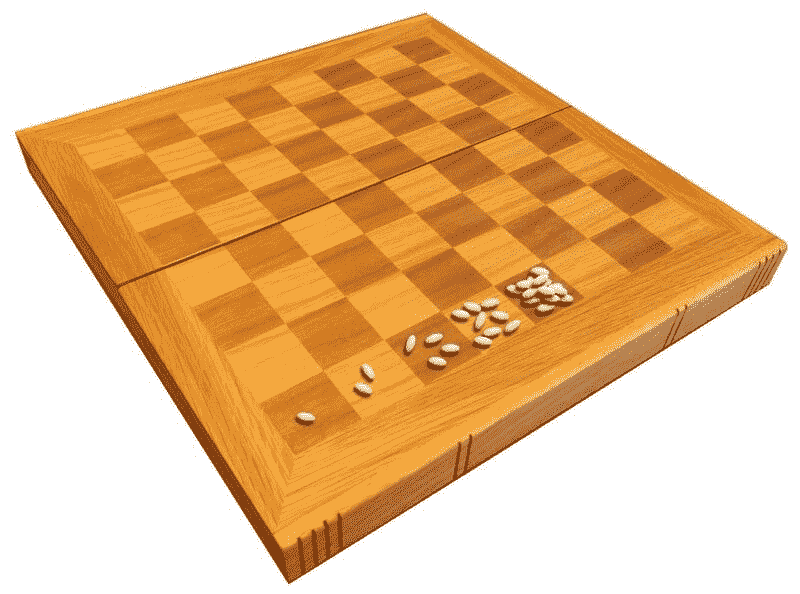

Wheat and Chess Board, Image from [Wikipedia](https://en.wikipedia.org/wiki/Wheat_and_chessboard_problem)* 

*那么国王欠智者多少粒小麦呢？我们知道国际象棋棋盘有 8 个正方形乘 8 个正方形，总共有 64 块瓷砖。所以最后一瓦总共应该有 **2⁶** 粒小麦。如果你在网上计算，整个棋盘的**，**，你最终会得到**1.8446744 * 10⁹**——大约是 18 后跟 18 个零。*

*假设每粒小麦重 0.01 克，那么我们就有 184，467，440，737 吨小麦。而且 1840 亿吨也不少了吧？*

*数字增长很快，随后是指数增长，不是吗？同样的逻辑也适用于计算机算法。如果完成一项任务所需的努力相对于投入的大小呈指数增长，它最终会变得非常大。*

*我们马上会看到，2ⁿ的增长比 n 快得多。现在，n = 64，64 的平方是 4096。如果你把那个数字加到 2⁶⁴上，它就会丢失在有效数字之外。*

*这就是为什么当我们看增长率时，我们只关心主导项。并且由于我们想要分析相对于输入大小的增长，仅乘以数字而不是随着输入大小增长的系数不包含有用的信息。*

*下面是大 O 的正式定义:*

*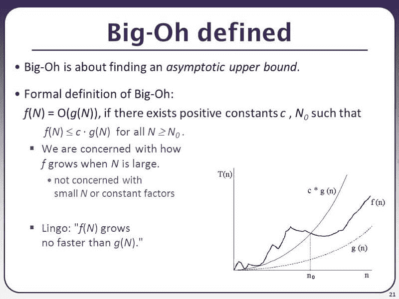

[CSE 373 Slides](https://slideplayer.com/slide/9739625/) from University of Washington* 

*当你需要进行数学证明时，形式定义是有用的。例如，选择排序的时间复杂度可以由函数 f(n) = n /2-n/2 来定义，正如我们在上一节中所讨论的。*

*如果我们让我们的函数 g(n)是 n，我们可以找到一个常数 c = 1，一个 N₀ = 0，只要 N > N₀，n 将总是大于 N /2-N/2。通过从两个函数中减去 N /2，我们可以很容易地证明这一点，然后我们可以很容易地看到，当 N > 0 时，N /2 > -N/2 为真。因此，我们可以得出结论，f(n) = O(n)，在另一个选择*排序中是“大 O* 的平方”。*

*你可能已经注意到了这里的一个小技巧。也就是说，如果你让 g(n)增长得超快，比任何东西都快，O(g(n))总是足够大。例如，对于任何多项式函数，你可以说它们是 O(2ⁿ，因为 2ⁿ最终会超越任何多项式。*

*数学上，你是对的，但一般当我们谈到大 O 时，我们想知道函数的**紧界**。当你阅读下一节时，你会对此有更多的了解。*

*但是在我们走之前，让我们用下面的问题来测试一下你的理解。答案将在后面的章节中找到，因此不会被轻易放弃。*

> ***问题:**图像由像素的 2D 阵列表示。如果使用嵌套的 for 循环遍历每个像素(即有一个 for 循环遍历所有列，然后内部有另一个 for 循环遍历所有行)，当图像被视为输入时，算法的时间复杂度是多少？*

### *3.大 O，小 O，ω&θ*

> *大 o:“f(N)是 O(g(n))”对于某些常数 c 和 N₀，f(N) ≤ cg(N)对于所有 n >N₀
> 
> ω:“f(n)是ω(g(n))”对于某些常数 c 和 n₀，f(N) ≥ cg(N)对于所有 n>
> 
> θ:“f(n)是θ(g(n))”对于 f(n)是 O(g(n))和 f(n)是ω(g(g(n)*

*简单地说:*

*   ***大 O (O())** 描述了复杂度的**上限**。*
*   ***Omega(ω())**描述了复杂度的**下界**。*
*   ***Theta(θ())**描述了复杂度的**精确界**。*
*   ***小 O (o())** 描述的是**上界，不包括精确上界**。*

*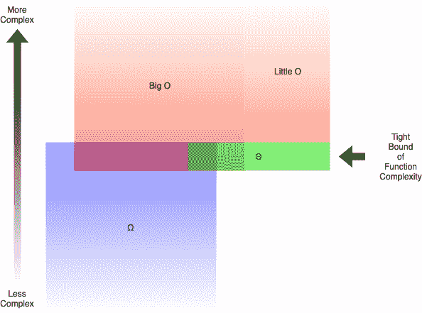

Relationships between Big O, Little O, Omega & Theta Illustrated* 

*比如函数 g(n) = n + 3n 是 O(n)，o(n⁴)，θ(n)，ω(n)。但是如果你说它是ω(n)或 O(n ),你仍然是对的。*

*一般来说，当我们谈论大 O 时，我们实际上指的是θ。当你给出一个比分析范围大得多的上界时，这是没有意义的。这类似于通过将∞放在较大的一边来解决不等式，这几乎总是正确的。*

*但是我们如何确定哪些函数比其他函数更复杂呢？在你将要阅读的下一节中，我们将详细了解这一点。*

### *4.典型大型操作系统的复杂性比较*

*当我们试图找出特定函数 g(n)的大 O 时，我们只关心函数的**主导项**。主导项是增长最快的项。*

*比如 n 比 n 增长得快，那么如果我们有 g(n) = n + 5n + 6 这样的东西，那就是大 O(n)。如果你以前学过一些微积分，这很类似于求分数多项式极限的捷径，你最终只关心分子和分母的主导项。*

*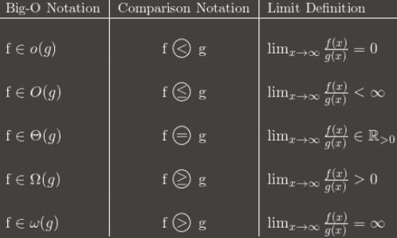

Another way to look at Big O, Image from [Stack Overflow](https://stackoverflow.com/questions/1364444/difference-between-big-o-and-little-o-notation)* 

*但是哪个函数比其他函数增长得更快呢？其实规矩还挺多的。*

*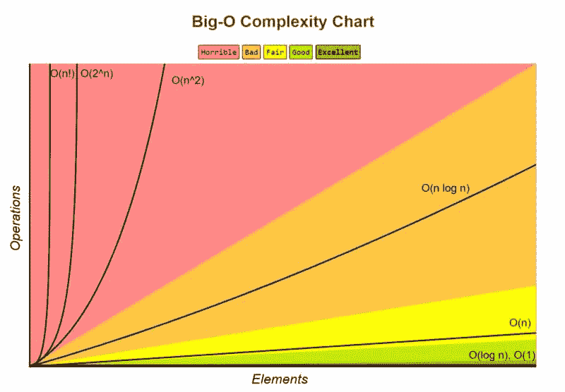

Complexity Growth Illustration from [Big O Cheatsheet](http://bigocheatsheet.com/)* 

#### *1.O(1)的复杂度最低*

*常被称为 ***【常数时间】*** ，如果你能创造出一个算法来解决 O(1)中的问题，你很可能处于最佳状态。在某些场景中，复杂度可能会超过 O(1)，那么我们可以通过找到它的 O(1/g(n))对应物来分析它们。例如，O(1/n)比 O(1/n)更复杂。*

#### *2.O(log(n))比 O(1)更复杂，但没有多项式复杂*

*由于复杂度通常与分治算法相关，O(log(n))通常是排序算法可以达到的良好复杂度。O(log(n))没有 O(√n)复杂，因为平方根函数可以认为是多项式，其中指数为 0.5。*

#### *3.多项式的复杂度随着指数的增加而增加*

*例如，O(n⁵)比 O(n⁴).更复杂由于它的简单性，我们实际上已经在前面的章节中复习了很多多项式的例子。*

#### *4.只要系数是 n 的正倍数，指数就比多项式复杂*

*O(2ⁿ)比 O(n⁹⁹)复杂，但 O(2ⁿ)实际上没有 O(1)复杂。我们通常将 2 作为指数和对数的基数，因为在计算机科学中事物趋向于二进制，但是指数可以通过改变系数来改变。如果没有指定，对数的基数假定为 2。*

#### *5.阶乘比指数更复杂*

*如果对推理感兴趣，查一下 [**伽玛函数**](https://en.wikipedia.org/wiki/Gamma_function) ，它是一个阶乘的 [**解析延拓**](https://en.wikipedia.org/wiki/Analytic_continuation) 。一个简单的证明是，阶乘和指数具有相同的乘法次数，但是对于阶乘，被乘法的次数增加，而对于指数，乘法次数保持不变。*

#### *6.乘法术语*

*乘法的时候，复杂度会比原来大，但不会超过比原来更复杂的东西相乘的等价性。例如，O(n * log(n))比 O(n)复杂，但没有 O(n)复杂，因为 O(n ) = O(n * n)，n 比 log(n)复杂。*

*为了测试你的理解，试着从最复杂到最不复杂排列下面的函数。详细解释的解决方案可以在你阅读的后面部分找到。其中一些是很棘手的，可能需要对数学有更深的理解。当你找到解决方法时，你会更加理解它们。*

> ***问题:**从最复杂到最不复杂排列下列函数。*

*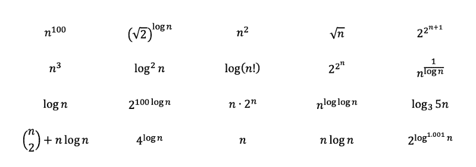

Examples taken from [Textbook Problems](https://www.chegg.com/homework-help/questions-and-answers/problem-ask-refresh-knowledge-asymptotic-notations-rank-following-functions-order-growth-f-q23698273)* 

> ***Section 2 问题解答:**
> 
> 这其实是一个测试你理解力的绝招题。问题试图让你回答 O(n)因为有嵌套的 for 循环。然而，n 应该是输入大小。因为图像数组是输入，并且每个像素只迭代一次，所以答案实际上是 O(n)。下一节将介绍更多像这样的例子。*

### *5.时间和空间复杂性*

*到目前为止，我们只讨论了算法的时间复杂度。也就是我们只关心程序完成任务需要多少时间。同样重要的是程序完成任务所占用的空间。空间复杂度与程序将使用多少内存有关，因此也是一个需要分析的重要因素。*

*空间复杂度与时间复杂度类似。例如，选择排序的空间复杂度为 O(1)，因为它只存储一个最小值及其索引用于比较，所以使用的最大空间不会随着输入大小而增加。*

*一些算法，例如桶排序，具有 O(n)的空间复杂度，但是能够将时间复杂度削减到 O(1)。桶排序通过创建数组中所有可能元素的排序列表来对数组进行排序，然后每当遇到元素时递增计数。最后，排序后的数组将是按计数重复的排序后的列表元素。*

*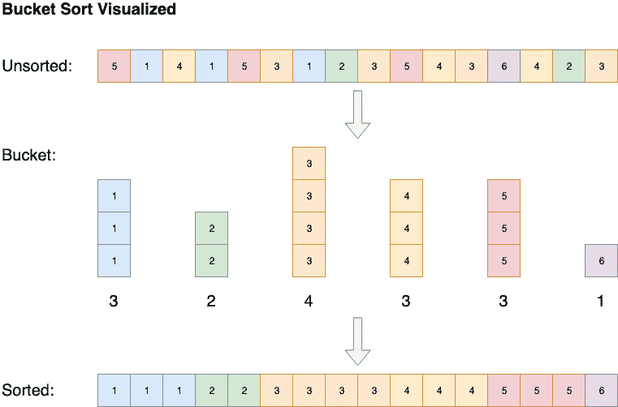

Bucket Sort Visualization* 

### *6.最佳、一般、最差、预期复杂性*

*复杂度也可以分析为最佳情况、最差情况、一般情况和预期情况。*

*我们以**插入排序、**为例。插入排序遍历列表中的所有元素。如果该元素小于其前一个元素，它将向后插入该元素，直到它大于前一个元素。*

*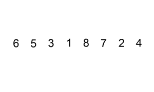

Insertion Sort Illustrated, Image from [Wikipedia](https://en.wikipedia.org/wiki/Insertion_sort)* 

*如果数组最初已排序，则不会进行交换。该算法将只遍历数组一次，其时间复杂度为 O(n)。因此，我们会说插入排序的**最佳情况**时间复杂度为 O(n)。O(n)的复杂度通常也被称为**线性复杂度**。*

*有时候一个算法就是运气不好。例如，如果元素以相反的顺序排序，快速排序将不得不在 O(n)时间内遍历列表，但平均来说，它在 O(n * log(n))时间内对数组进行排序。一般来说，当我们评估一个算法的时间复杂度时，我们会查看它们的**最坏情况**性能。在你阅读的下一节中，会有更多关于快速排序的内容。*

*平均案例复杂度描述了算法的预期性能。有时涉及到计算每个场景的概率。进入细节可能会变得复杂，因此不在本文中讨论。下面是典型算法的时间和空间复杂度的备忘单。*

*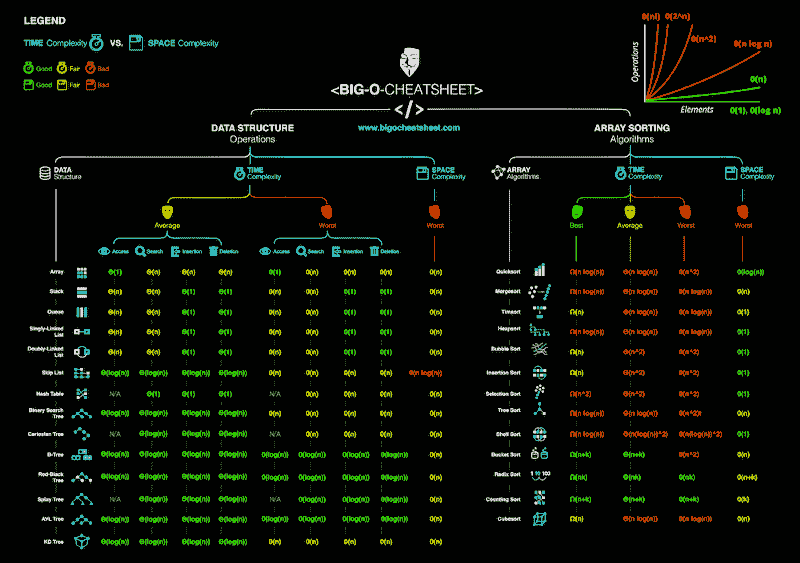

[Big O Cheatsheet](http://bigocheatsheet.com/) for Common Algorithms* 

> ***第 4 节问题解答:***

*通过检查函数，我们应该能够立即按照规则 3 从最复杂到最不复杂排列下面的多项式。其中 n 的平方根正好是 n 的 0.5 次方。*

*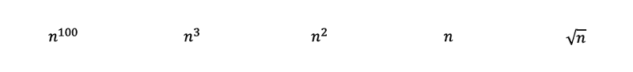*

*然后通过应用规则 2 和 6，我们将得到以下结果。用 **[对数基数转换](https://www.purplemath.com/modules/logrules5.htm)** 可以将基数为 3 的对数转换为基数为 2 的对数。基数为 3 的对数增长仍然比基数为 2 的对数慢一点，因此排名在后。*

**

*其余的可能看起来有点棘手，但让我们试着揭开他们的真面目，看看我们可以把他们放在哪里。*

*首先，2 的 2 次方的 n 次方大于 2 的 n 次方，而+1 使它更加有趣。*

*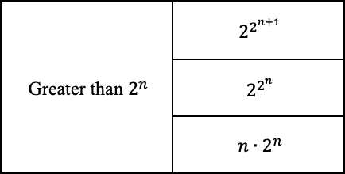*

*既然我们知道 2 的 log(n)次方以 2 为底等于 n，我们可以转换如下。指数为 0.001 的对数比常数增长多一点，但几乎比其他任何东西都少。*

*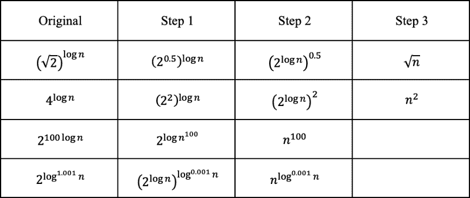*

*n 的 log 次方的那个(log(n))其实是 [**拟多项式**](https://en.wikipedia.org/wiki/Time_complexity#Quasi-polynomial_time) 的变种，大于多项式但小于指数。由于 log(n)的增长速度比 n 慢，所以它的复杂度要低一些。当 1/log(n)发散到无穷大时，具有反对数的那个收敛到常数。*

*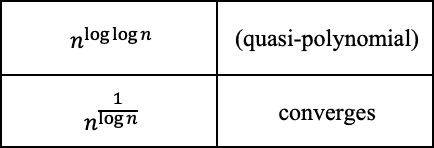*

*阶乘可以用乘法来表示，因此可以转换成对数函数之外的加法。“n 选 2”可以转换成一个三次项最大的多项式。*

*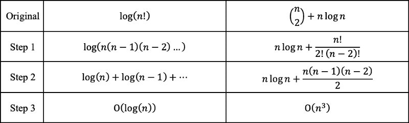*

*最后，我们可以从最复杂到最不复杂对函数进行排序。*

*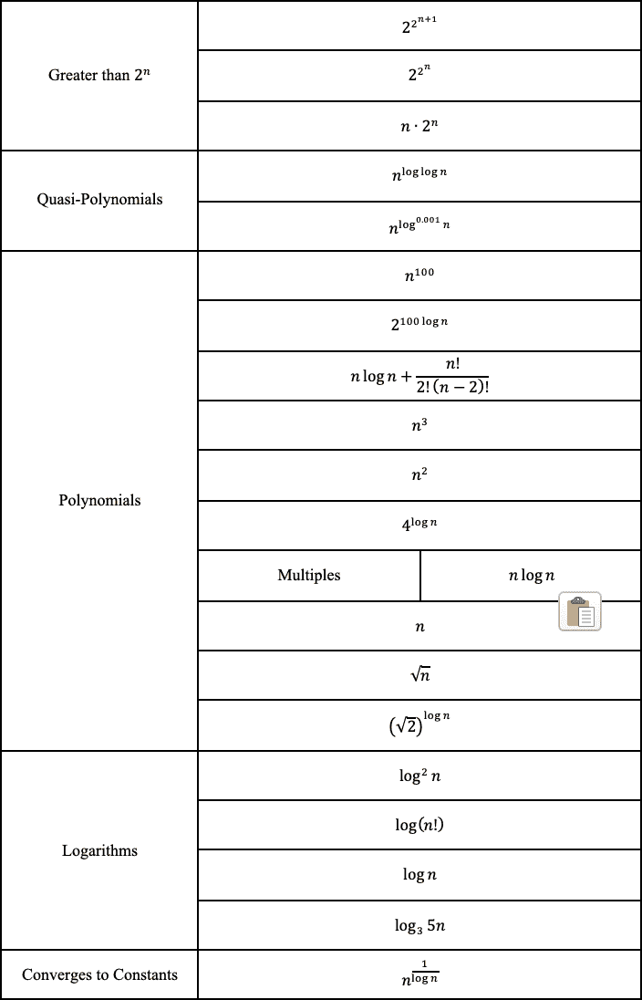*

### *为什么 BigO 不重要*

> ***！！！—警告—！！！**
> 
> 这里讨论的内容一般都是**不被世界上大多数程序员接受的**。在面试中讨论它**风险自担**。人们实际上在博客上讲述了他们如何因为质疑权威而未能通过谷歌面试，就像这里一样。
> T11**！！！—警告—！！！***

*因为我们之前已经知道快速排序的最坏情况时间复杂度是 O(n)，但是合并排序的时间复杂度是 O(n * log(n))，所以合并排序应该更快—对吗？你可能已经猜到答案是错误的。算法只是以某种方式连接起来，使快速排序成为*“快速排序”*。*

*为了演示，看看我做的这个[小饰品。它比较了快速排序和合并排序的时间。我只成功地在长度达到 10000 的数组上测试了它，但是正如您目前所看到的，合并排序的时间比快速排序增长得更快。尽管快速排序具有更差的 O(n)复杂度，但这种可能性非常低。当涉及到速度的增加时，快速排序比合并排序具有更好的平均性能，其复杂度为 O(n * log(n))。](https://trinket.io/python/87a3166026)*

*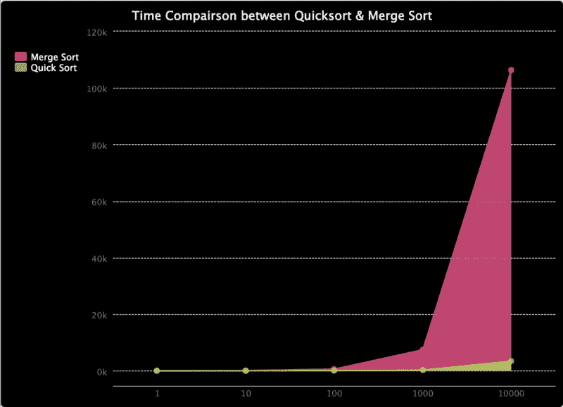

Time Comparison between Quick Sort & Merge Sort* 

*我还制作了下图来比较它们所用时间的比率，因为在较低的值上很难看到它们。如您所见，快速排序所用的时间百分比是降序排列的。*

*

Time Ratio between Quick Sort & Merge Sort* 

*这个故事的寓意是，大 O 符号只是一种数学分析，为算法消耗的资源提供参考。实际上，结果可能不同。但是，尝试降低算法的复杂性通常是一个好的做法，直到我们遇到一个我们知道自己在做什么的情况。*

### *最后…*

*我喜欢编码，学习新东西，并与社区分享。如果你对什么特别感兴趣，请告诉我。我一般写网页设计，软件架构，数学和数据科学。如果你对上面的任何话题感兴趣，你可以找到一些我以前写过的很棒的文章。*

*希望你在学习计算机科学的过程中过得愉快！！！*