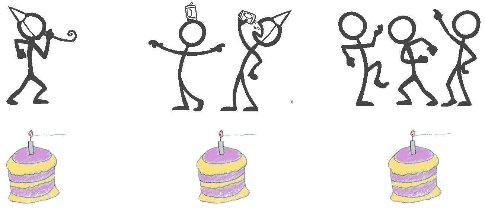
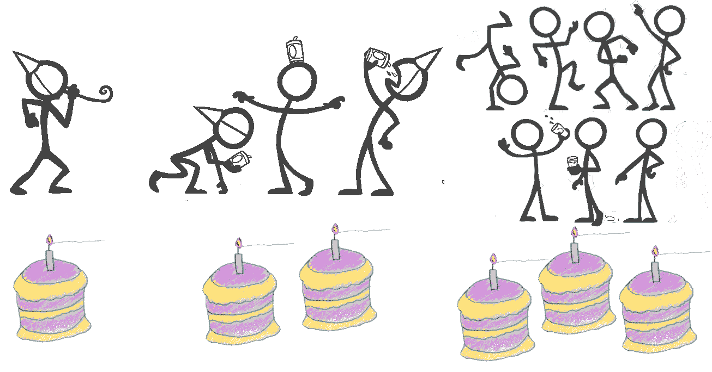
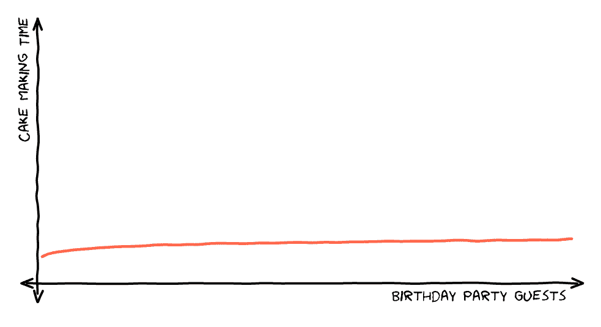
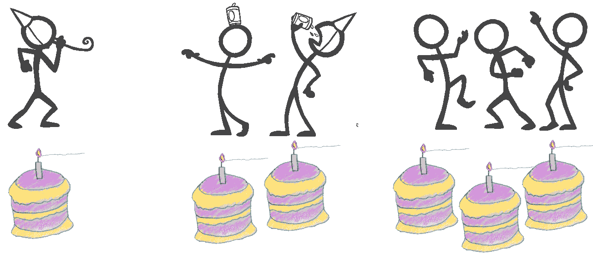
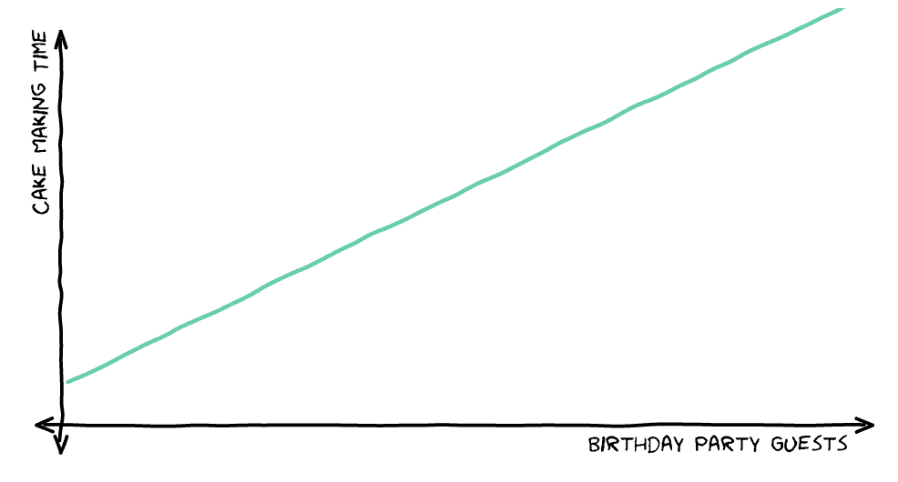
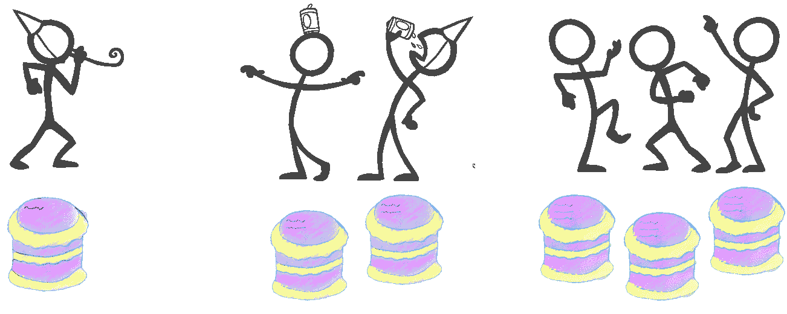
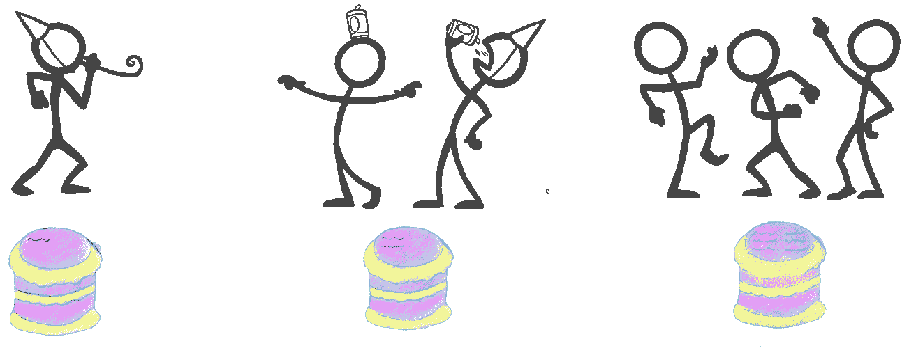
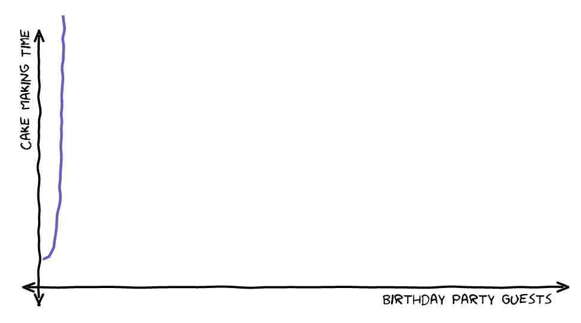
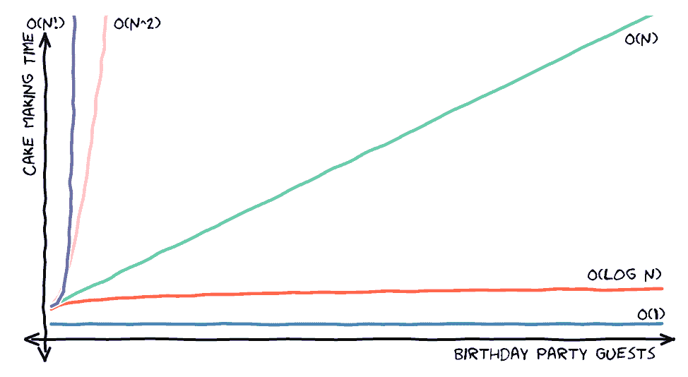

# 大 O 符号是如何工作的——用蛋糕解释

> 原文：<https://www.freecodecamp.org/news/big-o-notation/>

大 O 符号在计算机科学中用于定义算法的上限。它主要用于将算法的最大时间定义为输入大小的函数，但也可以用于定义内存使用。

在这篇文章中，我们将讨论最常见的“大 O”符号，用生日蛋糕来说明这些概念。我们将假设我们正在举办一个聚会，并且需要根据有多少人参加来决定要烤多少蛋糕。

## O(1) -常数时间

对于时间不变的例子，无论有多少人来参加生日聚会，你都只做一个蛋糕。所以做蛋糕的时间保持不变。

注意大 O 记数法并没有规定恒定时间是多长(也许做蛋糕需要 1 个小时，也许需要 4 个小时)。它只是说明所花的时间不会随着客人数量的增加而增加。

O(1)操作的一个真实例子是通过索引访问数组。从 10 个元素的数组中检索一个元素和从 100 万个元素的数组中检索一个元素一样快。

## O(log n) -对数时间

以对数时间为例，生日蛋糕被用来激励人们准时参加聚会。

第一个到达的人会得到一个属于他们自己的蛋糕。然后下两个到达的人分享蛋糕。然后接下来的 4 个人都分一块蛋糕，以此类推。

所以一个单人派对需要一个蛋糕。一个 2 或 3 人的聚会需要 2 个蛋糕。4 - 7 人的派对需要 3 块蛋糕，8-15 人的派对需要 4 块蛋糕。一般来说，一个 n 人聚会需要原木蛋糕。

O(log n)运算最常见的真实例子是有序数组的二分搜索法。

该算法查看数组的中间，并查看该值是低于还是高于它所查找的值。因为列表是有序的，所以它知道目标值在数组的哪一半。

然后对数组的那一半重复这个过程。因此，对于一个 16 项数组，第一次迭代将搜索范围缩小到 8 项，然后是 4 项、2 项、1 项，最多 4 项，或者 log *2* (16)，迭代总数。

## O(n) -线性时间

对于线性时间的例子，每个客人都有自己的蛋糕。如果有人来参加聚会，你需要做蛋糕。所以用的时间和客人数量有关。

再次大 O 批注没有说明时间有多长(可能做蛋糕需要 1 个小时，可能需要 4 个小时)，只是说明时间随着客人数量线性增加。

O(n)运算的一个真实例子是在数组中搜索一个元素。在一个 10 件物品的阵列中，最糟糕的情况是你必须查看所有 10 件物品才能找到你想要的那一件。但是对于一个 100 万项的数组，您可能需要查看所有 100 万项。

当然，您可能会更快找到解决方案，但是大 O 符号指定了算法将花费的最大时间。

## O(n^2) -二次时间

对于二次时间的例子，每个客人都有自己的蛋糕。此外，每个蛋糕上都写有所有客人的名字，还有一些美味的糖衣。

在这种情况下，一个人的聚会有一个蛋糕，上面有一个名字。两人派对有两个蛋糕，上面都有两个名字(总共 4 个名字)，三人派对有三个蛋糕，上面都有三个名字，总共 9 个名字。

一般来说，一个‘n’人的聚会需要写 n*n 个名字(也叫 n 的平方，或者 n 的 2 次方)，所以做蛋糕的速度(以及写下所有名字的速度)与客人人数的平方有关。

O(n^2 运算的一个真实例子是在一个数组中搜索重复项。在这种情况下，您将遍历数组中的所有项，对于其中的每一项，再次遍历数组以查看是否有匹配项。

对于一个 10 项的数组，外循环有 10 次迭代，内循环有 10 次迭代，总共 100 次。对于 100 万个项目的数组，它是 10000 亿。

有一个更一般的 O(n^2)，而不是相对于 n 的 2 次方(n^2)，它是相对于 n 的 c 次方(n^c).)这通常称为多项式时间。

## O(n！)-阶乘时间

对于阶乘时间的例子，客人们参加一个 [Pétanque](https://en.wikipedia.org/wiki/P%C3%A9tanque) 比赛，获胜者将蛋糕带回家。

不过，有一个小问题，第一个回合的玩家处于劣势。为了有助于平衡，我们会玩很多游戏，这样每一组客人都会被包括在内，每个人都可以先来。所有这些排列都写在蛋糕上，再加上一些美味的糖衣。

这意味着两人派对有两个游戏，每个客人轮流先玩。一个 3 人派对有 6 场比赛(如果我们想象客人是安娜、布莱恩和克里斯，那么排列是 ABC、ACB、BAC、BCA、CAB、CBA)。

一般来说，n 人派对需要 n！，或者 n 阶乘游戏，所以做蛋糕的速度跟这个有关。

n！是通过将从 n 到 1 的所有整数相乘得到的“n * (n - 1) * (n - 2) … * 2 * 1”。所以对于双人聚会来说是 2 * 1，或者 2。对于三人聚会，它是 3 * 2 * 1，也就是 6。

O(n！)运算是任何需要分析排列列表的事情，比如[旅行推销员问题](https://en.wikipedia.org/wiki/Travelling_salesman_problem)。

## 结论

希望生日蛋糕让“大 O”符号更容易消化！下面的图表也是一个很好的记忆辅助工具，显示了算法的相对速度(如果有选择，那么你想要更快的那个！)

还有相当多的其他“大 o”符号，如 O(n log n)和 O(c^n，但它们都遵循相同的模式。如果你想进一步了解它，[看看这篇文章](https://www.freecodecamp.org/news/big-o-notation-why-it-matters-and-why-it-doesnt-1674cfa8a23c/)。