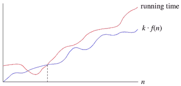

# 什么是大欧米伽记数法？

> 原文：<https://www.freecodecamp.org/news/big-omega-notation/>

类似于 [big O](https://guide.freecodecamp.org/computer-science/notation/big-o-notation) 记法，big Omega(ω)函数在计算机科学中用于描述算法的性能或复杂度。

如果一个运行时间是ω(f(n))，那么对于足够大的 n，运行时间至少是 k⋅f(n)对于某个常数 k .下面是如何想到一个运行时间是ω(f(n)):

我们说运行时间是“f(n)的大-ω。”我们使用大ω符号表示 ****渐近下限**** ，因为对于足够大的输入大小，它从下面限制运行时间的增长。

### **大 O 和大ω的区别**

大 O 记法和大ω记法的区别在于，大 O 用于描述算法的最坏情况运行时间。但是，另一方面，大ω符号用于描述给定算法的最佳运行时间。

#### **更多信息:**

*   [大ω(Big-Omega)符号](https://www.khanacademy.org/computing/computer-science/algorithms/asymptotic-notation/a/big-big-omega-notation)

