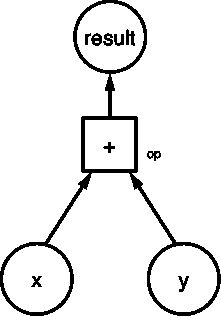
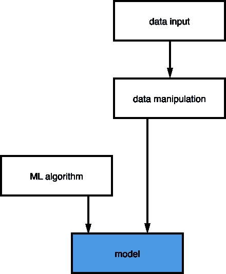
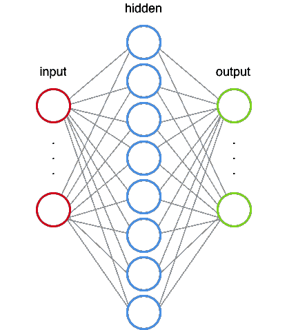
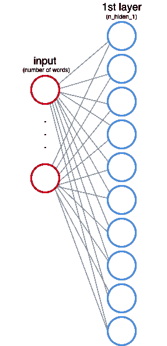
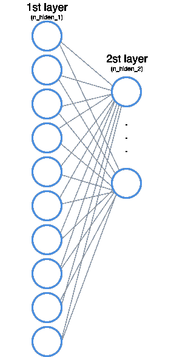
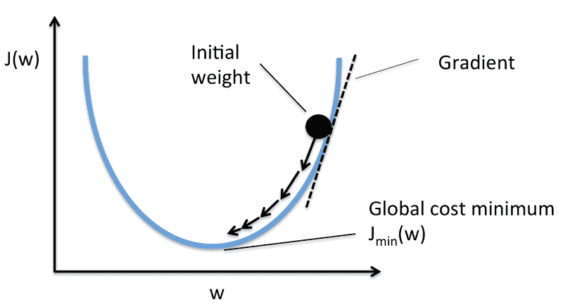

# 大图机器学习:用神经网络和张量流对文本进行分类

> 原文：<https://www.freecodecamp.org/news/big-picture-machine-learning-classifying-text-with-neural-networks-and-tensorflow-d94036ac2274/>

作者德博拉·梅斯基塔

# 大图机器学习:用神经网络和张量流对文本进行分类


开发者经常说，如果你想开始机器学习，你应该首先了解算法是如何工作的。但我的经验表明并非如此。

我说你应该首先能够看到全局:**应用程序如何工作**。一旦理解了这一点，深入研究和探索算法的内部工作就变得容易多了。

那么，你如何[发展直觉](https://www.quora.com/How-does-one-develop-intuitive-learning-And-what-are-the-key-differences-between-intuition-based-learning-and-learning-by-proof-And-which-one-do-you-prefer)并实现对机器学习的宏观理解呢？做这件事的一个好方法是**创建机器学习模型**。

假设您仍然不知道如何从头开始创建所有这些算法，您将希望使用一个已经为您实现了所有这些算法的库。而那个库就是 **TensorFlow** 。

在本文中，我们将创建一个机器学习模型来对文本进行分类。我们将讨论以下主题:

1.  **张量流如何工作**
2.  **什么是机器学习模型**
3.  **什么是神经网络**
4.  **神经网络如何学习**
5.  **如何处理数据并将其传递给神经网络输入**
6.  **如何运行模型并得到预测结果**

你可能会学到很多新的东西，所以让我们开始吧！？

### TensorFlow

[TensorFlow](https://www.tensorflow.org/) 是一个机器学习的开源库，最早由 Google 创建。这个库的名字有助于我们理解如何使用它:张量是流经图中节点的多维数组。

#### tf。图表

TensorFlow 中的每个计算都表示为数据流图。该图有两个元素:

*   一组`tf.Operation`，代表计算单位
*   一组代表数据单位的`tf.Tensor`

为了了解这一切是如何工作的，您将创建这个数据流图:



A graph that computes x+y

您将定义`x = [1,3,6]`和`y = [1,1,1]`。由于图形使用`tf.Tensor`来表示数据单位，您将创建常数张量:

```
import tensorflow as tf
```

```
x = tf.constant([1,3,6]) y = tf.constant([1,1,1])
```

现在，您将定义操作单元:

```
import tensorflow as tf
```

```
x = tf.constant([1,3,6]) y = tf.constant([1,1,1])
```

```
op = tf.add(x,y)
```

你有所有的图形元素。现在您需要构建图表:

```
import tensorflow as tf
```

```
my_graph = tf.Graph()
```

```
with my_graph.as_default():    x = tf.constant([1,3,6])     y = tf.constant([1,1,1])
```

```
 op = tf.add(x,y)
```

TensorFlow 的工作流程是这样的:首先创建一个图形，然后才能进行计算(实际上是用操作“运行”图形节点)。要运行图表，您需要创建一个`tf.Session`。

#### tf。会议

一个`tf.Session`对象封装了`Operation`对象被执行的环境，并且`Tensor`对象被评估(从[文档](https://www.tensorflow.org/api_docs/python/tf/Session))。为此，我们需要定义将在会话中使用的图表:

```
import tensorflow as tf
```

```
my_graph = tf.Graph()
```

```
with tf.Session(graph=my_graph) as sess:    x = tf.constant([1,3,6])     y = tf.constant([1,1,1])
```

```
 op = tf.add(x,y)
```

为了执行操作，您将使用方法`tf.Session.run()`。该方法执行张量流计算的一个“步骤”，通过运行必要的图形片段来执行每个`Operation`对象并评估参数`fetches`中传递的每个`Tensor`。在您的案例中，您将运行求和运算的一个步骤:

```
import tensorflow as tf
```

```
my_graph = tf.Graph()
```

```
with tf.Session(graph=my_graph) as sess:    x = tf.constant([1,3,6])     y = tf.constant([1,1,1])
```

```
 op = tf.add(x,y)    result = sess.run(fetches=op)    print(result)
```

```
>>>; [2 4 7]
```

### 预测模型

现在您已经知道 TensorFlow 是如何工作的，您必须学习如何创建一个预测模型。简言之，

**机器学习算法** + **数据** = **预测模型**

构建模型的过程如下:



The process to create a predictive model

如你所见，该模型由一个用数据“训练”的机器学习算法组成。当你有了模型，你会得到这样的结果:


Prediction workflow

您将创建的模型的目标是对文本进行分类，我们定义如下:

**输入**:文本，**结果**:类别

我们有一个训练数据集，所有的文本都有标签(每个文本都有一个标签，表明它属于哪个类别)。在机器学习中，这种类型的任务被称为**监督学习**。

> “我们知道正确的答案。算法迭代地对训练数据进行预测，并由老师进行纠正。”— [杰森·布朗利](http://machinelearningmastery.com/supervised-and-unsupervised-machine-learning-algorithms/)

您将对数据进行分类，因此这也是一个**分类**任务。

为了创建模型，我们将使用神经网络。

### 神经网络

神经网络是一种计算模型(一种使用数学语言和数学概念描述系统的方法)。这些系统是自我学习和训练的，而不是显式编程的。

神经网络的灵感来自我们的中枢神经系统。它们有类似于我们神经元的连接节点。



A neural network

感知器是第一个神经网络算法。这篇文章很好地解释了感知器的内部工作(“人工神经元内部”的动画太棒了)。

为了理解神经网络如何工作，我们将使用 TensorFlow 实际构建一个神经网络架构。在[这个例子](https://github.com/aymericdamien/TensorFlow-Examples/blob/master/notebooks/3_NeuralNetworks/multilayer_perceptron.ipynb)中 [Aymeric Damien](https://github.com/aymericdamien) 使用了这个架构。

#### 神经网络体系结构

神经网络将有 2 个隐藏层([你必须选择](http://stats.stackexchange.com/questions/181/how-to-choose-the-number-of-hidden-layers-and-nodes-in-a-feedforward-neural-netw)网络将有多少个隐藏层，这是架构设计的一部分)。每个隐藏层的工作是[将输入转换成输出层可以使用的东西](http://stats.stackexchange.com/questions/63152/what-does-the-hidden-layer-in-a-neural-network-compute)。

**隐藏层 1**



Input layer and 1st hidden layer

您还需要定义第一个隐藏层将有多少个节点。这些节点也称为特征或神经元，在上图中，它们由每个圆圈表示。

在输入层中，每个节点对应于数据集的一个单词(我们将在后面看到这是如何工作的)。

如这里所解释的[，每个节点(神经元)乘以一个权重。每个节点都有一个权重值，在训练阶段，神经网络会调整这些值，以产生正确的输出(等等，我们一会儿会了解更多)。](https://appliedgo.net/perceptron/)

除了将每个输入节点乘以一个权重，网络还增加了一个偏差([神经网络](http://stackoverflow.com/questions/2480650/role-of-bias-in-neural-networks)中偏差的作用)。

在您的架构中，将输入乘以权重并将值与偏差相加后，数据还会通过一个**激活函数**。这个激活函数定义了每个节点的最终输出。打个比方:假设每个节点是一盏灯，激活函数告诉灯会不会亮。

激活功能有[多种类型。您将使用校正线性单位(ReLu)。该函数是这样定义的:](https://en.wikipedia.org/wiki/Activation_function)

*f(x)* = *max(0，x)* 【输出为 x 或 0(零)，取较大值】

举例:若 ***x* = -1，**则 ***f(x) = 0*** *(零)；如果 **x = 0.7** ，那么**f(x)= 0.7**。*

**隐藏层 2**

第二个隐藏层的功能与第一个隐藏层完全相同，但现在第二个隐藏层的输入是第一个隐藏层的输出。



1st and 2nd hidden layers

**输出层**

我们终于到了最后一层，输出层。您将使用[一键编码](https://en.wikipedia.org/wiki/One-hot)来获得这一层的结果。在这种编码中，只有一位的值为 1，所有其他位的值都为零。例如，如果我们要对三个类别(体育、空间和计算机图形)进行编码:

```
+-------------------+-----------+|    category       |   value   |+-------------------|-----------+|      sports       |    001    ||      space        |    010    || computer graphics |    100    ||-------------------|-----------|
```

因此，输出节点的数量就是输入数据集的类的数量。

输出图层值也乘以权重，我们还添加了偏差，但现在激活函数不同了。

你要给每一个文本标注一个类别，而这些类别是互斥的(一个文本不能同时属于两个类别)。考虑到这一点，您将使用 [Softmax](https://en.wikipedia.org/wiki/Softmax_function) 函数，而不是 ReLu 激活函数。此函数将每个单位的输出转换为 0 到 1 之间的值，并确保所有单位的总和等于 1。这样，输出将告诉我们每个类别的每个文本的概率。

```
| 1.2                    0.46|| 0.9   -> [softmax] ->  0.34|| 0.4                    0.20|
```

现在你有了神经网络的数据流图。将我们到目前为止看到的一切转换成代码，结果是:

```
# Network Parametersn_hidden_1 = 10        # 1st layer number of featuresn_hidden_2 = 5         # 2nd layer number of featuresn_input = total_words  # Words in vocabn_classes = 3          # Categories: graphics, space and baseball
```

```
def multilayer_perceptron(input_tensor, weights, biases):    layer_1_multiplication = tf.matmul(input_tensor, weights['h1'])    layer_1_addition = tf.add(layer_1_multiplication, biases['b1'])    layer_1_activation = tf.nn.relu(layer_1_addition)
```

```
# Hidden layer with RELU activation    layer_2_multiplication = tf.matmul(layer_1_activation, weights['h2'])    layer_2_addition = tf.add(layer_2_multiplication, biases['b2'])    layer_2_activation = tf.nn.relu(layer_2_addition)
```

```
# Output layer with linear activation    out_layer_multiplication = tf.matmul(layer_2_activation, weights['out'])    out_layer_addition = out_layer_multiplication + biases['out']
```

```
return out_layer_addition
```

(后面会讲到输出层激活函数的代码。)

### 神经网络如何学习

正如我们前面看到的，权重值在网络训练时更新。现在，我们将看看这在张量流环境中是如何发生的。

#### tf。可变的

权重和偏差存储在变量(`tf.Variable`)中。这些变量在调用`run()`时保持图中的状态。在机器学习中，我们通常通过一个[正态分布](https://en.wikipedia.org/wiki/Normal_distribution)来开始权重和偏差值。

```
weights = {    'h1': tf.Variable(tf.random_normal([n_input, n_hidden_1])),    'h2': tf.Variable(tf.random_normal([n_hidden_1, n_hidden_2])),    'out': tf.Variable(tf.random_normal([n_hidden_2, n_classes]))}biases = {    'b1': tf.Variable(tf.random_normal([n_hidden_1])),    'b2': tf.Variable(tf.random_normal([n_hidden_2])),    'out': tf.Variable(tf.random_normal([n_classes]))}
```

当我们第一次运行网络时(即权重值是由正态分布定义的值):

```
input values: xweights: wbias: boutput values: z
```

```
expected values: expected
```

要知道网络是否在学习，需要将输出值( *z* )与期望值( *expected* )进行比较。我们如何计算这种差异(损失)？有许多方法可以做到这一点。因为我们正在进行分类任务，所以损失的最佳度量是[交叉熵误差](https://en.wikipedia.org/wiki/Cross_entropy)。

詹姆斯·d·麦卡弗里给[写了一篇精彩的解释](https://jamesmccaffrey.wordpress.com/2013/11/05/why-you-should-use-cross-entropy-error-instead-of-classification-error-or-mean-squared-error-for-neural-network-classifier-training/)，解释为什么这是完成这类任务的最佳方法。

使用 TensorFlow，您将使用`tf.nn.softmax_cross_entropy_with_logits()`方法(这里是 softmax 激活函数)计算交叉熵误差，并计算平均误差(`tf.reduce_mean()`)。

```
# Construct modelprediction = multilayer_perceptron(input_tensor, weights, biases)
```

```
# Define lossentropy_loss = tf.nn.softmax_cross_entropy_with_logits(logits=prediction, labels=output_tensor)loss = tf.reduce_mean(entropy_loss)
```

您希望找到权重和偏差的最佳值，以便最小化输出误差(我们得到的值和正确值之间的差异)。为此，您将使用梯度[下降法](https://en.wikipedia.org/wiki/Gradient_descent)。更具体地说，您将使用[随机梯度下降](https://en.wikipedia.org/wiki/Stochastic_gradient_descent)。



Gradient descent. Source: [https://sebastianraschka.com/faq/docs/closed-form-vs-gd.html](https://sebastianraschka.com/faq/docs/closed-form-vs-gd.html)

计算梯度下降的算法也有很多，你会用到[自适应矩估计(Adam)](http://sebastianruder.com/optimizing-gradient-descent/index.html#adam) 。要在 TensorFlow 中使用该算法，您需要传递 learning_rate 值，该值决定了值的增量步长，以找到最佳权重值。

方法`tf.train.AdamOptimizer(learning_rate)**.minimize(loss)**`是一个[语法糖](https://en.wikipedia.org/wiki/Syntactic_sugar)，它做两件事:

1.  **compute_gradients** (损失，<变量列表>
2.  **应用渐变** ( <变量列表>)

该方法用新值更新所有的`tf.Variables`，所以我们不需要传递变量列表。现在你有了训练网络的代码:

```
learning_rate = 0.001
```

```
# Construct modelprediction = multilayer_perceptron(input_tensor, weights, biases)
```

```
# Define lossentropy_loss = tf.nn.softmax_cross_entropy_with_logits(logits=prediction, labels=output_tensor)loss = tf.reduce_mean(entropy_loss)
```

```
optimizer = tf.train.AdamOptimizer(learning_rate=learning_rate).minimize(loss)
```

### 数据操作

您将使用的数据集有许多英文文本，我们需要处理这些数据，将其传递给神经网络。为此，您需要做两件事:

1.  为每个单词创建一个索引
2.  为每个文本创建一个矩阵，如果文本中有单词，则值为 1，如果没有，则值为 0

让我们看看代码来理解这个过程:

```
import numpy as np    #numpy is a package for scientific computingfrom collections import Counter
```

```
vocab = Counter()
```

```
text = "Hi from Brazil"
```

```
#Get all wordsfor word in text.split(' '):    vocab[word]+=1        #Convert words to indexesdef get_word_2_index(vocab):    word2index = {}    for i,word in enumerate(vocab):        word2index[word] = i            return word2index
```

```
#Now we have an indexword2index = get_word_2_index(vocab)
```

```
total_words = len(vocab)
```

```
#This is how we create a numpy array (our matrix)matrix = np.zeros((total_words),dtype=float)
```

```
#Now we fill the valuesfor word in text.split():    matrix[word2index[word]] += 1
```

```
print(matrix)
```

```
>>> [ 1\.  1\.  1.]
```

在上面的例子中，文本是“来自巴西的你好”，矩阵是 **[ 1。1.1.】**。如果短信只有“嗨”呢？

```
matrix = np.zeros((total_words),dtype=float)
```

```
text = "Hi"
```

```
for word in text.split():    matrix[word2index[word.lower()]] += 1
```

```
print(matrix)
```

```
>>> [ 1\.  0\.  0.]
```

标签(文本的类别)也是如此，但现在您将使用一键编码:

```
y = np.zeros((3),dtype=float)
```

```
if category == 0:    y[0] = 1\.        # [ 1\.  0\.  0.]elif category == 1:    y[1] = 1\.        # [ 0\.  1\.  0.]else:     y[2] = 1\.       # [ 0\.  0\.  1.]
```

### 运行图表并获得结果

现在是最精彩的部分:从模型中获取结果。首先，让我们仔细看看输入数据集。

#### 数据集

您将使用 [20 个新闻组](http://qwone.com/~jason/20Newsgroups/)，这是一个包含关于 20 个主题的 18000 篇帖子的数据集。要加载这个数据集，您将使用 [scikit-learn](http://scikit-learn.org/stable/index.html) 库。我们将只使用 3 个类别: **comp.graphics** 、 **sci.space** 和 **rec.sport.baseball** 。scikit-learn 有两个子集:一个用于训练，一个用于测试。建议您永远不要查看测试数据，因为这会干扰您在创建模型时的选择。你不想创建一个模型来预测这个特定的测试数据，你想创建一个具有良好的**泛化**的模型。

这是您加载数据集的方式:

```
from sklearn.datasets import fetch_20newsgroups
```

```
categories = ["comp.graphics","sci.space","rec.sport.baseball"]
```

```
newsgroups_train = fetch_20newsgroups(subset='train', categories=categories)newsgroups_test = fetch_20newsgroups(subset='test', categories=categories)
```

#### 训练模型

在[神经网络术语](http://stackoverflow.com/questions/4752626/epoch-vs-iteration-when-training-neural-networks)中，一个历元=一个正向传递(获取输出值)和一个反向传递(更新权重)*所有*的训练实例。

还记得`tf.Session.run()`法吗？让我们仔细看看它:

`tf.Session.run(fetches, feed_dict=None, options=None, run_metadata=None)`

在本文开头的数据流图中，您使用了 sum 操作，但是我们也可以传递一系列要运行的东西。在这次神经网络运行中，您将通过两件事:损失计算和优化步骤。

`feed_dict`参数是我们为每个运行步骤传递数据的地方。为了传递这些数据，我们需要定义`tf.placeholders`(以提供给`feed_dict`)。

正如 TensorFlow 文档所说:

> 占位符的存在只是为了作为提要的目标。它未初始化，不包含任何数据。— [来源](https://www.tensorflow.org/programmers_guide/reading_data)

因此，您将像这样定义占位符:

```
n_input = total_words # Words in vocabn_classes = 3         # Categories: graphics, sci.space and baseball
```

```
input_tensor = tf.placeholder(tf.float32,[None, n_input],name="input")output_tensor = tf.placeholder(tf.float32,[None, n_classes],name="output")
```

您将分批分离训练数据:

> “如果您使用占位符用于**进料输入**，您可以通过用 tf.placeholder(…，shape=[ **None** ，…])创建占位符来指定**变量批量尺寸**。形状的 None 元素对应于可变大小的维度。— [来源](https://www.tensorflow.org/versions/r0.11/resources/faq)

在测试模型的时候，我们会用更大的批量来填充字典，这就是为什么你需要定义一个可变的批量维度。

`get_batches()`函数给出了批量文本的数量。现在我们可以运行这个模型:

```
training_epochs = 10
```

```
# Launch the graphwith tf.Session() as sess:    sess.run(init) #inits the variables (normal distribution, remember?)
```

```
 # Training cycle    for epoch in range(training_epochs):        avg_cost = 0\.        total_batch = int(len(newsgroups_train.data)/batch_size)        # Loop over all batches        for i in range(total_batch):            batch_x,batch_y = get_batch(newsgroups_train,i,batch_size)            # Run optimization op (backprop) and cost op (to get loss value)            c,_ = sess.run([loss,optimizer], feed_dict={input_tensor: batch_x, output_tensor:batch_y})
```

现在你有了模型，训练有素。为了测试它，您还需要创建图形元素。我们将测量模型的准确性，因此需要获得预测值的索引和正确值的索引(因为我们使用的是一次性编码)，检查它们是否相等，并计算所有测试数据集的平均值:

```
 # Test model    index_prediction = tf.argmax(prediction, 1)    index_correct = tf.argmax(output_tensor, 1)    correct_prediction = tf.equal(index_prediction, index_correct)
```

```
 # Calculate accuracy    accuracy = tf.reduce_mean(tf.cast(correct_prediction, "float"))    total_test_data = len(newsgroups_test.target)    batch_x_test,batch_y_test = get_batch(newsgroups_test,0,total_test_data)    print("Accuracy:", accuracy.eval({input_tensor: batch_x_test, output_tensor: batch_y_test}))
```

```
>>> Epoch: 0001 loss= 1133.908114347    Epoch: 0002 loss= 329.093700409    Epoch: 0003 loss= 111.876660109    Epoch: 0004 loss= 72.552971845    Epoch: 0005 loss= 16.673050320    Epoch: 0006 loss= 16.481995190    Epoch: 0007 loss= 4.848220565    Epoch: 0008 loss= 0.759822878    Epoch: 0009 loss= 0.000000000    Epoch: 0010 loss= 0.079848485    Optimization Finished!
```

```
 Accuracy: 0.75
```

就是这样！您创建了一个使用神经网络将文本分类的模型。恭喜你！？

这里可以看到**最终代码** [的笔记本。](https://github.com/dmesquita/understanding_tensorflow_nn)

提示:修改我们定义的值，看看这些变化如何影响训练时间和模型精度。

有什么问题或建议吗？把它们留在评论里吧。哦，谢谢你的阅读！？✌?

你觉得这篇文章有帮助吗？我尽力每个月写一篇深度文章，当我发表一篇新的文章时，你可以收到一封电子邮件。

如果你点击，这将意味着很多？并与朋友分享。关注我，获取更多关于数据科学和机器学习的文章。