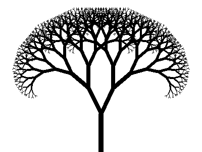
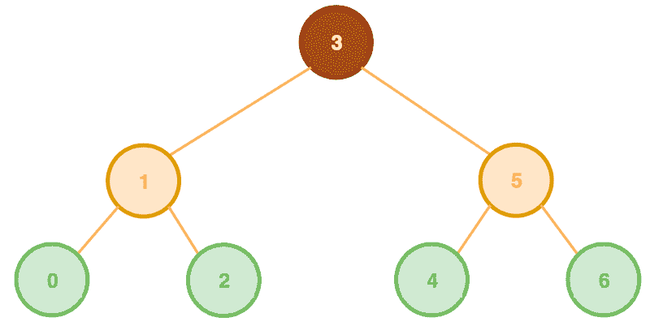
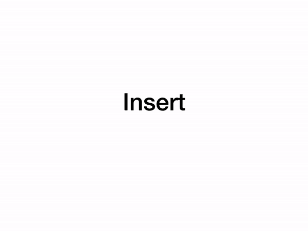
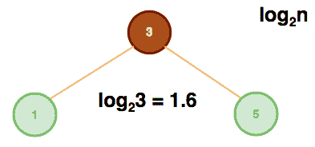
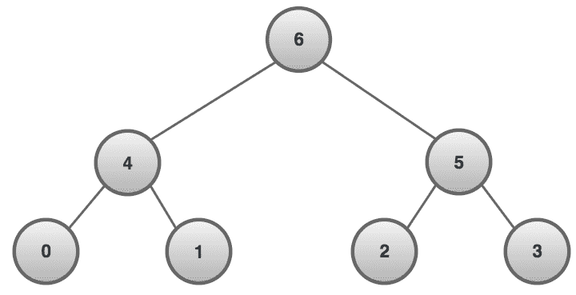
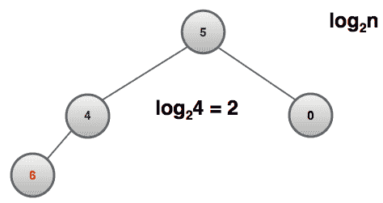
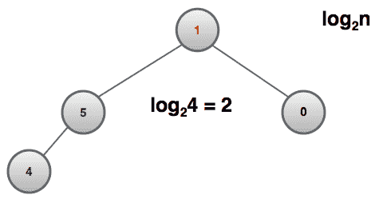

# 二进制数据结构:JavaScript 中的树和堆介绍

> 原文：<https://www.freecodecamp.org/news/binary-data-structures-an-intro-to-trees-and-heaps-in-javascript-962ab536cb42/>

作者:梁荣立

[**线性数据结构**](https://medium.freecodecamp.org/linear-data-structures-linked-lists-stacks-queues-a13c7591ad87) 方向简单。一个**链表**是一个从一个节点链接到下一个节点(对于一个双向链表，还链接到前一个节点)的节点列表(每个节点包含自己的数据)。一个**栈**像数据塔一样向上构建。每个节点堆叠在另一个之上，并以**后进先出(** LIFO **)** 的方式缩短。一个**队列**是一行节点，从该行的末端开始延长，并以**先进先出(** FIFO **)** 机制缩短。

**二进制数据结构**就像数据的岔路口。这些节点就像 T2 树的树枝或者 T4 的岩石堆。

### 树

[source](https://www.rosettacode.org/mw/images/a/a3/Fractal_tree_bbc.gif)

一个**二叉查找树**由分支到不超过两个节点的节点组成(二进制)。父节点可以有左右两个子节点。按照惯例，左侧子节点包含的值小于父节点。而右边的子节点包含更大的值(**左边更小，右边更大**)。所有的树都从一个根节点开始。

A root branches off into two parents of leaves. Leaves (green) are nodes without children.

为了**插入**一个值，需要创建一个**新节点**，将其值与**根** &及其**后代**值进行比较，同时决定进一步向左搜索(插入较小的值)或向右搜索(插入较大的值)。一旦找到一个可用的位置，节点就被插入到位。

**Insertion of the node with a value of 6**

为了**找到**一个值，类似于插入一个值。您正在执行对存储值的搜索，并返回包含它的节点。

**Finding the node with a value of 6**

对值进行**广度优先搜索**需要存储一个根值。然后从左边的孩子开始，然后是右边的孩子，依此类推。

**Breadth First Search returns [3, 1, 5, 0, 2, 4, 6]**

为了对值进行**深度优先搜索(**预先排序 **)** 需要存储一个根值。然后在向右的后代之前继续所有向左的后代。

**Depth First Search Pre — Order returns [3, 1, 0, 2, 5, 4, 6]**

由于**插入** & **寻找**某个值的节点是相对相似的过程(插入插入一个节点，而寻找返回一个节点)，所以它们的复杂度相同也就不足为奇了， **O(log n)** 。

**n = 3**

对于一个 3 节点**的二叉查找树**，到**找**的 T4【5】需要两步:

*   **5** 是大于还是小于 3？向右前进。
*   **5** 是否等于被搜索的值？返回节点。

与**插入**类似，值为 6 的节点需要两个步骤:

*   **6** 是大于还是小于 3？向右前进。
*   **6** 是大于还是小于 5？插入右侧。

### 很

Photo by Nick Tong on [Unsplash](https://unsplash.com/photos/zjy2yMUGzRU)

**二进制堆**是节点的金字塔结构，其节点可以向上堆叠，具有向最小值递减的值行(**最小二进制堆**)或向最大值递增的值行(**最大二进制堆**)。像树一样，每个父节点最多可以扩展到两个子节点。与树不同，每个父代可以包含比其子代更小的值(**最小二进制堆**)或更大的值(**最大二进制堆**)。

Max Binary Heap

对于一个**最大二进制堆**，要**插入**金字塔底部的一个值需要将其与父节点进行比较，并且**冒泡**较大的值。

**Insertion of a node with a value of 6 & bubbling it upward.**

为了**提取最大值**需要从金字塔的底部移除顶点值和**下沉**值。这包括找到两个子节点中较高的一个。

**Extraction of the max node with the value of 6 & sinking down node with the value of 3.**

对于一个**最大二进制堆**，节点&的**插入**，具有最大值的节点**提取**都具有复杂度 **O(log n)** 。

对于 3 节点**最大二进制堆**，插入值为 6 的节点需要两步。

**Bubbling up of the new node with value 6**

*   将值为 6 的节点附加到新行(低于 4)时， **6** 是大于还是小于 4？交换。
*   **6** 是大于还是小于 5？交换。

类似地，在删除具有最大值的节点后&用值为 **1** 的节点替换它，剩下两个步骤。

**Sinking down of node with value 1**

*   **1** 是大于还是小于 5？交换。
*   **1** 是大于还是小于 4？交换。

感谢您的阅读！

### 参考:

[https://www . udemy . com/js-algorithms-and-data-structures-master class/](https://www.udemy.com/js-algorithms-and-data-structures-masterclass/)