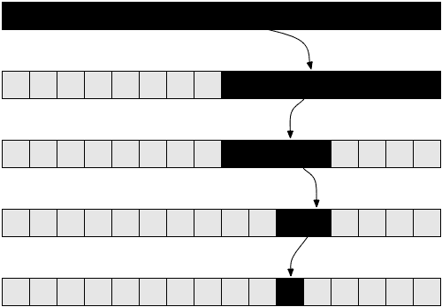

# 二分搜索法算法用安全摄像机镜头解释

> 原文：<https://www.freecodecamp.org/news/binary-search-algorithm-7170ae244438/>

朱莉娅·艾斯特

# 二分搜索法算法用安全摄像机镜头解释


> 二分搜索法，也称为半区间搜索或对数搜索，是一种在排序数组中查找目标值位置的搜索算法。

### 语境

我曾经住在一栋大楼里，那里有一个供 100 多名学生使用的公共厨房。正如你可能想象的那样，几乎总是有盘子没有在水槽里洗。我学校的一个小组提出了一个想法，安装一个巢摄像头来捕捉罪犯，并使用巢摄像头的反馈来呼叫他们。

为了说明我的观点，假设你在晚上 12 点发现了脏盘子，而你已经一天没进厨房了。

想一想你会如何寻找留下盘子的人。你会看所有 24 小时的录像吗，从开始，直到你找到罪犯？

大概不会。最有可能的是，你会在镜头中跳来跳去，检查盘子是否在水槽里，比如说，12 小时前——在凌晨 12 点。如果是的话，你会知道它发生在 12 点之前。之后你可能会回到晚上 10 点。如果菜肴*不在*那里，你现在已经将时间范围从晚上 10 点到凌晨 12 点——换句话说，你已经排除了晚上 10 点之前的任何时间。你会继续这个过程，直到你找到罪魁祸首。


Binary search for the moment the orange cup is put into the sink (Youtube video used)

如果你完整地看完这段录像，你需要花费 24 小时，现在只需要几秒钟。

不管你是否知道，我们刚刚经历的特定过程是一个二分搜索法！二分搜索法是一种非常特殊的在镜头中来回跳跃的方式。

也就是说，镜头在其中点被分割，以每次检查盘子。请注意，随着每次点击，到中点的距离呈指数级变小。

二进制搜索用于快速有效地查找元素。然而，问题是**二进制搜索只在你正在浏览的结构是*排序的*** 时有效。

在 Nest Cam 示例中，录像是按什么排序的？在这种有序的安排中，我们在寻找什么？

在这种情况下，我们搜索的数据是按时间排序的。时间允许线性测量。因此，它让我们可以执行二分搜索法，在几秒钟内找到不洗碗的人。

我们还需要我们正在寻找的东西。在这种情况下，它是公共水槽中未洗的盘子的存在。

### 二分搜索法算法


在编程时，二分搜索法可以在多种上下文中使用。这是在一个有序的结构中查找元素的一种极其快捷的方式。

二进制搜索可以以迭代或递归的方式实现。迭代实现使用一个`while`循环。同时，递归实现将从它自己的主体中调用它自己。

在代码中，我将对一组相对简单、经过排序的数据执行二分搜索法，以突出二分搜索法的核心实现。

给定一个排序数字数组，如果 53 是一个元素，则返回`True`。

```
[0, 3, 4, 5, 6, 15, 18, 22, 25, 27, 31, 33, 34, 35, 37, 42, 53, 60]
```

#### 重复的

在迭代方法中，while 循环一直运行到可能性范围为零。这是通过改变我们正在寻找的位置的上限和下限并计算该范围的中间索引*来实现的。*

范围存在于下限和上限之间，包括边界本身。



在`while`循环开始之前，下界是零，上界是数组的长度。如果我们要找的数字在范围的前半部分，上限就会改变。如果我们要找的数字在范围的后半部分，下限就会改变。

如果`while`循环结束，意味着有一个长度为零的范围，返回`False`。

```
def binarySearch(array, number):   lowerBound = 0   upperBound = len(array)
```

```
while lowerBound < upperBound:        middleIndex = int(math.floor(lowerBound + (upperBound —    lowerBound) / 2))        if array[middleIndex] == number:             return True        elif array[middleIndex] < number:             lowerBound += 1        elif array[middleIndex] > number:             upperBound = middleIndex   return False
```

我想详细解释一下这个等式:

`int(math.floor(lowerBound + (upperBound — lowerBound) / 2))`

**范围**的*长度*通过从上限中减去下限来计算。然而，仅仅知道范围有多长是不够的。

此时，我们不知道要检查数组中的哪些索引。所以我们把数组上移了下界。

然后，我们将其除以 2，并向下舍入，以获得该范围的中间指数。`math.floor`返回一个`float`，所以我们也必须将结果转换为一个`int`。

#### 递归的

在递归方法中，函数将从自身内部调用自身。

这个函数的上限是传入数组的长度。同样，如果我们要找的数字在数组的前半部分，上限也会改变。如果我们要找的数字在数组的后半部分，下界就会改变。

```
def binarySearch(array, number):    middleIndexOfArray = int(math.floor(len(array) / 2))    if middleIndexOfArray == 0:        return False
```

```
if array[middleIndexOfArray] == number:        return True   elif array[middleIndexOfArray] > number:        return binarySearch(array[:middleIndexOfArray], number)   elif array[middleIndexOfArray] < number:        return binarySearch(array[middleIndexOfArray:], number)
```

然后，该函数调用自身，传入一个长度为其参数数组长度一半的数组参数。

如果数组中没有元素，返回`False`。

代码可以在我的[算法和数据结构](https://github.com/juliascript/Algorithms-and-Data-Structures)报告中找到——开始更新吧！

### 后续步骤

我写了我的第一个二分搜索法来实现随机抽样算法。它根据文本语料库中单词的频率生成一个句子。

请随意尝试并构建一个类似的项目，在实现二分搜索法之前需要做一些准备工作。或者想到自己的项目，在评论里分享！

这是我的算法和数据结构系列的第二篇文章。在每篇文章中，我将提出一个可以用算法或数据结构更好地解决的问题，以说明算法/数据结构本身。

在 Github 上开始我的[算法报告](https://github.com/juliascript/Algorithms-and-Data-Structures),如果你想关注的话，在[推特](https://twitter.com/JuliaGeist)上关注我！