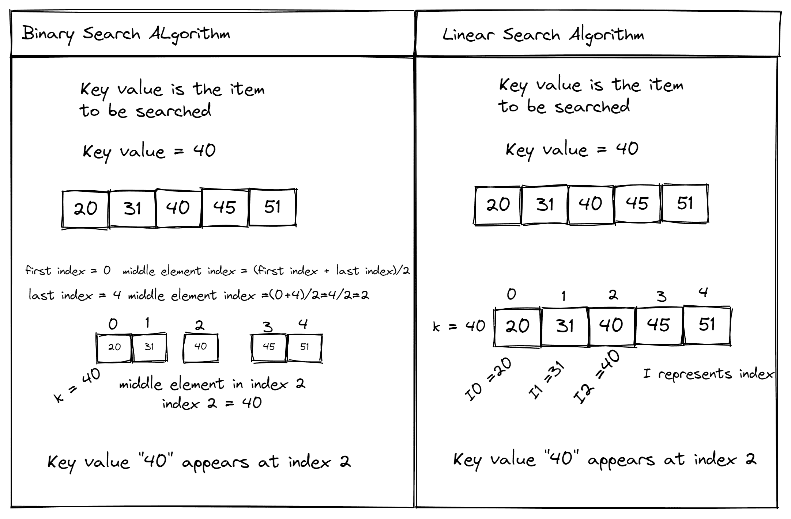
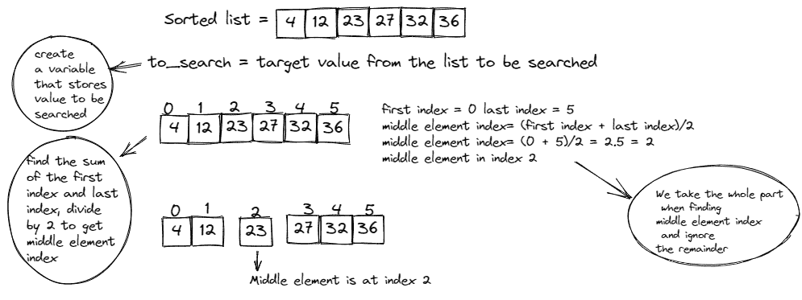
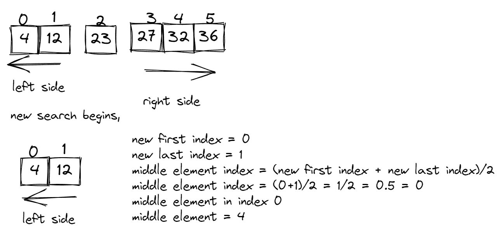
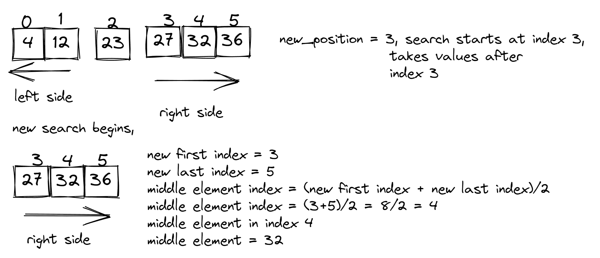
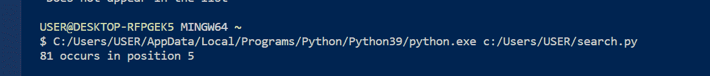
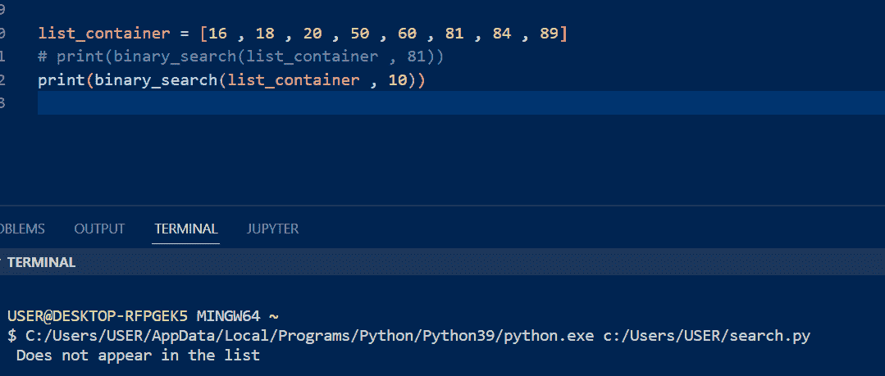
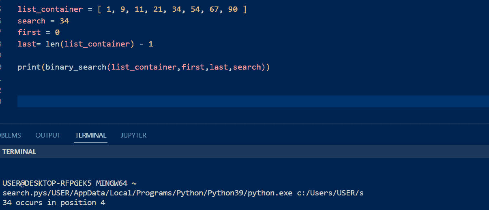
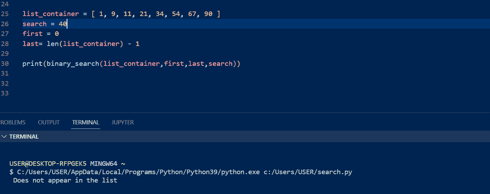

# Python 中的二分搜索法——如何用例子编写算法

> 原文：<https://www.freecodecamp.org/news/binary-search-in-python-with-examples/>

在我们的日常生活中，我们不断地搜索信息或试图找到我们遇到的问题的解决方案。

当我们浏览网上的搜索结果时，我们会选择我们认为对我们有帮助的最相关的文章或资源。

搜索是我们生活的一部分，因为我们不可能总是有答案。而且有各种算法可以帮助程序更高效地运行，更有效地处理数据。

## 我们将在本教程中讨论的内容

*   什么是搜索算法？
*   什么是二分搜索法算法？
*   二分搜索法如何运作——分而治之
*   二分搜索法算法中涉及的过程
*   二分搜索法算法中使用的方法
*   二分搜索法的真实例子

## 什么是搜索算法？

搜索算法可以从任何数据结构中检索项目。它将输入的数据与存储在其数据库中的信息进行比较，并得出结果。一个例子是在你有 1000 个号码的联系人列表中找到你最好朋友的号码。

有不同类型的搜索算法。其中一些是:

### 线性搜索算法

线性搜索算法是所有搜索算法中最简单的。顾名思义，它们是按顺序运行的。

线性搜索逐个检查列表中的元素，以找到特定的键值。这个键值在列表中的其他项目中，算法通过检查返回位置。

### Dijkstra 算法

Dijkstra 的最短路径算法用于更高级的搜索。Dijkstra 的算法绘制出两个节点之间的最短距离。这些节点通常是路由网络。

当您尝试在地图上查找路线时，这种类型的搜索非常有用。它会根据找到的最短路径为您提供选项。

### 二分搜索法算法

二分搜索法算法也被称为半区间搜索。它们返回目标值在排序列表中的位置。

这些算法使用“分而治之”技术来查找值的位置。

二分搜索法算法和线性搜索算法是简单搜索算法的例子。

在二分搜索法中，在与要搜索的键值进行比较之前，会先找到列表中的中间元素。但是在线性搜索中，通过循环并与键值进行比较，在列表中一个接一个地获取元素。



‌during·二分搜索法，列表被分成两部分以得到中间元素:有左侧、中间元素和右侧。

左侧包含小于中间元素的值，右侧包含大于中间元素的值。这个方法使用一个排序列表来工作。

排序列表中的项目按照特定的顺序排列。为了使二分搜索法的搜索有效，列表中的值必须按照正确的顺序排列，以满足搜索过程。如果列表中的值混在一起，在执行搜索之前，必须用排序算法对其进行排序。

### 排序算法

排序算法接受一个未排序的列表作为输入，并返回一个元素按特定顺序排列的列表(通常是升序)。

有[种不同类型的排序算法](https://www.freecodecamp.org/news/sorting-algorithms-explained-with-examples-in-python-java-and-c/)，像插入排序、快速排序、冒泡排序和合并排序。

## 二分搜索法如何运作——分而治之

二分搜索法算法使用一种叫做“分而治之”的技术来处理它的任务。合并排序算法使用相同的技术对列表中的项目进行排序。

在二分搜索法算法中，“分而治之”的方法是这样工作的:

*   该算法将列表分为两部分:左侧和右侧，由中间的元素分隔
*   它创建一个变量来存储要搜索的项目的值
*   它挑选出中间的元素，并将其与要搜索的项目进行比较
*   如果比较的项目相等，则过程结束
*   否则，中间的元素会大于或小于您要搜索的项目。如果中间的元素更大，算法将拆分列表并搜索左侧的元素。如果中间的元素较小，它会拆分列表并搜索列表右侧的元素。

您可以在二分搜索法过程中使用递归或迭代来实现此方法。

### 二分搜索法算法如何工作——一步一步

首先，在执行搜索之前，您需要对列表进行排序。

然后创建一个变量来存储要搜索的值。

接下来，列表分为两部分。我们将第一个和最后一个索引相加，以找到列表中中间元素的索引。

当中间元素索引的计算值是一个浮点数(比如 3.45)时，我们把整个部分作为索引。

然后我们比较我们要寻找的值和中间元素。



### 二分搜索法用例

#### 条件 1

如果中间元素等于要搜索的值，则将返回该值所在的位置，并终止该过程。

```
if middle element == to_search 
    return position of middle element 
*code ends* 
```

#### 以上图为例:

中间元素= 23，目标值/to_search = 23。比较这两个值，我们看到它们两边相等。23 出现在列表的索引 2 处。这是代码的输出，流程结束。

#### 条件 2

如果中间元素不等于“to_search ”,那么我们检查以下场景:

**场景 1** :如果中间元素大于要搜索的值:

`if middle element > to_search`

*   搜索移到左侧，因为值小于中间的元素
*   中间元素的位置向左移动 1
*   new_position = index(中间元素)- 1
*   新的搜索开始，搜索在新的位置结束，并获取之前的所有值。

#### 以上图为例:

```
middle element = 23
to_search = 4
if 23 > 4 
```

*   我们移到左侧，因为所有小于 23 的数字都存储在那里
*   new_position = index(23) - 1 = 2-1 = 1
*   搜索将在索引 1 处结束，并获取索引 1 之前的所有其他值



将新的中间元素(4)与目标值(4)进行比较，我们看到它们相等。所以搜索被终止，输出是“4”在列表中占据的位置(即索引 0)。

**场景 2** :如果中间元素小于要查找的值:

`if middle element < to_search`

*   搜索移到右侧，因为值大于中间的元素
*   中间元素的位置向右移动 1
*   new_position = index(中间元素)+ 1
*   新的搜索从新的位置开始，并在列表的最后一个索引处结束
*   从新位置到列表末尾获取所有值

#### 以第一张图片为例:

```
middle element = 23 
to_search = 32 
if 23 > 32 
```

*   我们移到右侧，因为所有大于 23 的数字都存储在那里。索引(23) = 2，
*   new_position = index(23) + 1 = 2+1 = 3
*   搜索将从索引 3 开始，并获取索引 3 之后的所有其他值



将中间元素(32)与目标值(32)进行比较，我们看到它们是相等的。因此搜索终止，输出是“4”在列表中占据的位置(索引 4)。

## 二分搜索法算法中使用的‌‌Methods

有两种方法可以在搜索中实现“分治”技术。它们是迭代和递归。

### 什么是迭代？

为了从 tuple、list 或 dictionary 中获取元素，需要使用循环遍历这些元素。

迭代是执行过程中重复的语句序列，它有可计数的值。例如，当遍历随机列表时，我们遍历包含列表的实际变量来获取值。

#### 迭代二分搜索法的代码实现

代码如下:

```
def binary_search(list_num , to_search):
    first_index = 0
    size = len(list_num)
    last_index = size - 1
    mid_index = (first_index + last_index) // 2
    # print(mid_index)
    mid_element = list_num[mid_index]
    # print(mid_element)

    is_found = True
    while is_found:
        if first_index == last_index:
            if mid_element != to_search:
                is_found = False
                return " Does not appear in the list"

        elif mid_element == to_search:
            return f"{mid_element} occurs in position {mid_index}"

        elif mid_element > to_search:
            new_position = mid_index - 1
            last_index = new_position
            mid_index = (first_index + last_index) // 2
            mid_element = list_num[mid_index]
            if mid_element == to_search:
                return f"{mid_element} occurs in position {mid_index}"

        elif mid_element < to_search:
            new_position = mid_index + 1
            first_index = new_position
            last_index = size - 1
            mid_index = (first_index + last_index) // 2
            mid_element = list_num[mid_index]
            if mid_element == to_search:
                return f"{mid_element} occurs in position {mid_index}"

list_container = [16 , 18 , 20 , 50 , 60 , 81 , 84 , 89]
print(binary_search(list_container , 81))
print(binary_search(list_container , 10)) 
```

现在让我们看看这里发生了什么:

*   首先，我们传递一个列表和一个要搜索的值(to_search)作为函数的输入。
*   在函数中，我们创建第一个索引的变量名，并将其赋值为“0”。列表中的第一个索引总是“0”。
*   然后我们创建四个变量名:“size”存储列表的长度，“last_index”存储最后一个元素的索引，“mid_index”存储查找中间元素索引的操作，“mid_element”存储使用 mid 索引作为位置从列表中获得的中间元素。
*   然后，我们引入一个 while 循环，使条件重复运行。在 while 循环上面，我们创建了一个名为“is_found”的变量，并将其设置为“True”。该条件检查是否找到了“要搜索的项目”。
*   在 while 循环中，我们检查所有的条件。第一个条件是检查中间元素和变量“to_search”是否相等。如果它们相等，将返回该项的位置。
*   然后我们检查第二个条件(如果中间元素！=要搜索的项目)这就引出了两个场景:
    –如果中间的元素大于要搜索的项目，那么新的位置会左移一次。搜索将从第一个索引开始，并在新的最后一个索引位置结束。
    –如果中间元素小于要搜索的项目，新位置将向右移动一次。搜索将从新的位置开始，作为新的第一个索引，并在最后一个索引处结束。

在这些场景的最后，我们检查新的中间元素是否与要搜索的项目相同。如果相同，则返回该项的位置。如果不是，则检查条件，直到值相等。

对于错误处理，假设我们想要搜索一个没有出现在列表中的值。如果我们在这两个条件下结束，循环将继续运行，最终可能使系统崩溃。

为了捕捉错误，我们设置了一个条件来检查第一个索引是否等于最后一个索引。然后我们检查中间的元素是否等于要搜索的项目。如果不相等，“被发现”将为“假”。当您运行它时，它显示一个空数组。在我的代码中，输出是一个语句。

最后一步是调用函数，并显示结果。

结果如下:

如果元素在列表中，则输出位置。



如果元素不在列表中，输出如下所示:



### 什么是‌‌Recursion？

如果一个函数引用自身或前一项来解决一个任务，那么这个函数就被称为递归函数。

递归函数是重复的，并且是按顺序执行的。它从一个复杂的问题开始，把事情分解成一个简单的形式。

#### 递归二分搜索法的代码实现

有了递归，就简单多了，需要的代码也少了。它看起来是这样的:

```
def binary_search(list_num, first_index, last_index, to_search):
    if last_index >= first_index:

        mid_index = (first_index + last_index) // 2
        mid_element = list_num[mid_index]

        if mid_element == to_search:
            return f"{mid_element} occurs in position {mid_index}"

        elif mid_element > to_search:
            new_position = mid_index - 1
            # new last index is the new position
            return binary_search(list_num, first_index, new_position, to_search)

        elif mid_element < to_search:
            new_position = mid_index + 1
             # new first index is the new position
            return binary_search(list_num, new_position, last_index, to_search)

    else:
        return " Does not appear in the list"

list_container = [ 1, 9, 11, 21, 34, 54, 67, 90 ]
search = 34
first = 0
last= len(list_container) - 1

print(binary_search(list_container,first,last,search)) 
```

*   首先，函数接受四个输入:第一个索引、最后一个索引、列表和 to_search(要搜索的项)。
*   然后我们检查最后一个索引的值是否大于或等于第一个索引的值。如果条件为真，我们将寻找中间元素索引的操作赋给变量名“mid_index”。然后使用 mid 索引作为位置从列表中获取中间元素。
*   我们在第一个“if”块下创建一个“if”语句，检查中间的元素和变量“to_search”是否相等。如果它们相等，将返回该项的位置。
*   然后我们检查第二个条件，(如果中间元素！=要搜索的项目)这就引出了两个场景:
    –如果中间的元素大于要搜索的项目，那么新的位置会左移一次。搜索将从第一个索引开始，并在新位置结束。我们返回函数，并把新的位置作为最后一个索引值传入。
    –如果中间元素小于要搜索的项目，新位置将向右移动一次。搜索将从新的位置开始，并在最后一个索引处结束。我们返回函数，并把新的位置作为第一个索引值传入。
*   最后一个条件将与第一个“if”语句在同一缩进上。如果 to_search 不在列表中，它将返回一条语句

最后一步是调用函数，并显示结果。

结果如下:

如果元素在列表中，输出是位置:



如果元素不在列表中，则输出是一条语句:



## 二进制 Search‌的真实例子

你可能没有意识到，但我们一直在表演二分搜索法。以下是一些你在日常生活或工作中可能会用到或遇到的例子:

*   在字典中搜索单词
*   在图书馆的文学区中搜索文学教科书
*   在排序列表中搜索元素
*   在根据身高排列的一排学生中搜索身高超过 5 英尺 3 英寸的学生。

## 结论

在本文结束时，您应该熟悉二分搜索法算法是如何工作的，以及如何用代码实现它们。

如果你不能一下子掌握所有的东西也没关系——只要给自己一些时间和练习。如果您遇到任何错误或有任何问题，可以通过 [Twitter](https://twitter.com/HeritageAlabi1) 联系我。

‌‌

‌‌

‌‌

‌‌

‌‌

‌‌

‌