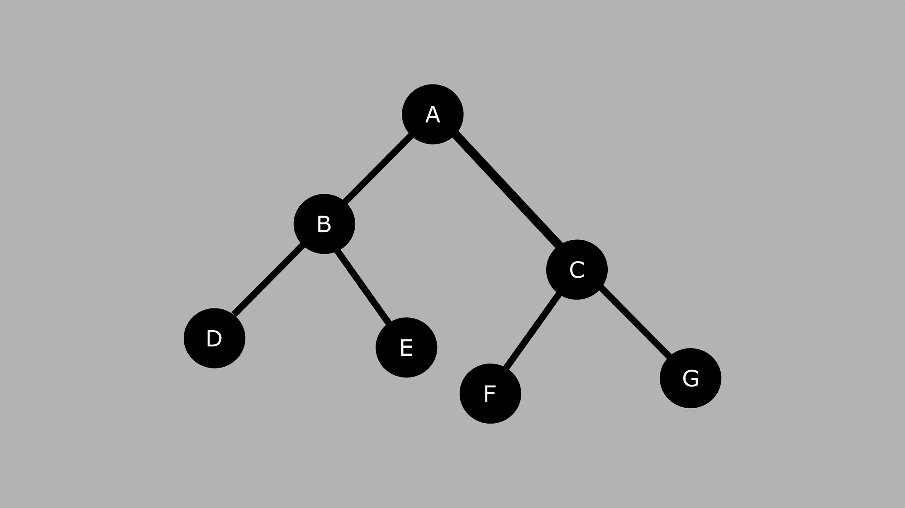
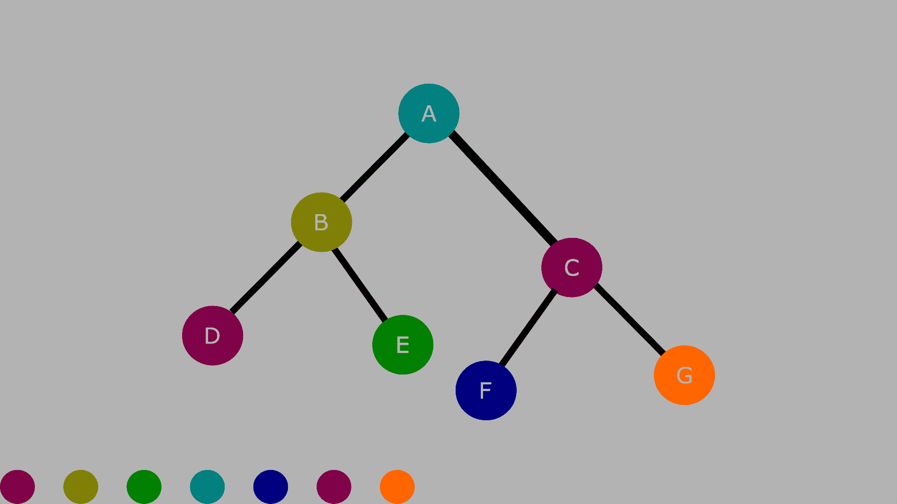
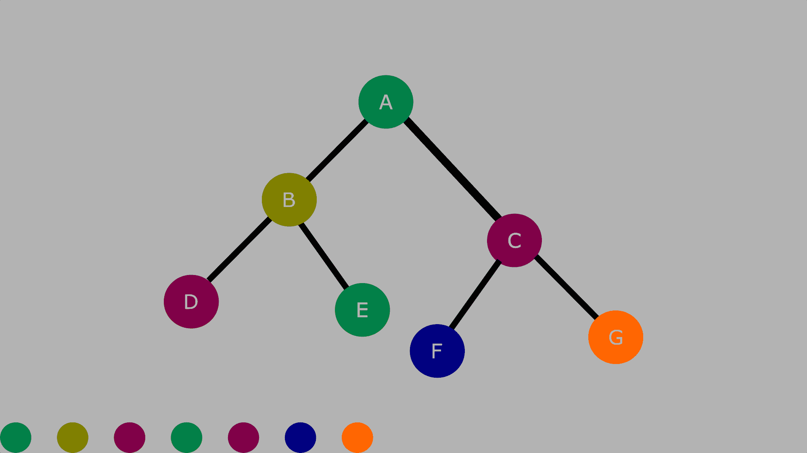
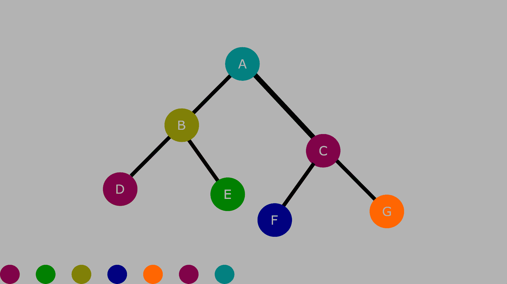

# 二叉查找树遍历–BST 的顺序、前顺序和后顺序

> 原文：<https://www.freecodecamp.org/news/binary-search-tree-traversal-inorder-preorder-post-order-for-bst/>

在本教程中，您将学习什么是二叉查找树，树的组成部分，以及描述树的组成部分时使用的一些常用术语。

我们还将看到如何使用一些常见的算法来遍历一棵树——所有这些都用清晰的例子来说明。

## 什么是二叉查找树？

二叉查找树是由节点组成的二叉树。每个节点都有一个表示其值的键。

左子树上节点的值小于根节点的值。并且右边子树上的节点的值大于根节点的值。

根节点是两个子树的父节点。

下图显示了二叉树的主要部分:

Diagram of a binary search tree

让我们看看节点之间的关系。

*   `**A**`是根节点。
*   左子树从 **`B`** 开始，右子树从 **`C`** 开始。
*   节点 **`A`** 有两个子节点——**`B`**和 **`C`** 。
*   节点 **`C`** 是 **`F`** 和 **`G`** 的父节点。 **`F`** 和 **`G`** 是兄弟姐妹。
*   节点 **`F`** 和 **`G`** 被称为**叶**节点，因为它们没有子节点。
*   节点 **`B`** 是 **`D`** 和 **`E`** 的父节点。
*   节点 **`D`** 是 **`H`** 和 **`I`** 的父节点。
*   **`D`****`E`**是兄弟姐妹，还有**`H`****`I`**。
*   节点 **`E`** 是一个叶节点。

这里有一些我们刚刚用来描述上述树的重要术语:

**根:**树中最顶端的节点。

**父节点:**有一个或多个子节点的节点。

**子节点:**从另一个节点(父节点)扩展而来的节点。

**叶:**没有子节点的节点。

## 二叉查找树是用来做什么的？

二分搜索法树帮助我们加快二分搜索法的速度，因为我们可以更快地找到物品。

我们可以使用二叉查找树来添加和删除树中的项目。

我们也可以用二叉树按等级顺序表示数据。在某些情况下，它可以用作图表来表示信息的集合。

接下来，我们将看看遍历二叉树时使用的一些技术。

## 什么是树遍历？

遍历树意味着以特定的顺序访问和输出每个节点的值。在本教程中，我们将使用 Inorder、Preorder 和 Post order 树遍历方法。

树遍历的主要重要性在于，有多种方式来执行遍历操作，而不像数组、位图、矩阵这样的线性数据结构，遍历是以线性顺序进行的。

这些遍历树的方法都有特定的顺序:

*   对于**为了**，你从**左边的**子树遍历到**根**，然后到**右边的**子树。
*   对于**前序**，您从**根**遍历到**左**子树，然后到**右**子树。
*   对于 **Post order** ，您从**左侧**子树遍历到**右侧**子树，然后到**根**。

以下是表示上述信息的另一种方式:

Inorder => Left，Root，Right。

预订= >根，左，右。

发布顺序= >左，右，根。

### 如何使用有序遍历来遍历一棵树

我们将创建一个类似于上一节中的树，但是这一次节点键将是数字而不是字母。

请记住，左子树上节点的值总是小于根节点的值。另外，右边子树上节点的值大于根节点的值。

这是我们将要使用的图表:

回想一下，顺序遍历的顺序是左、根、右。

这是我们使用 inorder 遍历后得到的结果:

**D、B、E、A、F、C、G**

如果这对你来说看起来有点复杂，那就按照下面图片中的颜色顺序来

Inorder traversal

### 如何使用前序遍历来遍历树

这里的顺序是根，左，右。

使用上面相同的图表，我们有:

**A、B、D、E、C、F、G**

下面是使用不同颜色的相同图表作为指南:

Preorder traversal

### 如何使用后序遍历来遍历树

后序遍历的顺序是左、右、根。

以下是输出:

**D，E，B，F，G，C，A**

如果你不知道我们是如何得出这个结果的，那么使用下面图片中的颜色作为指导:

Postorder traversal

## 结论

在本教程中，我们学习了什么是二叉查找树，二叉树的各个部分是什么，以及与树相关的常用术语。我们还看到了一些可以用来遍历树的算法。

感谢您的阅读！