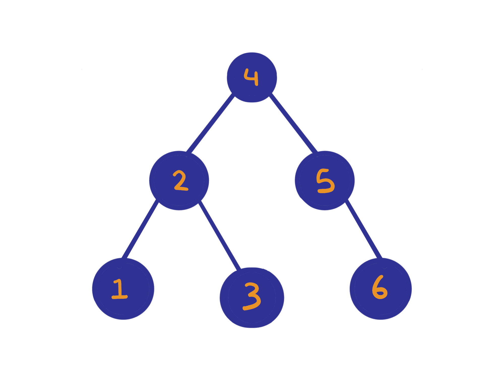

# 面向 JavaScript 初学者的二叉查找树算法

> 原文：<https://www.freecodecamp.org/news/binary-tree-algorithms-for-javascript-beginners/>

我最近有机会教高中生如何编码。关于用 JavaScript 语言编写的算法的初学者友好教程并不多，而 JavaScript 正是他们正在学习的语言。所以我决定做一个。

在这篇文章中，我会尽力解释一些你在编码面试前应该学习的核心算法。

如果你不熟悉二叉树的概念，我鼓励你查看一下维基百科的页面。如果你完全掌握了这些基本算法，你将更容易解决更复杂的问题。

## 什么是二叉查找树？

BST 通常出现在编码访谈中，它是一种树状数据结构，在最顶端有一个根。它们是存储数值的好方法，因为它们的有序性质允许快速搜索和查找。

与普通采油树相比，BST 具有以下特性:

*   每一个左边的子节点都比它的父节点有更小的值
*   每个正确的子代都比它的父代有更大的值
*   每个节点可以包含 0 到 2 个子节点。

下图应该能更清楚地说明问题。

## 二叉树节点的定义



A binary search tree

我们通常在 Javascript 中用以下函数定义一个二叉树节点:

```
 function TreeNode(val, left, right) {
     this.val = val
     this.left = left
     this.right = right
 } 
```

## 二叉树基本遍历(有序、后序、前序)

首先要知道如何遍历 BST 的每个节点。这允许我们在 BST 的所有节点上执行功能。例如，如果我们想在 BST 中找到一个值`x`，我们需要节点。

有三种主要方法可以做到这一点。幸运的是，他们有共同的主题。

### 有序遍历

递归算法是开始二叉树有序遍历的最简单的方法。想法如下:

*   如果节点为空，则什么也不做——否则，递归调用节点左侧子节点上的函数。
*   然后，在遍历完所有留下的子节点后，在节点上执行一些操作。我们当前的节点肯定是最左边的节点。
*   最后，调用 node.right 上的函数。

Inorder 算法从左到中到右遍历树节点。

```
/**
* @param {TreeNode} root
*/
const inorder = (root) => {
    const nodes = []
    if (root) {
        inorder(root.left)
        nodes.push(root.val)
        inorder(root.right)
    }
    return nodes
}
// for our example tree, this returns [1,2,3,4,5,6] 
```

### 后序遍历

递归算法是开始后序遍历最简单的方法。

*   如果节点为空，则什么也不做——否则，递归调用节点左侧子节点上的函数。
*   当不再有左孩子时，调用 node.right 上的函数。
*   最后，在节点上做一些操作。

后序遍历从左到右到中间访问树节点。

```
/**
* @param {TreeNode} root
*/
const postorder = (root) => {
    const nodes = []
    if (root) {
        postorder(root.left)
        postorder(root.right)
        nodes.push(root.val)
    }
    return nodes
}
// for our example tree, this returns [1,3,2,6,5,4] 
```

### 前序遍历

递归算法是开始前序遍历的最简单的方法。

*   如果节点为空，什么也不做，否则，在节点上做一些操作。
*   遍历到节点的左侧子节点并重复。
*   遍历 node 的右边子节点并重复。

后序遍历从中到左到右访问树节点。

```
/**
* @param {TreeNode} root
*/
const preorder = (root) => {
    const nodes = []
    if (root) {
        nodes.push(root.val)
        preorder(root.left)
        preorder(root.right)
    }
    return nodes
}
// for our example tree, this returns [4,2,1,3,5,6] 
```

## 什么是有效的二叉查找树？

有效的二叉查找树(BST)的所有左侧子节点的值都小于父节点，所有右侧子节点的值都大于父节点。

要验证树是否是有效的二叉查找树，请执行以下操作:

*   定义当前节点可以拥有的最小值和最大值
*   如果节点的值不在这些范围内，则返回 false
*   递归验证节点的左子节点，最大边界设置为节点的值
*   递归验证节点的右子节点，将最小界限设置为节点的值

```
/**
* @param {TreeNode} root
*/
const isValidBST = (root) => {
    const helper = (node, min, max) => {
        if (!node) return true
        if (node.val <= min || node.val >= max) return false
        return helper(node.left, min, node.val) && helper(node.right, node.val, max)
    }
    return helper(root, Number.MIN_SAFE_INTEGER, Number.MAX_SAFE_INTEGER)
} 
```

## 如何找到二叉树的最大深度

这里，算法试图找到我们的 BST 的高度/深度。换句话说，我们正在研究 BST 包含多少个“级别”。

*   如果节点为空，我们返回 0，因为它没有增加任何深度
*   否则我们在当前深度上加+ 1(我们穿越了一层)
*   递归计算节点子节点的深度，并返回 node.left 和 node.right 之间的最大和

```
/**
* @param {TreeNode} root
*/
const maxDepth = function(root) {
    const calc = (node) => {
        if (!node) return 0
        return Math.max(1 + calc(node.left), 1 + calc(node.right))
    }
    return calc(root)
}; 
```

## 如何找到两个树节点之间的最低共同祖先

让我们提高难度。我们如何在我们的二叉树中找到两个树节点之间的共同祖先？让我们看一些例子。


A binary search tree

在这棵树中，3 和 1 的最低共同祖先是 2。3 和 2 的 LCA 是 2。6 加 1 加 6 的 LCA 是 4。

看到这里的图案了吗？两个树节点之间的 LCA 要么是节点本身(3 和 2 的情况)，要么是父节点，其中第一个子节点位于其左子树的某处，第二个子节点位于其右子树的某处。

寻找两个树节点 p 和 q 之间的最低共同祖先(LCA)的算法如下:

*   验证在左子树或右子树中是否找到 p 或 q
*   然后，验证当前节点是 p 还是 q
*   如果在左边或右边的子树中找到 p 或 q 中的一个，并且 p 或 q 中的一个是节点本身，我们就找到了 LCA
*   如果 p 和 q 都在左边或右边的子树中找到，我们就找到了 LCA

```
/**
* @param {TreeNode} root
* @param {TreeNode} p
* @param {TreeNode} q
*/
const lowestCommonAncestor = function(root, p, q) {
    let lca = null
    const isCommonPath = (node) => {
        if (!node) return false
        var isLeft = isCommonPath(node.left)
        var isRight = isCommonPath(node.right)
        var isMid = node == p || node == q
        if (isMid && isLeft || isMid && isRight || isLeft && isRight) {
            lca = node
        }
        return isLeft || isRight || isMid
    }
    isCommonPath(root)
    return lca
}; 
```

## 包扎

总之，我们已经学会了如何遍历、验证和计算 BST 的深度。

这些算法在编码面试中经常被问到。在实践更高级的 BST 应用之前，理解它们是很重要的，比如寻找两个节点的 LCA。