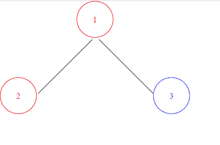
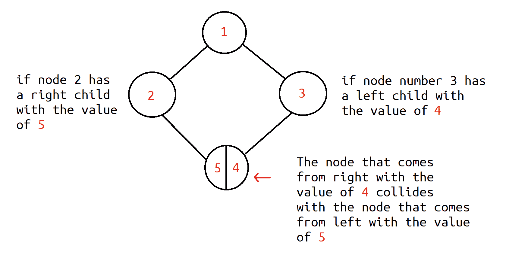
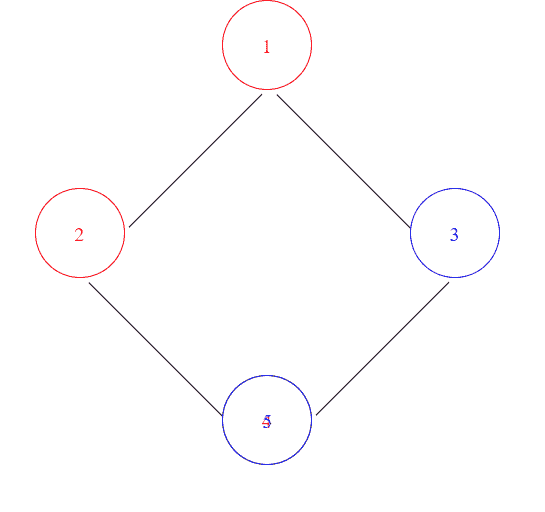
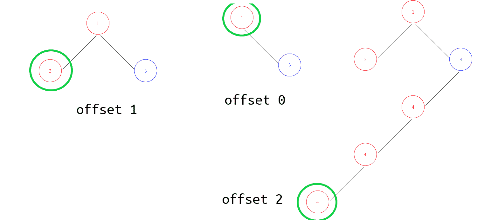

# 如何使用 C#、CSS 和 HTML 创建 BinaryTreeViewer(代码和算法演练)

> 原文：<https://www.freecodecamp.org/news/binarytreeviewer-with-c-c-css-html-by-gilad-bar-ilan/>

二叉树是最复杂的数据结构之一。它们如此困难的原因之一是很难用一种简单的方式将它们形象化。

在本教程中，我将向你展示如何创建你自己的 BinaryTreeViewer，它将允许你在运行时观察你的树。

你可以在这里查看该项目的源代码:[https://github.com/giladbarilan/binary-tree-viewer](https://github.com/giladbarilan/binary-tree-viewer)

## 什么是二叉树？

二叉树是一种非常常用的基于节点的数据结构。树的每个节点由三个元素组成:

*   节点的值，
*   对左子的引用(如果它没有左子，则可以为空)，
*   对右子级的引用(如果它没有右子级，则可以为空)。

例如，假设我们有一个值为 1 的节点，左边有一个值为 3 的子节点，右边有一个值为 2 的子节点。下面是我们绘制树形图的方法:


一个节点最多可以有两个子节点，但也可以有一个或没有子节点。当我们想要遍历二叉树中的元素时，我们通常使用递归方法(下面显示了一个例子)。

现在我们知道了二叉树数据结构是如何工作的，让我们学习如何在 C#中实现二叉树结构。

```
namespace BinaryTreeViewer
{
    /// <summary>
    /// Represents a Binary Tree class used for the BinaryTreeViewer.
    /// </summary>
    /// <typeparam name="T">The tree node's type.</typeparam>
    public partial class BinaryTree<T>
    {
        private BinaryTree<T>? rightNode; // right node of the binary tree.
        private BinaryTree<T>? leftNode; // left node of the binary tree.
        public T value { get; set; } // the value of the current node.

        public BinaryTree(T value)
        {
            this.value = value;
            this.rightNode = null;
            this.leftNode = null;
        }

        public BinaryTree(T value, BinaryTree<T>? left, BinaryTree<T>? right) : this(value)
        {
            this.rightNode = right;
            this.leftNode = left;
        }

        public void SetLeftNode(BinaryTree<T> node)
        {
            this.leftNode = node;
        }

        public void SetRightNode(BinaryTree<T> node)
        {
            this.rightNode = node;
        }

        public BinaryTree<T>? GetRightNode() => this.rightNode;
        public BinaryTree<T>? GetLeftNode() => this.leftNode;

        public override string? ToString() => this.value?.ToString();
    }
}
```

binary_tree_implementation.cs

在上面的代码中，我们用我们讨论过的 3 个元素构建了二叉树结构:值、右边的子元素和左边的子元素。问号表明它们是可空的。

让我们做一个简单的例子，演示如何打印一个二叉树的所有元素。

```
//Builds the tree.

BinaryTree<int> tree2 = new BinaryTree<int>(1);
tree2.SetRightNode(new BinaryTree<int>(2));
tree2.GetRightNode().SetLeftNode(new BinaryTree<int>(4));
tree2.SetLeftNode(new BinaryTree<int>(3));
tree2.GetLeftNode().SetRightNode(new BinaryTree<int>(5));
PrintTree(tree2);

//Prints out the tree
public static void PrintTree<T>(BinaryTree<T> tree_)
{
    if (tree_.GetLeftNode() != null) //if he has a child from his left.
     PrintTree(tree_.GetLeftNode()); //go to his left child family.

    if (tree_.GetRightNode() != null) //if he has a child from his right.
     PrintTree(tree_.GetRightNode()); //go to his right child family.

    Console.WriteLine(tree_.value); //print the current value.
}
```

## 基本二叉树算法

在我们进入实现之前，从理解算法开始是一个好主意。

让我们回到简单的树的例子:



从这个小例子中，我们实际上可以理解如何正确构建树的基础。

首先，不可能预测我们必须给父节点多少偏移量(以便有足够的空间来绘制树的最左边的节点)。因此，我们需要首先找到树最左边的节点。

一旦我们找到了它，我们就会明白我们需要从父树偏移多少。

在这个例子中，我们不能先写父节点，因为我们不知道从左边会有多少个节点。如果我们在写节点 1 的时候在 x 轴上没有任何偏移，我们可能会在绘制节点 2 时遇到问题。

### 二叉树算法的问题是

当我们画树时，我们从父节点取一个恒定的距离。在上面的示例中，父节点到节点 3 的距离等于父节点到节点 2 的距离。因此，这种算法可能会遇到诸如菱形图这样的问题。

### 什么是菱形图？



假设父节点既有左子节点(节点 2)，又有右子节点(节点 3)。并且右孩子(节点 3)有左孩子(节点 4)，而左孩子(节点 2)有右孩子(节点 5)。

在这种情况下，我们将与子节点(节点 4 和节点 5)发生碰撞，因为它们将被放置在相同的位置。

现在，有两种主要的方法来解决这个问题:

*   进行预构建计算，将树绘制为非对称树，而不必与父树保持恒定的距离。
*   来自左边的颜色节点使用一种颜色，来自右边的颜色节点使用不同的颜色。

第一个实现的问题是，为了节省时间，我们使用了 BinaryTreeViewer。即使使用这种实现比着色更整洁、更美观，程序还是会太慢，会损害我们代码的性能。

因此，在本教程中，我们将坚持使用第二种方法来实现对菱形图问题的修复(着色)。



How the coloring algorithm output looks like.

## 如何实现算法

既然我们已经讨论了二叉树是什么，它们的问题是什么，以及我们将使用什么算法来解决这些问题——是时候实际实现算法了。

> **注**:一个**分部类**是一个可以在单独的文件中编写的类，在编译时会被合并。

让我们从最简单的实现开始，它是 BinaryTree 类。

```
namespace BinaryTreeViewer
{
    /// <summary>
    /// Represents a Binary Tree class used for the BinaryTreeViewer.
    /// </summary>
    /// <typeparam name="T">The tree node's type.</typeparam>
    public partial class BinaryTree<T>
    {
        private BinaryTree<T>? rightNode; // right node of the binary tree.
        private BinaryTree<T>? leftNode; // left node of the binary tree.
        public T value { get; set; } // the value of the current node.

        public BinaryTree(T value)
        {
            this.value = value;
            this.rightNode = null;
            this.leftNode = null;
        }

        public BinaryTree(T value, BinaryTree<T>? left, BinaryTree<T>? right) : this(value)
        {
            this.rightNode = right;
            this.leftNode = left;
        }

        public void SetLeftNode(BinaryTree<T> node)
        {
            this.leftNode = node;
        }

        public void SetRightNode(BinaryTree<T> node)
        {
            this.rightNode = node;
        }

        public BinaryTree<T>? GetRightNode() => this.rightNode;
        public BinaryTree<T>? GetLeftNode() => this.leftNode;

        public override string? ToString() => this.value?.ToString();
    }
}
```

在分部类的另一部分，我们有更多的方法来打印树。

```
 public partial class BinaryTree<T>
    {
        private BinaryTree<T>? max_left_node;

        /// <summary>
        /// Finds the max left offset from the starting node.
        /// </summary>
        /// <typeparam name="T"></typeparam>
        /// <param name="head">The beginning of the tree we want to draw.</param>
        /// <param name="left_offset"></param>
        /// <param name="max_offset"></param>
        /// 

        internal (BinaryTree<T>?, int max_offset) GetMaxLeft()
        {
            int max_offset = 0;

            GetMaxLeft(this, 0, ref max_offset);
            return (max_left_node, max_offset);
        }

        private void GetMaxLeft(BinaryTree<T> head, int left_offset, ref int max_offset)
        {
            if (head.GetLeftNode() != null)
            {
                left_offset += 1;

                if(left_offset > max_offset)
                {
                    max_left_node = head.GetLeftNode();
                }

                GetMaxLeft(head.GetLeftNode(), left_offset, ref max_offset);
            }
            if (head.GetRightNode() != null)
            {
                left_offset -= 1;
                GetMaxLeft(head.GetRightNode(), left_offset, ref max_offset);
            }

            if(left_offset > max_offset)
            {
                max_offset = left_offset;
            }
        }
    }
```

### GetMaxLeft

**GetMaxLeft** 应该给我们两个实现所需的细节:

*   哪个节点是树的最左边的节点，以及
*   它与父节点的左偏移量(稍后将乘以一个常数值)。



Return Value Visualization

我们将两者作为一个元组返回。

### GetMaxLeft 如何工作

**GetMaxLeft** 返回从树的父节点开始的最左边的节点偏移量。这是如何工作的？

对于向右节点的每一次移动，我们减少左偏移值(因为我们正在远离文档的左侧)。并且每当我们转到左边的节点时，我们就增加偏移量(因为我们越来越靠近文档的左边)。

我们保留我们到达的头的最长偏移量，并通过引用" **max_offset** "参数来设置它的值，我们在非递归 **GetMaxLeft** 方法中返回该参数。

## BTViewer 类

既然我们已经完成了基础，是时候面对我们在这里要解决的问题了，那就是如何画树。在 BTViewer 类中，我们管理所有的树构建过程和临时文件。

```
using System.Diagnostics;
using System.Text.RegularExpressions;

namespace BinaryTreeViewer
{
    /// <summary>
    /// Shows in an HTML document a graph of the tree.
    /// RECOMMENDATION: Use break-point on the line of the BinaryTreeViewer.View .
    /// </summary>
    public static class BTViewer
    {
        private static int StartingTempCount = 1; //the starting temp count so we know how many
        //trees we've created.
        private static int tempCount = 1; // the number of temporary files we've created.
        private static readonly string BINTREE_CSS_FILENAME = "BINTREEINITIALIZER.css";
        private static string fileName => $"BINTREE{tempCount}.html"; //name structure of BINTREE files.

        /// <summary>
        /// Sets the value of tempCount according to the previous saved_trees.
        /// </summary>
        static BTViewer()
        {
            string directory = Directory.GetCurrentDirectory();

            if(!Directory.GetFiles(directory).Contains(BINTREE_CSS_FILENAME))
            {
                File.WriteAllText(BINTREE_CSS_FILENAME, @"#circle{
		border-radius: 50%;
		display: inline-block;
		border: 1px solid black;
	}
	.a{
		padding: 50px;
	}
	.b{
		width: 70px;
		height: 70px;
	}
	 .line{
width: 150px;
height: 150px;
border-bottom: 1px solid black;
position: absolute;
}");
            }

            Regex reg = new Regex(@"BINTREE\d+\.html"); //we check what is the latest binary tree file.

            List<string> fileNames = Directory.GetFiles(directory).ToList();
            fileNames = reg.Matches(string.Join(" ", fileNames)).Select(x => x.Value).ToList(); //Get the BINTREE files on the directory.

            if (fileNames.Count > 0)
            {
                //we find the next fileName as -> the latest file name count (BINTREE*Number*) + 1
                tempCount = fileNames.Select(x => int.Parse(new Regex(@"\d+").Match(x).Value)).Max() + 1; //the next tree to draw.
            }
            else
                tempCount = 1;

            StartingTempCount = tempCount;
        }

        /// <summary>
        /// Writes the full tree into a file by the head.
        /// </summary>
        /// <typeparam name="T"></typeparam>
        /// <param name="tree">The starting of the tree.</param>
        public static void View<T>(BinaryTree<T> tree)
        {
            // in case they entered invalid tree.
            if (tree == null)
                return;

            // in case there is only one node on the tree (only the head).
            if(tree.GetRightNode() == null && tree.GetLeftNode() == null)
            {
                InitializeFileStructure(); // we initialize the file structure.
                DrawElement(tree, (0, 0), false);      
                File.AppendAllText(fileName, "</html>");
                RunTree();

                tempCount++;
                return;
            }

            //how much left we take from the beginning (max value). -> max_left_offset
            int max_left_offset = tree.GetMaxLeft(); // the max left node.

            // we start by finding the position of the head of the tree.
            (int x, int y) head_position = (0, 50);
            head_position.x = max_left_offset * (100 + 50); //the size of every circle + offset between circles.

            InitializeFileStructure();
            DrawTree(tree, head_position, false);

            File.AppendAllText(fileName, "</html>"); //finishes the document.

            RunTree();

            tempCount++;
        }

        /// <summary>
        /// Deletes the trees we want to clear.
        /// </summary>
        public static void ClearTrees(TreesToClear treesToClear)
        {
            string directory = Directory.GetCurrentDirectory();
            Regex reg = new Regex(@"BINTREE\d+\.html"); //the structure of a BINTREE runtime file.
            Regex findCount = new Regex(@"\d+");

            List<string> fileNames = Directory.GetFiles(directory).ToList();
            fileNames = reg.Matches(string.Join(" ", fileNames)).Select(x => x.Value).ToList();

            if (((int)treesToClear & 0b1) != 0) //current run.
            {
                fileNames.Where(x => int.Parse(findCount.Match(x).Value) >= StartingTempCount)
                         .ToList().ForEach(x => File.Delete(x));
            }

            if(((int)treesToClear & 0b10) != 0) //other runs.
            {
                fileNames.Where(x => int.Parse(findCount.Match(x).Value) < StartingTempCount)
                         .ToList().ForEach(x => File.Delete(x));
            }
        }

        /// <summary>
        /// Draws the full tree to the file.
        /// </summary>
        /// <typeparam name="T"></typeparam>
        /// <param name="head">The head of the tree.</param>
        /// <param name="position">The starting position to draw the tree.</param>
        private static void DrawTree<T>(BinaryTree<T> head, (int x, int y) position, bool right)
        {
            DrawElement(head, position, right);

            if(head.GetRightNode() != null)
            {
                DrawLine(position, (position.x + 150, position.y + 150));
                DrawTree(head.GetRightNode(), (position.x + 150, position.y + 150), true);
            }

            if(head.GetLeftNode() != null)
            {
                DrawLine(position, (position.x - 150, position.y + 150));
                DrawTree(head.GetLeftNode(), (position.x - 150, position.y + 150), false);
            }
        }

        /// <summary>
        /// Draws line between the nodes.
        /// </summary>
        /// <param name="p1"></param>
        /// <param name="p2"></param>
        private static void DrawLine((int x, int y) p1, (int x, int y) p2)
        {
            double left;

            if (p2.x < p1.x)
            {
                left = Math.Min(p1.x, p2.x);
            }
            else
            {
                left = p2.x - 75;
            }

            string line = $"\n<div class = 'line' style = 'left:{left}px;top:{p1.y}px;transform:rotate({45 * (Math.Sign(p2.x - p1.x))}deg);'></div>";
            File.AppendAllText(fileName, line);
        }

        /// <summary>
        /// Draws a node.
        /// </summary>
        /// <typeparam name="T"></typeparam>
        /// <param name="node"></param>
        /// <param name="position"></param>
        private static void DrawElement<T>(BinaryTree<T> node, (double x, double y) position, bool right)
        {
            //DIAMOND COLLISION MEANING -> 
            /* 
                    ( )
                    / \
                  ( ) ( )
                    \ /
                    ( ) -> collision (two different nodes placed on the same place in the graph
                                      because the distance between each node to his father is
                                      equal).
             */
            //In a case of diamond collision one node might override the other node on a graph.
            //Because we want to see both nodes on the graph then we color nodes that
            //comes from right and nodes that comes from left
            //with two different colors -> Red & Blue -> so we'll be able to see the differences.
            string color = "red"; //Red -> left side node, Blue -> right side node.

            if (right)
                color = "blue";

            File.AppendAllText(fileName, $"\n<div class ='b' id = 'circle' style='border: 1px solid {color};position: absolute; left: {position.x}px; top: {position.y}px;'></div>");
            File.AppendAllText(fileName, $"\n<div style='color:{color};position: absolute; left: {position.x - (node.ToString().Length / 2) * 4 + 32}px; top: {position.y + 28}px;'>{node.value}</div>");
        }

        //Opens the tree.
        private static void RunTree()
        {
            //shows the tree to the user. (opens the HTML file on browser).
            Process run_process = Process.Start(@"cmd.exe", "/c " + fileName);
            run_process.WaitForExit();
        }

        /// <summary>
        /// Creating a BINTREE file structre.
        /// </summary>
        /// <returns></returns>
        private static string InitializeFileStructure()
        {
            //The basic content of a BINTREE file.
            string content = @$"<html><link rel=""stylesheet"" href=""{BINTREE_CSS_FILENAME}"">";
            File.WriteAllText(fileName, content);
            return fileName;
        }
    }
}

public enum TreesToClear
{
    CurrentRun = 0b1,
    PreviousRuns = 0b10
}
```

btviewer.cs

如您所见，BTViewer 类很长，所以让我们把它分成几个部分。

### 如何画这棵树

现在我们将演练如何打印树。

#### BTViewer。查看方法

```
 public static void View<T>(BinaryTree<T> tree)
        {
            // in case they entered invalid tree.
            if (tree == null)
                return;

            // in case there is only one node on the tree (only the head).
            if(tree.GetRightNode() == null && tree.GetLeftNode() == null)
            {
                InitializeFileStructure(); // we initialize the file structure.
                DrawElement(tree, (0, 0), false);      
                File.AppendAllText(fileName, "</html>");
                RunTree();

                tempCount++;
                return;
            }

            //how much left we take from the beginning (max value). -> max_left_offset
            int max_left_offset = tree.GetMaxLeft(); // the max left node.

            // we start by finding the position of the head of the tree.
            (int x, int y) head_position = (0, 50);
            head_position.x = max_left_offset * (100 + 50); //the size of every circle + offset between circles.

            InitializeFileStructure();
            DrawTree(tree, head_position, false);

            File.AppendAllText(fileName, "</html>"); //finishes the document.

            RunTree();

            tempCount++;
        }
```

view.cs

这个方法对用户是公开的，他们使用这个方法来打印树。

在该方法中，我们处理两种不同的情况:

**我们在树中只有一个节点**——我们简单地将节点树写入一个 HTML 文件，更新下一个文件号(后面会解释)，打开文件进行预览，然后退出方法。

**我们在树上有多个节点**–**在这种情况下，我们首先使用我们之前解释过的方法获取关于树的最左侧节点的数据。在我们收集了最左边节点的数据之后，我们可以计算出树的头部应该在文档中的什么位置。**

**在我们找到树的头部的开始位置后，我们可以从头部开始写树。**

### **我们如何画这棵树？**

**现在是时候深入到绘图实现了。我们使用的第一个方法是 **InitializeFileStructure** ，它基本上给了我们绘制树的圆圈所需的 CSS 属性。**

```
`#circle{
		border-radius: 50%;
		display: inline-block;
		border: 1px solid black;
	}
	.a{
		padding: 50px;
	}
	.b{
		width: 70px;
		height: 70px;
	}
	.line{
        width: 150px;
        height: 150px;
        border-bottom: 1px solid black;
        position: absolute;
	}`
```

****InitializeFileStructure** 故意创建了一个没有`</HTML>`的 HTML 文件，因为我们想在以后添加更多的标签来构建树的结构。**

#### **绘制树方法**

```
 `private static void DrawTree<T>(BinaryTree<T> head, (int x, int y) position, bool right)
        {
            DrawElement(head, position, right);

            if(head.GetRightNode() != null)
            {
                DrawLine(position, (position.x + 150, position.y + 150));
                DrawTree(head.GetRightNode(), (position.x + 150, position.y + 150), true);
            }

            if(head.GetLeftNode() != null)
            {
                DrawLine(position, (position.x - 150, position.y + 150));
                DrawTree(head.GetLeftNode(), (position.x - 150, position.y + 150), false);
            }
        }`
```

**DrawTree.cs**

****DrawTree** 方法是一个递归方法，应该打印树的所有线条和圆圈。**

*   **在每次输入时，我们使用 DrawElement 方法打印当前元素。**
*   **然后，我们遍历二叉树上的所有节点，并通过增加/减少前一个节点的常数值来设置每个节点的位置。**
*   **我们还使用 DrawLine 方法从每个节点到其子节点画一条线。**

#### **德鲁莱蒙方法**

```
`private static void DrawElement<T>(BinaryTree<T> node, (double x, double y) position, bool right)
        {
            //DIAMOND COLLISION MEANING -> 
            /* 
                    ( )
                    / \
                  ( ) ( )
                    \ /
                    ( ) -> collision (two different nodes placed on the same place in the graph
                                      because the distance between each node to his father is
                                      equal).
             */
            //In a case of diamond collision one node might override the other node on a graph.
            //Because we want to see both nodes on the graph then we color nodes that
            //comes from right and nodes that comes from left
            //with two different colors -> Red & Blue -> so we'll be able to see the differences.
            string color = "red"; //Red -> left side node, Blue -> right side node.

            if (right)
                color = "blue";

            File.AppendAllText(fileName, $"\n<div class ='b' id = 'circle' style='border: 1px solid {color};position: absolute; left: {position.x}px; top: {position.y}px;'></div>");
            File.AppendAllText(fileName, $"\n<div style='color:{color};position: absolute; left: {position.x - (node.ToString().Length / 2) * 4 + 32}px; top: {position.y + 28}px;'>{node.value}</div>");
        }`
```

**DrawElement.cs**

**DrawElement 方法做了几件事:**

*   **确定颜色->该方法检查节点来自哪个节点。如果节点来自右边，我们把它涂成蓝色，但是如果它来自左边，我们把它涂成红色。**
*   **使用颜色和位置，我们还可以添加一个圆圈来包裹节点的值。**
*   **然后我们加上圆内节点的值。**

#### **画线法**

```
 `private static void DrawLine((int x, int y) p1, (int x, int y) p2)
        {
            double left;

            if (p2.x < p1.x)
            {
                left = Math.Min(p1.x, p2.x);
            }
            else
            {
                left = p2.x - 75;
            }

            string line = $"\n<div class = 'line' style = 'left:{left}px;top:{p1.y}px;transform:rotate({45 * (Math.Sign(p2.x - p1.x))}deg);'></div>";
            File.AppendAllText(fileName, line);
        }`
```

**DrawLine.cs**

****DrawLine** **方法**简单地取两个节点并在它们之间画一条线。为了拟合直线，我们还做了一些数学计算。**

**完成树的构建后，我们添加`</HTML>`来完成文档。然后我们调用方法`RunTree()`在运行时打开树。我们还将`tempCount`加 1，这样我们就知道下一个文件的名字是什么了。**

## **二叉树文件**

### **什么是二叉树文件？**

**项目的最后一部分包括管理我们创建的 HTML 文件。每个 HTML 文件将遵循一个名称格式，该格式将由名称 BINTREE 组成。然后我们将添加按时间顺序排列的 ID，然后添加文件的扩展名。**

**例如:**

```
`BINTREE1.html
BINTREE2.html
...
BINTREE143.html
BINTREE144.html`
```

**我们将创建的下一个 HTML 文件的 ID 将等于最后一个文件名 ID 号+ 1。**

*   **ID 从 1 开始->我们将创建的第一个二叉树是“BINTREE1.html”。**

### **如何管理二叉树文件**

#### **BTViewer 的静态构造函数**

```
`static BTViewer()
        {
            string directory = Directory.GetCurrentDirectory();

            if(!Directory.GetFiles(directory).Contains(BINTREE_CSS_FILENAME))
            {
                File.WriteAllText(BINTREE_CSS_FILENAME, @"#circle{
		border-radius: 50%;
		display: inline-block;
		border: 1px solid black;
	}
	.a{
		padding: 50px;
	}
	.b{
		width: 70px;
		height: 70px;
	}
	 .line{
width: 150px;
height: 150px;
border-bottom: 1px solid black;
position: absolute;
}");
            }

            Regex reg = new Regex(@"BINTREE\d+\.html"); //we check what is the latest binary tree file.

            List<string> fileNames = Directory.GetFiles(directory).ToList();
            fileNames = reg.Matches(string.Join(" ", fileNames)).Select(x => x.Value).ToList(); //Get the BINTREE files on the directory.

            if (fileNames.Count > 0)
            {
                //we find the next fileName as -> the latest file name count (BINTREE*Number*) + 1
                tempCount = fileNames.Select(x => int.Parse(new Regex(@"\d+").Match(x).Value)).Max() + 1; //the next tree to draw.
            }
            else
                tempCount = 1;

            StartingTempCount = tempCount;
        }`
```

**static_constructor.cs**

**因为我们按时间顺序给它们命名，所以我们不能随意给它们命名。这可能会覆盖已经创建的其他二叉树文件。这就是为什么我们使用正则表达式来查找所有的二叉树文件。**

**然后我们取我们能找到的最大 ID，并把它加 1。在这次运行中，新值将成为二叉树文件 ID 的开始。**

**例如，如果我们运行程序两次，第一次运行时我们已经创建了 5 个二叉树文件，这意味着我们在下一次运行时的 tempCount 将从 6 开始，我们将创建的下一个文件将是 BINTREE6.html。**

**静态构造函数的另一项工作是检查我们是否有一个`BINTREEINITIALIZER.css`文件。如果我们没有，那么我们需要重新创建。(`BINTREEINITIALIZER.css`是我们用于二叉树样式的 CSS 文件。)**

**我们还将 tempCount 保存在一个不同的字段中，即`StartingTempCount`，这样我们就可以知道我们是用什么 ID 开始写树的(我们将在后面使用这个特性)。**

#### **ClearTrees 方法**

****ClearTrees** 方法允许我们删除在**当前运行和先前运行期间创建的临时二叉树文件。**该方法接受一个枚举值，指示我们想要删除什么。该方法有 3 个可接受的选项:**

```
`BTViewer.ClearTrees(TreesToClear.CurrentRun); //CLEAR ONLY CURRENT RUN
BTViewer.ClearTrees(TreesToClear.PreviousRuns); //CLEAR ONLY PREVIOUS RUNS
BTViewer.ClearTrees(TreesToClear.PreviousRuns | TreesToClear.CurrentRun); //CLEAR ALL`
```

```
`public static void ClearTrees(TreesToClear treesToClear)
        {
            string directory = Directory.GetCurrentDirectory();
            Regex reg = new Regex(@"BINTREE\d+\.html"); //the structure of a BINTREE runtime file.
            Regex findCount = new Regex(@"\d+");

            List<string> fileNames = Directory.GetFiles(directory).ToList();
            fileNames = reg.Matches(string.Join(" ", fileNames)).Select(x => x.Value).ToList();

            if (((int)treesToClear & 0b1) != 0) //current run.
            {
                fileNames.Where(x => int.Parse(findCount.Match(x).Value) >= StartingTempCount)
                         .ToList().ForEach(x => File.Delete(x));
            }

            if(((int)treesToClear & 0b10) != 0) //other runs.
            {
                fileNames.Where(x => int.Parse(findCount.Match(x).Value) < StartingTempCount)
                         .ToList().ForEach(x => File.Delete(x));
            }
        }`
```

**ClearTrees.cs**

**该方法使用正则表达式来获取我们拥有的所有二叉树文件。它使用另一个正则表达式从我们所有的二叉树文件中获取 ID。**

**对于当前运行->我们删除所有大于或等于`StartingTempCount`的文件，它是我们在程序当前运行期间创建的第一个文件的 ID。**

**对于以前的运行->我们做与当前运行相反的事情:我们删除 ID 比我们在这次运行中创建的第一个文件的 ID 低的所有文件。**

## **包扎**

**恭喜你。现在，您可以创建自己的 BinaryTreeViewer 系统了。我希望这篇文章能帮助你更清楚地理解二叉树。**