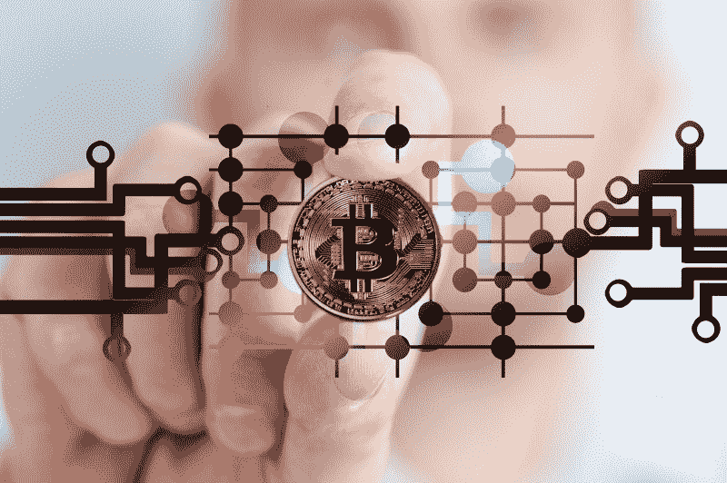
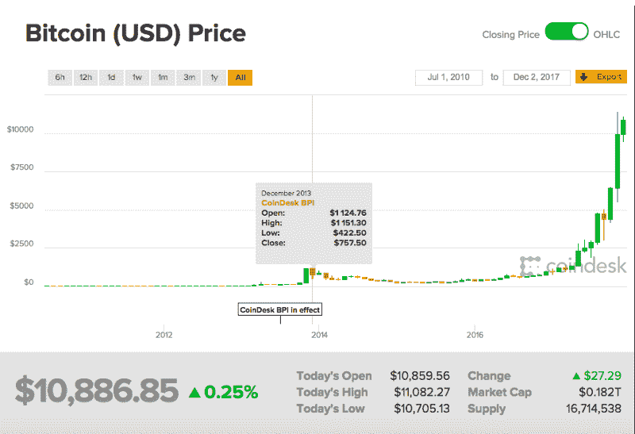

# 比特币:翻转硬币

> 原文：<https://www.freecodecamp.org/news/bitcoin-flipping-the-coin-a060df19d20d/>

德万什·拉拉

# 比特币:翻转硬币

> “没有人能看到泡沫。这就是它成为泡沫的原因。”—大空头

如果你看过克里斯蒂安·贝尔的电影*短片*，你一定对上面的话很熟悉。这是否意味着比特币是一个等待破裂的泡沫？也许吧。**目前还没有人知道真相**。仅仅通过阅读新闻或跟踪市场很难评估某样东西是否是泡沫。那么，让我们从了解什么是比特币开始吧？

比特币是一种去中心化的数字加密货币。迷茫？我们举个例子。假设你通过一个卖家从亚马逊订购耳机，你想知道它们在发货给你之前的确切位置。你是怎么发现的？答案是，你不能。你无法知道产品的确切来源，也肯定无法找出与这些特定耳机相关的所有交易。

想象一下，如果有某种数字账本可以告诉你所有这些，甚至更多，会怎么样？有。**区块链(Blockchain)是一种分布式数字账本，存储与特定产品或资产相关的所有交易**。但是什么是比特币呢？**区块链技术让比特币成为可能。**

比特币是一种点对点的分散式数字货币，用于在线购买和销售产品。分散意味着比特币不是由一家公司、政府或金融机构管理或发行。比特币使用区块链将所有交易存储在一个数字账本中，然后全球所有使用电脑的人都可以访问这个账本。既然你已经了解了基本情况，那就让我们来理解为什么围绕比特币有如此多的炒作。

**coindesk.com**

**1 写这篇文章的时候比特币的价格是 10886.85 美元**。很疯狂，对吧？2011 年 4 月，比特币的价值是 1 美元，而现在，6 年后，它的价值是其原始价值的 1 万多倍。但是，为什么比特币的价格如此之高？**比特币不断增长的需求和公众对加密货币的认识导致比特币价格上涨**。

比特币的价格最近波动很大，但一些人打赌，到 2018 年底，比特币的价格将升至 4 万美元。人们甚至在购买 1 比特币的 5%，以便在价格再次上涨时卖掉它并赚取利润。各种比特币交易所，如 Coinome、Zebpay、Unocoin 和印度的其他几家交易所，目前允许公众购买和出售比特币，也称为 BTC。那么，应该投资比特币吗？我希望我能在这篇文章结束时帮助你回答这个问题。

沃伦·巴菲特是世界上最富有的人之一，也被广泛认为是他那个时代最好的投资者之一，他这样评价比特币:“这是海市蜃楼。”

其他几个人同意他的想法，但这意味着他们是正确的吗？嗯，他们可能是，但很难评估这样的事情，谁知道未来会发生什么。让我们来看看一些要点:

1.  **波动性:**比特币的价格波动很大，尽管它被称为一种货币，但单日 15%的价格变化令人担忧。虽然，如果你在几年前投资了比特币，你今天就不会想到这些，因为你现在已经是百万富翁了。
2.  **监管问题:**中国等多个国家出台了各种限制措施来尝试监管比特币，一些国家甚至完全禁止使用比特币。一些人认为，一些国家正在开发自己的加密货币，这意味着更多的监管。
3.  **泡沫:**由于价格的波动和围绕它的大规模炒作，比特币在过去被拿来与其他泡沫进行了几次比较。
4.  **合法性:**尽管在印度，买卖比特币既不合法也不违法，但印度储备银行尚未宣布其为货币。
5.  **欺诈:**各种个人和公司正在联系公众，要求他们通过他们投资比特币，但由于比特币投资不受监管，如果你被某人欺骗，你也无能为力。
6.  投资的黄金法则是不要投资你无法承受损失的金额。如果你想投资一枚比特币，那就购买一小部分 1 BTC，但如果你不完全了解这个市场，就不要大量购买。还有，在价格比平时低的时候买也是个好主意。
7.  **未来:**比特币的市值远远高于任何货币或股票。它在全世界都被使用，是真正的国际化。
8.  **钱包:**你在网上购买比特币后，它们被储存在虚拟钱包中，但它们并不完全安全，因为拥有钱包的公司可能会遭到黑客攻击。重要的是要记住，如果你决定购买比特币，不要将其存储在在线硬币交易平台上。取而代之的是，把它取出来，存放在硬件或离线钱包里，这样就安全了。
9.  **供应:**现存比特币的数量预计不会超过 2100 万，因为数量有限，所以需求持续增长。
10.  **期货交易:**之前投资过股票的人都明白期货的意义。期货是在一段时间后以预定价格购买或出售某物的合同。为什么我在这里提到这个？这是因为比特币期货可能成为现实，事实上美国监管机构已经向几家公司发出了允许比特币期货交易的绿色信号。

希望这些要点能帮助你决定目前是否应该投资比特币。明智地投资，只投资于你真正理解和相信的东西。

#### 如果你喜欢这篇文章，请点击？底部的按钮。另外，请订阅我下面的时事通讯: