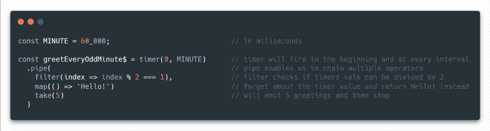
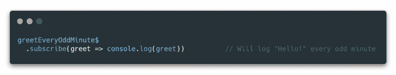
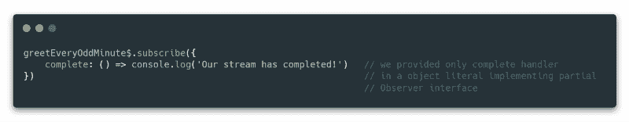
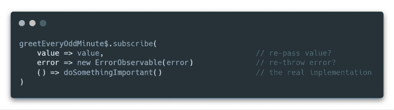
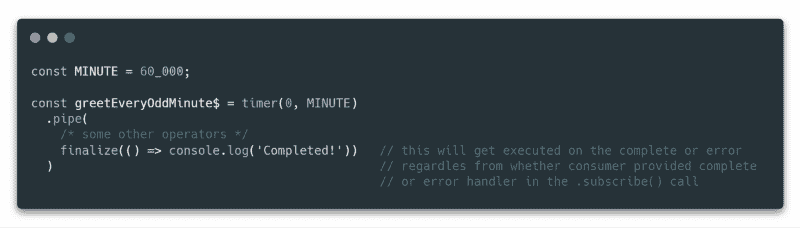
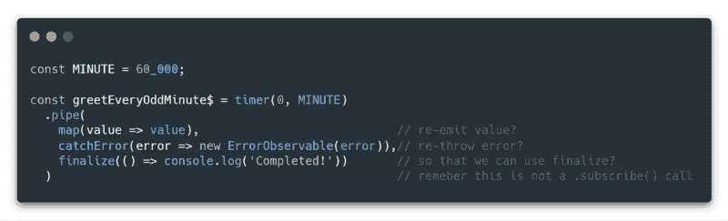
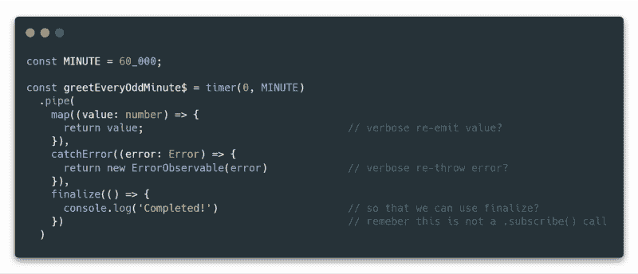

# ⚡如何不再重蹈 again⚡rxjs 的覆辙

> 原文：<https://www.freecodecamp.org/news/blitz-tips-rxjs-pipe-is-not-a-subscribe-125c89437a2c/>

托马斯·图拉真

# ⚡如何不再重蹈 again⚡rxjs 的覆辙

#### 记住:。管道()不是。订阅()！

Look! A lightning tip! (Original ? by M[ax Bender)](https://unsplash.com/photos/iF5odYWB_nQ?utm_source=unsplash&utm_medium=referral&utm_content=creditCopyText)

> 这篇文章是针对试图增加他们的 RxJs 知识的初学者的，但也可以作为快速刷新或参考展示给更有经验的开发人员！

今天我们将长话短说，直奔主题！

目前我在一个相当大的组织工作，相当多的团队和项目(超过 40 个 spa)正在迁移到 Angular，因此也是 RxJs。

这代表了一个接触 RxJs 中令人困惑的部分的好机会，一旦掌握了 API 并专注于特性的实现，就很容易忘记这些部分。

### 的”。subscribe()"函数

RxJs 可观察性代表我们想要发生的事情的“处方”。它是声明性的，这意味着所有的操作和转换从一开始就被完整地指定。

一个可观察到的流的例子可能看起来像这样…

Example of the RxJs observable stream declaration

这个 RxJs 可观察流本身实际上什么也不做。要执行它，我们必须在我们的代码库中订阅它！

This subscription will log our greetings every odd minute

在上面的例子中，我们只为可观察对象发出的值提供了一个处理程序。subscribe 函数本身最多接受三个不同的参数来处理**下一个**值、**错误**或**完成**事件。

除此之外，我们还可以传入一个具有上述属性的对象。这样的对象是`Observer`接口的一个实现。observer 的优点是我们不必为我们不感兴趣的处理程序提供实现或至少一个`null`占位符。

考虑下面的例子…

在上面的代码中，我们传递了一个只包含完整处理程序的对象文字，正常值将被忽略，错误将在堆栈中冒泡。

在本例中，我们传递下一个错误的处理程序，并将其作为 subscribe 函数的直接参数完成。所有未实现的处理程序都必须作为 null 或 undefined 来传递，直到我们得到我们感兴趣的参数。

正如我们所见，`.subscribe()`函数调用实现的内联参数风格是位置性的。

> 根据我的经验，内联参数风格是各种项目和组织中最常见的一种。

不幸的是，很多时候我们可能会遇到如下的实现…

Example of redundant handlers often encountered in the “wild”

上面的例子包含了`next`和`error`处理程序的冗余处理程序，这些处理程序**什么都不做**，并且可能已经被`null`所取代。

> 更好的方法是用`complete`处理程序实现传递 observer 对象，完全省略其他处理程序！

### 的”。管道()"和运算符

由于初学者习惯于提供三个参数来订阅，所以当在管道链中使用类似的操作符时，他们通常会尝试实现类似的模式。

RxJs 操作符是`catchError`和`finalize`，经常与`.subscribe()`处理程序混淆。它们也有相似的用途——唯一的区别是它们用在管道的上下文中，而不是订阅的上下文中。

如果我们想要对 RxJs 可观察流的每个订阅的完整事件做出反应，我们可以将`finalize`操作符实现为可观察流本身的一部分。

> 这样，我们就不必依赖开发人员在每一个。subscribe()调用。记住，可观察流可以被多次订阅！

Use the finalize operator to react to the complete event of the stream independently from the subscription. (Similar to tap)

这就把我们带到了在探索各种代码库时可能会遇到的最后一个也可能是最有问题的模式:在试图遵循时添加了多余的操作符。中的 subscribe()模式。管道()上下文。

此外，我们可能会遇到它更罗嗦的表亲…

Stuff might get verbose…

请注意，我们已经从最初的单行代码发展到了完整的九行代码，当我们想要修复一个 bug 或添加一个新特性时，我们必须阅读并理解这些代码。

> 当与更复杂的泛型 Typescript 类型结合时，内容可能会变得更加复杂，这会使整个代码块更加神秘(因此会浪费我们更多的时间)。

### 概括

1.  `.subscribe()`方法接受观察者对象和内联处理程序。
2.  observer 对象代表了订阅可观察流的最通用、最简洁的方式。
3.  如果我们想使用内联订阅参数(`next`、`error`、`complete`)，我们可以提供`null`来代替我们不需要的处理程序。
4.  我们应该确保在处理`.pipe()`和操作符时，不要试图重复`.subscribe()`模式。
5.  总是努力保持代码尽可能简单，并删除不必要的冗余！

#### 就是这样！✨

> 我希望您喜欢这篇文章，并且现在能够更好地理解如何用干净、简洁的实现订阅 RxJs observables！

请支持本指南。？？使用鼓掌按钮，并帮助它传播到更广泛的观众？此外，如果你有任何问题，请通过文章回复或 Twitter DMs @tom [astrajan 联系我。](https://twitter.com/tomastrajan)

> [永远不要忘记，未来是光明的](https://twitter.com/tomastrajan)

[Obviously the bright future! (? by X](https://twitter.com/tomastrajan)[avier Coiffic)](https://unsplash.com/photos/WV4B_aVj0aQ?utm_source=unsplash&utm_medium=referral&utm_content=creditCopyText)

> 开始一个有角度的项目？检查[角 NgRx 材料启动器](https://github.com/tomastrajan/angular-ngrx-material-starter)！

Angular NgRx Material Starter with built in best practices, theming and much more!

如果你已经做到了这一步，请随意查看我的其他一些关于角度和前端软件开发的文章…

[**？‍?使用 Angular CLI &原理图提高工作效率的️7 pro 技巧？**](https://hackernoon.com/%EF%B8%8F-the-7-pro-tips-to-get-productive-with-angular-cli-schematics-b59783704c54)
[**An**g*ular Schematics 是现代 web 的工作流工具——官方介绍 article HAC*kernoon.com](https://hackernoon.com/%EF%B8%8F-the-7-pro-tips-to-get-productive-with-angular-cli-schematics-b59783704c54)[**在 Angular 应用中退订 RxJS 可观察的最佳方式！**](https://blog.angularindepth.com/the-best-way-to-unsubscribe-rxjs-observable-in-the-angular-applications-d8f9aa42f6a0)
[*在 Angular 应用中处理 RxJS 订阅有许多不同的方式，我们将探究它们…*blog.angularindepth.com](https://blog.angularindepth.com/the-best-way-to-unsubscribe-rxjs-observable-in-the-angular-applications-d8f9aa42f6a0)[**Angular 6+依赖注入总指南— providedIn vs providers:[ ]？**](https://medium.com/@tomastrajan/total-guide-to-angular-6-dependency-injection-providedin-vs-providers-85b7a347b59f)
[L *et's 了解何时以及如何使用新提供的新的更好的 Angular 6+依赖注入机制语法来使…m*edium.com](https://medium.com/@tomastrajan/total-guide-to-angular-6-dependency-injection-providedin-vs-providers-85b7a347b59f)[**非常常见的角度问题的最终答案:subscribe()vs | async Pipe**](https://blog.angularindepth.com/angular-question-rxjs-subscribe-vs-async-pipe-in-component-templates-c956c8c0c794)
[*大多数流行的角度状态管理库(如 NgRx)以流的形式公开应用程序状态…*blog.angularindepth.com](https://blog.angularindepth.com/angular-question-rxjs-subscribe-vs-async-pipe-in-component-templates-c956c8c0c794)