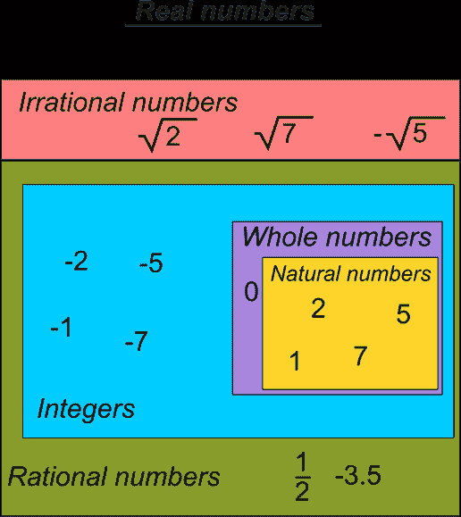

# 布尔代数真值表教程 XOR，NOR 和逻辑符号解释

> 原文：<https://www.freecodecamp.org/news/boolean-algebra/>

我们都喜欢电脑。他们可以做很多令人惊奇的事情。在几十年内，计算机已经彻底改变了人类生活的几乎所有方面。

他们可以完成不同复杂程度的任务，只需要翻转 0 和 1。看到如此简单的行动如何能导致如此多的复杂性，是很不寻常的。

但我相信你们都知道，这样的复杂性(实际上)不可能通过随机翻转数字来实现。这背后确实有一定的道理。有一些规则规定了应该如何做这件事。在本文中，我们将讨论这些规则，并了解它们如何支配计算机的“思考”方式。

## 什么是布尔代数？

我上面提到的规则是用一个叫做布尔代数的数学领域来描述的。

英国数学家乔治·布尔在他 1854 年的著作中，提出了一套操纵真值的系统规则。这些规则为处理逻辑命题提供了数学基础。这些基础导致了布尔代数的发展。

为了更好地理解布尔代数，我们首先要理解布尔代数和其他形式的代数之间的异同。

一般来说，代数是研究数学符号和可以在这些符号上进行的运算。

这些符号没有自己的意义。它们代表一些其他的量。正是这个量赋予了这些符号一些价值，也正是这个量上的运算被实际执行。

布尔代数也处理符号和控制这些符号运算的规则，但区别在于这些符号代表什么。

在普通代数中，符号代表实数，而在布尔代数中，它们代表真值。

下图显示了整组实数。这组实数包括自然数(1，2，3，4....)、整数(所有自然数和 0)、整数(.....-2, -1, 0, 1, 2, 3 ...)等等。普通代数处理这一整套数字。



相比之下，真值只由两个值组成:假和真。在这里，我想指出一个事实，我们可以用任何其他符号来表示这些值。

例如，在计算机科学中，我们通常用 0 和 1 来表示这些值。0 表示错误，1 表示正确。

你也可以用更奇特的方式，用一些其他的符号，比如猫和狗或者香蕉和橙子，来代表真实值。

这里的要点是，不管你用什么符号，这些符号的内部含义都是一样的。但是请确保在执行操作时不要更改符号。

现在的问题是，如果(真与假)，(0 和 1)只是表象，那么它们试图表现的是什么？

真值背后的潜在含义来自逻辑领域，其中真值用于判断命题是“真”还是“假”。这里，真值表示命题与真值的关系，即命题是真还是假。

一个命题只是一个类似“所有的猫都很可爱”的陈述。

如果上述命题为真，那么我们给它赋值“真”或“1”，否则我们给它赋值“假”或“0”。

在数字电子学中，真值用来表示电子电路的“开”和“关”状态。我们将在本文的后面对此进行更多的讨论。

## 布尔运算和真值表

就像普通的代数一样，布尔代数也有运算，这些运算可以应用到值上以获得一些结果。虽然这些运算与普通代数中的运算不相似，因为正如我们前面讨论的，布尔代数对真值而不是实数起作用。

### 布尔代数有三种基本运算。

**或**:又称*析取*。该操作在两个布尔变量上执行。当两个操作数都为 0 时，OR 运算的输出将为 0，否则将为 1。

为了更清楚地了解这个操作，我们可以借助下面的**真值表**来可视化它。

```
Truth tables give us an insightful representation of what the Boolean operations do and they also act as a handy tool for performing Boolean operations.

		OR Operation

Variable-1	Variable-2	Output
  0		0		0
  0		1		1
  1		0		1
  1		1		1
```

**与**:又称*连词*。该操作在两个布尔变量上执行。当两个操作数都为 1 时，AND 运算的输出将为 1，否则将为 0。真值表表示如下。

```
 AND Operation

Variable-1	Variable-2	Output
  0		0		0
  0		1		0
  1		0		0
  1		1		1
```

**非**:又称*否定*。该操作仅在一个变量上执行。如果变量的值是 1，那么这个操作简单地把它转换成 0，如果变量的值是 0，那么它把它转换成 1。

```
 Not Operation

Variable-1	Output
  0		1	
  1		0 
```

## 布尔代数与数字电路

经过最初的发展，布尔代数在很长一段时间内仍然是数学中没有任何重要实际应用的概念之一。

20 世纪 30 年代，美国数学家 Claude Shannon 意识到布尔代数可以用于二进制变量可以代表“低”和“高”电压信号或“开”和“关”状态的电路中。

这种借助布尔代数制作电路的简单想法导致了数字电子学的发展，对计算机电路的发展做出了重大贡献。

数字电路在逻辑门的帮助下实现布尔代数。逻辑门是代表布尔运算的电路。例如,“或”门将代表“或”操作。这同样适用于“非”和“与”门。

除了基本逻辑门之外，我们还可以使用基本逻辑门的组合来创建逻辑门。

**与非门**:与非门由非门和与门组合而成。如果两个输入都为 1，与非门输出为 0，否则为 1。

与非门具有功能完备性，这意味着任何布尔函数都可以通过与非门的组合来实现。

```
 NAND Gate

Variable-1	Variable-2	Output
  0		0		1
  0		1		1
  1		0		1
  1		1		0
```

**:或非门由 NOT 和 OR 门组合而成。如果两个输入都为 0，或非门输出为 1，否则为 0。**

**与与非门一样，或非门也具有功能完备性，这意味着任何布尔函数都可以仅通过使用或非门的组合来实现。**

```
 `NOR Gate

Variable-1	Variable-2	Output
  0		0		1
  0		1		0
  1		0		0
  1		1		0`
```

**大多数数字电路是使用与非门或或非门构建的，因为它们的功能完整性，也因为它们易于制造。**

**除了上面提到的门，我们还有一些特殊类型的门，用于一些特定的目的。这些措施如下:**

**XOR:XOR 门或异或门是一种特殊类型的逻辑门，如果两个输入都是 0 或 1，则输出 0，否则输出 1。**

```
 `XOR Gate

Variable-1	Variable-2	Output
  0		0		0
  0		1		1
  1		0		1
  1		1		0`
```

**XNOR:异或门是一种特殊类型的逻辑门，当两个输入都为 0 或 1 时，输出为 1，否则为 0。**

```
 `XNOR Gate

Variable-1	Variable-2	Output
  0		0		1
  0		1		0
  1		0		0
  1		1		1`
```

## **结论**

**至此，我们可以结束对布尔代数的讨论了。我希望现在你已经对布尔代数有了一个大致的了解。**

**这绝对不是你需要了解布尔代数的全部。布尔代数有很多我们在本文中无法讨论的概念和细节。**