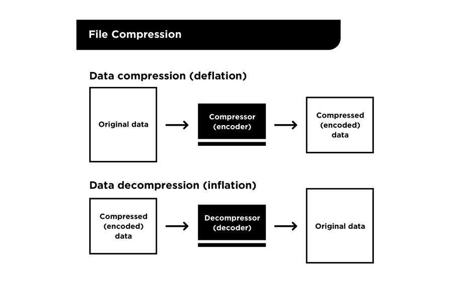
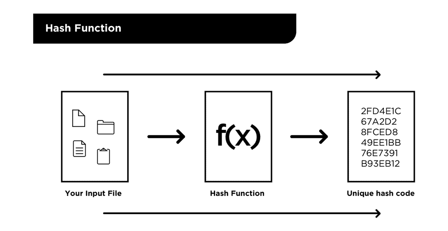

# 通过阅读 Git 的代码来提高你的编程技能

> 原文：<https://www.freecodecamp.org/news/boost-programming-skills-read-git-code/>

如今，有很多时髦的方法可以提高你的编程技能和知识，包括:

*   参加免费或付费的在线编程课程
*   阅读编程书籍
*   挑选一个个人项目，边编程边学习
*   跟随一个在线教程项目
*   与相关的编程博客保持同步

这些方法中的每一种都会吸引不同的人，每一种都有一定会让你成为更好的程序员的元素。如果你是一个中级或高级程序员，几乎可以肯定你已经尝试了这些方法中的每一个至少一次。

然而，还有一种方法被绝大多数开发人员忽略了，这在我看来是一种耻辱，因为它提供了太多的东西。这个方法就是**通过阅读、分析和理解现有的高质量代码库来学习！**

我们很幸运生活在一个好代码可以通过高质量的自由开放源码项目免费获得的时代。从 GitHub 或 BitBucket 等网站将这些代码复制到我们的本地机器上只需要不到一分钟的时间。

此外，像 Git 这样的现代版本控制系统允许我们在代码开发历史的任何时候查看代码。显然，大量的信息就在我们眼前！

在本文中，我们将讨论 Git 代码的原始版本，以强调阅读现有代码如何帮助提高您的编码技能。

我们将讨论为什么值得学习 Git 的代码，如何访问 Git 的代码，并回顾一些相关的 C 编程概念。

我们将概述 Git 的原始代码库结构，并了解 Git 的核心功能是如何在代码中实现的。

最后，我们将为好奇的开发人员推荐一些后续步骤，以继续从 Git 的代码和其他项目中学习。

## 为什么要学习 Git 的代码？

Git 的代码库对于中级开发人员来说是一个不可思议的资源，可以进一步提高他们的编程知识和技能。以下是值得深入研究 Git 代码的 7 个原因:

1) Git 可能是当今最流行的软件开发工具。简而言之，如果你是开发人员，你可能会使用 Git。学习 Git 的代码是如何工作的，会让你对你每天使用的一个基本工具有更深的理解。

2) Git 有意思！Git 是一个多功能的工具，它解决了许多有趣的问题，允许开发人员在代码上进行协作。作为一个好奇的人，我非常喜欢了解它。

3) Git 的代码是用 **C** 编程语言编写的，这为开发人员提供了一个很好的机会，可以扩展到一种他们以前可能不怎么使用的重要语言。

4) Git 利用了许多重要的编程概念，包括*内容寻址数据库、文件压缩/膨胀、哈希函数、缓存、*和一个*简单* *数据模型*。Git 的代码说明了如何在实际项目中实现这些概念。

5) Git 的代码和设计*优雅。这是一个功能性的极简代码库的很好的例子，它以一种清晰有效的方式实现了它的目标。*

6) Git 的初始提交很小——它仅由 10 个文件组成，总共包含不到 1000 行代码。与大多数其他项目相比，这是非常小的，并且很容易在合理的时间内理解。

Git 初始提交中的代码可以成功编译执行。这意味着您可以使用和测试 Git 代码的原始版本，看看它是如何工作的。

现在，让我们看看如何访问 Git 代码的原始版本。

## 如何检查 Git 的初始提交？

Git 代码库的官方副本存放在这个公共的 GitHub 库中。然而，我创建了 Git 代码库的一个分支，并在源代码中添加了大量的行内注释，以帮助开发人员轻松地逐行阅读。

由于我完成了 Git 历史上的第一次提交，我将这个项目命名为 **Baby Git** 。Baby Git 代码库位于[这个公共 BitBucket 存储库](https://bitbucket.org/jacobstopak/baby-git)。

我建议通过在终端中运行以下命令，将 Baby Git 代码库克隆到您的本地机器上:

```
git clone https://bitbucket.org/jacobstopak/baby-git.git
```

如果您想坚持使用 Git 的原始代码库(没有我添加的大量注释)，请使用以下命令:

```
git clone https://github.com/git/git.git
```

通过运行命令`cd git`浏览到新的`git`目录。你可以随意翻翻这里的文件夹和文件。

您会很快注意到，在 Git 的当前版本中——当前在您的工作目录中签出的版本——有许多文件包含许多看起来很长很复杂的代码。

很明显，Git 的当前版本对于一个开发人员来说太大了，很难在合理的时间内熟悉它。

让我们通过使用以下命令检查 Git 的初始提交来简化事情:

```
git log --reverse
```

这以相反的顺序显示了 Git 的提交日志列表，从 Git 的初始提交开始。注意，列表中的第一个提交 ID 是`e83c5163316f89bfbde7d9ab23ca2e25604af290`。

通过运行以下命令，将此提交的内容签出到工作目录中:

```
git checkout e83c5163316f89bfbde7d9ab23ca2e25604af290
```

这个[将 Git 放入一个*分离头状态*T3，并将 Git 的原始代码文件放入工作目录。](https://initialcommit.com/blog/what-is-git-head)

现在运行`ls`命令列出这些文件，注意只有 10 个真正包含代码！(11 号只是自述)。对于中级开发人员来说，理解这些文件中的代码是完全可以管理的！

**注意:**如果您正在使用我的 Baby Git 库，您将需要运行命令`git checkout master`来放弃分离的头并移回到主分支的顶端。这将使您能够逐行查看描述 Git 代码如何工作的所有内联注释！

## 有助于理解 Git 代码的重要 C 概念

在深入 Git 的代码之前，回顾一下出现在整个代码库中的一些 C 编程概念会有所帮助。

### c 头文件

C 头文件是以扩展名`.h`结尾的代码文件。头文件用于存储变量、函数和其他 C 对象，开发者希望使用`#include "headerFile.h"`指令将它们包含在多个`.c`源代码文件中。

如果您熟悉用 Python 或 Java 导入文件，这是一个类似的过程。

### c 函数原型(或函数签名)

函数原型或签名告诉 C 编译器有关函数定义的信息——函数的名称、参数数量、参数类型和返回类型——而不提供函数体。在调用函数后函数体出现的情况下，它们帮助 C 编译器识别函数属性。

下面是一个函数原型的例子:

```
int multiplyNumbers(int a, int b);
```

### c 宏

C 语言中的宏本质上是一个基本变量，它在 C 程序中的代码编译之前被处理。使用`#define`指令创建宏，例如:

```
#define TESTMACRO asdf
```

这会创建一个名为`TESTMACRO`的宏，其值为`asdf`。在代码中使用占位符`TESTMACRO`的地方，它将被预处理器(在代码编译之前)替换为值`asdf`。

宏通常以几种方式使用:

*   通过检查是否定义了宏来进行真/假切换
*   将代码中要替换的简单整数或字符串值存储在多个位置
*   将一个简单的(通常只有一行)代码段存储在多个位置的代码中进行替换

宏是方便的工具，因为它们使开发人员能够更新单行代码，从而影响多个位置的代码行为。

### c 支柱

C #中的结构是与单个对象相关的一组属性。

您可能熟悉 Java 和 Python 等语言中的类。一个结构是一个类的前身——它可以被认为是一个没有方法的原始类。

```
struct person {

	int person_id;
	char *first_name;
	char *last_name;

};
```

这个结构通过将一个 ID 字段以及这个人的名字和姓氏组合在一起来表示一个人。可以从该结构实例化和初始化变量，如下所示:

```
struct person jacob = { 1, "Jacob", "Stopak" };
```

可以使用点运算符检索结构属性:

```
jacob.person_id
jacob.first_name
jacob.last_name
```

### c 指针

指针是变量的内存地址——它是存储变量的值的内存地址。

指向现有变量的指针可以通过使用`&`符号获得，并存储在用`*`符号声明的指针变量中:

```
int age = 21;

int* age_pointer = &age;
```

这个代码片段定义了变量`age`，并给它赋值 21。然后它定义一个*指针，指向一个叫做`age_pointer`的整数*，并使用`&`来获取存储年龄变量的值的内存地址。

也可以使用`*`对指针进行*解引用*(即获取存储在内存地址的值)。

```
int new_age = *age_pointer + 10;
```

继续我们前面的例子，我们使用`*age_pointer`语法获取存储在指针(21)中的值，并给它加 10。所以`new_age`变量包含的值是 31。

既然我们对 C 编程的简短介绍已经完成，让我们回到 Git 的代码。

## Git 代码库结构概述

有十个相关的代码文件组成了 Git 的初始提交。我们将从简单讨论这两个开始:

*   生成文件
*   cache.h

我们先讨论`Makefile`和`cache.h`，因为它们有点特殊。

`Makefile`是一个构建文件，包含一组用于将其他源代码文件构建成可执行文件的命令。

当您从命令行运行命令`make all`时，Makefile 将编译源代码文件，并为 Git 的命令提供相关的可执行文件。如果你感兴趣，我在 Git 的 makefile 上写了一篇[深度指南。](https://initialcommit.com/blog/Learn-Git-Makefile)

**注意:**如果你真的想在本地编译 Git 的代码，我推荐你这么做，你将需要使用我上面提到的 Git 版本的代码。原因是我做了一些调整，允许 Git 的原始代码在现代操作系统上编译。

接下来是`cache.h`文件，这是 Baby Git 唯一的头文件。如上所述，头文件定义了许多函数签名、结构、宏和其他在`.c`源代码文件中使用的设置。如果你好奇，我写了一个关于 Git 头文件的[深度指南。](https://initialcommit.com/blog/Learn-Git-Header-Files)

剩下的八个代码文件都是`.c`源代码文件:

*   `init-db.c`
*   `update-cache.c`
*   `read-cache.c`
*   `write-tree.c`
*   `commit-tree.c`
*   `read-tree.c`
*   `cat-file.c`
*   `show-diff.c`

每个文件(除了`read-cache.c`)都是以它包含的代码所在的 Git 命令命名的——有些可能你很熟悉。例如，`init-db.c`文件包含用于初始化新 Git 存储库的`init-db`命令的代码。正如你可能猜到的，这是`git init`命令的前身。

事实上，这些`.c`文件中的每一个(除了`read-cache.c`)都包含了最初八个 Git 命令中的一个命令的代码。构建过程编译每个文件，并为每个文件创建一个可执行文件(具有匹配的名称)。一旦这些可执行文件被添加到文件系统路径中，它们就可以像任何现代 Git 命令一样被执行。

因此，在使用`make all`命令编译代码后，会生成以下可执行文件:

*   `init-db`:初始化一个新的 Git 仓库。相当于`git init`。
*   `update-cache`:向暂存索引添加文件。相当于`git add`。
*   `write-tree`:从当前索引内容在 Git 存储库中创建一个树对象。
*   `commit-tree`:在 Git 存储库中创建一个新的提交对象。相当于`git commit`。
*   `read-tree`:从 Git 存储库中打印出树的内容。
*   `cat-file`:从 Git 存储库中获取一个对象的内容，并存储在当前目录下的一个临时文件中。相当于`git show`。
*   `show-diff`:显示存放在索引中的文件与文件系统中这些文件的当前版本之间的差异。相当于`git diff`。

这些命令按顺序单独执行，类似于现代 Git 命令作为标准开发工作流的一部分执行的方式。

我们还没有讨论的一个文件是`read-cache.c`。这个文件包含一组 helper 函数，其他的`.c`源代码文件使用这些函数从 Git 存储库中检索信息。

既然我们已经触及了 Git 初始提交中的每个重要文件，那么让我们来讨论一些让 Git 发挥作用的核心编程概念。

## Git 核心概念的实现

在这一节中，我们将讨论 Git 用来施展魔法的以下编程概念，以及它们是如何在 Git 的原始代码中实现的:

*   文件压缩
*   散列函数
*   目标
*   当前目录缓存(临时区域)
*   内容可寻址数据库(对象数据库)

### 文件压缩

文件压缩，也称为紧缩，用于 Git 中的存储和性能效率。这减小了 Git 存储在磁盘上的文件的大小，并在 Git 需要通过网络传输这些文件时提高了数据检索的速度。

这很重要，因为 Git 的本地和网络操作需要尽可能快。作为数据检索过程的一部分，Git 解压缩或膨胀文件以获取它们的内容。



Source: https://initialcommit.com/blog/Learn-Git-Guidebook-For-Developers-Chapter-2

文件收缩和膨胀是使用流行的`zlib.h` C 库在 Git 的原始代码中实现的。这个库包含用于压缩和解压缩内容的函数、结构和属性。具体来说，`Zlib`定义了一个`z_stream`结构，用于保存将要收缩或膨胀的内容。

以下`zlib`函数分别用于*初始化*放气或充气流:

```
/*
 * Initializes the internal `z_stream` state
 * for compression at `level`, which indicates
 * scale of speed versuss compression on a 
 * scale from 0-9\. Sourced from <zlib.h>.
 */
deflateInit(z_stream, level);

/*
 * Initializes the internal `z_stream` state for
 * decompression. Sourced from <zlib.h>.
 */
inflateInit(z_stream);
```

以下`zlib`功能用于执行实际的放气和充气操作:

```
/*
 * Compresses as much data as possible and stops
 * when the input buffer becomes empty or the
 * output buffer becomes full. Sourced from <zlib.h>.
 */
deflate(z_stream, flush);

/*
 * Decompresses as much data as possible and stops
 * when the input buffer becomes empty or the
 * output buffer becomes full. Sourced from <zlib.h>.
 */
inflate(z_stream, flush);
```

实际的放气/充气过程要比这复杂一点，涉及到设置压缩流的几个参数，但我们不会在这里进行更详细的描述。

接下来，我们将讨论散列函数的概念，以及它们是如何在 Git 的原始代码中实现的。

### 哈希函数

哈希函数是一种可以轻松地将输入转换为唯一输出的函数，但很难或不可能逆转该操作。换句话说，就是一个**单向函数**。利用当今的技术，不可能使用散列函数的输出来推断用于生成该输出的输入。

Git 使用哈希函数——特别是 SHA-1 哈希函数——来为我们告诉 Git 跟踪的文件生成唯一标识符。

作为开发人员，我们使用文本编辑器对我们正在处理的代码库中的代码文件进行更改，并且在某些时候我们告诉 Git 跟踪这些更改。此时，Git 使用这些文件更改作为哈希函数的输入。

哈希函数的输出被称为**哈希**T3。hash 是长度为 40 个字符的十六进制值，比如`47a013e660d408619d894b20806b1d5086aab03b`。



Source: https://initialcommit.com/blog/Learn-Git-Guidebook-For-Developers-Chapter-2

Git 将这些散列用于各种目的，我们将在下面几节中看到。

### 目标

Git 使用一个简单的数据模型——一组结构化的相关对象——来实现其功能。这些对象是信息的核心，使 Git 能够跟踪代码库文件的变化。Git 使用的三种类型的对象是:

*   一滴
*   树
*   犯罪

让我们依次讨论每一个。

#### 一滴

blob 是 a**B**inary**L**arge**OB**object 的简称。当 Git 被告知使用`update-cache <filename.ext>`命令跟踪一个文件时，`git add`的前身)，Git 使用该文件的压缩内容创建一个新的 blob。

Git 获取文件的内容，使用我们上面描述的`zlib`函数压缩它，并使用这个压缩的内容作为 SHA-1 散列函数的输入。这就创建了一个 40 个字符的散列，Git 用它来识别有问题的 blob。

最后，Git 将 blob 作为二进制文件保存在一个名为**对象数据库**的特殊文件夹中(稍后会有更多相关内容)。blob 文件的名称是生成的散列，blob 文件的内容是使用`update-cache`添加的压缩文件内容。

#### 树

树对象用于将一次添加到 Git 的多个 blobs 链接在一起。它们还用于将 blob 与文件名(以及其他文件元数据，如权限)相关联，因为 blob 除了散列和压缩的二进制文件内容之外不提供任何信息。

例如，如果使用`update-cache`命令添加两个更改的文件，将创建一个包含这些文件的散列的树，以及这些 blobs 中的每一个对应的文件名。

Git 接下来做的事情很有意思，要注意。Git 使用**树本身的内容**作为 SHA-1 散列函数的输入，该函数生成一个 40 个字符的散列。这个散列用于标识树对象，Git 将它保存在保存 blobs 的同一个特殊文件夹中——我们很快就会谈到这个对象数据库。

#### 犯罪

与 blobs 和树相比，您可能更熟悉提交对象。提交表示 Git 保存的一组文件更改，以及关于更改的描述性信息，如提交消息、作者姓名和提交的时间戳。

在 Git 的原始代码中，提交对象是运行`commit-tree <tree-hash>`命令的结果。产生的提交对象包括指定的树对象(记住，通过映射到文件名的一个或多个 blobs 来表示文件更改的集合)，以及上一段中提到的描述性信息。

像 blobs 和树一样，Git 通过使用 SHA-1 散列函数对其内容进行散列来识别提交，并将其保存在对象数据库中。重要的是，每个提交对象还包含其父提交的散列。这样，提交就形成了一个链，Git 可以用它来表示项目的历史。

### 当前目录缓存(临时区域)

您可能知道 Git 的 staging area 是您在使用`git add`命令后更改的文件的去处，耐心地等待使用`git commit`提交。但是集结地到底是什么？

在 Git 的原始版本中，暂存区被称为**当前目录缓存**。当前目录缓存只是存储在存储库中路径`.dircache/index`下的一个二进制文件。

如前一节所述，在使用`update-cache` ( `git add`)命令将更改的文件添加到 Git 之后，Git 会计算与这些更改相关联的 blob 和树对象。生成的与暂存文件相关的树对象被添加到`index`文件中。

之所以称之为**缓存**，是因为它只是提交前存放分段更改的临时存储位置。当用户通过运行`commit-tree`命令提交时，可以提供来自当前目录缓存的树。它还包括其他提交信息，比如 Git 创建新提交对象的提交消息。

在这一点上，`index`文件被简单地删除，以便为新的变更腾出空间。

### 内容可寻址数据库(对象数据库)

对象数据库是 Git 的主要存储位置。这是我们上面讨论的所有对象——blob、树和提交——的存储位置。在 Git 的原始版本中，对象数据库只是路径`.dircache/objects/`下的一个目录。

当 Git 通过`update-cache`、`write-tree`和`commit-tree`、`git add`和`git commit`的前身等操作创建对象时，这些对象被压缩、哈希并存储在对象数据库中。

每个对象的名字是其内容的散列，因此对象数据库也被称为**内容可寻址数据库** *。* 每个内容片段(blob、树或提交)都是基于从内容本身生成的标识符来存储和检索的。

现代版 Git 的工作方式非常相似。不同之处在于，存储格式已经过优化，可以使用更高效的方法(尤其是与网络数据传输相关的方法)，但基本原理是相同的。

## 摘要

在本文中，我们讨论了 Git 代码的原始版本，以强调阅读现有代码如何帮助提高您的编码技能。

我们讨论了 Git 是一个很好的学习项目的原因，如何访问 Git 的代码，并回顾了一些相关的 C 编程概念。最后，我们概述了 Git 的原始代码库结构，并深入探讨了 Git 代码所依赖的一些概念。

## 后续步骤

如果你有兴趣了解更多关于 Git 的代码，[我们写了一本指南，你可以在这里查看](https://initialcommit.com/store/baby-git-guidebook-for-developers)。这本书详细探究了 Git 的原始 C 代码，并直接解释了代码是如何工作的。

我鼓励所有开发人员探索开源社区，尝试找到您感兴趣的优质项目。这些项目将有代码库，你可以在几分钟内克隆下来。

花些时间研究一下代码，你可能会学到一些你从未想过会发现的东西。