# 自举 4:你需要知道的一切

> 原文：<https://www.freecodecamp.org/news/bootstrap-4-everything-you-need-to-know-c750991f6784/>

#### 深入探讨如何解决常见的响应式网页设计问题

这篇文章将涵盖使用最新版本的 Bootstrap 第 4 版开始构建响应式网站所需的实用基础知识。

你可能想知道 Ohans 为什么要写这篇 17000 字的 Bootstrap 指南？毕竟，浏览器对 Flexbox 和 Grid 的支持正在增加。

好吧，我有好消息告诉你——我很清楚这些趋势。不久前，我写了一篇全面介绍 Flexbox 的文章[，我写的关于 Flexbox 和 Grid 的文章](https://medium.freecodecamp.org/understanding-flexbox-everything-you-need-to-know-b4013d4dc9af)比其他任何开发者写的都多[。](https://medium.com/flexbox-and-grids)

也就是说，我认为在很多情况下，了解最新版本的 Bootstrap 会对你有所帮助。

没有一种工具适用于所有用例。

对了，如果你对 CSS 不是很了解，我推荐你先学好。取而代之的是，接受体面的 CSS 教育。了解 [Flexbox](https://medium.freecodecamp.org/understanding-flexbox-everything-you-need-to-know-b4013d4dc9af) ，也许还可以学习 [CSS 网格](https://medium.com/flexbox-and-grids/how-to-efficiently-master-the-css-grid-in-a-jiffy-585d0c213577)布局是如何工作的。然后处理 Bootstrap 4。

但是如果你觉得准备好了，我们继续吧。？

### 关于 Bootstrap 4 的快速说明

Bootstrap 4 是广泛流行的前端框架 [Bootstrap](http://getbootstrap.com) 的最新版本。

Bootstrap 4 有许多令人兴奋的新特性和功能，使得构建响应式设计比以前更容易。最大的附加功能是它大量构建在 Flexbox 上。

### 2019 年我还应该学 Bootstrap 吗？

几年前，我学习 Bootstrap 的主要原因是构建响应式设计很容易。然而，在新版本的 Bootstrap 发布之前，我停止了使用该框架。为什么？

随着 Flexbox 和 CSS Grid 的出现，我发现使用原生 CSS 支持来构建响应式模块变得更加容易。

在有经验的开发人员中，我的猜测是 Bootstrap 不太受欢迎。这是个人观点，不是经过验证的事实。但是，无论你是老手，还是响应式设计的新手，都有很好的理由学习 Bootstrap:

#### 1.快速原型制作

有很多其他的工具和框架可以让原型制作变得更快。例如，你可能听说过[布尔玛](https://bulma.io/)和[物化](http://materializecss.com/)。

Bootstrap 在这里是一个平等的竞争者。许多人会争辩说，他们不需要该框架的其他一些特性。然而，Bootstrap 允许您定制和选择与您相关的模块。

#### 2.响应式网页设计

对于初学者来说，响应式网页设计是一件大事。当你是一个有经验的开发人员时，很容易一笑置之，但是回想一下你开始的时候。那件事很难完成。自举使它变得相对容易。

#### 3.旧代码库

当我停止为个人和新项目使用 Bootstrap 时，我仍然不得不在工作中重构和维护旧的代码库。不管你喜不喜欢，很多老的代码库都是用 Bootstrap 写的。你不想仅仅因为你是“专业的”*并且不喜欢 Bootstrap，就看起来毫无头绪。*

#### *4.最新版本更智能更好*

*新的 Bootstrap 版本 4 更加智能。它构建在 Flexbox 之上，并带有许多我们将在本文后面部分探讨的味道。*

#### *5.更易于定制*

*新的 Bootstrap 4 更易于定制。*

*我讨厌 Bootstrap，因为你必须使用 Less 或 Sass 来进行任何有意义的定制。虽然这在一定程度上是正确的，但第 4 版比以前的版本更具可定制性。*

*Bootstrap 不会这么快消失。你可以在这个自由代码营[论坛讨论](https://forum.freecodecamp.org/t/will-bootstrap-be-dropped/73378/21)中了解更多关于它是否值得学习的信息:*

*[**会掉 Bootstrap 吗？**](https://forum.freecodecamp.org/t/will-bootstrap-be-dropped/73378/21)
[*“有史以来每一个自举网站！”-比这更简单，为什么要学习前端/gui 呢？正义型怪物……*forum.freecodecamp.org](https://forum.freecodecamp.org/t/will-bootstrap-be-dropped/73378/21)*

### *你会学到什么*

1.  *我将教你 Bootstrap 如何工作的基本原理。*
2.  *我将带您了解新版 Bootstrap 的不同之处。如果您是一名更有经验的开发人员，这一部分会让您感兴趣。*
3.  *我花了很多时间研究 Bootstrap 框架。我将向你展示我在此过程中发现的一些有用的技巧。这将使你更容易使用框架。*
4.  *学习基本面很酷。更酷的是应用这些基本原理来构建真实世界的应用程序。*
5.  *我将带你构建许多“小东西”然后，我会用这个完全用 Bootstrap 4 构建的[启动主页](https://codepen.io/ohansemmanuel/full/zEKrxP/)来结束事情。*

*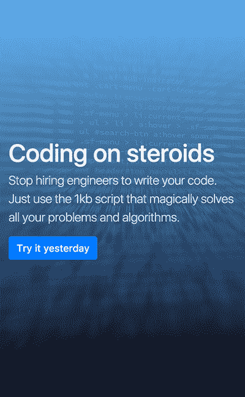****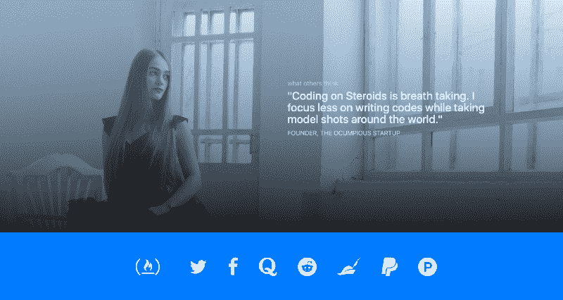**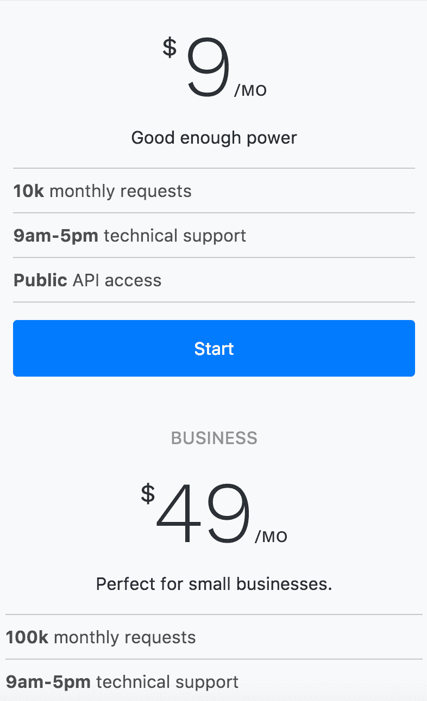

A couple screens from the [demo](https://codepen.io/ohansemmanuel/full/zEKrxP/) we will build.* 

*那些不是很漂亮吗？*

*大多数人说，“所有的 Bootstrap 网站看起来都一样。*我不同意。这句话应该是，“所有**建得很差的**引导站点看起来都一样。**

***我很高兴向您展示如何使用 Bootstrap 构建漂亮的网站。我希望你也是。***

***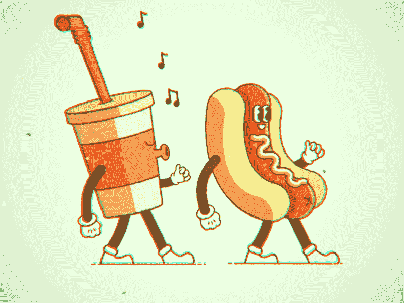

Excited!!!!! Gif by [Tony Babel](https://dribbble.com/TonyBabel)*** 

### ***你应该知道什么***

*   ***我假设你对`HTML`和`CSS`的工作原理有很好的理解。
    如果你对 CSS 不是很了解，我推荐参加我的[CSS 完全入门](https://bit.ly/learn_css)(70 多节课的付费课程)。***
*   ***你应该对 Flexbox 的工作原理有相当的了解。
    请阅读本[详细的 flexbox 指南](https://medium.freecodecamp.org/understanding-flexbox-everything-you-need-to-know-b4013d4dc9af)，或本[示例重点指南](https://medium.freecodecamp.org/the-ultimate-guide-to-flexbox-learning-through-examples-8c90248d4676)来复习 Flexbox。***

### ******Bootstrap 版本 4 有什么新功能？******

**本节面向更有经验的开发人员。如果您是前端领域的新手，请跳过这一步，在阅读完本文的其他部分后再回来。**

**Bootstrap 的最新版本第 4 版包含了一些重要的变化。**

#### **1.默认边框值已被更改**

**bootstrap 框架的早期版本将`border-box`值设置为`content-box.`像我这样的大多数人大多数时候都觉得这很烦人。**

**现在 Bootstrap 团队已经将值切换为`border-box`。我发现这更容易理解。**

#### **2.固执己见的 CSS 重置**

**CSS 重置已经走过了漫长的道路。在这个版本的 Bootstrap 中，CSS 重置样式表称为 Reboot。**

**Reboot 做了一些不同的事情。它基于正常化。它避免了`margin-top`，包含了 CSS `inherit`值，大量使用了`rem`单元，并包含了使用原生字体堆栈来优化文本呈现。**

**我建议你花 10 分钟从官方[文档](https://getbootstrap.com/docs/4.0/content/reboot/)中阅读关于重启的内容。这是一本很好的读物。**

**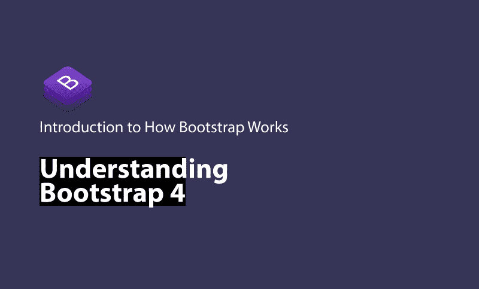**

### **引导程序如何工作的介绍**

**本节面向那些不熟悉 Bootstrap 工作原理的人。如果你是一个更有经验的开发者，你可以跳过这一步。**

**我们开始吧。**

**创建基本网页的通常流程如下:**

1.  **编写一个基本的标记文档(HTML)**
2.  **使用 CSS 设计页面样式**

**让我们假装这样做一会儿。**

**考虑下面的基本标记:**

```
**`<h1>Hello World</h1><h2>Hi, there. Hello again</h2><a href="example.com">Link to my website</a>`**
```

**该标记有两个 header 元素和一个 anchor 标记。下面是在浏览器中查看的结果。**

**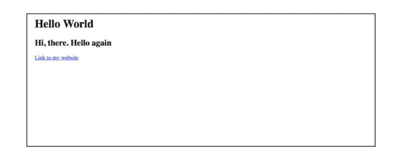

The result of the basic markup** 

**这可能正是你所希望的，但是结果继续显示了一个基本的事实。让我们深入了解一下为什么这很重要。**

**看看上面的结果。默认情况下，`h1`元素显示得比`h2`元素大，`a`标签是蓝色的。**

**你有没有注意到我们不用写任何 CSS 就能得到这些样式？**

**为什么？**

**这是浏览器默认样式的结果。**

**要点是，浏览器有影响网页外观的默认样式表。**

**如何才能防止这种默认行为？**

**解决方案非常简单。您可以通过 CSS 用自己的样式覆盖默认的浏览器样式。**

**例如:**

```
**`h1 {  color: blue}`**
```

```
**`a {  color: black}`**
```

**这一次，我换了颜色。蓝色的链接、`black`和`h1`。**

**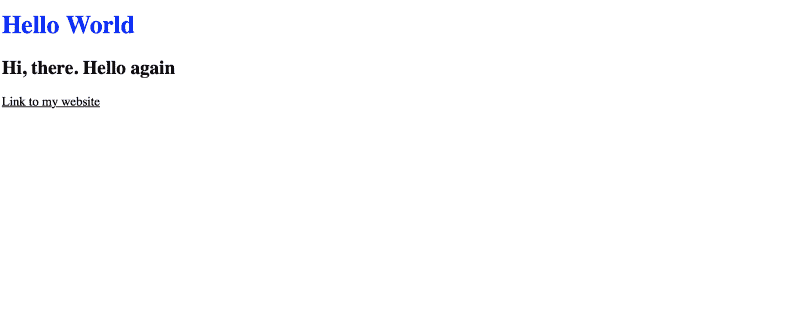

The default browser styles have now been overridden. The link now appears `black` and the h1 `is` blue.** 

**那很容易。**

### **Bootstrap 在这一切中扮演什么角色？**

**浏览器在没有您干预的情况下影响了页面的显示。使用 Bootstrap 这样的框架可以显著改变网页的显示——几乎不需要您的干预。**

**它是这样工作的:**

**每个网页的整体风格都受到浏览器默认风格、来自 Bootstrap 等框架的风格以及你自己编写的 CSS 的影响。**

**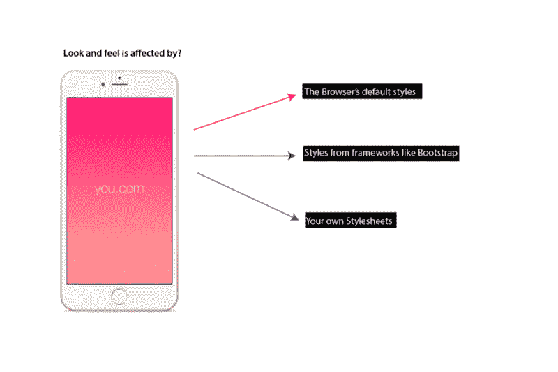

A quick look at the styles that influence the look of every webpage.** 

**如果你现在不明白也不要担心，我会用一个例子来解释。**

**假设我写了一个 CSS 库叫做，`**cowbell**` *。* `**Cowbell**`只做一件事。我包括了这个库，可能是通过 cdn 链接。它给了我的页面一个看起来像“牛铃”的背景色。**

**在`**cowbell**`库的某个地方，我会继续写这个:**

```
**`.cowbell {   background-color: cowbell}`**
```

**注意，我所做的只是包含了一个具有等价的`background-color.`的`.cowbell`类**

**根据记录，没有比“牛铃”更好的颜色了。**

**当你把 cowbell 库包含在你的页面中时，如何使用它呢？**

**简单。**

**您只需将`.cowbell`的类添加到您想要赋予`cowbell`颜色的任何元素中。**

**大概是这样的:**

```
**`<!--- this is my awesome HTML document --><body class="cowbell">  This is my awesome site</body>`**
```

**因为我已经在库中定义了`cowbell`类，所以您不必担心编写功能。**

**如上例所示，将`cowbell`类添加到`body`中会给整个文档添加一个**牛铃**颜色。**

**现在你已经使用了一个 CSS 库！**

**在引擎盖下，这与 Bootstrap 的工作方式相同。以同样的方式，存在一组在库中已经被样式化的引导 CSS 类。**

**你所需要做的就是学习类名并将它们应用到你的`html`标记中。他们会做他们被设计要做的事。**

**对于`**cowbell**`库，需要的类名是`.cowbell.`**

**它是做什么的？它赋予元素“牛铃”色。**

**它是如何工作的？您只需将类名`.cowbell`添加到任何元素中。**

**同样，Bootstrap 库有一个巨大的 CSS 文件，其中包含许多实用程序类、响应模块和一般的 CSS 好东西。**

**让我们在下一节开始剥离自举的层。**

### **安装引导程序**

**如果您的网页中没有安装或包含 Bootstrap，您将无法让它执行任何操作。**

**有几种方法可以做到这一点，更高级的用户可以探索可用的选项。**

**为了简单起见，我将使用一个`cdn.`**

**抱歉用了术语。CDN 是内容传递网络的缩写。**

**描述什么是 CDN 的一个简单方法是，想象从一个名为 Anazon 的虚构网站订购一条短裤。Anazon 已收到并成功处理了您的订单。不幸的是，Anazon 注意到你住在南极——离他们的主仓库很远的地方。**

**坏消息。**

**幸运的是，Anazon 在全球拥有广泛的分布式仓库网络。太神奇了。**

**现在，Anazon 决定哪个仓库离你在南极的家最近，并从那个仓库运送你的短裤。此外，下次您下订单时，Anazon 将检查同一仓库，并在 24 小时内为您发货。**

**多甜蜜啊。**

**这就是内容交付网络的工作方式。CDN 就像一个仓库，托管着 Bootstrap 等公共库。**

**如果你访问一个链接到 CDN 资源的网站，浏览器将加载该库的缓存版本。这是一个“存储”在浏览器内存中的版本。如果没有找到，它将请求获取所请求的资源。**

**从 CDN 加载资源的优点是接收资源的速度更快。喜欢那条短裤！**

**下面是自举 CDN 的链接。**

```
**`https://maxcdn.bootstrapcdn.com/bootstrap/4.0.0-beta/css/bootstrap.min.css" integrity="sha384-/Y6pD6FV/Vv2HJnA6t+vslU6fwYXjCFtcEpHbNJ0lyAFsXTsjBbfaDjzALeQsN6M" crossorigin="anonymous"`**
```

**包括在你的页面中，你就可以开始了。**

**例如，将此添加到任何 HTML 标记中:**

```
**`<link rel="stylesheet" href="https://maxcdn.bootstrapcdn.com/bootstrap/4.0.0-beta/css/bootstrap.min.css" integrity="sha384-/Y6pD6FV/Vv2HJnA6t+vslU6fwYXjCFtcEpHbNJ0lyAFsXTsjBbfaDjzALeQsN6M" crossorigin="anonymous">`**
```

### **Bootstrap 有什么区别？**

**在这一节中，我们将继续用 Bootstrap 设置一个基本的演示页面。对于这些演示，我将使用 [codepen.io](http://www.codepen.io) 。**

**将 Bootstrap v4 添加到项目很简单。单击 CSS 笔设置，并从选项中包括引导。**

**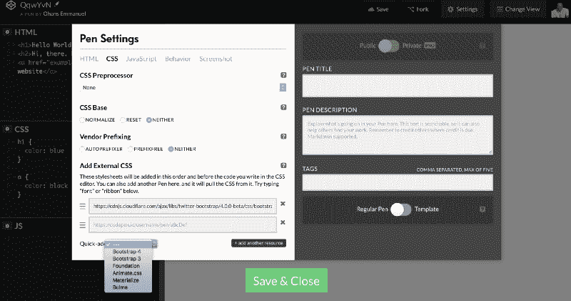**

**一旦完成。我们已经为下面几节中的演示做好了准备。**

**那么，Bootstrap 有什么不同呢？**

******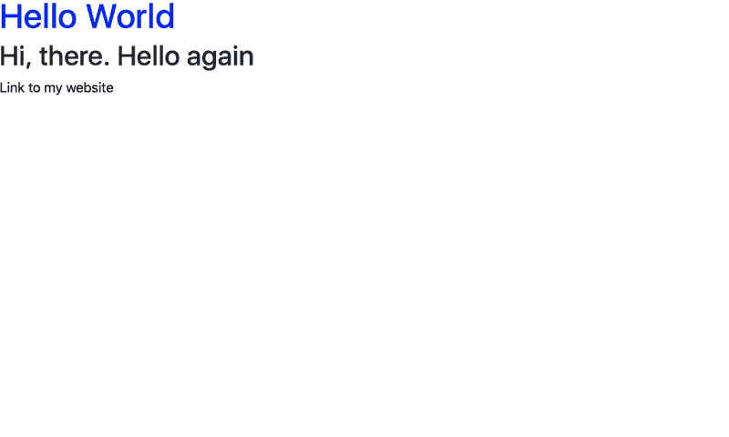

The images show the results without Bootstrap (left), and with Bootstrap (right)** 

**我继续前面讨论的“Hello World”示例。看看上面的结果。**

**差别非常微妙。从图片中你可以看到 Bootstrap 的一些默认页面样式已经覆盖了浏览器的样式。**

**现在字体不同了，每个文本块之间的间距也改变了，链接也有了不同的样式。**

**工作中的自举！**

**现在我相信你已经了解了 CSS 库一般是如何工作的，让我们学习一些你应该知道的基本的引导风格或者类名。**

****

### **每个人都应该知道的基本引导方式**

**一些非常聪明的人在构建引导库方面投入了大量的工作。他们为你做了很多“肮脏”的工作。你所要做的就是投入到他们所做的事情中，收获果实！**

**我将用一个问答的方法来解释这些引导风格的使用。**

**让我们开始吧。**

**为了实践本节中的概念，我们将从下面的标记开始。这是一首关于兔子的愚蠢的诗。**

```
**`<h1> Bunnie Poems </h1><p> The following is a mostly unintelligent poem about Bunnies. Don't think too hard about them. <br /> Enjoy!</p>`**
```

```
**`<h2> The Bunnie Who Had No Ears </h2>`**
```

```
**`<p> Mr Bunnie. How big the ears of your ancestors </p><p> How fluffy the pride of your family </p><p> But, wait... </p><p> How is it that you have no ears </p><p> With your eyes you hear, and your nose you see? </p><p> How sad, Mr Bunny </p><p> See him hop, hop, hop about on legs so very strong.</p><p> But ears, he has none <p><p> Live long, and make your ancestors proud </p>`**
```

**标记的结果如下所示:**

**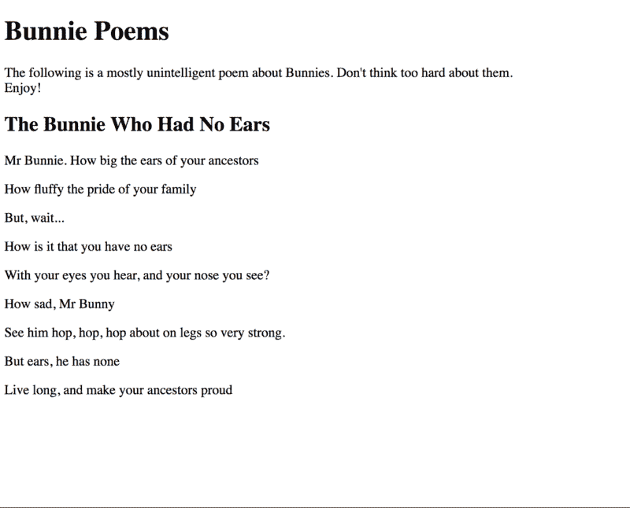

The initial result before the inclusion of Bootstrap.** 

**结果很大程度上受浏览器风格的影响。这称为用户代理样式表。**

**第一步是包括引导。请包括前面部分中讨论的引导程序，您应该有:**

**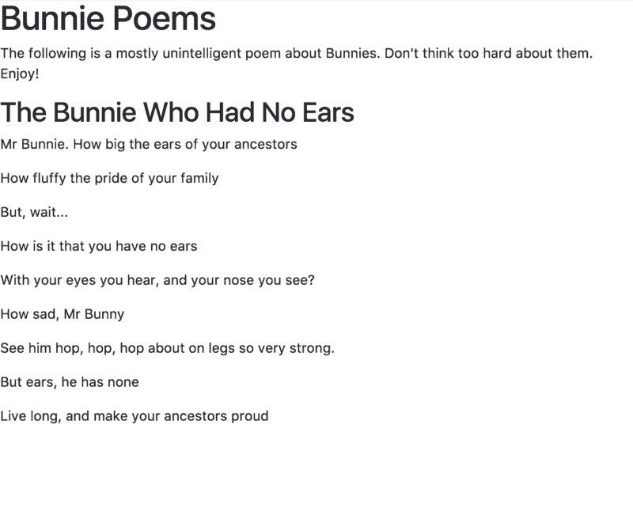

The result after adding Bootstrap.** 

**虽然还没有编写样式，但我们有了一个看起来不错的页面。它的间距很好，字体系列也发生了变化。看到变化了吗？**

**引导默认样式已经覆盖了浏览器的样式。没有任何努力，我们有一个像样的期待网页。**

#### **为什么我添加 Bootstrap 时字体系列会发生变化？**

**您可能已经注意到，文本现在以完全不同的字体显示。**

**Bootstrap 4 包含了原生字体堆栈的概念。这很简单。不同的操作系统——包括 Android、MacOS、Windows 和 Linux——都安装了默认字体。**

**此版本的 Bootstrap 设置了一个字体堆栈，它使用当前设备上可用的默认 sans-serif 字体。**

**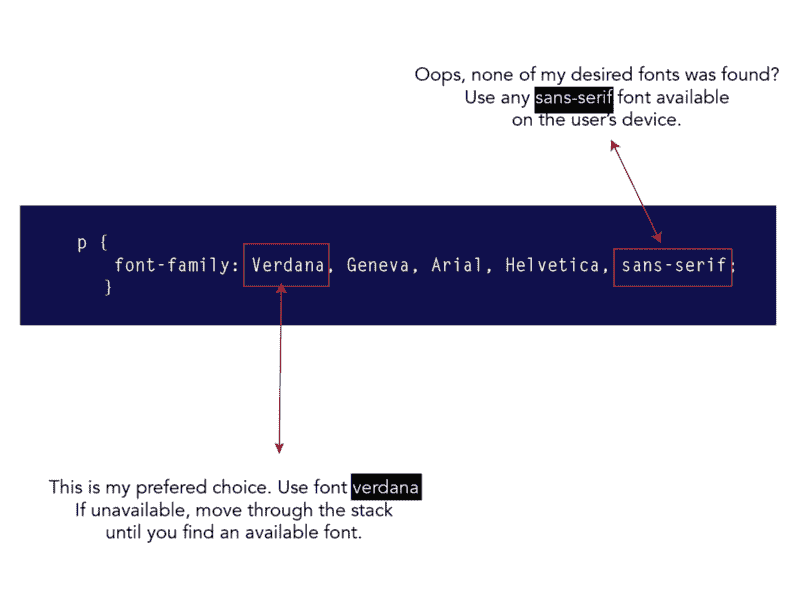

font stack illustration from the [complete practical introduction to css](http://bit.ly/learn_css)** 

**这是一个更聪明的做法，而且不会失去变化的灵活性。您可以覆盖此行为并使用自己的字体。**

**我本打算详细解释如何在 CSS 中设置原生字体堆栈，但是 Marcin Wichary 抢在了我的前面。在这篇[文章](https://www.smashingmagazine.com/2015/11/using-system-ui-fonts-practical-guide/)中，他比我更好地解释了这个问题。**

**因此，通过添加 Bootstrap，我们可以在所有平台上拥有好看的字体——不管设备的操作系统是什么。**

#### **如何制作比默认值更大的页眉？**

**有时你需要非常大的标题。例如，在网站的顶部。**

**看看我们之前设置的基本示例。默认尺寸中存在一个`h1`和`h2`。如果出于某种原因，您需要这些标题更大，Bootstrap 4 可以满足您的需求。**

**添加任意一个类，`display-1` `display-2` `display-3`或`display-4.`**

**例如:**

```
**`<h2 class="display-4"> The Bunnie Who Had No Ears </h2>`**
```

**我已经将类`display-4`添加到了`h2`元素中。如下图所示，它现在看起来大了很多。比`h1`元素还要大！**

**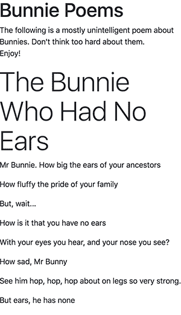

“The Bunny who had no ears” appears bigger than the h1 element. Thanks to the “display-4” class name.** 

#### **文本显示大小类是否仅限于标题元素？**

**显示类不仅限于标题元素，`h1`到`h6.`事实上，它们可以添加到任何元素中。**

**在下面的例子中，我将`display-3`添加到一个段落元素中。**

```
**`<p class="display-2"> But, wait... </p>`**
```

**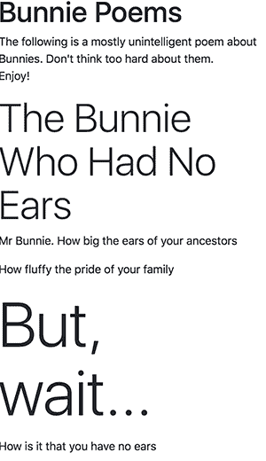

The display classes may be used on any text elements — not just header elements (h1 — h6)** 

#### **类名，`display-1`和`display-4`有什么区别？**

**不同之处在于元素的大小。`display-1`将产生比`display-4`更大的尺寸。您可能会在下图中看到大小的差异:**

**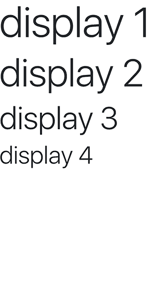

Which produces bigger texts? “display-1” or “display-4” ?** 

#### **如何使用 Bootstrap 居中对齐文本？**

**很简单。将`text-center`类添加到所需的元素中，使文本块居中。**

```
**`<p class="text-center">How is it that you have no ears </p>`**
```

**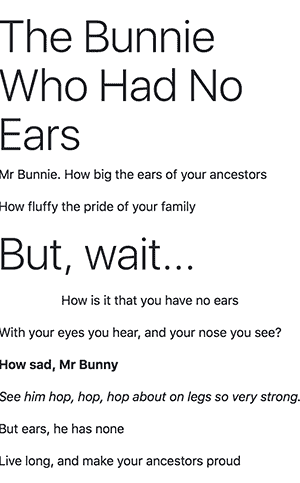**

**要对齐文本，并设置文本的样式以适合左右两边，使用`text-justify`类，如下所示:**

```
**`<p class="text-justify">How is it that you have no ears </p>`**
```

#### **我如何在 Bootstrap 4 中大写文本？**

**专门为这项事业量身定做了三个班:`.text-lowercase`、`.text-uppercase`和`.text-capitalize.`**

**如果你将类`text-lowercase`应用到一个已经大写的文本上，它将显示为小写。**

```
**`<p class="text-lowercase">WE BELIEVE IN YOU BUNNY</p>`**
```

**这将产生一个小写文本，尽管文本*“我们相信你兔子”*用大写字母书写。**

**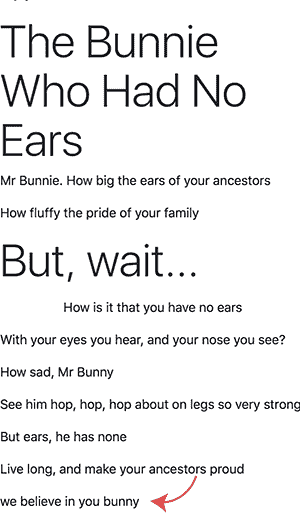

“we believe in you bunny” appears lower-cased despite being written in the HTML as capitals** 

**`text-capitalize`将每个单词的首字母大写，`text-uppercase` 将单词中的每个字母大写。**

#### **如何向左或向右移动文本？**

**与其他文本实用程序类一样，添加任何类`text-left`和`text-right`以获得所需的效果。**

#### **如何用 Bootstrap 4 制作粗体、正常或斜体文本？**

**添加类别`.font-weight-bold`、`.font-weight-normal` 和
`.font-italic`将使文本变为粗体、正常或斜体。如果您来自 Bootstrap 3，您会注意到这些类名是不同的。**

**这里有一个例子:**

```
**`<p class="font-weight-bold"> How sad, Mr Bunny </p><p class="font-italic">See him hop, hop, hop about on legs so very strong.</p><strong class="font-weight-normal"> But ears, he has none </strong>`**
```

**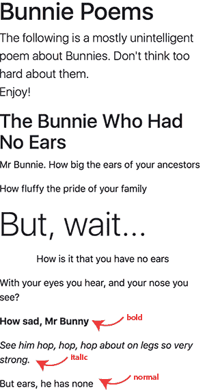

`font-weight-bold`,`font-weight-normal` and `font-italic in action.`** 

**注意，这个例子在一个`strong`标签上使用了`font-weight-normal`。默认，`<strong><`；/strong >应该生成粗体文本。当`you add the font-w`八正常类时，这种行为是“正常化”的。**

**注意，生成斜体文本的类名不是说`font-weight-italic`，而是说`font-italic`**

#### **如何用 Bootstrap 设计块引号的样式？**

**Boostrap 的类名`blockquote`可用于样式化块引用标签、`<blockquo` te >或任何其他文本块，如段落元素。**

**例如:**

```
**`<blockquote class="blockquote">  Men have ears. Men have Noses. Men have Mouths.We do too. We are Bunnies</blockquote>`**
```

**这将给出文本，“男人有耳朵。男人有鼻子。男人有嘴。我们也是。我们是兔女郎”，一种独特的自举式报价。**

#### **在 Bootstrap 中，我如何才能以不同的方式为引语作者设计风格？**

**在引语后面加上作者是很常见的。这同样适用于引用任何文本块的来源。为此，可以像这样使用`blockquote-footer`类:**

```
**`<blockquote class="blockquote">  Men have ears. Men have Noses. Men have Mouths.We do too. We are Bunnies  <div class="blockquote-footer">Ohans Bunny </div></blockquote>`**
```

**对于这个例子，我在一个`blockquote`标签中使用了`blockquote-footer`。这不是强制性的。您可以在任何文本块上使用`blockquote-footer`类名，比如段落元素，`p.`**

**下面是这样的结果:**

**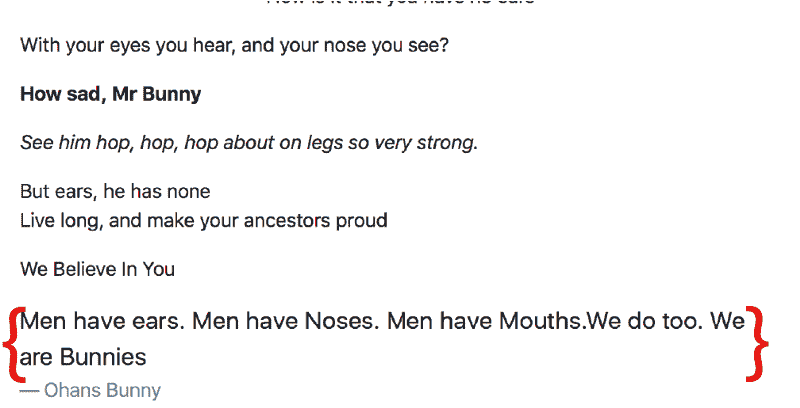

The Bootstrap blockquote class names added to the quote and author.** 

#### **如何移除无序列表中的默认填充、空白和样式？**

**似乎当我创建任何类型的`html`列表时，我总是需要这样做。同样，这对于 Bootstrap 来说非常简单。使用`list-unstyled`类名，就像这样:**

```
**`<ul class="list-unstyled">  <li>Thank you</li>  <li>Muchas Gracias</li>  <li>Merci</li></ul>`**
```

**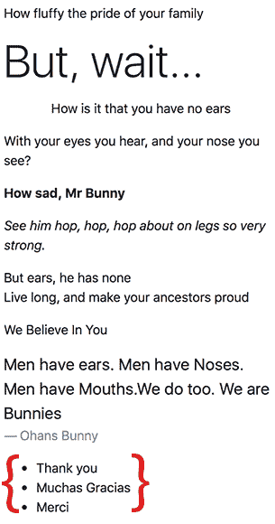

The default style for lists — with a dotted list style and some padding.** **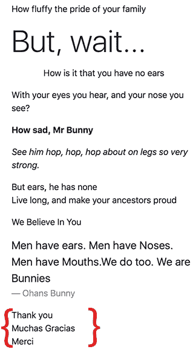

The default view for the list has been altered. No dotted list style, and no padding.** 

#### **如何创建并排排列的列表项？**

**有时您可能需要水平排列列表项，或者与默认的垂直视图相反，并排排列列表项。在无序列表中使用类名`list-inline`，在列表项中使用`list-inline-item`。**

**例如:**

```
**`<ul class="list-inline">  <li class="list-inline-item">Thank you</li>  <li class="list-inline-item">Muchas Gracias</li>  <li class="list-inline-item">Merci</li></ul>`**
```

**这将创建并排水平排列的列表项。**

**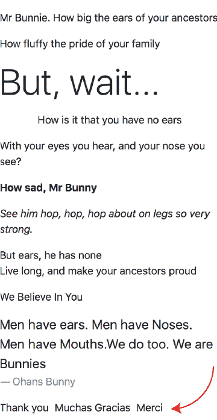

The list now appears side by side, horizontally — just as expected.** 

#### **Bootstrap 中有哪些颜色选项？**

**颜色是大多数人在意识到之前就已经在处理的视觉语言。**

**一般来说，在设计和引导中，颜色可以应用于各种各样的元素。文本、背景、边框等等。**

**让一个 5 岁的孩子说出颜色，他们会说:“红色、蓝色、绿色……”**

**CSS 中有超过 100 种颜色名称，这使得很难用类名来表示所有这些颜色名称。拥有超过 100 种颜色的类名`color-blue` `color-red`会很奇怪。**

**因此，Bootstrap 对颜色的处理略有不同。某些关键字或特殊颜色名称会映射到某些颜色。**

**例如，关键字`primary`通常与蓝色相关联。`success`用绿色，`danger`用红色，依此类推。**

**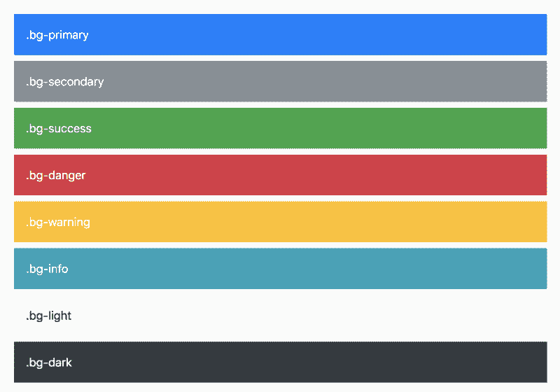

The [Bootstrap](https://getbootstrap.com/docs/4.0/utilities/colors/) colors.** 

#### **如何在 Bootstrap 中显示彩色文本？**

**要以某种颜色显示文本，应该使用`.text-*`类名。其中' * '可以是`primary` `secondary` `success` `danger` `warning` `info` `light`或`dark.`中的任意一个**

**例如:**

```
**`<p class="text-primary">Hello World</p><p class="text-secondary">Hello World</p><p class="text-success">Hello World</p><p class="text-danger">Hello World</p><p class="text-warning">Hello World</p><p class="text-info">Hello World</p>&lt;p class="text-light">Hello World</p><p class="text-dark">Hello World</p>`**
```

**上面的代码块将产生如下所示的结果:**

**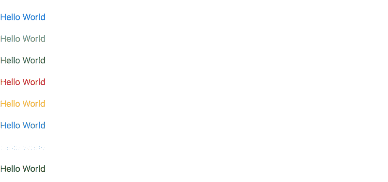

Varying text colors provided by Bootstrap** 

**值得注意的是，应用`text-light`类会产生浅色文本。将这个类应用于深色背景的文本是最合适的。**

**例如，我已经在蓝色背景的文本上使用了`text-light`类。它显示得很好。**

**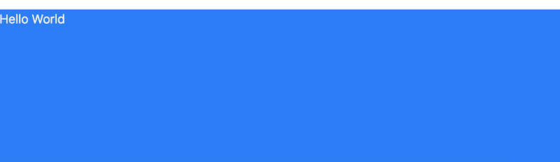

Use text-light on darker backgrounds. This way you’ll get nice results — readable texts.** 

#### **如何在 Bootstrap 中创建响应映像？**

**每个人都喜欢图像。如果你没有，那么你就是极少数不同群体中的一员。从经验来看，你必须知道造型图片可以很快失控。**

**要创建无论使用什么设备都可以响应的图像，请将类`.img-fluid`添加到图像元素中。**

**例如:**

**在兔子诗的例子中，我添加了一只可爱小猫的形象:**

```
**``**
```

**默认情况下，由于图像的大小，看不到图像范围。为完全响应的图像添加`.img-fluid`类。**

```
**``**
```

**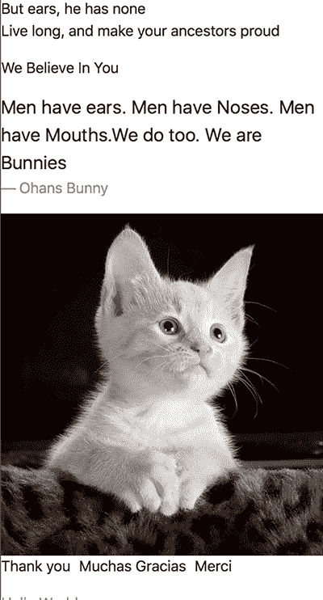****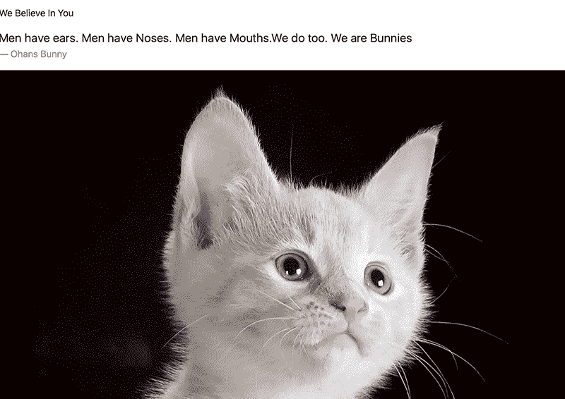

Fully responsive image of a cute kitten. The image displays nicely on mobile (left) and even bigger devices(right)** 

#### **我如何在 Bootstrap 中创建微妙的圆形图像？**

**有时候你想要不同的东西。因此，Bootstrap 允许图像具有微妙的圆形边界。就像这样添加类`rounded`:**

```
**``**
```

**请注意，上面的标记应用了多个类名。这是一个如何在一个元素上使用多个类名的好例子。**

**仔细看看下面的结果。你会发现图像有轻微的圆形边框。很多时候，我发现这比方形边缘更美观。**

**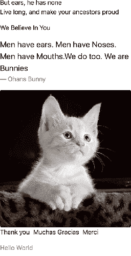

The cute kitten has been given subtle rounded edges for aesthetics.** 

#### **我可以创建只有一边有圆形边框的图像吗？**

**在前面的示例中，圆角应用于图像的所有侧面。也可以仅在一个方向上具有圆形边界。例如，应用类`rounded-top`将创建一个只有顶角是圆形的图像。`.rounded-bottom`反其道而行之。**

```
**``**
```

**如果你想知道，你也可以使用`rounded-left`和`rounded-right`类分别用于`left`和`right`边界。**

#### **有没有制作全圆形背景图像的选择？**

**是啊。Bootstrap 允许使用类名`rounded-circle`制作一个循环映像。**

**例如:**

```
**``**
```

**这将导致一个可爱的圆形小猫。**

**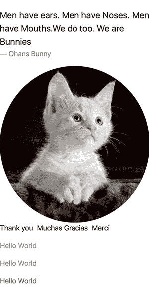

Cute rounded kitten with a fully round border.** 

#### **我能操纵 bootstrap 给出的圆角边吗？**

**Bootstrap 4 尽可能不剥夺你的自由。所以，是的，Bootstrap 给出的圆角边缘可以根据你自己的风格进行调整。让我给你看一个例子。**

**如果出于某种原因，您已经将图像的样式设置为圆形边框，那么您可以通过添加`rounded-0`类来使用 Bootstrap 移除圆形边框。**

**例如:
我给猫图像加了一个`50px`的边框半径:**

```
**`img {  border-radius: 50px}`**
```

**结果如下:**

**

The cute kitten with a border radius of 50px.** 

**这是一个形状怪异的猫形象。让我们看看引擎盖下发生了什么。**

**在`html`标记中，我们有这个:**

```
**``**
```

**正如您从标记中看到的，已经有一个`rounded-bottom`类应用于该图像。因此，bootstrap 将完全控制底部边缘。使用`border-radius`属性添加的边缘将只影响顶部边框，或者没有使用 Bootstrap 设置样式的边框。**

**这有意义吗？我想是的。**

**如果你去掉了图片上的`rounded-bottom`类或任何其他的`rounded`类，你的风格现在会在边框的所有边上生效。请参见下面的结果:**

**

The cute kitten now has all its sides obeying the CSS rule we just wrote.** 

**在上面的例子中，`rounded-bottom`类已经从标记中移除，留下边框来执行您的命令。**

**根据您的具体需求，您可以从您的标记中取出 Bootstrap 提供的所有`.rounded`类，并使用`border-radius`属性自己设计图像的样式。**

**如果你想让一些边保留默认的引导行为，你可以在你的标记中保留特定的圆角边类，比如`.rounded-top,`，同时使用`border-radius`对图像进行样式化。**

#### **如何将图像向左或向右对齐？**

**对齐是设计的一个重要部分。大多数时候，你会不停地移动东西，直到感觉合适为止。**

**要向左或向右对齐图像，请使用任何类别，`float-right`或`float-left.`**

**例如:**

```
**``**
```

**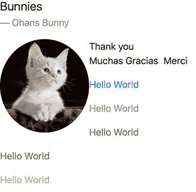

The bunny has been floated to to the left. It sits side by side with the text now.** 

**为了让图像浮动到期望的方向，您需要删除图像上的`img-fluid`类，并给图像一个固定的宽度，如下所示:**

```
**`img {  width: 150px}`**
```

**原因是`img-fluid`使图像填满设备的可用宽度。它不能移动到屏幕的左边或右边，因为它已经占据了所有的空间。你必须在你自己的 CSS 样式表中减少图片的宽度，就像我在上面的例子中所做的那样。**

#### **用文本描述来设计图像样式的最好方法是什么？**

**拥有带文字描述的图片也不是不可能。这在图片库和其他试图使用文本块传递更多图像信息的情况下非常有用。**

**正确的做法是将图像包含在一个`figure`标签中，并将文本块包含在一个`figcaption`块中。**

**下面是一个例子:**

```
**`<figure>    <figurecaption>    My name is katey and I am only 2 and a half months old.  </figurecaption></figure>`**
```

```
**`<figure>    <figurecaption>    My name is jando and I am only 3 months old. Clearly, I love to have fun!  </figurecaption></figure>`**
```

**这是结果:**

**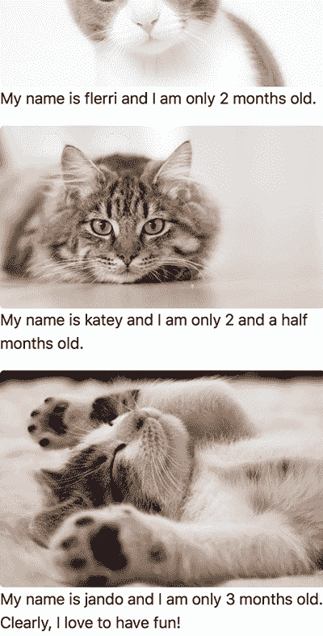**

**还没有什么神奇的。现在我们来设计这个。**

**Bootstrap 允许使用两个类名，`figure-img`和`figure-caption`正如你可能猜到的，它们都分别用于图像和文本块。**

**让我给你看一个例子。**

**继续添加类名，`figure-img`和`figure-caption`，如下所示:**

```
**`<figure>    <figurecaption class="figure-caption">    My name is katey and I am only 2 and a half months old.  </figurecaption></figure>`**
```

```
**`<figure>    <figurecaption class="figure-caption">    My name is jando and I am only 3 months old. Clearly, I love to have fun!  </figurecaption></figure>`**
```

**这将在图像和标题之间创造一些空间，文本标题将被赋予稍微平静的颜色。**

**请参见下面的结果:**

**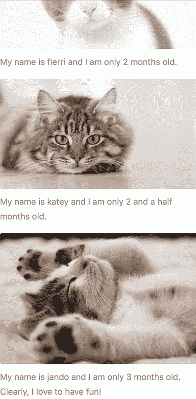**

**请注意，为了创建上面结果中显示的效果，我已经将类名`img-fluid`和`rounded`添加到图形图像中。这将确保图像反应灵敏，边缘略圆。**

#### **如何使用 Bootstrap 将图像居中？**

**使用 Bootstrap 将图像居中会有点棘手。首先要确保你试图居中的图像没有被设计成适合可用宽度或`100%`。您应该删除图像上的`img-fluid`类，如果它存在的话。**

**让我们看一个例子。**

**以下是来自早期示例的标记:**

```
**``**
```

**我来带走`img-fluid`类:**

```
**``**
```

**并继续使用我自己的类来设计图像的样式，这将把图像的宽度限制为大概，`200px`:**

```
**`.img-restricted {  width: 200px}`**
```

**这将产生固定宽度的图像，如下所示:**

**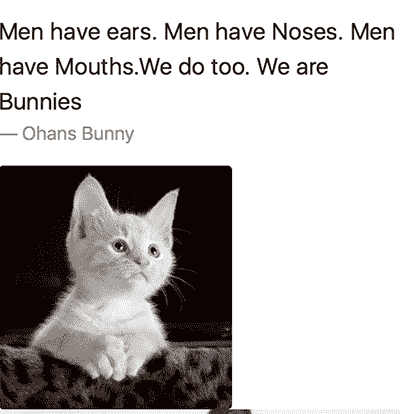

Image restricted to a width of 200px. By default it is aligned horizontally to the start of the page NOT the center.** 

**现在，让图像居中。**

**有两种不同的方法可以在 Bootstrap 中将图像居中。**

1.  **使用`text-center`类名**
2.  **使用`mx-auto`类名**

**这些选项的工作方式略有不同。**

**对于`text-center`类，要居中的图像必须保留其默认的`display` 值`inline-block`或`inline`。此外，类名必须添加到图像父块，如`div`，而不是图像本身。**

**很抱歉让你感到困惑。让我们看一个例子。**

```
**`<div class="text-center">  </div>`**
```

**注意，类名`text-center`已经被添加到父元素`div`而不是`img`元素中。**

**因此，我们有一个居中的图像！**

**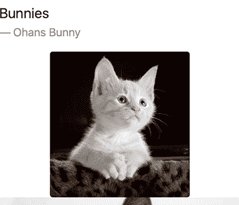

Centered image by applying text-center on a the image’s parent element and NOT the image itself.** 

**为了让你看到错误的标记是什么样子，这是错误的:**

```
**`<div>  </div>`**
```

**标记是错误的，因为`text-center`已经应用于`img`元素。这不会使图像元素居中。**

**`text-center`类为什么工作？默认情况下，图像是`inline-block`元素，因此它们将遵循应用于父元素的`text-center`样式。**

**让我们看看使用`**mx-auto**`类居中图像的第二种方法。**

**如果出于某种原因，您更改了图像的默认属性`display`并将其设为`block`，那么`text-center`类将不再工作。**

**例如:**

```
**`.img-restricted {   display: block}`**
```

**一旦将`display`属性设置为`block`，图像就不再遵循`text-center`样式——因为它不再是`inline`元素。**

**

Once the display property is set to block, the image goes back to its default position so it is NOT centered.** 

**在这种情况下，您必须像其他块元素一样将图像居中。将`mx-auto`类名应用于`img`元素，如下所示:**

```
**``**
```

**图像回到中心位置**

**

And the image comes back to being centered. Aye!** 

**现在，你可以继续前进，并集中任何图像你的愿望。**

#### **如何在元素的所有边上添加间距？**

**这是 Bootstrap 4 中的新特性，我发现它非常有用。很多时候你需要给一个元素添加额外的`padding`或者`margin`。在以前的版本中，您必须通过编写自己的样式来实现这一点。有时，由于特殊性问题，它不会工作。所有这些都已经在最新版本的 Bootstrap 中解决了。**

**间距自举给出了从`.25rem`到`3rem`的范围。对于大多数用例来说，这应该足够了。**

**假设边距由字母`m`表示，填充由字母`p`表示。此外，让不同的范围代表从`0 to 5.`**

**这样一来，您可以通过使用任何一个`**m-***`类作为边距，使用`**p-***`作为填充，在元素的所有边上添加间距。**

**例如`**m-0**` **、`m-1`、`m-2`、`m-3`、`m-4`、**、**、`m-5`、**都是添加边距的有效类名。对于使用以下任何类名`**p-0**` **、`p-1`、`p-2`、`p-3`、`p-4`、**和`**p-5.**`添加填充符也是如此**

**让我们用一个更早的例子来看一个实际例子。让我们为之前创建的图片和文本标题添加一些间距。**

**我将对`figure`元素应用一些填充，如下所示:**

```
**`<figure class="p-5">    <figurecaption class="figure-caption">    My name is flerri and I am only 2 months old.  </figurecaption></figure>`**
```

**什么变了？**

**我已经添加了类`p-5`,这就是所有的变化。结果呢？**

**见下文:**

**

A 3rem padding has been added to the first figure element. This was achieved by using the Bootstrap 4 class: p-5.** 

**与其他图形相反，你可以看到第一个图形的四周都添加了一些内部空间。相当酷！**

**让我们更进一步，将填充类`p-5`添加到所有图形中:**

```
**`<figure class="p-5">    <figurecaption class="figure-caption">    My name is flerri and I am only 2 months old.  </figurecaption></figure>`**
```

```
**`<figure class="p-5">    <figurecaption class="figure-caption">    My name is katey and I am only 2 and a half months old.  </figurecaption></figure>`**
```

```
**`<figure class="p-5">    <figurecaption class="figure-caption">    My name is jando and I am only 3 months old. Clearly, I love to have fun!  </figurecaption></figure>`**
```

**现在我们所有的数字都有一些额外的空间。**

**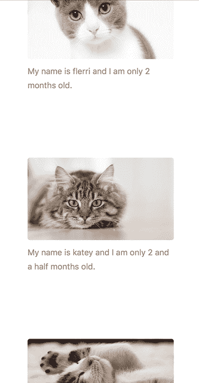

A 3rem padding has been added to all the figures. The class name p-5 has been used to achieve this.** 

**对于很少的额外代码来说，这是非常令人印象深刻的结果。**

#### **如何减少或增加元素各边的间距？**

**在前面的例子中，我讨论了从`**0 to 5.**`开始表示类范围**

**零，`0`将删除元素上的任何间距，而间距随着从`1`到`5.`而增加**

**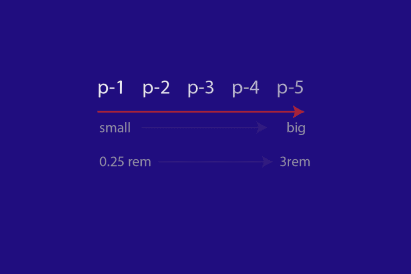

Illustrating the size range for the space class names** 

**例如，`**m-2**`创建的边距将小于`**m-5**`创建的边距，同样，`**p-1**`创建的填充将小于`**p-3.**`创建的填充**

**出于好奇，`1`加了间距`0.25rem` , `2`加了间距`0.5rem` , `3`加了间距`1rem` , `4`加了间距`1.5rem`,`5`加了间距`3rem`。**

**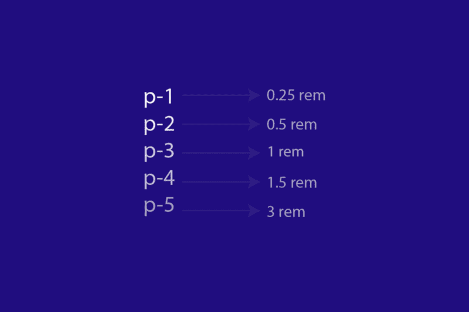

Spacing of each class** 

**为了说明这一点，我将在不同的图形上添加不同的间距类名，如下所示:**

```
**`<figure class="p-3">    <figurecaption class="figure-caption">    My name is flerri and I am only 2 months old.  </figurecaption></figure>`**
```

```
**`<figure class="p-4">    <figurecaption class="figure-caption">    My name is katey and I am only 2 and a half months old.  </figurecaption></figure>`**
```

```
**`<figure class="p-5">    <figurecaption class="figure-caption">    My name is jando and I am only 3 months old. Clearly, I love to have fun!  </figurecaption></figure>`**
```

**这是结果。**

**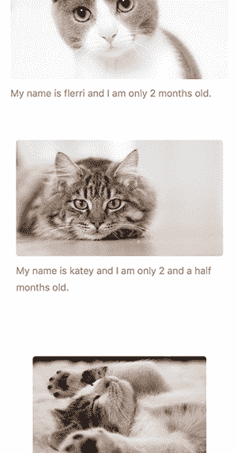

The figures have different inner spacing. This is due to the different spacing class names added to the markup.** 

**在上面的结果中，您可以看到填充从第一个数字增加到第三个数字。**

#### **如何在元素的一边增加间距？**

**有时候你不希望元素的所有边都有间距。您可能只需要元素的`top`、`bottom`、`left`或`right`处的一些间距。**

**Bootstrap 拥有所有选项！这让我兴奋。当你开始构建东西的时候，你会惊讶这是多么的有用。**

**不使用`m-*`类名，而是添加一个`t`、`b`、`l`或`r`作为`top`、`bottom`、`left`或`right`边距。**

**例如，`mt-1`、`mb-1`、`ml-1`、`mr-1`都是有效的类名。范围`**0**`到`**5**`仍然与之前相同。**

**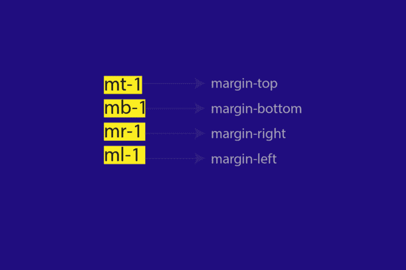

t is top. b is bottom. r is right. l is left.** 

**`t`、`b`、`r`和`l`的约定对于填充也是一样的。**

**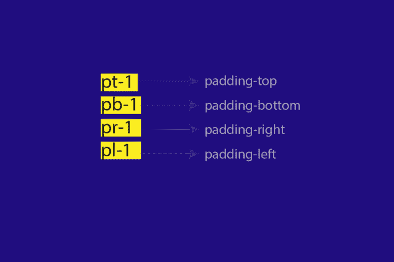

t is top. b is bottom. r is right. l is left. even for padding.** 

**我将继续更改所有数字上的间距，仅表示`bottom`填充。**

```
**`<figure class="pb-3">    <figurecaption class="figure-caption">    My name is flerri and I am only 2 months old.  </figurecaption></figure>`**
```

```
**`<figure class="pb-3">    <figurecaption class="figure-caption">    My name is katey and I am only 2 and a half months old.  </figurecaption></figure>`**
```

```
**`<figure class="pb-3">    <figurecaption class="figure-caption">    My name is jando and I am only 3 months old. Clearly, I love to have fun!  </figurecaption></figure>`**
```

**如您所见，我使用了`**pb-3**`类名。这将增加每个`1rem`的底部填充。**

**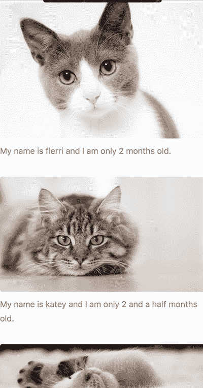**

#### **如何在一个元素的两边添加相同的间距？**

**间距到此为止。这是最后一个例子——我保证。**

**也可以在元素的`top`和`bottom`侧增加间距。以同样的方式，你也可以给元素的`left`和`right`添加相同的间距。**

**那么，这是怎么做到的呢？**

**设`x`代表`left`和`right`值，`y`代表`top`和`bottom`值。**

**要将相同的间距添加到元素的`left`和`right`两侧，请对`top`和`bottom`值使用`mx-*`类和`my-*`类。**

**例如，`mx-1`将沿着元素的`left`和`right`边添加一个`0.25rem`的边距。`my-1`将沿着元素的`top`和`bottom`边添加`0.25rem`。**

**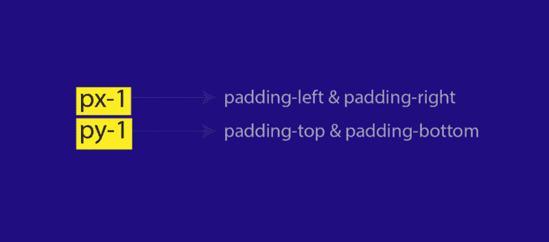

If you didn’t skip math classes at school, the ‘x’ and ‘y’ naming convention shouldn’t feel so strange.** 

**这就是全部的间距！相信我，这很重要。**

#### **我如何设计引导段落的样式？**

**引导段落通常是文章的第一段。目的是吸引读者的注意力。**

**要设计前导段落的样式，将类`.lead`添加到段落中。例如，我将继续将类`.lead`添加到兔子诗的第一段，如下所示:**

```
**`<p class="lead"> The following is a mostly unintelligent poem about Bunnies. Don't think too hard about them. <br /> Enjoy!</p>`**
```

**结果是一个稍微大一点的段落，如下所示:**

**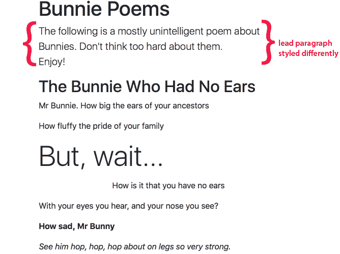

a slightly bigger paragraph — lead paragraph.** 

**对于技术人员来说，`.lead`类通过`25%`提升字体大小，并将`font-weight`设置为`300`，从而产生更大、更亮的文本音调。**

**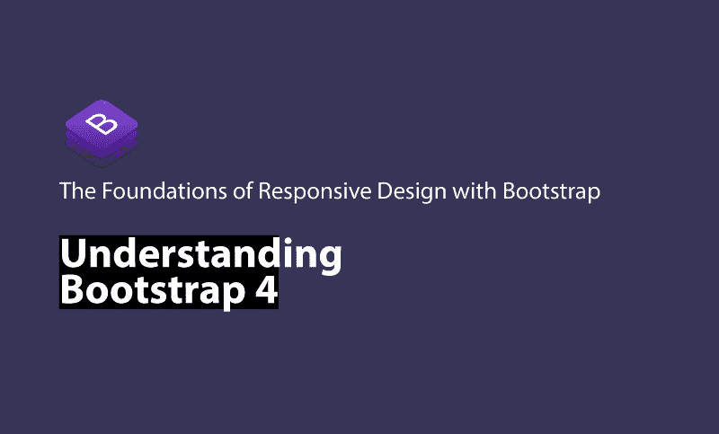**

### **基于 Bootstrap 的响应设计基础**

**你以前用过 Flexbox 吗？如果答案是肯定的，那太好了。使用 flexbox，Flexbox 格式化上下文直到`flex-container`被创建才被启动。**

**无论您是否有使用 Flexbox 的经验，Bootstrap 都必须定义一个`container`元素，以获得 Bootstrap 提供的响应式设计的好处。**

#### **那么，什么是引导容器呢？**

**容器只是一个应用了`.container`类的元素。例如:**

```
**`<div class="container"></div>`**
```

**很简单，是吧？**

**对于一个简单的标记，很可能将每个元素都包装在一个引导容器中。**

**例如，我将重构兔子诗来使用引导容器。**

```
**`<div class="container">    <h1> Bunnie Poems </h1>  <p class="lead"> The following is a mostly unintelligent poem about Bunnies. Don't think too hard about them. <br /> Enjoy!  </p>`**
```

```
**`<h2 class="display-5"> The Bunnie Who Had No Ears </h2>  <p> Mr Bunnie. How big the ears of your ancestors </p>  <p> How fluffy the pride of your family </p>  <p class="display-4"> But, wait... </p>  <p class="text-center">How is it that you have no ears </p>  <p> With your eyes you hear, and your nose you see? </p>  <p class="font-weight-bold"> How sad, Mr Bunny </p>  <p class="font-italic">See him hop, hop, hop about on legs so very strong.</p>  <strong class="font-weight-normal"> But ears, he has none </strong>  <p> Live long, and make your ancestors proud </p>  <p class="text-capitalize">We believe in you</p>  <blockquote class="blockquote">    Men have ears. Men have Noses. Men have Mouths.We do too. We are Bunnies    <div class="blockquote-footer">Ohans Bunny </div>  </blockquote>  ...</div>`**
```

**正如您在上面的代码示例中看到的，我现在已经用 container 类包装了 div 中的每个元素。**

```
**`<div class="container">    <!--every other element goes here --></div>`**
```

#### **容器和容器流体的区别是什么？**

**在上面的例子中，我这样做了:**

```
**`<div class="container">    <!--every other element goes here --></div>`**
```

**虽然这是正确的，但是 Bootstrap 还提供了一个容器类，那就是`.container-fluid.`**

**用法是一样的，像这样:**

```
**`<div class="container-fluid">    <!--every other element goes here --></div>`**
```

**那么有什么区别呢？**

**让我们看看直观的例子。**

**几年前，当我开始学习 Bootstrap 框架时，我总是想知道为什么我不理解这两者之间的区别。你很幸运，因为我现在明白了。我来给你解释一下:)**

**对于视觉反馈，我将继续给`body`一个`red`背景颜色。我也会给`container`和`container-fluid`加上`white`的背景色。这样它们就不会从`body.`继承`red`的背景颜色**

**代码如下:**

```
**`body {  background: red}.container,.container-fluid {  background: white}`**
```

**现在，让我们看看当您将兔子诗的所有内容包装在一个`.container` div 中时会有什么不同。**

**兔子诗的所有内容都包含在一个`.container` div 中，尝试调整浏览器的大小。**

**你注意到了什么？**

**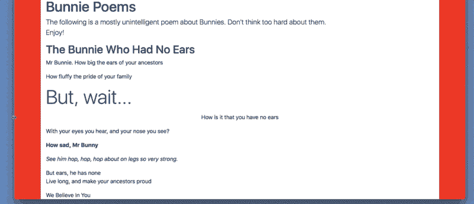

The expected behavior on resizing the browser.** 

**您会注意到`.container`宽度在不同的视口会发生变化。它在自身和`body`元素之间留下了一些喘息的空间——这解释了为什么你会在上面的 gif 中看到`red`背景。别忘了`body`元素有`red`背景。**

**虽然看起来很简单，但这是一个非常重要的行为。**

**相反，如果使用了`.container-fluid`，div 会填满可用的视窗。你看不到红色背景，因为在`container-fluid`元素和`body`之间没有呼吸空间。所有可用的空间都被占用了。**

**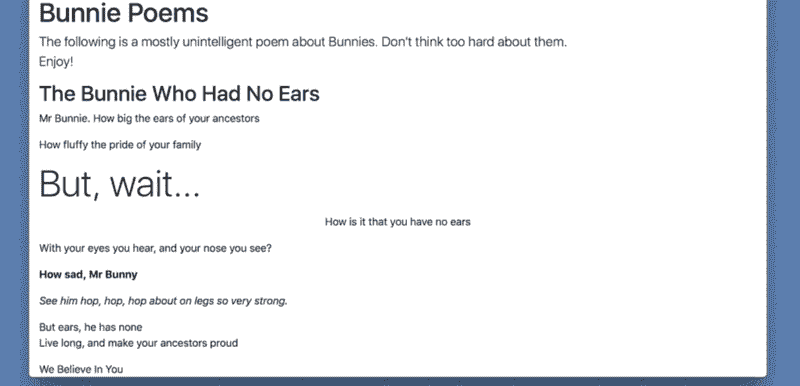

The expected behavior on resizing the browser.** 

**如你所见，有了`.container-fluid`级，你就没有奢侈的空间了。集装箱占据了`100%`的可用宽度。仍然有一个小的填充应用于`.container-fluid`元素，但是宽度不会随着用户的视窗而变大或改变。这就是`.container`和`.container-fluid`类名的区别。**

#### **什么是媒体查询？**

**由于这一节的重点是响应式设计，我认为重温一下什么是媒体查询是很重要的——尤其是对初学者而言。这一节对于理解 Bootstrap 中的响应模块如何工作也是至关重要的。**

**考虑下面的代码块:**

```
**`@media screen and (min-width: 768px) {     .bg {         background-color: blue     }}`**
```

**如果你熟悉手工编写响应模块，那么上面的代码块应该是熟悉的。**

**代码块代表 CSS 媒体查询的使用。如果你不知道它是如何工作的，请继续读下去。**

**媒体询问是响应式设计的核心。它们允许您指定特定的屏幕尺寸，并指定仅在指定设备上运行的代码。**

**媒体查询最常用的形式是所谓的`**@media**` 规则。**

**它看起来像这样:**

```
**`@media screen and (min-width: 300px) {  /*write your css in this code block*/}`**
```

**看着它，你几乎可以猜到它是做什么的。
*"* 对于最小宽度为 300 像素的屏幕设备…这样那样做"**

**代码块中的任何样式将仅应用于匹配表达式“`screen and (min-width: 300px)` *”的设备*在上面的例子中，器件宽度`300px`被称为断点。**

**我想这有助于澄清一些困惑。**

#### **什么是自举网格系统？**

**使用 Bootstrap 或任何经过深思熟虑的设计，没有任何东西只是停留在页面上。每个元素都位于一个定义明确的网格结构上。**

**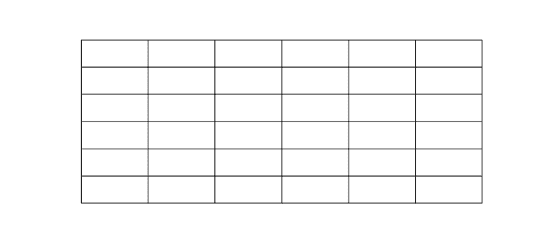

Example grid** 

**在这种情况下，网格是一系列交叉的垂直和水平参考线，用于构建网页上的内容。**

**没有人会随便在页面上添加内容。**

**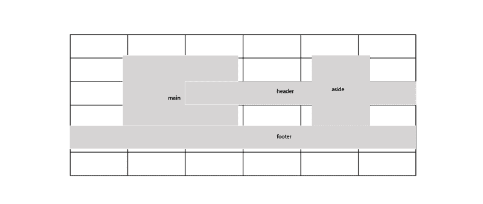

web content poorly laid out on a grid.** 

**参见上面的例子。见过这样排列的网站内容吗？我赌“不会”。**

**大多数情况下，您将拥有一个包含结构良好的内容的网格。大概是这样的:**

**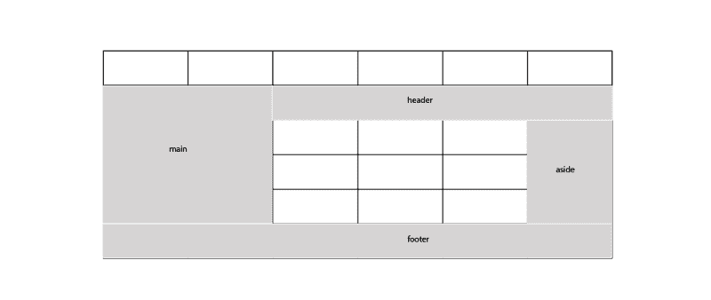

Thoughtfully laid out content along a grid** 

**Bootstrap 有一种方法来定义网格，并正确地在网格上放置内容。这就是所谓的自举网格系统。**

**对于更高级的用户，需要注意的是不需要水平或垂直的网格线。有了点缀了一些 CSS 魔法的 [CSS 网格](https://medium.com/flexbox-and-grids/how-to-efficiently-master-the-css-grid-in-a-jiffy-585d0c213577)，你可以很容易地构建一个非传统的布局。**

#### **我如何使用引导网格？**

**Bootstrap 4 网格由 Flexbox 构建，这使得它比以往任何时候都更加强大。**

**公平的警告:当你第一次学习 Bootstrap 时，它的这一部分很糟糕。但是，如果你花时间去掌握 Bootstrap 网格系统，你会发现它是你所拥有的最重要的 Bootstrap 知识之一。**

**让我解释一下它是如何工作的。**

**所以，你的朋友克洛伊在午夜打电话给你说， *"* 我要结婚了！..哈哈**

***你们都为这个消息感到兴奋，并且聊的时间比预期的要长。就在你准备结束通话的时候，你决定表现得像一个酷的天赐开发者。*嘿，可儿。我要为你建一个婚礼网站！*“*你们又聊了 30 分钟…****

**好吧，甜蜜的故事。**

**好消息是你让克洛伊的夜晚。她会超级兴奋的。坏消息，或者(不是那么坏的消息)是你将花费时间和精力，(和一些咖啡)来建立婚礼网站。**

**所以，你得到一个这样的模型:**

**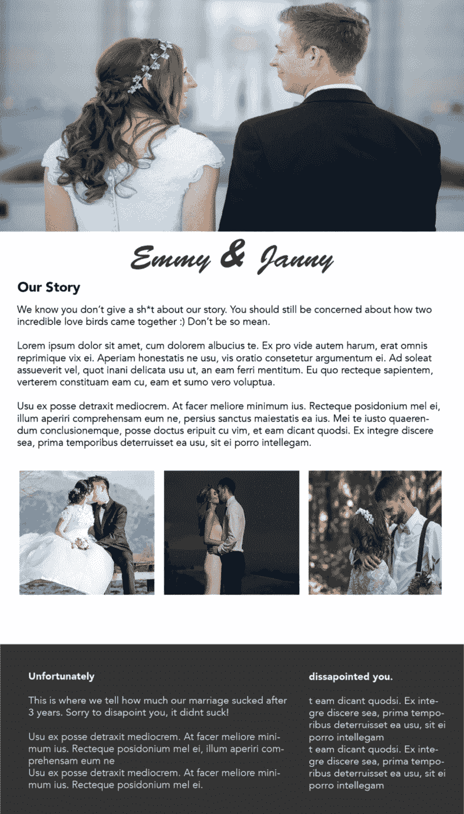

I designed this hastily for the purpose of this article. So, don’t go about criticizing it :)** 

**你没有很多时间来建立这个网站，所以你求助于使用 Bootstrap。首先要做什么？设置引导网格。**

**在使用 Bootstrap 网格系统时，有一些非常严格的规则要遵循。**

**首先，在你的脑海中滚动回上面的模型，并尝试将每一行内容分成单独的行。这一行内容应该从水平走向垂直。**

**你能做到吗？**

**我也做了同样的事情，结果如下:**

**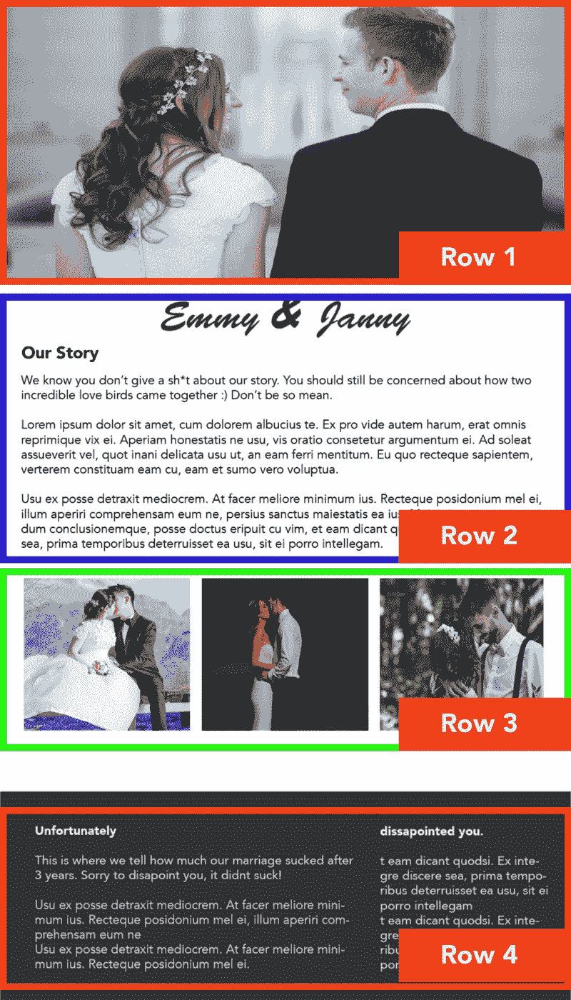**

**我所做的是沿着一条线围绕分组的内容从左到右画出水平的方框。即使对于更复杂的布局，这种分解也是非常重要的。**

**这些水平的盒子被称为**行**。由类别`.row`表示**

**这并没有结束。每一行都有单独的内容框。看前面的图片，试着识别这些单独的盒子。**

**同样，我也这样做了。请参见下面的结果:**

**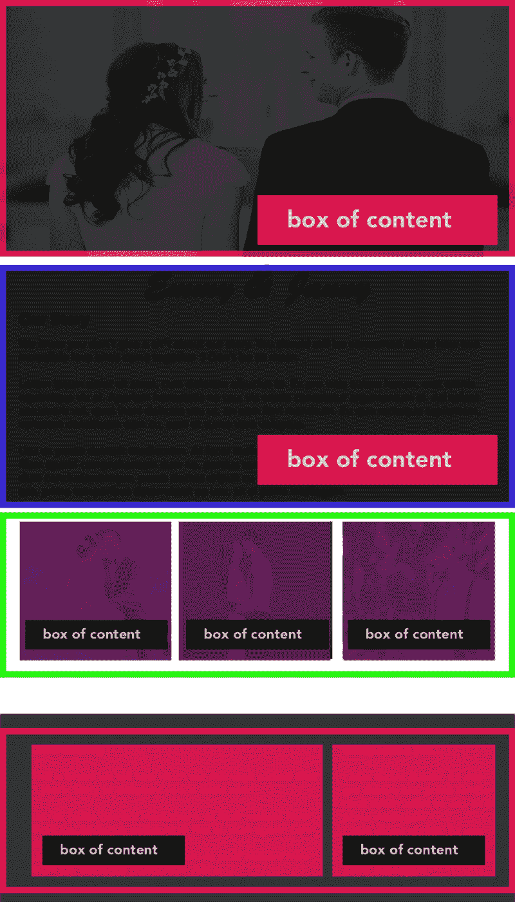**

**这些位于行内的独立内容框被称为**列**。**

**有道理？**

**列由类`.col`表示**

**因为行和列是好伙伴，所以列不应该存在于行之外。这是一条需要记住的重要规则。**

**此外，每一行都必须放在一个容器中。`.container`或者`.container-fluid`都可以。行不能存在于容器之外。它必须生活在一个容器里。**

**实际上，您可能有一个包含整组行的整体容器，如下所示:**

**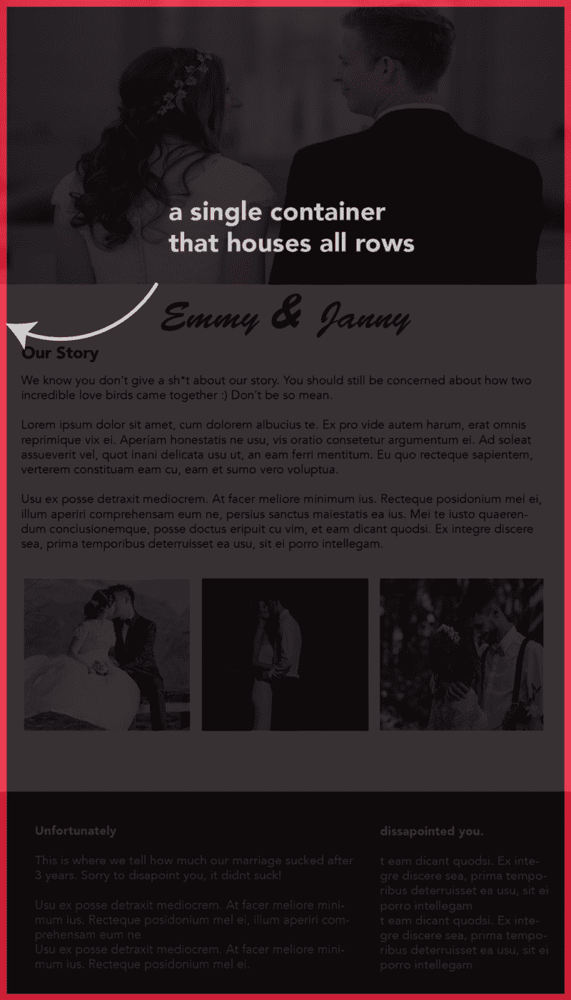

a single container (in red) that houses all rows.** 

**或者，您可以用一个容器来包装每一行，如下所示:**

**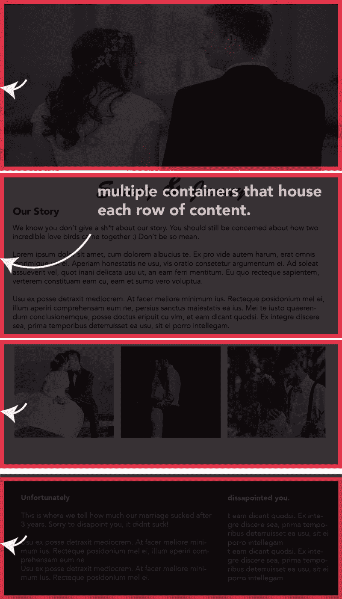

Multiple containers that house each row of content.** 

**我似乎倾向于后者。我发现它更灵活——在某些用例中。**

**快速总结:每一行都必须放在一个容器中。用类名`.row`指定行，用`.col`指定列，用`.container`或`.container-fluid`指定容器。**

**这是 Bootstap 网格系统如何工作的基础。在接下来的部分中，我将讨论一些更实际的用例。**

#### **不同大小的柱子呢？**

**在构建 web 应用程序时，很可能需要不同宽度的列。几乎每次，行中都会有不同宽度的列。**

**下面是一个例子:**

****

**一列可以占据行的宽度`60%` ，另一列可以占据行的宽度`40%`。如何使用自举网格来处理这个问题？**

**引导网格假定为 12 列网格。它假设在每一行中，有 12 列可用。有了这 12 列，你就有责任按照你认为合适的方式来分配列宽。**

**让我解释一下。**

**如前所示，考虑下面的内容行:**

**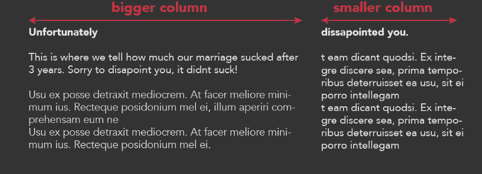**

**该行包含两个不同大小的列。**

**在这一行中，引导网格假定这一行中有 12 列，如下所示:**

**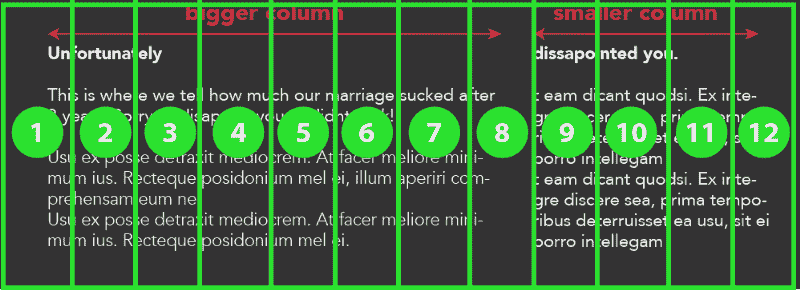

The bootstrap 12 column grid illustrated.** 

**根据 Bootstrap，每行有 12 列。如何分配空间由你决定。**

**由于行中只有 2 个用户定义的列(较大和较小的列)，所以必须分配列空间，如下所示:**

**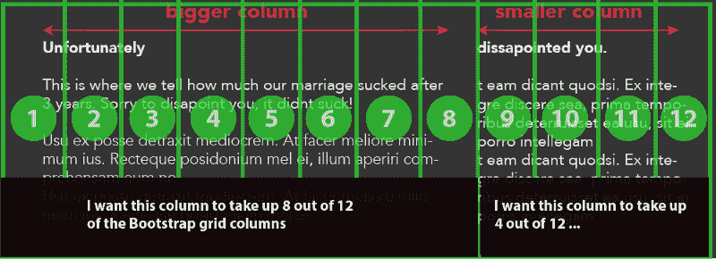

Distribute the 12 Bootstrap columns amongst your user defined columns.** 

**这很简单，你很快就会习惯的。将其中 8 根柱指定给较大的柱，将其余 4 根柱指定给较小的柱。请注意，其总和等于 12。**

**一行中分布式列的宽度总和不得大于 12。在上面的例子中，我们使用了`col-8`和`col-4`。`col-8`代表占据 8 个引导网格列的较大列，而`col-4`代表具有 4 个引导网格列的较小列。**

**在这种情况下，您将有两列，其中一列的宽度是另一列的宽度。记住，`8 / 4 = 2 .`**

**如果你想要等宽的列，你可以使用`col-6`和`col-6`。这将创建相等的列，占据`12`引导网格列的一半。**

**如果你想要两列之间的一个更大的比率，你可以使用`col-10`和`col-2`。**

**我很确定你现在明白了。**

#### **超过 12 列怎么办？**

**如果您的列总数超过 12，它们将会换到下一行。就像用`flex-wrap`**

**例如:**

```
**`<section>  <div class="container">    <div class="row">      <div class="col-3">      &lt;/div>      <div class="col-3">      </div>      <div class="col-3">      </div>      <div class="col-3">      </div>    </div>  </div></section>`**
```

**加上上面的加价，总数是 12。您将获得以下预期结果:**

**

4 columns within a row** 

**如果在同一行中再添加 2 列，会发生什么情况？**

```
**`<section>  <div class="container">    <div class="row">      <div class="col-3">      </div>      <div class="col-3">      </div>      <div class="col-3">      </div>      <div class="col-3">      </div>      <div class="col-3">      </div>      <div class="col-3">      </div>    </div>  </div></section>`**
```

**12 之后的下一组列换行到下一行，如下所示:**

**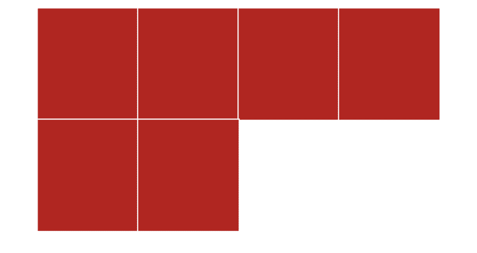

The next set of columns wrap unto the next line.** 

#### **这很好，但是响应式网格呢？**

**在上面的例子中，定义的列大小将保持不变，不管用户的设备是什么。**

**例如，`col-8`和`col-4`将在行内创建 2 列。移动设备和更大的设备都是这种情况。**

**对于响应式设计来说，很少会出现这种情况。如果您在平板设备上有两列网格，您可能希望在移动设备上堆叠这些列。**

**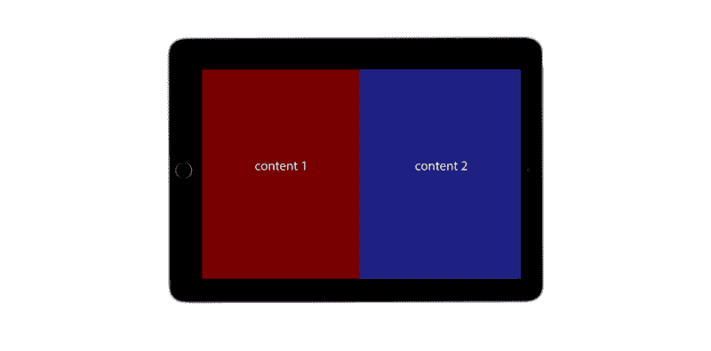

Two side by side columns displayed on larger devices. Each of the column takes up half of the available width.** **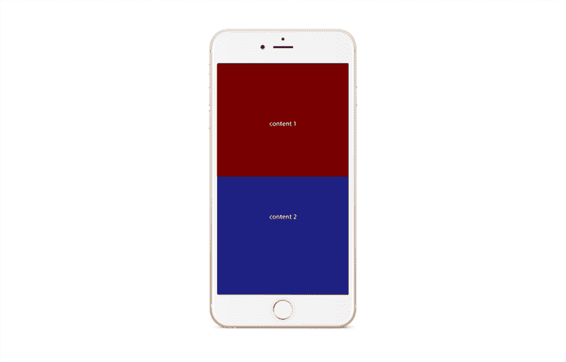

The two columns now stack vertically on mobile. Each of the columns also take up 100% of the available width.** 

**您可能在桌面设备上有 3 列网格，但在平板设备上有 2 列，或者在移动设备上只有 1 列。在这种情况下，必须有一种方法来隐藏较小设备上不需要的额外列。**

**幸运的是，bootstrap 涵盖了这些用例！**

**可以使用某些修饰符来修改引导列。
例如:**

**`col-**sm**`指关于小型设备(手机)及以上的一栏**

**`col-**md**`指列在中等设备(平板电脑)及以上**

**`col-**lg**`指大型设备(台式机)及以上的一列**

**`col-**xl**`指超大(宽屏)设备上的一列**

**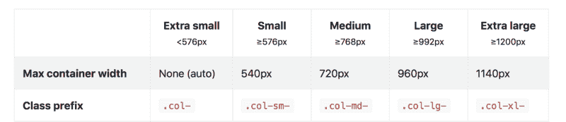

Screenshot from getbootstrap.com** 

**让我们回到 2 列宽的例子。我们需要这些列在中型设备(和更大的设备)上显示为 2 列，但在小型设备(手机)上水平堆叠。**

**你是怎么做到的？**

**以这样的标记开始:**

```
**`<div class="row">    <div></div>    <div></div></div>`**
```

**我已经假设这个`row`将被放置在一个容器中。记住，每个`row`必须放在一个`container`内。**

**Bootstrap 采用移动优先的理念。默认情况下，您应该为移动设备构建设计，然后从那里升级到更大的设备。**

**在这种情况下，我们将首先处理移动设备上的显示。**

```
**`<div class="row">    <div class="col-12"></div>    <div class="col-12"></div></div>`**
```

**上面的标记将创建占据行内所有可用宽度的列。这些列将以 100%的宽度垂直堆叠。**

**这不是我们想要的中型设备的行为，所以我们添加了修饰符类，如下所示:**

```
**`<div class="row">    <div class="col-12 col-md-6"></div>    <div class="col-12 col-md-6"></div></div>`**
```

**你看到了吗？**

**注意，对于小型设备，不需要修饰符类。**

**现在，对于中型设备和更大的设备，该行将采用 2 列宽。一个占用 6 列，另一个占用 6 列，引导 12 列网格。**

**在实践部分，我将讨论如何在较小的设备上隐藏列。**

#### **这是怎么回事？**

**Bootstrap 已经实现了带有某些断点的媒体查询，以满足每个响应需求。从超小型手机到小型手机、平板电脑、笔记本电脑甚至更大的台式机，Bootstrap 都能满足您的需求。**

**与我们之前学习的 margin 和 padding 类一样，基于用户的特定屏幕大小应用样式也有特定的命名约定。**

**

Screenshot from getbootstrap.com** 

**如上图所示，`xs`指的是超小型手机，`sm`指的是小型手机，`md`指的是平板电脑等中型设备，`lg`指的是笔记本电脑等大型设备，`xl`指的是桌面大屏等超大屏幕。**

**出于好奇，下面是引导媒体查询的样子:**

```
**`// Extra small devices (portrait phones, less than 576px)// No media query since this is the default in Bootstrap// Small devices (landscape phones, 576px and up)@media (min-width: 576px) { ... }// Medium devices (tablets, 768px and up)@media (min-width: 768px) { ... }// Large devices (desktops, 992px and up)@media (min-width: 992px) { ... }// Extra large devices (large desktops, 1200px and up)@media (min-width: 1200px) { ... }`**
```

**如果你是高级用户，看看[版本 4](https://getbootstrap.com/docs/4.0/layout/grid/) 和[版本 3](https://getbootstrap.com/docs/3.3/css/#grid) 的文档。请注意网格断点的不同。我花了一些时间自己弄明白了这一点。所以，去做同样的事。**

#### **`min-width`怎么回事？**

**您会注意到引导介质查询使用了`min-width`。你还会注意到，在前面的例子中，我一直在说，“中型设备和更大的设备”**

**例如，`col-md`针对中型设备和更大的设备。因此，如果您指定一列在中型设备上占据 8 列，`col-md-8`其他大于中型的设备也将占据相同的宽度定义。没必要写`col-lg-8`或者`col-xl-8`**

**这是由于在引导介质查询中使用了`min-width`。**

```
**`// Medium devices (tablets, 768px and up)@media (min-width: 768px) { ... }`**
```

**上面的代码块说，“对于最小宽度为`768px` …”的设备。这也体现了每一个大于`768px`的设备。**

#### **我可以根据特定的屏幕尺寸定制引导类吗？**

**是的，这是可以做到的，但不是对每个引导类。让我们以样式文本为例。如果你想让一些文本只在手机上显示在中间，你会怎么做？**

**在文本块上使用类`text-sm-center`:**

```
**`<p class="text-sm-center">How is it that you have no ears </p>`**
```

**文本“你怎么没有耳朵”将在文档流中正常显示，除非使用小型手机查看。此时，它将在屏幕上居中。**

### **摘要**

**这是一个非常有启发性的部分。如果你是 Bootstrap 的新手，你应该对框架现在的工作方式更加熟悉。如果你是一个老帽，那么你可能已经看到了新的方式，这个版本的 Bootstrap 不同于以前的。**

**在接下来的部分，我们将进行实际操作。我们将在框架中用实际例子展示所有其他的技术、技巧和新的好东西。**

**正如在“您将学到什么”一节中所讨论的，我们将继续并开始构建启动主页 Pag *e* 。**

**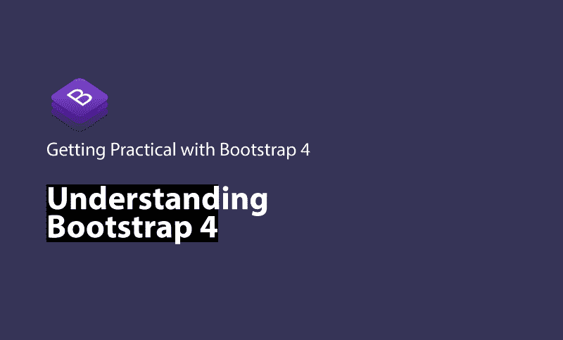**

### ****使用 Bootstrap 4 实用化****

**哈哈！这是文章中让我真正兴奋的部分。在前面的章节中，我试图让你熟悉 Bootstrap 4 框架，现在让我们构建一些非常酷的项目。**

**当我们完成[这个项目](https://codepen.io/ohansemmanuel/full/zEKrxP/)时，你应该已经成功地建立了一个单页启动页面。**

#### **你将学到什么**

**作为本文中教授的概念的第一个实际应用，构建这个项目有一些优势。**

**如果您是 Bootstrap 的新手，我会确保涉及到您需要的基本概念。对于更有经验的开发人员来说，这个例子突出了 Bootstrap 4 的一些新特性。**

**该示例还显示了如何在 Bootstrap 4 中使用 Flexbox。此外，一些看似简单的事情，如偏移列和将块元素居中对齐，在这个版本的框架中处理方式不同。**

**这些是我们将在这个例子中看到的一些东西。**

#### **你需要做的是**

**为了快速开发设置，我将在这个演示中使用 [CodePen](https://codepen.io) 。这就是你所需要做的。**

**首先，我们将关注启动主页的初始视窗。它用一个像样的背景图像、一个文本块和一个 CTA(行动号召)按钮填满了屏幕。**

**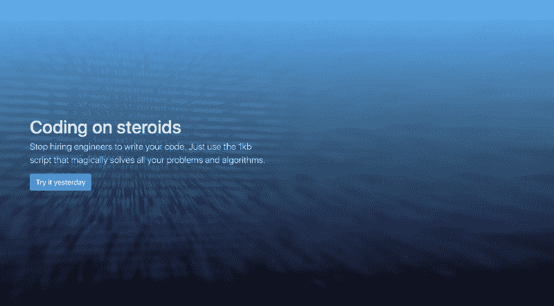

initial viewport** 

**此外，由于我们将重点关注移动优先的方法，因此了解如何在移动设备上进行设计非常重要。**

**以下是手机模型:**

****

**如上图所示，一切都大同小异。CTA 和开头段落与页面的开头保持水平对齐。**

**现在我们已经理解了设计需求，让我们从所需的初始标记开始。**

#### **初始标记**

**如果在本地工作，一个像样的引导项目需要的初始标记是这样的:**

```
**`<!DOCTYPE html><html lang="en">  <head>    <!-- Required meta tags -->    <meta charset="utf-8">    <meta name="viewport" content="width=device-width, initial-scale=1, shrink-to-fit=no">    <!-- Bootstrap CSS -->    <link rel="stylesheet" href="https://maxcdn.bootstrapcdn.com/bootstrap/4.0.0-beta/css/bootstrap.min.css" integrity="sha384-/Y6pD6FV/Vv2HJnA6t+vslU6fwYXjCFtcEpHbNJ0lyAFsXTsjBbfaDjzALeQsN6M" crossorigin="anonymous">  </head>`**
```

```
 **`<body>     <div class="container"></div>  </body></html>`**
```

**不要让看似复杂的代码让你感到厌烦。标记非常简单。**

**首先，考虑一下`meta`标签:**

```
**`<meta name="viewport" content="width=device-width, initial-scale=1, shrink-to-fit=no">`**
```

**标签的存在是为了确保开发的页面能够在移动设备上正确显示。如果您定义的媒体查询没有这个`meta`标签，您可能在移动设备上得不到您想要的外观。重要的是你把它包括在内。该标签还确保移动设备上的触摸缩放。**

**curous`content`和`initial-scale`属性是做什么的？看到这个很好解释 [stackoverflow 回答](https://stackoverflow.com/questions/33767533/what-does-the-shrink-to-fit-viewport-meta-attribute-do)。**

**其次，考虑一下`link`标签:**

```
**`<link rel="stylesheet" href="https://maxcdn.bootstrapcdn.com/bootstrap/4.0.0-beta/css/bootstrap.min.css" integrity="sha384-/Y6pD6FV/Vv2HJnA6t+vslU6fwYXjCFtcEpHbNJ0lyAFsXTsjBbfaDjzALeQsN6M" crossorigin="anonymous">`**
```

**上面的`link`标签与您过去使用过的任何其他`link`标签相同。它包括指向引导程序`cdn`的`href`属性。**

**好吧，我知道你在想什么。什么是`integrity`和`crossorgin` html 属性？**

**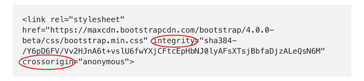**

**`integrity`属性检查加载`cdn`的源，并确保文件没有被操纵。这是一种安全措施，以确保您得到您“订购”的东西。这可能看起来微不足道，但长期以来，使用 CDN 的一个普遍缺点是，您无法直接控制所提供的内容。这可能导致导入的代码不可靠或被篡改。**

**使用“CORS”加载请求时，会出现`crossorigin`属性。**

**不要过多考虑这些属性是什么。我们继续吧。**

**此时，可以放心地假设您已经有了基本的标记设置。另外，请注意，上面的标记不包含任何指向 JavaScript 文件的链接。这是故意的。在这篇文章的后面，我们可能会在很久以后看一看使用 JavaScript 添加交互性。**

#### **代码笔设置**

**我将使用 codepen 进行更简单的设置。在 codepen 中，您可以在弹出的`html`设置中添加 meta 标签。请参考下面的截图。**

**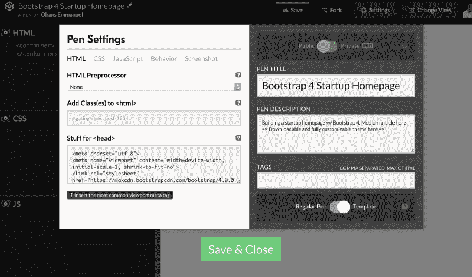

add the meta and link tag in the “Stuff for <head>” section** 

**在你的`html`中，用这个开始吧:**

```
**`<h1>Hello World</h1>`**
```

**如果你已经在屏幕上显示了*Hello World*，那么你已经准备好没有任何故障地跟随了。****

#### ***初始文档结构***

***一个新的 API 的额外好处之一是，在其覆盖的早期阶段确实没有最佳实践。自举 4 也是如此。***

***如果你在过去使用过 Bootstrap，那么你知道你的项目标记很快会变得难以管理。出于这个原因，我有一些很适合我的模式。你不需要采用它们，但它们肯定会使你的工作更容易。试试看。***

***当你看一看[的最终设计](https://codepen.io/ohansemmanuel/full/zEKrxP/)时，你会意识到有内容的分类部分。***

***有一个包含行动号召的初始部分，一个包含应用程序模型的部分，一个强调业务特性的部分，一个推荐部分，等等。你明白要点了。总共你应该有 8 个部分。***

***第一条经验法则是使用一个`section`标签或任何其他语义`html5` 标签来划分内容层。为什么？按照设计，使用 Bootstrap 意味着你的标记中会有很多`div`。使用`section`标签使标记更易于管理。***

```
***`<section></section><section></section><section></section><section></section><section></section><section></section><section></section><section></section>`***
```

***你应该从如上所示的 8 个标签开始。***

***现在，给每个标签一个唯一的`id`。***

***我选择`id`而不是类的原因与特殊性和拥有惟一标识符有关。你以后会明白为什么这很重要。***

***我将继续用相关的 id 命名`section`元素***

```
***`<section id="introduction"></section&gt;<section id="info--1">&lt;/section&gt;<section id="info--2">&lt;/section><section id="info--3"></section>;<section id="featured-on"></section>&lt;section id="feature-rundown"&gt;</section><section id="pricing"></section><section id="footer"></section>`***
```

***现在我们有 8 个`section`标签可以投入使用了。***

#### ***构建初始视口***

***让我们分析并构建初始部分`section#introduction`***

***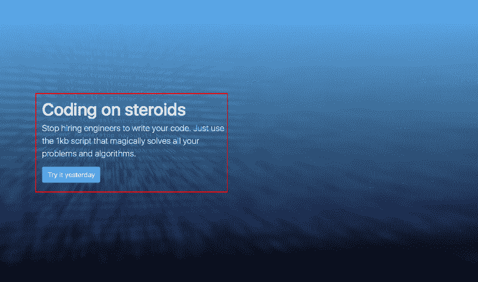***

***我们所拥有的是一个填充用户初始视口的`section`，其中消息和行动号召(CTA)垂直居中，水平对齐到`section`的起点。***

***现在让我们将网格知识应用到正在构建的项目中。***

***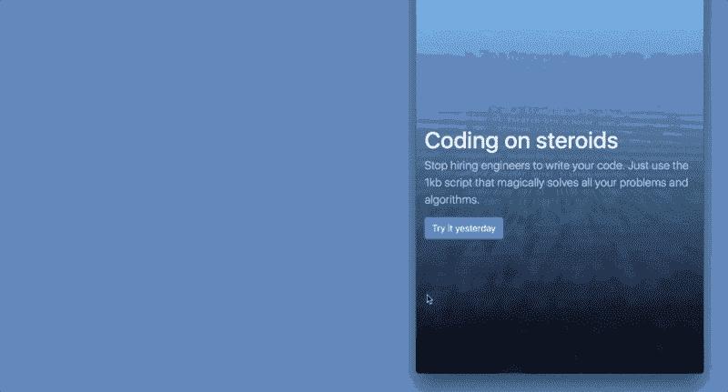

The initial section as viewed on multiple devices*** 

***初始视口的内部标记结构如下:***

```
***`<section id="introduction">   <div class="container">    <;div class="row">       <div class="col-12"></div>    </div>   </div></section>`***
```

***现在，我们已经有了一个基本的架构。***

***注意 column 类的使用，`.col-12`这确保了`div`填充了整个可用的 12 列。添加这个类，`.col-12`意味着无论屏幕大小如何，`div`都会填满整个 12 列网格。它将是整个网格的宽度。***

***`div.col-12`中需要的标记是这样的:***

```
***`<h1>Coding on steroids</h1><p>Stop hiring engineers to write your code. Just use the 1kb script that magically solves all your problems and algorithms.</p><a href="#" role="button">Try it yesterday</a>`***
```

***你现在应该有的是一张看起来一点都不好看的裸页。***

***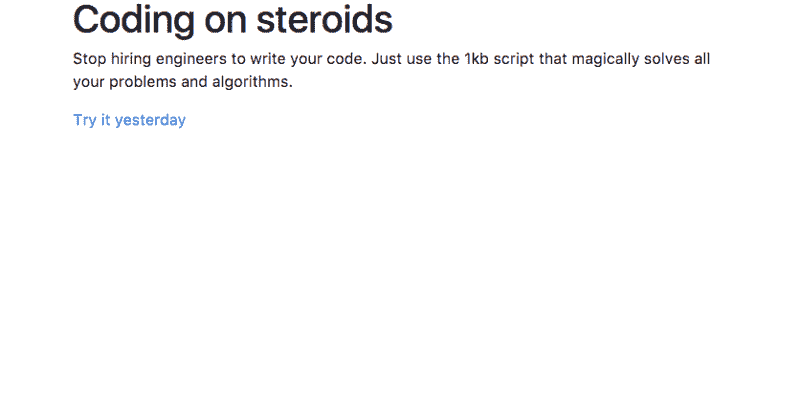***

#### ***让我们把它变漂亮***

***要让这个 UI 变得更好，我们需要做几件事情。***

***(I)样式`section#introduction`
`section#introduction`需要一个背景图像并被要求填充用户的视口***

***(ii)正确放置内容块
内容块、文本块、`h1`和`p`包含*“*类固醇编码……”必须完全垂直对齐中心***

**(iii)设计标题和引导段落的样式
`h1`和`p`元素需要一些样式——不管多么简单**

**(iv)风格 CTA
行动号召应清晰可辨。
`button`元素也应该被样式化**

**(iv)扩展到移动视图之外
最后，在更大的屏幕上，内容块不应该填充可用宽度，而是占据可用宽度的`50%`**

**考虑到这些，我们将用最少的定制样式来解决这些问题，尽可能利用默认的引导样式。**

**让我们开始吧。**

#### **解决方法**

**要用背景图片来设计`section#introduction`的样式，你需要写一些自定义的样式，就像这样:**

```
**`#introduction {  background: linear-gradient(rgba(100,181,246 ,1), rgba(0,0,0,0.8)), url('http://bit.ly/2fBj6OJ') 0% 0%/cover }`**
```

**这将给`section#introduction`一个微妙的背景图像，顶部有一个温和的线性渐变。**

**如果您不确定上述代码的作用，下图可能会有所帮助:**

**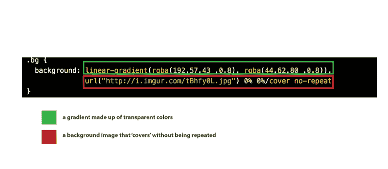

An example of setting a gradient and background image on an element.** 

**要求`section#introduction`填充用户的视口。Bootstrap 没有用于此目的的实用程序类，所以我们需要自己编写。这是:**

```
**`.fill-viewport {  min-height: 100vh }`**
```

**现在，将这个类添加到`section#introduction` 中，如下所示:**

```
**`<section id="introduction"> <div class="container">   <div class="row fill-viewport">       ...   </div> </div></section>`**
```

**我在这里做了什么？**

**你会注意到我已经将`.fill-viewport`添加到了`div.row`中，而不是整个容器、`div.container`或`section#introduction.`**

**这是很故意的。根据经验，除非在某些特殊情况下，包含内容体中需要的每个实用程序类都应该放在`.row`中。这是我喜欢的工作方式。我遵循这条规则的另一个原因是，它使标记变得整洁，没有到处乱跳的类名。你需要一点结构来写好代码。**

**有了它，你应该有一个看起来相当不错的`section`。**

**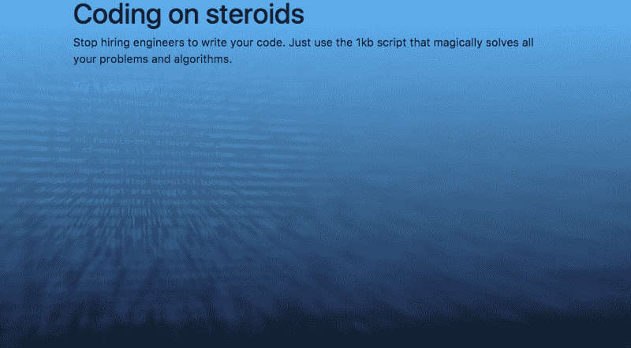**

**你一定注意到了内容块的位置不对。让我们把它放在页面的垂直中心。**

**这里是指出这一点的最佳地点。默认情况下，每个引导程序 4 `.row`都是一个`flex-container.`**

**我不能过分强调这是多么重要。**

**默认情况下，每个引导程序 4 `.row`都是一个`flex-container.`**

**这带来了以前版本框架中没有的机会。**

**由于`.row`是一个`flex-container`，我们可以继续添加引导实用程序类`align-items-center`，这将使每个`flex-container`的内容居中对齐。**

**像这样应用它:**

```
**`<section id="introduction"> <div class="container">   <div class="row fill-viewport align-items-center">       ...   </div> </div></section>`**
```

**同样，我已经将这个类添加到了`.row`中。**

**下面是这样的结果:**

**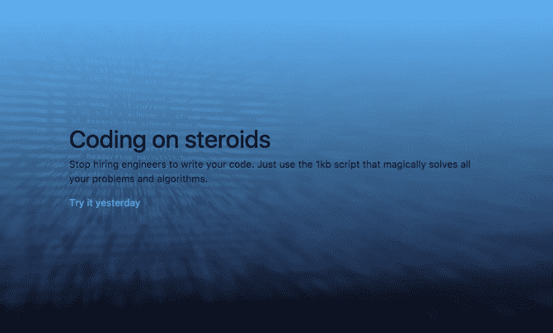**

**在这一点上，我们正在取得可观的进展。**

**Bootstrap 4 有许多其他的 [Flexbox 实用程序](https://getbootstrap.com/docs/4.0/utilities/flex/)类。他们几乎不需要很多解释。类名非常具有描述性。**

**让我们来设计`h1`和`p`元素的样式。**

**在本文的前面，我已经花时间讨论了文本实用程序类。要设置这些文本元素的样式，请执行以下操作:**

```
**`<h1 class="text-white">Coding on steroids<;/h1><;p class="lead">Stop hiring engineers to write your code. Just use the 1kb script that magically solves all your problems and algorithms.</p>`**
```

**正如你已经知道的，`text-white`将会给`h1`一个白色，`.lead`将会给这个段落一个与其他段落稍微不同的样式。**

**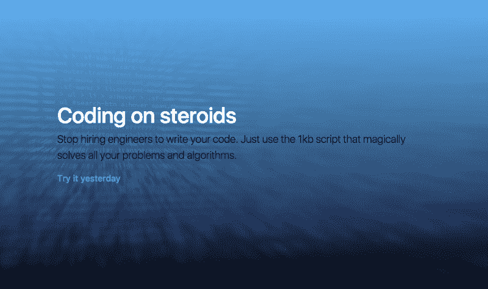**

**这看起来不错，但我想让这一段有一个稍微模糊的颜色。为此，我们将编写另一个实用程序类:**

```
**`.text-white-70 {  color: rgba(255,255,255,0.7)}`**
```

**这将给予文本一个稍微透明的白色。**

**继续在引导段落中使用这个类，就像这样:**

```
**`<p class="lead text-white-70">Stop hiring engineers to write your code. Just use the 1kb script that magically solves all your problems and algorithms.</p>`**
```

**现在你应该有这个:**

**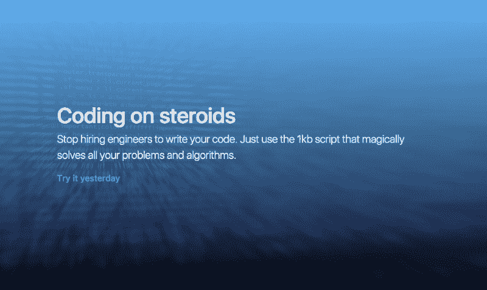**

**请注意我们是如何将微小的功能抽象成可重用的 CSS 类的。这对可重用性非常重要。**

**扣子还是没系好。我们需要解决这个问题。**

**Bootstrap 中的按钮是使用`.btn`类设计的。颜色方面有一些变化。例如`.btn-primary`和`.btn-secondary`会分别给出一个蓝色和灰色的按钮。**

**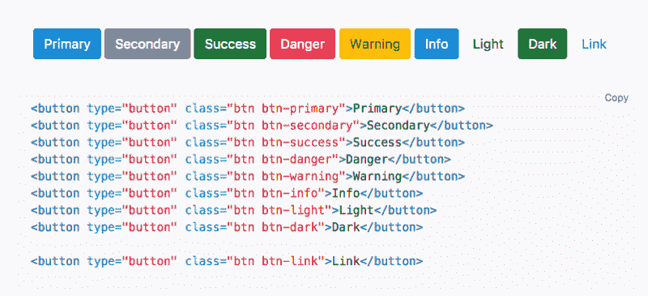

[https://getbootstrap.com/docs/4.0/components/buttons/](https://getbootstrap.com/docs/4.0/components/buttons/)** 

**要设置链接的样式，请执行以下操作:**

```
**`<a class="btn btn-primary" href="#" role="button">Try it yesterday</a>`**
```

**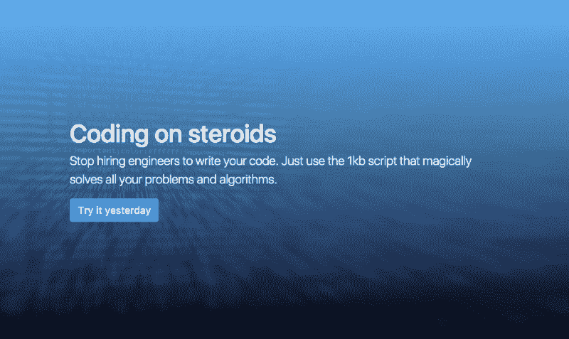**

**在这一点上，我们有一个在移动设备上看起来不错的`section`，但是在更大的设备上就不那么好了。让我们解决这个问题。**

**Bootstrap 遵循被广泛接受的移动优先开发方法。这意味着你首先要为移动设备设计，然后你要调整设计以适应更大的屏幕尺寸。这就是我们现在要做的。**

**当在`section#introduction`中定义包含网格时，我们就是这么做的。**

```
**`<div class="col-12">   ....</div>`**
```

**通过写这个，我们说 *"* 哦自举，让这个`div`在所有屏幕尺寸上填满整个 12 列宽度。 *"* 这很好——本着以移动为先的设计理念。**

**现在让我们在较大的设备上让列占据一半的宽度。你这样做:**

```
**`<div class="col-12 col-md-6">     ...</div>`**
```

**现在我们说的是: *"* 哦 Bootstrap，默认情况下，让这个 div 填充整个 12 列宽度，但是在更大的设备上让 div 占据 6 列。**

***12 减半，等于 6。因此，该列将占用较大设备上一半的可用空间。***

***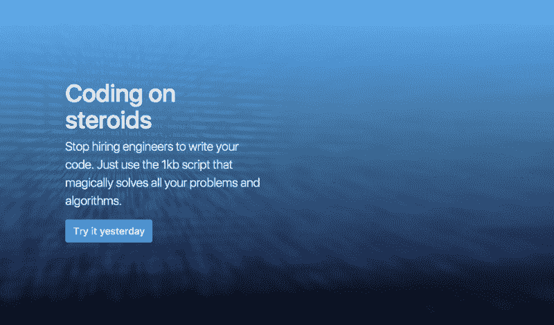***

***这就结束了初始视口的开发。***

***让我们继续下一部分。***

#### ***构建启动详细信息部分***

***下一节相当有趣。以下是它对大、中、小型设备的看法:***

***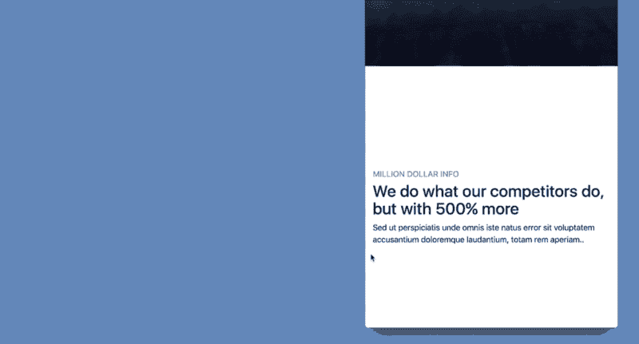***

***在移动设备上，用户会看到一个全宽的列，上面有一些重要的文本。在平板设备上，会显示更多文本，旁边还有一个应用预览。这形成了两个等宽的列。***

***在更大的设备上，显示更多的文本，移动应用程序预览也保持不变。***

***现在，让我们来建造这个。***

***按照惯例，我们会采取移动优先的设计。首先为移动设备设计。***

***用以下标记填充`section#info--1`:***

```
***`<section id="info--1">  <div class="container">    <;div class="row pt-5 align-items-center">      <div class="col-12">        <h6 class="text-uppercase text-black-40">          million dollar info        </h6>        <h2>We do what our competitors do, but with 500% more</h2>        <p>Sed ut perspiciatis unde omnis iste natus error        sit voluptatem accusantium doloremque laudantium,        totam rem aperiam..</p>     </div>    </div>  </div></section>`***
```

***你会注意到，我在这里的时间更长。让我解释一下***

***考虑一下`.row`:***

```
***`<div class="row pt-5 align-items-center"></div>`***
```

***在`row`中，有一列由以下内容表示:***

```
***`<div class="col-12">...</div>`***
```

***`col-12`确保`div`跨越全宽，默认为 12 列。***

***在`.row`中，您应该熟悉另外两个类。`pt-5`为`div`添加一个填充顶部，`align-items-center`确保伸缩项垂直居中。***

***不要忘记在 Bootstrap 4 中，每个`row`都是一个`flex-container.`***

***以下代码块代表文本块:***

```
***`<h6 class="text-uppercase text-black-40">million dollar info</h6><h2>We do what our competitors do, but with 500% more</h2> <p>Sed ut perspiciatis unde omnis iste natus error sit voluptatem  accusantium doloremque laudantium,totam rem aperiam..</p>`***
```

***是一个引导工具类，用于使文本大写。***

***`text-black-40`是另一个很小的类，它赋予文本黑色和`40%`不透明度。***

```
***`.text-black-40 {  color: rgba(0,0,0,0.4)}`***
```

***你应该有这个:***

***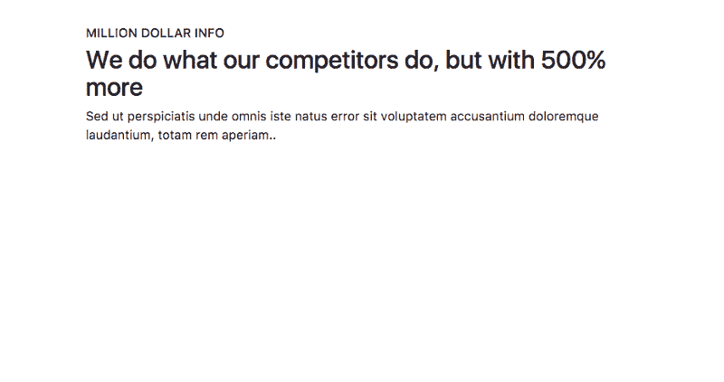***

***在手机上看起来不错。现在让我们在更大的设备上安装显示器。***

***对于中型设备，我们需要两列。一个用来存放应用程序模型，另一个用来存放文本块。***

***下面的代码块突出显示了解决方案。继续将图像添加到一个新列中，就在文本块上方的`.row`内。***

```
***`<section id="info--1">  <div class="container">    <div class="row pt-5 align-items-center">       <div class="col d-none d-md-block align-self-end">                <div class="col">        <h6 class="text-uppercase text-black-40">          million dollar info        </h6>        <h2>We do what our competitors do, but with 500% more</h2>        <p>Sed ut perspiciatis unde omnis iste natus error        sit voluptatem accusantium doloremque laudantium,        totam rem aperiam..</p>     </div>    </div>  </div></section>`***
```

***包含图像的新代码块如下:***

```
***`<div class="col d-none d-md-block align-self-end">    </div>`***
```

***这里有几个新的引导实用程序类。让我们看一看。***

***以`d-`开头的类名代表显示类。***

***`d-none`将隐藏它所应用到的任何元素，而`d-block`将通过给它一个`display: block`来显示该元素，因此，应用类`d-none`和`d-md-block`说， *"* 嘿 Bootstrap，默认情况下隐藏该元素，但在介质`md`设备*上显示该元素****

**另外，`align-self-end`将确保元素与 flex 容器的底部垂直对齐。一些 Flexbox 的好东西在那里！**

**还有一个变化你可能没注意到。**

**我们现在有两列，每列都有类名`.col`，而不是两列都有类名，`col-12`将其改为`.col`**

```
**`<section id="info--1">  <div class="container">    <div class="row pt-5 align-items-center">       <div class="col d-none d-md-block align-self-end">                &lt;/div>       <div class="col">        <h6 class="text-uppercase text-black-40">          million dollar info        </h6>        <h2>We do what our competitors do, but with 500% more</h2>        <p>Sed ut perspiciatis unde omnis iste natus error        sit voluptatem accusantium doloremque laudantium,        totam rem aperiam..</p>     </div>    </div>  </div></section>`**
```

**当有任意数量的元素拥有`.col`类时，它们将以相等的维度占据可用的宽度。**

**在这种情况下，图像块和内容区域将占据可用宽度的`50%` 。如果在一个`.row`中有三个元素，每个元素都有一个类`.col`，那么它们都将占据可用宽度的`30%`。我很确定你现在明白了。**

**这是此时您应该得到的结果:**

**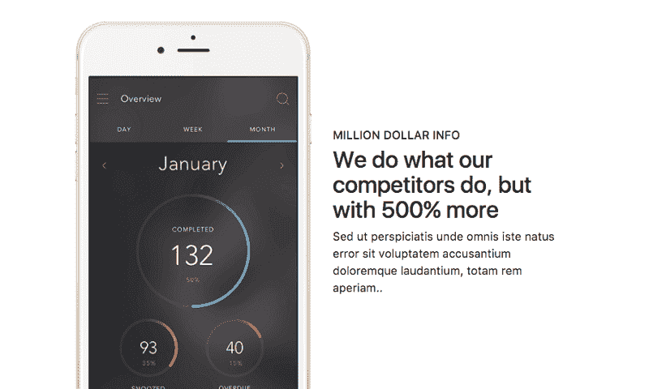**

**除了大型设备上的额外文本块，我们几乎完成了这个`section`。让我们解决这个问题。**

**由于列可以嵌套，我们可以包含另一列来容纳大型设备上的并排文本块。**

**这应该放在第二列中，最后一个文本块的下面:**

```
**`<!-- columns can be nested --> <div class="row">   <div class="d-none d-md-block col">      <h5>killer feature</h5>       <p>veritatis et quasi architecto beatae vitae       dicta sunt explicabo.&lt;/p>       <a href="#" class="d-block">learn more&lt;/a>    </div>    <div class="d-none d-lg-block col">       <h5>second killer feature</h5>        <p>veritatis et quasi architecto beatae vitae        dicta sunt explicabo.</p>        <a href="#" class="d-block">learn more</a>    </div> </div>`**
```

**您将再次注意到显示实用程序类的使用。默认情况下，`row`中的两个`div`都被`d-none`隐藏，因此它们不会在移动设备上显示。类名`col`确保它们占据相等的空间。但是，第二个文本块只能在带有`.d-lg-block`的较大设备上显示。**

**由于 Bootstrap 在设计上采用了移动优先的方法，所以第一个具有类`d-md-block`的文本块在大型设备上也是可见的。**

**“在移动设备上显示”与“在所有设备上显示”同义。
“在中型设备上显示”也指“在中型设备和其他更大的设备上显示”。**

**我真的希望你明白这一点。**

**以下是目前为止的结果:**

**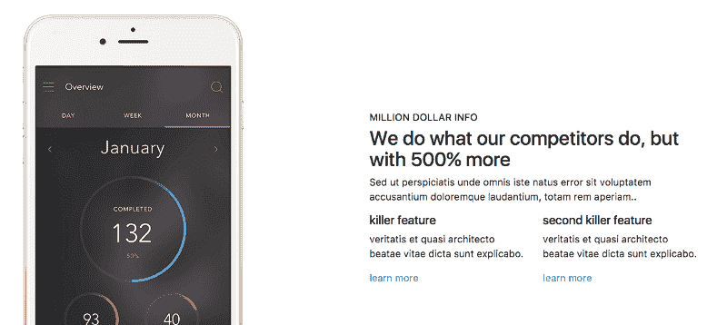**

**让我们进入下一部分！**

#### **构建“关于”部分**

**第三部分与我上面讨论的第二部分有着非常相似的氛围。有一些细微的区别:**

1.  **`pre`标签的使用**
2.  **在移动设备上显示时列顺序的变化。**

**

The code block appears first when viewed on mobile. On larger devices, the display is swapped with the code block appearing last.** 

**以下是组成该部分的完整代码:**

```
**`<section id="info-2" class="bg-dark"> <div class="container">   <div class="row align-items-center fill-80-viewport">     <div class="col-12 col-md-6 my-5 order-2 order-md-1">       <p class="text-uppercase text-white-40"><strong>faster development</strong></p>       <h2 class="text-white">Coding has never been this fast. It's almost magical</h2>       <p class="lead text-white-70">Stop hiring engineers to write your code. Just install one script that magically solves all your problems.</p>       <a class="btn btn-light d-block d-md-inline-block py-3" href="#" role="button">Read the docs</a>     </div>     <pre class="col-12 col-md-6 my-5 order-1 order-md-2 py-4 border border-info rounded text-info">      <span>1</span> <span> //codingSteroids.js</span>       <span>2</span>      <span>3</span>   const data = {      <span>4</span>        "purpose": {      <span>5</span>        "getId": "#element",      <span>6</span>        "companyName": "coolStartup",      <span>7</span>      }      <span>8</span>    }      <span>9</span>           <span>10</span>   function codingSteroids(        <span>11</span>       data,      <span>12</span>       getSteroidsType      <span>13</span>   )       <span>14</span>           <span>15</span>   function getSteroidsType() {      <span>16</span>     return "codeHellish!"      <span>17</span>   }      </pre>   </div> </div></section>`**
```

**您可能会认为上面的代码块很复杂。然而，仔细研究后发现，事实并非如此。**

**与往常一样，该部分以一个熟悉的标记开始:**

```
**`<section id="info-2" class="bg-dark"> <div class="container">   <;div class="row align-items-center fill-80-viewport">     ...   </div> </div></section>`**
```

**我总是给这些部分一个`Id`，在`row`中有两列:**

```
**`<section id="info-2" class="bg-dark"> <div class="container">   <div class="row align-items-center fill-80-viewport">     &lt;div class="col-12"     <;/div&gt;     <pre class="col-12"     </pre>   </div> </div></section>`**
```

**默认情况下，这两列都被设置为占据所有 12 个可用列。因此，它们会相互垂直堆叠。**

**在中型和更大的设备上，列占据相等的列宽:**

```
**`<section id="info-2" class="bg-dark"> <div class="container">   <div class="row align-items-center fill-80-viewport">     <div class="col-12 col-md-6"     <;/div&gt;     &lt;pre class="col-12 col-md-6"     </pre>   </div> </div></section>`**
```

**你现在应该已经习惯了:)
`.bg-dark`给这个部分一个深色的背景。该部分包含一个`container`和一个嵌套的`row.`**

**`align-items-center`是一个 Flexbox 实用程序类，它将`row`的内容垂直居中对齐。不要忘记每个`row`都是默认的`flex-container.`**

**`fill-80-viewport`我写过这样一个小小的班级:**

```
**`.fill-80-viewport {  min-height: 80vh}`**
```

**类`.fill-80-viewport`确保该部分占据用户视口高度的`80%`。**

**所以，这是我们还没有讨论的新东西:**

```
**`<section id="info-2" class="bg-dark"> <div class="container">   <div class="row align-items-center fill-80-viewport">     <div class="col-12 order-2 order-md-1"     </div&gt;     <pre class="col-12 order-1 order-md-2"     </pre>   </div> </div></section>`**
```

**假设您熟悉 Flexbox 的工作方式，`order`属性决定了`flex-items`显示的视觉顺序。首先显示具有最低`order`值的项目，最后显示`highest`。实际上，这些项目是按照递增的`order`值显示的——从最低到最高。**

**`order-`类名试图重现同样的行为。它们是引导 Flexbox 实用程序类，允许任何整数值，如`order-5`和`order-10.`**

**带有类`order-2`的元素比你猜对的带有`order-1`的元素具有更高的顺序值。整数值越高，`order`值越高。**

**订单类名也有相应的变化。因此，当在中等尺寸或更大尺寸的设备上观看时，`order-md-1` 将具有顺序值 1。因此，在中等大小或更大的设备上查看时，`order-md-2`的`order`值为`2`。**

**根据这些，你应该能够理解这一点:**

```
**`<div class="col-12 order-2 order-md-1"</div><pre class="col-12 order-1 order-md-2"</pre>`**
```

**默认情况下，`pre`标签将首先显示，然后是`div`。这是因为`order-1`首先显示，然后`order-2`增加`order`值。在较大的设备上查看时，`div`内的内容将首先显示，然后是`pre`标签内的内容。**

**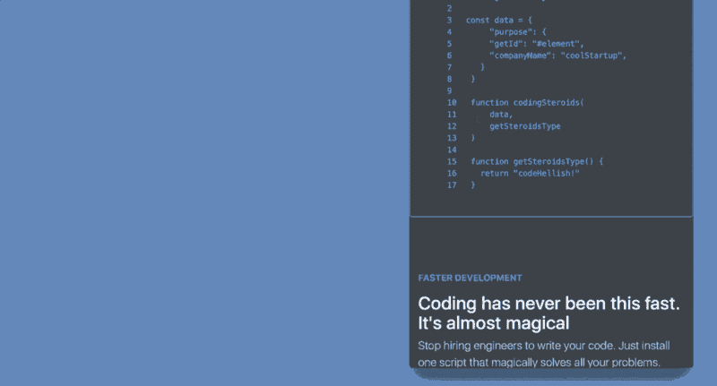

When viewed on larger devices, the content within the `div` will be displayed first, followed by the content within the `pre` tags.** 

**组成该部分的其余标记并不难理解。它很大程度上基于我们已经花了很多时间研究的文本和间距实用程序类。**

**让我们继续下一个内容部分。**

#### **构建客户评价部分**

**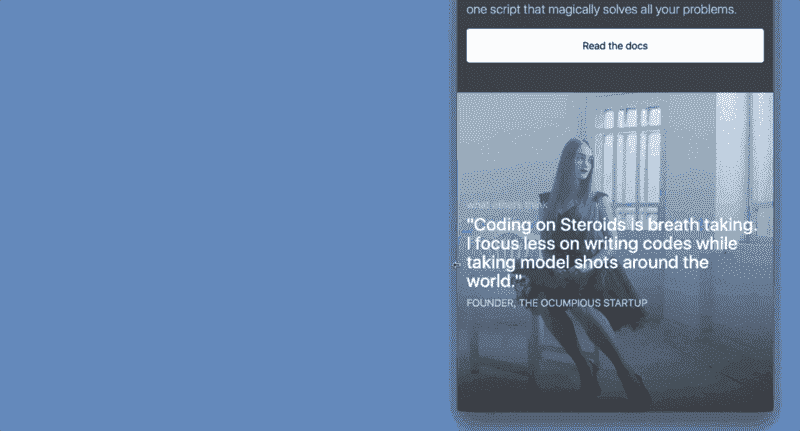

The testimonial section as displayed on mobile and larger devices.** 

**如果您一直在关注，那么很明显这一部分与第一部分内容非常相似。**

**它由一列组成。在较大的设备上，该列位于右侧，但在较小的设备上，该列与开头对齐。下面是支持这一部分的标记:**

```
**`<section id="info-3">  <div class="container">    <div class="row fill-80-viewport align-items-center justify-content-end text-white">      &lt;div class="col-12 basis-md-50">        <h6 class="text-white-40">          what others think        </h6>        <h3>"Coding on Steroids is breath taking. I focus less on writing codes           while taking model shots around the world."</h3>        <p class="text-uppercase text-white-70">Founder, The Ocumpious Startup</p>      </div>  </div>  </div></section>`**
```

**很简单，是吧？**

**`align-items-center` 和 `justify-content-end`完全按照他们读的去做。代表`flex-item`的单个列将与垂直中心和水平末端对齐。**

**默认情况下，该列用`.col-12.`填充可用空间，但是，在中型或更大的设备上，它只占用可用宽度的`50%`。**

**`basis-md-50`我写过这样一个小小的班级:**

```
**`@media screen and (min-width: 768px ){  .basis-md-50 {    flex-basis: 50%  }  }`**
```

**当列占用了`100%`的可用宽度，就真的不能强制到底了。对此你看不到任何视觉反馈。然而，当列的宽度减小到`50%`时，这变得明显。**

**这就是在较大的设备上向右移动列的技巧。**

**让我们继续下一部分。**

#### **构建特色部分**

**

This section contains a list of icons, horizontally centered within the section.** 

**这个感觉像是儿戏。真的很简单。**

**标记由一系列字体很棒的图标组成。**

```
**`<section id="featured-on" class="bg-primary">  <div class="container">    <div class="row py-5 text-center text-white">      <div class="col-12">          <i class="fa fa-3x fa-free-code-camp my-3 mx-5"              aria-hidden="true"></i>          <i class="fa fa-3x fa-twitter my-3 mx-4"              aria-hidden="true"></i>          <i class="fa fa-3x fa-facebook my-3 mx-4"              aria-hidden="true"></i>          <i class="fa fa-3x fa-quora my-3 mx-4"              aria-hidden="true"></i>          <i class="fa fa-3x fa-reddit my-3 mx-4"              aria-hidden="true"></i>          <i class="fa fa-3x fa-pied-piper my-3 mx-4"              aria-hidden="true"&gt;&lt;/i>          <i class="fa fa-3x fa-paypal my-3 mx-4"              aria-hidden="true"></i>          <i class="fa fa-3x fa-product-hunt my-3 mx-4"              aria-hidden="true"></i>      </div>    </div>  </div></section>`**
```

**类`.text-center`确保这些图标总是水平居中。本节使用了大量的间距等级。你看到上面标记中的
`my-3``mx-4``py-5`了吗？**

**这些是你已经熟悉的类名，对吗？**

**是啊！**

**让我们继续下一个内容部分。**

#### **构建产品功能部分**

**

A section containing an header and a couple features aligned within multiple columns.** 

**该部分的完整标记如下所示:**

```
**`<section id="feature-rundown">  <div class="container">    <div class="row mt-5">      <div class="col-12 col-md-6 mx-auto mt-5 text-center">        <h6 class="text-black-40 text-uppercase">          The bitter truth        </h6>        <h3 class="text-black-70">On a scale of 1 to 10, we make your life easier 10/10, period.</h3>      </div>    </div>    <div class="row mb-5">        <div class="col-12 col-md-4 text-center">                    <p>            <strong class="text-info">24/7 support</strong>  For            your sake, we do not sleep.          </p>        </div>        <div class="col-12 col-md-4 text-center">                    <p>            <strong class="text-info">Fast</strong&gt;  Like flash.          </p>        </div>        <div class="col-12 col-md-4 text-center">                    <p>            <strong class="text-info">;Reliable</strong>  We never have a server downtime.          </p>        </div>        <div class="col-12 col-md-4 text-center">          Computational Analysis</strong>  like no other.          </p>        </div>        <div class="col-12 col-md-4 text-center">                    <p>            <strong class="text-info">Analytics</strong>  like no other.          </p>        </div>        <div class="col-12 col-md-4 text-center mb-5">                    <p>            <strong class="text-info">Affordable</strong> as coffee.          </p>        </div>    </div>  </div></section>`**
```

**虽然它看起来很复杂，但是当你仔细检查它时，它真的很简单。**

**像其他部分一样，这个部分从给这个部分一个`id`开始，并在其中嵌套一个`container`。**

```
**`<section id="feature-rundown">  <div class="container">    ...  </div></section>`**
```

**与其他部分不同，此部分包含 2 个嵌套行。**

```
**`<section id="feature-rundown">  <div class="container"&gt;    <div class="row">    </div&gt;    <div class="row">    </div>  </div></section>`**
```

**第一行包含部分标题:**

**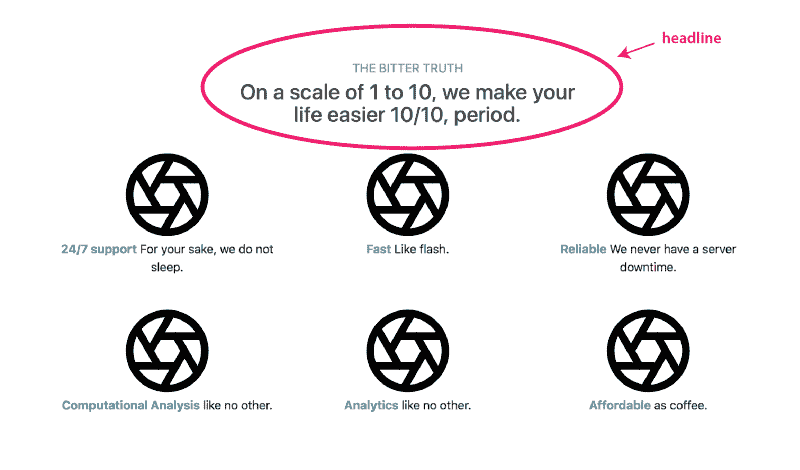

The headline highlighted.** 

**第二行包含图像图标列表:**

**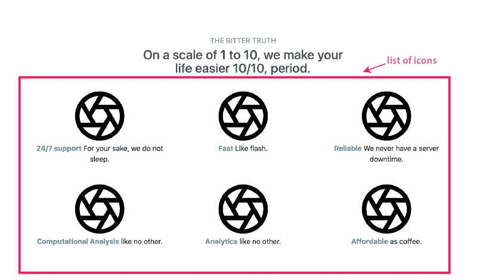

The icon list highlighted.** 

**下面是第一行的内容:**

```
**`<div class="col-12 col-md-6 mx-auto mt-5 text-center">        <h6 class="text-black-40 text-uppercase">          The bitter truth        </h6>        <h3 class="text-black-70">On a scale of 1 to 10, we make your life easier 10/10, period.</h3></div>`**
```

**默认情况下，它会占用中型设备中行`col-12.`的可用宽度。它占据了宽度`col-md-6`的一半，并且水平居中`mx-auto.`**

**其他的类名是你已经熟悉的东西。**

**为了清楚起见，`text-black-40`和`text-black-70`是很小的类，我是这样写的:**

```
**`.text-black-70 {   color: rgba(0,0,0,0.7) } .text-black-40 {   color: rgba(0,0,0,0.4) }`**
```

**另一方面，第二个`row`包含图像和相关文本的列表:**

```
**`<div class="col-12 col-md-4 text-center">                    <p>            <strong class="text-info">24/7 support</strong>  For            your sake, we do not sleep.          </p>        </div>        <div class="col-12 col-md-4 text-center">                    <p>            <strong class="text-info">Fast</strong>  Like flash.          </p>        </div>        <div class="col-12 col-md-4 text-center">                    <p>            <strong class="text-info">Reliable</strong&gt;  We never have a server downtime.          </p>        </div>        <div class="col-12 col-md-4 text-center">                    &lt;p>            <strong class="text-info"&gt;Computational Analysis</strong>  like no other.          </p>        </div>        <div class="col-12 col-md-4 text-center">                    &lt;p>            &lt;strong class="text-info">Analytics</strong>  like no other.          </p>        </div>        <div class="col-12 col-md-4 text-center mb-5">                    <p>            <strong class="text-info">Affordable</strong> as coffee.          </p>        </div>`**
```

**默认情况下，分栏填充可用空间，在中型或更大的设备中占据三分之一的可用空间，文本和图像居中对齐，`col-12 col-md-4 text-center.`**

**`<stro` ng >标签上的`text-info`类给文本一种蓝绿色。**

**这几乎就是本节的全部内容。**

**让我们继续下一个。**

#### **构建定价部分**

**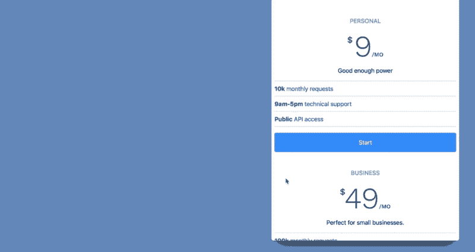

This section contains a pricing grid.** 

**如果你想让你的生意赚钱，价格表是非常重要的。让我们来看看如何建立一个。**

**这一部分的完整标记如下:**

```
**`<section id="pricing" class="bg-light">    <div class="container fill-80-viewport">        <div class="row">          <div class="col-12 col-md-6 mx-auto text-center my-5">              <h6 class="text-black-40 text-uppercase">                pricing              </h6>              <h3 class="text-black-70">we are very affordable</h3>            </div>        </div>`** 
```

```
**`<div class="row pb-5">        <div class="col-12 col-md-4 px-2 my-4 text-center">        <h6 class="text-black-40 text-uppercase">            Personal          </h6>                <p>Good enough power</p>        <ul class="list-unstyled list-border-black-20 list-border-y text-left text-black-70">               <li class="py-2"><strong>10k</strong> monthly requests</li>          <li class="py-2"><strong>9am-5pm</strong>             technical support</li>          <li class="py-2"><strong>Public</strong>             API access</li>        </ul>        <a class="btn btn-block btn-primary border-0 text-white py-3" href="#">Start</a>        </div>                   <div class="col-12 col-md-4 px-2 my-4 text-center">          <h6 class="text-black-40 text-uppercase">              Business            </h6>                    <p>Perfect for small             businesses.</p>          <ul class="list-unstyled  list-border-black-20 list-border-y text-left text-black-70">                 <li class="py-2"><strong>100k</strong> monthly requests</li>            <li class="py-2"><strong>9am-5pm</strong>               technical support</li>            <li class="py-2"><strong>Public and Private</strong>               API access</li>          </ul>          <a class="btn btn-block btn-primary border-0 text-white py-3" href="#">Start</a>        </div>                  <div class="col-12 col-md-4 px-2 my-4 text-center">          <h6 class="text-black-40 text-uppercase">              Corporate            </h6>                    <p>Unlimited super powers</p>          <ul class="list-unstyled list-border-black-20 list-border-y text-left text-black-70">                 <li class="py-2"><strong>10,000k</strong> monthly requests</li>            <li class="py-2"><strong>9am-5pm</strong>               technical support</li>            <li class="py-2"><strong>Public and Private</strong>               API access</li>          </ul>          <a class="btn btn-block btn-primary border-0 text-white py-3" href="#">Start</a>        </div>      </div>      </div>  </section>`**
```

**看起来很复杂？**

**别担心。我来解释一下。**

**该部分以嵌套容器和两行开始:**

```
**`<section id="pricing" class="bg-light">    <div class="container fill-80-viewport">        <div class="row">        &lt;/div>        <div class="row">        </div>    </div></section>`** 
```

**和往常一样，`section`有一个`id`。`bg-light`类给这个部分一个浅背景色。**

**容器已被设置为至少填充可用视口高度的`80%`。我已经这样做过几次了，这并不奇怪:**

```
**`.fill-80-viewport {  min-height: 80vh}`**
```

**第一行是该部分的标题:**

```
**`<div class="col-12 col-md-6 mx-auto text-center my-5">     <h6 class="text-black-40 text-uppercase">         pricing     &lt;/h6>     <h3 class="text-black-70">we are very affordable</h3></div>`**
```

**标题嵌套在一个列中，该列填充了移动设备上的可用空间，同时占据了中型设备或更多设备的可用宽度的一半`col-12 col-md-6.`。该列还被设计为文本内容居中`text-center`,并且位于可用宽度的中心`mx-auto.`**

**类名`text-black-40`和`text-black-70`是我这样写的小类:**

```
**`.text-white-40 {  color: rgba(255,255,255,0.4)}.text-white-70 {  color: rgba(255,255,255,0.7)}`**
```

**在第二个`row`中是定价表。**

**每个价格表由以下内容组成:**

```
**`<div class="col-12 col-md-4 px-2 my-4 text-center">        <h6 class="text-black-40 text-uppercase">            Personal          <;/h6>                <p>Good enough power</p>        <ul class="list-unstyled list-border-black-20 list-border-y text-left text-black-70">               <li class="py-2"><strong>10k</strong> monthly requests</li>          <li class="py-2"><strong>9am-5pm</strong>             technical support</li>;          <li class="py-2"><strong>Public</strong>             API access</li>        </ul>        <a class="btn btn-block btn-primary border-0 text-white py-3" href="#">Start</a></div>`**
```

**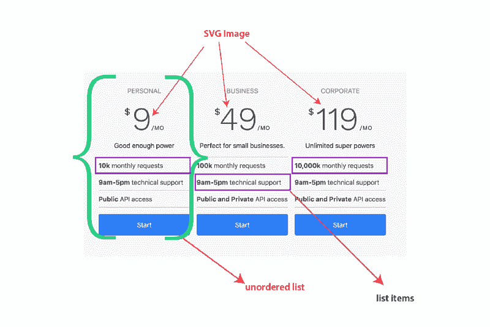

A breakdown of the components of the pricing grid.** 

**它基本上是一个标题，一个图像，一个带有 CTA 按钮的无序特性列表。**

**在三个地方重复这个，你就有了三列价格网格。您看到标记变得多么易于管理了吗？**

**大部分的班名你应该都很熟悉。但是看看这个:**

```
**`...<;ul class="list-unstyled list-border-black-20 list-border-y text-left text-black-70">    ... </ul>`**
```

**`list-unstyled`是一个 bootstrap 类，它移除了无序列表`ul`默认的填充和列表样式。**

**这些是:**

```
**`list-border-black-20,  list-border-y`**
```

**是我写的一个小类，只在列表元素的顶部和底部添加边框。**

```
**`.list-border-y li {  border-top: 1px solid}.list-border-y li:last-child {  border-bottom: 1px solid}`**
```

**这就是定价表中列表的边界。**

**

The 1px borders around the list items.** 

**是另一个给边框黑色透明颜色的小类。**

**这些类没有自带 bootstrap，所以我们必须自己写。**

```
**`.list-border-black-20 li,.list-border-black-20 li:last-child{  border-color: rgba(0,0,0,0.2)}`**
```

**现在，这使得边界的颜色显示为微妙的透明黑色。**

**这就是这个内容部分的全部内容。让我们看看下一个。**

#### **构建页脚**

**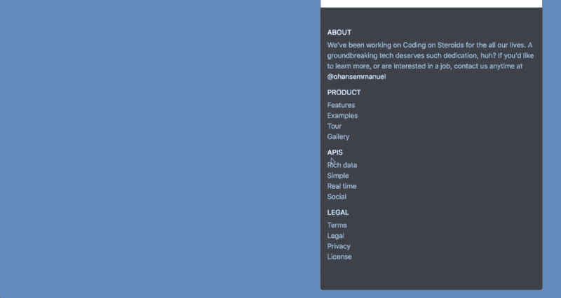

The footer section.** 

**这是该页面的最后一个内容部分，它代表页面的页脚。**

**这一部分的完整代码如下所示:**

```
**`<section id="footer" class="bg-dark">  <div class="container">    <div class="row fill-40-viewport py-5 text-white-70 align-items-center">        <div class="col-12 col-md-6">          <ul class="list-unstyled">            <li><h6 class="text-white">ABOUT</h6></li>            <li>We’ve been working on Coding on Steroids               for the all our lives.               A groundbreaking tech deserves such dedication, huh?                If you’d like to learn more, or are interested in a job,               contact us anytime at               &lt;a class="text-white" href="https://twitter.com/OhansEmmanuel" target="_blank">@ohansemmanuel</a></li>          </ul>        </div>        <div class="col-12 col-md-2">          <ul class="list-unstyled">            <li><h6 class="text-white">PRODUCT</h6></li>            <li>Features</li>            <li>Examples</li>            <li>Tour</li>            <li>Gallery</li>          </ul>        </div>        <div class="col-12 col-md-2">          <ul class="list-unstyled">            <li><h6 class="text-white">APIS</h6></li>            <li>Rich data</li>            <li>Simple</li>            <li>Real time</li>            <li>Social</li>          </ul>        </div>        <div class="col-12 col-md-2">        <ul class="list-unstyled">          <li><h6 class="text-white">LEGAL</h6></li>          <li>Terms</li>          <li>Legal</li>          <li>Privacy</li>          <li>License</li>        </ul>      </div>       </div>  </div> </section>`**
```

**现在，我们来分析一下。**

**当分解成更小的部分时，一切都很简单。**

**`section`以嵌套的`container`和行开始。**

```
**`<section id="footer" class="bg-dark">  <div class="container">    <;div class="row">    </div>  </div></section>`**
```

**和往常一样，我给了这个部分一个`id`。`bg-dark`类会给页脚一个深色背景。**

**在该列中有四列。**

**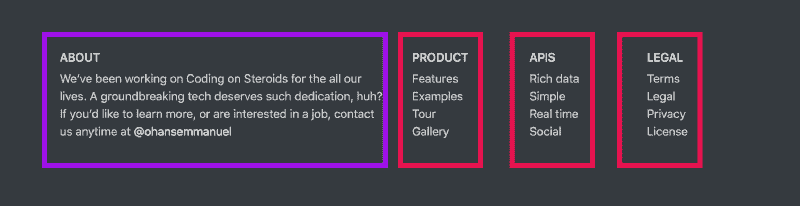

The four columns that make up the footer.** 

```
**`<div class="col-12 col-md-6"></div><div class="col-12 col-md-2">&lt;/div><;div class="col-12 col-md-2"></div><div class="col-12 col-md-2"></div>`**
```

**在移动设备上查看时，每列将占用可用空间`col-12`**

**第一列占据中型和大型设备可用宽度的一半`col-md-6,`，而其他列占据剩余一半可用空间的三分之一`col-md-2.`网格最终总计为 12。`6 + 2 + 2 + 2 = 12`**

**第一列是一个无序列表和一堆列表项。`list-unstyled`确保从`ul.`中删除默认间距和列表样式**

```
**`<ul class="list-unstyled">   <li>;<h6 class="text-white">ABOUT</h6></li>   <li>We’ve been working on Coding on Steroids        for the all our lives.        A groundbreaking tech deserves such dedication, huh?         If you’d like to learn more, or are interested in a job,        contact us anytime at        <a class="text-white"href="https://twitter.com/OhansEmmanuel" target="_blank">@ohansemmanuel</a></li></ul>`**
```

**其他列包含一个无序列表，其中也有一堆列表项:**

```
**`<ul class="list-unstyled">    <li>;<h6 class="text-white">PRODUCT</h6></li>    <li>Features</li>    <li>Examples</li>    <li>Tour</li>    <li>Gallery</li> </ul>`**
```

**就这些了！**

**很酷吧。**

**非常感谢您的关注！**

### **结论和更多信息**

**几个月前，当我开始写这篇文章时，我计划写下我所知道的关于 Bootstrap 的一切。然而，那竟然是很多？。**

**中型文章会很长，我担心没有人会费心去读它？。**

**我跳过的主题包括:**

1.  **萨斯/SCSS 简介**
2.  **如何使用 Sass 定制引导**
3.  **如何使用 Bootstrap CLI 工具加快设置**
4.  **如何使用 Gulp 和 Webpack 创建自己的构建过程**
5.  **如何建立专业的引导主题，如管理仪表板主题**
6.  **如何将 Bootstrap 4 与 ReactJS 一起使用**
7.  **更实际的例子，比如如何用 Bootstrap 构建一个 Twitter 和 Medium 克隆。这些例子利用了 JavaScript 和更多的引导组件**

**有好消息！**

**我正在写这些，但是我已经把它们浓缩成一本全面的书。你可能想要保持联系，并且[得到关于图书发行的通知](https://goo.gl/forms/vD49zKW03LqKH7sv1)。**

**如果你想成为一名高级开发人员，你不应该回避拥有各种技术的广泛经验。**

**干杯，**

**奥汉斯·艾曼纽**