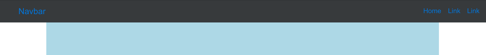

# Bootstrap 4:如何让顶部固定的 Navbar 留在容器里不拉伸？

> 原文：<https://www.freecodecamp.org/news/bootstrap-4-how-to-make-top-fixed-navbar-stay-in-container-and-not-stretch/>

有很多方法可以让一个固定的导航栏停留在父容器的`div`中。我们将在这里讨论最简单的方法。

假设您有以下代码，从[引导文档](https://v4-alpha.getbootstrap.com/components/navbar/#collapsible-content)稍微修改了一下:

```
<div class="container">
  <nav class="navbar navbar-fixed-top navbar-inverse bg-inverse">
    <button class="navbar-toggler hidden-lg-up" type="button" data-toggle="collapse" data-target="#navbarResponsive" aria-controls="navbarResponsive" aria-expanded="false" aria-label="Toggle navigation">
    </button>
    <div class="collapse navbar-toggleable-md" id="navbarResponsive">
      <a class="navbar-brand" href="#">
        Navbar
      </a>
      <ul class="nav navbar-nav float-md-right">
        <li class="nav-item active">
          <a class="nav-link" href="#">Home
            <span class="sr-only">(current)</span>
          </a>
        </li>
        <li class="nav-item">
          <a class="nav-link" href="#">Link</a>
        </li>
        <li class="nav-item">
          <a class="nav-link" href="#">Link</a>
        </li>
      </ul>
    </div>
  </nav>
  <div class="next"></div>
  hello
</div>
```

```
div.next {
  background-color: lightblue;
  width: 100%;
  height: 60rem;
}
```

你的页面看起来像这样:



## 解决方法

而文档显示“导航条及其内容在默认情况下是流动的”。使用可选容器来限制其水平宽度”，最简单的解决方案是使用 CSS 直接设置导航栏的宽度:

```
div.next {
  background-color: lightblue;
  width: 100%;
  height: 60rem;
}

.container {
  padding: 0px;
}

nav.navbar {
  width: inherit;
  top: 0%;
  left: 50%;
  transform: translateX(-50%);
}
```

通过添加针对`.container`和`nav.navbar`的规则，您的导航栏现在与父容器的宽度相同:

