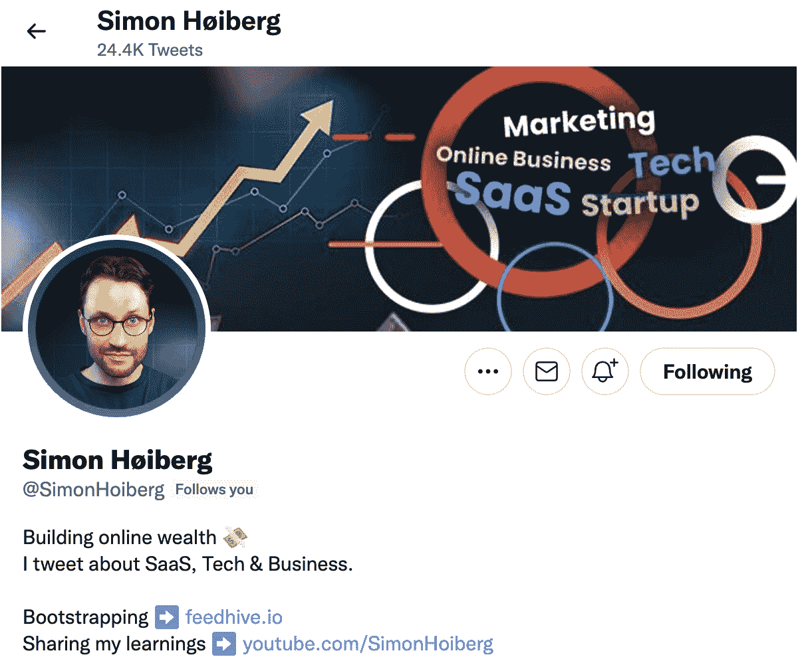
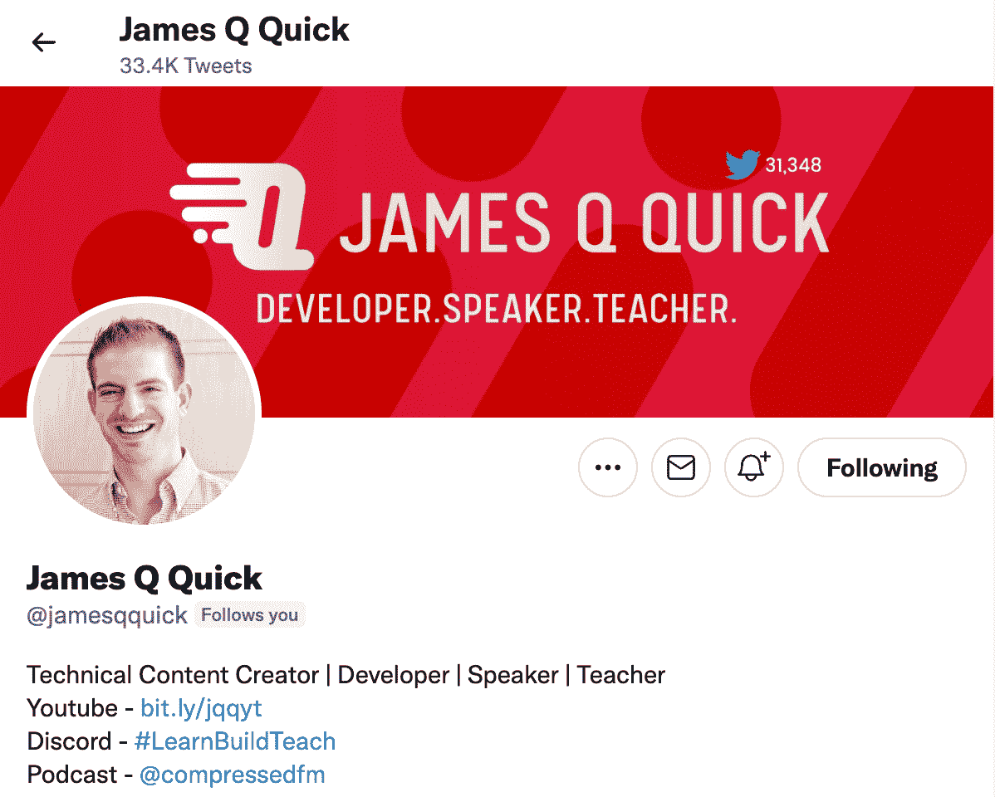
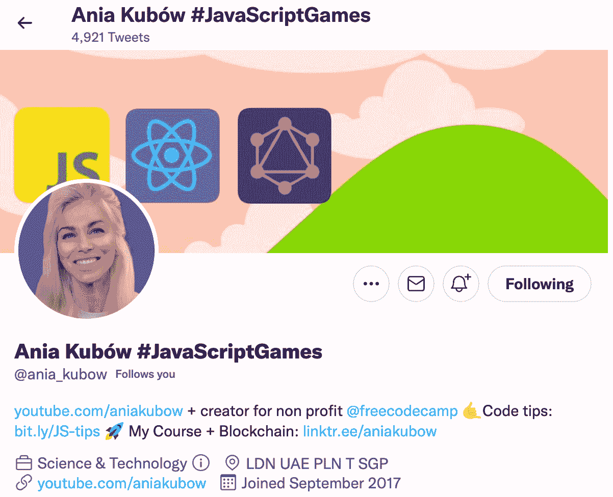

# 作为自由开发者，如何建立你的个人品牌

> 原文：<https://www.freecodecamp.org/news/branding-for-developer-freelancers/>

你可能不是为了成为一名营销人员而从事自由职业的。

你从事自由职业是为了在你想工作的时候工作，赚更多的钱，掌控自己的生活。

但是，如果你还没有意识到，作为一名自由职业者，你需要做的不仅仅是写代码。

打造品牌是你职业发展的一部分。

你会发现苹果、麦当劳或壳牌等大品牌的神奇之处。

你看到一个标志，立即知道它代表什么，传递什么。

这些国际公司有庞大的营销预算，因此他们可以在品牌推广上花费大量资金。

你可能还会认出与某些类型的电影有关联或推销流行产品的知名人士的个人品牌。

然而，你觉得确定你的个人品牌很难。确实是！

但是不用担心。我将带你经历一个建立个人品牌的简单过程。

当你读完这篇文章时，你会知道如何建立你的品牌。

## 为什么建立个人品牌很重要

正如我在[如何作为自由职业者创造商机](https://livecodestream.dev/post/how-to-generate-leads-as-a-freelancer/)中提到的，从人群中脱颖而出是很难的。所以你需要展示你的业务，并与潜在客户建立联系。

做到这一点的方法之一是利用个人品牌的力量和潜力。

许多自由职业者认为品牌化是艰难、复杂、耗时或令人不快的。

有可能，但前提是你用错误的方式接近它。

你的个人品牌非常简单——就是*你*。

它是你的照片，是你工作方式的本质，是你希望人们在告诉别人你的工作时如何谈论你。

*   Daniel 是一名数据库工程师，在 SQL 和 PHP 方面都做得很好。
*   Erin 是一名全栈 web 开发人员，他帮助小公司创建面向 Web3 的网站。
*   Juan 教人们如何成为一名程序员。

所有这三个都是个人品牌的例子，将他们所做的和他们希望其他人在想到他们的品牌时想到的联系起来。

这一切都始于确定你做什么，以及你希望别人如何谈论和思考你和你的工作。当你知道了这一点，其他一切就变得容易了。

## 如何开始建立你的个人品牌

你首先要承诺一件重要的事情:忠于自己。

你的品牌不能是你为了招揽客户而穿的数字服装。他们会立刻看穿的。

它需要来自于你是谁。

所以，问自己三个问题:

### 1.我是谁？

首先把自己定义为一名自由职业者，用 3 - 4 个关键词或短语来定义你的工作，比如:

*   创造性的
*   易于使用
*   努力工作的
*   可靠的

你希望人们如何描述和你一起工作意味着什么？

### 2.我该怎么办？

然后，具体说明你做什么(和不做什么)。举个例子，

*   我使用 Java 和 PHP 设计移动响应网站。
*   我编写基于 Web3 技术的安全应用程序。
*   我填补网站的安全漏洞，恢复被勒索软件劫持的商业网站。

这些陈述没有说，“我设计网站”或“我写应用程序。”那太笼统了。

对你所做的事情要*具体*。

明确你做什么意味着你会吸引正确类型的客户。

### 3.是什么让我独一无二？

最后，你很容易就能找到别人成功使用过的角色或身份。但是，不要因为你看到某件事对别人成功了就去做它。

**保持真实的自我**(参考你的*我是谁？*列表):

*   你喜欢改变你的发色吗？拥抱它。
*   你有使你与众不同或与众不同的个性特征吗？推广一下。
*   你有一项特殊的技能或技能范围，这意味着你可以提供一些独特的东西吗？不要隐藏它——用它来让自己与众不同。

想了解更多关于如何作为自由职业者推广你的服务(和你自己)的建议，请阅读这里。

## 定义你的外观

这是困难的部分，特别是对于我们这些不是天生设计师的人来说。

令人惊讶的是，你想知道定义你的外观最难的部分吗？

保持简单。

大多数人在为一个品牌开发视觉效果时犯的错误是，他们开发的东西过于复杂和详细。

当你为你的企业定义“外观”时，遵循三个原则:

1.  将所有与你的品牌相关的东西保持在 2-3 种颜色之内。
2.  设计一个*简单的*和*永恒的*标志。
3.  投资好照片。

不要追逐潮流，“色彩上的”，或者新奇刺激的东西。找到并拥抱那些永远都好看的东西。

你使用的颜色，你的电子邮件和信笺上的标志，以及你在社交媒体上使用的图像将定义你的品牌，并将传达许多关于如何与你合作的微妙事情。

如果它简单、清晰、容易，你就会和这些东西联系在一起。

有很多书籍、博客和网站教你选择什么颜色，以及如何建立一个视觉品牌。

但是，对于大多数自由职业者来说，最好的建议很简单:

向专家寻求帮助。

我理解那种想自己动手省钱的冲动。

但是除非你有一定的设计技巧(或者想花大量的时间去学习)，否则自己尝试去做，你得不偿失。

这需要更多的时间，你会犯更多的错误，结果也不会尽如人意。

知道设计原则的人会让你看起来更好。

记住第一印象的重要性！

旧的、模糊的、过时的你自己的照片是不专业的，可能会阻止新客户与你合作。

并且，你的朋友自称设计 logos，并不代表他们擅长。

相反，冒险投资一个专业摄影师，或者跳上 99designs，让别人为你设计一个标志。

获得专家的建议，找出你的网站应该如何流动。

找一个专门从事网页设计的人来帮助你改善网站的外观和感觉。

尽管前期成本可能会更高，但这些投资会给你带来一个吸引客户、真正代表你的品牌。

## 讲述你的故事

每个自由职业者都需要能够流利舒适地谈论他们的业务。

但是你会惊讶地发现，对于许多自由职业者来说，回答这个问题有多难。

关键是**提前做好准备。**

写下你将对人们说的话，以及在他们提问之前你将如何描述你的自由职业生涯。

你的回答会更清晰，听起来更优美，当你不是当场编造的时候，你会感觉更好。

你需要开发你的故事的四个“版本”。

### 1.标语/口号。

*   ***将网站带入 web3 时代。***
*   ***Web 开发变得简单。***
*   ***将你的网站融入你所做的一切。***

一个好的标语清晰、简短，并且用一句简单的话表达出你所做的事情的基本价值。

注意标语没有的东西:细节、解释或描述。相反，它关注的是你提供的利益**。**

你可以在网站页眉、名片上使用标语，或者在你没有时间或空间详细描述的地方用标语来结束促销视频。

### 2.电梯推介

这扩展了标语，提供了更多的信息，**关注你提供的服务**(而不仅仅是利益)。

*   我帮助小企业在竞争对手之前将 web3 技术整合到网站中。
*   作为一名全栈开发人员，我为企业管理和协调网站设计和更新。
*   我帮助企业找到利用网站增加销售和削减成本的方法，从而提高企业收入。

电梯间推介非常适合在会议上做介绍和自我介绍。它只是给了某人一点细节，但不足以让他感到不知所措，或者像你试图和他们做一笔交易。

### 3.简短的简历

这是关于你如何开始做你所做的事情以及为什么你今天有顾客的几个句子或简短的段落。

> 我于 2015 年毕业于 ______ 大学，获得计算机工程学位。经过几年在企业环境中磨练我的技能，我决定利用我所学到的知识，帮助小企业取得同样的成功。
> 
> *2019 年，我启动了自己的自由职业生涯，到 2020 年，它成长为一个全职职业。*
> 
> *如今，我已经与 3 个国家的客户合作，成功完成了超过 45 个不同的网站项目，涵盖了从网站重新设计到将新功能集成到现有网站的方方面面。*

通过回答关于经验、成功和专业知识的问题，本描述中的所有内容都传达了与考虑雇用你的人相关的信息。

如果你要在当地的商会活动或地区会议的分组会议上做演讲，简短的简历是提供给与会者的好东西。为初次客户会议或销售电话做好准备也很好，因为你可以给他们重要的相关信息来建立你的可信度。

### 4.一份长长的简历

短简历和长简历的区别不仅仅在于长度。

在更长的简历中，你可以添加更多的个性(尽管你应该保持简单)和更多关于你的业务的细节。

在下面的例子中，你会注意到我添加了一些额外的细节。

> 我于 2015 年毕业于 ______ 大学，获得计算机工程学位。这个学位专注于编程，给了我 SQL、PHP、Python 和 Java 方面的专业知识。
> 
> *几年来，我在一个企业环境中磨练了自己的技能**，在 _____ 和 _ _ _ _ _ _ _ _**领导着越来越大的团队，我决定利用我所学到的知识，帮助小企业取得同样的成功。*
> 
> *2019 年，我展开了自己的自由职业生涯，到 2020 年，成长为全职。今天，我已经与 3 个国家的客户合作，成功完成了超过 45 个不同的网站项目，涵盖了从网站重新设计到将新功能集成到现有网站的所有内容。*
> 
> ***随着时间的推移，我的项目变得越来越复杂。我不仅在几门额外的语言和技能方面获得了经验，而且还成为了六适马绿带。***

长简历对于你网站上的“关于”页面来说是很棒的。

通过提前计划(并逐字写出)这四个版本的故事，你会更有信心向客户推销你的品牌，并回答他们可能对你的业务提出的任何问题。

遵循我到目前为止列出的步骤将帮助你磨练和发展你独特的品牌来代表你的自由职业者事业。但是成功的营销并不止于此。

## 分享你的作品

建立你的品牌只有在人们看到的时候才是好的。一旦你建立了自己的品牌身份，是时候与世界分享了。

正如我在[如何更好地销售](https://livecodestream.dev/post/how-to-get-better-at-sales/)中所强调的，销售和营销你的企业需要长期的心态。你必须积极寻求新的关系和机会。

当你完成一个新项目时，与当前和潜在的客户分享。

寻找并分享客户评价。

在社交媒体上活跃起来，回答问题，就你所在领域的重要问题发表你的见解，并建立追随者。

随时随地与人互动。

这可能是在社交媒体上，发微博、回复、转发你的品牌和业务。

但是这也可能包括建立一个博客或者在会议上发言。你可以开始一个播客或者在你当地的商会变得活跃。

别忘了关注回报你所在社区的人们。

很容易将每一次互动变成一次交易，衡量它的标准是你是否获得了追随者、增加了订户或签下了新客户。

但是，发展一个真实的、充满活力的、可信的个人品牌的最重要的因素之一是回馈人们。

所以，慷慨地付出你的时间、专业技能和知识，因为人们会注意到的。

## 拥有伟大个人品牌的开发商的例子

### Simon Høiberg

西蒙是一个培养个人品牌的开发者的好例子。只要看看他的推特资料，我们就可以很容易地了解他的品牌。

他从一开始就非常清楚地表明了你对他在平台上的期望，他在做什么，他的 YouTube 频道，以及他对谈论 SaaS、技术和商业的热情。

无论到哪里，他的增长都是指数级的——Twitter、LinkedIn 和 YouTube。

如果你想获得灵感，一定要去看看他。

### 詹姆斯·奎克

再一次，在他的 Twitter 个人资料上直接传递信息的例子，我们有[詹姆斯](https://twitter.com/jamesqquick)。只需快速浏览一下，我们就可以知道他是一个为开发者创造内容的人，他做公开演讲，在线教学，还经营一个播客。

### 古巴的天使

Ania 是另一个很好的例子。她在 YouTube 频道上专注于用 JavaScript 构建游戏，也是 freeCodeCamp 的超级明星。

当你看她的社交媒体资料时，你会发现她的品牌非常清晰和独特。

## 结论

你*可以*建立一个诚实的、充满活力的、吸引人的个人品牌，即使营销不是你的特长。

关键很简单:

*   定义你是谁，是什么让你的企业独一无二
*   投资一个专业人士来帮助设计你的品牌。
*   (提前)准备好讲述你的故事。
*   通过与人真诚交流，分享你的个人品牌和作品。

遵循我的建议，你很快就会收获成功营销品牌的好处，它能吸引客户，让你追求自由职业的财务和灵活回报。

在你离开之前，如果你想了解更多关于网络开发，如何编码，自由职业和作为一个开发者在线赚钱，看看我的[免费简讯](https://livecodestream.dev/newsletter/)。

感谢阅读！