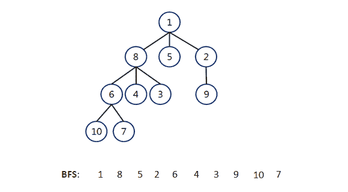
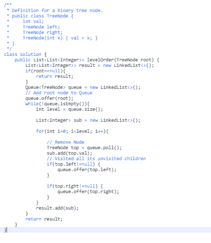
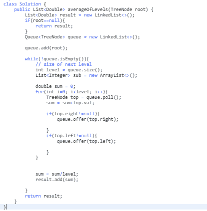
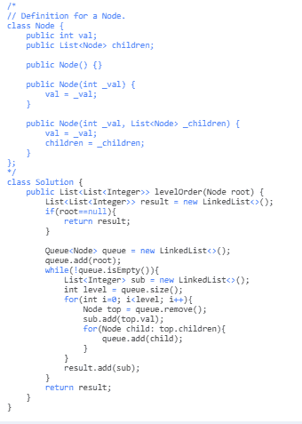

# 广度优先搜索-BFS 图遍历指南，含 3 个 Leetcode 示例

> 原文：<https://www.freecodecamp.org/news/breadth-first-search-a-bfs-graph-traversal-guide-with-3-leetcodeexamples/>

广度优先搜索(BFS)是搜索或遍历树或图数据结构的最流行的算法之一。在本教程中，我们将简要了解 BFS 是如何工作的，并探索一种可用于解决 Leetcode 中一些中等和简单问题的基本模式。

我们开始吧，好吗？

## 什么是广度优先搜索？

所以，我们都知道图是顶点和边的集合:G={V，E}。遍历一个图意味着有序地访问每个顶点和每条边*恰好一次*。

在 BFS，我们需要横向或横向遍历图形。这意味着我们将首先水平移动，并在移动到下一层之前访问当前层的所有节点。

因此，每当我们被要求做一些**级顺序遍历时，**我们可以使用 BFS 技术。

在 BFS，我们将从 1(根节点)开始遍历，并访问它的子节点 8、5 和 2。我们将按照它们被访问的顺序存储它们。这将允许我们首先访问 8 的子节点(即 6、4 和 3)，然后是 5 的子节点(即 null)，然后是 2 的子节点(即 9)，依此类推。

## 履行

为了实现 BFS，使用了一个**队列**数据结构。队列存储该节点并将其标记为“已访问”,直到其所有相邻顶点都被标记。

队列遵循先进先出(FIFO)方法。这意味着节点的邻居将按照它们被插入的顺序被访问。

**BFS 魔咒:**

1.  将节点添加到队列中
2.  移除节点
3.  检索已删除节点的未访问邻居，将它们添加到队列中
4.  只要队列不为空，就重复步骤 1、2 和 3。

现在我们来看一些 Leetcode 问题，并应用我们所学的知识。

### [102。二叉树层次顺序遍历(难度:中等)](https://leetcode.com/problems/binary-tree-level-order-traversal/)

这个问题要求我们遍历这个图，并打印一个链表中每一层的节点。为了解决这个问题，我们需要做的就是使用我们的魔法！

确保你很好地理解了代码，因为这是我们将用来解决多个问题的**基本模板**。所以我们来过一遍。

在上面的代码中，我们首先在队列中插入了根节点。当队列不为空时，我们已经从队列中删除了这个节点，并在队列中插入了它的左右子节点。

但在此之前，我们检查了它的每个子节点是否为空。如果为 null，我们将得到一个空指针异常。

对队列中剩余的下一个元素再次重复该过程。循环 的**被维护，以在单独的链表中给出每一层的节点列表。**

### [637。二叉树的平均等级(难度:容易)](https://leetcode.com/problems/average-of-levels-in-binary-tree/)

这个问题告诉我们，求一个数组中二叉树每一层节点的平均值。这与我们之前的问题遵循相同的程序，只是稍有改动。

如您所见，我们所做的只是复制和粘贴模板代码。然后，我们简单地在 for 循环中放入一个 sum 变量，它可以给出每一层节点值的总和。这是我们将用来计算我们期望的平均值。

### 429。n 元树层次顺序遍历(难度:中等)

每个节点有不超过 N 个孩子的树叫做 N 叉树。

这与遍历二叉树的过程完全相同，只是在这里，我们将一个节点的所有子节点插入到队列中。请记住，在解决与二叉树相关的问题时，我们只在队列中插入了任何给定节点的左右子节点。

仅此而已！我希望这能帮助你更好地理解 BFS，并且你喜欢这个教程。如果你认为这篇文章可能对其他人有用，请推荐它！