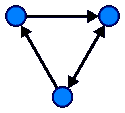
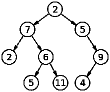
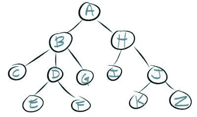
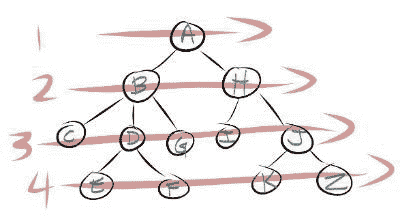
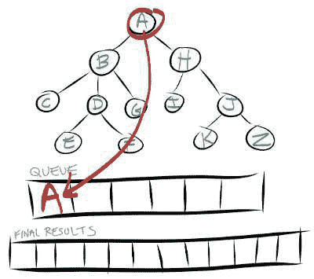
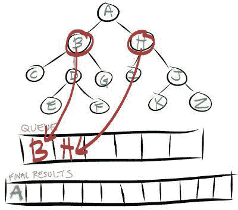
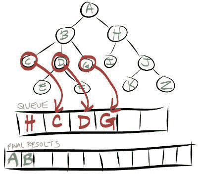

# JavaScript 中的广度优先搜索

> 原文：<https://www.freecodecamp.org/news/breadth-first-search-in-javascript-e655cd824fa4/>

在 JavaScript 编程中，数据可以存储在像图和树这样的数据结构中。从技术上讲，树是图表。

### 图形数据结构

图表是从数学领域发展而来的。它们主要用于描述显示从一个位置到另一个位置的路线的模型。

图由一组节点和一组边组成。边是一对连接的节点。路径是用于描述共享一条边的节点之间的行进的术语。下图显示了一个有 3 个节点和 3 条边的图形。

### 树形数据结构

像图一样，树数据结构是节点的集合。有一个根节点。然后，该节点可以有子节点。子节点可以有自己的子节点，称为孙节点。

重复这一过程，直到所有数据都在树形数据结构中表示出来。下图显示了一个树形数据结构。

树是没有圈的图(圈是图中从同一个顶点开始和结束的路径)。子节点只能有一个父节点。因此，树不是递归的数据结构。

### 为什么要用图和树作为数据结构？

在计算机编程中，树一直被用来定义数据结构。它们也被用作算法解决问题的基础。

图的最常见的实现是寻找两个节点之间的路径，寻找从一个节点到另一个节点的最短路径，以及寻找访问所有节点的最短路径。

旅行推销员问题是使用树算法解决问题的一个很好的例子。

### 搜索数据

现在您已经理解了这两种数据结构之间的区别，我将向您展示如何搜索您的数据。

搜索图或树的两种最常见的方法是深度优先搜索和广度优先搜索。

使用深度优先搜索还是广度优先搜索应该由包含在树或图数据结构中的数据类型决定。

### 横向优先搜索

这是一个我们想要使用广度优先搜索来搜索的树的例子。

在广度优先搜索中，您将从根节点开始。然后，您将从左到右搜索它们的所有子节点。一旦搜索了所有的子节点，就在根节点以下的级别上重复该过程。

这个过程在每一层重复进行，直到到达树的末尾或者到达最初搜索的节点。下图显示了在广度优先搜索中搜索树的顺序。

要实现广度优先搜索，您需要某种方法来跟踪在当前级别完成搜索后，下一步需要搜索哪些节点。

为了跟踪接下来需要搜索的节点，您将使用队列作为搜索的中间步骤。队列是一个 FIFO(先进先出)数组。

为了演示这是如何工作的，让我带你完成上图中 1 级和 2 级的搜索。

要搜索的第一个节点是根节点或节点 A。您应该将节点 A 作为队列中的第一个元素。然后，您将重复这些步骤，直到您的队列为空。

1.  从队列中取出第一个节点，看看它是否与您的搜索项匹配。
2.  将节点的所有子节点添加到临时队列中。

在搜索的第 2 步之后，您的队列现在将包含节点 a 的所有子节点。

我们现在比较节点 B，看它是否与我们的搜索结果匹配。如果没有，则从队列中删除，只留下节点 h。然后，我们将节点 B 的孩子添加到队列中。

这个过程会一直继续，直到搜索完所有节点，或者找到符合搜索条件的节点。

### 更多文章

感谢阅读我的文章。如果你喜欢，请点击下面的拍手图标，这样其他人就会找到这篇文章。以下是我的一些文章，你可能会感兴趣:

[JavaScript 中的实例化模式](https://medium.com/dailyjs/instantiation-patterns-in-javascript-8fdcf69e8f9b)
[为什么公司文化对你的软件工程师生涯很重要](https://medium.com/@ratracegrad/why-company-culture-is-important-to-your-career-as-a-software-engineer-5a590bc44621)
[使用 Node.js & Express.js 将数据保存到 MongoDB 数据库](https://medium.com/@ratracegrad/hitchhikers-guide-to-back-end-development-with-examples-3f97c70e0073)