# 打破软件中的第四堵墙

> 原文：<https://www.freecodecamp.org/news/breaking-the-fourth-wall-in-software-d08a25df34b7/>

亚历克斯·布纳季奇

# 打破软件中的第四堵墙

#### 或者，一切旧的又是新的

[打破第四堵墙](http://www.mentorless.com/2013/06/10/breaking-the-fourth-wall-an-homage-to-a-storytelling-technique/)的现象在戏剧和电影摄影界是众所周知的。所谓的“第四堵墙”的打破通常是由电影中的一个主角突然转向镜头并对观众讲话引起的，因此打破了我们正在目睹现实生活事件的幻觉。

但是打破第四堵墙在软件中是如何工作的呢？

#### 早期的人机界面

第一批计算机又大又贵，而且很挑剔。那时，人类与计算机互动的方式通常是给它一叠穿孔卡片。

#### 早期的界面令人生畏

你显然需要一个大学学位才能操作电脑。

#### 早期的界面很笨重

很多按钮、开关、转盘和控制杆。又吓人又笨重。

#### 突破—正文！

20 世纪 60 年代末至 70 年代初，出现了所谓的计算机终端。模拟打字机输入命令，然后在看起来像电视屏幕的监视器上显示评估文本的结果。

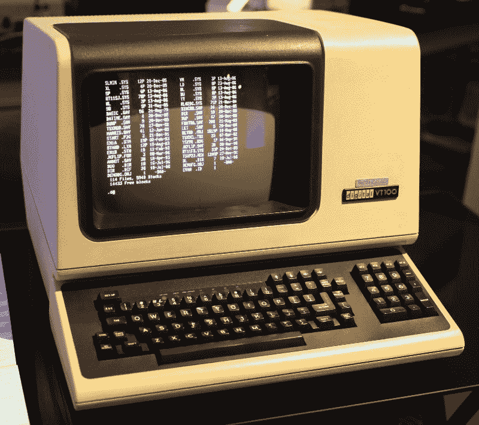

#### 文本是直观的

几乎所有人都觉得文字非常直观——接近我们思考和说话的方式。与转动旋钮、拨动开关、拉动控制杆相比，对着机器说话感觉要自然得多(更不用说打卡或重新布线了)。

#### 但是电脑很笨重

在计算机的早期，如果你输入了错误的命令或者使用了错误的语法，计算机就会大发脾气。喜怒无常的野兽！

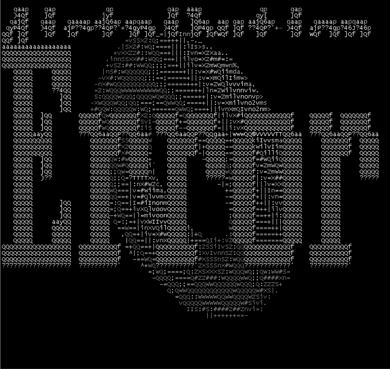

#### 只有这些人知道如何与计算机交流

你可能会在下面的集体照中认出一些面孔。

#### 用图形界面取代文本——桌面隐喻

使用图像来保护人们在操作电脑时不必记忆笨拙的命令和语法。这个想法是向用户展示一些熟悉的场景——例如，他们的桌面。每个人都熟悉这样一个想法:在桌面上放上包含文件的文件夹，在桌子旁边放上垃圾桶等等。

这种图形用户界面(GUI)被认为比文本更直观。

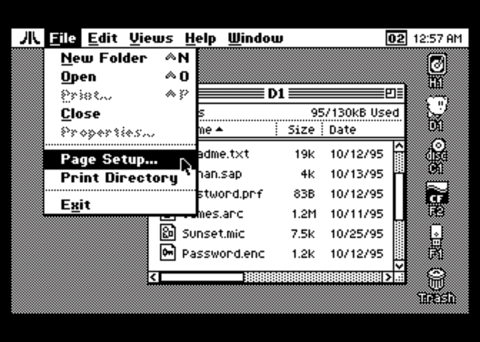

#### 图形用户界面很快发展成一种可怕而不直观的东西

下面的界面如何直观？这就像早期计算机在处理文本时坚持使用的晦涩难懂的语法一样令人沮丧。

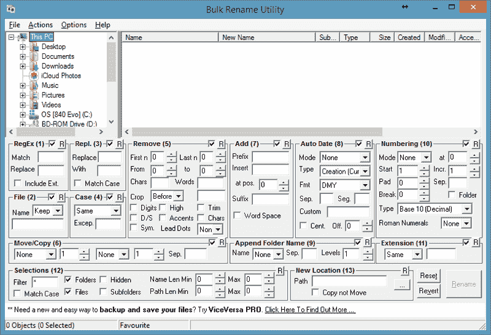

#### 一图胜千言。

没错。但是如果这一千个单词中的大部分都是胡言乱语呢？那有什么价值？

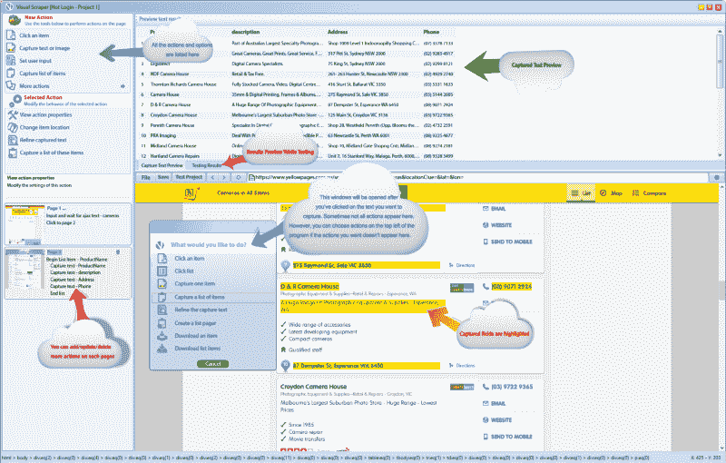

#### 一句话:人们发现图形用户界面令人沮丧

GUI 通常一次给我们提供太多的信息。然后，我们有责任消化所有这些，并试图从中找出道理。

GUI 也倾向于执行“一刀切”的方法，这不是很以用户为中心。

#### 那么解决办法是什么呢？

如果我们不再使用这个由中间图形表示组成的考虑不周的缓冲区，而是再次返回到*纯文本*会怎么样？毕竟，关注和跟随简单的讨论思路比试图浏览复杂、费解的图形用户界面要容易得多。

#### 但是计算机是脆弱的，不会像图形用户界面那样宽容

我们已经变得依赖图形用户界面，就像我们依赖辅助轮一样。安装训练轮给了我们一种安全感——我们不会摔倒，但我们仍能以某种方式前进并到达目的地。

#### 用辅助轮走不远

辅助轮可以在我们的后院四处兜售，但是我们不能在现实生活中有效地使用它们。

#### 如何去掉训练轮，学会正确骑行？

打破第四堵墙！

我们如何打破第四堵墙？别推像素了！

怎样才能停止推像素？

#### 令人沮丧的例子

假设我们在网上订购一些东西。下周，我们可能会想知道我们的订单的状态(由于某种原因，还没有到达)。沮丧之余，我们打开浏览器，去网店，登录，然后尝试导航到*订单状态*页面。

为了到达*订单状态*页面，我们必须在混乱的菜单、变化的布局、糟糕的链接(通常在页面上几乎看不到)等真正的丛林中导航。雪上加霜的是，这些元素不断变化，所以我们不能依赖我们以前导航会话的肌肉记忆。

#### 不那么令人沮丧的例子

如果我们不做上面所有的体操和杂技，而只做下面这些，会怎么样？

转到命令行(比如说在[信使](https://www.messenger.com)或[懈怠](https://slack.com)等。)并输入' *@merchant_name 我的订单情况如何？*'

这样，我们让商家服务(即亚马逊或 Etsy 或易趣等。)替我们跑腿。

两种“检查订单状态”体验中，哪一种更直观？

#### 猜猜看，我们刚刚打破了软件领域的第四堵墙！

通过放弃 GUI，我们已经转而使用纯文本与一些在线服务进行交互。感觉很自然。请注意，通过这样做，我们不需要接受任何培训。

这怎么可能呢？简单——我们没有与裸机计算机互动，而是与一个复杂的聊天机器人取得了联系，它的作用是知道如何分析和解释口语文本。

#### 我们如何参与聊天机器人？

我们*/邀请*它加入我们的频道。例如，假设我们发现有一个专门推荐餐馆的聊天机器人。我们希望与这个机器人取得联系，在找到这个机器人的名字(比如说， *restobot* )后，我们通过键入以下命令来“雇佣”这个机器人为我们工作:

*/invite @restobot*

一旦被邀请到你的频道，这个机器人将会一直在线，注意听它的名字被提到。

#### 机器人是缓冲器

类似于图形用户界面是我们人类用户和冰冷、光秃秃的计算机器之间的缓冲，机器人正在取代图形用户界面成为温暖而模糊的缓冲。机器人通过将我们简单的英语命令翻译成底层计算服务可以理解和处理的东西，使我们免于与喜怒无常的机器打交道。

#### 机器人的价值主张是什么？

机器人 ***关注人类需求*** 和 ***对人类脆弱*** 敏感。

#### 那么这是一个革命性的变化吗？

不完全是。这是我们在人机交互领域取得进步的自然结果。所以这更像是一种进化的变化。

实际上，这种基于对话的界面与通过图形用户界面操作计算机没有什么不同。因为，如果我们更仔细地研究典型 GUI 处理的表面背后发生了什么，我们会发现下面的场景:

*   一个用户想让计算机做一些事情
*   用户进入显示一个或多个*输入字段*的屏幕/页面
*   这些输入字段，有时被称为*文本框*，接受来自用户的文本
*   GUI 然后监听用户的手势，例如“发送”或“提交”手势
*   一旦发出预期手势信号的事件发生，图形用户界面就会将 ***文本*** 发送到底层服务器

#### GUI 也是文本驱动的

类似于机器人如何操作，GUI 也拥有如何从用户那里收集文本的知识，然后使用后端计算机可以理解的严格语法来制定收集的值。

那么如果是这样的话，像素在哪里发挥作用呢？

很多时候，像素都是被当做*装饰*的。他们通常在屏幕或网页上涂上糖衣，给它披上一件用户更熟悉的外衣。例如，将 web 表单打扮成看起来类似于纸质表单。

这样做可以减轻用户在尝试使用计算机时的紧张感。这样做的目的是消除交互的神秘性，让它看起来像人们在处理各种非虚拟服务时可能遇到的日常交互。

#### 去掉像素化的装饰，我们还剩下什么？

一个词——*microcopy*。

什么是 *microcopy* ？

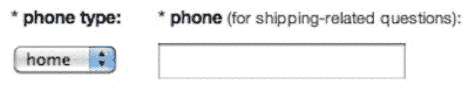

在上面的例子中， *microcopy* 是放置在 GUI 控件旁边的任何文本。在 GUI 表单中，我们可能会要求用户输入他们的电话号码。很多时候，人们不确定他们是否想这么做，我们为什么需要他们的个人信息？因此，我们在括号中放置一个简单直接的句子，就在要求电话号码的标题旁边，解释这个请求的目的。例如，“我们需要您的电话号码来咨询与运输相关的问题”。

或者，我们可以提供稍微详细一点的 *microcopy* ，如下例所示:

#### 对话线索

如果我们想象去掉所有的像素和图形用户界面，我们剩下的是一个简单的*对话线程*，它在用户和计算机之间被记录下来。

#### 对话式界面的优点是什么？

*   直觉的
*   对人类的弱点敏感(如果最初没有清楚理解，机器人会试图澄清人类的请求)
*   熟悉(每个人都已经完全习惯与家人/朋友/同事聊天)
*   跨所有设备的一致体验(不受任何布局、字体、颜色等相关问题的影响。)
*   保证用户对对话的完全所有权—完全个性化的讨论主题将被永久记录并归用户所有(完全透明、完全审计)

#### 会话式商务

随着我们进入后 web 2.0 时代，普遍的口号“内容为王”现在变成了“商业为王”。在 web 2.0 世界中，当用户通过 GUI 完成交易时，用户和在线服务之间发生的所有步骤可能已经被后端服务记录，但是对用户是不透明的。在*对话式商务*的世界中，用户和在线服务之间发生的每一步都被记录在对话线程中，并完全归用户所有。

#### 对话式界面体验类似于常规的客户支持体验

就像在 web 2.0 和移动应用出现之前，拨打 1–800 电话是主流的客户支持渠道一样，我们正在回归到与客户支持直接对话。只是这一次，我们不是被无限期地扣留，被迫听可怕的音乐，而是与机器人交谈，这些机器人总是开着，比人类劳动力更快、更准确、更详细。

与 1–800 情景一样，如果我们的呼叫由于某种原因无法以令人满意的方式解决，我们可以很容易地*升级*。在旧制度下，我们会要求客户服务代表与他们的主管交谈，而在新制度下，我们会要求机器人代理让我们与人工操作员联系。

#### 现在让我们创建自己的机器人吧！

也许抓住这种从图形到基于文本的用户界面的转变的最好方法是卷起袖子从头开始创建一个机器人。创建一个机器人非常容易，因为构建机器人所需的工具已经基本商品化。尽管如此，我觉得仅仅创造一个机器人并不能有效地证明对话式商务的重要性。这就是为什么我提议我们在这里不仅要学习如何创建一个机器人，还要学习如何创建一个能够为我们做一些有用的事情的机器人。

例如，让我们创建一个机器人，通过使用纯文本作为用户界面来帮助我们联系一些电子商务服务。

#### 首先创建在线商务服务

为了简洁起见，让我们创建一个简单的电子商务站点来存放产品清单。那些产品将被出售，并且一些出售的产品也将以折扣价出售。

我们将使用最先进的 web 开发框架( [Ruby on Rails](http://rubyonrails.org) )来构建这项服务。如果您没有安装 Rails 框架，请参考 Rails 站点，了解如何在您的计算机上安装它。

安装完成后，我们使用 Rails 创建一个新站点。打开终端并键入:

> rails 新网站名称

Rails 将为您创建新项目，一旦您导航到新项目(通过键入 *cd your_site_name* )，您就准备好创建将在新站点上托管的产品清单了。我们将创建一个名为 Product 的资源，然后为它分配几个属性:

> rails 生成脚手架产品名称:字符串价格:小数 on _ 特殊:布尔折扣 _ 百分比:整数描述:文本

上面的命令将创建名为 Product 的资源，并将实现产品属性，如产品名称、价格、是否特价以及折扣百分比。

现在是时候创建一个存储产品库存的数据库了。我们通过使用前一个命令创建的规范来实现这一点。创建和安装*产品数据库*的命令如下:

> rake 数据库:迁移

剩下要做的唯一一件事就是启动服务器，并验证我们刚刚创建的网站是否按预期工作:

> 铁轨 s

#### 维护产品库存

既然我们已经创建了我们的产品数据库和网站，我们应该导航到它并添加一些产品。打开网络浏览器，导航到*http://localhost:3000/products*URL。

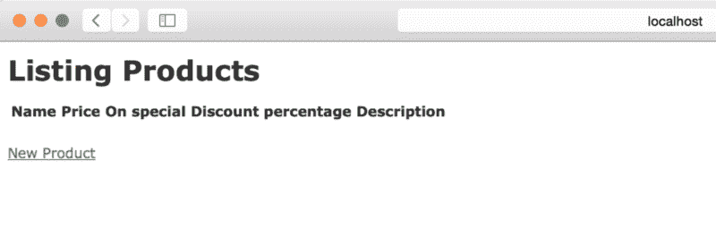

当然，产品库存页面将是空的，因为我们还没有添加任何产品。让我们点击“新产品”链接。

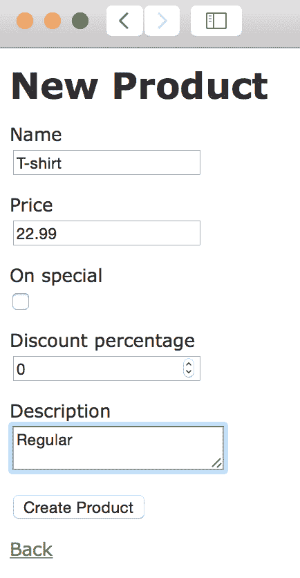

输入一些值后，我们单击“Create Product”按钮，该产品现已添加到库存中。让我们再输入一些产品(记得点击其中一些产品的“特价”复选框)。

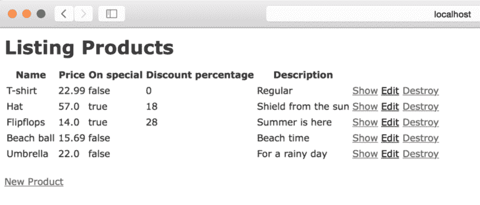

现在我们的库存中已经有了几个产品，是时候构建一个对话式商业机器人了。那个机器人有什么用处？为了简单起见，我们将赋予这个机器人回答询问特价商品的文本命令的能力。

#### 我们的机器人会住在哪里？

机器人必须能够监听来自用户的文本消息，实现这一点的最佳方式是将机器人添加到某个消息平台。目前，添加机器人最有吸引力的消息平台是 [Slack](https://slack.com) ，因此我们将使用它来演示如何构建对话式商务。

注册 Slack(如果您还不是会员)，然后转到:

> [https://yourteam.slack.com/services/new/bot](https://yourteam..slack.com/services/new/bot)

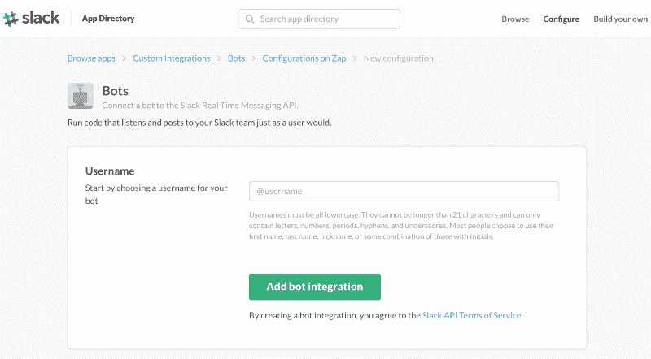

您将被要求指定您的机器人的名称。让我们称我们的机器人为“gofer”。

单击“添加机器人集成”按钮后，我们将能够在 Slack 上设置我们的 gofer。首先，让我们选择代表我们机器人的图标。我选择了我最喜欢的机器人，本德。

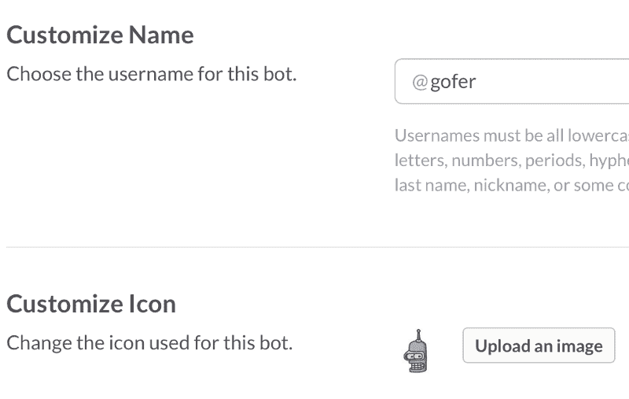

我们还可以添加 bot 的名字和姓氏，以及概述 bot 功能的描述。

保存集成后，我们注意到 API 令牌；这个令牌非常重要，因为它允许我们手工制作的 bot 和 Slack 平台之间的集成。让我们复制该 API 令牌的值以供将来参考。

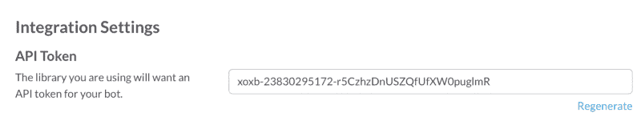

#### 最后一步——制作我们的机器人

现在是时候开放我们的电子商务产品库存网站的源代码了。我们必须将 bot 添加到这个站点，因为 bot 将能够利用我们的库存站点内置的服务，并回答来自 Slack 用户的问题。

我们需要做的第一件事是导航到我们的*产品库存*站点中的*配置*文件夹，并创建一个新文件。该文件将包含 Slack API 令牌。我们可以给这个文件起任何我们想要的名字；我更喜欢保持它的名字简单，所以我叫它 *api.rb* 。该文件将只包含一行代码:

> ENV[' SLACK _ API _ TOKEN ']= ' xox b-23830295172-r5 czhzdnuszqfuxwmr '

接下来，我们需要告诉 Rails 框架在初始化阶段加载 API 令牌。我们打开 *config/environment.rb* 文件，添加以下两行代码:

> api = File.join(Rails.root，' api.rb')
> 如果 File .存在就加载(api)？(api)

既然我们已经声明了 Slack API 令牌并指示 Rails 加载它，我们需要将我们的 bot 添加到项目中。最好的方法是导航到 *app* 文件夹，创建一个新文件夹，简单地命名为*机器人*。

在 *app/bots* 文件夹中创建一个新文件，并将其命名为 *real_time_messaging.rb.* 这个文件将处理我们的机器人用来监听传入消息的线程。将这几行添加到文件中，并保存它:

> $:.unshift File.dirname(__FILE__)

> Thread.abort_on_exception = true

> thread . new do
> gofer . run
> end

你可能已经注意到在上面的文件中我们提到了*Gofer*；我们提到了我们还没有创建的机器人，从而超越了我们自己。但是没关系，因为我们还没有准备好启动 bot 服务来监听频道。

所以现在真正的挑战是如何制造我们的机器人 Gofer。为了简洁起见，我们将通过利用名为 [Slack Ruby Bot](https://github.com/dblock/slack-ruby-bot) 的商品服务进行欺骗。利用这种商品可以让我们节省时间，否则这些时间会花在编写低级 web 套接字处理代码上，这是一项相当复杂的工作。

利用该商品的最快方法是打开项目根目录中的 *Gemfile* ，并向其中添加以下代码行:

> 宝石'松弛红宝石机器人'

保存文件，然后转到项目根目录下的命令行并运行:

> 捆绑安装

当安装完成时，will 将在我们的 Slack Ruby Bot 商品服务中烘焙，我们将在创建我们的 *Gofer* bot 时利用它。

但是在我们开始制作机器人逻辑之前，我们需要完成与 Slack 机器人正常工作所需的底层管道相关的另一个步骤。导航到*config/initializer*文件夹，创建一个名为 *bot.rb* 的新文件。这是一个简单的文件，只包含一行代码:

> 需要 File.join(Rails.root，' app/bots/real_time_messaging ')

它只是指示 Rails 在初始化时加载 *real_time_messaging.rb* 文件。如果我们回顾一下 *real_time_messaging.rb* 文件的内容，我们会发现，一旦网站启动，它也会运行一个负责运行 *Gofer* bot 的线程。

最后，创建机器人逻辑！在 *app/bots* 文件夹下新建一个文件，命名为 *gofer.rb* 。这个文件将声明 *Gofer* bot 继承了我们刚刚安装的商品的功能— *SlackRubyBot::Bot* 。

> 类 Gofer< SlackRubyBot::Bot

这个机器人继承了 *SlackRubyBot，*的一些基本功能，比如响应命令的能力。这些命令就是我们将要教给这个机器人的，告诉它如何对收到的每个命令做出反应。

让我们从非常简单的事情开始——让我们教我们的 *Gofer* bot 如何处理“help”命令。将以下命令定义添加到 *gofer.rb* 文件中:

> 命令' help' do |bot，thread |
> bot . say(channel:thread . channel，text:“帮助马上就到。”)
> 结束

这个命令将使用机器人来显示文本“帮助正在路上。”向他们求助的渠道。

保存文件，进入命令行并启动服务器( *rails s* )。现在，当服务器启动时，您会注意到命令行上的附加消息:

既然我们的 bot *Gofer* 已经成功连接到我们的 Slack 团队，我们就可以测试它了。去你的 Slack 团队，你会看到 *gofer* bot 在线(它的名字旁边有一个绿色信号灯)。单击其名称，然后键入“帮助”。你会看到机器人立即用我们上面给它的文本作出回应。

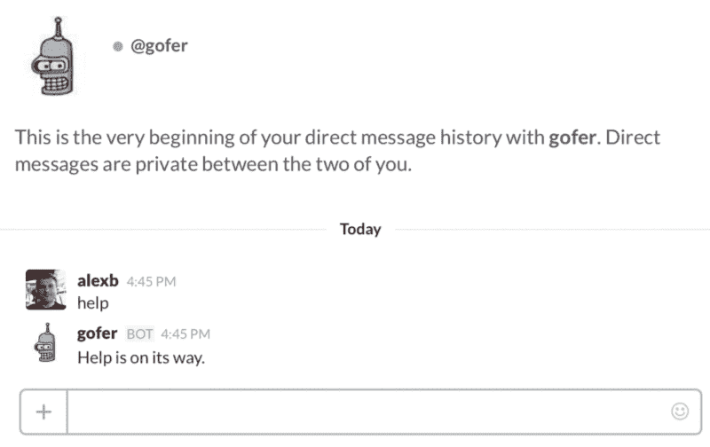

好，很好，现在我们看到我们的机器人正在工作。但是我们如何让它告诉我们现在有什么产品特价出售呢？简单——我们只需添加一个新命令(为了简单起见，我们称之为“promo ”),并指示机器人收集打折产品的信息，然后将列表发送给我们。

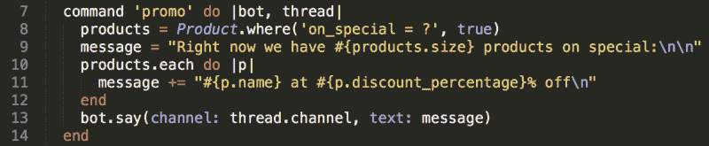

保存文件，重启服务器，然后翻到 Slack，问 gofer 有什么特别节目。

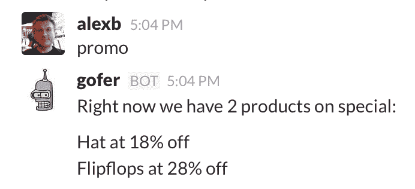

只是为了验证机器人确实在实时工作，去产品库存做一些修改。比如说，取消帽子的折扣，也许增加一些其他产品的折扣。之后，你这样做，并问 gofer 什么是推广，它会告诉你所有最新的细节。

#### 结论

最新趋势显示，越来越多的人倾向于把大部分上网时间花在聊天上。截至 2016 年初，几乎有 10 亿活跃用户在 Messenger 和其他聊天应用上花费时间。随着人们越来越熟悉与朋友、家人和同事发短信，他们也慢慢适应了与机器人聊天。这种体验提供了一种更直观的方式来完成工作，所有迹象表明，这种与计算机交互的新方式似乎是大多数人更喜欢的。

我们试图通过指导读者如何创建他们自己的机器人来说明这种转变是如何进行的。一旦第一个试用机器人被创建，我们意识到天空是极限——这些机器人可以做这么多有用的事情，所以让我们开始破解吧！

#### 更新

我被红色学院邀请去做关于对话式商务和机器人“革命”的演讲。这段对话被录了下来，可以在下面看到:

*好奇？想了解更多关于机器人革命的信息吗？在这里阅读更详细的解释:*

[如何构建有状态的 Bot](https://medium.com/bots-for-business/how-to-build-a-stateful-bot-a2703ff2d57b#.szcp08ze5)
自助时代即将结束
[只有没有 Ux 才是好的 UX](https://medium.com/bots-for-business/https-medium-com-alexbunardzic-only-no-ux-is-good-ux-c24a7cbd12f4#.aqpbs89oj)
[停止构建蹩脚的 Bot！](https://medium.com/bots-for-business/stop-building-lame-bots-b093dcd5f28b#.c3k9kcprv)
[四类 bot](https://chatbotsmagazine.com/four-types-of-bots-432501e79a2f#.9tuz1winx)
[对话式界面有没有不好的一面？](https://chatbotsmagazine.com/is-there-a-downside-to-conversational-interfaces-55bed7220c2f#.l43a0r4j4)
[机器人只是一时的流行吗？GUI 真的优越吗？](https://medium.com/@alexbunardzic/are-bots-just-a-fad-are-guis-really-superior-a1f52007d2b9#.a7zvp7kx2)
[如何设计一个 Bot 协议](https://medium.freecodecamp.com/how-to-design-a-bot-protocol-4b7584fc8d2c#.3d7xy2g5v)
[Bot 是反 app](https://medium.com/bots-for-business/bots-are-the-anti-apps-869639cfa179#.gf5x3rw22)
[Bot 需要多少 NLP？](https://medium.com/bots-for-business/how-much-nlp-do-bots-need-a9fd55d64094#.9r83gcpve)
[屏幕是用来消费的，不是用来互动的](https://medium.com/bots-for-business/screens-are-for-consumption-not-for-interaction-6151fb8db6d7#.4qh22p38n)