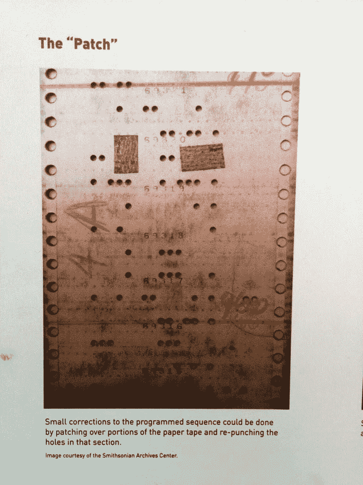

# 浏览器安全和死亡线

> 原文：<https://www.freecodecamp.org/news/browser-security-and-the-line-of-death-7e50a2742a76/>

这里有三个值得你花时间的链接:

1.  浏览器安全和死亡线( [5 分钟阅读](http://bit.ly/2iZ7rG0)
2.  利用蔡加尼克效应学习更快地编码( [4 分钟阅读](http://bit.ly/2jgUoAE))
3.  一名安全研究员发现了一种通过麦当劳的 wifi 登录屏幕窃取密码的方法( [3 分钟读取](http://bit.ly/2iE4YD0)

### 想到这一天:

> “外行黑系统，内行黑人。”—布鲁斯·施奈尔

### 每日一图:

以下是术语“修补”程序的来源:

编码快乐！

–昆西·拉森，自由代码营的老师