# 浏览器历史的未来

> 原文：<https://www.freecodecamp.org/news/browserhistory-2abad38022b1/>

一个小岛

# 浏览器历史的未来

我对浏览器历史的现状真的很不满意。我认为这是每个现代网络浏览器最被低估的特性。我们以[最流行的浏览器](http://www.w3schools.com/browsers/browsers_stats.asp)为例。

在我们谈论浏览器的历史之前，我们需要了解我们现在倾向于如何浏览。

有时我想知道如何将 1 英尺换算成厘米。

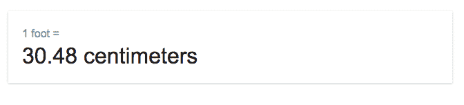

另一方面，有时候我想知道事情发生的原因和方式。

对于第二种搜索，标准的匹配检索模式并不能真正解决问题。

#### 问题

我可以在谷歌中搜索这个词，但我不会得到一个回答我问题的结果。相反，我会得到很多结果，所有这些结果都包含一些与我相关的信息。

然后，我将通过互联网进行探索，沿途收集大量标签。有些标签是无用的，所以我关闭了它们。

其中一些标签是相关的，会有二十多个链接，所以我把它们都打开，这样我就可以继续爬行了。

Tabs, tabs, tabs

过了一会儿，我的脑海中出现了一大堆我浏览过的网页，答案或多或少是完整的。

但是如果我以后再想重温这个，那是不可能的。我能记得我找到了什么，但这不是一个线性进展，因此我的浏览器历史是无用的。

尽管生活在一个数据驱动的社会，随着越来越多的数据库上线，可供发现的复杂多样的信息取决于我们的搜索能力。

在形式上，我们已经从 [**经典检索模型**](https://en.wikipedia.org/wiki/Standard_Boolean_model) ，过渡到了所谓的 [**Berrypicking 搜索**](https://en.wikipedia.org/wiki/Cognitive_models_of_information_retrieval#Berrypicking) 。

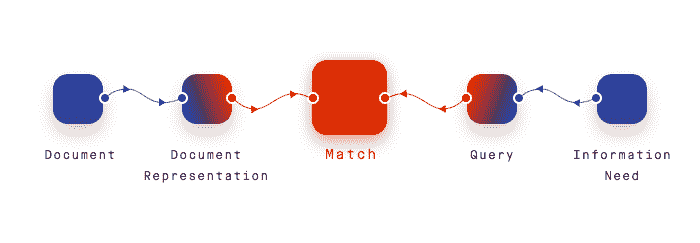

Classic Retrieval Model

查询不是通过单个最终检索集来满足的，而是通过在不断修改的搜索的每个阶段对单个参考和信息位的一系列选择来满足的。

换句话说，我们通常不去搜索能给出单一答案的东西，而是先搜索术语，然后在互联网上探索，当我们阅读搜索开始时的标签网络时，将答案的片段连接起来。

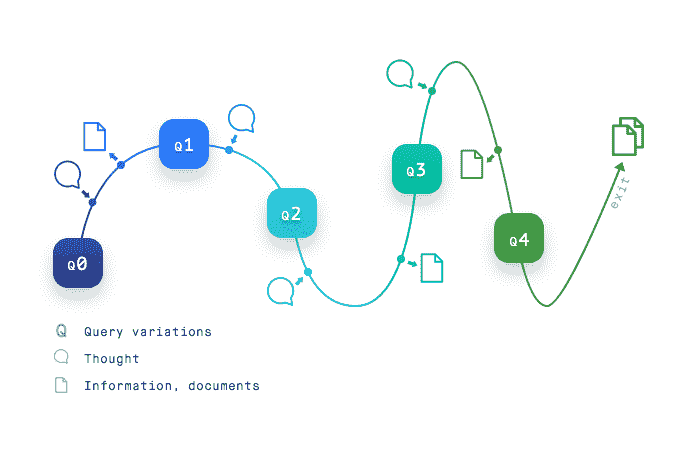

Berrypicking Search

我们的搜索需求，进而我们的浏览器历史，不再能被单一的查询所满足。我们浏览各种来源，每一条新信息都给我们新的想法和方向。在我们不知道的情况下，我们的搜索查询是不断波动的。

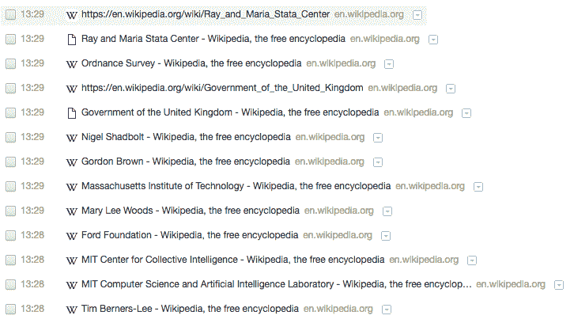

Current Google Chrome History

不幸的是，我们目前寻找未加书签的网页的解决方案是通过不同的链接追溯自己的步骤。

它要求用户有足够的信息，通过识别标题、模糊的 URL 或时间戳，从所有其他页面中辨认出想要的页面。

我们浏览器的历史应该反映我们在互联网上的行为，并帮助我们理解其背后的过程。真正理解和质疑我们使用互联网的方式是至关重要的，如果没有合适的工具，这是不可能的。

#### 解决办法

我在地图中寻找答案。

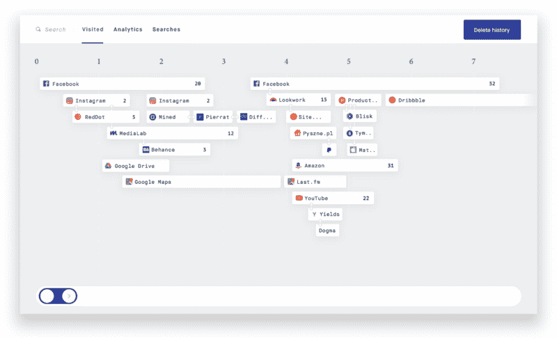

Main Page

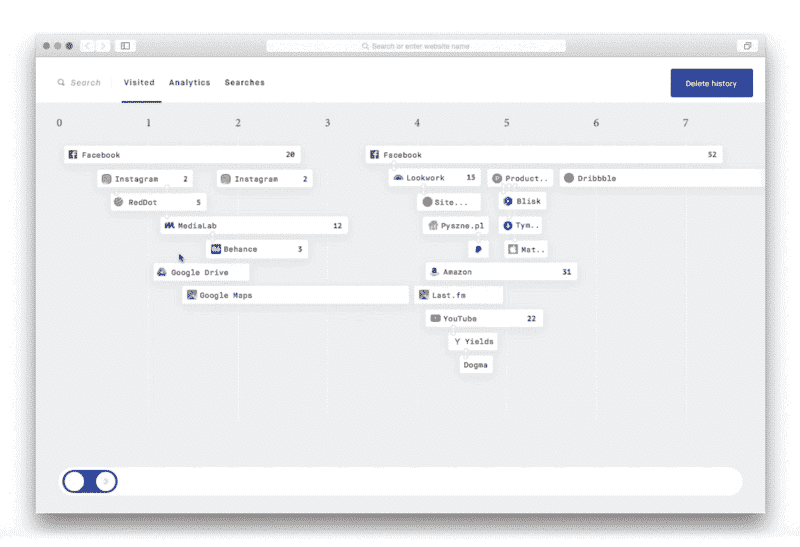

:hover

在顶部有一个时间轴，位置仍然按时间顺序显示，但用户也可以看到连接。

这不仅是浏览我们自己的内容的一种不同的方法，现在还可以看到我的搜索查询和行为的模式。这样，我们的浏览器历史不仅执行一个检索功能，而且还写一个叙述。

当我从一个德克萨斯烧烤问题开始时，我终于明白了为什么我最终会读到植物对土壤性质的影响。

用这种方法，我可以一眼看出不同的信息是如何联系在一起的，它们是如何相互联系的，以及我是如何得出结论的。我看到我实际上是如何认知相关事物的。它不仅关乎目标，也关乎旅程。

在提议的界面中，通过一个简单的悬停动作，我就可以获得重要的信息。我能够理解我的思维过程和兴趣点。由于特殊的配色方案和元部分，更容易记住页面。

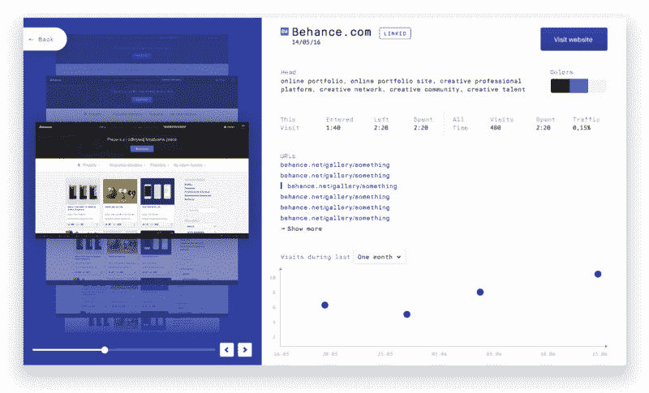

Single page

假设我已经找到了我要找的东西，并且我对我的信息检索过程很满意。

我访问过这个网站多少次？我用了多少时间？我什么时候看到有趣的东西了？我多久去一次？从特定页面的角度来看，我生成的流量看起来如何？

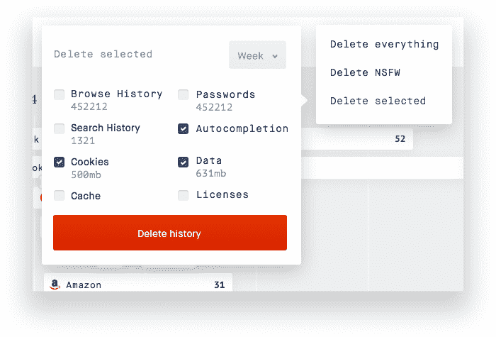

Delete dropdown

他们告诉[永远不要相信一个没有历史的人](https://twitter.com/davidwalshblog/status/535608920908115968)。

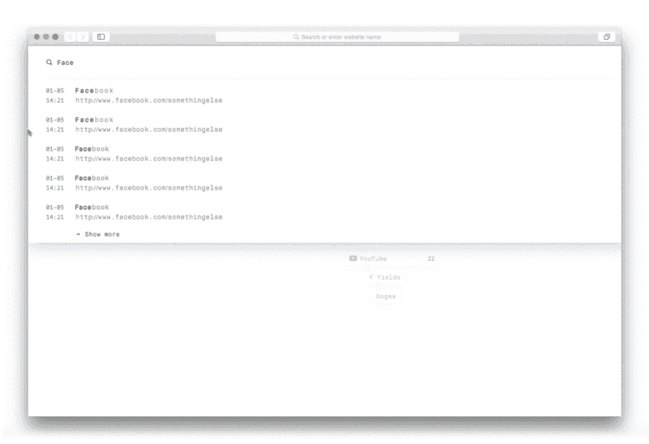

Search

谷歌是最好的搜索引擎之一，然而，在浏览器的历史上，甚至没有一个自动提示的位置。怎么会这样

我喜欢按主题、日期、颜色来搜索。

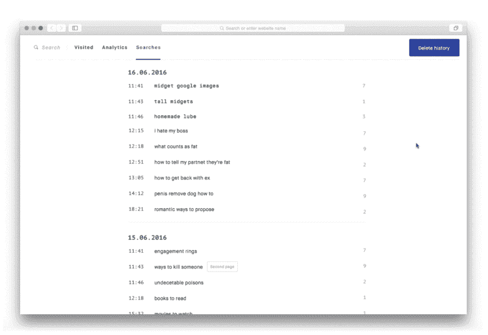

Searches

为了重新创建我们的体验，或者只是为了查看我们感兴趣的全部主题，向用户提供过去搜索的列表将是有用的。一旦你点击了一个特定的搜索结果，它就会根据这个查询展开访问过的链接，并把你重定向到带有高亮路径的地图。

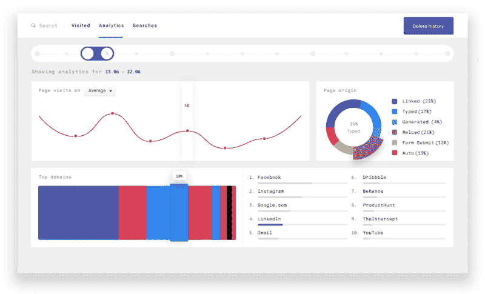

Analytics

目前，我真的很想念分析屏幕。能够理解自己的行为是至关重要的，尤其是当线下和线上不再有区别的时候。 [**过滤气泡**](https://en.wikipedia.org/wiki/Filter_bubble) 表明我们看到的信息是有选择性的。

我们与和我们观点不一致的信息分离了。结果，我们在自己的领域里越来越感到安慰。我们已经停止质疑了。

我想看看我花了多少时间浏览互联网，我如何收集信息，我如何形成我的观点。

在我们生活的时代，理解你的浏览器行为和搜索模式在认知过程中变得至关重要。

我想，如果你唯一的工具是一把锤子，那么把一切都当成钉子是很有诱惑力的。

*参考书目及启示:*

[1](http://theory.isthereason.com/?p=1790)T2 2T4 3

*如果您愿意合作，请随时[写信给](mailto:patryk.adas@gmail.com)。*