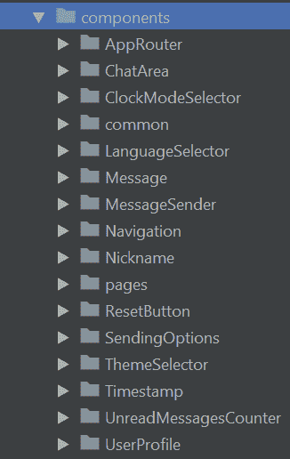
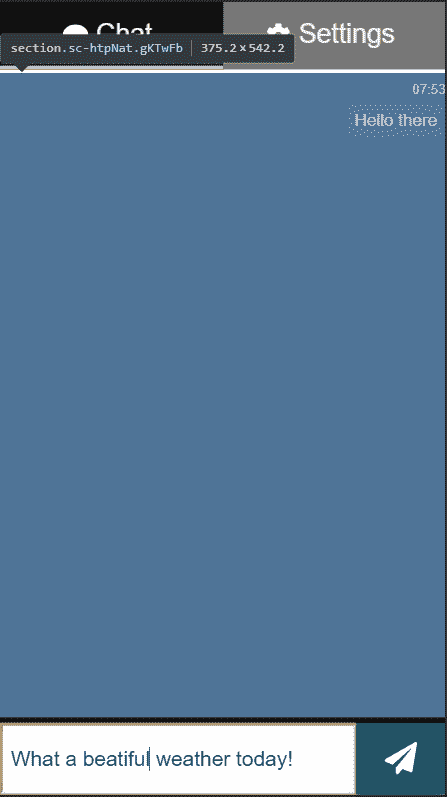
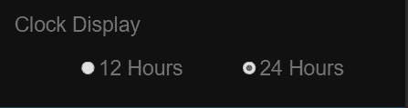
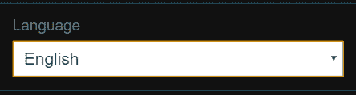
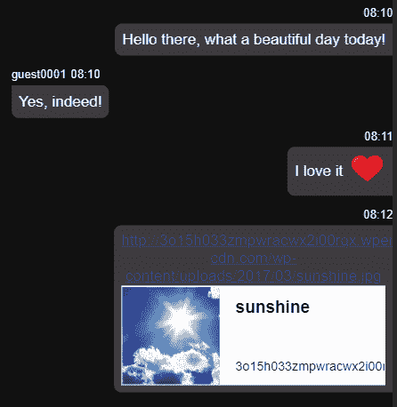
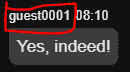
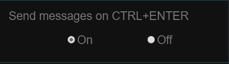
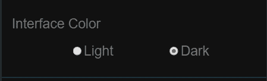
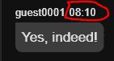
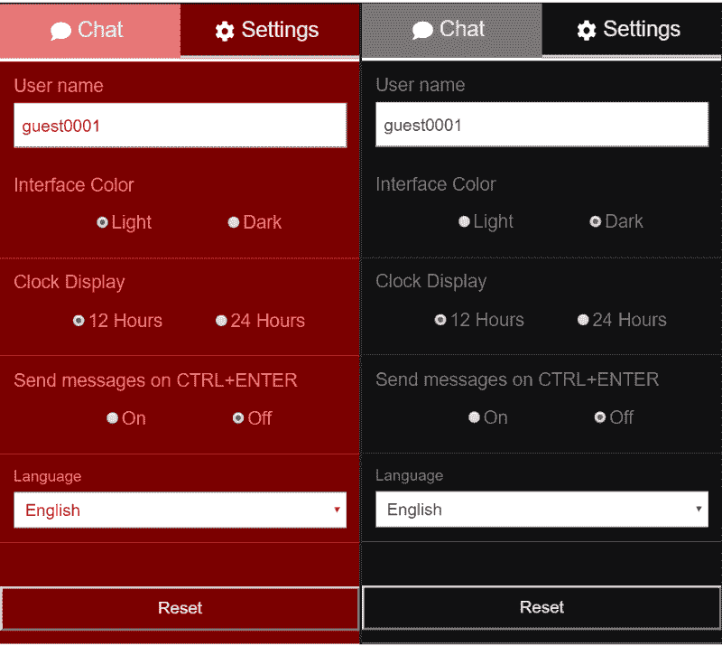

# 用 React、TypeScript 和 Socket.io 搭建一个聊天 app

> 原文：<https://www.freecodecamp.org/news/build-a-chat-app-with-react-typescript-and-socket-io-d7e1192d288/>

这将是使用 React、TypeScript 和 Socket.io 构建单页面聊天应用程序的一步一步的完整指南。

如果你想跳过阅读，[这里](https://github.com/mihailgaberov/chat)？是 GitHub 仓库里有详细的[自述](https://github.com/mihailgaberov/chat/blob/master/README.md)，而[在这里你](https://mihails-chat.herokuapp.com/#/chat)可以查看现场演示。为了玩它，你需要在两个不同的浏览器(或浏览器标签)或设备(你可以使用你的电脑和智能手机)中打开它，并相互聊天。

### 研究

当您要开始一个新项目时，对您计划使用的技术堆栈进行初步研究是一个很好的做法。

换句话说，你可能希望或需要——尤其是如果你以前没有这方面的经验——对你将要使用的每项技术进行调查。我建议分开做。选择其中一个，创建一个你可以玩的小程序。

如果你需要检查两种或更多种技术的集成在实际项目中是如何工作的，那么你可能希望将它们一起包含在你的“*研究-测试-游戏*”应用程序中，但最好一次做一个研究。

#### 说到点子上

当我开始考虑做这个[聊天应用](http://mihails-chat.herokuapp.com/#/chat)的时候，我完全按照我上面描述的做了。我最近没有使用过 [TypeScript](http://www.typescriptlang.org/) 的经验，也没有使用过 [Socket.io](https://socket.io/) 的经验，所以我必须看看这些，让自己熟悉一下它们的现状。由于我的计划是使用 [React](https://reactjs.org/) 作为主 UI 库，我需要看看它如何与等式中的其他人一起工作。我照做了。

我用这些技术创建了两个小应用程序(这里是 repos [这里是](https://github.com/mihailgaberov/playing-with-socketio)和[这里是](https://github.com/mihailgaberov/react-contextapi-with-typescript)，只是为了能够使用它们，并学习如何在我未来的聊天应用程序中使用它们。

在我的初步研究完成后，我能够开始思考和规划我的主要聊天应用程序的实现。


Photo by [Hutomo Abrianto](https://unsplash.com/photos/3TRdlKU-3II?utm_source=unsplash&utm_medium=referral&utm_content=creditCopyText) on [Unsplash](https://unsplash.com/search/photos/research-done?utm_source=unsplash&utm_medium=referral&utm_content=creditCopyText)

### 高层规划

通常人们说"*高水平计划"*的意思是他们正在寻找*的大图景*。这意味着我们需要创建一个粗略的执行计划，并定义我们的主要支柱，但不要太详细。现在，当我们清楚地知道该做什么时，让我们开始做吧！？

注意:从现在开始，我将假设你正在按照我描述的步骤进行，因此我将用第二人称来写。？

#### 技术堆栈

我们已经提到了我们将使用的主要技术，但是让我们在这里定义所有这些技术的适当列表:

*   [使用 TypeScript](https://github.com/Microsoft/TypeScript-React-Starter#create-our-new-project)(`create-react-app my-app --scripts-version=react-scripts-ts`)——一个 UI 库，我们将使用它来构建我们的应用程序的用户界面。
*   一个状态管理库，我们将使用它来管理我们的应用程序的状态。
*   [Express.js](https://expressjs.com/) — Node.js web 应用程序框架我们将使用它来创建我们的应用程序中需要的 [http 服务器](https://expressjs.com/en/starter/hello-world.html)，以便利用 Socket.io 引擎。
*   Socket.io —一个用于实时网络应用的 JavaScript 库。它支持 web 客户端和服务器之间的实时双向通信。我们将使用它在我们的应用程序中实现一个简单的聊天行为。
*   这是一个小库，我们将使用它来为我们的应用程序添加样式，并使外观和感觉都很漂亮。它利用带标签的模板文本来设计组件的样式，并删除组件和样式之间的映射。这意味着当您定义您的样式时，您实际上是在创建一个普通的 React 组件，它将您的样式附加到它上面。
*   Jest / [Enzyme](https://airbnb.io/enzyme/) —一个 JavaScript 测试框架和一个 JavaScript 测试实用程序，我们将用它来为我们的应用程序编写单元测试。两者都与 React 生态系统有很好的集成，并在实际项目中大量使用。

#### 应用功能

在这一节中，我们将描述我们的应用程序的特性。

每当我们计划一个新的项目时，我们必须定义某些标准，这些标准将描述当达到时的完成程度。

换句话说，我们需要设定一个极限点，一旦达到这个点，就表明我们的项目已经完成，或者至少是第一个版本。有一句名言，可以用来形容“永无止境”的项目:

> “今天的好计划胜过明天的完美计划。或者我们可以说，今天的工作项目比明天的完美项目更好。

以下是我最初想要实现的特性列表:

#### **表头**

*   聊天选项卡—当收到新消息时闪烁，直到它被阅读，或者当用户在设置页面上时
*   设置选项卡
*   未读邮件计数器
*   字体超赞图标

#### **聊天页面**

*   聊天区(包括左对齐和右对齐的消息)
*   消息(文本、日期时间、左侧或右侧，取决于是接收还是发送)
*   仅显示发件人的昵称
*   消息发送者—输入字段和按钮。单击按钮时，输入被清除并聚焦
*   用 CTRL+ENTER 发送消息
*   当聊天区域不足以显示所有消息时，自动滚动到底部

#### **设置页面**

*   UserProfile 组件—可以更改用户名
*   界面颜色组件—更改应用程序的颜色主题
*   时钟显示组件—更改时间模式 12 小时或 24 小时，与每条消息一起显示
*   使用 Ctrl+Enter-开/关发送消息
*   LanguageSwitcher —下拉菜单允许更改应用程序的语言(目前支持英语和德语)
*   重置按钮—重置存储到本地存储的所有设置

在我写这篇文章的时候，还有一些我想实现的特性。以下是我已经做的或计划在未来做的所有改进的列表(带有拇指表情符号的已经实现):

*   添加视频聊天功能。
*   ？增加了选择 12 小时模式时的 AM/PM 时间格式。
*   ？增加了默认情况下通过回车键发送消息的可能性。如果使用 CTRL+ENTER 发送消息的设置是打开的，那么这将是唯一的方式(当然除了通过鼠标/触摸)。
*   ？针对 iDevices(媒体查询)进行了优化。
*   ？修复聊天选项卡闪烁/活动类问题—与 React 路由器无法正确重新呈现连接的组件相关 h[ttps://github . com/React training/React-Router/blob/master/packages/React-Router/docs/guides/blocked-updates . MD](https://github.com/ReactTraining/react-router/blob/master/packages/react-router/docs/guides/blocked-updates.md)
*   ？发送新消息时清除输入字段。
*   ？当新消息超出可用空间时，自动滚动到主聊天区底部。
*   ？防止“重复消息”(或当连接更多客户端时多个消息重复)。
*   ？为 react 组件添加单元测试。
*   为 redux 添加单元测试——reducer、store、action creators。
*   ？添加媒体响应查询—在更多设备上进行测试和调整。
*   ？向 Heroku 添加演示。
*   ？在 README 中添加好的操作方法。
*   为消息添加动画。
*   添加声音(带有在设置中打开/关闭的选项)。
*   添加更多的颜色主题。
*   添加欢迎消息(当新用户连接时广播)。
*   ？添加图标(使用牛逼字体)。
*   所有对话的历史。
*   当套接字的连接状态改变时处理案例(视觉上)。
*   出现套接字错误时处理 case。
*   当输入了一个很长的单词(没有空格)并且超出了消息的背景颜色时，处理大小写。
*   ？表情支持——比如:D，:，P，)；), ?、❤️等。
*   ？链接解析器 Youtube 链接(应显示嵌入的视频)，链接到图像(应显示嵌入的图像)，所有其他链接应显示为锚点。

当我们知道最初的计划和我们需要满足的需求时，我们就可以进行高层次的分析。我们的应用程序将有两个页面，聊天和设置，可通过选项卡控制。

聊天页面将包含主聊天区域，其中包含发送消息所需的控件(输入字段和一个按钮)。

设置页面将包含一些用于选择上述选项的控件。

考虑到这一点，我们可以进入下一部分，在实际实施之前，我们将创建一个更详细的计划。

### 更详细的规划

在这一节中，我们需要更深入地了解我们的应用程序，并定义它的构建模块。由于我们将使用 React，并且我们知道在 React 世界中术语*组件*被广泛使用，我们可以将我们的构建块称为组件。例如，我们将有组件负责纯粹的可视化内容，以及管理本地存储。

让我们试着想象一下，我们的应用程序最终会是什么样子，需要哪些组件。我们已经知道的是:

#### **服务器部分**

我们将需要一个 HTTP 服务器，它将负责启动服务器并处理与 Socket.io 的交互(发送和接收消息)。我们的服务器逻辑将足够简单，只存在于一个文件中。这里可以看到实际的实现[。](https://github.com/mihailgaberov/chat/blob/master/server/index.js)

客户端部分
这里我们需要所有的视觉控制，加上管理与本地存储交互的手段，我们将保存用户的偏好，以及处理翻译和颜色主题。

现在是一个很好的时机来指出，为了实现应用程序中的[翻译和主题化](https://github.com/mihailgaberov/chat/blob/master/src/utilities/TranslationsProvider.tsx)功能，我已经使用了 [React 上下文 API](https://reactjs.org/docs/context.html) 。此外，因为我知道我将不得不处理[本地存储](https://developer.mozilla.org/en-US/docs/Web/API/Window/localStorage)，我做了[另一轮](https://github.com/mihailgaberov/misc/tree/master/manage-local-storage-with-typescript)的“*研究-测试-玩”*之旅。结果是我已经有了一个[好服务](https://github.com/mihailgaberov/chat/blob/master/src/utilities/localStorageService.ts)，它提供了我需要的所有功能。

查看 [components](https://github.com/mihailgaberov/chat/tree/master/src/components) 文件夹时，您会注意到的另一件事是，每个组件都有自己的目录，其中有几个文件。

这些文件服务于以下逻辑:

**index.ts** →入口点，只暴露组件本身。这有助于避免重复编写冗长的导入语句。这里有一个例子:

```
// Instead of having to write this:
import ChatArea from '../../ChatArea/ChatArea';

// We can have just this:
import ChatArea from '../../ChatArea';
```

**<组件名>** [。tsx (ChatAr](https://github.com/mihailgaberov/chat/blob/master/src/components/ChatArea/ChatArea.tsx) ea.tsx) →实际组件实现在此直播。

**<组件名>。tes**t . tsx(chat area . tes**t . t**sx)**→**组件的单元测试就住在这里。

**<styled component name>**；。tsx (StyledChatArea.tsx) →组件的 CSS 样式住在这里。

大多数组件都使用相同的模式，只有*页面*例外，比如对所有内部部件都起父级作用的组件——[聊天页面](https://github.com/mihailgaberov/chat/tree/master/src/components/pages/Chat)和[设置页面](https://github.com/mihailgaberov/chat/tree/master/src/components/pages/Settings)。

也就是说，我认为当我们试图“组件化”它时，我们可以看到我们的应用程序结构是什么。这里是我想到的[组件](https://github.com/mihailgaberov/chat/tree/master/src/components)的列表:



Chat application components

**注意:**所有的名字都是个人选择，你可以随意给自己取名字。

下面让我试着给你更详细的解释:

*   [AppRouter](https://github.com/mihailgaberov/chat/tree/master/src/components/AppRouter) —包含主应用程序路由逻辑。例如，在这里，我们定义了应用程序路由，为它们提供了路径和到达该路径时要加载的组件。使用 [React 路由器](https://reacttraining.com/react-router/web/guides/philosophy)包。
*   [聊天区](https://github.com/mihailgaberov/chat/tree/master/src/components/ChatArea) —代表主聊天区，所有消息都显示在这里。当达到可视区域限制时，它还负责自动向下滚动。



ChatArea component

*   [时钟模式选择器](https://github.com/mihailgaberov/chat/tree/master/src/components/ClockModeSelector) —负责显示控件，允许用户选择时间显示模式——12 小时或 24 小时。它使用一个名为 [RadioGroup](https://github.com/mihailgaberov/chat/tree/master/src/components/common/RadioGroup) (将在下面描述)的通用组件和本地存储服务来读写浏览器的本地存储。



ClockModeSelector component

*   [common/RadioGroup](https://github.com/mihailgaberov/chat/tree/master/src/components/common/RadioGroup) —这是一个通用组件，构建的理念是在整个应用程序中可重用。我们在其他几个组件中使用这个组件，比如时钟模式选择器、[主题选择器](https://github.com/mihailgaberov/chat/tree/master/src/components/ThemeSelector)和[发送选项](https://github.com/mihailgaberov/chat/tree/master/src/components/SendingOptions)。它包含显示两个单选按钮的逻辑，可以传递一个回调函数，该函数将根据您的需要执行特定的操作。
*   [LanguageSelector](https://github.com/mihailgaberov/chat/tree/master/src/components/LanguageSelector) —负责显示选择应用语言的选择输入控件。它接受来自 [TranslationsProvider](https://github.com/mihailgaberov/chat/blob/master/src/utilities/TranslationsProvider.tsx) 实用程序的函数，并改变实际的语言。



LanguageSelector component

*   [消息](https://github.com/mihailgaberov/chat/tree/master/src/components/Message) —该组件负责显示发送或接收的每条聊天消息。它包括发送者的昵称和显示消息发送/接收时间的时间戳。它还提供了对表情符号(如❤️)和链接解析的支持——见下面的截图。



Message component

*   [MessageSender](https://github.com/mihailgaberov/chat/tree/master/src/components/MessageSender) —这是为发送消息提供必要的用户界面控件的组件——一个文本输入字段和一个发送按钮。它包含定义不同发送方式的逻辑——通过点击或按键(使用 ENTER 或 CTRL+ENTER ),以及在发送新消息时清除输入字段。


MessageSender component

*   [导航](https://github.com/mihailgaberov/chat/tree/master/src/components/Navigation) —这里是 app 导航的实现。它由两个选项卡组成— **聊天**和**设置**，并包含连接到插座的逻辑，当组件被安装时发送一个 R [edux 动作](https://redux.js.org/basics/actions)。它管理一个[unreadmessagecounter](https://github.com/mihailgaberov/chat/tree/master/src/components/UnreadMessagesCounter)组件，向其传递当前未读消息的计数(当用户在设置页面上收到消息时会发生这种情况)。它还有一个逻辑，负责在新消息到达时使标签闪烁。


Navigation component

*   [昵称](https://github.com/mihailgaberov/chat/blob/master/src/components/Nickname/) —这是一个简单的组件，用于呈现聊天用户的昵称。



Nickname component

*   这将是一个简单的组件，用于在**设置**页面中呈现一个重置按钮。该功能正是如此——重置已经保存到本地存储器中的设置选择(如果有的话)。


ResetButton component

*   [发送选项](https://github.com/mihailgaberov/chat/tree/master/src/components/SendingOptions) —负责显示选择是否可以通过 CTRL+ENTER 发送消息的选项。它的工作方式与 ClockModeSelector 组件相同—使用 RadioGroup 组件并接受回调函数。



SendingOptions component

*   [ThemeSelector](https://github.com/mihailgaberov/chat/tree/master/src/components/ThemeSelector) —与上述组件相同。唯一的区别是这里允许用户选择一个颜色主题。在我们的例子中，选项只有两个——浅色主题或深色主题。



ThemeSelector component

*   [时间戳](https://github.com/mihailgaberov/chat/tree/master/src/components/Timestamp) —用于呈现消息时间的简单组件。



Timestamp component

*   [unreadmessagecounter](https://github.com/mihailgaberov/chat/tree/master/src/components/UnreadMessagesCounter)—这是我之前提到的组件。它会显示一个计数器，指示已收到但尚未阅读的信息的数量。它位于导航区。


UnreadMessagesCounter component

*   [UserProfile](https://github.com/mihailgaberov/chat/tree/master/src/components/UserProfile) —这是负责呈现输入字段的组件，用户可以使用它来更改用户名。它使用[去抖](https://lodash.com/docs/4.17.11#debounce)功能将新用户名保存到本地存储器中。这意味着该功能的实际触发发生在用户停止键入之后的某个定义的时间。它还触发了另一个 Redux 动作，因此我们可以在 Redux 状态中使用新用户名。
*   [pages/ChatPage](https://github.com/mihailgaberov/chat/tree/master/src/components/pages/Chat) —包含聊天页面上显示的所有内容的父组件。
*   [页面/设置页面](https://github.com/mihailgaberov/chat/tree/master/src/components/pages/Settings) —包含设置页面上显示的所有内容的父组件。

上面描述的一切都与我们的 React 组件有关。它们都负责获取一些数据，并以适当的方式显示出来。为了能够以一种方便的方式处理这些数据，我们使用了更多的东西。让我们在下面的章节中看看这些东西。

### 冗余状态管理

这里我们将讨论如何使用 Redux 和 socket 中间件来管理我们的应用程序状态。

#### 商店

我们的[商店](https://github.com/mihailgaberov/chat/blob/master/src/store/index.ts)将会相对简单。我们将只有两个 reducers 定义为套接字状态和消息状态保留的一部分状态。这也是我们应用中间件的地方。如果你熟悉 [Redux Saga](https://redux-saga.js.org/) 包，你大概见过这种在使用 Redux 时应用定制中间件的模式。

大概是这样的:

```
import { createStore, applyMiddleware } from 'redux'
import createSagaMiddleware from 'redux-saga'
import reducer from './reducers'
import mySaga from './sagas'
// create the saga middleware
const sagaMiddleware = createSagaMiddleware()
// mount it on the Store
const store = createStore(
  reducer,
  applyMiddleware(sagaMiddleware)
)
```

但是在我们的例子中，它会是这样的:

```
import { createStore, combineReducers, applyMiddleware, compose } from 'redux';
import socketReducer from './socket/reducer';
import messageReducer from './message/reducer';
import socketMiddleware from './socket/middleware';
const rootReducer = combineReducers({
  socketState: socketReducer,
  messageState: messageReducer
});
// @ts-ignore
const composeEnhancers = window.__REDUX_DEVTOOLS_EXTENSION_COMPOSE__ || compose;
const index = {
  ...createStore(rootReducer, composeEnhancers(applyMiddleware(socketMiddleware)))
};
export default index;
```

#### 消息

在定义了我们的商店之后，是时候看看我们如何处理 Redux 中的消息传递了。我们在这里定义了我们的动作[，在这里](https://github.com/mihailgaberov/chat/blob/master/src/store/message/actions/index.ts)定义了我们的消息缩减器[。](https://github.com/mihailgaberov/chat/blob/master/src/store/message/reducer/index.ts)

*   **动作** —这里我们定义发送和接收消息以及更改用户名所需的主要动作。
*   **Reducer** —这是我们的 messageReducer 函数所在的地方，也是我们定义当上面的某个动作被调度时会发生什么的地方。

#### (电源)插座

我们遵循与上面相同的逻辑。我们有我们的[套接字动作](https://github.com/mihailgaberov/chat/blob/master/src/store/socket/actions/index.ts)，我上面提到的[中间件](https://github.com/mihailgaberov/chat/tree/master/src/store/socket/middleware)，以及[套接字减少器](https://github.com/mihailgaberov/chat/blob/master/src/store/socket/reducer/index.ts)。

*   **Actions** —包含连接 socket 的动作(应用程序启动时导航组件最初发出的动作)和连接状态改变时的动作，即显示我们是否连接。
*   **中间件** —包含一个简单套接字中间件的实现，它为我们提供了聊天应用程序中所需的最少功能。
*   **Reducer** —这里是我们的 socketReducer 函数所在的地方，也是我们定义当上面的某个动作被调度时会发生什么的地方。

### 主题

为了在我们的应用程序中实现设置不同颜色主题的可能性，并考虑到我们正在使用样式组件的事实，我使用了一个由他们提供的组件 [ThemeProvider](https://www.styled-components.com/docs/advanced) 。[这里的](https://github.com/mihailgaberov/chat/blob/master/src/theme/index.ts)是实现，包括用主题中使用的自定义颜色定义对象。

应用所选颜色主题背后的逻辑驻留在[这里](https://github.com/mihailgaberov/chat/blob/master/src/utilities/TranslationsProvider.tsx)。理想情况下，包含组件的名称应该不同于 *TranslationsProvider，*，因为正如我们所见，它不仅仅处理翻译。我们可以将这一点添加到未来改进/重构的列表中。

以下是现有颜色主题的外观:



### 公用事业

几乎在每一个软件项目中，在某一点上，出现了对公共可重用功能的需求。此时，开发人员通常会创建一个或多个公共共享文件，其中包含此类助手功能。在我们的例子中，这将是当前包含四个文件的 **/utilities** 文件夹。我将在下面逐一介绍，并解释我决定创建它并将它放在那里的原因:

*   [common.ts](https://github.com/mihailgaberov/chat/blob/master/src/utilities/common.ts) —这里是我决定放这类常用助手函数的地方，这些函数应该在整个应用程序中需要的地方容易使用。在这个特定的例子中，您将发现四个用于时间格式化的函数，以及一个用于定义活动页面和将元素滚动到底部的助手。
*   [localStorageService.ts](https://github.com/mihailgaberov/chat/blob/master/src/utilities/localStorageService.ts) —我已经在本教程的[第一部分](https://medium.com/p/1c9d50897b/edit)中提到了这个服务。这里是操作本地存储的所有方法所在的地方。
*   [translations provider . tsx](https://github.com/mihailgaberov/chat/blob/master/src/utilities/TranslationsProvider.tsx)—这个组件也被多次提到，但是为了清楚起见，我将在这里再次提到它。它包含在应用程序中提供翻译和颜色主题的逻辑。
*   [withTranslations.tsx](https://github.com/mihailgaberov/chat/blob/master/src/utilities/withTranslations.tsx) —这是一个[高阶组件(HOC)](https://tylermcginnis.com/react-higher-order-components/) ，它负责将应用程序上下文(包含翻译和主题本身)附加到它所包装的任何组件上。

下面是一个如何使用它的例子:

```
export default withTranslations(SettingsPage as React.FunctionComponent);
```

我们已经走了很长一段路，但我们仍然没有开始实际的实现。

对我们来说，这是一个生动的指针，表明一个项目的规划阶段是多么重要和广泛。

让我们跳到下一节的实现阶段。

### 履行

如果你已经完成了教程的这一部分，你应该对我们要构建什么有一个非常清晰的想法。在这里，我们将发现我们将如何去做。

#### 从小处着手

和其他项目一样，我们应该努力从小的、增量的块开始，并在它们的基础上进行构建。在我们的例子中，我决定首先构建标题导航。这样做的原因是，我希望有路由器和导航控件，这样我就可以在开发和测试时轻松地浏览选项卡。

#### 设置页面

在我完成了标题和导航部分之后，我决定先跳到设置页面。同样，我的理由非常简单——我想首先构建我将在聊天页面中使用的内容。换句话说，我希望能够自定义我的聊天区域、消息、发送方式等等，然后再实现它们。

所以我开始一个组件一个组件地构建，就像我在前面的章节中描述的那样。一旦我完成了完整的设置页面，我就可以开始实现聊天页面组件了。但在此之前，我必须处理支持性的东西——集成[本地存储](https://github.com/mihailgaberov/chat/blob/master/src/utilities/localStorageService.ts)并添加[翻译机制](https://github.com/mihailgaberov/chat/blob/master/src/utilities/TranslationsProvider.tsx)。

#### 聊天页面

在我完成了上面的所有工作之后，聊天页面及其组件的实现就相当简单了。我必须照顾视觉部分的男子气概，并与 Redux 商店整合。正如您[已经看到的](https://github.com/mihailgaberov/chat/blob/master/src/components/pages/Chat/ChatPage.tsx)，我只需要实现聊天页面上显示和使用的两个组件——Chat area 和 MessageSender。

### 添加改进

我想在这里说几句话，关于我们已经做的或未来将要做的应用程序改进。通常当我们有一个新的需求时(让我们称之为“需求”，这听起来更接近真实项目中的需求)，做一些初步的研究，而不是直接跳到实现中，这也是一个非常好的主意。你会惊讶地发现已经有多少解决方案等着我们去使用。

换句话说，我们不必再发明轮子了。

当我开始考虑添加对表情符号或链接解析的支持时，我就是这么做的。事实证明，我已经有了一些解决方案，只需要我稍微调整一下，就可以让它们很好地适应我的项目。

以下是我使用的软件包的链接:

*   [https://www.npmjs.com/package/linkifyjs](https://www.npmjs.com/package/linkifyjs)
*   [https://docs.microlink.io/sdk/getting-started/react/](https://docs.microlink.io/sdk/getting-started/react/)
*   [https://www.npmjs.com/package/react-emojione](https://www.npmjs.com/package/react-emojione)
*   [https://www.npmjs.com/package/get-urls](https://www.npmjs.com/package/get-urls)

在这里你可以看到我是如何在我们的聊天应用中使用它们的。

### 部署到 Heroku

我以前写过另一篇文章。这是一个完全不同的主题，但是有一部分是关于如何将一个应用程序部署到 Heroku 的。你可能会发现检查一下很有用。

为了将我们的聊天应用程序部署到 [Heroku](https://herokuapp.com/) 上，我假设您已经有了一个帐户，并且可以轻松地按照以下步骤操作:

1.  `npm build`将项目构建到`build`文件夹中。
2.  将`build`文件夹添加到 Git 以确保它将被提交。
3.  确保 express server 从中加载静态资源。
4.  全部提交:`git commit -m 'Deploy to Heroky'`。
5.  运行`git push heroku master`。
6.  从给定的 URL 打开应用程序(在我的例子中:[mihails-chat.herokuapp.com](https://mihails-chat.herokuapp.com/#/chat))。

### 未来(可能的)计划

在写这篇文章的时候，我在想，尝试用市场上另一个超级著名的 UI 库来构建相同的应用程序可能会非常有趣。我仍然认为这是值得的，但我不确定我是否有时间和能力去做这件事？。

无论如何，从开发者的角度来看，我认为这是两个主要 UI 库的纯技术比较。

如果我做了，我一定会让你知道！

感谢阅读。你可以在 mihail-gaberov.eu 阅读更多我的文章。