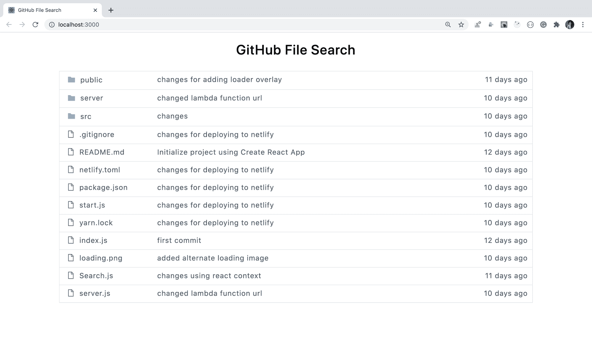
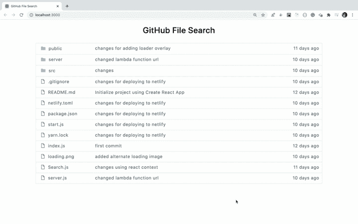
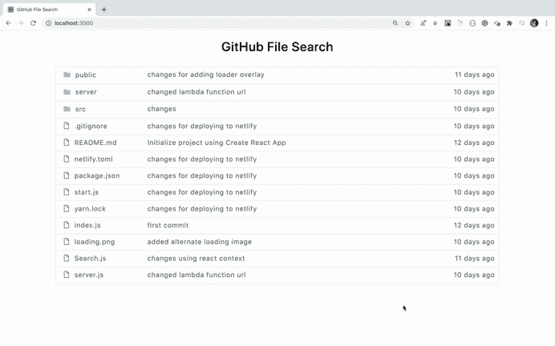
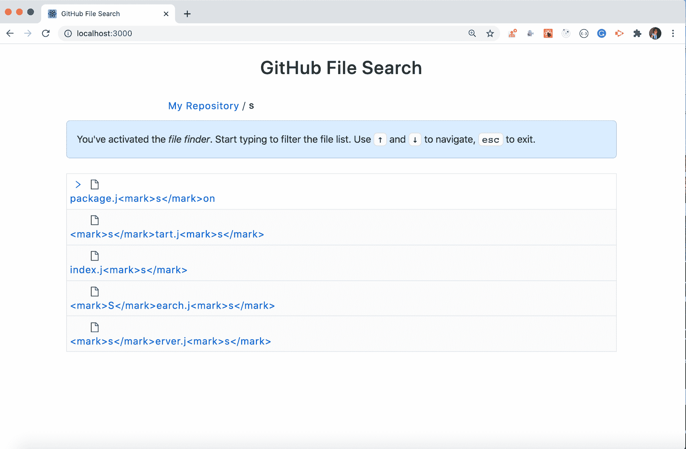
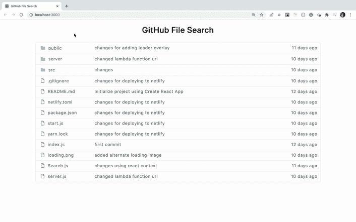

# 如何克隆 GitHub 的文件搜索功能

> 原文：<https://www.freecodecamp.org/news/build-a-clone-of-githubs-file-search-functionality/>

在本文中，我们将构建一个项目，模仿 GitHub 提供的鲜为人知但非常棒的文件搜索功能。

要了解它是如何工作的，去任何一个 GitHub 库，按下字母 **t** 就会进入搜索视图。然后，您可以同时搜索和滚动列表，如下图所示:


Github file search functionality

通过构建此应用程序，您将了解以下内容:

*   如何创建一个类似于 GitHub 库的 UI
*   如何在 React 中处理键盘事件
*   如何使用键盘上的箭头键进行导航
*   如何在搜索时突出显示匹配的文本
*   如何在 React 中添加图标
*   如何在 JSX 表达式中呈现 HTML 内容

还有更多。

你可以在这里看到应用[的现场演示。](https://github-file-search-react.netlify.app/)

### **我们开始吧**

使用`create-react-app`创建一个新项目:

```
create-react-app github-file-search-react
```

项目创建完成后，删除`src`文件夹中的所有文件，在`src`文件夹中创建`index.js`、`App.js`和`styles.scss`文件。在`src`文件夹中创建`components`和`utils`文件夹。

安装必要的依赖项:

```
yarn add moment@2.27.0 node-sass@4.14.1 prop-types@15.7.2 react-icons@3.10.0
```

打开`styles.scss`，将[中的内容添加到这里的](https://github.com/myogeshchavan97/github-file-search-react/blob/master/src/styles.scss)中。

在`components`文件夹中创建一个新文件`Header.js`，内容如下:

```
import React from 'react';

const Header = () => <h1 className="header">GitHub File Search</h1>;

export default Header;
```

在`utils`文件夹中创建一个新文件`api.js`，并将[的内容添加到其中](https://github.com/myogeshchavan97/github-file-search-react/blob/master/src/utils/api.js)。

在这个文件中，我们创建了显示在 UI 上的静态数据，以使应用程序简单易懂。

在`components`文件夹中创建一个新文件`ListItem.js`，内容如下:

```
import React from 'react';
import moment from 'moment';
import { AiFillFolder, AiOutlineFile } from 'react-icons/ai';

const ListItem = ({ type, name, comment, modified_time }) => {
  return (
    <React.Fragment>
      <div className="list-item">
        <div className="file">
          <span className="file-icon">
            {type === 'folder' ? (
              <AiFillFolder color="#79b8ff" size="20" />
            ) : (
              <AiOutlineFile size="18" />
            )}
          </span>
          <span className="label">{name}</span>
        </div>
        <div className="comment">{comment}</div>
        <div className="time" title={modified_time}>
          {moment(modified_time).fromNow()}
        </div>
      </div>
    </React.Fragment>
  );
};

export default ListItem;
```

在这个文件中，我们获取了想要显示的每个文件的数据，并显示了文件夹/文件图标、文件名、注释以及文件的最后修改时间。

为了显示图标，我们将使用`react-icons` npm 库。它有一个非常好的网站，可以让你轻松地搜索和使用你需要的图标。点击查看[。](https://react-icons.github.io/react-icons/)

图标组件接受`color`和`size`属性来定制我们在上面代码中使用的图标。

在`components`文件夹中创建一个名为`FilesList.js`的新文件，内容如下:

```
import React from 'react';
import ListItem from './ListItem';

const FilesList = ({ files }) => {
  return (
    <div className="list">
      {files.length > 0 ? (
        files.map((file, index) => {
          return <ListItem key={file.id} {...file} />;
        })
      ) : (
        <div>
          <h3 className="no-result">No matching files found</h3>
        </div>
      )}
    </div>
  );
};

export default FilesList;
```

在这个文件中，我们从`api.js`文件中读取静态数据，然后使用数组映射方法显示文件数组的每个元素。

现在打开`src/App.js`文件，并在其中添加以下代码:

```
import React from 'react';
import Header from './components/Header';
import FilesList from './components/FilesList';
import files from './utils/api';

export default class App extends React.Component {
  state = {
    filesList: files
  };

  render() {
    const { counter, filesList } = this.state;

    return (
      <div className="container">
        <Header />
        <FilesList files={filesList} />
      </div>
    );
  }
}
```

在这个文件中，我们添加了一个状态来存储静态文件数据，我们可以在需要时修改这些数据。然后我们将它传递给`FilesList`组件以显示在 UI 上。

现在，打开`index.js`文件并在其中添加以下代码:

```
import React from 'react';
import ReactDOM from 'react-dom';
import App from './App';
import './styles.scss';

ReactDOM.render(<App />, document.getElementById('root'));
```

现在，通过从终端或命令提示符运行`yarn start`命令启动您的应用程序，您将看到以下初始屏幕:



Initial screen

你可以在[这个分支](https://github.com/myogeshchavan97/github-file-search-react/tree/initial_code)中找到到目前为止的代码。

## 添加基本搜索功能

现在，让我们添加更改 UI 的功能，当我们按下键盘上的字母 **t** 时，它允许我们搜索文件。

在`utils`文件夹中创建一个名为`keyCodes.js`的新文件，内容如下:

```
export const ESCAPE_CODE = 27;
export const HOTKEY_CODE = 84; // key code of letter t
export const UP_ARROW_CODE = 38;
export const DOWN_ARROW_CODE = 40;
```

在`components`文件夹中创建一个名为`SearchView.js`的新文件，内容如下:

```
import React, { useState, useEffect, useRef } from 'react';

const SearchView = ({ onSearch }) => {
  const [input, setInput] = useState('');
  const inputRef = useRef();

  useEffect(() => {
    inputRef.current.focus();
  }, []);

  const onInputChange = (event) => {
    const input = event.target.value;
    setInput(input);
    onSearch(input);
  };

  return (
    <div className="search-box">
      My Repository <span className="slash">/</span>
      <input
        type="text"
        name="input"
        value={input}
        ref={inputRef}
        autoComplete="off"
        onChange={onInputChange}
      />
    </div>
  );
};

export default SearchView;
```

我们在这里为状态和生命周期方法使用了 React 钩子。如果你是 React Hooks 的新手，可以看看这篇文章的介绍。

在这个文件中，我们首先声明了一个状态来存储用户键入的输入。然后我们使用`useRef`钩子添加了一个`ref`,这样我们就可以在组件安装时关注输入字段。

```
const inputRef = useRef();

useEffect(() => {
  inputRef.current.focus();
}, []);

...

<input
    type="text"
    name="input"
    value={input}
    ref={inputRef}
    autoComplete="off"
    onChange={onInputChange}
  />
```

在这段代码中，通过将空数组`[]`作为第二个参数传递给`useEffect`钩子，当组件被挂载时，`useEffect`钩子中的代码将只被执行一次。这充当类组件中的`componentDidMount`生命周期方法。

然后我们将`ref`分配给输入字段作为`ref={inputRef}`。在`onInputChange`处理程序中输入字段发生变化时，我们调用作为道具从`App.js`文件传递给组件的`onSearch`方法。

现在，打开`App.js`并用以下代码替换其内容:

```
import React from 'react';
import Header from './components/Header';
import FilesList from './components/FilesList';
import SearchView from './components/SearchView';
import { ESCAPE_CODE, HOTKEY_CODE } from './utils/keyCodes';
import files from './utils/api';

export default class App extends React.Component {
  state = {
    isSearchView: false,
    filesList: files
  };

  componentDidMount() {
    window.addEventListener('keydown', this.handleEvent);
  }

  componentWillUnmount() {
    window.removeEventListener('keydown', this.handleEvent);
  }

  handleEvent = (event) => {
    const keyCode = event.keyCode || event.which;

    switch (keyCode) {
      case HOTKEY_CODE:
        this.setState((prevState) => ({
          isSearchView: true,
          filesList: prevState.filesList.filter((file) => file.type === 'file')
        }));
        break;
      case ESCAPE_CODE:
        this.setState({ isSearchView: false, filesList: files });
        break;
      default:
        break;
    }
  };

  handleSearch = (searchTerm) => {
    let list;
    if (searchTerm) {
      list = files.filter(
        (file) =>
          file.name.toLowerCase().indexOf(searchTerm.toLowerCase()) > -1 &&
          file.type === 'file'
      );
    } else {
      list = files.filter((file) => file.type === 'file');
    }

    this.setState({
      filesList: list
    });
  };

  render() {
    const { isSearchView, filesList } = this.state;

    return (
      <div className="container">
        <Header />
        {isSearchView ? (
          <div className="search-view">
            <SearchView onSearch={this.handleSearch} />
            <FilesList files={filesList} isSearchView={isSearchView} />
          </div>
        ) : (
          <FilesList files={filesList} />
        )}
      </div>
    );
  }
}
```

现在，通过再次运行`yarn start`命令重启应用程序，并检查其功能。



Initial working search functionality

如您所见，最初会显示所有文件夹和文件。然后，当我们按下键盘上的字母`t`时，视图发生变化，允许我们搜索显示的文件。

现在，让我们来理解来自`App.js`文件的代码。

在这个文件中，我们首先将`isSearchView`声明为一个状态变量。然后在`componentDidMount`和`componentWillUnmount`生命周期方法中，我们分别添加和移除`keydown`事件处理程序。

然后在`handleEvent`函数中，我们检查用户按了哪个键。

*   如果用户按下 t 键，那么我们将`isSearchView`状态设置为`true`，并更新`filesList`状态数组，只包含文件，排除文件夹。
*   如果用户按下退出键，那么我们将`isSearchView`状态设置为`false`，并更新`filesList`状态数组以包含所有文件和文件夹。

我们之所以在单独的文件中声明`HOTKEY_CODE`和`ESCAPE_CODE`(`keyCodes.js`而不是像`84`那样直接使用键码，是因为后来如果我们想把热键从`t`改成`s`，那么只需要改变那个文件中的键码即可。它将反映所有使用它的文件的变化，而不需要在每个文件中改变它。

现在，我们来了解一下`handleSearch`函数。在这个函数中，我们检查用户是否在输入搜索框中输入了内容，然后过滤出包含该搜索词的匹配文件名。然后，我们用过滤后的结果更新状态。

然后在 render 方法中，基于`isSearchView`值，我们向用户显示文件列表视图或搜索视图。

您可以在这个分支的[中找到到目前为止的代码。](https://github.com/myogeshchavan97/github-file-search-react/tree/switching_view)

## 添加在文件

之间导航的功能

现在，让我们添加功能，在导航文件列表时，在当前选择的文件前面显示一个箭头。

在`components`文件夹中创建一个名为`InfoMessage.js`的新文件，内容如下:

```
import React from 'react';

const InfoMessage = () => {
  return (
    <div className="info-message">
      You've activated the <em>file finder</em>. Start typing to filter the file
      list. Use <span className="navigation">↑</span> and{' '}
      <span className="navigation">↓</span> to navigate,{' '}
      <span className="navigation">esc</span> to exit.
    </div>
  );
};

export default InfoMessage;
```

现在，打开`App.js`文件并导入`InfoMessage`组件来使用它:

```
import InfoMessage from './components/InfoMessage';
```

添加一个名为`counter`的新状态变量，初始值为`0`。这是为了跟踪箭头的索引。

在`handleEvent`处理程序中，从 state 获取`filesList`和`counter`值:

```
const { filesList, counter } = this.state;
```

添加两个新的开关箱:

```
case UP_ARROW_CODE:
  if (counter > 0) {
    this.setState({ counter: counter - 1 });
  }
  break;
case DOWN_ARROW_CODE:
  if (counter < filesList.length - 1) {
    this.setState({ counter: counter + 1 });
  }
  break;
```

这里，当我们按下键盘上的向上箭头时，减少`counter`状态值，当我们按下向下箭头时，增加状态值。

同时在文件顶部导入上下数组常量:

```
import {
  ESCAPE_CODE,
  HOTKEY_CODE,
  UP_ARROW_CODE,
  DOWN_ARROW_CODE
} from './utils/keyCodes';
```

在`handleSearch`函数中，在函数结束时将`counter`状态重置为`0`，这样在过滤文件列表时，箭头将始终显示列表中的第一个文件。

```
this.setState({
  filesList: list,
  counter: 0
});
```

更改渲染方法以显示`InfoMessage`组件，并将`counter`和`isSearchView`作为道具传递给`FilesList`组件:

```
render() {
  const { isSearchView, counter, filesList } = this.state;

  return (
    <div className="container">
      <Header />
      {isSearchView ? (
        <div className="search-view">
          <SearchView onSearch={this.handleSearch} />
          <InfoMessage />
          <FilesList
            files={filesList}
            isSearchView={isSearchView}
            counter={counter}
          />
        </div>
      ) : (
        <FilesList files={filesList} />
      )}
    </div>
  );
}
```

现在，打开`FilesList.js`文件，接受`isSearchView`和`counter`道具，并将它们传递给`ListItem`组件。

您的`FilesList.js`文件现在看起来像这样:

```
import React from 'react';
import ListItem from './ListItem';

const FilesList = ({ files, isSearchView, counter }) => {
  return (
    <div className="list">
      {files.length > 0 ? (
        files.map((file, index) => {
          return (
            <ListItem
              key={file.id}
              {...file}
              index={index}
              isSearchView={isSearchView}
              counter={counter}
            />
          );
        })
      ) : (
        <div>
          <h3 className="no-result">No matching files found</h3>
        </div>
      )}
    </div>
  );
};

export default FilesList;
```

现在，打开`ListItem.js`文件，将其内容替换为以下内容:

```
import React from 'react';
import moment from 'moment';
import { AiFillFolder, AiOutlineFile, AiOutlineRight } from 'react-icons/ai';

const ListItem = ({
  index,
  type,
  name,
  comment,
  modified_time,
  isSearchView,
  counter
}) => {
  const isSelected = counter === index;

  return (
    <React.Fragment>
      <div className={`list-item ${isSelected ? 'active' : ''}`}>
        <div className="file">
          {isSearchView && (
            <span
              className={`arrow-icon ${isSelected ? 'visible' : 'invisible'}`}
            >
              <AiOutlineRight color="#0366d6" />
            </span>
          )}
          <span className="file-icon">
            {type === 'folder' ? (
              <AiFillFolder color="#79b8ff" size="20" />
            ) : (
              <AiOutlineFile size="18" />
            )}
          </span>
          <span className="label">{name}</span>
        </div>
        {!isSearchView && (
          <React.Fragment>
            <div className="comment">{comment}</div>
            <div className="time" title={modified_time}>
              {moment(modified_time).fromNow()}
            </div>
          </React.Fragment>
        )}
      </div>
    </React.Fragment>
  );
};

export default ListItem;
```

在这个文件中，我们首先接受`isSearchView`和`counter`属性。然后我们检查列表中当前显示文件的索引是否与`counter`值匹配。

基于此，我们只为该文件在前面显示箭头。然后，当我们使用向下或向上箭头浏览列表时，我们分别递增或递减`App.js`文件中的计数器值。

基于`isSearchView`值，我们在 UI 的搜索视图中显示或隐藏注释和时间列。

现在，通过再次运行`yarn start`命令重启应用程序，并检查其功能:



Search and Navigate

你可以在[这个分支](https://github.com/myogeshchavan97/github-file-search-react/tree/navigation_functionality)中找到到目前为止的代码。

## 添加突出显示匹配文本

的功能

现在，让我们添加在过滤文件时突出显示文件名中匹配文本的功能。

打开`App.js`并将`handleSearch`功能更改为以下代码:

```
handleSearch = (searchTerm) => {
  let list;
  if (searchTerm) {
    const pattern = new RegExp(searchTerm, 'gi');
    list = files
      .filter(
        (file) =>
          file.name.toLowerCase().indexOf(searchTerm.toLowerCase()) > -1 &&
          file.type === 'file'
      )
      .map((file) => {
        return {
          ...file,
          name: file.name.replace(pattern, (match) => {
            return `<mark>${match}</mark>`;
          })
        };
      });
  } else {
    list = files.filter((file) => file.type === 'file');
  }

  this.setState({
    filesList: list,
    counter: 0
  });
};
```

在这段代码中，首先我们使用`RegExp`构造函数为全局和大小写无关搜索创建一个动态正则表达式:

```
const pattern = new RegExp(searchTerm, 'gi');
```

然后，我们筛选出符合该搜索标准的文件:

```
files.filter(
  (file) =>
    file.name.toLowerCase().indexOf(searchTerm.toLowerCase()) > -1 &&
    file.type === 'file'
);
```

然后，我们对从上述过滤器功能中获得的结果调用数组映射方法。

在 map 方法中，我们使用字符串`replace`方法。
`replace`方法接受两个参数:

*   要搜索的模式
*   为每个匹配的模式执行的函数

我们使用`replace`方法找到`pattern`的所有匹配，并用字符串`<mark>${match}</mark>`替换它。这里`match`将包含来自文件名的匹配文本。

如果从`utils/api.js`文件中检查 JSON 结构，每个文件的结构如下所示:

```
{
  id: 12,
  type: 'file',
  name: 'Search.js',
  comment: 'changes using react context',
  modified_time: '2020-06-30T07:55:33Z'
}
```

因为我们只想替换 name 字段中的文本，所以我们展开文件对象属性，只更改名称，其他值保持不变。

```
{
  ...file,
  name: file.name.replace(pattern, (match) => {
    return `<mark>${match}</mark>`;
  })
}
```

现在，通过再次运行`yarn start`命令重启应用程序，并检查其功能。

当您搜索以下内容时，您将看到 HTML 显示在用户界面上:



HTML not rendered correctly

这是因为我们以如下方式显示了`ListItem.js`文件中的文件名:

```
<span className="label">{name}</span>
```

为了防止`Cross-site scripting (XSS)`攻击，React 使用 JSX 表达式(在花括号中)对所有显示的内容进行转义。

因此，如果我们想要真正显示正确的 HTML，我们需要使用一个叫做`dangerouslySetInnerHTML`的特殊道具。它通过 HTML 传递`__html`名称，并显示为如下所示的值:

```
<span className="label" dangerouslySetInnerHTML={{ __html: name }}></span>
```

现在，通过再次运行`yarn start`命令重启应用程序，并检查其功能:



Final working application

如您所见，搜索词在文件名中被正确地高亮显示。

### 就是这样！

你可以在[这个分支](https://github.com/myogeshchavan97/github-file-search-react/tree/text_highlighting)中找到到目前为止的代码。

完整的 GitHub 源代码:[这里](https://github.com/myogeshchavan97/github-file-search-react)
现场演示:[这里](https://github-file-search-react.netlify.app/)

**在 [Medium](https://medium.com/@yogeshchavan) 、 [dev.to](https://dev.to/myogeshchavan97) 查看我的其他 React、Node.js 和 Javascript 文章，并直接在您的收件箱[这里](https://subscribe-user.herokuapp.com/)** 订阅获得每周更新。