# Tableau 教程–如何构建您自己的 COVID Tracker 仪表板

> 原文：<https://www.freecodecamp.org/news/build-a-covid-tracker-dashboard-using-tableau/>

我在数据科学工作中不使用 Tableau，但是我做了几个迷你项目来帮助我回顾界面并了解宣传的全部内容。

所以昨天，我决定用 Tableau 创建一个完整的仪表板。

我想比较构建的容易程度、完成项目所花费的时间以及仪表板的质量。所以我选择基于世界上新冠状病毒病例的数量，因为我已经使用 Python、Jupyter Notebook 和 Voila 构建了一个类似的[仪表板来显示 COVID 病例。](https://towardsdatascience.com/building-covid-19-analysis-dashboard-using-python-and-voila-ee091f65dcbb)

## 本快速教程的先决条件

没什么大不了的——只要确保你已经安装了 Tableau public。

为了更好地理解这两种方法之间的明显差异——也就是说，使用编程构建[仪表板](https://covid-19-voila-dashboard.herokuapp.com/)与使用 Tableau 构建仪表板——只需浏览一下我的[关于从 Jupyter Notebooks 构建新冠肺炎交互式仪表板的文章](https://towardsdatascience.com/building-covid-19-analysis-dashboard-using-python-and-voila-ee091f65dcbb)或者在这里观看视频。

你可以在这里查看我的基于 Python 的仪表盘。

让我们开始构建…

# 如何找到一个好的数据源

鉴于我们所选话题的严肃性，第一步是找到一个可信的数据来源。

为此，我们将利用约翰霍普金斯大学系统科学与工程中心(CSSE)的新冠肺炎数据库。

该网站由该大学的一些投稿人维护，并定期更新。

有许多不同类型的数据集，但为了简单起见，我们将使用特定国家的数据，为我们提供世界上不同国家/地区不同类型病例(活动、确诊、死亡、康复)的最新数量。

以下是该文件的原始链接:

[https://raw . githubusercontent . com/CSSEGISandData/新冠肺炎/we B- data/data/cases _ country . CSV](https://raw.githubusercontent.com/CSSEGISandData/COVID-19/web-data/data/cases_country.csv)

它是一个 CSV 文件，如下所示:

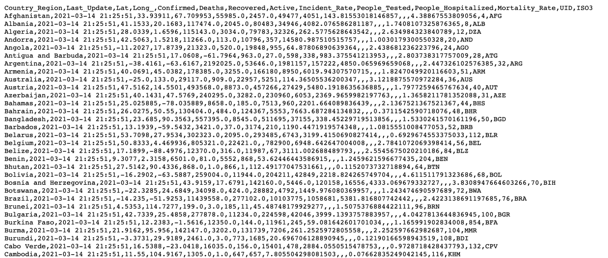

# 如何将数据加载到 Tableau

将数据加载到 Tableau 有几种方法，包括:

*   从本地计算机上传文件 Excel、CSV、text、JSON、PDF、Spatial 等。
*   连接到存储在服务器上的数据—您可以直接从 Tableau Server、Google Cloud Storage/Analytics、MS SQL server 等加载数据。您可以使用现有的数据连接器。
*   您也可以连接到以前连接过的信号源。

在我们的例子中，我们希望将 GitHub 上的原始 CSV 文件直接加载到 Tableau。为此，我们可以使用 Keshia Rose 开发的 CSV web [数据连接器](https://basic-csv-wdc.herokuapp.com/)。

这里是连接器的链接:[https://basic-csv-wdc.herokuapp.com/](https://basic-csv-wdc.herokuapp.com/)

这些是加载数据的步骤:

*   在连接窗格下，点击`****Web Data Connector****`。
*   在弹出的字段中添加连接器 URL 并点击`Enter`。

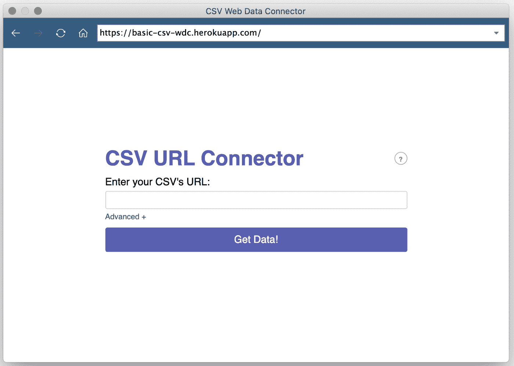

*   现在，在搜索字段中添加原始 CSV 文件的链接，并单击`****Get Data!****`。

加载数据需要几秒钟，然后您可以点击`Update now`查看文件中的可用数据:

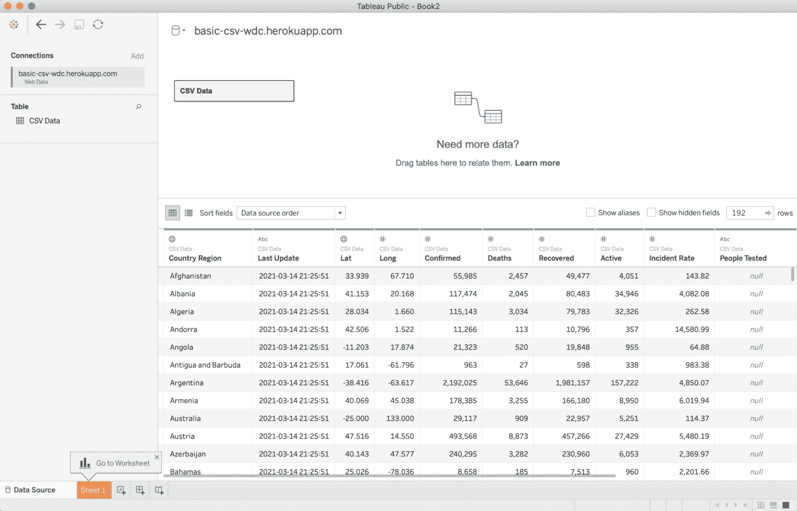

## 
如何浏览 Tableau 中的数据

Tableau 以非常直观的方式呈现数据。我们可以从预览和元数据中了解数据的基本属性及其类型。

从预览中，我们可以找到数据集中的特征，这些特征进一步定义了我们有兴趣回答的关于手头问题的问题。

从元数据视图中，我们可以找到这些特征的数据类型(分类/定量/日期时间等),这些数据类型告诉我们如何结合其他特征来分析这些特征。

单击元数据视图会显示列及其名称和类型:

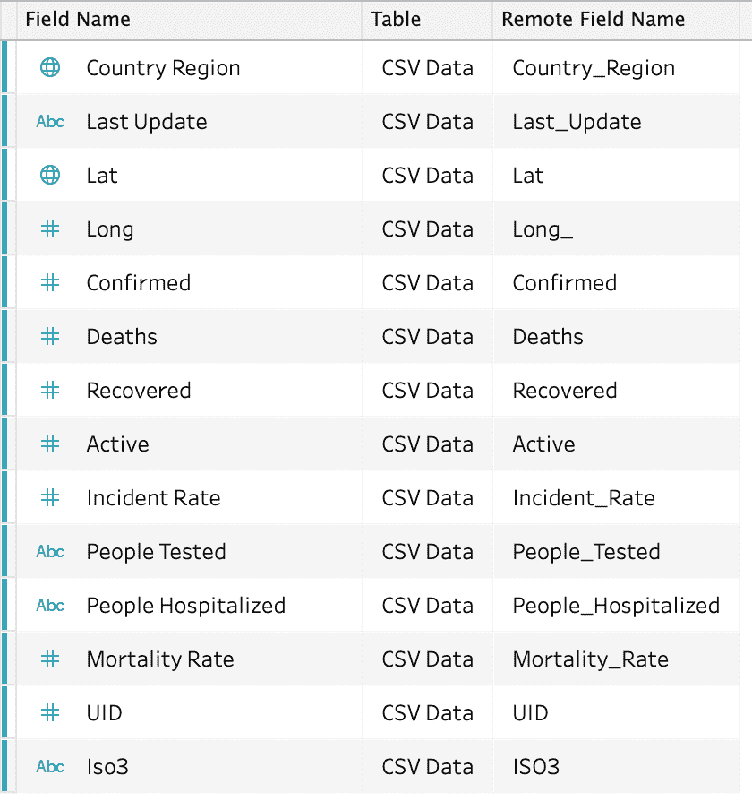

了解要素的含义及其数据类型非常重要:

****如何找到变量的数据类型**** —用符号表示。
`****#****` —表示数值数据类型。
`****Abc****` —表示分类/字符串数据类型。
`🌐`——表示地理值。

除此之外，我们还有日期时间、集群和布尔符号。

这应该有助于我们理解我们可以用这个数据集做什么。

由于数据已经被清理和格式化，我们可以跳过争论的部分，继续定义我们想要从这个分析中得到什么。

那么，让我们进入下一步。

# 如何基于列定义问题

根据我们拥有的功能及其数据类型，我们可以回答以下简单的问题:

*   目前世界上的 COVID 病例数是多少(总活跃数、确诊数、死亡数)？
*   国家的现状是怎样的——如果我们能在一个框架中把它形象化？
*   就病例数和死亡率而言，哪些国家受影响最大？

您可以添加和定义更多或不同的问题，但现在我将带您浏览这些问题。

是时候认真回答这些问题了。

# Tableau 界面如何工作

下面是 Tableau 界面的快速浏览。

→在底部，您会看到有许多图标，它们是为了:

*   检查连接的数据源
*   添加新工作表
*   添加新仪表板
*   添加新故事。

→点击默认情况下为我们创建的第 1 页。

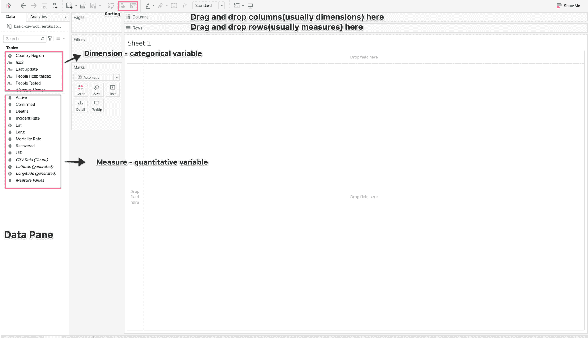

在上图中，我只标注了界面的重要部分。我们可以通过将要素拖放到列和行中来完成大部分分析。

# 如何在 Tableau 中创建可视化效果

我们现在将迭代每个问题，并创建一个专用表来分析数据，以便回答这个问题。

## 案例总数第一

为了回答这个问题，我们将利用以下几个栏目:

*   确认的
*   死亡
*   活跃的

现在，Tableau 知道这些是定量的度量，并在您尝试拖放其中任何一个时添加一个默认的聚合器(在本例中为 SUM)。您可以使用标记随时更改聚合器。

要直观显示案例的总数，只需拖动上述每个功能，并将其放在顶部的列字段中。

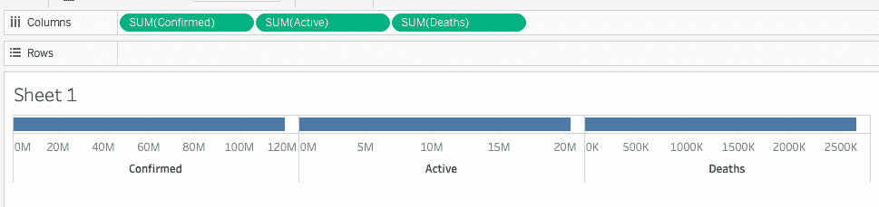

> *在任何时候，如果出现问题，可以使用* `*Cmd/Ctrl + z*` *来撤销。*

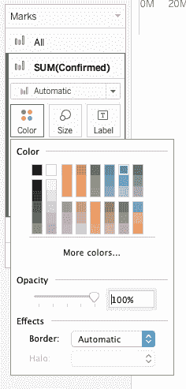

此外，您可以使用左窗格中的标记来更改每个条形的颜色。

您还可以通过右键单击想要格式化的数据可视化来试验字体、文本颜色、阴影等。

这是我的格式化可视化在一些改变(颜色和宽度)后的样子。

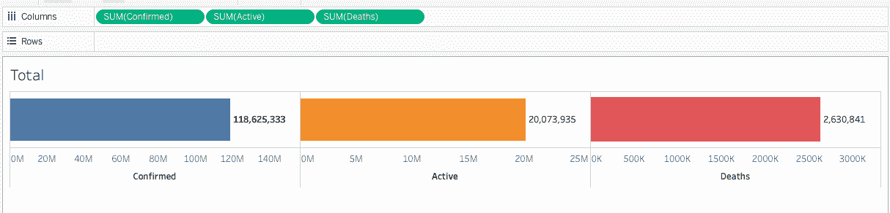

→对于我们付出的努力来说，已经足够好了。编写这样的代码会花费更多的时间和精力。

太棒了，让我们进入下一部分。

## #2 世界地图，显示每个国家/地区的 COVID 病例

由于我们在数据中有地理空间维度，我们可以在世界地图上绘制这些数字，根据我们选择的变量来可视化每个国家的情况。

我将使用纬度和经度列在世界地图上绘制病例数(确诊、活跃和死亡)。这些是由 Tableau 从 Lat/Long 变量生成的，在“表”窗格中以斜体显示。

如何实现:

*   第一步是通过点击`Sheet 1`旁边的图标添加新的工作表
*   拖动***【生成】** 并将其放入列中*
*   *拖动 **纬度* *(生成)** ，逐行拖放。这样做之后，你会在主视图中有一个空白的世界地图。*
*   *要添加国家名称，请将`Country Region`列放在标记窗格的详细信息框中。这样做将在工具提示中显示带有国家名称的符号地图。*
*   *现在，我们在右上方有一个`Show Me`窗格，向我们显示所有您可以使用的可视化效果。灰色的图表不适用，当您将鼠标悬停在这些图表上时，它会告诉您需要哪些类型的列来使该图表适用。对世界地图这样做，你会了解到我们至少需要 1 个地理空间维度，0 个或更多维度，以及 0 个或 1 个度量。*
*   *是时候添加度量了，这是我们想要可视化的变量。我在选择确诊病例的数量。将确认列拖放到标记窗格中的标签框上。*

*如果您想将其他变量添加到细节框中，也可以将它们添加到细节框中。*

*以下是我的符号地图的外观:*

*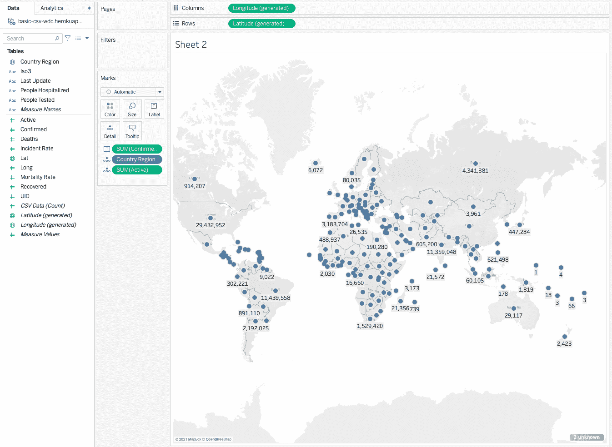*

*您可以随意使用另一张地图，添加颜色，或者设置您想在地图上看到的内容的格式。*

## *#3 受影响最严重的国家*

*总人数和世界地图只能给你一个疫情的简要概述。*

*所以，让我们再深入一点，看看哪些国家在确诊病例、死亡和死亡率方面受影响最大，哪些国家的恢复率高。*

*这些数据很容易绘制。以下是步骤:*

*   *添加新工作表。*
*   *将`Country Region`特征拖放到列中。*
*   *将`SUM(Confirmed)`拖放成行。您将在主视图中看到一个条形图，X 轴表示国家，Y 轴表示确诊病例数。*
*   *因为我们应该查看受影响最严重的国家，所以我们需要对数据进行排序，Tableau 让我们很容易做到这一点。我们需要做的就是点击顶部任务栏中的`Sort descending`图标。*
*   *所有的条形图都以降序排列，我们现在只想挑选一些高于某个阈值的，比如前 10 个。将光标保持在点击状态，并将其拖动到您想要列入候选名单的条形数量上。*
*   *将鼠标悬停在入围栏上，并在出现的弹出窗口中单击仅保留。这会给你一个整洁的图表。*
*   *您可以从任务栏打开标签或将 SUM(已确认)放到标签框中。*

*同样，您可以添加颜色、随意设置格式、添加注释，以及对这些数据做更多的事情。*

*以下是我使用上述步骤创建的图表:*

*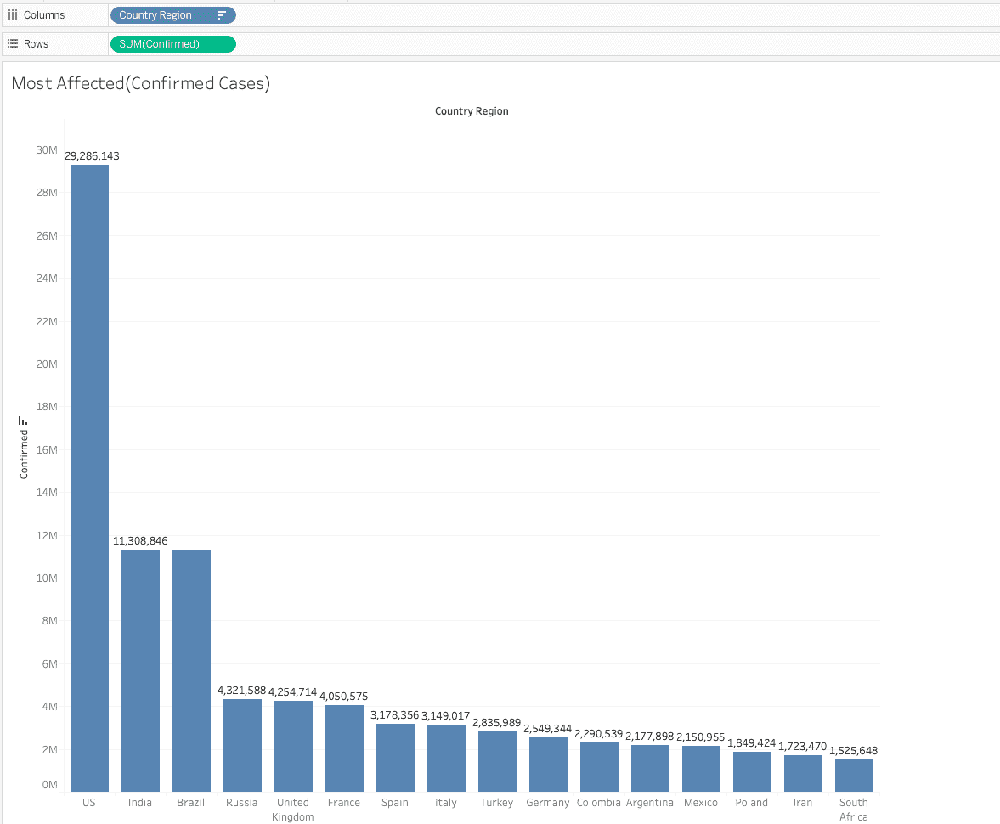**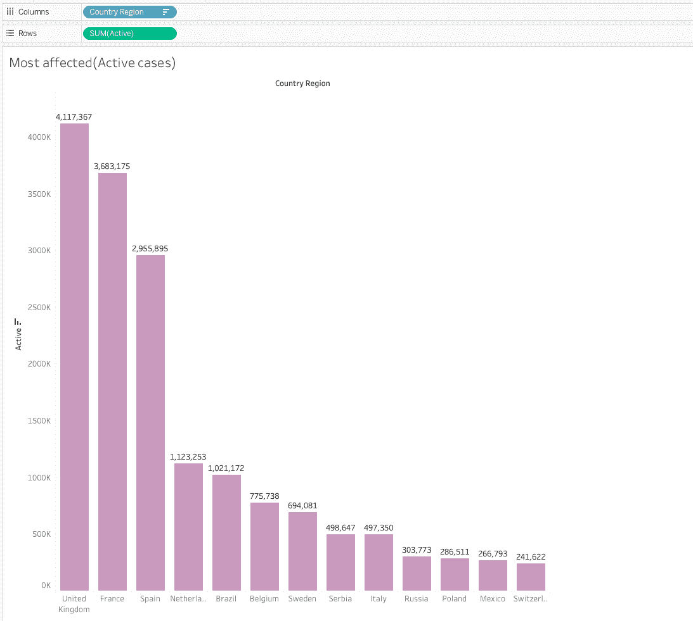**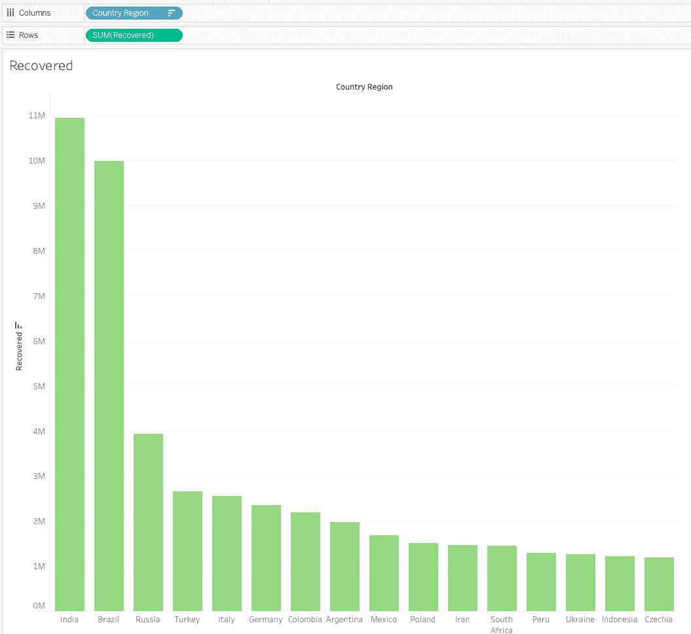*

> *不要忘记根据它们的使用情况重命名你的工作表。*

## *如何用这些表创建一个仪表板*

*有了足够的可视化效果和数字，我们现在可以将它们全部显示在一个屏幕上，从而创建一个快速的交互式仪表盘。*

*这最后一步非常简单——你需要做的就是点击底部的`New Dashboard`图标。*

*这将创建一个空的仪表板视图，提示您从左侧窗格中删除要在仪表板中显示的工作表。*

*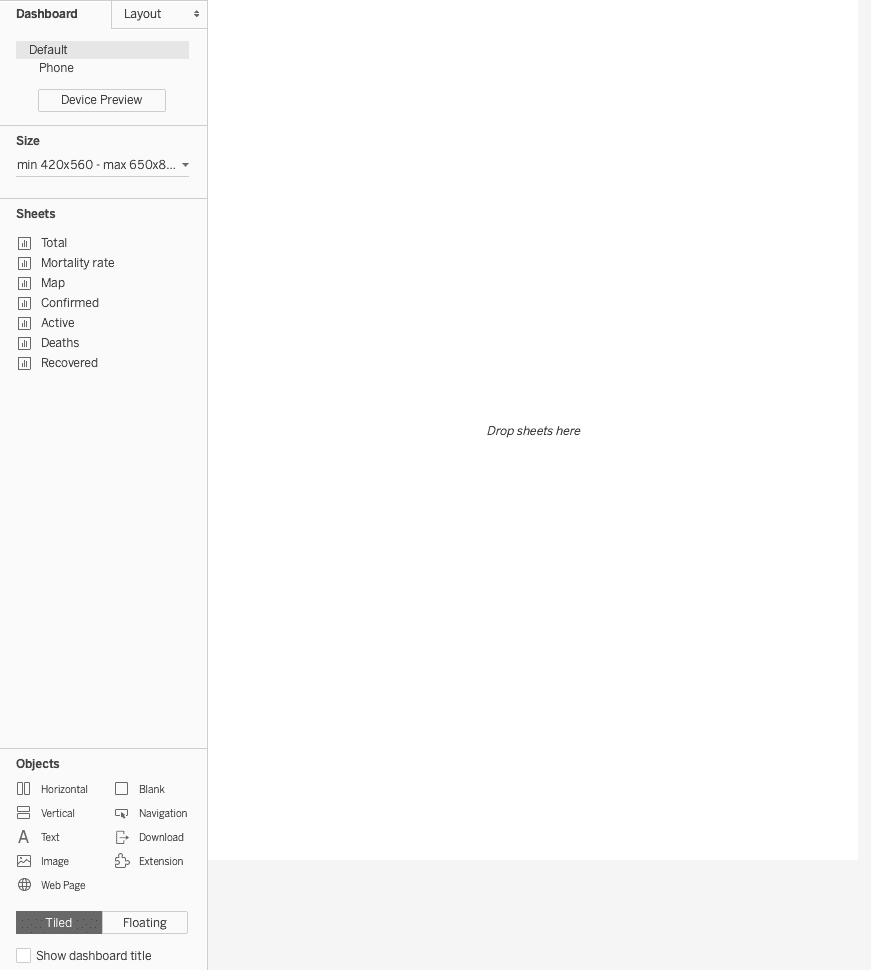*

*您可以将工作表拖放到仪表板上，然后定位它们，使您的仪表板看起来更有洞察力和吸引力。*

*这是我最后的仪表板:*

*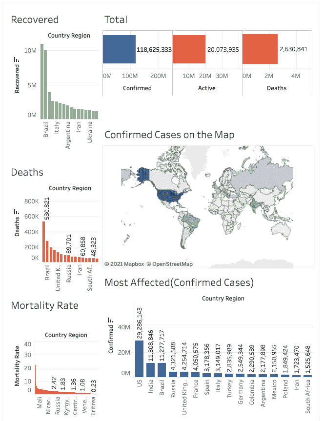*

*如果您想要对任何可视化进行更改，您可以返回到该表，更改将自动反映在仪表板中。*

## *如何共享您的仪表板*

*您可以创建自己的个人帐户，将所有更改保存到 Tableau 公共服务器上的笔记本/仪表板中。*

*保存仪表板将创建一个公共链接，您可以与您的分析师同事、合作者或朋友共享。*

*你可以在这里看我的仪表板:*

*[https://public.tableau.com/profile/harshit.tyagi#!/viz home/covid _ book/Dashboard](https://public.tableau.com/profile/harshit.tyagi#!/vizhome/covid_book/Dashboard1)。*

# *结论*

*在使用 Tableau 构建了这个仪表板之后，我将它与我使用 Python 和 Jupyter Notebook 创建它所花费的工作量进行了比较。我尝试用 1 - 5 的不同尺度对这两种方法进行评分，其中 5 是最好的，1 是最差的:*

*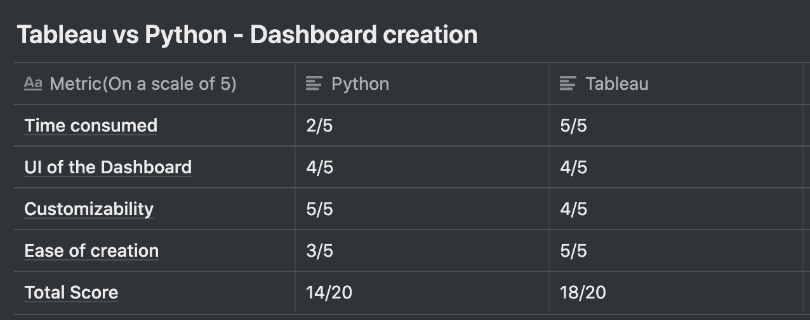*

*Tableau 显然是这里的赢家！*

*我可以说，Tableau 似乎是一个明智和省时的选择，至少对于这些类型的场景是如此。*

> *免责声明:将编程语言与数据分析软件相比较可能是不正确的。这是一个有趣的比较，仅适用于这种类型的仪表板构建任务。根据我的经验，这是我的个人观点，你应该为自己找到最好的工具选择。*

## *实时项目*

*如果你想做一些类似但更先进的东西，你应该看看我在 [Manning](https://www.manning.com/liveproject/predicting-disease-outbreaks-with-time-series-analysis?utm_source=harshit&utm_medium=affiliate&utm_campaign=liveproject_tyagi_predicting_3_11_21&a_aid=harshit&a_bid=f5119f17) 上的直播项目。*

## ***本博客视频版！***

 *[https://www.youtube.com/embed/EeMfwaPf4IQ?feature=oembed](https://www.youtube.com/embed/EeMfwaPf4IQ?feature=oembed)* 

*如果这个教程有帮助，你应该看看我在 [Wiplane Academy](https://www.wiplane.com/) 上的数据科学和机器学习课程。它们全面而紧凑，帮助您建立一个坚实的工作基础来展示。*

 *引文:*

*[1]: Dong E，Du H，Gardner L .一个基于 web 的交互式仪表盘，用于实时跟踪新冠肺炎。柳叶刀新闻杂志。20(5):533–534.doi:10.1016/s 1473–3099(20)30120–1*