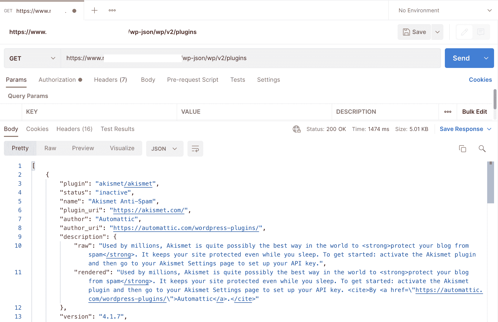
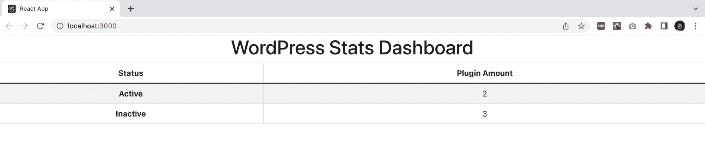

# 如何用 WordPress APIs 和 React 构建一个定制的仪表板

> 原文：<https://www.freecodecamp.org/news/build-a-custom-dashboard-with-wordpress-apis-and-react/>

当你管理网站时，一切都与数据有关:浏览量、响应时间、用户、跳出率等等。而且，如果你管理网站，你可能至少要处理一次 WordPress 实例。

有成百上千的 WordPress 插件来检索和显示数据。但是如果我们想用一些我们想要得到的特定信息建立一个定制的仪表板，WordPress APIs 可以帮我们一把。

这就是为什么今天我想和你分享如何构建一个服务，从我们的 WordPress 实例中检索数据并在表格上显示它们。更具体地说，我想知道我正在使用的插件的数量，以及我以前安装过哪些不再使用的插件。

## 为什么我应该知道我正在使用什么 WordPress 插件？

我总是发现这个信息非常重要。尤其是在你开始使用 WordPress 的时候，你可能会想为你的网站安装一个插件。

嗯，插件可能很容易安装，但它们也有一些潜在的缺点:

*   如果不经常更新，它们会使您的网站暴露于攻击和漏洞之下
*   他们可以让你的网站的加载时间比它应该的要长得多
*   一些插件可能会相互冲突

我不是说你不应该使用或信任插件。但这是你必须注意的事情。因此，让我们看看如何在我们的指尖有一些关于我们的插件有用的信息。

### 我将使用什么工具

*   WordPress APIs 我将使用“插件”端点。
*   react–我将创建一个组件来显示数据。
*   axios——我将使用它轻松调用 API。
*   react-Bootstrap——我选择这个库只是为了快速获得一个漂亮易用的表格组件。
*   postman——这是我经常用来测试 API 的工具。
*   NPM——我将使用它来创建一个 React 应用程序并安装软件包。

## WordPress APIs

正如我在本文开头所说的，我想调用一个特定的端点来获取 JSON，其中包含关于我在实例上安装的插件的信息。准确的说，我想统计一下我目前使用的插件(“活动的”)和不使用的插件(“不活动的”)。

关于 API 的[文档](https://developer.wordpress.org/rest-api/)非常详细，充满了有用的信息和概念。所以我点击了边栏上的“端点引用”,然后滚动点击“插件”。

现在让我们关注“模式”部分。在这里，我找到了插件记录中存在的所有字段。这个列表很长，但我只需要其中一个字段:“状态”。文档说它返回给我一个带有两个可能值的字符串:“非活动”或“活动”。

这是我将调用的 API，以检索必要的数据:

```
https://<BASE_URL>/wp-json/wp/v2/plugins
```

到目前为止一切顺利。还有一件事我们需要考虑。一些端点需要基本身份验证来返回数据。我们的终点就是其中之一。从版本 5.6 开始，您可以传递用户名和应用程序密码来调用此端点。

如果你想了解更多关于应用程序密码以及如何生成密码的信息，我推荐你查看 WordPress 社区写的这篇[文章](https://make.wordpress.org/core/2020/11/05/application-passwords-integration-guide/)。

### 测试 API 的时间到了

一旦我知道我需要调用什么端点并生成我的应用程序密码，我就准备好用 Postman 测试我的 API 调用了。这是我得到的:



如您所见，我得到了一个 JSON，其中包含我正在寻找的信息:“status”键。现在我们准备好创建我们的 React 应用程序了！

## 让我们编写 React 应用程序

现在是时候创建应用程序的前端了。正如我之前所说，我将使用 React，因为它的灵活性，Axios 可以轻松调用 API，React-Bootstrap 可以获得具有良好设计的即用型组件。

在我开始写代码之前，让我们回顾一下我想要实现的目标:我希望我的前端应用程序通过调用“plugins”端点从我的 WordPress 实例中检索关于已安装插件的状态(活动或不活动)的数据。

为此，我希望我的脚本执行以下操作:

1.  创建变量来存储活动和非活动插件的数量
2.  通过 API 调用调用端点
3.  遍历 JSON——API 调用返回以下逻辑:如果对象关键字“status”等于“active ”,则将相关计数加 1，否则将与非活动插件相关的计数加 1。相应地更新先前在构造函数中定义的相关状态
4.  使用 React-Bootstrap 中的“table”组件呈现表格，并将状态传递给表格组件，我希望在表格组件中显示活动和非活动插件的数量

说够了。该编码了！:)

首先，我像这样创建我的 React 应用程序:

```
npx create-react-app report
```

然后我安装 Axios 和 React-Bootstrap:

```
npm install axios
npm install react-bootstrap bootstrap@5.1.3
```

一切就绪。现在，在我的 React 应用程序中，我移动到/src 目录，并创建一个名为“components”的新目录:

```
/src/components
```

然后，我转到 components 文件夹，创建一个“Report.jsx”文件。文件现在看起来是这样的:

```
import React from 'react';
import axios from 'axios';
import Table from 'react-bootstrap/Table'

class Report extends React.Component { 
  constructor(props) { 
      super(props); 
      this.state = { countActiveState: 0, countInactiveState: 0, };
  } 

  componentDidMount() {
  let countActive  = 0;
  let countInactive = 0;

  axios.get("https://<BASE_URL>/wp-json/wp/v2/plugins", {
    auth: {
      username: process.env.REACT_APP_USERNAME,
      password: process.env.REACT_APP_CLIENT_SECRET
    }
  })
  .then(res => {
      const plugins = res.data;
      for(let key in plugins) {
        if(plugins[key].status === "active") {
          countActive++;
          this.setState({countActiveState: countActive}); 
        }
        else{
          countInactive++;
          this.setState({countInactiveState: countInactive}); 
        }
    }
    })
    .catch(error => {
      alert("Something went wrong. Try again later.");
      console.log(error);
   })
  }

  render() { 
      return ( 
          <Table striped bordered hover >
              <thead>
                  <tr>
                  <th>Status</th>
                  <th>Plugin Amount</th>
                  </tr>
              </thead>
              <tbody>
                  <tr>
                  <th>Active</th>
                  <td>{this.state.countActiveState}</td>
                  </tr>
                  <tr>
                  <th>Inactive</th>
                  <td>{this.state.countInactiveState}</td>
                  </tr>
              </tbody>
          </Table>
      ); 
  } 
} 

export default Report;
```

让我们把它分成小块，看看发生了什么:

```
import React from 'react';
import axios from 'axios';
import Table from 'react-bootstrap/Table'
```

我从 React-bootstrap 库中导入 Axios 和组件“Table”。

```
constructor(props) { 
      super(props); 
      this.state = { countActiveState: 0, countInactiveState: 0, };
  } 
```

在构造函数中，我定义了两种状态:countActiveState 和 countInactiveState。我将它们都设置为 0。

```
componentDidMount() {
    let countActive  = 0;
    let countInactive = 0;
```

我声明了两个变量，并将它们设置为 0: `countActive`存储活动插件数，`countInactive`存储非活动插件数。

```
axios.get("https://<BASE_URL>/wp-json/wp/v2/plugins", {
      auth: {
        username: process.env.REACT_APP_USERNAME,
        password: process.env.REACT_APP_CLIENT_SECRET
      }
    })
```

我使用 Axios 来执行对“插件”端点的 GET 调用。我还传递基本身份验证的凭证。

```
.then(res => {
      const plugins = res.data;
      for(let key in plugins) {
        if(plugins[key].status === "active") {
          countActive++;
          this.setState({countActiveState: countActive}); 
        }
        else{
          countInactive++;
          this.setState({countInactiveState: countInactive}); 
        }
    }
    })
    .catch(error => {
      alert("Something went wrong. Try again later.");
      console.log(error);
   })
  }
```

然后，在将响应数据存储在一个名为“plugins”的变量中之后，我遍历 JSON 并说:“对于每个 JSON 对象，检查键“status”是否等于“active”。如果是，则将 countActive 变量增加 1 并将 countActiveState 设置为等于 countActive，否则将 countInactive 变量增加 1 并将 countInactiveState 设置为等于 countInactive”。

```
render() { 
      return ( 
          <Table striped bordered hover >
              <thead>
                  <tr>
                  <th>Status</th>
                  <th>Plugin Amount</th>
                  </tr>
              </thead>
              <tbody>
                  <tr>
                  <th>Active</th>
                  <td>{this.state.countActiveState}</td>
                  </tr>
                  <tr>
                  <th>Inactive</th>
                  <td>{this.state.countInactiveState}</td>
                  </tr>
              </tbody>
          </Table>
      ); 
  } 
} 

export default Report;
```

然后，我呈现表格组件，并传递我希望显示数据的 countActiveState 和 countInactiveState。

最后，我转到 App.js 文件，添加报告组件:

```
import './App.css';
import Report from './components/Report';

function App() {

  return (
    <div className="App">
      <h1>WordPress Stats Dashboard</h1>
      <Report/>
    </div>
  );
}

export default App;
```

我启动应用程序:

```
npm start
```

神奇的事情发生了！:)



### 现在你知道了！

所以，这只是一个简单的例子，展示了如何轻松地构建您的自定义仪表板，以从您的 WordPress 实例中检索和可视化数据。

您可以使用任何类型的图形数据表示，如条形图或饼图。全靠你了！

别忘了看看我在 GitHub 上的[回购](https://github.com/mventuri/react-dashboard-wordpress-api)。请随意分享这篇文章和您的反馈。:)