# 学习使用 React 和 electronic 构建自己的桌面聊天应用程序，一步一个脚印

> 原文：<https://www.freecodecamp.org/news/build-a-desktop-chat-app-with-react-electron-and-chatkit-744d168e6f2f/>

亚历克斯·布克

# 学习使用 React 和 electronic 构建自己的桌面聊天应用程序，一步一个脚印

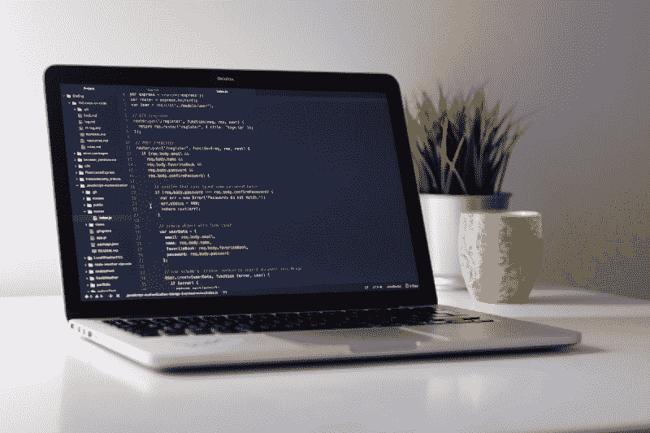

Photo by [Clément H](https://unsplash.com/@clemhlrdt?utm_source=medium&utm_medium=referral) on [Unsplash](https://unsplash.com?utm_source=medium&utm_medium=referral)

本教程是与令人敬畏的克里斯蒂安·恩万巴合作编写的。

学习编码时，你有一大堆资源可以利用——书籍、截屏、教程，甚至练习。但是要成为一名优秀的开发人员，你需要用项目来实践你所学到的东西。

边做边学是这篇文章的动机。您将从零开始，一步一步地构建一个完整的聊天应用程序。

你将一步一步地构建这个项目，为了测试你对它的理解，我们在最后加入了一些特殊的奖励挑战。你准备好接受考验了吗？

以下是我们将要构建的内容:

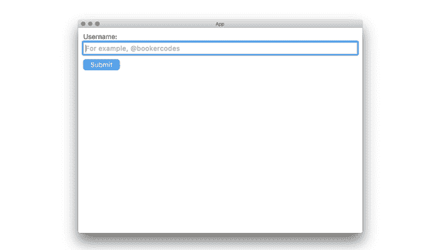

很酷，对吧？？

当您继续学习时，您将学习如何建立实时聊天，一个“谁在线”列表，以及如何构建一个 React 应用程序。为了给我们的聊天提供动力，我们将使用我正在帮助构建的名为 [Chatkit](https://pusher.com/chatkit?utm_source=medium&utm_term=desktop-chat-app-tut) 的服务。

听起来不错吧？收听 [FreeCodeCamp 电台](https://youtu.be/twcOr043i4k)播放一些流畅柔和的背景音乐，保持注意力集中，让我们开始吧！

### 你需要知道的是

实际上，还有一件事？：

如果你已经知道一些基本的 JavaScript、Node 和 React 就好了。话虽如此，如果你对这些技术感到不舒服，还是试一试吧！

我们有意组织了本教程，以明确粘贴代码的位置，以便您可以跟随。如果你有问题，请在这里提出！

好吧，第一步:

### 设置电子

为了用 web 技术构建一个跨平台的桌面应用程序，我们将使用 [Electron](https://electronjs.org/) 。

为了让我们起步，我们制作了一个最小的入门模板。下载它:

```
git clone https://github.com/pusher/electron-desktop-starter-template electron-desktop-chat
```

```
cd electron-desktop-chat
```

并安装这些本地依赖项:

```
npm install
```

### 创建一个聊天工具帐户

在本教程中，我们不太关心构建后端，所以我们将使用 [Chatkit](http://pusher.com/chatkit) 。

接下来，[创建一个免费账户](http://pusher.com/chatkit)和一个名为“电子桌面聊天”的新实例:

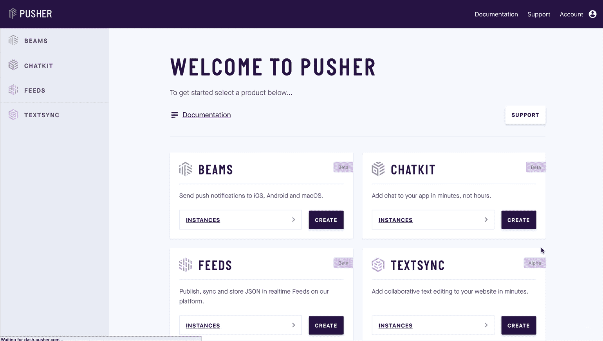

在“设置”窗口中，打开测试令牌提供程序:

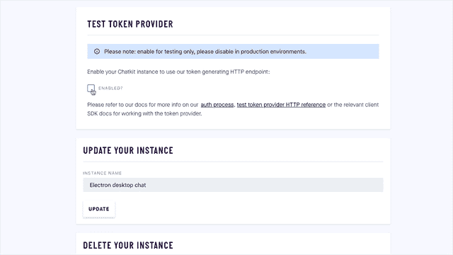

注意**你的测试令牌提供者端点**、**实例定位器**和**密钥**。下一步我们需要它们。

### 设置节点服务器

Chatkit 有两个基本概念:[用户](https://docs.pusher.com/chatkit/core-concepts#users)和[房间](https://docs.pusher.com/chatkit/core-concepts#rooms)。

用户可以创建房间，加入房间，并在房间里聊天。但是在用户可以与房间交互之前，我们需要创建一个房间。

这必须发生在服务器上。

在电子桌面聊天中，运行:

```
npm install --save express cors body-parser pusher-chatkit-server
```

并将它粘贴到名为 server.js 的新文件中:

记得用你自己的**实例定位器**和**键**替换 instanceLocator 和 key。

大部分代码都是样板文件，包括导入依赖项、设置 Express 等等。

重要的部分是“/users”路由，它处理创建新用户的请求。

用`node server.js`运行服务器，你会看到服务器“运行在端口 3001 上”。

### 创建用户名表单

当有人加载我们的应用程序时，我们会要求他们输入用户名，然后发送给“/用户”。

安装一些具有本机外观的 UI 组件:

```
npm install --save react-desktop
```

并创建一个名为 UsernameForm 的表单组件:

你可以在这里阅读更多关于 React 表单组件的信息。碰巧的是，该文档使用了一个与我们相似的 NameForm 类，所以大家应该都很熟悉！

接下来，将所有应用程序替换为:

为了测试它，运行`npm run dev`。您将看到用户名表单呈现如下:

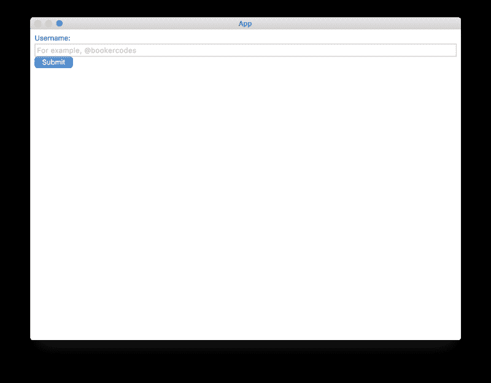

确保服务器正在运行(记住，命令是``node server.js`)，点击**提交**，您将看到一个用户被创建:

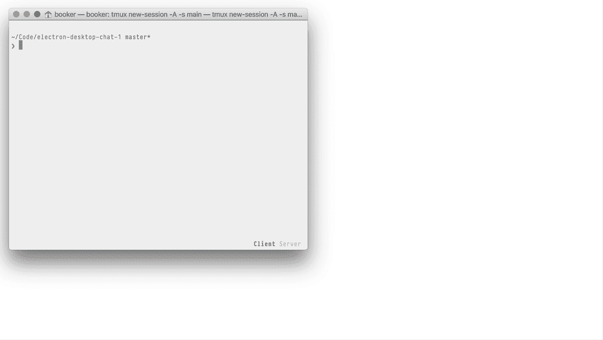

### 不带库的过渡屏幕

一旦我们有了用户，我们可以将他们从用户名表单转换到实际的聊天屏幕。我们应该现在就定义它。

创建一个名为 Chat 的新组件:

并更新应用程序:

运行应用程序，输入用户名，然后您将进入聊天屏幕:

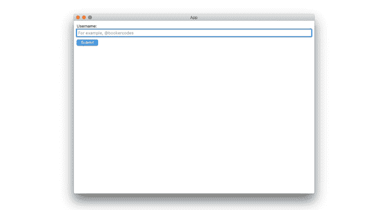

### 使用聊天工具添加实时聊天

事情进展得很顺利，你说呢？

要从客户端连接到 Chatkit，您需要安装 [@pusher/chatkit](https://www.npmjs.com/package/@pusher/chatkit) :

```
npm install --save add @pusher/chatkit
```

并将所有聊天内容替换为:

记得用您的测试令牌提供者端点和**实例定位器**的**替换`tokenProviderUrl`和`instanceLocator`值。**

运行应用程序，点击⌘+⌥+I(控制+Shift+I)，你会看到你连接到聊天工具。

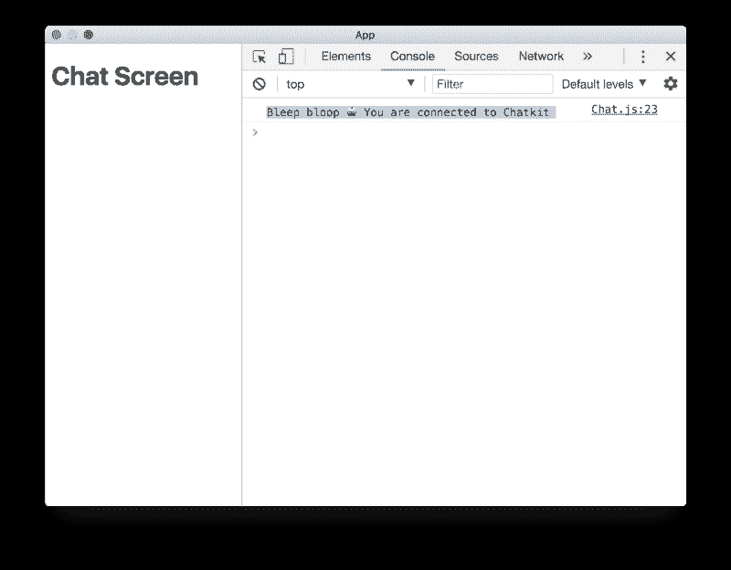

### 创建一个聊天室

我们有一个用户，但现在我们需要一个房间！

要创建一个，请使用 Chatkit 检查器:

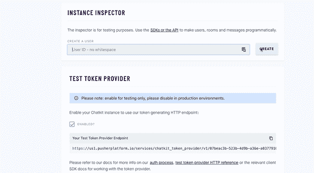

记得复制您的房间 ID，我们在下一步需要它。

### 创建一个聊天室组件

现在我们有一个房间，我们可以订阅在那个房间里发送的新消息。

要呈现它们，请创建一个 MessageList 组件:

和更新聊天:

像往常一样，记得用您实际的房间 ID 更新`roomId`。

现在，当在我们的房间发送消息时，会调用`onNewMessage`。从这里，我们可以更新我们的状态，进而更新我们的 UI。

接下来，我们将让用户发送他们自己的消息。现在，要测试订阅，请使用检查器:

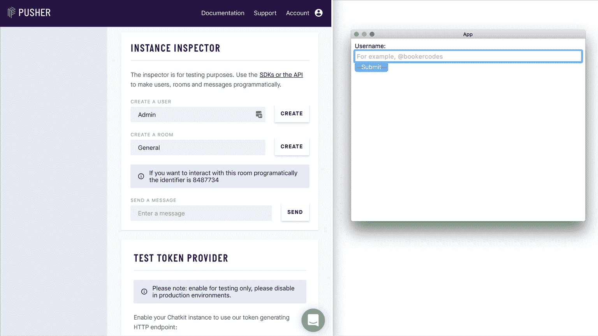

### 发送消息

要让用户发送他们自己的消息，请创建一个 SendMessageForm 组件:

和更新聊天:

用⌘+R (Control+Shift+R)重新加载应用程序，你就可以发送消息了:

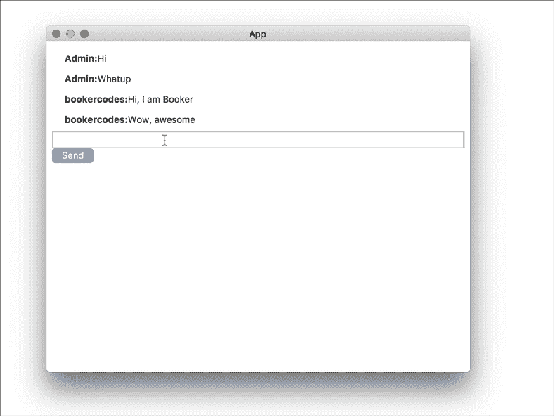

其实为什么不并排打开两个应用，和自己对话呢？

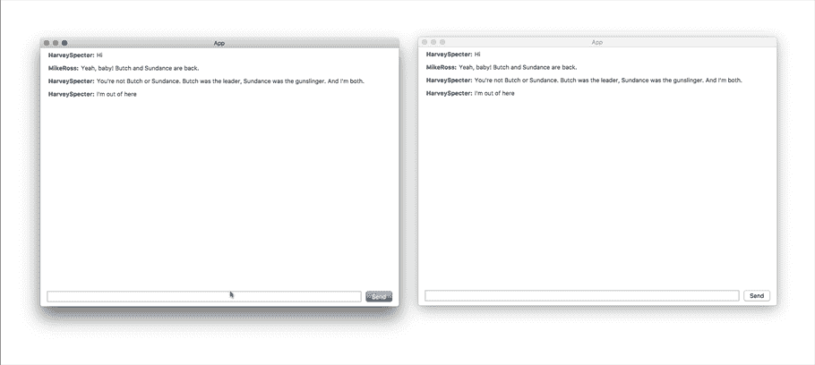

活着是多么美好的时光啊…

### 设计用户界面的样式

多亏了 [React Desktop](http://reactdesktop.js.org/) ，我们的应用看起来已经不错了，但我们还可以做得更好。

让我们做一些调整，并定义我们的布局用于下一步，也是最后一步。

将所有 index.css 替换为:

### 显示谁在线

为了完成我们的聊天应用程序，我们将添加一个“谁在线”列表来显示，你猜对了，谁在线！

创建一个 OnlineList 组件:

然后更新聊天:

你认为这会更困难吗？我第一次尝试的时候绝对做到了！

因为 Chatkit 动态更新`users`属性，所以我们不需要管理自己的任何状态。我们只需要告诉 React 重新渲染，并在每次有人上线(`onUserCameOnline`)、下线(`onUserWentOffline`)或加入房间(`onUserJoined`)时，依次重新评估`users`。

继续，运行服务器和客户端，欣赏您华丽的新聊天应用程序:


如果你已经走了这么远，还不如继续走下去？！尝试这些奖金挑战…

### 挑战 1:展示房间里谁在主动打字

看看你能否在应用程序中添加打字指示器。例如，如果我正在打字，你和房间里的每个人都会看到“布克正在打字…”。

如果我和克里斯都在打字，你会看到“布克和克里斯在打字…”等等。

提示:

*   [聊天工具打字指示器文档](https://docs.pusher.com/chatkit/reference/javascript#typing-indicators)
*   [松弛克隆教程](https://github.com/pusher/build-a-slack-clone-with-react-and-pusher-chatkit)

### 挑战 2:允许用户创建自己的房间

在本教程中，我们使用检查器创建一个房间，然后硬编码房间 ID。这不是一个好的做法。

在大多数应用程序中，您可能希望使用 [createRoom](https://docs.pusher.com/chatkit/reference/server-node#creating-a-room) 函数动态创建房间。

当有人加载应用程序时，也请他们输入房间名称:

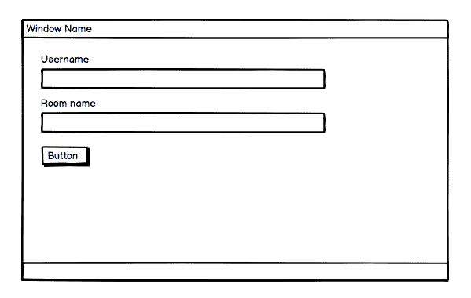

如果房间存在，加入它；如果没有，创建它，然后加入它。

提示:

*   [创建房间文档](https://docs.pusher.com/chatkit/reference/javascript#create-a-room)

### 结论

那很有趣！我们在不到一个小时的时间里，做了一个非常酷的聊天应用？

我注意到的一件事(也许你也注意到了)是，一旦基础就绪(模板、聊天工具连接等等)，添加新的聊天功能就相当简单了。

除了挑战之外，我们很想知道你还可以在哪里申请。一些想法:

*   发送文件
*   未读邮件计数
*   通知
*   读取光标
*   私人一对一消息传递

欢迎在 Twitter、 [@bookercodes](http://twitter.com/bookercodes) 和 [@codebeast](http://twitter.com/codebeast) 上关注我们。

下次见，再见。