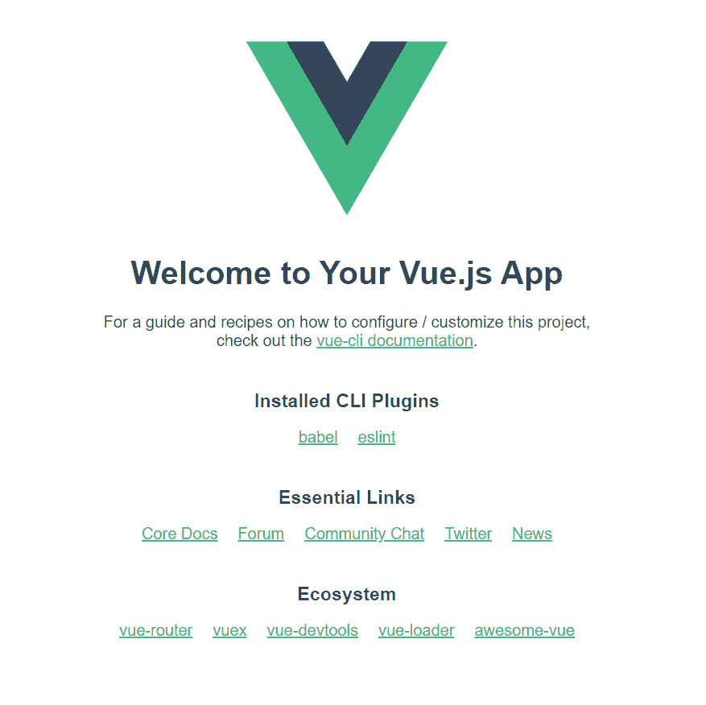
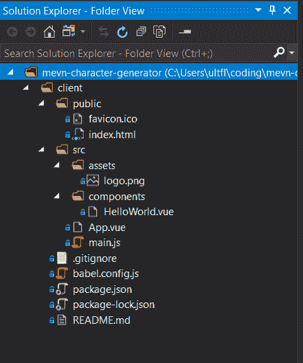
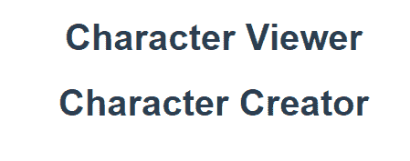
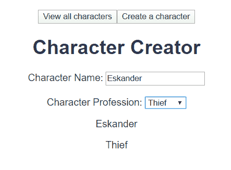
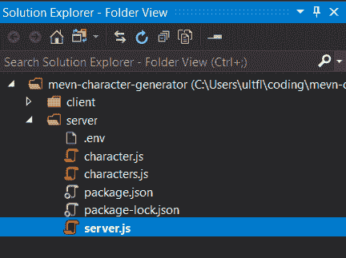
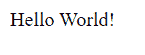
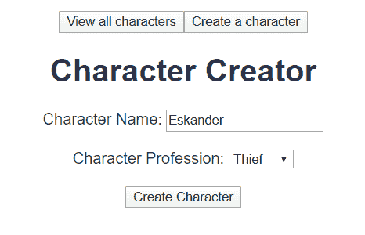
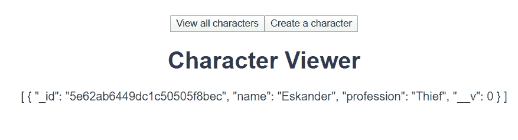
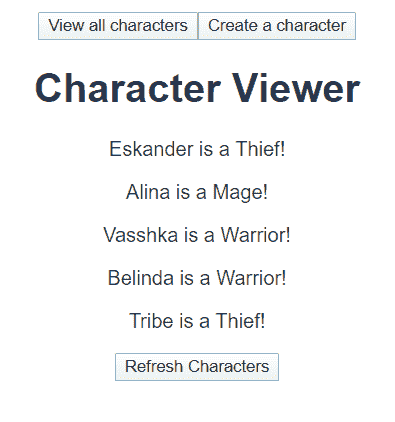

# 如何用 MongoDB、Express、Vue 和 Node(MEVN 栈)构建一个全栈 RPG 字符生成器

> 原文：<https://www.freecodecamp.org/news/build-a-full-stack-mevn-app/>

我是一名桌面游戏开发者，喜欢开发能够提供游戏相关服务的应用。在本文中，我们将逐步使用 [MongoDB](https://www.mongodb.com/) 、 [Express](https://expressjs.com/) 、 [Vue](http://vuejs.org/) 和 [Node](https://nodejs.org/en/) (也称为“MEVN”栈)创建一个角色扮演游戏角色生成器。

先决条件:本教程假设您已经安装并配置了 Node/ [NPM](https://www.npmjs.com/) 和 MongoDB，并准备好代码编辑器和 [CLI](https://en.wikipedia.org/wiki/Command-line_interface) (或 [IDE](https://www.freecodecamp.org/news/how-to-set-up-an-integrated-development-environment-ide/) )。

如果您喜欢跟随可视化教程，您可以查看下面这篇文章的配套视频:

[https://www.youtube.com/embed/i5XUgda08qk?feature=oembed](https://www.youtube.com/embed/i5XUgda08qk?feature=oembed)

我还应该提到，如果没有 Bennett Dungan 关于构建 REST API 的文章、Aneeta Sharma 关于全栈 MEVN web 应用的教程以及 Matt Maribojoc 关于同一主题的文章，本教程是不可能完成的。

在学习创建自己的 MEVN 应用程序时，除了官方文档外，我还使用了这些文章中的每一篇(针对 [Vue](https://vuejs.org/v2/guide/) 、 [Express](https://expressjs.com/en/starter/installing.html) 以及更多内容)(你可以在这里阅读更多关于我的 web APIs 之旅)。

您可以在 [GitHub](https://github.com/sominator/mevn-character-generator) 上访问本教程的整个资源库。

## 前端

我们的应用程序将允许我们创建新的角色扮演游戏角色，并使用以下堆栈一起查看它们:

*   客户端视图
*   节点/快速服务器
*   MongoDB 数据库

Vue 客户端将向 Node/Express 服务器(或“ [API](https://en.wikipedia.org/wiki/Application_programming_interface) ”)发出 [HTTP 请求](https://developer.mozilla.org/en-US/docs/Web/HTTP/Methods)，后者将依次与我们的 MongoDB 数据库通信，将数据发送回堆栈。

我们将首先打开一个命令行，为我们的项目创建一个新目录，并导航到该目录:

```
mkdir mevn-character-generator
cd mevn-character-generator
```

然后，我们将在全球范围内安装 [Vue CLI](https://cli.vuejs.org/) 来帮助我们搭建一个基本的应用程序:

```
npm install -g @vue/cli
```

接下来，我们将使用 Vue CLI 在 mevn-character-generator 目录中创建一个名为“Client”的新应用程序:

```
vue create client
```

你可以在提示符下点击“回车”继续。

我们可以先导航到/client 文件夹来运行我们的应用程序:

```
cd client
npm run serve
```

当脚本运行完成后，我们现在可以打开一个浏览器页面，导航到终端指示的 URL(通常是 http://localhost:8080 或 8081)。我们应该看到这样的内容:



不错！Vue CLI 为我们搭建了一个基本的应用程序，并将其呈现在浏览器中。它还会在文件发生变化时自动重新加载页面，如果代码中的某些部分看起来有问题，就会抛出错误。

让我们在代码编辑器中打开项目目录，看看文件结构，应该是这样的:



如果你像我一样有强迫症，你可以删除“favicon.ico”文件和“/assets”文件夹，因为我们在这个项目中不需要它们。

深入到/src/main.js，我们看到:

```
import Vue from 'vue'
import App from './App.vue'

Vue.config.productionTip = false

new Vue({
  render: h => h(App),
}).$mount('#app') 
```

这个文件是我们客户的主要入口。它告诉浏览器将我们的 App.vue 文件挂载到/public/index.html 中 id 为“#app”的 div 中。

让我们看看/src/App.vue(为了可读性，我省略了一些代码):

```
<template>
  <div id="app">
    
    <HelloWorld msg="Welcome to Your Vue.js App"/>
  </div>
</template>

<script>
import HelloWorld from './components/HelloWorld.vue'

export default {
  name: 'App',
  components: {
    HelloWorld
  }
}
</script>

<style>
#app {
...
}
</style>
```

App.vue 是典型的 Vue [组件](https://vuejs.org/v2/guide/components.html)，带有<模板>、<脚本>，以及<样式>标签。

标签之间的部分就是我们在屏幕上看到的 HTML。在里面，我们看到一个对我们删除的图片的引用，以及一个被输入消息“欢迎使用你的 Vue.js 应用程序”的<helloworld>组件</helloworld>

标签是为你自己的精彩和生动的 CSS 准备的，我们不会在本教程中使用。

让我们顺着线索到/src/components/HelloWorld.vue:

```
<template>
  <div class="hello">
    <h1>{{ msg }}</h1>
...
  </div>
</template>

<script>
export default {
  name: 'HelloWorld',
  props: {
    msg: String
  }
}
</script>

<!-- Add "scoped" attribute to limit CSS to this component only -->
<style scoped>
...
</style>
```

..

HelloWorld.vue 遵循与 App.vue 类似的组件结构。它希望从调用它的父组件(在本例中是 App.vue)接收字符串形式的[props](https://vuejs.org/v2/guide/components-props.html)“msg”。然后，HelloWorld.vue 将消息作为{{msg}}直接提供给大括号之间的 HTML 模板。

同样重要的是要注意这里的

让我们删除 HelloWorld.vue 中的所有 HTML，并将文件名更改为“CharacterViewer.vue”。将代码更新为:

```
<template>
    <div class="character-viewer">
        <h1>Character Viewer</h1>
    </div>
</template>

<script>
    export default {
        name: 'CharacterViewer'
    }
</script>

<style scoped>

</style>
```

这要简单得多，但它要求我们在 App.vue 中更改所有对“HelloWorld”的引用:

```
<template>
  <div id="app">
    <CharacterViewer />
  </div>
</template>

<script>
import CharacterViewer from './components/CharacterViewer.vue'

export default {
  name: 'App',
  components: {
    CharacterViewer
  }
}
</script>
```

Vue 命令行界面，可能在删除和重新排列的时候会出现错误，应该会重新加载。如果你再次检查你的浏览器，你会看到:


相当令人兴奋。让我们通过复制 CharacterViewer.vue 并将其命名为“CharacterCreator.vue”来添加一个“Character Creator”组件，替换代码:

```
<template>
    <div class="character-creator">
        <h1>Character Creator</h1>
    </div>
</template>

<script>
    export default {
        name: 'CharacterCreator'
    }
</script>

<style scoped>

</style>
```

然后在 App.vue 中引用我们的新组件:

```
<template>
    <div id="app">
        <CharacterViewer />
        <CharacterCreator />
    </div>
</template>

<script>
    import CharacterViewer from './components/CharacterViewer.vue'
    import CharacterCreator from './components/CharacterCreator.vue'

    export default {
        name: 'App',
        components: {
            CharacterViewer,
            CharacterCreator
        }
    }
</script>
```

酷毙了。现在网站应该向我们展示:



这很好，但是假设我们想要动态地独立地查看每个组件。我们可以使用圆形菜单作为选择器来引导应用程序的逻辑，但是我更倾向于在创建用户界面时使用按钮。

再补充几个:

```
<template>
    <div id="app">
        <button v-on:click="toggle='character-viewer'">View all characters</button>
        <button v-on:click="toggle='character-creator'">Create a character</button>
        <CharacterViewer v-show="toggle==='character-viewer'" />
        <CharacterCreator v-show="toggle==='character-creator'" />
    </div>
</template>

<script>
    import CharacterViewer from './components/CharacterViewer.vue'
    import CharacterCreator from './components/CharacterCreator.vue'

    export default {
        name: 'App',
        components: {
            CharacterViewer,
            CharacterCreator
        },
        data: function () {
            return {
                toggle: "character-viewer"
            }
        }
    }
</script>
```

为了理解上面的代码，让我们从脚本的底部开始向上看。

我们在应用程序的导出部分添加了一个“数据”函数，它返回一个可以为我们存储数据的对象。这些数据反过来可以帮助我们管理 app 的[状态](https://vuejs.org/v2/guide/components.html)。在这段代码中，我们创建了一个设置为“字符查看器”的“开关”

在脚本上面的 HTML 模板中，我们创建了两个按钮:一个用于“查看所有角色”，另一个用于“创建角色”

就在按钮下方，“v-show”指令指示 Vue 仅在“toggle”等于“character-viewer”时显示“CharacterViewer”组件，或者在“character-creator”等于“character-creator”时显示“CharacterCreator”组件。

恭喜，我们的应用程序现在可以根据用户输入动态呈现内容了！

现在，我们可以开始创建查看和创建角色扮演游戏角色的基本结构了。在 CharacterCreator.vue 中，更新代码:

```
<template>
    <div class="character-creator">
        <h1>Character Creator</h1>
        <label for="character-name">Character Name: </label>
        <input type="text" id="character-name" v-model="name" placeholder="Enter a name" /> <br /><br />
        <label for="professions-list">Character Profession: </label>
        <select id="professions-list" v-model="profession">
            <option value="Mage">Mage</option>
            <option value="Thief">Thief</option>
            <option value="Warrior">Warrior</option>
        </select>
        <p>{{name}}</p>
        <p>{{profession}}</p>
    </div>
</template>

<script>
    export default {
        name: 'CharacterCreator',
        data: function () {
            return {
                name: "",
                profession: ""
            }
        }
    }
</script>
```

我们刚刚创建了一个文本输入，玩家可以输入角色的名字，还有一个简单的下拉列表，玩家可以从中选择职业。

“v-model”属性将每个输入绑定到脚本中数据对象的“name”和“profession”值。

我们还在 HTML 模板中临时添加了{{name}}和{{profession}}，以便我们可以确保一切正常。保存后，当点击“创建角色”时，Vue CLI 应自动重新渲染应用程序，如下所示:



当然不好看，但是很管用！我将把设计留给你疯狂的 CSS 技能。

## 后端

让我们移到后端。打开一个新的命令行并导航到根目录(mevn-character-generator)。为我们的服务器创建一个新目录，并导航到该目录:

```
mkdir server
cd server
```

现在初始化目录:

```
npm init
```

如果您不介意更改任何细节，您可以在提示处继续点击“enter”。

然后安装我们的依赖项，并将它们保存到项目中:

```
npm install --save express dotenv nodemon mongoose cors
```

让我们花点时间依次看看这些项目。Express 将作为主要的后端 web 框架，而 [dotenv](https://www.npmjs.com/package/dotenv) 允许我们声明某些[环境变量](https://en.wikipedia.org/wiki/Environment_variable)，这将帮助我们进行路径和配置。 [Nodemon](https://nodemon.io/) 自动观察我们的服务器的变化并为我们重启它，而[mongose](https://mongoosejs.com/)作为一个 [ODM](https://en.wikipedia.org/wiki/Object-relational_mapping#Object-oriented_databases) 将我们的数据映射到 MongoDB 上。最后， [CORS](https://expressjs.com/en/resources/middleware/cors.html) 允许我们在客户端和服务器之间进行[跨源请求](https://developer.mozilla.org/en-US/docs/Web/HTTP/CORS)，这个主题我已经在这里写了[。](https://www.freecodecamp.org/news/i-built-a-web-api-with-express-flask-aspnet/)

那可是一大堆依赖啊！回到我们的代码编辑器，我们需要创建一些文件和目录来搭建一个服务器。在我们的新/server 目录中，创建四个名为“server.js”的文件。env "，" characters.js "和" character.js ":



将 package.json 中的“测试”脚本替换为下面的“开发”脚本:

```
{
  "name": "server",
  "version": "1.0.0",
  "description": "",
  "main": "index.js",
  "dependencies": {
    "cors": "^2.8.5",
    "dotenv": "^8.2.0",
    "express": "^4.17.1",
    "mongoose": "^5.9.3",
    "nodemon": "^2.0.2"
  },
  "devDependencies": {},
  "scripts": {
    "dev": "nodemon server.js"
  },
  "author": "",
  "license": "ISC"
} 
```

现在，当我们在命令行中键入“npm run dev”时，它将使用 server.js 运行 Nodemon，作为我们应用程序后端的入口点。

我们将通过向 server.js 添加以下代码来创建我们的服务器:

```
require('dotenv').config();
const express = require('express');
const server = express();
const cors = require('cors');

server.use(express.json());
server.use(cors());

server.get("/", (req, res) => {
    res.send("Hello World!");
})

server.listen(3000, () => console.log("Server started!"));
```

我们在前面做了很多，但是我们会在后面感谢我们自己。首先，我们导入运行开发服务器所需的任何环境变量，以及 Express 和 CORS。我们正在创建一个运行在 Express 上的服务器，它能够解析 JSON 并使用 CORS。

然后，我们告诉服务器，当用户在浏览器中导航到根目录(“/”)时，应该向他们发送消息“Hello World！”

最后，我们告诉服务器监听端口 3000，并向控制台记录“服务器启动了！”

在运行我们的 Vue 应用程序的*单独的*命令行中键入以下内容，确保您位于/server 目录中:

```
npm run dev
```

打开浏览器到 http://localhost:3000。您应该看到:



整洁！

现在服务器启动了，我们需要让我们的数据库工作起来。打开第三个命令行并输入以下内容:

```
mongod
```

这个*应该*让我们的数据库运行起来，但是这将取决于你在学习本教程之前如何安装和配置 MongoDB。在某些情况下，您需要使用您的数据库和 MongoDB 本身的[路径](https://docs.mongodb.com/guides/server/install/),以确保一切正常。

一旦“mongod”命令开始工作，将下面一行添加到您的。环境文件:

```
DATABASE_URL = mongodb://localhost/characters
```

我们将在连接数据库时使用上述内容。将以下代码添加到 server.js 文件中，就在关于需要 CORS 的一行下面:

```
const mongoose = require('mongoose');
mongoose.connect(process.env.DATABASE_URL, { useNewUrlParser: true });
const db = mongoose.connection;
db.on('error', (error) => console.error(error));
db.once('open', () => console.log('Connected to database!'));
```

这里，我们将 Mongoose 导入到我们的服务器中，并将其连接到我们在。环境文件。

这个连接被分配给“db”变量以便于参考，如果有错误，我们已经请求服务器将它记录到控制台。否则，如果一切正常，控制台应该记录我们“连接到数据库！”

保存您的所有文件，允许 Nodemon 使用 CLI 消息“Server started！”而且你“连接到数据库！”

既然所有的东西都连接到了后端，我们需要添加一个 Mongoose“模式”，这是我们的数据应该看起来像什么的模型。将以下内容添加到 character.js 中:

```
const mongoose = require('mongoose');

const characterSchema = new mongoose.Schema({
    name: {
        type: String,
        required: true
    },
    profession: {
        type: String,
        required: true
    }
});

module.exports = mongoose.model('Character', characterSchema);
```

导入 Mongoose 后，我们添加了一个新的模式，将我们在前端客户端创建的角色名称和职业映射到后端数据库中的必需字段。两者都是“字符串”类型，在提交到数据库时是必需的。

我们需要告诉服务器如何访问数据库，以及一旦有了数据库该做什么，但是如果我们试图将所有代码都添加到 server.js 中，就会变得混乱并替换为:

```
const router = require('./characters');
server.use('/characters', router);
```

这个片段只是对服务器说，“当有人访问/characters [HTTP 端点](https://en.wikipedia.org/wiki/Web_API#Endpoints)时，执行 characters.js 文件中的任何操作。”

您的整个 server.js 文件现在应该如下所示:

```
require('dotenv').config();
const express = require('express');
const server = express();
const cors = require('cors');

const mongoose = require('mongoose');
mongoose.connect(process.env.DATABASE_URL, { useNewUrlParser: true });
const db = mongoose.connection;
db.on('error', (error) => console.error(error));
db.once('open', () => console.log('Connected to database!'));

server.use(express.json());
server.use(cors());

const router = require('./characters');
server.use('/characters', router);

server.listen(3000, () => console.log("Server started!"));
```

注意:最佳做法是将您的模型和路线分别保存在“/models”和“/routes”文件夹中，但是在本教程中我们已经简化了路径。

让我们让 characters.js 文件工作起来。首先输入以下内容:

```
const express = require('express');
const router = express.Router();

router.get('/', (req, res) => {
    res.send("Hello World!")
});

module.exports = router;
```

如果我们导航到 http://localhost:3000/characters，我们会得到“Hello World！”我们之前看到的消息。不算太差——我们已经成功地将代码迁移到一个单独的文件中，以保持事情更加整洁。

向 characters.js 中添加更多内容将有助于我们填充后端 API 的剩余部分，但是让我们暂停一会儿来考虑我们正在尝试做什么。

在这个项目中，我们希望能够从客户端向服务器发出 GET 和 POST 请求，服务器将依次从数据库中“读取”和“创建”项目(表示“ [CRUD](https://en.wikipedia.org/wiki/Create,_read,_update_and_delete) ”中的“R”和“C”)。我们将从 GET 方法开始，因为我们已经有了它的结构:

```
const express = require('express');
const router = express.Router();
const Character = require('./Character');

router.get('/', async (req, res) => {
    try {
        const characters = await Character.find();
        res.json(characters);
    } catch (err) {
        res.status(500).json({ message: err.message });
    }
});

module.exports = router;
```

我们正在创建一个[异步函数](https://developer.mozilla.org/en-US/docs/Web/JavaScript/Reference/Statements/async_function)，当它收到一个请求时，试图在我们的数据库中找到所有符合我们的 Mongoose 模式的字符。然后，它将它们作为 JSON 响应发送回堆栈。如果出现问题，它会发送一个 [500 错误](https://developer.mozilla.org/en-US/docs/Web/HTTP/Status/500)。

重新加载我们在 http://localhost:3000/characters 上打开的页面将会返回一个令人兴奋的“[]”，但这太棒了！这只是意味着 GET 请求返回一个空数组，因为数据库是空的。干得好！

## 前端和后端布线

让我们回到我们的客户！在 mevn-character-generator/client 目录下的命令行中，安装 [Axios](https://www.npmjs.com/package/axios) :

```
npm install --save axios
```

Axios 允许我们从客户端发出 HTTP 请求。如果你感兴趣，你可以在这里阅读更多关于 Vue 如何工作的内容。

回到我们的/client/src/components/character viewer . vue 文件，我们需要向服务器发出 GET 请求，这样我们就可以从数据库中提取字符，我们将使用 Axios:

```
<template>
    <div class="character-viewer">
        <h1>Character Viewer</h1>
        <p>{{characters}}</p>
    </div>
</template>

<script>
    import axios from 'axios'

    export default {
        name: 'CharacterViewer',
        data: function () {
            return {
                characters: null
            }
        },
        methods: {
            getCharacters: function () {
                axios
                    .get('http://localhost:3000/characters')
                    .then(response => (this.characters = response.data))
            }
        },
        mounted: function () {
            this.getCharacters();
        }
    }
</script>

<style scoped>
</style> 
```

在脚本部分，我们创建了一个名为“characters”的数据变量，它以“null”开头。

在我们的“方法”对象中，也就是 Vue 存储您可以在整个组件中使用的函数的地方，我们创建了一个“getCharacters()”函数。“getCharacters()”将调用 Axios 来获取 http://localhost:3000/Characters 端点，并将其响应的数据存储在“characters”变量中。

当组件第一次挂载时，它将运行“getCharacters()”从数据库中获取所有字符，并将它们显示在上面模板部分的 HTML 中。

我们仍然不会在我们的客户端页面上看到任何令人兴奋的东西(仍然在 http://localhost:8080 或 8081 上呈现)，因为我们还没有向数据库添加任何字符。

亲提示！如果您对这一步感到紧张，并且不确定事情是否正常工作，您可以使用第三方应用程序，如 [Postman](https://www.postman.com/) 向 API 发出 HTTP 请求，而不必首先连接您的客户端。

让我们跳回/server/characters.js 路由器，为 POST 请求添加逻辑:

```
const express = require('express');
const router = express.Router();
const Character = require('./Character');

router.get('/', async (req, res) => {
    try {
        const characters = await Character.find();
        res.json(characters);
    } catch (err) {
        res.status(500).json({ message: err.message });
    }
});

router.post('/', async (req, res) => {
    const character = new Character({
        name: req.body.name,
        profession: req.body.profession
    });
    try {
        const newCharacter = await character.save();
        res.status(201).json(newCharacter);
    } catch (err) {
        res.status(400).json({ message: err.message });
    }
});

module.exports = router;
```

在 GET 请求下面，我们添加了一个异步 POST 函数，它创建了一个“character”，这是 Character.js Mongoose 模式的一个新副本。到达服务器的请求应该在主体中包含“姓名”和“职业”，它们应该作为“新字符”保存到数据库中，并作为 JSON 响应返回，带有一个 [201 成功](https://developer.mozilla.org/en-US/docs/Web/HTTP/Status/201)。

如果有错误，服务器应该用状态 [400](https://developer.mozilla.org/en-US/docs/Web/HTTP/Status/400) 将它发送到链的上游。

令人疯狂的是，这段代码就是我们包装应用程序后端所需的全部内容。如果我们转到/client/src/components/character creator . vue 文件，我们可以将所有内容联系在一起:

```
<template>
    <div class="character-creator">
        <h1>Character Creator</h1>
        <label for="character-name">Character Name: </label>
        <input type="text" id="character-name" v-model="name" placeholder="Enter a name" /> <br /><br />
        <label for="professions-list">Character Profession: </label>
        <select id="professions-list" v-model="profession">
            <option value="Mage">Mage</option>
            <option value="Thief">Thief</option>
            <option value="Warrior">Warrior</option>
        </select><br /><br />
        <button v-on:click="postCharacter">Create Character</button>
    </div>
</template>

<script>
    import axios from 'axios';

    export default {
        name: 'CharacterCreator',
        data: function () {
            return {
                name: null,
                profession: null
            }
        },
        methods: {
            postCharacter: function () {
                axios
                    .post('http://localhost:3000/characters', {
                        name: this.name,
                        profession: this.profession
                    });
            }
        }
    }
</script>
```

我们在 CharacterCreator.vue 组件中添加了一个“postCharacter()”函数，它将向 http://localhost:3000/characters 端点发送一个 POST 请求，请求体中带有“name”和“profession”。

“姓名”和“职业”是从我们的数据对象中的变量中提取的，这些变量本身绑定到我们之前通过“v-model”属性创建的输入。

我们添加了一个“创建字符”按钮，单击该按钮将调用“postCharacter()”函数。当我们使用角色创建器发出 POST 请求时，我们现在可以这样做:



我们的 GET 请求看起来像:



起作用了。但是我们需要清理我们的 GET 请求，使它更具可读性，尤其是在添加新用户时。下面是我们将添加到 CharacterViewer.vue 的<template></template>

```
<template>
    <div class="character-viewer">
        <h1>Character Viewer</h1>
        <p v-for="(character, index) in characters" v-bind:key="index">{{character.name}} is a {{character.profession}}!</p>
        <button v-on:click="getCharacters">Refresh Characters</button>
    </div>
</template>
```

这里，我们使用“v-for”来请求 Vue 迭代响应数据中的每个字符(当前存储在“characters”变量中),并显示他们的姓名和职业。

如果您不为每个迭代的项目提供一个唯一的键，Vue CLI 会变得不耐烦，所以我们使用“v-bind”来基于项目的索引创建一个键。

我们还添加了一个“刷新字符”按钮，它将调用“getCharacters()”函数，这样我们就可以在添加新字符时看到它们，而不必刷新页面。

字符查看器看起来干净多了:



至此，我们的应用程序功能齐全！干得好！

...

...

但是，如果我们想取消“刷新角色”按钮，只在我们导航到应用程序的角色查看器部分时加载所有角色，会怎么样呢？

首先，我们需要对 App.vue 进行以下更改:

```
<template>
    <div id="app">
        <button v-on:click="toggle='character-viewer'; getCharacters()">View all characters</button>
        <button v-on:click="toggle='character-creator'">Create a character</button>
        <CharacterViewer v-show="toggle==='character-viewer'" :characters="characters"/>
        <CharacterCreator v-show="toggle==='character-creator'" />
    </div>
</template>

<script>
    import CharacterViewer from './components/CharacterViewer.vue'
    import CharacterCreator from './components/CharacterCreator.vue'
    import axios from "axios"

    export default {
        name: 'App',
        components: {
            CharacterViewer,
            CharacterCreator
        },
        data: function () {
            return {
                toggle: "character-viewer",
                characters: null
            }
        },
        methods: {
            getCharacters: function () {
                axios
                    .get('http://localhost:3000/characters')
                    .then(response => (this.characters = response.data))
            }
        },
        mounted: function () {
            this.getCharacters();
        }
    }
</script>
```

我们已经将“getCharacters()”功能迁移到 App.vue，现在当应用程序安装时，以及每当我们点击“查看所有字符”按钮时，都调用它。我们还将“characters”变量——它存储来自服务器 API 的响应数据——作为道具传递给<template></template>

剩下的就是清理 CharacterViewer.vue，并指示它应该期望一个名为“characters”的数组作为道具:

```
<template>
    <div class="character-viewer">
        <h1>Character Viewer</h1>
        <p v-for="(character, index) in characters" v-bind:key="index">{{character.name}} is a {{character.profession}}!</p>
    </div>
</template>

<script>
    export default {
        name: 'CharacterViewer',
        props: {
            characters: Array
        }
    }
</script>
```

我们做到了。

我们已经创建了一个全功能的角色扮演游戏角色生成器。它的 Vue 客户机动态地响应用户输入，并可以向 Node/Express 服务器 API 发出 GET 和 POST 请求，后者反过来读取和写入 MongoDB 数据库。

干得好。您可以将此项目用作您自己的 MEVN 全栈应用程序的模板，或者使用 HTML 和 CSS 使其功能更加丰富和用户友好。

有趣的下一步是更深入地研究 RESTful APIs，添加补丁和删除请求，这样你就可以根据需要更新或删除字符。一个有用的起点是 [Express 文档](https://expressjs.com/en/guide/routing.html)，或者 Bennett Dungan 关于[构建 REST API 的文章](https://dev.to/beznet/build-a-rest-api-with-node-express-mongodb-4ho4)。

你也可以在这里了解如何将这类 app 部署到 Heroku [。](https://www.freecodecamp.org/news/how-to-deploy-a-full-stack-web-app-with-heroku/)

编码快乐！

如果你喜欢这篇文章，请考虑[查看我的游戏和书籍](https://www.nightpathpub.com/)，[订阅我的 YouTube 频道](https://www.youtube.com/msfarzan?sub_confirmation=1)，或者[加入 *Entromancy* Discord](https://discord.gg/RF6k3nB) 。

米（meter 的缩写））S. Farzan 博士曾为知名视频游戏公司和编辑网站(如 Electronic Arts、Perfect World Entertainment、Modus Games 和 MMORPG.com)撰稿和工作，并担任过*地下城&龙无冬*和*质量效应:仙女座*等游戏的社区经理。他是 *[Entromancy:一款赛博朋克奇幻 RPG](https://www.nightpathpub.com/rpg)* 的创意总监兼首席游戏设计师，也是 *[夜路三部曲](http://nightpathpub.com/books)* 的作者。在 Twitter 上找到 m . s . Farzan[@ sominator](https://twitter.com/sominator)。