# 如何用 React、Material UI 和 Firebase 构建一个 Google Docs 克隆

> 原文：<https://www.freecodecamp.org/news/build-a-google-docs-clone-with-react-and-firebase/>

在本文中，我们将使用 React、Material UI 和 Firebase 构建一个 Google Docs 克隆。

最终的应用程序将如下所示:

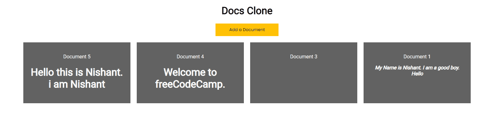

如果我们单击任何文档，它都会打开，我们可以根据需要编辑它们。

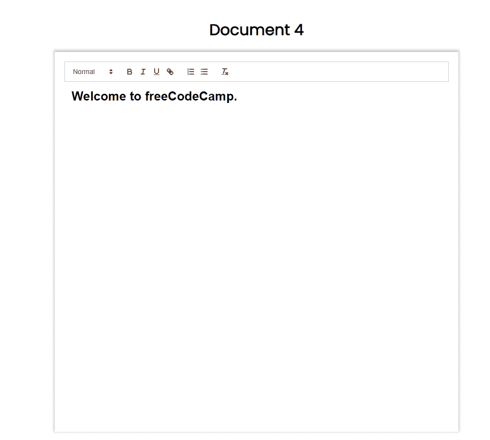

最神奇的是，我们可以实时编辑文档。这意味着，如果两个人正在处理同一个文档，他们的进度将在两个实例中反映出来。

但是在我们开始之前，请确保您已经在系统中安装了节点。如果没有，请到[https://nodejs.org/en/download/](https://nodejs.org/en/download/)下载并安装。

如果你想看视频，我的 YouTube 频道上有这个教程:

[https://www.youtube.com/embed/7ZnjKIYVJsE?feature=oembed](https://www.youtube.com/embed/7ZnjKIYVJsE?feature=oembed)

## 基本项目设置

让我们首先使用下面的命令创建一个 React 应用程序:

```
npx create-react-app google-docs-clone
```

这将把所有软件包和依赖项安装到本地文件夹中。

然后，只需导航到项目文件夹并运行 **npm start** 来运行应用程序。

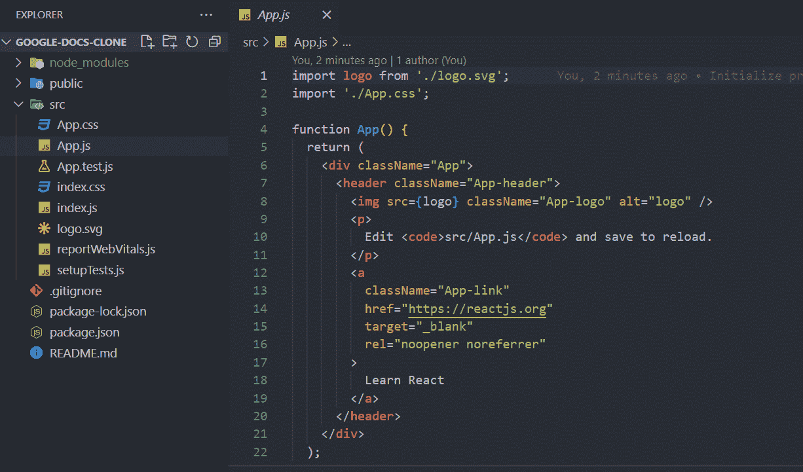

我们将在这里看到所有这些需要删除的代码。我们将从一张空白的画布开始。

接下来创建一个名为 components 的文件夹。在这个文件夹中，我们创建一个名为 **docs.js** 的文件。

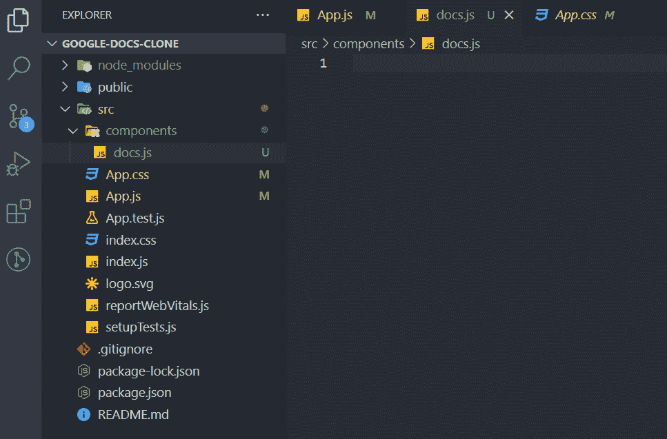

使该组件成为功能组件，如下所示:

```
import React from 'react'

export default function Docs() {
  return (
    <div>
        <h1>docs</h1>
    </div>
  )
} 
```

现在，将这个文件导入到主 **App.js** 文件中。

```
import './App.css';
import Docs from './components/docs';

function App() {
  return (
    <Docs />
  );
}

export default App; 
```

我们会在屏幕上看到这样的输出:


Google docs clone showing output "docs" in upper left corner

现在，让我们把标题放在中间。所以在 docs.js 中，给 main **div** 一个类名 **docs-main** 。

```
import React from 'react'

export default function Docs() {
  return (
    <div className='docs-main'>
        <h1>Docs Clone</h1>
    </div>
  )
} 
```

并在 **App.css** 文件中，添加如下样式:

```
.docs-main{
    text-align: center;
}
```

现在我们的应用程序看起来像这样:


Google docs clone with title in center

现在，我们需要一个按钮来添加我们的文档。所以，让我们用下面的代码创建它:

```
import React from 'react'

export default function Docs() {
  return (
    <div className='docs-main'>
        <h1>Docs Clone</h1>

        <button className='add-docs'>
            Add a Document
        </button>
    </div>
  )
} 
```

CSS 看起来像这样:

```
.add-docs{
    height: 40px;
    width: 200px;
    background-color: #ffc107;
    border: none;
    cursor: pointer;
}
```

让我们从谷歌字体中导入一些字体。将它放在 CSS 文件的顶部:

```
@import url('https://fonts.googleapis.com/css2?family=Poppins&family=Roboto&display=swap');
```

```
@import url('https://fonts.googleapis.com/css2?family=Poppins&family=Roboto&display=swap');

.docs-main{
    text-align: center;
    font-family: 'Roboto', sans-serif;
}

.add-docs{
    height: 40px;
    width: 200px;
    background-color: #ffc107;
    border: none;
    cursor: pointer;
    font-family: 'Poppins', sans-serif;
}
```

要添加字体，只需在各自的类名中添加即可。

## 如何安装材料用户界面

要安装 Material UI，只需键入下面的命令。如果你想阅读文档，去 https://mui.com/看看。

```
npm install @mui/material @emotion/react @emotion/styled
```

现在，让我们为模型再创建一个组件。我们将使用这个模式向 Firebase 数据库添加文档。

```
import * as React from 'react';
import Box from '@mui/material/Box';
import Button from '@mui/material/Button';
import Typography from '@mui/material/Typography';
import Modal from '@mui/material/Modal';

const style = {
    position: 'absolute',
    top: '50%',
    left: '50%',
    transform: 'translate(-50%, -50%)',
    width: 400,
    bgcolor: 'background.paper',
    border: '2px solid #000',
    boxShadow: 24,
    p: 4,
};

export default function Modal() {
    const [open, setOpen] = React.useState(false);
    const handleOpen = () => setOpen(true);
    const handleClose = () => setOpen(false);

    return (
        <div>
            <Modal
                open={open}
                onClose={handleClose}
                aria-labelledby="modal-modal-title"
                aria-describedby="modal-modal-description"
            >
                <Box sx={style}>
                    <Typography id="modal-modal-title" variant="h6" component="h2">
                        Text in a modal
                    </Typography>
                    <Typography id="modal-modal-description" sx={{ mt: 2 }}>
                        Duis mollis, est non commodo luctus, nisi erat porttitor ligula.
                    </Typography>
                </Box>
            </Modal>
        </div>
    );
} 
```

这是一个来自 Material UI 的简单模态组件。现在我们必须将这个组件导入到 Docs.js 组件中。

我们需要把一些东西从 Modal.js 移到 Docs.js。

```
const [open, setOpen] = React.useState(false);
const handleOpen = () => setOpen(true);
```

如果我们单击“添加文档”按钮，将使用以下功能打开模式:

```
import React, { useState } from 'react';
import Modal from './Modal';

export default function Docs() {
    const [open, setOpen] = React.useState(false);
    const handleOpen = () => setOpen(true);
    return (
        <div className='docs-main'>
            <h1>Docs Clone</h1>

            <button
                className='add-docs'
                onClick={handleOpen}
            >
                Add a Document
            </button>

            <Modal
                open={open}
                setOpen={setOpen}
            />
        </div>
    )
} 
```

因此，将这些函数和状态作为道具传递给模态组件并接收它们。

```
import * as React from 'react';
import Box from '@mui/material/Box';
import Button from '@mui/material/Button';
import Typography from '@mui/material/Typography';
import Modal from '@mui/material/Modal';

const style = {
    position: 'absolute',
    top: '50%',
    left: '50%',
    transform: 'translate(-50%, -50%)',
    width: 400,
    bgcolor: 'background.paper',
    border: '2px solid #000',
    boxShadow: 24,
    p: 4,
};

export default function ModalComponent({
    open,
    setOpen,
}) {
    const handleClose = () => setOpen(false);

    return (
        <div>
            <Modal
                open={open}
                onClose={handleClose}
                aria-labelledby="modal-modal-title"
                aria-describedby="modal-modal-description"
            >
                <Box sx={style}>
                    <Typography id="modal-modal-title" variant="h6" component="h2">
                        Text in a modal
                    </Typography>
                    <Typography id="modal-modal-description" sx={{ mt: 2 }}>
                        Duis mollis, est non commodo luctus, nisi erat porttitor ligula.
                    </Typography>
                </Box>
            </Modal>
        </div>
    );
} 
```

现在，这是我们的页面在模态下的样子:

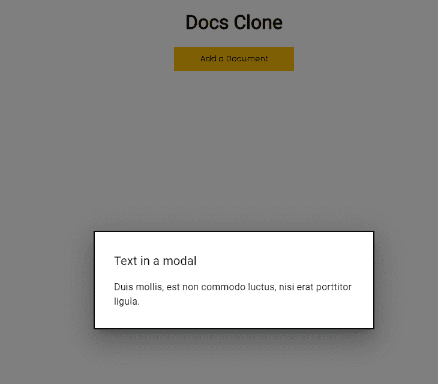

Google docs clone page with model showing

让我们在模态中添加一个输入，作为文件名。

```
<Modal
                open={open}
                onClose={handleClose}
                aria-labelledby="modal-modal-title"
                aria-describedby="modal-modal-description"
            >
                <Box sx={style}>
                    <input
                        placeholder='Add the Title'
                        className='add-input'
                    />
                </Box>
            </Modal>
```

下面就给它一些风格吧:

```
.add-input{
    width: 95%;
    height: 40px;
    outline: none;
    border: 1px solid #676767;
    border-radius: 0px;
    padding: 10px;
    font-family: 'Poppins', sans-serif;
}
```

现在，这是我们的模型的样子:

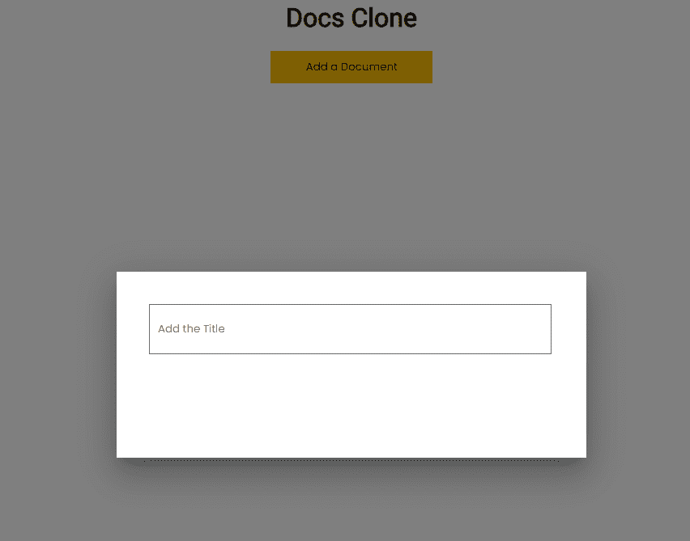

Modal with styling added

让我们也添加一个按钮。我们可以复制“添加文档”按钮。

```
import * as React from 'react';
import Box from '@mui/material/Box';
import Button from '@mui/material/Button';
import Typography from '@mui/material/Typography';
import Modal from '@mui/material/Modal';

const style = {
    position: 'absolute',
    top: '50%',
    left: '50%',
    transform: 'translate(-50%, -50%)',
    width: 500,
    height: 150,
    bgcolor: 'background.paper',
    boxShadow: 24,
    p: 5,
};

export default function ModalComponent({
    open,
    setOpen,
}) {
    const handleClose = () => setOpen(false);

    return (
        <div>
            <Modal
                open={open}
                onClose={handleClose}
                aria-labelledby="modal-modal-title"
                aria-describedby="modal-modal-description"
            >
                <Box sx={style}>
                    <input
                        placeholder='Add the Title'
                        className='add-input'
                    />
                    <div className='button-container'>
                        <button
                            className='add-docs'
                        >
                            Add
                        </button>
                    </div>
                </Box>
            </Modal>
        </div>
    );
} 
```

CSS 看起来像这样:

```
.button-container{
    text-align: center;
    margin: 30px;
}
```

这是它现在的样子:

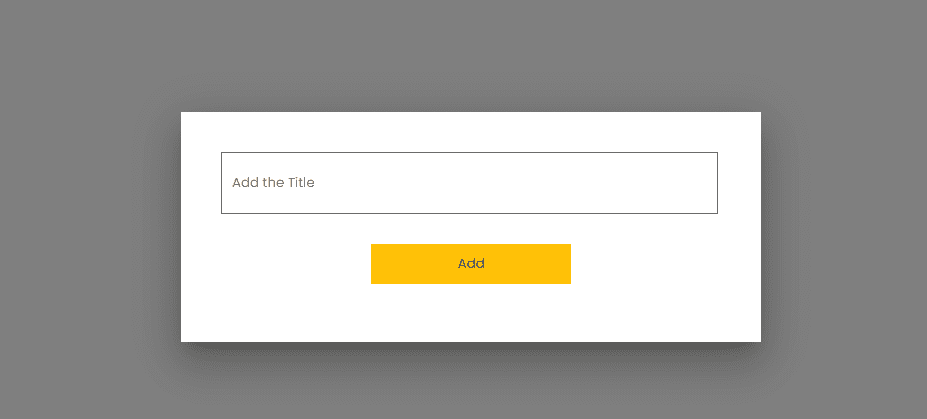

Modal with styling and button added

## 如何将 Firebase 添加到我们的应用程序

现在，让我们为数据库安装 Firebase。只需使用以下命令安装 Firebase:

```
npm install firebase
```

前往[https://firebase.google.com/](https://firebase.google.com/)，点击右上角的“前往控制台”。


然后，单击添加项目。

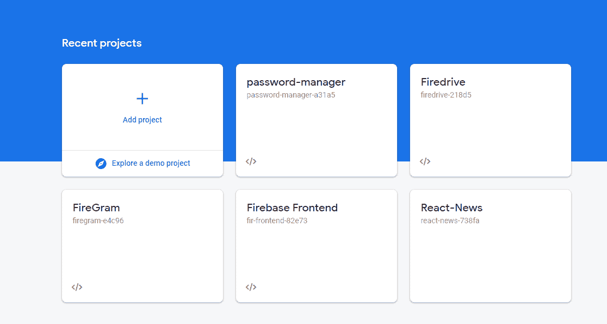

创建项目后，单击 code 按钮在 Firebase 中创建一个 web 应用程序。给它一个名字，我们就可以开始了。


现在，我们将添加所有这些必须存储在 React 应用程序中的配置数据。因此，创建一个名为 **firebaseConfig.js** 的文件并添加它们。

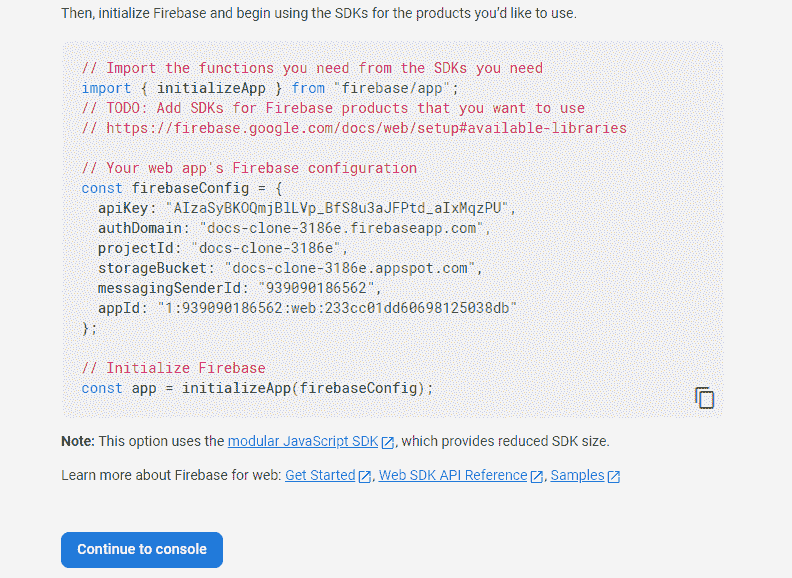

我们将需要数据库，所以让我们初始化它。另外，导出 const 应用程序和数据库，如下所示:

```
import { initializeApp } from "firebase/app";
import { getFirestore } from 'firebase/firestore';

const firebaseConfig = {
  //Your Firebase Data
};

export const app = initializeApp(firebaseConfig);
export const database = getFirestore(app)
```

将 app 和数据库导入到 **App.js** 文件中。并将数据库作为道具传递给 Docs 组件。我们稍后将使用它向 Firebase Firestore 添加数据。

```
import './App.css';
import Docs from './components/docs';
import { app, database } from './firebaseConfig';

function App() {
  return (
    <Docs database={database}/>
  );
}

export default App; 
```

和文档组件中。另外，让我们接收从 props 导出的数据库。

```
import React, { useState } from 'react';
import Modal from './Modal';

export default function Docs({
    database
}) {
    const [open, setOpen] = React.useState(false);
    const handleOpen = () => setOpen(true);
    return (
        <div className='docs-main'>
            <h1>Docs Clone</h1>

            <button
                className='add-docs'
                onClick={handleOpen}
            >
                Add a Document
            </button>

            <Modal
                open={open}
                setOpen={setOpen}
            />
        </div>
    )
} 
```

现在，让我们配置我们的 Firestore 数据库。

从左侧栏转到 Firestore 数据库，然后单击创建数据库。


我们将在生产模式下启动数据库。因此，单击下一步，然后启用。


我们必须公开安全规则，只是暂时的。因此，单击顶部选项卡上的 Rules 并编辑以下规则。这意味着任何人都可以写入或读取数据，即使没有身份验证。

```
rules_version = '2';
service cloud.firestore {
  match /databases/{database}/documents {
    match /{document=**} {
      allow read, write;
    }
  }
}
```

## 如何将文档数据添加到 firestorm 数据库

现在，让我们实际添加我们的数据。但在此之前，我们需要从输入字段获取数据。

因此，在 Docs 组件中，创建一个保存这些数据的状态。

```
const [title, setTitle] = useState('')
```

将标题和 setTitle 传递给模态组件。

```
<Modal
                open={open}
                setOpen={setOpen}
                title={title}
                setTitle={setTitle}
            />
```

接收它们作为道具，并在输入字段中设置它们。

```
import * as React from 'react';
import Box from '@mui/material/Box';
import Button from '@mui/material/Button';
import Typography from '@mui/material/Typography';
import Modal from '@mui/material/Modal';

const style = {
    position: 'absolute',
    top: '50%',
    left: '50%',
    transform: 'translate(-50%, -50%)',
    width: 500,
    height: 150,
    bgcolor: 'background.paper',
    boxShadow: 24,
    p: 5,
};

export default function ModalComponent({
    open,
    setOpen,
    title, 
    setTitle
}) {
    const handleClose = () => setOpen(false);

    return (
        <div>
            <Modal
                open={open}
                onClose={handleClose}
                aria-labelledby="modal-modal-title"
                aria-describedby="modal-modal-description"
            >
                <Box sx={style}>
                    <input
                        placeholder='Add the Title'
                        className='add-input'
                        onChange={(event) => setTitle(event.target.value)}
                        value={title}
                    />
                    <div className='button-container'>
                        <button
                            className='add-docs'
                        >
                            Add
                        </button>
                    </div>
                </Box>
            </Modal>
        </div>
    );
} 
```

现在，如果我们在输入中键入一些东西，它将被存储在 **title** 状态中。

接下来，我们需要一个函数来触发添加数据函数，所以让我们创建它。

在 Docs.js 中，创建一个函数并将其传递给模态组件:

```
const addData = () => {

}
```

在模态组件中接收它，并简单地将其绑定到 Add 按钮，如下所示:

```
<div className='button-container'>
                        <button
                            className='add-docs'
                            onClick={addData}
                        >
                            Add
                        </button>
                    </div>
```

现在，当我们单击 Add 按钮时， **addData** 函数将会运行。

现在，为了从 React 向 Firebase 动态发送数据，让我们从 Firebase Firestore 导入一些内容:

```
import { addDoc, collection } from 'firebase/firestore';
```

这里，我们将使用`collection`在 Firebase 中创建一个数据集合，addDoc 将向该集合添加数据。

让我们首先创建一个集合引用。它将获取我们从 **firebaseConfig.js** 中获得的数据库以及我们想要使用的集合的名称。

```
const collectionRef = collection(database, 'docsData')
```

现在，在 addData 函数中，让我们使用 **addDoc** 。这个 **addDoc** 函数将接受集合引用和数据本身。

```
const addData = () => {
        addDoc(collectionRef, {
            title: title
        })
        .then(() => {
            alert('Data Added')
        })
        .catch(() => {
            alert('Cannot add data')
        })
    }
```

现在，在文本输入中添加一些内容，然后单击 add。它将被添加到 Firebase Firestore 中，并带有数据已添加的警告。但是如果失败，我们将得到“无法添加数据”

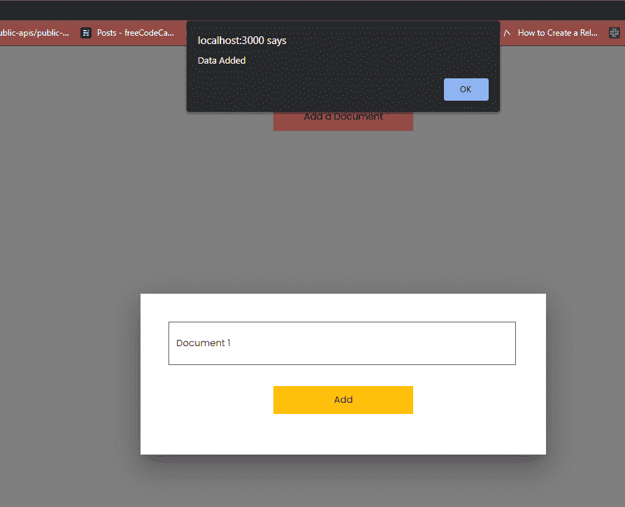

如果我们刷新数据库，我们会看到这个新条目:

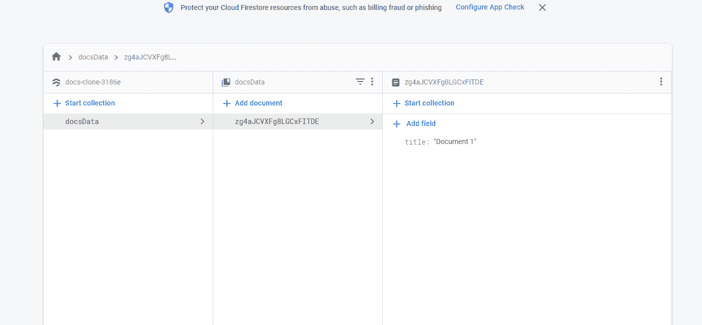

这就是我们添加数据的方式。让我们在添加数据后关闭模态。

创建一个函数 handleClose，在 **addData** 函数中的 **then** 块之后调用这个函数。

```
const addData = () => {
        addDoc(collectionRef, {
            title: title
        })
        .then(() => {
            alert('Data Added');
            handleClose()
        })
        .catch(() => {
            alert('Cannot add data')
        })
    }
```

## 如何从 Firebase 中读取数据

现在，让我们来读一下添加到 Firebase 中的数据。为此，我们将需要 **onSnapshot** 函数。onSnapshot 功能实时获取数据。

首先，像这样从 Firebase 导入它:

```
import { addDoc, collection, onSnapshot } from 'firebase/firestore';
```

然后，创建一个函数 **getData** ，它将在页面加载时被触发。因此，我们将把这个快照放到 React **useEffect** 钩子中。

```
const getData = () => {
        onSnapshot(collectionRef, (data) => {
            console.log(data.docs.map((doc) => {
                return {...doc.data(), id: doc.id}
            }))
        })
    }
```

然后，在 useEffect 钩子内部调用这个函数。

```
useEffect(() => {
        getData()
    }, [])
```

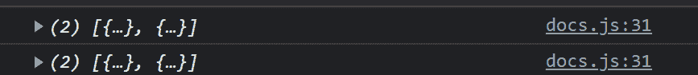

但是如你所见，我们得到了两次数据。那是因为我们用的是 React 版本 18，包含了**并发渲染**。这就是为什么 useEffect 钩子会运行两次的原因。

为了解决这个问题，我们需要创建一个 **useRef** 引用。

```
const isMounted = useRef()
```

然后在 useEffect 钩子中，我们要检查 isMounted.current 是否为 true。所以，如果是真的，我们什么都不会返回。然后我们将 isMounted.current 设置为 true，然后调用 getData 函数。

```
useEffect(() => {
        if(isMounted.current){
            return 
        }

        isMounted.current = true;
        getData()
    }, [])
```

如果我们现在刷新页面，我们将只获得一次数据。

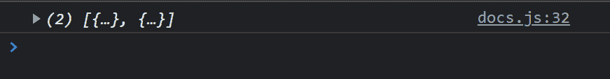

现在，我们必须将这些数据包含在数组状态中。所以，让我们开始吧。

创建一个状态 **docsData** 。

```
 const [docsData, setDocsData] = useState([]);
```

并使用 **setDocsData** 设置该状态中的输入数据。

```
const getData = () => {
        onSnapshot(collectionRef, (data) => {
            setDocsData(data.docs.map((doc) => {
                return {...doc.data(), id: doc.id}
            }))
        })
    }
```

现在，让我们映射数组，以便在 UI 中显示数据。

```
<div>
                {docsData.map((doc) => {
                    return (
                        <div>
                            <p>{doc.title}</p>
                        </div>
                    )
                })}
            </div>
```

这将显示我们的 React 应用程序中的所有数据。

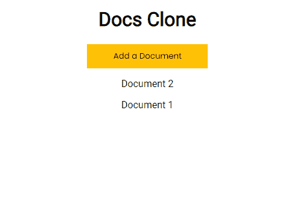

我们将在页面上看到这两个文档。但是让我们让它们出现在一个网格中。给 div 容器取类名 **grid-main** 和 **grid-child** 。

```
<div className='grid-main'>
                {docsData.map((doc) => {
                    return (
                        <div className='grid-child'>
                            <p>{doc.title}</p>
                        </div>
                    )
                })}
            </div>
```

在 CSS 中，添加以下类:

```
.grid-main{
    display: grid;
    grid-template-columns: auto auto auto auto;
    color: whitesmoke;
    margin-top: 20px;
    gap: 20px;
    justify-content: center;
}

.grid-child{
    padding: 20px;
    background-color: rgb(98, 98, 98);
    width: 300px;
    cursor: pointer;
}
```

现在，我们的应用程序看起来像这样:

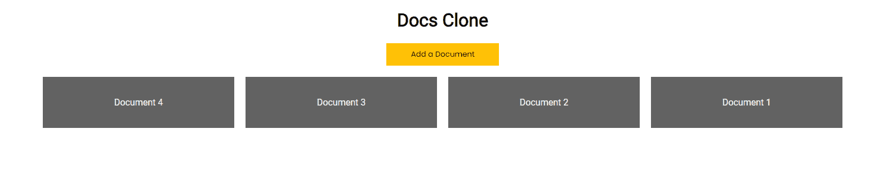

## 如何获取 ID 并重定向到编辑文档页面

现在，上面的每样东西都有一个 ID。我们将使用这些 id 重定向到另一个页面，在那里我们可以编辑项目和编写我们的主要内容。

为此，我们需要两个包。一个是重定向我们的反应路由器，另一个是我们编辑的反应羽毛笔。像这样安装它们:

```
npm i react-quill react-router-dom@6
```

现在，让我们配置到另一个页面的路由。但是我们首先需要另一页。所以，让我们来创造它。

创建一个名为 **EditDocs 的组件。**使其成为功能组件。

```
import React from 'react'

export default function EditDocs() {
  return (
    <div>EditDocs</div>
  )
} 
```

要配置路由，请访问该应用的入口点 **index.js** 。将< App / >包裹在**浏览器**内。

```
import React from 'react';
import ReactDOM from 'react-dom/client';
import './index.css';
import App from './App';
import reportWebVitals from './reportWebVitals';
import { BrowserRouter } from "react-router-dom";

const root = ReactDOM.createRoot(document.getElementById('root'));
root.render(
  <React.StrictMode>
    <BrowserRouter>
      <App />
    </BrowserRouter>
  </React.StrictMode>
);

// If you want to start measuring performance in your app, pass a function
// to log results (for example: reportWebVitals(console.log))
// or send to an analytics endpoint. Learn more: https://bit.ly/CRA-vitals
reportWebVitals(); 
```

现在，我们可以在任何地方使用路由，因为我们在基本级别声明了 BrowserRouter。

现在，来看一下 **App.js** 文件。从 React-Router 导入路由**和路由**。我们还在 **editDocs 路径**中添加了 id，这样我们就可以在地址栏中看到 ID。

```
import { Routes, Route } from "react-router-dom";
```

```
import './App.css';
import Docs from './components/docs';
import EditDocs from './components/EditDocs';
import { Routes, Route } from "react-router-dom";
import { app, database } from './firebaseConfig';

function App() {
  return (
    <Routes>
      <Route path="/" element={<Docs database={database} />} />
      <Route path="/editDocs/:id" element={<EditDocs database={database}/>} />
    </Routes>
  );
}

export default App; 
```

并添加以下路线。如果我们转到 **'/editDocs/:id'** ，我们将看到我们的 editDocs 页面。

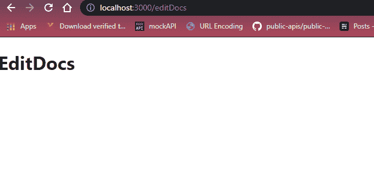

现在，我们需要从文档中获取特定的 ID，并将其发送到 editDocs 页面。

创建一个函数 getID，并将该函数分配给文档。

```
const getID = () => {

}
```

```
<div className='grid-main'>
                {docsData.map((doc) => {
                    return (
                        <div className='grid-child' onClick={() => getID(doc.id)}>
                            <p>{doc.title}</p>
                        </div>
                    )
                })}
            </div>
```

现在，如果我们单击文档，如果我们在控制台中记录它，我们将获得它的 ID。

```
const getID = (id) => {
        console.log(id)
    }
```

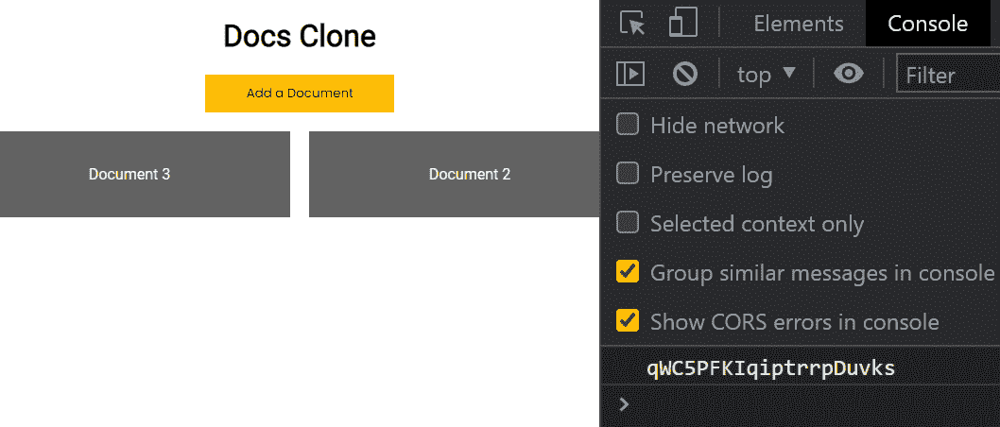

现在，让我们使用 **useNavigate** 将这个 ID 发送到 editDocs 页面。

首先，从 react-router 导入 useNavigate 。

```
import { useNavigate } from 'react-router-dom';
```

然后，创建 useNavigate 的一个实例，如下所示:

```
let navigate = useNavigate();
```

然后，要传递 ID，只需这样做。我们将把自己和 ID 一起发送到 editDocs 页面。

```
const getID = (id) => {
        navigate(`/editDocs/${id}`)
}
```

现在，让我们在另一端接收我们的 ID。在 editDocs 组件中，我们需要从 react-router 中**使用参数**。

因此，导入它并创建一个实例:

```
import { useParams } from 'react-router-dom';

let params = useParams();
```

此外，如果我们安慰它，我们会看到 ID。

```
import { useParams } from 'react-router-dom';

let params = useParams();
console.log(params)
```

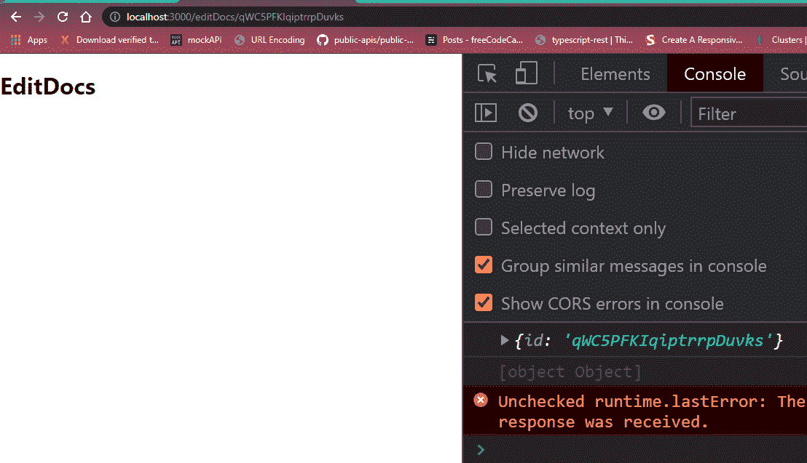

我们可以看到，我们在地址栏以及控制台中获得了 ID。

现在，让我们将 **React Quill** 添加到我们的 editDocs 页面。

```
import React from 'react';
import { useParams } from 'react-router-dom';
import ReactQuill from 'react-quill';
import 'react-quill/dist/quill.snow.css';
export default function EditDocs() {
    let params = useParams();
    return (
        <div>
            <h1>EditDocs</h1>

            <ReactQuill />
        </div>
    )
} 
```

我们必须进口反应管和 CSS。

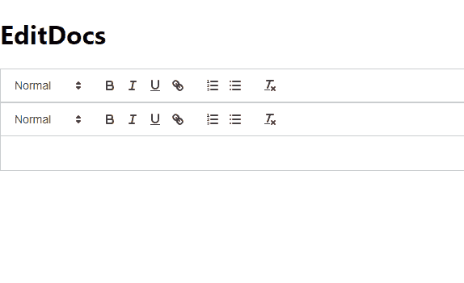

但是我们可以看到这里有两个工具栏。要解决这个问题，只需移除 **React。来自 **index.js** 的 StrictMode** 。

```
import React from 'react';
import ReactDOM from 'react-dom/client';
import './index.css';
import App from './App';
import reportWebVitals from './reportWebVitals';
import { BrowserRouter } from "react-router-dom";

const root = ReactDOM.createRoot(document.getElementById('root'));
root.render(
  <BrowserRouter>
    <App />
  </BrowserRouter>
);

// If you want to start measuring performance in your app, pass a function
// to log results (for example: reportWebVitals(console.log))
// or send to an analytics endpoint. Learn more: https://bit.ly/CRA-vitals
reportWebVitals(); 
```

我们会没事的。

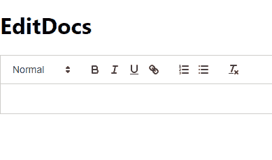

现在，我们需要 React Quill 数据的状态。所以，让我们来创造它。此外，我们将创建一个在我们输入时触发的函数。

```
const [docsDesc, setDocsDesc] = useState('');
    const getQuillData = () => {

    }
```

现在，让我们绑定函数和状态来反应 Quill。

```
<ReactQuill
   value={docsDesc}
   onChange={getQuillData}
/>
```

在 **getQuillData** 函数中，让我们使用 **setDocsDesc** 函数将值绑定到 **docsDesc** 状态。

```
const getQuillData = (value) => {
        setDocsDesc(value)
    }
```

我们到此为止。您可以通过控制台检查此 docsDesc 状态。

现在我们有了 ID 和可以用来更新文档的数据。所以，让我们开始吧。

## 如何更新文档

我们需要两样东西， **updateDoc** 和**集合**函数。我们将使用一个去抖函数来调用 updateDoc 函数。这意味着当我们完成输入，5 或 10 秒后，我们的 updateDoc 函数将运行。

那么，让我们创建一个函数:

```
const updateDocsData = () => {

}
```

我们还需要指定集合。为此，我们需要来自 **App.js.** 的**数据库**，因此，让我们使用 props 来获得它。

```
<Route path="/editDocs/:id" element={<EditDocs database={database}/>} />
```

现在，让我们创建一个集合引用。

```
const collectionRef = collection(database, 'docsData')
```

现在为了去抖动，我们需要一个 useEffect 钩子中的 **updateDocsData** 。

```
useEffect(() => {
        const updateDocsData = () => {

        }
 }, [])
```

现在，让我们添加一个带有间隔的 setTimeout 函数。这意味着函数将在指定的时间间隔后运行。使间隔**为 1000 毫秒**，或 **1 秒**。

```
useEffect(() => {
    const updateDocsData = setTimeout(() => {

    }, 1000)  
    return () => clearTimeout(updateDocsData)
  }, [])
```

现在，在 setTimeOut 内部，让我们添加 updateDoc 函数。所以在文档变量中，我们从参数中传递了**集合引用**和 **ID** 。然后，updateDoc**T5 将变量 document 作为第一个参数。**

```
const updateDocsData = setTimeout(() => {
            const document = doc(collectionRef, params.id)
            updateDoc(document, {

            })
        }, 1000)
```

让我们也导入 **doc** 函数。它指定使用 ID 作为主键来更新哪个文档。

```
import {
    updateDoc,
    collection,
    doc
} from 'firebase/firestore';
```

现在让我们在 updateDoc 函数中传递第二个参数中的数据。

```
useEffect(() => {
        const updateDocsData = setTimeout(() => {
            const document = doc(collectionRef, params.id)
            updateDoc(document, {
                docsDesc: docsDesc
            })
        }, 1000)
        return () => clearTimeout(updateDocsData)
    }, [])
```

在依赖数组中，添加 **docsDesc 的状态。**因此，当我们输入**，**之后，updateDoc 函数将在 1 秒钟后运行。

```
useEffect(() => {
        const updateDocsData = setTimeout(() => {
            const document = doc(collectionRef, params.id)
            updateDoc(document, {
                docsDesc: docsDesc
            })
            .then(() => {
                alert('Saved')
            })
            .catch(() => {
                alert('Cannot Save')
            })
        }, 1000)
        return () => clearTimeout(updateDocsData)
    }, [docsDesc])
```

所以，在编辑器中输入一些东西，它将被保存在数据库中。

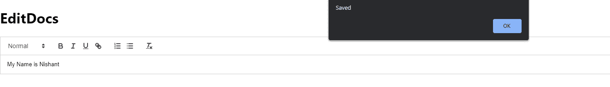

这里的数据是:


如果我们进一步添加内容，我们将追加先前的数据:

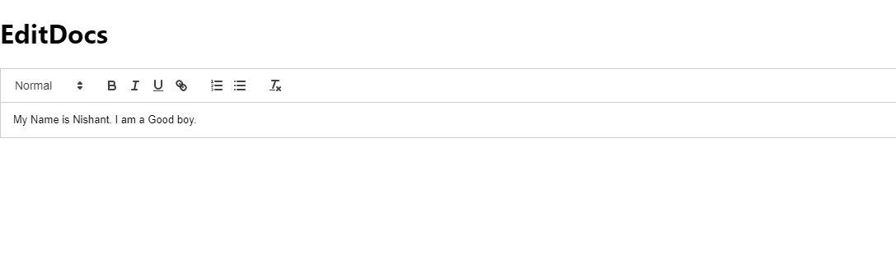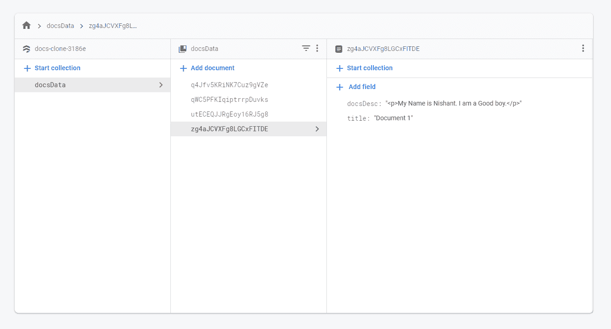

## 如何将数据从数据库返回到编辑器

现在，如果我们返回并单击任何文档，数据将为空或被删除。所以，我们必须从数据库中获取数据，并将其设置到编辑器中。

我们将使用 **onSnapshot** 函数来完成这项工作。

```
import {
    updateDoc,
    collection,
    doc,
    onSnapshot
} from 'firebase/firestore';
```

```
const getData = () => {

    }

    useEffect(() => {
        if(isMounted.current){
            return 
        }

        isMounted.current = true;
        getData()
    }, [])
```

所以，这就像我们在 Docs 组件中所做的一样。我们需要使用 ID 参数指定要获取的数据。然后我们将这个文档传递给 onSnapshot 函数来获取我们需要的数据。

```
const getData = () => {
        const document = doc(collectionRef, params.id)
        onSnapshot(document, (docs) => {
            console.log(docs.data().docsDesc)
        })
    }
```

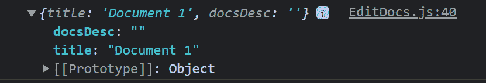

我们来设置这个 **docs.data()。使用 setDocsDesc 处于 docsDesc 状态的 docsDesc** 。因此，如果文档加载，它将被设置在那里。

添加一些数据，然后返回。如果你回到同一个组件，文档描述会在那里。

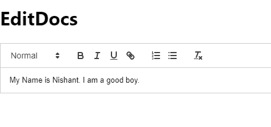

现在，在我们看到所有数据的主页中，我们也需要添加描述，如果它存在的话。

```
 <div dangerouslySetInnerHTML={{__html: doc.docsDesc}} />
```

我们使用 **dangerouslySetInnerHTML** ，因为数据是以标记的形式添加到 React Quill 中的。这使得呈现格式更加容易。

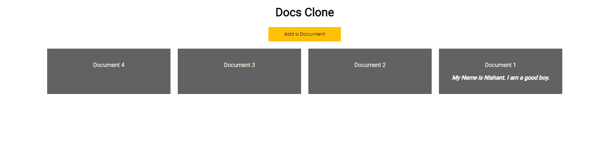

看，我已经添加了一些格式，如**粗体**和**斜体**文本。

现在，我们需要做一些小小的修改。在 App.js 文件(我们添加文档标题的地方)中，我们也添加描述，它最初将是空的。

```
const addData = () => {
        addDoc(collectionRef, {
            title: title,
            docsDesc: ''
        })
        .then(() => {
            alert('Data Added');
            handleClose()
        })
        .catch(() => {
            alert('Cannot add data')
        })
    }
```

因此，如果我们创建一个文档，我们将在 Firestore 文档中拥有 docsDesc。这将防止我们的应用程序在进入 EditDocs 页面时崩溃。

现在，在 EditDocs 页面中，让我们添加文档标题，以便它显示在顶部。创建一个名为 documentTitle 的状态并设置它。

```
const [documentTitle, setDocumentTitle] = useState('')

const getData = () => {
        const document = doc(collectionRef, params.id)
        onSnapshot(document, (docs) => {
            setDocumentTitle(docs.data().title)
            setDocsDesc(docs.data().docsDesc);
        })
    }
```

并将此状态显示在顶部:

```
<h1>{documentTitle}</h1>
```

以下是到目前为止 **EditDocs** 页面的全部代码:

```
import React, { useEffect, useState, useRef } from 'react';
import { useParams } from 'react-router-dom';
import ReactQuill from 'react-quill';
import 'react-quill/dist/quill.snow.css';
import {
    updateDoc,
    collection,
    doc,
    onSnapshot
} from 'firebase/firestore';
export default function EditDocs({
    database
}) {
    const isMounted = useRef()
    const collectionRef = collection(database, 'docsData')
    let params = useParams();
    const [documentTitle, setDocumentTitle] = useState('')
    const [docsDesc, setDocsDesc] = useState('');
    const getQuillData = (value) => {
        setDocsDesc(value)
    }
    useEffect(() => {
        const updateDocsData = setTimeout(() => {
            const document = doc(collectionRef, params.id)
            updateDoc(document, {
                docsDesc: docsDesc
            })
                .then(() => {
                    alert('Saved')
                })
                .catch(() => {
                    alert('Cannot Save')
                })
        }, 1000)
        return () => clearTimeout(updateDocsData)
    }, [docsDesc])

    const getData = () => {
        const document = doc(collectionRef, params.id)
        onSnapshot(document, (docs) => {
            setDocumentTitle(docs.data().title)
            setDocsDesc(docs.data().docsDesc);
        })
    }

    useEffect(() => {
        if (isMounted.current) {
            return
        }

        isMounted.current = true;
        getData()
    }, [])
    return (
        <div>
            <h1>{documentTitle}</h1>

            <ReactQuill
                value={docsDesc}
                onChange={getQuillData}
            />
        </div>
    )
} 
```

## 如何添加一些造型

现在让我们在这个 EditDocs 页面中添加一些样式:

```
<div className='editDocs-main'>
            <h1>{documentTitle}</h1>
            <div className='editDocs-inner'>
                <ReactQuill
                    className='react-quill'
                    value={docsDesc}
                    onChange={getQuillData}
                />
            </div>
        </div>
```

在 CSS 中，添加以下样式:

```
 .editDocs-main {
    font-family: 'Poppins', sans-serif;
    padding: 20px;
    display: flex;
    justify-content: center;
    align-items: center;
    flex-direction: column;
}

.editDocs-inner {
    width: 800px;
    box-shadow: 0px -2px 5px 2px rgba(181, 181, 181, 0.75);
    -webkit-box-shadow: 0px -2px 5px 2px rgba(181, 181, 181, 0.75);
    -moz-box-shadow: 0px -2px 5px 2px rgba(181, 181, 181, 0.75);
    padding: 20px;
    height: 750px;
}

.ql-container.ql-snow {
    border: none !important;
}
```

我们正在添加一个盒子的阴影，我们正在删除反应羽毛笔边界，我们正在把一切居中。

这是我们的“编辑文档”页面现在的样子:

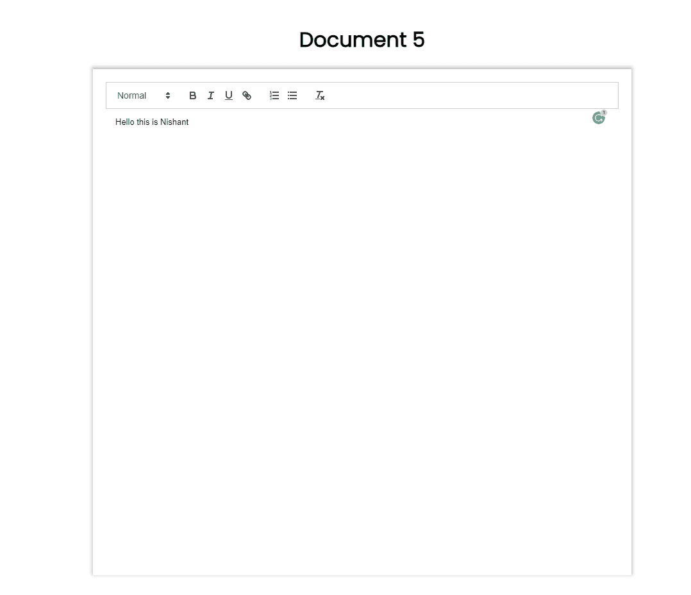

现在是我们的最后一件事:让我们用 toast 消息替换我们的提醒。我们还需要一个叫做[React to stify](https://www.npmjs.com/package/react-toastify)的包。所以，我们来装吧。

```
npm i react-toastify
```

然后我们需要导入这两样东西:

```
import { ToastContainer, toast } from 'react-toastify';
import 'react-toastify/dist/ReactToastify.css';
```

然后，**<>/**组件。

现在，对于祝酒词，只需这样做:

```
useEffect(() => {
        const updateDocsData = setTimeout(() => {
            const document = doc(collectionRef, params.id)
            updateDoc(document, {
                docsDesc: docsDesc
            })
                .then(() => {
                    toast.success('Document Saved', {
                        autoClose: 2000
                    })
                })
                .catch(() => {
                    toast.error('Cannot Save Document', {
                        autoClose: 2000
                    })
                })
        }, 1000)
        return () => clearTimeout(updateDocsData)
    }, [docsDesc])
```

我们有用于成功警告的 **toast.success** ，以及用于错误警告的 **toast.error** 。

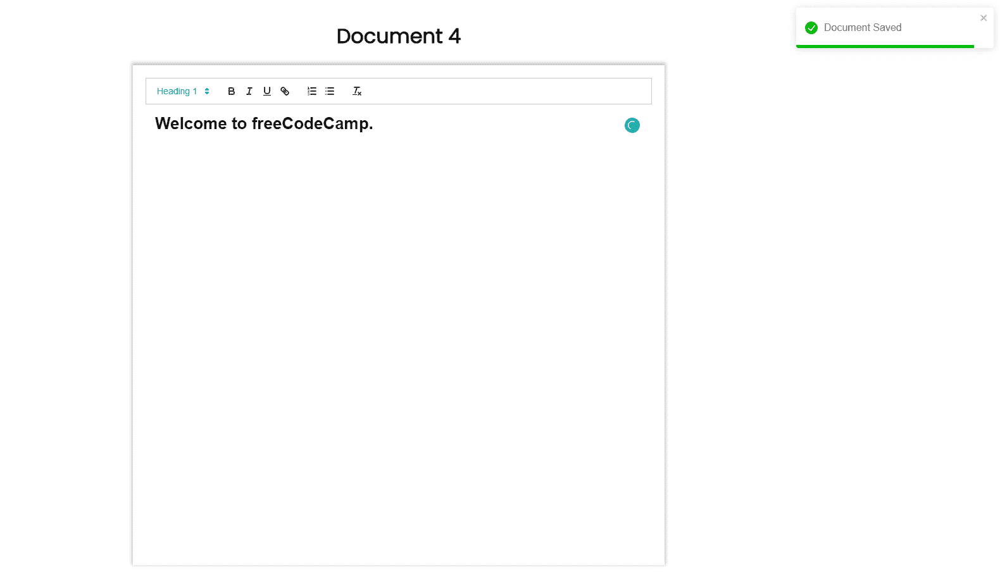

## 结论

现在你有了它，你已经建立了一个谷歌文件的克隆。您可以自由地进行实验并使其变得更好。

你可以在这里得到完整的代码:[https://github.com/nishant-666/Google-Docs-Clone](https://github.com/nishant-666/Google-Docs-Clone)

此外，查看我的频道 [Cybernatico](https://www.youtube.com/c/CybernaticoByNishant) 以获得更多类似的精彩教程。

> 快乐学习。