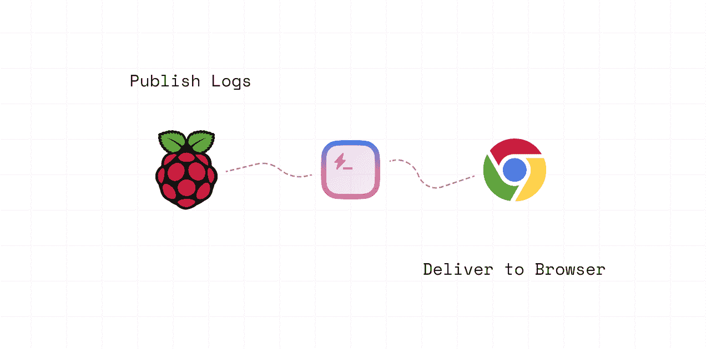
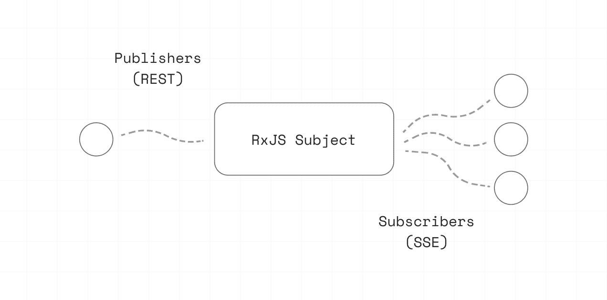
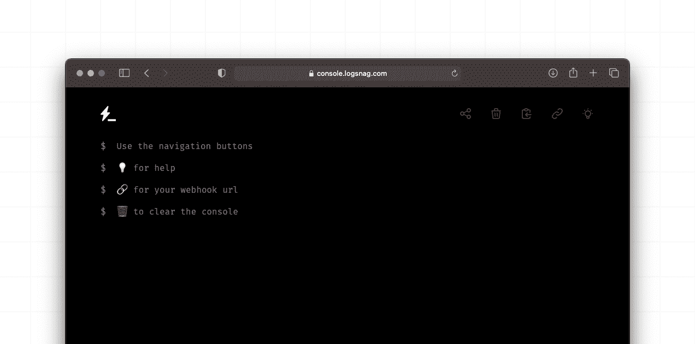

# 如何使用服务器发送的事件、RxJS 和 Express 构建日志 Web 应用程序

> 原文：<https://www.freecodecamp.org/news/build-a-logging-web-app-with-server-sent-events-rxjs-and-express/>

假设你正在开发一个新的好主意——一个网络或移动应用程序，以及一个后端服务器。目前还没什么太复杂的。直到您意识到您需要将数据从您的服务器流式传输到这些客户端。

通常，在做这个的时候，首先想到的是使用一个很酷的产品，比如 WebSockets，SocketIO，或者甚至是一个付费的服务来帮你处理。

但是还有一种方法通常被忽略了，你可能还没听说过。它被称为 SSE，是服务器发送事件的缩写。

SSE 因为简单，在我心中有着特殊的地位。它轻巧、高效、功能强大。

为了详细解释 SSE 和我如何使用它，我将回顾我的一个小项目，我认为它是 SSE 的一个很好的展示。我将使用 Typescript、Express 和 RxJS，所以请准备好您的环境，并在我们即将深入一些代码时系好安全带。

在我们开始之前，您应该知道一些关于 SSE 的事情。顾名思义，服务器发送的事件是从服务器到客户端的单向事件。如果您的客户端需要将数据流回服务器，这可能会成为一个障碍。但在很多场景下并不是这样，我们可以仅仅依靠 REST 向服务器发送数据。

## 是什么项目？

这个项目的想法很简单:我有一堆脚本在 Raspberry Pis、数字海洋上的 droplets 和其他我不容易访问的地方运行。所以我想有一种方法可以打印出日志并在任何地方查看它们。

作为一个解决方案，我想要一个基本的 web 应用程序来推送我的日志，并有一个直接链接到我的会话，我可以在任何设备上打开，甚至与他人分享。

在我们继续之前，有几件事情需要记住。

首先，来自我的脚本的日志并不频繁，对于我的用例来说，使用 HTTP 的开销可以忽略不计。因此，我决定通过一个基本的 REST API 发布我的日志，并在客户端使用 SSE 来订阅传入的日志。



Logging Example

第二，这个工具主要是为了快速调试我正在做的东西。有许多现成的生产工具和企业工具可供我使用。但是我想要非常轻并且容易使用的东西。

## 让我们写一些服务器端代码

服务器端的设置很简单。因此，在详细解释之前，让我们从一个图表开始，给你一个设置的概念。



Server Diagram

如果我们把我们的后端服务器想象成一个管道，在一端我们有一系列的发布者——在我们的例子中，脚本发布日志。另一方面，我们有一些客户端订阅这些日志。

为了连接这两端，我将使用一个 RxJS 主题。它将允许我通过 REST 发布来自发布者的任何内容，然后订阅这些事件，并通过 SSE 将消息转发给客户端。

首先，让我们定义我们的日志接口。为了简单起见，我将只定义一个内容字段来保存我们的日志信息。

```
interface Log {
  content: string;
}
```

### 如何设置 RxJS

让我们导入 RxJS，为我们的日志创建一个新主题，并定义一个函数将我们的日志发布到这个主题。

当然，我们可以导出我们的 Subject 并直接从我们的路由器调用它，但是我更喜欢抽象出实现，只为我的代码的其余部分提供 emit 函数。

```
import { Subject } from 'rxjs';

// Log Subject
const NewLog$ = new Subject<Log>();

/**
 * Emit a new log to the RxJS subject
 * @param log
 */
export function emitNewLog(log: Log): void {
    NewLog$.next(log);
}
```

最后，让我们在我们的 Express 服务器上定义一个新的路由，它将从我们的客户机接收新的日志，并将它们发布到我们刚刚创建的 emitNewLog 方法。

```
app.post('/', (req: Request, res: Response) => {
  const content = req.body.content;
  const log: Log = { content: content };
  emitNewLog(log);
  return res.status(200).json({ ok: true });
});
```

我们现在已经完成了发布方面的工作。剩下的工作是定义我们的 SSE 路线，订阅 RxJS 主题，并将日志交付给我们的客户端。

### 如何设置 SSE 路线

让我们为我们的 SSE 连接定义一个新的路由。为了启用 SSE，我们需要将几个头刷新回我们的客户端。

我们希望将**‘连接’**设置为**‘保持活动’**，**‘缓存控制’**设置为’**无缓存**，**‘内容类型’**设置为**‘文本/事件流’**。这样，我们的客户就会明白这是一条 SSE 路线。

此外，我还为 CORS 添加了**‘访问控制-允许-起源’**，并将**‘X-加速-缓冲’**设置为**‘否’**，以防止 [Nginx](https://www.nginx.com/) 打乱这条路线。最后，我们可以将标头刷新回我们的客户端，以启动事件流。

```
app.get('/', (req: Request, res: Response) => {
  res.setHeader('Cache-Control', 'no-cache');
  res.setHeader('Content-Type', 'text/event-stream');
  res.setHeader('Connection', 'keep-alive');
  res.setHeader('Access-Control-Allow-Origin', '*');
  res.setHeader('X-Accel-Buffering', 'no');
  res.flushHeaders();
});
```

现在，我们可以通过在响应中写入一些内容来开始传输数据。

SSE 提供了一个基于文本的协议，我们可以用它来帮助我们的客户区分事件类型。我们的每一个事件应该如下所示:

```
event: ${event name}\n
data: ${event data}\n\n
```

为了让我的生活简单一点，我创建了一个助手函数来为我们处理序列化。

```
/**
 * SSE message serializer
 * @param event: Event name
 * @param data: Event data
 */
function serializeEvent(event: string, data: any): string {
  const jsonString = JSON.stringify(data);
  return `event: ${event}\ndata: ${jsonString}\n\n`;
}
```

我们现在可以订阅之前创建的 RxJS 主题，序列化每个新日志，并将其作为 **NEW_LOG** 事件写入我们的连接。

```
app.get('/', (req: Request, res: Response) => {
  res.setHeader('Cache-Control', 'no-cache');
  res.setHeader('Content-Type', 'text/event-stream');
  res.setHeader('Connection', 'keep-alive');
  res.setHeader('Access-Control-Allow-Origin', '*');
  res.setHeader('X-Accel-Buffering', 'no');
  res.flushHeaders();

  NewLog$.subscribe((log: Log) => {
    res.write(serializeEvent('NEW_LOG', log));
  });

}
```

最后，当 SSE 连接关闭时，我们必须确保取消订阅我们的观察者。将所有这些放在一起，我们应该有这样的东西:

```
app.get('/', (req: Request, res: Response) => {
  res.setHeader('Cache-Control', 'no-cache');
  res.setHeader('Content-Type', 'text/event-stream');
  res.setHeader('Connection', 'keep-alive');
  res.setHeader('Access-Control-Allow-Origin', '*');
  res.setHeader('X-Accel-Buffering', 'no');
  res.flushHeaders();

  const stream$ = NewLog$.subscribe((log: Log) => {
    res.write(serializeEvent('NEW_LOG', log));
  });

  req.on('close', () => {
    stream$.unsubscribe();
  });
});
```

就是这样！我们已经完成了后端服务器的工作，是时候转到前端代码了。

## 编写客户端代码

在浏览器上订阅我们的 SSE 路线非常简单。首先，让我们转到客户端代码，创建一个新的 **EventSource** 接口实例，并将我们的端点传递给构造函数。

```
const eventSource = new EventSource("/");
```

然后，我们可以为我们想要订阅的事件添加事件监听器(在我们的例子中是 **NEW_LOG** )，并定义一个回调方法来处理我们的日志。

```
eventSource.addEventListener(
   "NEW_LOG", (event) => {
       const log = JSON.parse(event.data);
       // use the data to update the UI
    }, false
);
```

最后，我们可以在监听完这些事件后关闭连接。

```
eventSource.close();
```

## 结论

如您所见，服务器发送的事件使得从服务器向客户端传输内容变得非常容易。它们特别有用，因为我们在大多数现代浏览器中都有一个内置接口，我们可以很容易地为那些没有提供接口的浏览器填充。

此外，SSE 会在客户端与服务器失去连接的情况下自动为我们处理重新连接。因此，在我们需要来自服务器的单向事件流的各种场景中，它是 SocketIO 和 WebSockets 的有效替代方案。

如果你对这个项目进一步感兴趣，我已经在我们刚刚检查过的代码中添加了一些额外的功能和一个 web GUI，你可以在这里查看: [LogSnag 控制台](https://logsnag.com/console)。



Console Demo