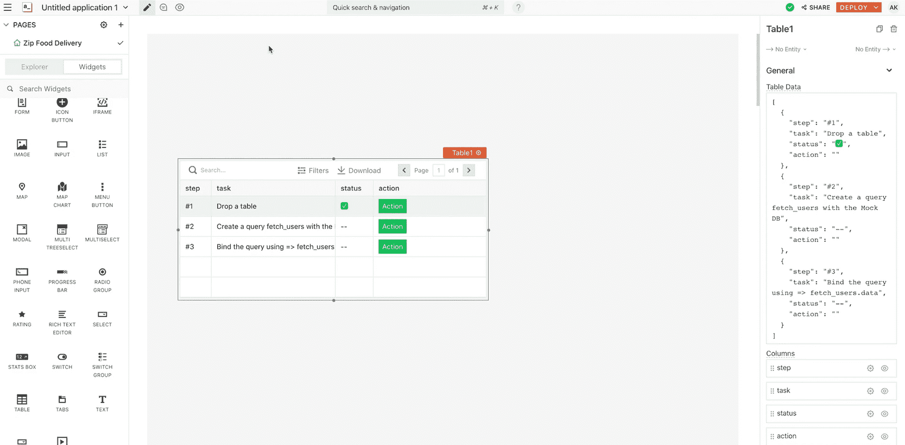

# 为你的创业建立一个低代码仪表板

> 原文：<https://www.freecodecamp.org/news/build-a-low-code-dashboard-for-your-startup/>

创建一个跟踪客户和用户的仪表板比您想象的要容易得多。您可以使用低代码方法构建一个 API 驱动的营销仪表板。

我们刚刚在 freeCodeCamp.org YouTube 频道上发布了一门课程，将教你如何创建一个仪表板来帮助管理你的网站或创业。

在本课程中，您将学习如何使用低代码工具和 API 来构建客户支持仪表板。您将了解如何使用 Appsmith 平台、MongoDB、SMTP API 和 Discord web hook 创建仪表板。

ania ku bow 创建了这个课程。她是一位受欢迎的讲师，在 freeCodeCamp 频道和她自己的 YouTube 频道上发布了许多课程。

您将学习如何通过使用低代码方法快速构建许多初创公司使用的工具。

Appsmith 提供了一笔资助，使这门课程成为可能。

Low-code tool

观看本课程时，如果您已经掌握了 JavaScript 和 HTTP 请求方法的基本知识，将会很有帮助。但是，如果您对这些概念不熟悉，您应该仍然能够理解，因为 Ania 将指导您一步一步地完成这个过程。

以下是本课程涵盖的部分:

*   Appsmith 入门
*   连接到 MongoDB
*   向 Appsmith 应用程序添加数据
*   创建发送消息页面
*   显示不同的市场营销列表
*   实现 Discord web 挂钩

观看 freeCodeCamp.org YouTube 频道的全部课程(2 小时观看)。

[https://www.youtube.com/embed/ccfpj4eD6YM?feature=oembed](https://www.youtube.com/embed/ccfpj4eD6YM?feature=oembed)