# 如何使用 MERN 堆栈构建一个带有动画过渡的多步注册应用程序

> 原文：<https://www.freecodecamp.org/news/build-a-multi-step-registration-app-with-animated-transitions-using-mern-stack/>

在本文中，我们将使用 MERN 堆栈(MongoDB、Express、React 和 Node.js)构建一个令人惊叹的多步注册表单，其中包含平滑的动画过渡。

通过构建此应用程序，您将学习 React 和 Node.js 中的许多概念，包括:

*   如何通过对每个字段进行验证来管理多个表单的数据
*   如何跨路由保留表单数据的值
*   如何更新每个注册步骤的进度指示
*   如何从 API 加载特定于国家的州和城市
*   如何使用一个非常流行的帧运动库创建平滑的滑动动画
*   如何使用 Express.js 创建 Rest APIs
*   如何用 MongoDB 实现登录和注册功能
*   如何在 MongoDB 中存储和验证以加密形式存储的密码

还有更多。

我们将使用 React Hooks 语法在 React 中构建这个应用程序。所以如果你是 React 钩子的新手，可以看看我的[React 钩子介绍](https://levelup.gitconnected.com/an-introduction-to-react-hooks-50281fd961fe?source=friends_link&sk=89baff89ec8bc637e7c13b7554904e54)文章来学习钩子的基础知识。

我们还将使用 MongoDB 数据库来存储注册的用户数据，所以请确保您按照本文中的说明在本地安装 MongoDB。

好吧，我们开始吧。

## 初始项目设置

使用`create-react-app`创建一个新项目:

```
npx create-react-app multi-step-form-using-mern 
```

创建好项目后，删除`src`文件夹中的所有文件，并在`src`文件夹中创建一个`index.js`文件和一个`styles.scss`文件。在`src`文件夹中创建`components`、`router`和`utils`文件夹。

像这样安装必要的依赖项:

```
yarn add axios@0.21.1 bootstrap@4.6.0 react-bootstrap@1.5.0 country-state-city@2.0.0 framer-motion@3.7.0 node-sass@4.14.1 react-hook-form@6.15.4 react-router-dom@5.2.0 sweetalert2@10.15.5 
```

打开你的`styles.scss`文件，把[这里](https://github.com/myogeshchavan97/multi-step-form-using-mern/blob/master/src/styles.scss)的内容添加进去。

我们将使用 SCSS 语法来编写 CSS。所以，如果你是第一次来 SCSS，可以在这里查看我的文章。

## 如何创建初始页面

在`components`文件夹中创建一个新文件`Header.js`，内容如下:

```
import React from 'react';

const Header = () => (
  <div>
    <h1>Multi Step Registration</h1>
  </div>
);

export default Header; 
```

在`components`文件夹中创建一个新文件`FirstStep.js`，内容如下:

```
import React from 'react';

const FirstStep = () => {
  return (
    <div>
      First Step Form
    </div>
  )
};

export default FirstStep; 
```

在`router`文件夹中创建一个新文件`AppRouter.js`，内容如下:

```
import React from 'react';
import { BrowserRouter, Route, Switch } from 'react-router-dom';
import FirstStep from '../components/FirstStep';
import Header from '../components/Header';

const AppRouter = () => (
  <BrowserRouter>
    <div className="container">
      <Header />
      <Switch>
        <Route component={FirstStep} path="/" exact={true} />
      </Switch>
    </div>
  </BrowserRouter>
);

export default AppRouter; 
```

在这个文件中，最初，我们为第一步添加了一个单独的路由。

如果你是 React 路由器的新手，请查看我的免费课程 React 路由器简介。

现在，打开`src/index.js`文件，在其中添加以下内容:

```
import React from 'react';
import ReactDOM from 'react-dom';
import AppRouter from './router/AppRouter';
import 'bootstrap/dist/css/bootstrap.min.css';
import './styles.scss';

ReactDOM.render(<AppRouter />, document.getElementById('root')); 
```

通过运行`yarn start`命令启动应用程序，您将看到以下屏幕:

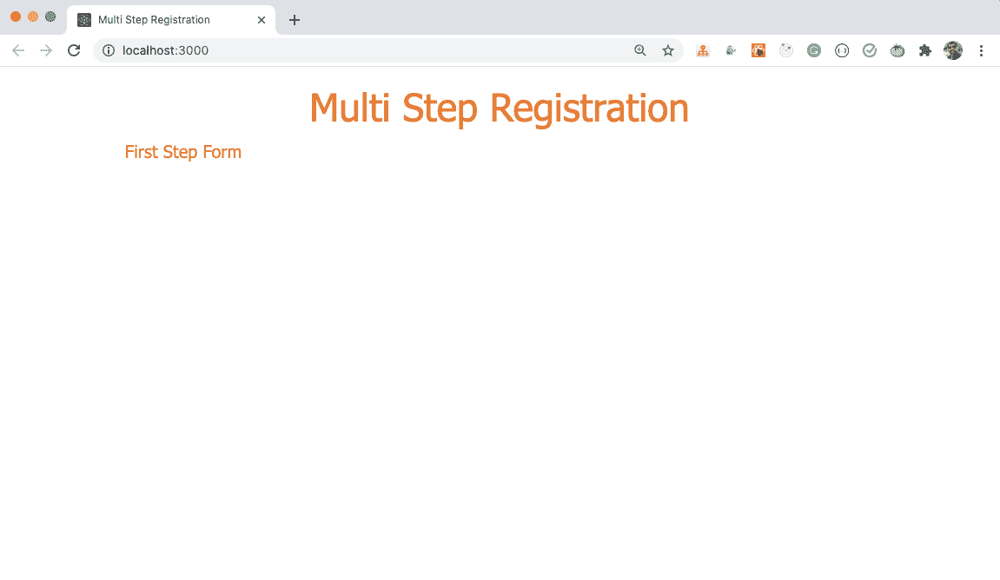

## 如何在标题中添加进度步骤

在`components`文件夹中创建一个名为`Progress.js`的新文件，内容如下:

```
import React from 'react';

const Progress = () => {
  return (
    <React.Fragment>
      <div className="steps">
        <div className="step">
          <div>1</div>
          <div>Step 1</div>
        </div>
        <div className="step">
          <div>2</div>
          <div>Step 2</div>
        </div>
        <div className="step">
          <div>3</div>
          <div>Step 3</div>
        </div>
      </div>
    </React.Fragment>
  );
};

export default Progress; 
```

并在如下所示的`Header.js`文件中使用它:

```
import React from 'react';
import Progress from './Progress';

const Header = () => (
  <div>
    <h1>Multi Step Registration</h1>
    <Progress />
  </div>
);

export default Header; 
```

现在，如果您检查应用程序，您将看到以下屏幕:

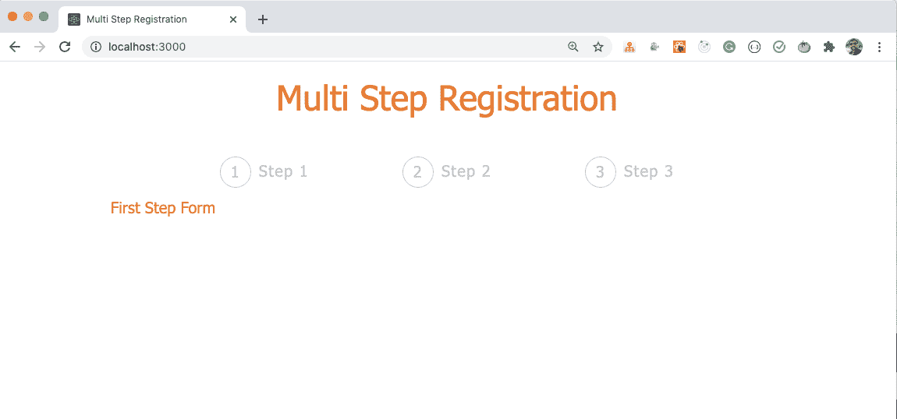

## 如何创建第一步表单

打开`components/FirstStep.js`文件，用以下内容替换其中的内容:

```
import React from 'react';
import { useForm } from 'react-hook-form';
import { Form, Button } from 'react-bootstrap';

const FirstStep = (props) => {
  const { register, handleSubmit, errors } = useForm();

  const onSubmit = (data) => {
    console.log(data);
  };

  return (
    <Form className="input-form" onSubmit={handleSubmit(onSubmit)}>
      <div className="col-md-6 offset-md-3">
        <Form.Group controlId="first_name">
          <Form.Label>First Name</Form.Label>
          <Form.Control
            type="text"
            name="first_name"
            placeholder="Enter your first name"
            autoComplete="off"
            ref={register({
              required: 'First name is required.',
              pattern: {
                value: /^[a-zA-Z]+$/,
                message: 'First name should contain only characters.'
              }
            })}
            className={`${errors.first_name ? 'input-error' : ''}`}
          />
          {errors.first_name && (
            <p className="errorMsg">{errors.first_name.message}</p>
          )}
        </Form.Group>

        <Form.Group controlId="last_name">
          <Form.Label>Last Name</Form.Label>
          <Form.Control
            type="text"
            name="last_name"
            placeholder="Enter your last name"
            autoComplete="off"
            ref={register({
              required: 'Last name is required.',
              pattern: {
                value: /^[a-zA-Z]+$/,
                message: 'Last name should contain only characters.'
              }
            })}
            className={`${errors.last_name ? 'input-error' : ''}`}
          />
          {errors.last_name && (
            <p className="errorMsg">{errors.last_name.message}</p>
          )}
        </Form.Group>

        <Button variant="primary" type="submit">
          Next
        </Button>
      </div>
    </Form>
  );
};

export default FirstStep; 
```

这里，我们使用一个非常流行的 [react-hook-form](https://react-hook-form.com/) 库来轻松管理带有验证的表单。

React-hook-form 使得处理简单和复杂的表单变得非常容易，因为我们不需要自己管理每个输入字段及其`onChange`处理程序的状态。这使得代码更清晰，更容易理解。

点击查看[我的文章，详细了解`react-hook-form`。](https://www.freecodecamp.org/news/build-forms-in-react-with-react-hook-form-library/)

正如你在上面的代码中看到的，要使用`react-hook-form`库，我们需要首先导入并使用`useForm`钩子。

```
 const { register, handleSubmit, errors } = useForm(); 
```

这里，

*   `register`是一个函数，我们将使用它作为由`useForm`钩子提供的`ref`。我们可以将它分配给每个输入字段，这样`react-hook-form`就可以跟踪输入字段值的变化
*   `handleSubmit`是提交表单时我们可以调用的函数
*   `errors`将包含验证错误，如果有的话

在上面的代码中，我们给从`useForm`钩子中得到的每个输入字段赋予了一个`ref`，如下所示:

```
ref={register({
  required: 'First name is required.',
  pattern: {
    value: /^[a-zA-Z]+$/,
    message: 'First name should contain only characters.'
  }
})} 
```

此外，我们添加了传递给`handleSubmit`函数的`onSubmit`函数。

```
<Form className="input-form" onSubmit={handleSubmit(onSubmit)}> 
```

注意，对于每个输入字段，我们已经给了一个唯一的`name`，这是强制性的，因此`react-hook-form`可以跟踪变化的数据。

当我们提交表单时，`handleSubmit`函数将处理表单提交。它会将用户输入的数据发送到我们正在登录到控制台的`onSubmit`函数。

```
const onSubmit = (data) => {  
 console.log(data);
}; 
```

如果有任何错误，我们将像这样显示它们:

```
{errors.first_name && (
  <p className="errorMsg">{errors.first_name.message}</p>
)} 
```

`errors`对象将自动填充属性名，该属性名由赋予每个输入字段的`name`表示(如果有任何错误)。`first_name`在上面的例子中是第一个输入字段的名字。

现在，让我们检查应用程序的功能:


如您所见，用很少的代码，我们就为表单添加了响应验证功能。

## 如何创建第二步表单

现在，在`components`文件夹中创建一个新文件`SecondStep.js`，内容如下:

```
import React from 'react';
import { useForm } from 'react-hook-form';
import { Form, Button } from 'react-bootstrap';

const SecondStep = (props) => {
  const { register, handleSubmit, errors } = useForm();

  const onSubmit = (data) => {
    console.log(data);
  };

  return (
    <Form className="input-form" onSubmit={handleSubmit(onSubmit)}>
      <div className="col-md-6 offset-md-3">
        <Form.Group controlId="first_name">
          <Form.Label>Email</Form.Label>
          <Form.Control
            type="email"
            name="user_email"
            placeholder="Enter your email address"
            autoComplete="off"
            ref={register({
              required: 'Email is required.',
              pattern: {
                value: /^[^@ ]+@[^@ ]+\.[^@ .]{2,}$/,
                message: 'Email is not valid.'
              }
            })}
            className={`${errors.user_email ? 'input-error' : ''}`}
          />
          {errors.user_email && (
            <p className="errorMsg">{errors.user_email.message}</p>
          )}
        </Form.Group>

        <Form.Group controlId="password">
          <Form.Label>Password</Form.Label>
          <Form.Control
            type="password"
            name="user_password"
            placeholder="Choose a password"
            autoComplete="off"
            ref={register({
              required: 'Password is required.',
              minLength: {
                value: 6,
                message: 'Password should have at-least 6 characters.'
              }
            })}
            className={`${errors.user_password ? 'input-error' : ''}`}
          />
          {errors.user_password && (
            <p className="errorMsg">{errors.user_password.message}</p>
          )}
        </Form.Group>

        <Button variant="primary" type="submit">
          Next
        </Button>
      </div>
    </Form>
  );
};

export default SecondStep; 
```

现在，让我们在`AppRouter.js`文件中为`SecondStep`组件添加另一个路由。

```
import React from 'react';
import { BrowserRouter, Route, Switch } from 'react-router-dom';
import FirstStep from '../components/FirstStep';
import Header from '../components/Header';
import SecondStep from '../components/SecondStep';

const AppRouter = () => (
  <BrowserRouter>
    <div className="container">
      <Header />
      <Switch>
        <Route component={FirstStep} path="/" exact={true} />
        <Route component={SecondStep} path="/second" />
      </Switch>
    </div>
  </BrowserRouter>
);

export default AppRouter; 
```

同样，如上所示，在文件顶部导入`SecondStep`组件。

现在，我们已经为第二步添加了一个路由，让我们通过访问 URL[http://localhost:3000/second](http://localhost:3000/second)来检查应用程序。

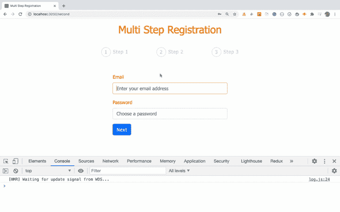

如您所见，功能运行良好，但我们是直接访问`/second`路线。相反，让我们添加代码，以编程方式从步骤 1 重定向到步骤 2。

当我们为`BrowserRouter`中的`Route`提供任何组件时，React Router 会自动将 3 个属性传递给该组件，它们是:

*   历史
*   位置
*   比赛

其中，`history`对象包含一个`push`方法，我们可以用它从一个组件重定向到另一个组件。

所以打开`FirstStep.js`文件，用下面的代码替换`onSubmit`函数:

```
const onSubmit = (data) => {
  console.log(data);
  props.history.push('/second');
}; 
```

这里，对于`push`方法，我们已经提供了需要重定向的路径。

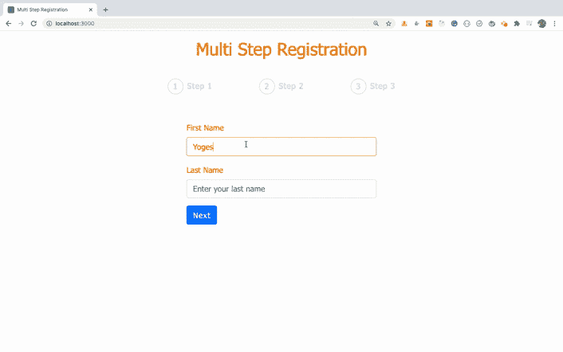

如您所见，当我们在第一步中点击`Next`按钮时，我们被重定向到第二步。

现在，在`utils`文件夹中创建一个新文件`constants.js`，内容如下:

```
export const BASE_API_URL = 'http://localhost:3030'; 
```

这里，我们指定了后端 API 的 URL，所以我们不需要在每个 API 调用中都指定它。我们只需要在需要进行 API 调用时使用这个常量。

现在，让我们在我们的`AppRouter.js`文件中为`ThirdStep`组件添加另一个路由。

```
...
<Switch>
  <Route component={FirstStep} path="/" exact={true} />
  <Route component={SecondStep} path="/second" />
  <Route component={ThirdStep} path="/third" />
</Switch>
... 
```

## 如何从 API 中获取所有国家的列表

在`components`文件夹中创建一个新文件`ThirdStep.js`，内容如下:

```
import React, { useState, useEffect } from 'react';
import { Form, Button } from 'react-bootstrap';
import csc from 'country-state-city';
import axios from 'axios';
import { BASE_API_URL } from '../utils/constants';

const ThirdStep = (props) => {
  const [countries, setCountries] = useState([]);
  const [states, setStates] = useState([]);
  const [cities, setCities] = useState([]);
  const [isLoading, setIsLoading] = useState(false);

  const [selectedCountry, setSelectedCountry] = useState('');
  const [selectedState, setSelectedState] = useState('');
  const [selectedCity, setSelectedCity] = useState('');

  useEffect(() => {
   const getCountries = async () => {
     try {
       const result = await csc.getAllCountries();
       console.log(result);
     } catch (error) {}
    };

    getCountries();
  }, []);

  const handleSubmit = async (event) => {
    event.preventDefault();
  };

  return (
    <Form className="input-form" onSubmit={handleSubmit}>
      <div className="col-md-6 offset-md-3"></div>
    </Form>
  );
};

export default ThirdStep; 
```

在这个文件中，我们使用一个 [country-state-city](https://www.npmjs.com/package/country-state-city) npm 库来获取可用的国家、城市和州的列表，如下所示:

```
import csc from 'country-state-city'; 
```

然后在组件中，我们定义了一些状态:

```
const [countries, setCountries] = useState([]);
const [states, setStates] = useState([]);
const [cities, setCities] = useState([]);
const [isLoading, setIsLoading] = useState(false);

const [selectedCountry, setSelectedCountry] = useState('');
const [selectedState, setSelectedState] = useState('');
const [selectedCity, setSelectedCity] = useState(''); 
```

这里，`countries`、`states`和`cities`分别在存储来自 API 的`countries`、`states`和`cities`列表的状态中声明。

我们添加了另一个`isLoading`状态来跟踪数据加载的时间。当用户选择一个特定的下拉值时，`selectedCountry`、`selectedState`和`selectedCity`将包含所选择的值。

然后我们添加了一个`useEffect`钩子来进行 API 调用，以获取国家列表，如下所示:

```
useEffect(() => {
  ...
  const result = await csc.getAllCountries();
  ...
}, []); 
```

这里，我们调用`country-state-city`库的`getAllCountries`方法来获取可用国家的列表。

请注意，我们已经将一个空数组`[]`作为第二个参数传递给了`useEffect`钩子，这样当组件被挂载时，钩子将只被调用一次。

现在，打开`SecondStep.js`文件，用下面的代码替换`onSubmit`函数:

```
const onSubmit = (data) => {
  console.log(data);
  props.history.push('/third');
}; 
```

使用这段代码，我们可以很容易地导航到`ThirdStep`组件。

现在，让我们检查应用程序。

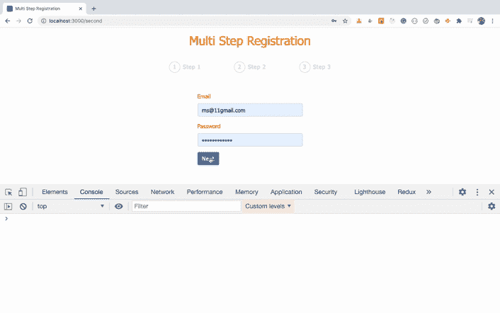

如您所见，在组件加载中，我们在一个对象数组中获得了可用国家的列表。

每个对象都包含一个`isoCode`和`name`属性，我们可以在代码中使用它们在屏幕上显示它。

因此，将`useEffect`挂钩改为下面的代码:

```
useEffect(() => {
  const getCountries = async () => {
    try {
      setIsLoading(true);
      const result = await csc.getAllCountries();
      let allCountries = [];
      allCountries = result?.map(({ isoCode, name }) => ({
        isoCode,
        name
      }));
      const [{ isoCode: firstCountry } = {}] = allCountries;
      setCountries(allCountries);
      setSelectedCountry(firstCountry);
      setIsLoading(false);
    } catch (error) {
      setCountries([]);
      setIsLoading(false);
    }
  };

  getCountries();
}, []); 
```

这里，我们首先将`isLoading`标志设置为`true`,表示数据正在加载，我们很快就会用到。

数组的每个对象包含许多其他属性，如`phonecode`、`flag`、`currency`等等，但我们只想要`isoCode`和`name`。所以我们使用数组映射方法只过滤掉那些属性，如下所示:

```
allCountries = result?.map(({ isoCode, name }) => ({
  isoCode,
  name
})); 
```

这里，我们使用 ES11 可选链接操作符，用`?`表示。只有在前一次引用不是`undefined`或`null`时，才会执行`?`之后的代码。当我们析构`isoCode`和`name`时，我们需要可选的链接操作符。

可选的链接操作符在许多情况下非常有用。你可以在我的《掌握现代 JavaScript》一书中了解更多。

现在我们有了下面的代码:

```
const [{ isoCode: firstCountry } = {}] = allCountries;
setCountries(allCountries);
setSelectedCountry(firstCountry);
setIsLoading(false); 
```

让我们明白我们在这里做什么。

这里，我们用赋值语法在重命名时使用了对象析构。我们正在从对象数组`allCountries`的第一个对象中析构`isoCode`属性，并将`isoCode`属性重命名为`firstCountry`,以标识它是列表中的第一个国家。

我们还分配了一个默认的空对象，这样如果`allCountries`数组为空，我们就不会得到错误。

简而言之，我们是说从对象数组`allCountries`的第一个对象中获取`isoCode`属性，并将其重命名为`firstCountry`。

如果`allCountries`数组的第一个对象中不存在`firstCountry`属性，则将空对象`{}`的默认值赋给`firstCountry`变量。

然后，我们使用下面的代码将`selectedCountry`状态值更新为`firstCountry`值，将`isLoading`状态值更新为`false`:

```
setSelectedCountry(firstCountry);
setIsLoading(false); 
```

现在，在`ThirdStep.js`文件中，更改以下代码:

```
return (
  <Form className="input-form" onSubmit={handleSubmit}>
    <div className="col-md-6 offset-md-3"></div>
  </Form>
); 
```

对于此代码:

```
return (
    <Form className="input-form" onSubmit={handleSubmit}>
      <div className="col-md-6 offset-md-3">
        <Form.Group controlId="country">
          {isLoading && (
            <p className="loading">Loading countries. Please wait...</p>
          )}
          <Form.Label>Country</Form.Label>
          <Form.Control
            as="select"
            name="country"
            value={selectedCountry}
            onChange={(event) => setSelectedCountry(event.target.value)}
          >
            {countries.map(({ isoCode, name }) => (
              <option value={isoCode} key={isoCode}>
                {name}
              </option>
            ))}
          </Form.Control>
        </Form.Group>
      </div>
    </Form>
  ); 
```

我们可以在下拉列表中看到国家列表。

现在，如果您导航到步骤 3，您将看到以下屏幕:

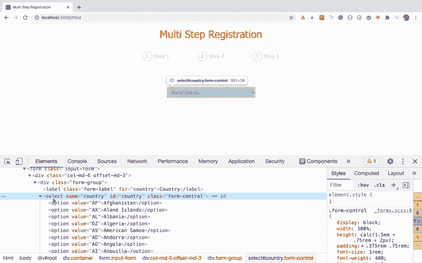

如您所见，country 下拉列表中正确填充了所有国家。当下拉列表值改变时，`selectedCountry`状态也会改变为国家代码(`isoCode`)，正如您在 React dev 工具中所看到的。

## 如何从 API 获取状态列表

现在，让我们添加根据所选国家获取州列表的代码。

在`ThirdStep.js`文件的第一个`useEffect`钩子后添加以下代码。

```
useEffect(() => {
    const getStates = async () => {
      try {
        const result = await csc.getStatesOfCountry(selectedCountry);
        let allStates = [];
        allStates = result?.map(({ isoCode, name }) => ({
          isoCode,
          name
        }));
        console.log({ allStates });
        const [{ isoCode: firstState = '' } = {}] = allStates;
        setCities([]);
        setSelectedCity('');
        setStates(allStates);
        setSelectedState(firstState);
      } catch (error) {
        setStates([]);
        setCities([]);
        setSelectedCity('');
      }
    };

    getStates();
  }, [selectedCountry]); 
```

这里，我们通过将`selectedCountry`作为参数来调用`country-state-city`库中的`getStatesOfCountry`方法。然后根据 API 的结果，我们更新各自的状态，如下所示:

```
setCities([]);
setSelectedCity('');
setStates(allStates);
setSelectedState(firstState); 
```

所有国家、州和城市的下降都是相互关联的。如果我们要更改国家，我们也应该更新州，我们在上面的代码中就是这样做的。

另外，请注意，我们已经将`selectedCountry`作为第二个参数传递给了 dependencies 数组中的`useEffect`钩子:

```
useEffect(() => {
 ...
}, [selectedCountry]); 
```

所以这个效果只会在`selectedCountry`状态改变时运行。这意味着一旦我们更改了 country 下拉列表，我们就发出一个 API 调用来获取仅与该国家相关的州，然后填充该州的下拉列表值。

现在，在国家下拉列表后的第一个`Form.Group`结束标记后添加以下代码:

```
<Form.Group controlId="state">
  <Form.Label>State</Form.Label>
  <Form.Control
    as="select"
    name="state"
    value={selectedState}
    onChange={(event) => setSelectedState(event.target.value)}
  >
    {states.length > 0 ? (
      states.map(({ isoCode, name }) => (
        <option value={isoCode} key={isoCode}>
          {name}
        </option>
      ))
    ) : (
      <option value="" key="">
        No state found
      </option>
    )}
  </Form.Control>
</Form.Group> 
```

这里，我们在屏幕上显示状态下拉菜单。如果所选国家没有州，我们会显示一条`No state found`消息，因为有些国家没有任何州。

现在，如果您检查应用程序，您将看到以下屏幕:

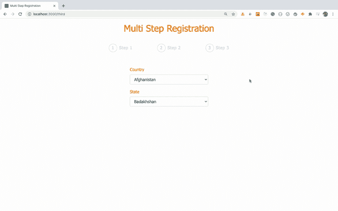

正如您在上面看到的，当我们更改国家下拉列表值时，州下拉列表也会根据所选国家进行更新。

## 如何从 API 中获取城市列表

现在，让我们根据国家和州的值来填充城市。

在第二个挂钩后添加另一个`useEffect`挂钩，如下图所示:

```
useEffect(() => {
  const getCities = async () => {
    try {
      const result = await csc.getCitiesOfState(
        selectedCountry,
        selectedState
      );
      let allCities = [];
      allCities = result?.map(({ name }) => ({
        name
      }));
      const [{ name: firstCity = '' } = {}] = allCities;
      setCities(allCities);
      setSelectedCity(firstCity);
    } catch (error) {
      setCities([]);
    }
  };

  getCities();
}, [selectedState]); 
```

这里，我们通过将`selectedCountry`和`selectedState`作为参数传递来调用`country-state-city`库中的`getCitiesOfState`方法。基于 API 的结果，我们更新了城市下拉列表。

现在，在 state dropdown 之后的第二个`Form.Group`结束标记之后添加以下代码:

```
<Form.Group controlId="city">
  <Form.Label>City</Form.Label>
  <Form.Control
    as="select"
    name="city"
    value={selectedCity}
    onChange={(event) => setSelectedCity(event.target.value)}
  >
    {cities.length > 0 ? (
      cities.map(({ name }) => (
        <option value={name} key={name}>
          {name}
        </option>
      ))
    ) : (
      <option value="">No cities found</option>
    )}
  </Form.Control>
</Form.Group> 
```

这里，我们在屏幕上显示城市下拉列表。如果所选的州没有城市，我们会显示一条`No cities found`消息，因为有些州没有任何城市。

现在，如果您检查应用程序，您将看到以下屏幕:

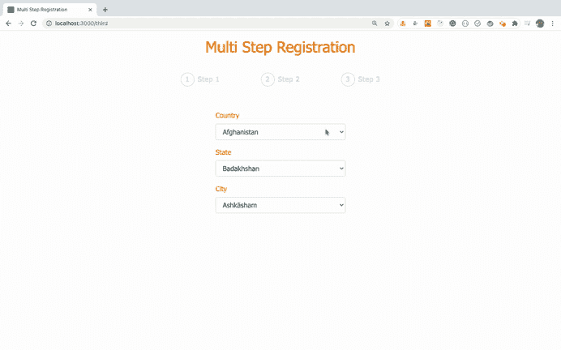

正如您在上面看到的，在国家和州发生变化时，相应的城市列表会填充到城市下拉列表中。

此外，在 city 下拉列表后的最后一个`Form.Group`结束标签后添加`Register`按钮:

```
<Button variant="primary" type="submit">
  Register
</Button> 
```

现在，您的屏幕将如下所示:

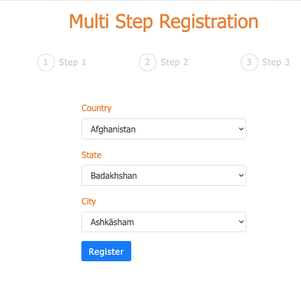

我们已经完成了所有步骤的屏幕创建。现在，让我们在标题中显示步骤进度，这样就可以清楚地看到我们当前所处的步骤。

## 如何在页眉中添加进度指示器

我们展示了在`Header`组件中的`Progress`组件，但是在`AppRouter.js`文件中的`Route`中没有提到`Progress`组件。另外，`Route`中没有提到`Header`。

所以默认情况下，我们不能访问`Header`和`Progress`组件中的`history`、`location`和`match`属性来识别我们在哪个路线上。

但是有一个简单的方法可以解决这个问题。React Router 提供了一个`withRouter`组件，我们可以在`Progress`组件中使用它，这样我们就可以访问`history`、`location`和`match`道具。

打开`Progress.js`文件并在文件顶部添加导入`withRouter`组件:

```
import { withRouter } from 'react-router-dom'; 
```

并更改以下代码的导出语句:

```
export default Progress; 
```

对于此代码:

```
export default withRouter(Progress); 
```

因此，当我们将`Progress`组件传递给`withRouter`组件时，我们将访问`Progress`组件中的`history`、`location`和`match`道具。

现在，用以下代码替换`Progress`组件:

```
const Progress = ({ location: { pathname } }) => {
  const isFirstStep = pathname === '/';
  const isSecondStep = pathname === '/second';
  const isThirdStep = pathname === '/third';

  return (
    <React.Fragment>
      <div className="steps">
        <div className={`${isFirstStep ? 'step active' : 'step'}`}>
          <div>1</div>
          <div>
            {isSecondStep || isThirdStep ? (
              <Link to="/">Step 1</Link>
            ) : (
              'Step 1'
            )}
          </div>
        </div>
        <div className={`${isSecondStep ? 'step active' : 'step'}`}>
          <div>2</div>
          <div>{isThirdStep ? <Link to="/second">Step 2</Link> : 'Step 2'}</div>
        </div>
        <div className={`${pathname === '/third' ? 'step active' : 'step'}`}>
          <div>3</div>
          <div>Step 3</div>
        </div>
      </div>
    </React.Fragment>
  );
}; 
```

这里，在第一行中，我们从`props`对象中析构`location`属性，然后从`location`属性中析构`pathname`属性，就像这样:

```
const Progress = ({ location: { pathname } }) => { 
```

基于我们所处的路线，我们将把`active`类添加到每个`step` div 中。

此外，在文件顶部导入`Link`组件:

```
import { Link, withRouter } from 'react-router-dom'; 
```

现在，如果您检查应用程序，您将看到以下屏幕:


如您所见，当我们处于某个特定步骤时，该步骤编号在进度条中显示为活动状态，并带有高亮显示的文本。然后，当我们浏览这些步骤时，前面步骤的文本显示为一个链接，因此我们可以返回到任何步骤来更改任何数据。

## 如何跨路线保留输入的数据

但是您会注意到，当我们通过单击步骤 3 中的链接转到步骤 1 时，在步骤 1 中输入的数据丢失了。

这是因为当我们从一个路由转到另一个路由时，React Router 会完全卸载之前的路由组件，并装载连接到该路由的下一个路由组件。这将导致所有状态值丢失。

因此，让我们添加一种方法来保存导航到上一步时输入的数据。

如您所知，只有连接到`AppRouter.js`文件中提到的路线的组件在路线变更时被安装和卸载。但是在我们的例子中,`AppRouter`组件并没有被卸载，即使路由改变了。

这意味着存储用户输入数据的最佳位置是在`AppRouter`组件中。

让我们在`AppRouter.js`文件中添加`user`状态、`updateUser`和`resetUser`函数。

```
const [user, setUser] = useState({});

const updateUser = (data) => {
  setUser((prevUser) => ({ ...prevUser, ...data }));
};

const resetUser = () => {
  setUser({});
}; 
```

所以我们将用户输入的数据存储在每一步的`user`状态中，这是一个对象。

在`updateUser`函数中，我们传递数据来更新`user`状态。在`updateUser`函数中，我们首先使用`prevUser`变量展开`user`对象值，然后展开`data`对象，这样得到的对象将是两个对象的合并。

为了更新状态，我们使用 state 的 updater 语法和对象的隐式返回语法。

所以这段代码:

```
setUser((prevUser) => ({ ...prevUser, ...data })); 
```

与下面的代码相同:

```
setUser((prevUser) => {
  return {
    ...prevUser,
    ...data
  };
}); 
```

正如你在上面看到的，如果我们想从一个 arrow 函数中隐式地返回一个对象，我们可以跳过 return 关键字，用圆括号将对象括起来。

这将使代码更短，也将帮助您避免在代码中键入错误。因此，您会发现大多数 React 代码都是使用隐式返回语法编写的。

因此，如果我们在步骤 1 中，那么我们将把`{first_name: 'Mike', last_name: 'Jordan' }`作为`data`传递，并将其添加到`user`状态。

然后在步骤 2 中，如果我们将`{user_email: 'test@example.com', user_password: 'test@123'}`作为`data`传递，那么`updateUser`函数将更新`user`，如下所示:

```
const prevUser = { first_name: 'Mike', last_name: 'Jordan' };
const data = { user_email: 'test@example.com', user_password: 'test@123' };

const result = { ...prevUser, ...data };
console.log(result); // { first_name: 'Mike', last_name: 'Jordan', user_email: 'test@example.com', user_password: 'test@123' } 
```

现在，我们已经创建了`user`状态和`updateUser`函数。所以我们需要将它传递给连接到该步骤的每条路线，这样我们就可以通过调用`updateUser`函数来保存用户输入的数据。

我们在`AppRouter.js`文件中的当前路线如下所示:

```
<Switch>
  <Route component={FirstStep} path="/" exact={true} />
  <Route component={SecondStep} path="/second" />
  <Route component={ThirdStep} path="/third" />
</Switch> 
```

所以要将`user`和`updateUser`作为道具传递给连接到路由的组件，我们不能这样传递:

```
<Route component={FirstStep} path="/" exact={true} user={user} updateUser={updateUser} /> 
```

因为这样道具将被传递给`Route`组件，而不是`FirstStep`组件。所以我们需要使用下面的语法:

```
<Route
  render={(props) => (
    <FirstStep {...props} user={user} updateUser={updateUser} />
  )}
  path="/"
  exact={true}
/> 
```

这里，我们使用渲染道具模式来传递道具。这将正确地传递道具，也不会在每次重新渲染时重新创建`FirstStep`组件。

你可以看看我的[React 路由器](https://yogeshchavan1.podia.com/react-router-introduction)介绍课程，了解更多为什么我们需要使用`render`而不是`component`道具。

现在，在对所有与步骤相关的路线进行更改后，您的路线将如下所示:

```
<BrowserRouter>
  <div className="container">
    <Header />
    <Switch>
      <Route
        render={(props) => (
          <FirstStep {...props} user={user} updateUser={updateUser} />
        )}
        path="/"
        exact={true}
      />
      <Route
        render={(props) => (
          <SecondStep {...props} user={user} updateUser={updateUser} />
        )}
        path="/second"
      />
      <Route
        render={(props) => (
          <ThirdStep {...props} user={user}  />
        )}
        path="/third"
      />
    </Switch>
  </div>
</BrowserRouter> 
```

注意，我们没有将`updateUser` prop 传递给`ThirdStep` component route，因为当我们提交步骤 3 中的表单时，我们会将所有数据直接保存到数据库中。

如果你愿意，可以将`updateUser`函数传递给`ThirdStep`组件，并通过调用`updateUser`函数将其保存到状态(但这不是必须的)。

现在，让我们使用这些组件中的`updateUser`函数来保存数据。

所以打开`FirstStep.js`和`SecondStep.js`文件，在`onSubmit`处理函数里面，添加`props.updateUser(data)`作为第一条语句。

```
// FirstStep.js
const onSubmit = (data) => {
  props.updateUser(data);
  props.history.push('/second');
};

// SecondStep.js
const onSubmit = (data) => {
  props.updateUser(data);
  props.history.push('/third');
}; 
```

现在，如果您检查应用程序，您将看到以下屏幕:

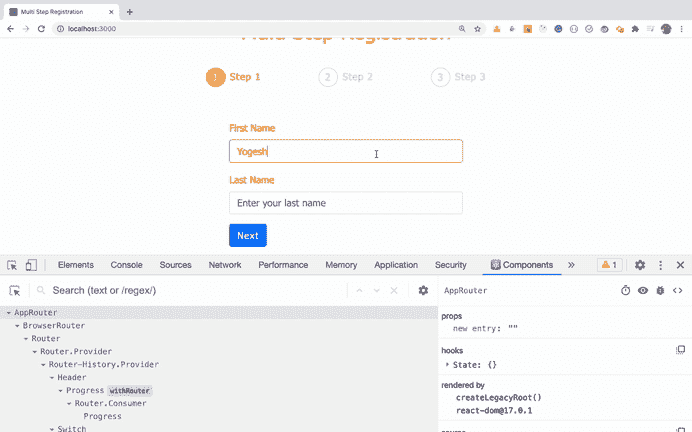

正如您所看到的，最初的`AppRouter`组件状态是一个空对象。但是当我们在每个步骤中提交表单时，状态对象会用用户输入的数据进行更新。

现在，让我们使用保存在状态中的数据，并在从下一步返回到上一步时将其填充到相应的输入字段中。

如您所知，我们使用`react-hook-form`来管理使用`useForm`钩子的`FirstStep`和`SecondStep`组件中表单的变化数据。

但是`useForm`钩子也有一个可选的参数，我们可以用它来保存路由变化的值。

因此，从`FirstStep.js`文件中修改以下代码:

```
const { register, handleSubmit, errors } = useForm(); 
```

对于此代码:

```
const { user } = props;
const { register, handleSubmit, errors } = useForm({
  defaultValues: {
    first_name: user.first_name,
    last_name: user.last_name
  }
}); 
```

这里，我们正在从 props 对象中析构`user` prop，我们在`AppRouter.js`文件的路径中传递该 props 对象。然后我们使用`defaultValues`属性来设置每个输入字段的值。

提醒您一下，`first_name` 和`last_name`是`FirstStep`组件中输入字段的名称，react-hook-form 使用它们来跟踪变化的数据。

现在，如果您检查应用程序，您将看到以下屏幕:

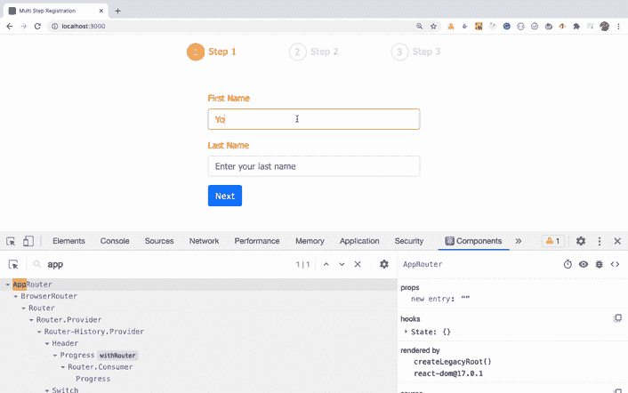

如您所见，当我们从步骤 2 返回到步骤 1 时，在步骤 1 中输入的数据没有丢失。这是因为当组件在路线改变时再次安装，我们用来自`user`状态的数据重新设置它。

现在，让我们也在`SecondStep.js`文件中添加一些类似的代码:

```
const { user } = props;
const { register, handleSubmit, errors } = useForm({
  defaultValues: {
    user_email: user.user_email,
    user_password: user.user_password
  }
}); 
```

如果您检查该应用程序，您将看到以下屏幕:

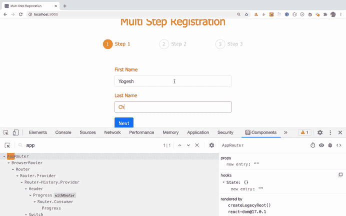

如您所见，当我们从步骤 3 返回到步骤 2 或步骤 1 时，在步骤 1 和步骤 2 中输入的数据不会丢失。所以我们成功地保存了跨步骤的数据。

## 如何向应用程序添加动画过渡

现在，让我们为应用程序添加一个平滑的滑动动画功能。

为了添加动画，我们使用了非常流行的[帧运动](https://www.framer.com/motion/)库。

Framer motion 使得使用声明式方法添加动画变得容易，就像 React 做事情一样。

所以让我们在`FirstStep`组件中添加动画。

打开`FirstStep.js`文件，在文件顶部添加成帧器运动库的导入语句:

```
import { motion } from 'framer-motion'; 
```

要激活页面上的任何元素，我们需要给它加上前缀`motion`,如下所示:

```
<div>Click here to animate it</div>

// the above code will need to be converted to

<motion.div>Click here to animate it</motion.div> 
```

使用 motion 作为前缀将返回一个添加了特定动画功能的 React 组件，以便我们可以将道具传递给该元素。

所以在`FirstStep.js`文件中，在将运动前缀添加到下面的 div 之后:

```
<div className="col-md-6 offset-md-3">
...
</div> 
```

它看起来会像这样:

```
<motion.div className="col-md-6 offset-md-3">
...
</motion.div> 
```

一旦我们给它添加了一个运动前缀，我们就可以像这样给这个元素提供额外的道具:

```
<motion.div
  className="col-md-6 offset-md-3"
  initial={{ x: '-100vw' }}
  animate={{ x: 0 }}
>
...
</motion.div> 
```

这里，我们提供了一个`initial`道具来指定动画开始的位置。我们希望整个表单从左侧滑入，所以我们提供了作为`-100vw`的`x`值。这意味着从左侧开始 100%的视窗宽度。所以窗体的初始位置会在最左边，但是在屏幕上看不到。

然后我们给`animate`道具提供了一个`0`的`x`值，这样表单将从左边滑入，并回到它在页面上的原始位置。如果我们为`x`提供一个值`10`，那么它将从原来的位置移动到右侧的`10px`。

现在，`FirstStep.js`文件中的整个 JSX 代码将如下所示:

```
return (
  <Form className="input-form" onSubmit={handleSubmit(onSubmit)}>
    <motion.div
      className="col-md-6 offset-md-3"
      initial={{ x: '-100vw' }}
      animate={{ x: 0 }}
    >
      <Form.Group controlId="first_name">
        <Form.Label>First Name</Form.Label>
        <Form.Control
          type="text"
          name="first_name"
          placeholder="Enter your first name"
          autoComplete="off"
          ref={register({
            required: 'First name is required.',
            pattern: {
              value: /^[a-zA-Z]+$/,
              message: 'First name should contain only characters.'
            }
          })}
          className={`${errors.first_name ? 'input-error' : ''}`}
        />
        {errors.first_name && (
          <p className="errorMsg">{errors.first_name.message}</p>
        )}
      </Form.Group>

      <Form.Group controlId="last_name">
        <Form.Label>Last Name</Form.Label>
        <Form.Control
          type="text"
          name="last_name"
          placeholder="Enter your last name"
          autoComplete="off"
          ref={register({
            required: 'Last name is required.',
            pattern: {
              value: /^[a-zA-Z]+$/,
              message: 'Last name should contain only characters.'
            }
          })}
          className={`${errors.last_name ? 'input-error' : ''}`}
        />
        {errors.last_name && (
          <p className="errorMsg">{errors.last_name.message}</p>
        )}
      </Form.Group>

      <Button variant="primary" type="submit">
        Next
      </Button>
    </motion.div>
  </Form>
); 
```

现在，如果您检查应用程序，您将看到页面加载时的滑动动画:


如您所见，表单从页面的左侧滑入，但看起来还不是很平滑。

为了使动画流畅，我们可以在`initial`和`animate`道具之外再提供一个`transition`道具。

```
<motion.div
  className="col-md-6 offset-md-3"
  initial={{ x: '-100vw' }}
  animate={{ x: 0 }}
  transition={{ stiffness: 150 }}
>
...
</motion.div> 
```

这里，我们为`stiffness`添加了一个值为`150`的`transition`道具。您可以尝试将值从`150`更改为其他值，并检查哪一个对您来说最合适。我将在这里使用`150`。

现在，如果您检查应用程序，您将看到页面加载时的平滑滑动动画:

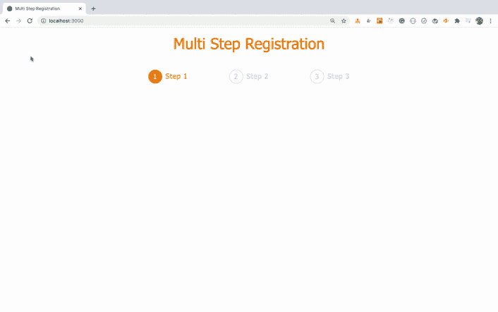

让我们在`SecondStep.js`和`ThirdStep.js`文件中做同样的动画修改:

```
import { motion } from 'framer-motion';
...
<motion.div
  className="col-md-6 offset-md-3"
  initial={{ x: '-100vw' }}
  animate={{ x: 0 }}
  transition={{ stiffness: 150 }}
>
...
</motion.div> 
```

现在，如果您检查应用程序，您将会看到页面加载中所有 3 个步骤的平滑滑动动画:


## 如何用 Node.js 设置后端

我们已经完成了前端的所有基本功能。现在让我们设置后端服务器代码，这样我们就可以将表单中输入的数据保存到 MongoDB。

在`src`文件夹外创建一个名为`server`的新文件夹。然后在`server`文件夹中创建`models`和`routers`文件夹。

现在，从终端的`server`文件夹中执行以下命令:

```
yarn init -y 
```

这将在`server`文件夹中创建一个`package.json`文件，这样我们就可以管理依赖关系。

现在，通过从终端的`server`文件夹中执行以下命令来安装所需的依赖项:

```
yarn add bcryptjs@2.4.3 cors@2.8.5 express@4.17.1 mongoose@5.11.18 nodemon@2.0.7 
```

接下来，在`server`文件夹中创建一个名为`.gitignore`的新文件，并在其中添加下面一行，这样`node_modules`文件夹就不会被推送到 GitHub(如果您决定将代码推送到 GitHub):

```
node_modules 
```

在`server`文件夹中创建一个新文件`db.js`，内容如下:

```
const mongoose = require('mongoose');

mongoose.connect('mongodb://127.0.0.1:27017/form-user', {
  useNewUrlParser: true,
  useCreateIndex: true,
  useUnifiedTopology: true
}); 
```

这里，我们使用`mongoose`库来处理 MongoDB。对于`mongoose.connect`方法，我们提供了一个连接字符串，用`form-user`数据库作为数据库的名称。

你可以随便取什么名字来代替`form-user`。

现在，在`server`文件夹中创建一个名为`index.js`的新文件，并在其中添加以下内容:

```
const express = require('express');
require('./db');

const app = express();
const PORT = process.env.PORT || 3030;

app.get('/', (req, res) => {
  res.send('<h2>This is from index.js file</h2>');
});

app.listen(PORT, () => {
  console.log(`server started on port ${PORT}`);
}); 
```

现在，打开`server/package.json`文件并在其中添加`scripts`部分:

```
"scripts": {
  "start": "nodemon index.js"
}, 
```

这里我们使用的是`nodemon` npm 包，如果我们对`index.js`或`index.js`文件中包含的文件做了任何更改，它将重启 Express 服务器。这样，我们就不必在每次更改时手动重启服务器。

因此，您的整个`package.json`文件将如下所示:

```
{
  "name": "server",
  "version": "1.0.0",
  "main": "index.js",
  "license": "MIT",
  "scripts": {
    "start": "nodemon index.js"
  },
  "dependencies": {
    "bcryptjs": "2.4.3",
    "cors": "2.8.5",
    "express": "4.17.1",
    "mongoose": "5.11.18",
    "nodemon": "2.0.7"
  }
} 
```

现在，打开另一个终端，从`server`文件夹中执行`yarn start`命令。

如果您访问 [http://localhost:3030/](http://localhost:3030/) ，您将看到以下屏幕:

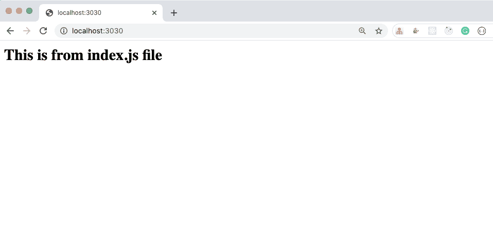

这表明我们的 Express 服务器设置正确。让我们编写 Rest APIs 来存储用户注册数据。

在`server/models`文件夹中创建一个名为`user.js`的新文件，内容如下:

```
const mongoose = require('mongoose');

const userSchema = mongoose.Schema(
  {
    first_name: {
      type: String,
      required: true,
      trim: true
    },
    last_name: {
      type: String,
      required: true,
      trim: true
    },
    user_email: {
      type: String,
      required: true,
      trim: true,
      validate(value) {
        if (!value.match(/^[^@ ]+@[^@ ]+\.[^@ .]{2,}$/)) {
          throw new Error('Email is not valid.');
        }
      }
    },
    user_password: {
      type: String,
      required: true,
      trim: true,
      minlength: 6
    },
    country: {
      type: String,
      required: true,
      trim: true
    },
    state: {
      type: String,
      trim: true
    },
    city: {
      type: String,
      trim: true
    }
  },
  {
    timestamps: true
  }
);

const User = mongoose.model('User', userSchema);

module.exports = User; 
```

这里，我们创建了一个`User`模式来定义存储在`User`集合中的数据结构。

如果你从未使用过`mongoose`库，那么请查看[这篇文章](https://javascript.plainenglish.io/what-is-so-special-about-mongoose-library-when-working-with-mongodb-65096b97f8ae?source=friends_link&sk=5c98c783bd200aa6ce59aa8b16e56f1f)中的介绍。

## 如何创建 REST APIs

在`routers`文件夹中创建一个名为`user.js`的新文件，内容如下:

```
const express = require('express');
const User = require('../models/user');
const bcrypt = require('bcryptjs');
const router = express.Router();

router.post('/register', async (req, res) => {
 const { user_email, user_password } = req.body;

 console.log('req.body', req.body);

 let user = await User.findOne({ user_email });
 if (user) {
   return res.status(400).send('User with the provided email already exist.');
 }

 try {
   user = new User(req.body);
   user.user_password = await bcrypt.hash(user_password, 8);

   await user.save();
   res.status(201).send();
 } catch (e) {
   res.status(500).send('Something went wrong. Try again later.');
 }
});

module.exports = router; 
```

这里，我们为`/register`路线创建了一个 post API。我们将以 JSON 格式将数据传递给这个 API。Express 服务器使它在`req.body`对象中可用，所以我们从它那里析构电子邮件和密码值:

```
const { user_email, user_password } = req.body; 
```

然后使用`User`模型的`findOne`方法，我们首先检查是否有任何用户具有所提供的电子邮件地址。

```
let user = await User.findOne({ user_email }); 
```

如果这样的用户存在，那么我们将向客户端返回一个错误(这是我们的 React 应用程序)。

```
return res.status(400).send('User with the provided email already exist.'); 
```

在发送回响应时指定错误的 HTTP 响应代码总是好的。

你可以在[这个网站](https://httpstatuses.com/)上找到所有 HTTP 状态码及其含义。

然后我们将`req.body`中的所有用户数据(如`first_name`、`last_name`、`user_email`、`users_password`、`country`、`state`和`city`)传递给`User`构造函数。

但是我们不想将用户输入的数据原样存储到数据库中。因此，在将密码保存到数据库之前，我们将使用流行的 [bcryptjs](https://www.npmjs.com/package/bcryptjs) npm 库来散列密码。

```
user.user_password = await bcrypt.hash(user_password, 8); 
```

点击查看[我的文章，详细了解`bcryptjs`。](https://javascript.plainenglish.io/how-to-create-a-strong-and-secure-password-in-nodejs-which-cannot-be-decrypted-24d046b24958?source=friends_link&sk=87160d305a0b0cd97ec18d376a5d7765)

一旦密码被散列，我们调用`User`模型的`save`方法将所有细节和散列密码保存到 MongoDB 数据库中。

```
await user.save(); 
```

一旦我们完成了，我们就发送回带有状态码`201`的响应，它描述了某个东西已经被创建。

```
res.status(201).send(); 
```

请注意，这里我们没有发回任何数据——只是一个响应，表明请求成功并且创建了一个新记录。

最后，我们导出 express `router`，这样我们就可以在`index.js`文件中使用它。

现在，打开`server/index.js`文件并在文件顶部导入用户路由器:

```
const userRouter = require('./routers/user'); 
```

当我们以 JSON 格式将注册数据从 React app 发送到 Node.js 服务器时，我们需要为中间件添加以下代码:

```
app.use(express.json()); 
```

同样，在`PORT`常量之后，添加以下代码行:

```
app.use(userRouter); 
```

因此，您的整个`server/index.js`文件将如下所示:

```
const express = require('express');
const userRouter = require('./routers/user');
require('./db');

const app = express();
const PORT = process.env.PORT || 3030;

app.use(express.json());
app.use(userRouter);

app.get('/', (req, res) => {
  res.send('<h2>This is from index.js file</h2>');
});

app.listen(PORT, () => {
  console.log(`server started on port ${PORT}`);
}); 
```

这里，我们提供了`userRouter`作为 Express 应用程序的中间件，这样我们就可以向它发出 API 请求。

最好将每个路由器单独放在自己的文件中，并使用`app.use`方法包含它。这避免了将代码写在单个文件中而使代码变大。

现在，按照本文中的[所述，通过运行`./mongod --dbpath=<path_to_mongodb-data_folder>`启动本地 MongoDB 数据库服务器，并保持其运行。](https://levelup.gitconnected.com/how-to-install-mongodb-database-on-local-environment-19a8a76f1b92?source=friends_link&sk=416b443bad1f86b292e4b72602cf5c9b)

然后通过从`server`文件夹运行`yarn start`来重启 Express 服务器，并保持其运行。

打开另一个终端，运行`yarn start`启动 react 应用程序(如果你还没有这样做的话)。

现在，您将打开两个独立的终端，一个用于运行 Express server 应用程序，另一个用于运行 React 应用程序，如下所示:


这里，我们在 VSCode 中打开终端。你可以通过进入 VS 代码中的`Terminal -> New Terminal`菜单打开第一个终端。然后只需点击`+`图标即可打开其他终端。

## 如何从 React 应用程序调用 REST APIs

现在，让我们在 React 应用程序中修改代码，以对我们的`/register` API 进行 API 调用。

打开`ThirdStep.js`文件，用以下代码替换`handleSubmit`方法:

```
const handleSubmit = async (event) => {
    event.preventDefault();

    try {
      const { user } = props;
      const updatedData = {
        country: countries.find(
          (country) => country.isoCode === selectedCountry
        )?.name,
        state:
          states.find((state) => state.isoCode === selectedState)?.name || '',
        city: selectedCity
      };

      await axios.post(`${BASE_API_URL}/register`, {
        ...user,
        ...updatedData
      });
    } catch (error) {
      if (error.response) {
        console.log('error', error.response.data);
      }
    }
  }; 
```

这里，一旦我们在步骤 2 中提交了表单，我们就调用`handleSubmit`方法，其中我们对我们的`/register` API 进行 API 调用:

```
await axios.post(`${BASE_API_URL}/register`, {
  ...user,
  ...updatedData
}); 
```

这里，我们将数据以 JSON 格式传递给`/register` API。

我们将国家代码存储在`selectedCountry`中，将州代码存储在`selectedState`状态变量中。这些由`isoCode`表示，我们首先使用数组`find`方法找出与该国家和州代码相关的实际名称，如下所示:

```
const updatedData = {
  country: countries.find(
    (country) => country.isoCode === selectedCountry
  )?.name,
  state:
    states.find((state) => state.isoCode === selectedState)?.name || '',
  city: selectedCity
}; 
```

在`selectedCity`状态变量中，我们存储了名称，所以我们不需要使用 filter 方法。

如果你想快速复习一下最广泛使用的数组方法(包括数组查找方法),请点击这里查看我的文章。

在使用状态的`find`方法时，我们添加了`||`条件。这是因为如果没有任何选定国家的可用状态，那么在访问`?.name`时，它可能会作为`undefined`出现。为了避免在数据库中存储`undefined`，我们使用`||`操作符来存储空字符串`''`或`undefined`。

## 如何测试 REST APIs

现在，让我们检查应用程序的功能。

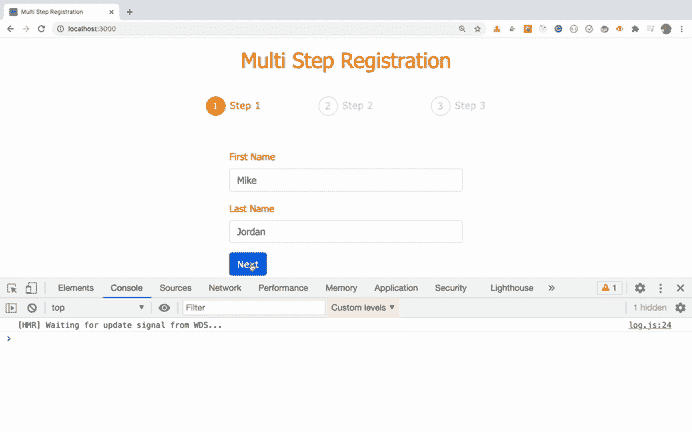

如您所见，当我们尝试在步骤 3 中提交表单时，浏览器控制台中出现 CORS(跨源资源共享)错误。

这是因为浏览器不允许我们访问在另一个端口上运行的应用程序的数据——因为我们在端口 3000 上运行 React 应用程序，在端口 3030 上运行 Node.js 应用程序。

这是出于安全考虑，违反了跨域策略。

为了解决这个问题，我们需要安装 [cors](https://www.npmjs.com/package/cors) npm 包，并在我们的`server/index.js`文件中使用它，这样 Node.js 服务器将允许任何应用程序访问它的 API。

不要担心，我们将在本文后面看到如何在不使用`cors`的情况下使用 Node.js APIs。我们还将避免运行两个单独的终端来启动 React 和 Node.js 服务器。

现在，打开`server/index.js`文件并为`cors`添加导入，如下所示:

```
const cors = require('cors'); 
```

请注意，在前面创建 Express 服务器时，我们已经安装了`cors` npm 包。

并将其作为快速中间件添加到`app.use(userRouter)`语句之前，如下所示:

```
app.use(express.json());
app.use(cors());
app.use(userRouter); 
```

现在，您的`index.js`文件将如下所示:

```
const express = require('express');
const cors = require('cors');
const userRouter = require('./routers/user');
require('./db');

const app = express();
const PORT = process.env.PORT || 3030;

app.use(express.json());
app.use(cors());
app.use(userRouter);

app.get('/', (req, res) => {
  res.send('<h2>This is from index.js file</h2>');
});

app.listen(PORT, () => {
  console.log(`server started on port ${PORT}`);
}); 
```

如果您提交表单，您将看到数据已经正确地登录到控制台:

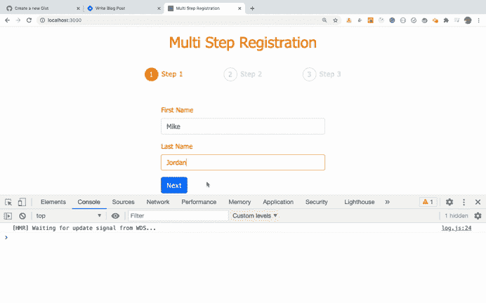

数据也保存到数据库中，如下所示:

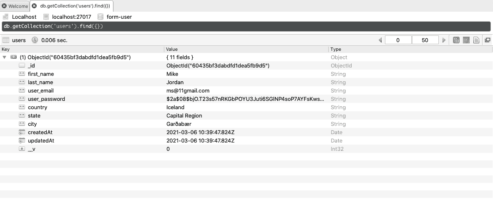

所以现在，我们已经成功地将我们的前端 React 应用程序连接到后端 Node.js 应用程序，并将数据保存到数据库。

## 如何显示注册反馈弹出窗口

您可能已经注意到，在我们注册用户后，没有任何迹象表明数据已经成功保存到数据库中。所以让我们现在就开始吧。

为了显示成功消息，我们将使用 [sweetalert2](https://www.npmjs.com/package/sweetalert2) ，这是一个流行的可定制弹出模式库。

导入到`ThirdStep.js`文件中，如下图所示:

```
import Swal from 'sweetalert2'; 
```

在`handleSubmit`函数中，在`axios.post`调用之后，在 try 块中添加以下代码:

```
Swal.fire('Awesome!', "You're successfully registered!", 'success').then(
(result) => {
  if (result.isConfirmed || result.isDismissed) {
    props.history.push('/');
  }
}
); 
```

并在 catch 块中添加以下代码:

```
if (error.response) {
  Swal.fire({
    icon: 'error',
    title: 'Oops...',
    text: error.response.data
  });
} 
```

所以您的`handleSubmit`函数现在看起来像这样:

```
const handleSubmit = async (event) => {
    event.preventDefault();

    try {
      const { user } = props;
      const updatedData = {
        country: countries.find(
          (country) => country.isoCode === selectedCountry
        )?.name,
        state:
          states.find((state) => state.isoCode === selectedState)?.name || '', // or condition added because selectedState might come as undefined
        city: selectedCity
      };

      await axios.post(`${BASE_API_URL}/register`, {
        ...user,
        ...updatedData
      });
      Swal.fire('Awesome!', "You're successfully registered!", 'success').then(
        (result) => {
          if (result.isConfirmed || result.isDismissed) {
            props.history.push('/');
          }
        }
      );
    } catch (error) {
      if (error.response) {
        Swal.fire({
          icon: 'error',
          title: 'Oops...',
          text: error.response.data
        });
        console.log('error', error.response.data);
      }
    }
  }; 
```

如果您检查该应用程序，您将看到以下屏幕:


如您所见，如果数据库中已经存在具有该电子邮件地址的用户，那么我们将显示 catch 块中的一条错误消息。

如果数据库中不存在该用户的电子邮件，我们会看到如下所示的成功弹出窗口:

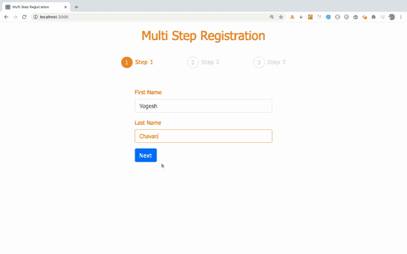

如果您检查成功弹出的代码，它看起来像这样:

```
Swal.fire('Awesome!', "You're successfully registered!", 'success').then(
  (result) => {
    if (result.isConfirmed || result.isDismissed) {
      props.history.push('/');
    }
  }
); 
```

因此，如果用户点击`OK`按钮或者点击弹出模式之外的按钮，我们使用`props.history.push('/');`将用户重定向到步骤 1。但是，一旦注册成功，我们还应该从输入字段中清除用户输入的数据。让我们现在做那件事。

如果您还记得的话，我们在`AppRouter`组件中添加了一个`resetUser`函数来清除`user`状态数据。

让我们把这个函数作为道具传递给`ThirdStep`组件。因此，您的`ThirdStep`路线将如下所示:

```
<Route
  render={(props) => (
    <ThirdStep
      {...props}
      user={user}
      updateUser={updateUser}
      resetUser={resetUser}
    />
  )}
  path="/third"
/> 
```

在`ThirdStep.js`文件的`handleSubmit`函数中，在调用`props.history.push('/');`之前，像这样调用`resetUser`函数:

```
Swal.fire('Awesome!', "You're successfully registered!", 'success').then(
  (result) => {
    if (result.isConfirmed || result.isDismissed) {
      props.resetUser();
      props.history.push('/');
    }
  }
); 
```

现在，如果您注册一个新用户，您将看到在注册之后，您将被重定向到步骤 1，并且所有输入字段也将被清除。

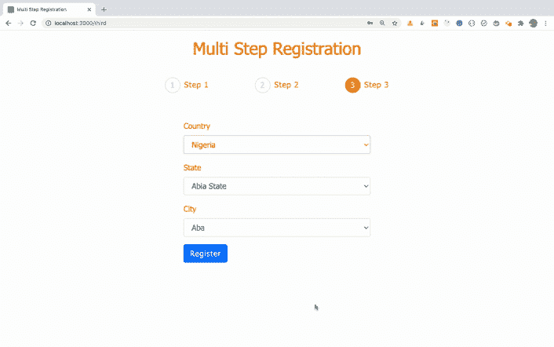

## 如何在应用程序中添加登录功能

我们已经为前端和后端添加了完整的注册功能。让我们添加登录功能，这样我们就可以检查具有所提供的电子邮件和密码的用户是否已经存在，然后检索该用户的详细信息。

打开`routers/user.js`文件，在`module.exports`语句前添加以下代码:

```
router.post('/login', async (req, res) => {
  try {
    const user = await User.findOne({ user_email: req.body.user_email });
    if (!user) {
      return res.status(400).send('User with provided email does not exist.');
    }

    const isMatch = await bcrypt.compare(
      req.body.user_password,
      user.user_password
    );

    if (!isMatch) {
      return res.status(400).send('Invalid credentials.');
    }
    const { user_password, ...rest } = user.toObject();

    return res.send(rest);
  } catch (error) {
    return res.status(500).send('Something went wrong. Try again later.');
  }
}); 
```

这里，我们首先使用`findOne`方法检查具有所提供的电子邮件的用户是否已经存在。如果不存在这样的用户，那么我们返回一个错误，状态代码为`400`。

如果有一个用户具有所提供的电子邮件地址，那么我们使用`bcrypt.compare`方法来比较原始的非散列密码和散列密码。如果散列密码与来自`user`对象的密码不匹配，那么我们返回一个错误消息`Invalid credentials`。

但是如果密码匹配，那么我们使用 ES9 rest 操作符为对象创建一个新的具有所有`user`属性的`rest`对象，除了散列密码:

```
const { user_password, ...rest } = user.toObject(); 
```

这是因为出于安全原因，我们不想返回散列密码。

然后我们将把去掉密码的`rest`对象发送回客户端(我们的 React 应用程序)。

现在我们已经创建了后端 API，让我们集成登录功能的前端部分。

使用以下代码在`components`文件夹中创建一个名为`Login.js`的新文件:

```
import React, { useState } from 'react';
import { useForm } from 'react-hook-form';
import { Form, Button } from 'react-bootstrap';
import axios from 'axios';
import { BASE_API_URL } from '../utils/constants';

const Login = () => {
  const { register, handleSubmit, errors } = useForm();
  const [successMessage, setSuccessMessage] = useState('');
  const [errorMessage, setErrorMessage] = useState('');
  const [userDetails, setUserDetails] = useState('');

  const onSubmit = async (data) => {
    console.log(data);

    try {
      const response = await axios.post(`${BASE_API_URL}/login`, data);
      setSuccessMessage('User with the provided credentials found.');
      setErrorMessage('');
      setUserDetails(response.data);
    } catch (error) {
      console.log(error);
      if (error.response) {
        console.log('error', error.response.data);
        setErrorMessage(error.response.data);
      }
    }
  };

  return (
    <Form className="input-form" onSubmit={handleSubmit(onSubmit)}>
      <div className="col-md-6 offset-md-3">
        {errorMessage ? (
          <p className="errorMsg login-error">{errorMessage}</p>
        ) : (
          <div>
            <p className="successMsg">{successMessage}</p>

            {userDetails && (
              <div className="user-details">
                <p>Following are the user details:</p>
                <div>First name: {userDetails.first_name}</div>
                <div>Last name: {userDetails.last_name}</div>
                <div>Email: {userDetails.user_email}</div>
                <div>Country: {userDetails.country}</div>
                <div>State: {userDetails.state}</div>
                <div>City: {userDetails.city}</div>
              </div>
            )}
          </div>
        )}
        <Form.Group controlId="first_name">
          <Form.Label>Email</Form.Label>
          <Form.Control
            type="email"
            name="user_email"
            placeholder="Enter your email address"
            ref={register({
              required: 'Email is required.',
              pattern: {
                value: /^[^@ ]+@[^@ ]+\.[^@ .]{2,}$/,
                message: 'Email is not valid.'
              }
            })}
            className={`${errors.user_email ? 'input-error' : ''}`}
          />
          {errors.user_email && (
            <p className="errorMsg">{errors.user_email.message}</p>
          )}
        </Form.Group>

        <Form.Group controlId="password">
          <Form.Label>Password</Form.Label>
          <Form.Control
            type="password"
            name="user_password"
            placeholder="Choose a password"
            ref={register({
              required: 'Password is required.',
              minLength: {
                value: 6,
                message: 'Password should have at-least 6 characters.'
              }
            })}
            className={`${errors.user_password ? 'input-error' : ''}`}
          />
          {errors.user_password && (
            <p className="errorMsg">{errors.user_password.message}</p>
          )}
        </Form.Group>

        <Button variant="primary" type="submit">
          Check Login
        </Button>
      </div>
    </Form>
  );
};

export default Login; 
```

现在，打开`AppRouter.js`文件，在结束`Switch`标签之前的所有路由的末尾添加一个用于登录的路由，如下所示:

```
<BrowserRouter>
     ...
    <Route component={Login} path="/login" />
    </Switch>
  </div>
</BrowserRouter> 
```

此外，在顶部包括`Login`组件:

```
import Login from '../components/Login'; 
```

现在，如果您访问[http://localhost:3000/log in](http://localhost:3000/login)，您将看到以下屏幕:

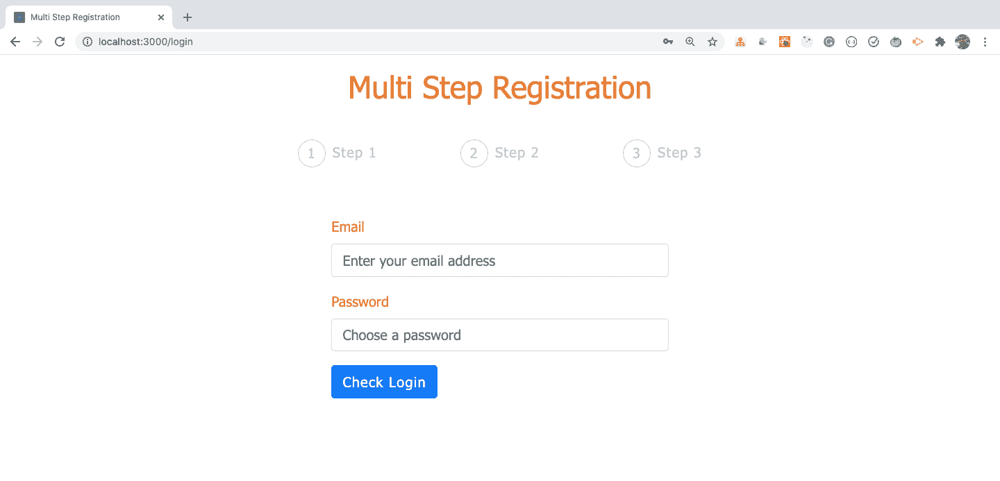

在这里，我们实际上不需要在标题中显示步骤，所以我们添加一个条件，将它们隐藏在登录页面上。

打开`Progress.js`文件，添加另一个常量变量，如下所示:

```
const isLoginPage = pathname === '/login'; 
```

然后在 div 开始之前添加一个三元运算符条件，使用类`steps`:

```
<React.Fragment>
  {!isLoginPage ? (
    <div className="steps">
     ...
    </div>
  ) : (
    <div></div>
  )}
</React.Fragment> 
```

如果页面不是登录页面，那么我们将显示步骤，否则我们将显示一个空的 div。

注意，如果我们没有任何东西要呈现，我们需要呈现一个空的 div，因为如果我们没有从组件返回任何 JSX，React 将抛出一个错误。

您的整个`Progress.js`文件现在将看起来像这样:

```
import React from 'react';
import { Link, withRouter } from 'react-router-dom';

const Progress = ({ location: { pathname } }) => {
  const isFirstStep = pathname === '/';
  const isSecondStep = pathname === '/second';
  const isThirdStep = pathname === '/third';
  const isLoginPage = pathname === '/login';

  return (
    <React.Fragment>
      {!isLoginPage ? (
        <div className="steps">
          <div className={`${isFirstStep ? 'step active' : 'step'}`}>
            <div>1</div>
            <div>
              {isSecondStep || isThirdStep ? (
                <Link to="/">Step 1</Link>
              ) : (
                'Step 1'
              )}
            </div>
          </div>
          <div className={`${isSecondStep ? 'step active' : 'step'}`}>
            <div>2</div>
            <div>
              {isThirdStep ? <Link to="/second">Step 2</Link> : 'Step 2'}
            </div>
          </div>
          <div className={`${pathname === '/third' ? 'step active' : 'step'}`}>
            <div>3</div>
            <div>Step 3</div>
          </div>
        </div>
      ) : (
        <div></div>
      )}
    </React.Fragment>
  );
};

export default withRouter(Progress); 
```

## 如何测试登录功能

现在，如果您检查登录页面，您将会看到页面标题中没有步骤。但是其他页面仍会显示这些步骤。

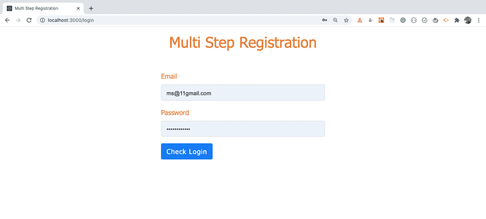

如果您输入正确的登录凭据，您将获得与该用户相关的详细信息，如下所示:

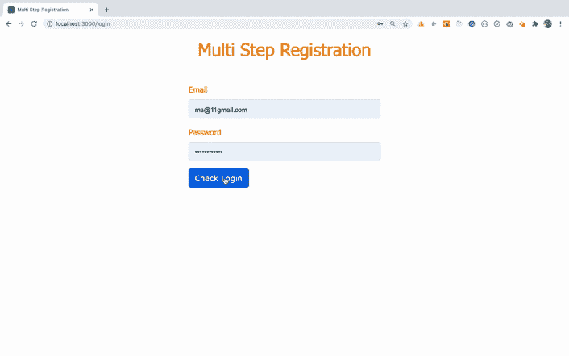

如果登录凭据无效，您将看到如下所示的错误消息:


如果电子邮件存在，但密码不匹配，您将看到如下所示的错误消息:

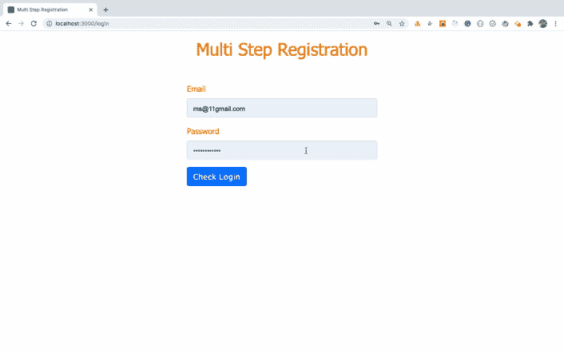

现在，让我们来理解来自`Login.js`文件的代码:

```
const onSubmit = async (data) => {
  console.log(data);

  try {
    const response = await axios.post(`${BASE_API_URL}/login`, data);
    setSuccessMessage('User with the provided credentials found.');
    setErrorMessage('');
    setUserDetails(response.data);
  } catch (error) {
    console.log(error);
    if (error.response) {
      console.log('error', error.response.data);
      setErrorMessage(error.response.data);
    }
  }
}; 
```

在`onSubmit`函数中，我们通过传递登录表单中输入的数据对`/login`端点进行 API 调用。

如果 API 响应中没有错误，我们将设置`successMessage`状态，并用来自 API 的响应设置`userDetails`状态。否则我们将设定`errorMessage`状态。

在 JSX 中，如果`errorMessage`状态不为空，我们将显示错误信息，否则显示带有`userDetails`数据的`successMessage`状态值:

```
{errorMessage ? (
  <p className="errorMsg login-error">{errorMessage}</p>
) : (
  <div>
    <p className="successMsg">{successMessage}</p>

    {userDetails && (
      <div className="user-details">
        <p>Following are the user details:</p>
        <div>First name: {userDetails.first_name}</div>
        <div>Last name: {userDetails.last_name}</div>
        <div>Email: {userDetails.user_email}</div>
        <div>Country: {userDetails.country}</div>
        <div>State: {userDetails.state}</div>
        <div>City: {userDetails.city}</div>
      </div>
    )}
  </div>
)} 
```

请注意，我们没有在屏幕上提供登录页面的链接，因为该应用程序旨在显示多步表单功能。我已经包含了登录页面，所以您可以了解如何验证用户登录。

如果您愿意，可以在标题中包含登录页面链接，或者使用[http://localhost:3000/log in](http://localhost:3000/login)直接访问它。

## 如何设置无效路线页面

现在，我们已经完成了应用程序的全部功能。让我们添加一些代码，以便如果我们在浏览器 URL 中输入任何无效的路由，用户将被重定向回主页。

目前，如果你访问任何像[http://localhost:3000/contact](http://localhost:3000/contact)这样的无效路由，你会看到一个空白页面。但是控制台中也没有错误，因为在`AppRouter.js`文件中的路由列表中没有匹配的路由。

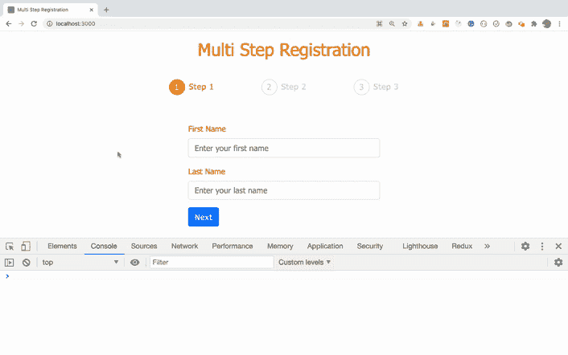

打开`AppRouter.js`文件，在登录路线后输入另一条路线，如下图所示:

```
 ...
  <Route component={Login} path="/login" />
  <Route render={() => <Redirect to="/" />} />
</Switch> 
```

这里，我们没有为最后一条路由提供任何到`Route`组件的路径。这意味着，如果上述任何一条路线不匹配，将执行最后一条路线。这将把用户重定向到`/`路线，即`FirstPage`组件路线。

另外，从文件顶部的`react-router-dom`导入`Redirect`组件:

```
import { BrowserRouter, Redirect, Route, Switch } from 'react-router-dom'; 
```

请注意，您只需输入它作为最后一条路线。这样，如果上述任何一个路由不匹配，将执行最后一个路由，它将重定向到主页。

现在来验证一下。


如您所见，对于所有无效路由，我们都被重定向到主页，这是第一步页面。

## 如何摆脱 CORS 图书馆

如您所知，要运行这个应用程序，我们需要在一个终端中使用`yarn start`命令启动 React 应用程序。我们还需要从后端服务器的`server`文件夹中执行`yarn start`命令。最后，我们还需要让 MongoDB 服务器在第三个终端上运行。

因此，我们不再需要运行两个单独的`yarn start`命令。这也将允许你在一个主机提供商上部署你的应用。

如果您还记得，在`server/index.js`文件中，我们添加了以下代码:

```
app.use(cors()); 
```

添加这些代码允许任何应用程序访问我们的 APIs 这在本地环境中工作时很好。但是允许每个人访问我们的 API 是不安全的。所以让我们解决这个问题。

打开`server/index.js`文件，在`app.use(express.json());`行上方添加以下代码:

```
app.use(express.static(path.join(__dirname, '..', 'build'))); 
```

这里，我们正在配置我们的 Express 应用程序，以使用`build`文件夹的内容作为我们应用程序的起点。

当我们为 React 应用程序运行`yarn build`命令时，将会创建`build`文件夹。

由于`build`文件夹将被创建在`server`文件夹之外，我们使用`..`从`server`文件夹出来访问它。

另外，在文件顶部导入`path`节点包:

```
const path = require('path'); 
```

我们不需要安装`path` npm 包，因为它是在我们系统上安装 Node.js 时默认添加的。

现在，您可以从`server/index.js`文件中删除`cors`导入及其使用。

您的最终`server/index.js`文件将如下所示:

```
const path = require('path');
const express = require('express');
const userRouter = require('./routers/user');
require('./db');

const app = express();
const PORT = process.env.PORT || 3030;

app.use(express.static(path.join(__dirname, '..', 'build')));
app.use(express.json());
app.use(userRouter);

app.get('/', (req, res) => {
 res.send('<h2>This is from index.js file</h2>');
});

app.listen(PORT, () => {
 console.log(`server started on port ${PORT}`);
}); 
```

现在停止来自两个终端的两个`yarn start`命令。然后，只在一个终端中从我们的项目文件夹`multi-step-form-using-mern`中执行`yarn build`命令。

`yarn build`命令将需要一些时间来完成，因为它执行一些优化。只有当我们完成了所有的应用程序功能，并且准备好将应用程序部署到生产环境中时，才应该执行它。

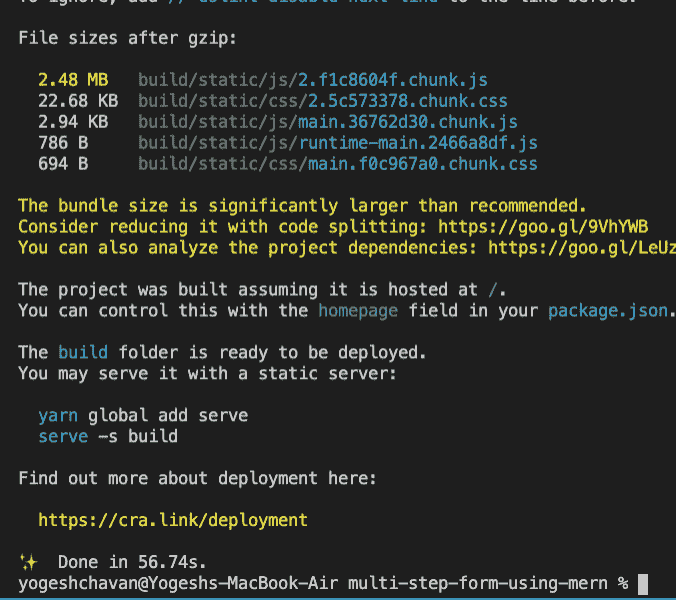

该命令成功完成后，您将看到一个如下所示的`build`文件夹:

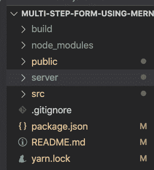

`build`文件夹包含我们的整个 React 应用程序，因此您可以使用这个`build`文件夹将您的应用程序部署到生产环境中。

现在，打开`src/utils/constants.js`文件并替换这段代码:

```
export const BASE_API_URL = 'http://localhost:3030'; 
```

使用下面的代码:

```
export const BASE_API_URL = ''; 
```

现在，我们已经创建了`build`文件夹，从终端导航到`server`文件夹并执行`yarn start`命令:


如您所见，服务器已经在端口`3030`上启动。

因此，让我们通过 [http://localhost:3030/](http://localhost:3030/) 访问我们的应用程序。

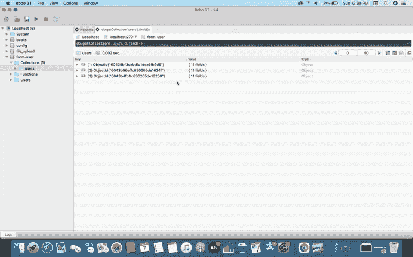

如您所见，我们只需要运行一个`yarn start`命令来启动 Node.js Express 服务器。Node.js 服务器在端口`3030`上呈现来自`build`文件夹的 React 应用程序。

所以我们所有的 API 现在都可以在`http://localhost:3030`上获得，比如`http://localhost:3030/register`和`http://localhost:3030/login`。

因此，我们将`BASE_API_URL`值更改为空字符串:

```
export const BASE_API_URL = ''; 
```

当我们已经在`http://localhost:3030`上时，我们可以只使用`/login`和`/register`来创建我们所有的 POST 请求 API。

所以我们只需要一个终端运行`yarn start`命令，另一个终端启动 MongoDB 服务。这意味着我们可以在像 [heroku](https://www.heroku.com/) 这样的单一主机提供商上部署我们的应用，而不是在一个主机提供商上部署 React 应用，在另一个主机提供商上部署 Node.js 应用。

请注意，如果您对 React 应用程序的代码进行了任何更改，您将需要从项目文件夹中重新运行`yarn build`命令，然后从`server`文件夹中重新运行`yarn start`命令。

但是这个设置有一个问题。如果直接进入`/`路线以外的任何路线，如`/first`、`/second`、`/login`等，将会出现如下所示的错误:

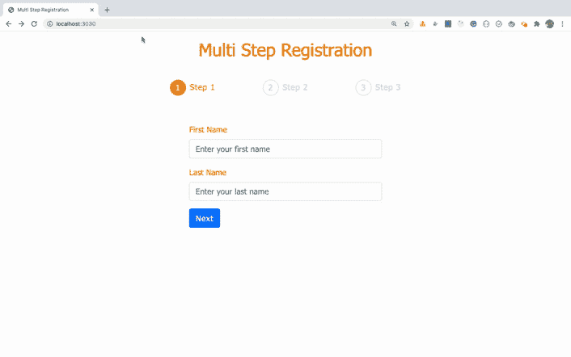

这是因为我们从 Express.js 启动服务器，所以请求将总是发送到 Express 服务器(我们的节点服务器是使用 Express 创建的),并且在节点端没有处理该请求的`/second`路由。所以它给了我们一个错误。

要解决这个问题，打开`server/index.js`文件，在`app.listen`语句之前和所有其他路由之后添加以下代码:

```
app.use((req, res, next) => {
  res.sendFile(path.join(__dirname, '..', 'build', 'index.html'));
}); 
```

该代码将作为默认路由。如果任何先前的路线不匹配，该代码将从我们的 React 应用程序的`build`文件夹中发回`index.html`文件。

因为`/second`路线出现在我们的 React 应用程序中，您将看到正确的步骤 2 页面。

如果输入的路线不在 Node.js 应用程序和我们的 React 应用程序中，那么用户将被重定向到步骤 1 页面(我们的主页),因为我们在`AppRouter.js`文件中有最后一条路线。

```
<Route render={() => <Redirect to="/" />} /> 
```

此时，您完整的`server/index.js`文件将如下所示:

```
const path = require('path');
const express = require('express');
const userRouter = require('./routers/user');
require('./db');

const app = express();
const PORT = process.env.PORT || 3030;

app.use(express.static(path.join(__dirname, '..', 'build')));
app.use(express.json());
app.use(userRouter);

app.get('/', (req, res) => {
  res.send('<h2>This is from index.js file</h2>');
});

app.use((req, res, next) => {
  res.sendFile(path.join(__dirname, '..', 'build', 'index.html'));
});

app.listen(PORT, () => {
  console.log(`server started on port ${PORT}`);
}); 
```

你现在不会得到一个错误:


如果你想深入了解使用 Node.js 渲染 React 应用，请查看本文[。](https://levelup.gitconnected.com/how-to-render-react-app-using-express-server-in-node-js-a428ec4dfe2b?source=friends_link&sk=3f152ac7908f540b209f07f683b494cd)

现在，我们已经完成了前端和后端功能，如下所示:

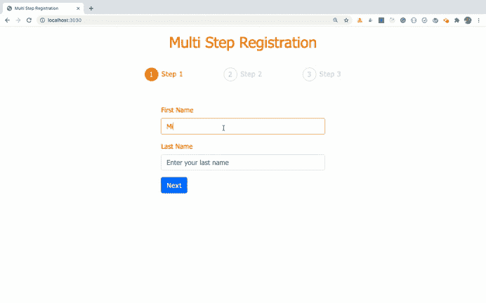

## **收盘点位**

我们已经完成了应用程序功能的构建。

**你可以在[这个资源库](https://github.com/myogeshchavan97/multi-step-form-using-mern)中找到这个应用的完整 GitHub 源代码。**

为了进一步提高您的技能，您可以通过在步骤 3 添加额外的验证来改进应用程序，以检查用户是否在表单中输入了所有的细节。这很重要，因为您可以使用[http://localhost:3030/second](http://localhost:3030/second)直接访问表单的第二步页面，并从那里继续。

### 感谢阅读！

想从头开始详细学习所有 ES6+特性，包括 let 和 const、promises、各种 promise 方法、数组和对象析构、arrow 函数、async/await、import 和 export 等等吗？

查看我的《掌握现代 JavaScript》一书。这本书涵盖了学习 React 的所有先决条件，并帮助您更好地掌握 JavaScript 和 React。

另外，你可以查看我的免费[React 路由器入门](https://yogeshchavan1.podia.com/react-router-introduction)课程，从头开始学习 React 路由器。

想要了解关于 JavaScript、React 和 Node.js 的最新常规内容吗？[在领英上关注我](https://www.linkedin.com/in/yogesh-chavan97/)。