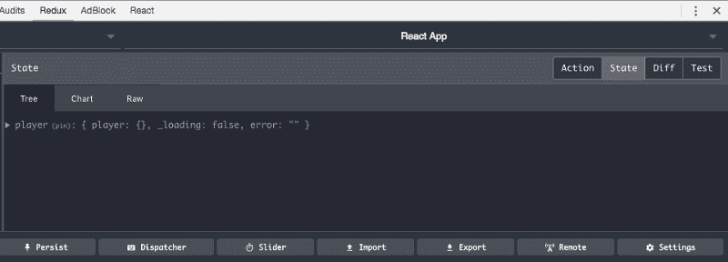

# 我如何用 React、Redux-Saga 和 Styled 组件构建一个 NBA 球员档案获取器

> 原文：<https://www.freecodecamp.org/news/build-a-nba-player-profile-fetcher-with-react-redux-saga-and-styled-components-680cde2b8254/>

乔纳森·普茨

# 我如何用 React、Redux-Saga 和 Styled 组件构建一个 NBA 球员档案获取器

大家好！我已经有一段时间没有出于个人享受或好奇而构建一些东西了，所以我在网上冲浪，探索很酷的 API。

由于现在是 NBA 季后赛时间(不幸的是，我是尼克斯队的球迷)，我决定看看是否有一个现有的 API 包含目前在 NBA 的每个球员的数据——真见鬼，确实有。

另外，我正在做的一个项目向我介绍了两个很棒的库，分别叫做 **redux-saga** 和 **styled components** 。它们非常令人兴奋，也是我绝对打算在我未来的项目中尝试和使用的两件事。

所以让我们用这些库构建一个 React 应用程序吧！

在我们开始之前，让我们先谈一谈 redux-saga 和 styled 组件，以及为什么它们很方便。

### 还原传奇

在 Redux 中，actions 和 reducers 是纯的，意味着它们没有任何副作用。

副作用的一个例子可能是服务请求。当您发出请求时，即使您总是发送相同的请求，它也可能失败或返回不同类型的结果。

所以如果你的还原者和行动是纯粹的，你能在哪里处理/放置副作用？redux-saga 是一个解决方案。它允许您监听动作，执行副作用，然后调度另一个动作。

我知道，空谈是廉价的。给我看看代码。

你准备好看这个野兽工作的例子了吗？

简而言之，我们有一个函数，每当调度类型为`‘IMAGE_FETCH_REQUESTED’`的动作时，它都会监听。当它识别出一个时，它会调用 fetchImage 函数。

在 fetchImage 函数中，我们简单地对我们的`service`对象上的一个方法做了一个特殊的`call`，传递了我们想要获取的轮廓图像的`userId`。结果保存在我们的 profileImage 变量中。

不久之后，我们让我们的商店知道我们已经成功地抓取了一个图像，并希望将该图像传递给商店。所以我们将使用类型为`'IMAGE_FETCH_SUCCEEDED'`的`put`分派一个动作，并将图像作为有效载荷传递。我们的减速器会处理剩下的。

但是**如果**有某种错误，我们简单地分派一个类型为`'IMAGE_FETCH_FAIL'`的动作，并将错误作为有效载荷传递。

它的美妙之处在于它在一个简单的 try catch 块中读取和放置得非常好。

随意阅读更多关于 [redux-saga](https://github.com/redux-saga/redux-saga) 的内容。

### 样式组件

发现有风格的组件让我大吃一惊。

我总是在 React 应用程序中构造和编写 CSS 时遇到麻烦。有些事情不对劲，我觉得很乱。特别是，类名很难。

React 的整个思想是关于模块化的:你只需编写一个组件，就可以在任何地方使用它。但是当设计这样的组件时，我们仍然给它们一个**类**名来用 CSS 定位它们。

[时尚组件的创始人之一马克斯·斯托伊伯](https://twitter.com/mxstbr?lang=en)说得好:

> 如果每个类名都只使用一次，为什么还要有一个类名呢？

听到这些话后，我知道 styled components 适合我。

现在让我们来看看这个是如何工作的:

这里我们有一个基本的功能组件:一个按钮，它几乎什么都不做，即使它让你大胆地行动。

这对新人来说可能看起来很奇怪，但实际上它非常简单，我相信你会很快爱上它。

我们从库中导入`styled`。可以把它想象成一个工厂，它允许你创建你所熟悉和喜爱的 HTML 节点。

我们创建我们喜欢的节点。在本例中，是一个按钮和 span 及其样式。然后我们把它赋给我们选择的变量。

现在我们引用这些变量，并在要呈现的功能组件中弹出它们。

就这么简单。

我真正喜欢的是，你仍然可以在一个 JS 文件中编写你所熟悉的 CSS。此外，它保持了一切美好和模块化——一切都在一个文件中，易于阅读和消化！

你可以在这里了解更多关于样式组件[的信息。](https://github.com/styled-components/styled-components)

### 这一切是如何联系在一起的

我们将建立一个应用程序，用户可以使用他们的名字和姓氏搜索球员。我们的 saga (redux-saga)将获取玩家的数据，包括统计数据和他们的头像，并将其保存到我们的 redux 存储中。并且使用样式化的组件，我们将使所有这些信息看起来更好看一些。

### 第 1 部分——设置我们的应用和 react-redux。

我们将在这个项目中使用 create-react-app，所以如果您还没有安装它，只需运行`npm install -g create-react-app`。

完成后，我们将运行`create-react-app nba-players`。

现在，在所有的安装和搭建完成后，我们将`cd nba-players`然后用`npm install --save redux react-redux redux-saga styled-components axios`安装我们需要的模块。

#### 建立我们的 redux 商店

这将是一个设置我们商店的快速演练，因为本指南是关于 redux-saga 和样式组件的，而不是关于 react-redux/redux 的。

在你的`src`文件夹中，我们将创建一个名为`store`的文件夹，并创建我们的`index.js`文件。

商店/索引. js

我们将使用 Redux DevTools 来了解我们商店的情况。你可以在这里下载 Chrome 扩展[。](https://chrome.google.com/webstore/detail/redux-devtools/lmhkpmbekcpmknklioeibfkpmmfibljd?hl=en)

#### 让我们创造我们的减速器。

在`store`文件夹的根目录下创建一个名为`reducers`的文件夹，并创建以下两个文件:

reducers/index.js

reducers/player.js

#### **让我们创建我们的行动**

在`store`文件夹的根目录下创建一个名为`actions`的文件夹，并创建以下两个文件:

actions/actionTypes.js

动作/player.js

创建完所有这些部分后，让我们将商店连接到我们的 React 应用程序！

导航至`src/index.js`并添加以下内容:

太好了，让我们测试一下，确保一切正常。

回到我们的终端，我们将运行`npm run start`来启动我们的 React 应用程序，打开开发者工具，并导航到“Redux”选项卡。单击 Redux DevTools 中的 State 选项卡。

您应该会看到这样的内容:)

太好了，我们已经准备好了开始的所有东西。

### 第二部分——Redux 传奇

我们准备利用 NBA 球员 API 来获取数据并将其加载到我们的商店中！

让我们写下我们的第一个传奇。

在我们的`src/store`文件夹中，我们将创建一个名为`sagas`的文件夹和一个名为`index.js`的文件。

这基本上是作为我们的观察者/看门人。

坐在那里听我们给出的特定动作类型。当一个动作通过匹配时，它将调用一个函数，在本例中是 retrievePlayer。我们现在就创建它。

在同一个文件夹中，我们将创建一个名为`player.js`的文件，它将包含以下内容:

retrievePlayer 生成器函数是神奇的地方，所以让我们浏览一下。

该函数可以访问所传递的动作。如果你能回忆起我们在`actions/player.js`中的动作创建者，我们传递一个名字。

我们将使用 ES6 析构从附加到 action 有效负载的 name 对象中获取姓名。

使用 redux-saga，我们【fetchPlayerData 函数并传入名称细节。

fetchPlayerData 将对 NBA 球员 API 进行 GET 调用并返回响应。响应将保存在 stats 变量中。

访问球员图像就像在 API 端点附加姓名一样简单，所以我们就这么做了。

我们将两条新数据保存到一个名为 playerProfile 的对象中。

然后我们使用 redux-saga 的 put 来分派一个动作。这里我们给它一个类型`GET_PLAYER_SUCCESS`,用我们新的 playerProfile 作为有效载荷。

如果出现问题，我们只需分派一个类型为`GET_PLAYER_FAIL`的动作，并将错误作为有效载荷传递。

就是这样！

我们之前在`reducers/player.js`制作的玩家还原器会在收到我们发送的动作后处理剩下的部分。

然而，在我们的传奇成功之前，我们还需要做最后一件事。

我们将不得不做一些修改。

它现在看起来应该如下所示

哇哦，我们现在准备构建一些组件，让我们能够搜索一个球员，并看到他们的形象和统计数据:)

### 第 3 部分—样式组件

`components/Search.js`

`components/StatBox.js`

`components/PlayerPhoto.js`

`components/Player.js`

构建好所有组件后，是时候将它们导入我们的`App.js`

一切都准备好了。只需输入你喜欢的球员的全名，如勒布朗·詹姆斯或斯蒂芬·库里，你应该会看到这样的内容。

不是最漂亮的东西，但这是一个机会，你可以用你认为合适的造型。疯狂使用样式组件库。

还记得我们在 redux store `state.player.loading`中添加了一个`loading`属性吗？当 loading 设置为 true 时，为什么不通过显示某种加载消息来使 UX 更好一点呢？

我们已经一起创建了应用程序的基础—现在继续并赋予它您自己的个人风格:)

如果需要，可以在这里找到源代码[。](https://github.com/jonathanpuc/nba-mania)

像往常一样，我的收件箱对任何需要进一步建议或有问题的人开放。

请随时在下面的任何平台上与我联系！

[insta gram](https://www.instagram.com/jonathanpucc/)|[LinkedIn](https://www.linkedin.com/in/jonathan-puc-549531b3/)|[Twitter](https://twitter.com/jonathanpuc7)