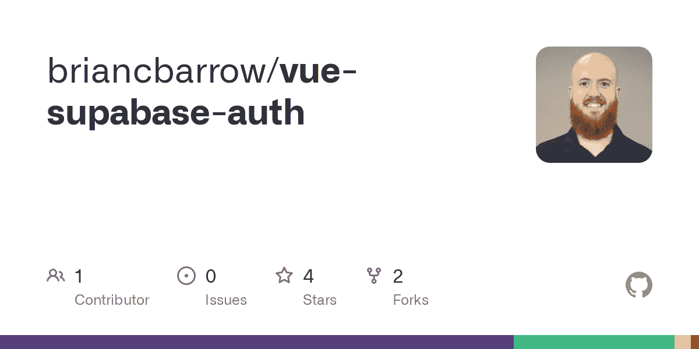
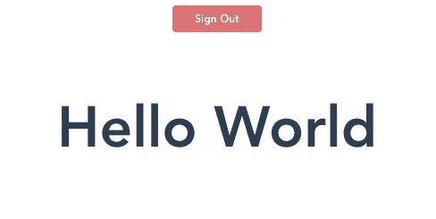
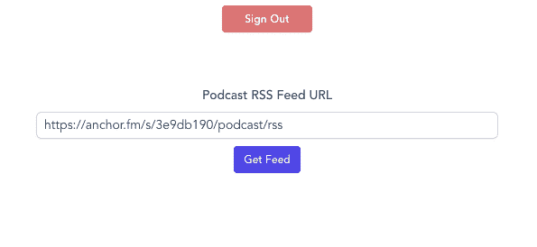
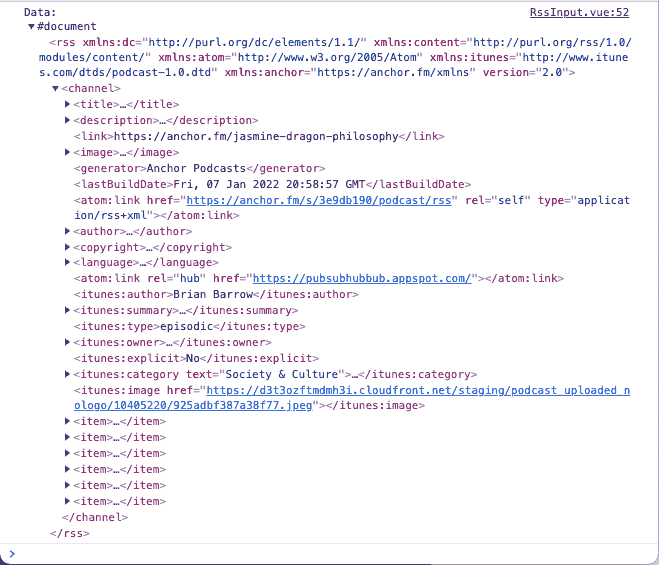
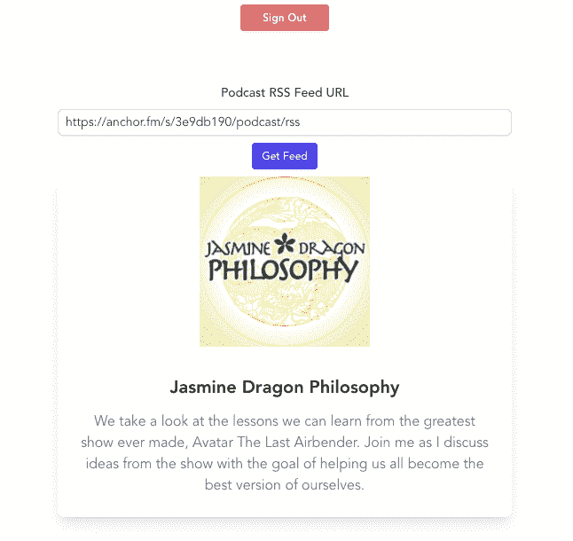
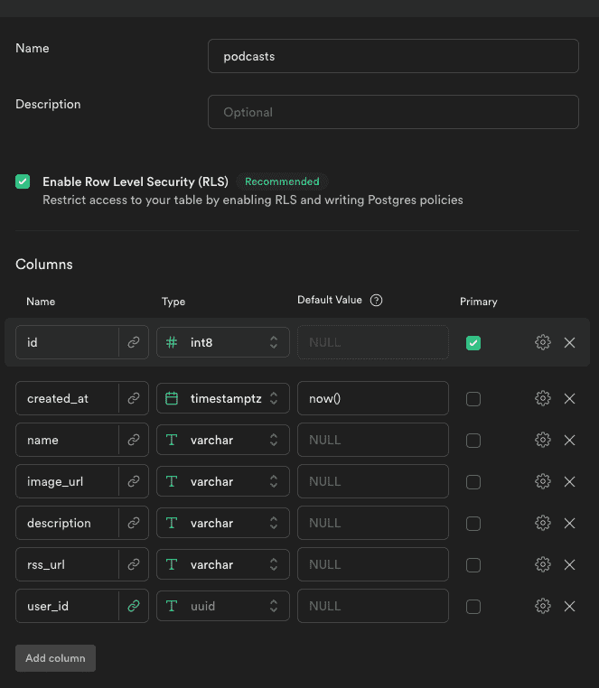
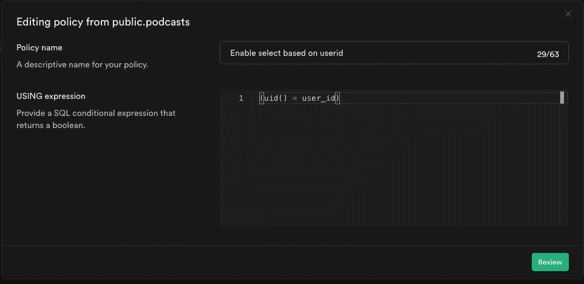
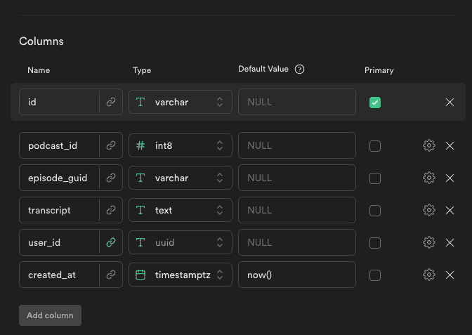

# 如何使用 Vue 和 Supabase 构建一个带转录的播客播放器

> 原文：<https://www.freecodecamp.org/news/build-a-podcast-player-with-transcriptions-using-vue-supabase/>

在本帖中，我们将介绍如何使用 Supabase 和 Vue 3 设置一个播客播放器应用程序，包括获取播客的转录。

这是我上一篇关于使用 Supabase 设置认证的文章的延续。如果你不熟悉如何在你的项目中设置 Supabase，我强烈推荐你阅读这篇文章。

## 开始代码回购

这是我上一篇文章的回复，它将带你进入这篇文章的起点。您只需要设置 Supabase，并将您的凭证/API 密钥添加到一个`.env.local`文件中，就可以开始运行了。这个回购协议还应用了前一篇文章中没有的样式。

[GitHub - briancbarrow/vue-supabase-authContribute to briancbarrow/vue-supabase-auth development by creating an account on GitHub.briancbarrowGitHub](https://github.com/briancbarrow/vue-supabase-auth)

## 先决条件

你应该熟悉 JavaScript，有一些使用 Vue 3 的经验，你的机器上应该安装了 Node.js 和 NPM。

如果你已经阅读了上一篇关于 Supabase 认证的文章或者这篇关于[supa base](https://developers.deepgram.com/blog/2021/11/getting-started-with-supabase/)入门的文章，你就可以开始了。

当我们到达转录部分时，你还需要一个来自 Deepgram 的免费 API 密匙。

## 入门指南

一旦你从上面的下载了 [repo，运行`npm install`来获得项目的安装包。](https://github.com/briancbarrow/vue-supabase-auth)

从您自己的 Supabase 项目的仪表板中添加您的`VITE_SUPABASE_URL`和`VITE_SUPABASE_ANON_KEY`环境变量。

运行`npm run dev`启动本地开发服务器。

使用登录表单或 Magic Link 表单登录应用程序。登录后，您应该会看到 HelloWorld 组件/页面的顶部有一个注销按钮。



Hello World component

## 如何获取播客 RSS 源

我们需要做的第一件事是添加功能，将播客馈送到我们的应用程序中。在 components 文件夹中创建一个名为`PodcastFeed.vue`的新组件。

大多数播客都有一个公共的 RSS 提要，我们可以通过一个简单的获取请求来获取我们需要的信息。

在`PodcastFeed.vue`组件的内部创建以下表单，该表单接收一个 RSS 提要 URL，并连接到一个触发获取请求的按钮。

注意:我试图在代码中添加注释，以帮助您理解每个部分在做什么。

```
<template>
  <div class="podcast-input-feed">
    <label for="email">Podcast RSS Feed URL</label>
    <div class="">
      <!-- binding the url input field to the 'url' data property -->
      <input
        type="url"
        name="url"
        id="url"
        v-model="url"
        placeholder="https://rss.your-org.org/feed/"
        aria-describedby="rss-url"
      />
    </div>
    <!-- hooking the button click to the 'getRssFeed' method -->
    <button @click="getRssFeed()" type="button" class="">Get Feed</button>
  </div>
</template>

<script>
import { ref } from "vue";
import { supabase } from "../supabase";
import { store } from "../store";
export default {
  setup() {
    // I am initializing the url to a url I know works, so that I don't need to keep inputing a url as I'm developing.
    // feel free to change this to a url of your own choosing
    const url = ref("https://anchor.fm/s/3e9db190/podcast/rss");
    // initializing the podcast state to an empty object
    const podcast = ref({});

    function getRssFeed() {
      const feedUrl = url.value;
      return (
        fetch(feedUrl)
          // this returns a promise so we need to convert it to a string
          .then((response) => response.text())
          // this next line is to parse the xml response
          .then((str) =>
            new window.DOMParser().parseFromString(str, "text/xml")
          )
          // parsing the data from the xml response and setting it into the podcast state
          .then((data) => {
            console.log("Data: ", data);
            podcast.value.image_url = data
              .querySelector("image")
              .querySelector("url").innerHTML;
            podcast.value.title = data.querySelector("title").textContent;
            podcast.value.description =
              data.querySelector("description").textContent;
            podcast.value.rss_url = feedUrl;
          })
          .catch((err) => {
            console.log("ERROR: ", err);
          })
      );
    }
    return {
      url,
      podcast,
      store,

      getRssFeed,
    };
  },
};
</script> 
```

PodcastFeed.vue initial setup

设置好之后，用这个新的`PodcastFeed.vue`组件替换`App.vue`文件中的 HelloWorld 组件:

```
<template>
  <button v-if="store.state.user" class="signout-button" @click="signOut">Sign Out</button>
  <!-- Check if user is available in the store, if not show auth compoenent -->
  <Auth v-if="!store.state.user" />
  <!-- If user is available, show the app -->
  <div v-else class="app">
    <PodcastFeed />
  </div>
</template>

<script>
import Auth from "./components/Auth.vue";
import PodcastFeed from "./components/PodcastFeed.vue";

import { store } from "./store";
import { supabase } from "./supabase";

export default {
  components: {
    PodcastFeed,
    Auth,
  },
  setup() {
    // we initially verify if a user is logged in with Supabase
    store.state.user = supabase.auth.user();
    // we then set up a listener to update the store when the user changes either by logging in or out
    supabase.auth.onAuthStateChange((event, session) => {
      if (event == "SIGNED_OUT") {
        store.state.user = null;
      } else {
        store.state.user = session.user;
      }
    });

    async function signOut() {
      const { error } = await supabase.auth.signOut();
    }

    return {
      store,

      signOut,
    };
  },
};
</script>

<style></style> 
```

App.vue after adding PodcastFeed.vue

所以现在应用程序应该是这样的:



App after adding PodcastFeed.vue

当您单击该按钮时，从获取请求返回的数据将显示在控制台中。



Parsed XML Data

在`getRssFeed`方法中，我们解析数据，然后获取我们需要的信息，并将其添加到`podcast`状态数据中。我们需要显示这些数据，这样用户就可以知道请求成功了。我们还想添加更好的错误消息，以防请求失败。

创建一个名为`PodcastInfo.vue`的新组件，并添加以下代码:

```
<template>
  <div class="podcast-info">
    <div class="image-container">
      
    </div>
    <div class="podcast-text">
      <div class="title-desc">
        <p class="title">
          {{ podcast.title }}
        </p>
        <p class="desc">
          {{ podcast.description }}
        </p>
      </div>
    </div>
  </div>
</template>

<script>
import { store } from "../store";
import { supabase } from "../supabase";

export default {
  props: {
    podcast: {
      type: Object,
      required: true,
    },
  },
  computed: {},
  methods: {},
  setup() {},
};
</script>

<style scoped></style> 
```

Initial setup for PodcastInfo.vue

```
<template>
  <div class="info-error">
    <h3 class="">There was an error with your request</h3>
    <p class="">Check your RSS feed URL and try again.</p>
  </div>
</template>

<script>
export default {};
</script> 
```

FeedRequestError.vue

然后将`PodcastFeed.vue`更新为以下内容，以引入组件:

```
<template>
  <div class="podcast-input-feed">
    <label for="email">Podcast RSS Feed URL</label>
    <div class="">
      <!-- binding the url input field to the 'url' data property -->
      <input
        type="url"
        name="url"
        id="url"
        v-model="url"
        placeholder="https://rss.your-org.org/feed/"
        aria-describedby="rss-url"
      />
    </div>
    <!-- hooking the button click to the 'getRssFeed' method -->
    <button @click="getRssFeed()" type="button" class="">Get Feed</button>
	<!-- Adding in these two new components -->
    <podcast-info v-if="podcast.title && !requestError" :podcast="podcast" />
  </div>
</template>

<script>
import { ref } from "vue";
import { supabase } from "../supabase";
import { store } from "../store";

import PodcastInfo from "./PodcastInfo.vue";

export default {
  components: {
    PodcastInfo,
  },

  setup() {
    // I am initializing the url to a url I know works, so that I don't need to keep inputing a url as I'm developing.
    // feel free to change this to a url of your own choosing
    const url = ref("https://anchor.fm/s/3e9db190/podcast/rss");
    // initializing the podcast state to an empty object
    const podcast = ref({});
    const requestError = ref(false);

    function getRssFeed() {
      const feedUrl = url.value;
      return (
        fetch(feedUrl)
          // this returns a promise so we need to convert it to a string
          .then((response) => response.text())
          // this next line is to parse the xml response
          .then((str) =>
            new window.DOMParser().parseFromString(str, "text/xml")
          )
          // parsing the data from the xml response and setting it into the podcast state
          .then((data) => {
            console.log("Data: ", data);
            podcast.value.image_url = data
              .querySelector("image")
              .querySelector("url").innerHTML;
            podcast.value.title = data.querySelector("title").textContent;
            podcast.value.description =
              data.querySelector("description").textContent;
            podcast.value.rss_url = feedUrl;
          })
          .catch((err) => {
            requestError.value = true;
          })
      );
    }
    return {
      url,
      podcast,
      store,
      requestError,

      getRssFeed,
    };
  },
};
</script> 
```

PodcastFeed.vue

现在，当您单击“Get Feed”按钮时，您应该会看到以下内容:



现在我们可以显示信息，我们可以连接应用程序来保存信息到 Supabase。

## 如何向 Supabase 数据库添加表

我们需要做的第一件事是向我们的 Supabase 数据库添加一个表。在 Supabase 项目的仪表板中，选择表格编辑器并点击`New table`按钮。我将新表命名为`podcasts`。启用行级安全性(这使我们的数据库更加安全)并添加以下各列:

*   id(当您创建新表时，应该为您填写此列)
*   创建日期
*   名字
*   图像 _url
*   描述
*   rss_url
*   user_id(对于这一个，我们希望通过外键将它链接到由 Auth 服务创建的 users 表。单击链接图标进行设置，并将其链接到`id`列上的`users`表。)



podcasts table setup

因为我们启用了行级安全性，所以在我们更新策略之前，该表不会插入任何内容。

“身份验证”选项卡下有一个名为“策略”的部分。在这里，您应该会看到`podcasts`表和一个创建新策略的按钮。当您单击它时，它将为您提供从模板创建策略的选项。选择名为“仅为经过身份验证的用户启用插入访问”的模板。现在，只有经过身份验证的用户有权向表中插入任何内容。

当 Supabase 运行`insert`命令时，它会自动运行一个`select`命令并返回新插入的行。因此，我们还必须向表中添加一个策略，允许用户`SELECT`访问。

创建一个名为`Enable select based on userid`的新策略，然后在`USING expression`部分添加`(uid() = user_id)`。这将阻止用户阅读其他用户的信息，同时仍然允许他们访问表格中自己的播客。



Select based on userid policy

## 如何将用户界面链接到数据库，以便用户可以保存播客

要向我们的 DB 添加一个播客，我们首先要向`PodcastInfo`组件添加一个按钮。将这段代码添加到`<div class="podcast-info">`的底部:

```
<button @click="addPodcast">Add to My Podcasts</button>
```

现在像这样给组件的设置函数添加一个名为`addPodcast`的方法。不要忘记将`props`添加到设置函数的参数中。

```
setup(props) {
    function addPodcast() {
      // Setting up the podcast object to send to supabase
      const podcast = {
        name: props.podcast.title,
        image_url: props.podcast.image_url,
        description: props.podcast.description,
        rss_url: props.podcast.rss_url,
        user_id: store.state.user.id,
      };
      // calling supabase method to insert into the db
      supabase
        .from("podcasts")
        .insert(podcast)
        .then(({ body }) => {
          store.addPodcastToStore(body[0]);
        })
        .catch((err) => {
          console.log(err);
        });
    }

    return {
      addPodcast,
    };
  },
```

partial of PodcastInfo.vue

您可以在`.then`语句中看到，我们从全局存储中调用了一个方法。将`store.js`文件更新为以下内容:

```
import { reactive } from "vue";

export const store = {
  state: reactive({
    user: {},
    // adding podcasts array to global store
    podcasts: [],
  }),

  // adding addPodcastToStore method to store object
  addPodcastToStore(podcast) {
    this.state.podcasts.push(podcast);
  },
};
```

store.js

现在，当我们点击“添加到我的播客”按钮时，该应用程序调用 Supabase，然后获取该调用的结果，并将其添加到全球商店的播客阵列中。(如果您收到 403 错误，请确保您正确设置了策略。也许试着重启开发服务器。)

如果一个播客已经在用户的播客列表中，我们不想让他们再次点击添加按钮。为了防止这种情况，我们需要首先调用 Supabase 来获取用户的所有播客，然后检查他们正在查看的播客是否在该列表中。

这个方法不会特定于任何一个组件，所以我们想在全局存储中创建它。这样，任何组件都可以访问它。将该方法添加到`addPodcastToStore`方法下的`store.js`文件中:

```
getPodcastsFromDB() {
    supabase
        .from("podcasts")
        .select("*")
        .then(({ body }) => {
            this.state.podcasts = body;
        });
},
```

partial of store.js

然后，我们希望更新方法，以便在用户登录时调用。在`App.vue`内部，将`onAuthStateChange`处理程序改为:

```
supabase.auth.onAuthStateChange((event, session) => {
    if (event == "SIGNED_OUT") {
        store.state.user = null;
    } else {
        // make call to supabase to get Podcasts for the user
        store.getPodcastsFromDB();
        store.state.user = session.user;
    }
});
```

partial of App.vue

现在将`PodcastInfo.vue`文件更新为这个文件，以便向用户显示播客是否已经在他们的库中。

```
<template>
  <div class="podcast-info">
    <div class="image-container">
      
    </div>
    <div class="podcast-text">
      <div class="title-desc">
        <p class="title">
          {{ podcast.title }}
        </p>
        <p class="desc">
          {{ podcast.description }}
        </p>
      </div>
    </div>
    <!-- Add check in markup to remove the button if the podcast already exists in the user's list -->
    <div v-if="isInUserPodcasts" class="in-podcasts">In Your Podcasts</div>
    <button v-else class="" @click="addPodcast">Add to My Podcasts</button>
  </div>
</template>

<script>
// importing computed
import { ref, computed } from "vue";
import { store } from "../store";
import { supabase } from "../supabase";

export default {
  props: {
    podcast: {
      type: Object,
      required: true,
    },
  },
  setup(props) {
    // add computed property checking if podcast is in user's podcasts
    const isInUserPodcasts = computed(() => {
      return store.state.podcasts.some(
        (podcast) => podcast.rss_url === props.podcast.rss_url
      );
    });

    function addPodcast() {
      // check if podcast is already in user's podcasts
      if (isInUserPodcasts.value) {
        alert("You already have this podcast in your list!");
      } else {
        const podcast = {
          name: props.podcast.title,
          image_url: props.podcast.image_url,
          description: props.podcast.description,
          rss_url: props.podcast.rss_url,
          user_id: store.state.user.id,
        };
        supabase
          .from("podcasts")
          .insert(podcast)
          .then(({ body }) => {
            store.addPodcastToStore(body[0]);
          })
          .catch((err) => {
            console.log(err);
          });
      }
    }

    return {
      // exposing the isInUserPodcasts computed property
      isInUserPodcasts,
      addPodcast,
    };
  },
};
</script>

<style scoped></style> 
```

PodcastInfo.vue

接下来，我们想要显示用户添加到他们的库中的播客列表。我们在全局存储中有这个列表，所以我们只需要遍历它们来显示所需的信息。

将以下内容添加到`PodcastFeed.vue`模板的底部:

```
<!-- Loop through podcasts and display them -->
  <div class="feeds">
    <h2 class="">Your Podcast Feeds</h2>
    <ul class="">
      <li v-for="pod in store.state.podcasts" :key="pod.id" class="">
        <a :href="`/podcast/${pod.id}`" class="">
          
          <p class="">{{ pod.name }}</p>
        </a>
      </li>
    </ul>
  </div>
```

PodcastFeed.vue

## 如何为我们的播客应用程序设置其他页面

现在我们有了应用程序中显示的播客列表，我们需要一种导航到单个播客的方法。我们将标记设置为链接到类似于`/podcast/{podcast_id}`的路径。现在我们需要更新我们的应用程序来处理这样的路线。

首先，使用`npm i vue-router`安装 vue 路由器。

然后用下面的代码创建一个名为`router.js`的文件:

```
// Import Vue Router
import * as VueRouter from "vue-router";

// Import the components that will show on the different routes
import PodcastFeed from "./components/PodcastFeed.vue";
import PodcastDetail from "./components/PodcastDetail.vue";

// Set up the routes
const routes = [
  { path: "/", component: PodcastFeed },
  { path: "/podcast/:id", component: PodcastDetail },
];

// Initialize the router
const router = VueRouter.createRouter({
  history: VueRouter.createWebHistory(),
  routes,
});

// Export the router
export default router; 
```

router.js

更新`main.js`以在 Vue 应用中使用路由器:

```
import { createApp } from "vue";
import router from "./router";
import App from "./App.vue";
import "./index.css";

const app = createApp(App);
app.use(router);
app.mount("#app");
```

main.js

更新`App.vue`以显示 Vue 路由器提供的`router-view`组件:

```
<template>
  <button v-if="store.state.user" class="signout-button" @click="signOut">Sign Out</button>
  <!-- Check if user is available in the store, if not show auth compoenent -->
  <Auth v-if="!store.state.user" />
  <!-- If user is available, show the app -->
  <div v-else class="app">
    <router-view></router-view>
  </div>
</template>
```

partial of App.vue

现在创建一个`PodcastDetail.vue`文件来显示播客的剧集信息:

```
<template>
  <nav class="">
    <a href="/" class="">Home</a>
  </nav>
  <!-- Basic layout for showing podcast info -->
  <div class="podcast-detail">
    
    <h1 class="">{{ podcast.name }}</h1>
    <p>{{ podcast.description }}</p>
    <h2 class="">Episodes</h2>
    <!-- Looping through each episode of a podcast and displaying episode info -->
    <ul class="">
      <li
        v-for="episode in episodes"
        :key="episode.guid || episode.link"
        class=""
      >
        <div class="info">
          <h3>{{ episode.title }}</h3>
          <audio class="" controls>
            <source :src="episode.url" type="audio/mpeg" />
            Display
          </audio>          
        </div>        
      </li>
    </ul>
  </div>
</template>

<script>
// Importing necessary methods
import { ref, onMounted } from "vue";
import { useRoute } from "vue-router";
import { supabase } from "../supabase";

export default {
  setup() {
    const route = useRoute();
    const podcast = ref({});
    const episodes = ref([]);

    // Getting podcast info from the database
    async function getPodcastData() {
      const {
        data: [podcastinfo],
      } = await supabase.from("podcasts").select().eq("id", route.params.id);
      podcast.value = podcastinfo;

      // Making call to episode url to get episode info
      getEpisodes(podcastinfo.rss_url);
    }

    function getEpisodes(url) {
      fetch(url)
        .then((response) => response.text())
        .then((str) => new window.DOMParser().parseFromString(str, "text/xml"))
        .then((data) => {
          // Finding all the "item" tags in the xml response which will contain the episode info
          const items = data.querySelectorAll("item");
          // Looping through each item and getting the episode info and pushing it to the 'episodes' array
          items.forEach((item) => {
            let url;

            // Not every podcast episode is going to have the `enclosure` tag, so we need to check if it exists
            try {
              url = item.querySelector("enclosure").getAttribute("url");
            } catch (e) {
              console.log("error", e);
              url = item.querySelector("link").innerHTML;
            }

            episodes.value.push({
              // this `title` and the `guid` properties looks a little different because the title contains CDATA tags which need to be grabbed with the 'childNodes' property
              title: item.querySelector("title").childNodes[0].textContent,
              link: url,
              url: url,
              description: item.querySelector("description").innerHTML,
              pubDate: item.querySelector("pubDate").innerHTML,
              guid: item.querySelector("guid").childNodes[0].textContent,
            });
          });
        })
        .catch((err) => {
          alert("Couldn't get episodes", err);
        });
    }

    onMounted(() => {
      // Getting podcast info from the database once the component is mounted
      getPodcastData();
    });

    return {
      podcast,
      episodes,
    };
  },
};
</script>

<style scoped></style> 
```

PodcastDetail.vue

有了这些改变，我们现在可以看到播客的单个剧集，并可以使用`<audio>` html 标签来播放它们。

## 如何获得播客的转录

最后一步是获得播客的转录，然后将它们保存到我们的数据库。

如果你还没有，你需要从 Deepgram 获得一个免费的 API 密匙来处理音频并获得转录。

一旦获得 API 密钥，就将其作为`VITE_DEEPGRAM_KEY`添加到您的`.env.local`文件中。确保您在这里重启您的开发服务器，否则当我们最终调用 API 时，您可能会得到一个 403 禁止错误。

然后将这段代码添加到`src`文件夹中的 deepgram.js 文件中。

```
const deepgramKey = import.meta.env.VITE_DEEPGRAM_KEY;

async function deepgram(url) {
  const response = await fetch(
    "https://api.deepgram.com/v1/listen?punctuate=true&diarize=true&utterances=true",
    {
      method: "POST",
      headers: {
        Authorization: `Token ${deepgramKey}`,
        "Content-Type": "application/json",
      },
      body: JSON.stringify({
        url: url,
      }),
    }
  );
  const json = await response.json();
  return json.results;
}

export default deepgram; 
```

deepgram.js

这给了我们一个实用函数，我们可以在其他文件中导入到我们的应用程序中来调用 Deepgram API，以便获得转录。我们在 URL 中添加了标点符号、重音符号和话语作为参数，以获得更清晰、更易于阅读的转录。

现在我们有了这些，我们需要给`PodcastDetail.vue`文件添加一些功能。我将遍历这些更改，然后稍后将为该文件发布最终代码。

首先，我们需要有一些状态来跟踪我们得到的转录，也需要有一些加载状态，一旦我们点击一个按钮得到一个转录。所以我们将这两行添加到我们的设置函数中:

```
let transcriptions = ref({});
const episodeTranscriptionLoading = ref([]);
```

不要忘记将它们添加到`setup`函数的返回对象中。

然后添加这个函数向 Deepgram 发出请求，然后将转录添加到本地`transcriptions`对象。

```
// Function to get a transcription from Deepgram, passing in the episode url
async function getTranscription(episode) {
    // setting the loading state to true for the episode
    episodeTranscriptionLoading.value.push(episode.guid);
    const transcription = await deepgram(episode.url);
    // setting a unique id for the episode transcription
    transcriptions.value[`${podcast.value.id}---${episode.guid}`] =
        transcription;
    // removing the loading state for the episode
    episodeTranscriptionLoading.value.splice(
        episodeTranscriptionLoading.value.indexOf(episode.guid),
        1
    );
}
```

getTranscription function in PodcastDetail.vue

确保从脚本标签顶部的`deepgram.js`导入 deepgram 函数。

然后将模板更新为:

```
<template>
  <nav class="">
    <a href="/" class="">Home</a>
  </nav>
  <!-- Basic layout for showing podcast info -->
  <div class="podcast-detail">
    
    <h1 class="">{{ podcast.name }}</h1>
    <p>{{ podcast.description }}</p>
    <h2 class="">Episodes</h2>
    <!-- Looping through each episode of a podcast and displaying episode info -->
    <ul class="">
      <li
        v-for="episode in episodes"
        :key="episode.guid || episode.link"
        class=""
      >
        <div class="info">
          <h3>{{ episode.title }}</h3>
          <audio class="" controls>
            <source :src="episode.url" type="audio/mpeg" />
            Display
          </audio>
            <!-- button to get transcriptions -->
          <button
            v-if="!transcriptions[`${podcast.id}---${episode.guid}`]"
            @click.prevent="getTranscription(episode)"
            class=""
          >
            {{
              episodeTranscriptionLoading.includes(episode.guid)
                ? "Loading..."
                : "Get Transcription"
            }}
          </button>
        </div>
          <!-- box to display the transcription -->
        <div
          v-if="transcriptions[`${podcast.id}---${episode.guid}`]"
          class="transcription"
        >
          <p>
            {{
              transcriptions[`${podcast.id}---${episode.guid}`].channels[0]
                .alternatives[0].transcript
            }}
          </p>
        </div> 
      </li>
    </ul>
  </div>
</template>
```

## 如何保存转录

现在我们可以获得转录，我们需要添加功能来保存它们到 Supabase。

首先，像上面那样在 Supabase 中创建一个表，但是这次将表命名为`transcriptions`。您将需要以下列:

*   **id**–varchar(primary)同时删除该列设置中的“Is Identity”复选标记
*   **podcast _ id**–int 8
*   **剧集 _ guid**–varchar
*   **抄本**–正文
*   **user _ id**–uuid(您需要通过单击链接图标将其链接到用户表)
*   **创建于**–timestamptz



columns for transcriptions table

一旦建立了这个表，我们就可以向组件添加一个名为`savedTranscriptions`的反应属性，然后添加下面的代码来将转录保存到 Supabase。然后我们将它们存储在对象`savedTranscriptions`中。

```
function saveTranscription(podcastId, episodeGuid) {
    supabase
        .from("transcriptions")
        .insert({
        id: `${podcastId}---${episodeGuid}`,
        podcast_id: podcastId,
        episode_guid: episodeGuid,
        transcript:
        transcriptions.value[`${podcastId}---${episodeGuid}`].channels[0]
        .alternatives[0].transcript,
        user_id: store.state.user.id,
    })
        .then(({ data: [transcriptObject] }) => {
        savedTranscriptions.value[transcriptObject.id] =
            transcriptObject.transcript;
    });
}
```

saveTranscription function in PodcastDetail.vue

一旦用户保存了转录，我们需要在他们再次访问页面时显示它。添加此函数以从 Supabase 获取数据:

```
async function getTranscriptions() {
    const { data: transcriptions } = await supabase
    .from("transcriptions")
    .select()
    .eq("podcast_id", podcast.value.id);
    console.log("Transcriptions", transcriptions);
    transcriptions.forEach((transcript) => {
        console.log("id", transcript.id);
        savedTranscriptions.value[transcript.id] = transcript.transcript;
    });
}
```

每当用户点击这个页面时，我们都希望调用这个函数，但是直到我们获得播客信息。为此，在`getPodcastData`函数的底部添加一个对`getTranscriptions`的调用。

最后要做的事情是更新模板以包含保存按钮，并显示转录(如果它们在保存的对象中)。`PodcastDetail.vue`的最终代码应该是这样的:

```
<template>
  <nav class="">
    <a href="/" class="">Home</a>
  </nav>
  <!-- Basic layout for showing podcast info -->
  <div class="podcast-detail">
    
    <h1 class="">{{ podcast.name }}</h1>
    <p>{{ podcast.description }}</p>
    <h2 class="">Episodes</h2>
    <!-- Looping through each episode of a podcast and displaying episode info -->
    <ul class="">
      <li
        v-for="episode in episodes"
        :key="episode.guid || episode.link"
        class=""
      >
        <div class="info">
          <h3>{{ episode.title }}</h3>
          <audio class="" controls>
            <source :src="episode.url" type="audio/mpeg" />
            Display
          </audio>
          <button
            v-if="savedTranscriptions[`${podcast.id}---${episode.guid}`]"
            disabled
          >
            Transcription Saved
          </button>
          <button
            v-else-if="
              !transcriptions[`${podcast.id}---${episode.guid}`] &&
              !savedTranscriptions[`${podcast.id}---${episode.guid}`]
            "
            @click.prevent="getTranscription(episode)"
            class=""
          >
            {{
              episodeTranscriptionLoading.includes(episode.guid)
                ? "Loading..."
                : "Get Transcription"
            }}
          </button>
          <button
            v-if="
              transcriptions[`${podcast.id}---${episode.guid}`] &&
              !savedTranscriptions[`${podcast.id}---${episode.guid}`]
            "
            class="save"
            @click.prevent="saveTranscription(podcast.id, episode.guid)"
          >
            Save Transcription
          </button>
        </div>
        <div
          v-if="savedTranscriptions[`${podcast.id}---${episode.guid}`]"
          class="transcription"
        >
          <p>
            {{ savedTranscriptions[`${podcast.id}---${episode.guid}`] }}
          </p>
        </div>
        <div
          v-else-if="transcriptions[`${podcast.id}---${episode.guid}`]"
          class="transcription"
        >
          <p>
            {{
              transcriptions[`${podcast.id}---${episode.guid}`].channels[0]
                .alternatives[0].transcript
            }}
          </p>
        </div>
      </li>
    </ul>
  </div>
</template>

<script>
// Importing necessary methods
import { ref, onMounted } from "vue";
import { useRoute } from "vue-router";
import { supabase } from "../supabase";
import { store } from "../store";
import deepgram from "../deepgram";

export default {
  setup() {
    const route = useRoute();
    const podcast = ref({});
    const episodes = ref([]);
    let transcriptions = ref({});
    let savedTranscriptions = ref({});
    const episodeTranscriptionLoading = ref([]);

    // Getting podcast info from the database
    async function getPodcastData() {
      const {
        data: [podcastinfo],
      } = await supabase.from("podcasts").select().eq("id", route.params.id);
      podcast.value = podcastinfo;

      // Making call to episode url to get episode info
      getEpisodes(podcastinfo.rss_url);
      await getTranscriptions();
    }

    function getEpisodes(url) {
      fetch(url)
        .then((response) => response.text())
        .then((str) => new window.DOMParser().parseFromString(str, "text/xml"))
        .then((data) => {
          // Finding all the "item" tags in the xml response which will contain the episode info
          const items = data.querySelectorAll("item");
          // Looping through each item and getting the episode info and pushing it to the 'episodes' array
          items.forEach((item) => {
            let url;

            // Not every podcast episode is going to have the `enclosure` tag, so we need to check if it exists
            try {
              url = item.querySelector("enclosure").getAttribute("url");
            } catch (e) {
              console.log("error", e);
              url = item.querySelector("link").innerHTML;
            }

            episodes.value.push({
              // this `title` and the `guid` properties looks a little different because the title contains CDATA tags which need to be grabbed with the 'childNodes' property
              title: item.querySelector("title").childNodes[0].textContent,
              link: url,
              url: url,
              description: item.querySelector("description").innerHTML,
              pubDate: item.querySelector("pubDate").innerHTML,
              guid: item.querySelector("guid").childNodes[0].textContent,
            });
          });
        })
        .catch((err) => {
          alert("Couldn't get episodes", err);
        });
    }

    // Function to get a transcription from Deepgram, passing in the episode url
    async function getTranscription(episode) {
      // setting the loading state to true for the episode
      episodeTranscriptionLoading.value.push(episode.guid);
      const transcription = await deepgram(episode.url);
      // setting a unique id for the episode transcription
      transcriptions.value[`${podcast.value.id}---${episode.guid}`] =
        transcription;
      // removing the loading state for the episode
      episodeTranscriptionLoading.value.splice(
        episodeTranscriptionLoading.value.indexOf(episode.guid),
        1
      );
    }

    function saveTranscription(podcastId, episodeGuid) {
      console.log(
        "saving transcription",
        transcriptions.value[`${podcastId}---${episodeGuid}`]
      );
      supabase
        .from("transcriptions")
        .insert({
          id: `${podcastId}---${episodeGuid}`,
          podcast_id: podcastId,
          episode_guid: episodeGuid,
          transcript:
            transcriptions.value[`${podcastId}---${episodeGuid}`].channels[0]
              .alternatives[0].transcript,
          user_id: store.state.user.id,
        })
        .then(({ data: [transcriptObject] }) => {
          console.log("saved", transcriptObject);
          savedTranscriptions.value[transcriptObject.id] =
            transcriptObject.transcript;
        });
    }

    async function getTranscriptions() {
      const { data: transcriptions } = await supabase
        .from("transcriptions")
        .select()
        .eq("podcast_id", podcast.value.id);
      console.log("Transcriptions", transcriptions);
      transcriptions.forEach((transcript) => {
        console.log("id", transcript.id);
        savedTranscriptions.value[transcript.id] = transcript.transcript;
      });
    }

    onMounted(() => {
      // Getting podcast info from the database once the component is mounted
      getPodcastData();
    });

    return {
      podcast,
      episodes,
      transcriptions,
      savedTranscriptions,
      episodeTranscriptionLoading,

      getTranscription,
      saveTranscription,
    };
  },
};
</script>

<style scoped></style> 
```

## 结论

如果你按照上面的步骤，你应该有一个工作的应用程序。如果你想再次检查我写的内容，这是最后的代码。

我知道我喜欢做这个应用程序。Supabase 使得建立和运行数据库/后端变得非常容易。如果您有任何问题，请通过 [Twitter](https://twitter.com/the_BrianB) 联系我！