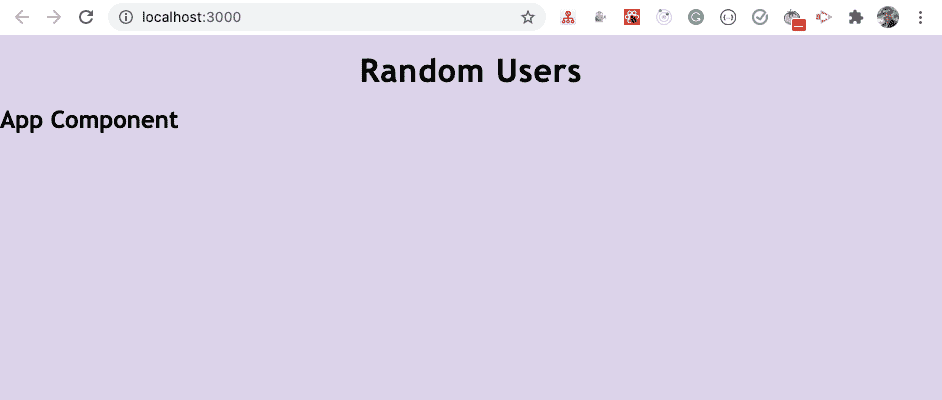
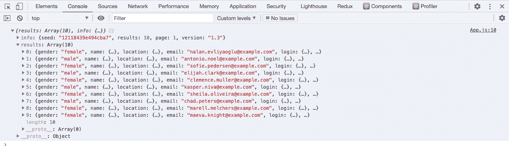
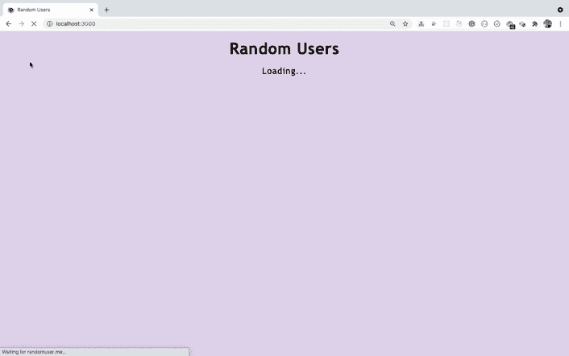
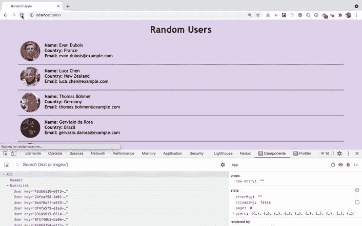
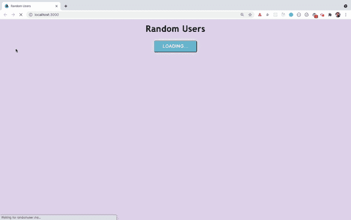
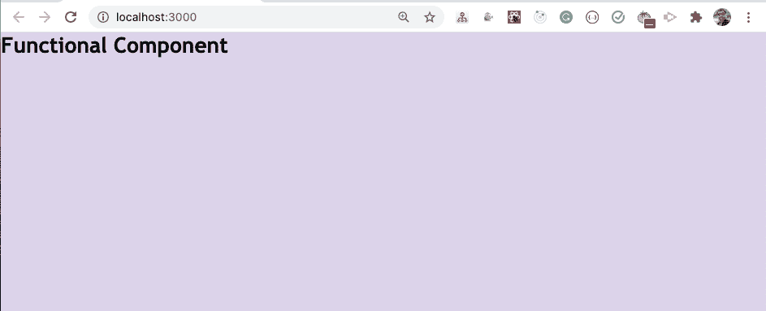
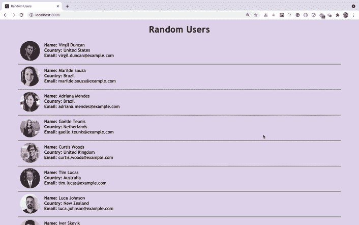
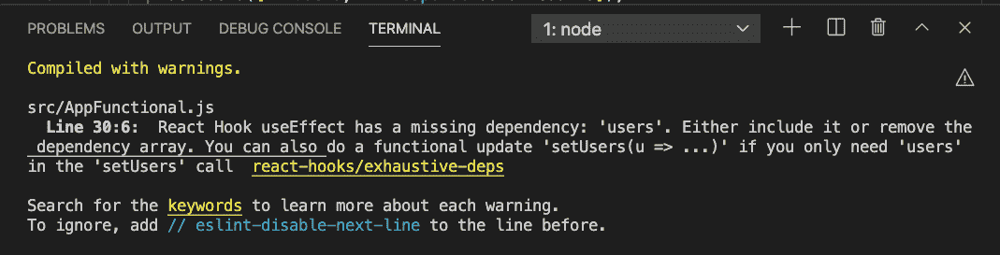
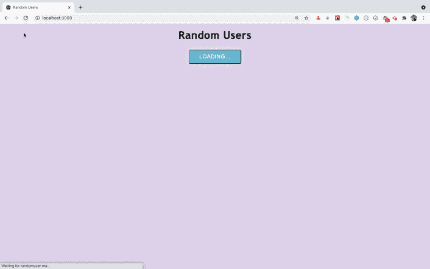
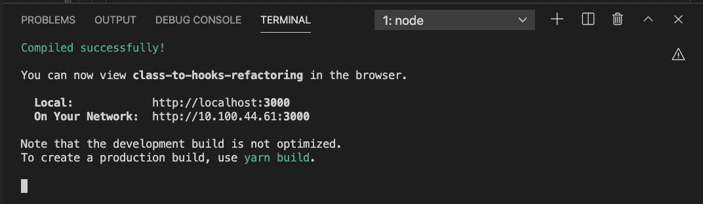

# 如何使用 React 钩子构建一个加载更多功能的 React 应用程序

> 原文：<https://www.freecodecamp.org/news/build-a-react-application-with-load-more-functionality-react-hooks/>

在本文中，我们将使用类组件构建一个 React 应用程序。然后我们将使用 React 钩子一步一步地将其转换成功能组件。

通过构建此应用程序，您将了解到:

*   如何进行 API 调用
*   如何实现加载更多功能
*   如何调试应用程序问题
*   如何使用异步/等待
*   当发生变化时如何更新组件
*   如何修复 useEffect 挂钩中的无限循环问题
*   如何用钩子将基于类的组件重构为功能组件

还有更多。

所以让我们开始吧。

> 想从绝对开始学 Redux，从零开始打造一款订餐 app？查看我的[掌握 Redux](https://master-redux.yogeshchavan.dev/) 课程。

## 初始项目设置

使用`create-react-app`创建一个新项目:

```
npx create-react-app class-to-hooks-refactoring
```

项目创建完成后，删除`src`文件夹中的所有文件，在`src`文件夹中创建`index.js`文件和`styles.css`文件。另外，在`src`文件夹中创建一个`components`文件夹。

通过从项目文件夹执行以下命令来安装`axios`库:

```
yarn add axios@0.21.1 
```

打开`styles.css`文件，将来自[这个 GitHub repo](https://github.com/myogeshchavan97/class-to-hooks-refactoring/blob/master/src/styles.css) 的内容添加到其中。

## 如何创建初始页面

在`components`文件夹中创建一个名为`Header.js`的新文件，内容如下:

```
import React from "react";

const Header = () => {
  return <h1 className="header">Random Users</h1>;
};

export default Header; 
```

在`src`文件夹中创建一个名为`App.js`的新文件，内容如下:

```
import React from 'react';
import Header from './components/Header';

export default class App extends React.Component {
  render() {
    return (
      <div className="main-section">
        <Header />
        <h2>App Component</h2>
      </div>
    );
  }
} 
```

现在，打开`index.js`文件，向其中添加以下内容:

```
import React from 'react';
import ReactDOM from 'react-dom';
import App from './App';
import './styles.css';

ReactDOM.render(<App />, document.getElementById('root')); 
```

现在，通过从终端运行`yarn start`命令启动应用程序。

如果您在 [http://localhost:3000/](http://localhost:3000/) 访问应用程序，您将看到以下屏幕。



## 如何进行 API 调用

我们将使用[随机用户](https://randomuser.me/) API 来获取随机用户列表。

因此，打开您的`App.js`文件并在组件中添加`componentDidMount`方法:

```
componentDidMount() {
    axios
      .get('https://randomuser.me/api/?page=0&results=10')
      .then((response) => {
        console.log(response.data);
      })
      .catch((error) => console.log('error', error));
  } 
```

另外，在文件顶部导入`axios`:

```
import axios from 'axios'; 
```

您的整个`App.js`文件现在将看起来像这样:

```
import React from 'react';
import Header from './components/Header';
import axios from 'axios';

export default class App extends React.Component {
  componentDidMount() {
    axios
      .get('https://randomuser.me/api/?page=0&results=10')
      .then((response) => {
        console.log(response.data);
      })
      .catch((error) => console.log('error', error));
  }

  render() {
    return (
      <div className="main-section">
        <Header />
        <h2>App Component</h2>
      </div>
    );
  }
} 
```

这里，我们进行一个 API 调用来获取一个包含 10 条记录的列表，最初指向 URL `https://randomuser.me/api/?page=0&results=10`。

现在，如果您检查应用程序，您将在控制台中看到来自 API 的响应。



现在，让我们声明一个状态来存储与加载和错误消息相关的结果和标志。

用以下代码替换`App.js`的内容:

```
import React from 'react';
import Header from './components/Header';
import axios from 'axios';

export default class App extends React.Component {
  state = {
    users: [],
    isLoading: false,
    errorMsg: ''
  };

  componentDidMount() {
    this.setState({ isLoading: true });
    axios
      .get('https://randomuser.me/api/?page=0&results=10')
      .then((response) => {
         this.setState({ users: response.data.results, errorMsg: '' });
      })
      .catch((error) =>
        this.setState({
          errorMsg: 'Error while loading data. Try again later.'
        })
      )
      .finally(() => {
        this.setState({ isLoading: false });
      });
  }

  render() {
    const { users, isLoading, errorMsg } = this.state;
    console.log(users);

    return (
      <div className="main-section">
        <Header />
        {isLoading && <p className="loading">Loading...</p>}
        {errorMsg && <p className="errorMsg">{errorMsg}</p>}
      </div>
    );
  }
} 
```

这里，我们已经使用[类属性语法](https://javascript.plainenglish.io/how-to-write-clean-and-easy-to-understand-react-code-using-class-properties-syntax-5b375b0618d3?source=friends_link&sk=c170992cab9025fddb7b34b8894ea993)直接在类内部声明了一个状态，这是在基于类的组件中编写状态的一种常见方式。

```
state = {
  users: [],
  isLoading: false,
  errorMsg: ''
}; 
```

然后，在`componentDidMount`方法中，在进行 API 调用之前，我们首先将`isLoading`状态设置为`true`。

```
this.setState({ isLoading: true }); 
```

一旦我们得到 API 响应，我们就将结果存储在状态中声明的`users`数组中。我们还将`errorMsg`状态设置为空，这样如果有任何以前的错误，它们将被清除。

```
this.setState({ users: response.data.results, errorMsg: '' }); 
```

在`.catch`块中，我们设置了`errorMsg`，以防在进行 API 调用时出现任何错误。

然后，我们使用`.finally`块将`isLoading`状态设置为`false`。

```
.finally(() => {
  this.setState({ isLoading: false });
}); 
```

使用`finally`有助于我们避免代码重复，因为我们不需要再次在`.then`和`.catch`块中将`isLoading`设置为`false`。这是因为无论成功与否，`finally`块总是会被执行。

在 render 方法中，我们显示错误消息或加载消息以及控制台状态中的`users`数组。

现在，如果您检查应用程序，您将在控制台上看到成功的`users`信息，或者在 UI 上看到 API 失败的错误消息。

## 如何显示用户信息

现在，让我们在屏幕上显示`users`信息。

在`components`文件夹中创建一个新文件`User.js`，内容如下:

```
import React from "react";

const User = ({ name, location, email, picture }) => {
  return (
    <div className="random-user">
      <div className="user-image">
        
      </div>
      <div className="user-details">
        <div>
          <strong>Name:</strong> {name.first} {name.last}
        </div>
        <div>
          <strong>Country:</strong> {location.country}
        </div>
        <div>
          <strong>Email:</strong> {email}
        </div>
      </div>
    </div>
  );
};

export default User; 
```

现在，在`components`文件夹中创建一个新文件`UsersList.js`，内容如下:

```
import React from 'react';
import User from './User';

const UsersList = ({ users }) => {
  return (
    <div className="user-list">
      {users && users.map((user) => <User key={user.login.uuid} {...user} />)}
    </div>
  );
};

export default UsersList; 
```

现在，打开`App.js`文件，用下面的代码替换`render`方法:

```
render() {
  const { users, isLoading, errorMsg } = this.state;

  return (
    <div className="main-section">
      <Header />
      {isLoading && <p className="loading">Loading...</p>}
      {errorMsg && <p className="errorMsg">{errorMsg}</p>}
      <UsersList users={users} />
    </div>
  );
} 
```

这里，我们将`users`数组作为道具传递给`UsersList`组件。在`UsersList`组件内部，我们遍历数组，通过将单个`user`的所有属性展开为`{...props}`，将用户信息发送给`User`组件。这最终将数据显示在屏幕上。

此外，在文件顶部导入`UsersList`组件:

```
import UsersList from './components/UsersList'; 
```

如果您现在检查应用程序，您将看到以下屏幕:



如您所见，在每次页面刷新时，屏幕上会显示一组新的随机用户。

## 如何添加加载更多功能

现在，让我们添加加载更多功能，这将使我们的应用程序在每次加载更多点击时加载下一组 10 个用户。

将`App.js`文件的`render`方法改为如下代码:

```
render() {
  const { users, isLoading, errorMsg } = this.state;

  return (
    <div className="main-section">
      <Header />
      <UsersList users={users} />
      {errorMsg && <p className="errorMsg">{errorMsg}</p>}
      <div className="load-more">
        <button onClick={this.loadMore} className="btn-grad">
          {isLoading ? 'Loading...' : 'Load More'}
        </button>
      </div>
    </div>
  );
} 
```

这里，我们在按钮内添加了`isLoading`复选标记，以在按钮上显示`Loading...`或`Load More`文本。

向状态添加一个新的`page`属性，并将其初始化为`0`。

```
state = {
  users: [],
  page: 0,
  isLoading: false,
  errorMsg: ''
}; 
```

并在`render`方法之前添加`loadMore`处理函数，以在每次点击按钮时将`page`状态值增加 1。

```
loadMore = () => {
  this.setState((prevState) => ({
    page: prevState.page + 1
  }));
}; 
```

这里，我们使用前一个状态来计算页面的下一个状态值，因此上面的代码与下面的代码相同:

```
loadMore = () => {
  this.setState((prevState) => {
    return {
      page: prevState.page + 1
    };
  });
}; 
```

我们只是使用 ES6 速记语法从函数中返回一个对象。

现在，在`componentDidMount`方法中，从下面的代码中修改 API URL:

```
'https://randomuser.me/api/?page=0&results=10' 
```

对于此代码:

```
`https://randomuser.me/api/?page=${page}&results=10` 
```

这里，我们使用 ES6 模板字面语法，使用`page`状态的动态值在每次按钮点击时加载下一组用户。

像这样在`componentDidMount`方法中析构`page` from 状态:

```
componentDidMount() {
  const { page } = this.state;
  ....
} 
```

> 想要详细探索 ES6+的所有特性吗？查看我的《掌握现代 JavaScript》一书。

现在，让我们检查应用程序的功能。



如您所见，当我们单击`Load More`按钮时，react dev 工具中的`page`状态正在改变，但是我们没有在屏幕上显示新的用户列表。

这是因为即使我们改变了`page`状态，我们也不会再次调用 API 来获取下一组具有已改变的`page`值的用户。所以让我们来解决这个问题。

在`loadMore`函数之上创建一个新的`loadUsers`函数，并将所有代码从`componentDidMount`移到`loadUsers`函数内部。然后从`componentDidMount`方法中调用`loadUsers`函数。

另外，在`App`组件中添加一个`componentDidUpdate`方法，如下所示:

```
componentDidUpdate(prevProps, prevState) {
  if (prevState.page !== this.state.page) {
    this.loadUsers();
  }
} 
```

因为一旦状态被更新，我们就在`loadMore`函数中更新`page`状态的值，所以将调用`componentDidUpdate`方法。所以我们正在检查`page`的先前状态值是否不等于当前状态值。然后我们通过调用`loadUsers`函数再次进行 API 调用。

> 查看我的前一篇文章，了解更多关于为什么以及何时我们需要使用`componentDidUpdate`方法。

现在，您的完整的`App.js`文件将如下所示:

```
import React from 'react';
import Header from './components/Header';
import axios from 'axios';
import UsersList from './components/UsersList';

export default class App extends React.Component {
  state = {
    users: [],
    page: 0,
    isLoading: false,
    errorMsg: ''
  };

  componentDidMount() {
    this.loadUsers();
  }

  componentDidUpdate(prevProps, prevState) {
    if (prevState.page !== this.state.page) {
      this.loadUsers();
    }
  }

  loadUsers = () => {
    const { page } = this.state;

    this.setState({ isLoading: true });
    axios
      .get(`https://randomuser.me/api/?page=${page}&results=10`)
      .then((response) => {
        this.setState({ users: response.data.results, errorMsg: '' });
      })
      .catch((error) =>
        this.setState({
          errorMsg: 'Error while loading data. Try again later.'
        })
      )
      .finally(() => {
        this.setState({ isLoading: false });
      });
  };

  loadMore = () => {
    this.setState((prevState) => ({
      page: prevState.page + 1
    }));
  };

  render() {
    const { users, isLoading, errorMsg } = this.state;

    return (
      <div className="main-section">
        <Header />
        <UsersList users={users} />
        {errorMsg && <p className="errorMsg">{errorMsg}</p>}
        <div className="load-more">
          <button onClick={this.loadMore} className="btn-grad">
            {isLoading ? 'Loading...' : 'Load More'}
          </button>
        </div>
      </div>
    );
  }
} 
```

现在，如果您通过运行`yarn start`命令再次检查应用程序，您将看到以下屏幕:



正如你所看到的，每次点击 load more 按钮，我们都会看到一个新的用户列表。但问题是我们一次只能看到 10 个用户。

因此，让我们进行一些更改，将新用户添加到已经显示的用户列表中。

为此，我们需要改变设置`users`状态的方式。

我们当前在`loadUsers`函数中的`setState`调用如下所示:

```
this.setState({ users: response.data.results, errorMsg: '' }); 
```

这里，我们总是用一组新用户替换`users`数组。所以将上面的`setState`调用改为下面的代码:

```
this.setState((prevState) => ({
  users: [...prevState.users, ...response.data.results],
  errorMsg: ''
})); 
```

这里，我们使用的是`setState`的更新语法。我们通过使用`...prevState.users`展开已经添加的`users`来创建一个新的数组，然后通过使用`...response.data.results`添加一组新的`users`。

因此，这样我们就不会丢失先前加载的`users`数据，并且我们还能够追加一组新的`users`。

现在，如果您再次检查应用程序，您将看到数据加载的正确行为。


## 如何使用 Async/await 改进代码

如果你检查`loadUsers`函数，你会发现代码看起来很复杂，很难读懂。

```
loadUsers = () => {
  const { page } = this.state;

  this.setState({ isLoading: true });
  axios
    .get(`https://randomuser.me/api/?page=${page}&results=10`)
    .then((response) => {
      this.setState((prevState) => ({
        users: [...prevState.users, ...response.data.results],
        errorMsg: ''
      }));
    })
    .catch((error) =>
      this.setState({
        errorMsg: 'Error while loading data. Try again later.'
      })
    )
    .finally(() => {
      this.setState({ isLoading: false });
    });
}; 
```

我们可以使用 async/await 语法来解决这个问题。

首先，我们需要将`loadUsers`函数标记为 async:

```
loadUsers = async () => { 
```

因为我们只能在声明为`async`的函数中使用`await`关键字。

现在，用以下代码替换`loadUsers`函数:

```
loadUsers = async () => {
  try {
    const { page } = this.state;

    this.setState({ isLoading: true });
    const response = await axios.get(
      `https://randomuser.me/api/?page=${page}&results=10`
    );

    this.setState((prevState) => ({
      users: [...prevState.users, ...response.data.results],
      errorMsg: ''
    }));
  } catch (error) {
    this.setState({
      errorMsg: 'Error while loading data. Try again later.'
    });
  } finally {
    this.setState({ isLoading: false });
  }
}; 
```

这里，我们在`axios.get`调用之前使用了`await`关键字，所以下一行代码也就是`setState`调用将不会被执行，直到我们从 API 得到响应。

如果从 API 获取响应时出现任何错误，将执行`catch`块。`finally`模块将把`isLoading`状态设置为`false`。

您更改后的`App.js`文件现在将如下所示:

```
import React from 'react';
import Header from './components/Header';
import axios from 'axios';
import UsersList from './components/UsersList';

export default class App extends React.Component {
  state = {
    users: [],
    page: 0,
    isLoading: false,
    errorMsg: ''
  };

  componentDidMount() {
    this.loadUsers();
  }

  componentDidUpdate(prevProps, prevState) {
    if (prevState.page !== this.state.page) {
      this.loadUsers();
    }
  }

  loadUsers = async () => {
    try {
      const { page } = this.state;

      this.setState({ isLoading: true });
      const response = await axios.get(
        `https://randomuser.me/api/?page=${page}&results=10`
      );

      this.setState((prevState) => ({
        users: [...prevState.users, ...response.data.results],
        errorMsg: ''
      }));
    } catch (error) {
      this.setState({
        errorMsg: 'Error while loading data. Try again later.'
      });
    } finally {
      this.setState({ isLoading: false });
    }
  };

  loadMore = () => {
    this.setState((prevState) => ({
      page: prevState.page + 1
    }));
  };

  render() {
    const { users, isLoading, errorMsg } = this.state;

    return (
      <div className="main-section">
        <Header />
        <UsersList users={users} />
        {errorMsg && <p className="errorMsg">{errorMsg}</p>}
        <div className="load-more">
          <button onClick={this.loadMore} className="btn-grad">
            {isLoading ? 'Loading...' : 'Load More'}
          </button>
        </div>
      </div>
    );
  }
} 
```

现在，`loadUsers`功能代码看起来比以前更干净，更容易理解。如果您检查该应用程序，您将看到该应用程序也正常工作。


## 如何将类组件代码重构为功能组件代码

我们已经完成了该应用程序完整功能的构建。因此，让我们重构代码，使用带有 React 挂钩的功能组件。

> 如果你是 React 钩子的新手，可以在这里查看我的文章来了解钩子的介绍。

在`src`文件夹中创建一个名为`AppFunctional.js`的新文件，内容如下:

```
import React from 'react';

const AppFunctional = () => {
  return (
    <div>
      <h2>Functional Component</h2>
    </div>
  );
};

export default AppFunctional; 
```

我们已经为功能组件创建了一个新文件，因此您将能够比较这两个代码，并保留它以供参考。

现在，打开`index.js`文件，用下面的代码替换文件的内容:

```
import React from 'react';
import ReactDOM from 'react-dom';
import AppFunctional from './AppFunctional';
import './styles.css';

ReactDOM.render(<AppFunctional />, document.getElementById('root')); 
```

这里，我们在`render`方法中使用了`AppFunctional`组件，并且在文件的顶部添加了相同的导入。

现在，如果您使用`yarn start`命令重启应用程序，您将看到以下屏幕:



所以我们在屏幕上正确地显示了`AppFunctional`组件代码。

现在，用下面的代码替换`AppFunctional`组件的内容:

```
import React, { useState, useEffect } from 'react';
import axios from 'axios';
import Header from './components/Header';
import UsersList from './components/UsersList';

const AppFunctional = () => {
  const [users, setUsers] = useState([]);
  const [page, setPage] = useState(0);
  const [isLoading, setIsLoading] = useState(false);
  const [errorMsg, setErrorMsg] = useState('');

  useEffect(() => {
    const loadUsers = async () => {
      try {
        setIsLoading(true);
        const response = await axios.get(
          `https://randomuser.me/api/?page=${page}&results=10`
        );

        setUsers([...users, ...response.data.results]);
        setErrorMsg('');
      } catch (error) {
        setErrorMsg('Error while loading data. Try again later.');
      } finally {
        setIsLoading(false);
      }
    };

    loadUsers();
  }, []);

  const loadMore = () => {
    setPage((page) => page + 1);
  };

  return (
    <div className="main-section">
      <Header />
      <UsersList users={users} />
      {errorMsg && <p className="errorMsg">{errorMsg}</p>}
      <div className="load-more">
        <button onClick={loadMore} className="btn-grad">
          {isLoading ? 'Loading...' : 'Load More'}
        </button>
      </div>
    </div>
  );
};

export default AppFunctional; 
```

这里，我们已经使用`useState`钩子声明了所需的状态:

```
const [users, setUsers] = useState([]);
const [page, setPage] = useState(0);
const [isLoading, setIsLoading] = useState(false);
const [errorMsg, setErrorMsg] = useState(''); 
```

然后我们添加了一个`useEffect`钩子，并将一个空数组`[]`作为第二个参数传递给它。这意味着当组件被挂载时，`useEffect`钩子中的代码将只被执行一次。

```
useEffect(() => {
 // your code
}, []); 
```

我们将整个`loadUsers`函数移到了`useEffect`钩子内，然后在钩子内调用它，如下所示:

```
useEffect(() => {
  const loadUsers = async () => {
    // your code
  };

  loadUsers();
}, []); 
```

我们还删除了所有对`this.state`的引用，因为功能组件不需要`this`上下文。

在进行 API 调用之前，我们使用`setIsLoading(true);`将`isLoading`状态设置为`true`。

因为我们已经可以访问组件内部的`users`数组，所以我们直接为`setUsers`函数设置一个新数组，如下所示:

```
setUsers([...users, ...response.data.results]); 
```

> 如果你想知道为什么我们不能将`async`关键字直接用于`useEffect`钩子函数，请查看[这篇文章](https://javascript.plainenglish.io/handling-api-calls-using-async-await-in-useeffect-hook-990fb4ae423?source=friends_link&sk=dd686f066a434c41a76c352e3ec69767)。

然后我们修改了下面代码中的`loadMore`函数:

```
loadMore = () => {
  this.setState((prevState) => ({
    page: prevState.page + 1
  }));
}; 
```

对于此代码:

```
const loadMore = () => {
  setPage((page) => page + 1);
}; 
```

> 注意，要在功能组件中声明一个函数，需要在声明前添加`const`或`let`。由于功能不会改变，建议使用`const`，如`const loadMore = () => { }`。

然后我们复制了`render`方法的内容，因为它在用于返回 JSX 的`AppFunctional`组件中。我们还把`onClick={this.loadMore}`改成了`onClick={loadMore}`。

```
return (
  <div className="main-section">
    <Header />
    <UsersList users={users} />
    {errorMsg && <p className="errorMsg">{errorMsg}</p>}
    <div className="load-more">
      <button onClick={loadMore} className="btn-grad">
        {isLoading ? 'Loading...' : 'Load More'}
      </button>
    </div>
  </div>
); 
```

现在，如果您检查应用程序，您将看到以下屏幕:


如您所见，用户被正确加载，但是加载更多功能不起作用。

这是因为当组件被挂载时，我们只进行一次 API 调用，因为我们将空的依赖数组`[]`作为第二个参数传递给`useEffect`钩子。

为了在`page`状态改变时再次调用 API，我们需要添加`page`作为对`useEffect`钩子的依赖，如下所示:

```
useEffect(() => {
  // execute the code to load users
}, [page]); 
```

上面的`useEffect`和写下面的代码是一样的:

```
componentDidUpdate(prevProps, prevState) {
  if (prevState.page !== this.state.page) {
    // execute the code to load users
  }
} 
```

使编写简单易懂的代码变得非常容易。

所以现在有了这个改变，当组件挂载时以及当`page`状态改变时，`useEffect`钩子内的代码将被执行。

现在，如果您检查应用程序，您将看到 load more 功能再次正常工作。



但是如果您检查终端/命令提示符，您可能会看到如下所示的警告(如果您的机器上安装了`ESLint`):



这些警告帮助我们避免应用程序中以后可能出现的问题，所以如果可能的话修复它们总是好的。

因为我们在`loadUsers`函数中引用了`users`状态，所以我们需要将它包含在依赖数组中。让我们开始吧。

将`users`作为依赖项包含在`page`中，如下所示:

```
useEffect(() => {
  // your code
}, [page, users]); 
```

现在让我们检查一下应用程序的功能。



正如你所看到的，当我们滚动页面时，我们不断地得到一组新的用户，应用程序进入了一个无限循环。

这是因为当组件被挂载时，`useEffect`钩子内的代码将被执行来进行 API 调用。一旦我们得到结果，我们就设置`users`数组。

正如依赖列表中提到的`users`，一旦`users`数组被改变，`useEffect`将再次运行，这将一次又一次地发生，形成一个无限循环。

所以要解决这个问题，我们需要避免引用外部的`users`数组。为此，让我们使用 set state 的 updater 语法来设置`users`状态。

因此，更改以下代码:

```
setUsers([...users, ...response.data.results]); 
```

对于此代码:

```
setUsers((users) => [...users, ...response.data.results]); 
```

这里，我们使用用户的前一个值来创建一个新的`users`数组。

现在，我们可以从`useEffect`依赖数组中移除`users`，因为我们没有引用外部的`users`变量。

您更改后的`useEffect`钩子现在将看起来像这样:

```
useEffect(() => {
  const loadUsers = async () => {
    try {
      setIsLoading(true);
      const response = await axios.get(
        `https://randomuser.me/api/?page=${page}&results=10`
      );

      setUsers((users) => [...users, ...response.data.results]);
      setErrorMsg('');
    } catch (error) {
      setErrorMsg('Error while loading data. Try again later.');
    } finally {
      setIsLoading(false);
    }
  };

  loadUsers();
}, [page]); 
```

如果您现在检查应用程序，您将看到应用程序正常工作，没有任何问题。


我们现在也没有在终端中得到任何错误。



### 感谢阅读！

你可以在[这个库](https://github.com/myogeshchavan97/class-to-hooks-refactoring)中找到这个应用程序的完整源代码，在这里可以找到部署的应用程序[的现场演示。](https://random-users-app.netlify.app/)

从 ES6 开始，JavaScript 增加了许多有用的功能，比如:

*   ES6 破坏
*   导入和导出语法
*   箭头功能
*   承诺
*   异步/等待
*   可选的链接操作符等等。

你可以在我的[掌握现代 JavaScript](https://modernjavascript.yogeshchavan.dev/) 一书中详细了解 ES6+的所有特性。

> 点击查看该书[的免费预览内容。](https://www.freecodecamp.org/news/learn-modern-javascript/)

还有，你可以查看我的**免费**[React 路由器简介](https://yogeshchavan1.podia.com/react-router-introduction)课程，从零开始学习 React 路由器。

想要了解关于 JavaScript、React、Node.js 的最新常规内容吗？[在领英上关注我](https://www.linkedin.com/in/yogesh-chavan97/)。

[](https://bit.ly/3w0DGum)