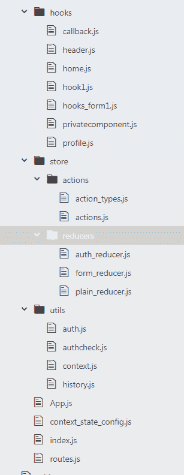

# 如何构建一个带路由和认证的 React Hooks 前端 app

> 原文：<https://www.freecodecamp.org/news/build-a-react-hooks-front-end-app-with-routing-and-authentication/>

在本教程中，我们将讨论如何构建一个完整的带有路由和认证的前端应用程序。

我已经把这个教程和项目组织成一个样板项目，带有基本的路由和认证，可以作为一个入门项目。

如果你只是想要没有解释的锅炉板代码，这里是:
[https://github . com/Iqbal 125/react-hooks-routing-auth-starter](https://github.com/iqbal125/react-hooks-routing-auth-starter)

我将使用 Auth0 进行身份验证，但是这种设置也适用于任何其他基于令牌的身份验证系统。你可以在 https://www.youtube.com/playlist?的
观看这个教程的完整视频版本 list = plmc 67 chet-yzxrbobcfhza 4 sboxnr 7 HD D5

> 在 Twitter 上与我联系，了解更多关于未来教程的更新:[https://twitter.com/iqbal125sf](https://twitter.com/iqbal125sf)

### 目录

1.  项目结构
2.  全局上下文状态的 useReducer 与 useState
3.  带上下文的全局状态
4.  认证和认证检查
5.  React 挂钩组件
6.  按指定路线发送
7.  App.js

## 项目结构

我将首先检查我们的应用程序的结构。我们的应用程序可以分为 4 个部分:

*   React 挂钩功能组件
*   减速器和动作
*   实用程序文件
*   主要文件

我们还需要 4 个库来构建我们的应用程序

`npm install auth0-js react-router react-router-dom history`

### 目录结构:



### React 挂钩功能组件

这里我们有 React 钩子功能组件。我们有一个相当简单的设置，我们不会在这个应用程序中使用任何 React 类组件。

**callback.js:** 将作为用户认证后 Auth0 重定向到的组件。

**header.js:** 将包含组件的链接和一个基于用户认证状态的登录或注销按钮。

**home.js:** 会简单显示 home 的文字。

**hook1.js:** 将包含 React 钩子更新状态的所有三种方式，`useState`、`useReducer`和`useContext`。在一个组件中拥有所有三种更新状态的方法将使您更容易找出它们之间的区别。

**hooks_form1.js:** 将有一个表单，它有三种更新状态的方法，分别是`useState`、`useReducer`和`useContext`。

**privatecomponent.js:** 只有通过认证的用户才能访问的组件。

**profile.js:** 显示用户个人资料数据的用户仪表板。

### 减速器和动作文件

**action_types.js:** 将所有字符串动作类型保存在变量中。这将允许容易地修改你的动作类型，因为你只需要在这里改变它们，而不是在你的代码中跟踪你曾经使用过的动作。

**actions.js:** 将保存实际的动作，这些动作将在 reducer 中用来更新状态。

**auth_reducer.js:** 将持有 reducer 读取和更新状态属性相关的认证。

**form_reducer.js:** 将持有 reducer 来读取和更新与我们的表单相关的状态属性。

**plain_reducer.js:** 将作为样板 reducer。

### 实用程序文件

我们还需要 4 个实用程序文件来帮助设置我们的应用程序。

**context.js:** 将保存上下文对象，并将导入到每个使用 useContext()钩子的组件中。

**auth.js:** 这将是 app 中唯一的一个类。注意，这不是一个 React 类组件，而是一个普通的 javascript 类。我试着把这个文件设置成一个箭头功能，但是效果不好。这个文件最好设置为一个类。这个文件将保存所有与身份验证相关的函数和变量。

**history.js:** 将保存我们将用于导航的历史对象。

**authcheck.js:** 将用于更新用户的认证状态，并检索用户配置文件数据并将其保存到全局状态。

### 主要文件

这些是主文件，将位于**根目录/src 目录**。我将读取和更新全局状态的所有业务逻辑放在一个文件`context_state_config.js`中。我这样做的理由如下。

将所有的复杂性放在一个文件中实际上会使你的应用程序更简单，更容易调试，因为很容易找到哪里需要修改和修复。

根据我的经验，拥有许多稍微复杂的组件实际上会让你的应用程序更难调试和更改。因此，我将所有的全局状态代码放在这个文件中。

同样在`context_state_config.js`中，`<Routes />`组件将被`<Context.Provider />`包裹。这将允许读取和更新状态的能力通过`value` prop 传递给所有组件，创建一个全局状态。

**context_state_config.js:** 这将保存所有用`useReducer`钩子和`context`读取和更新全局状态的逻辑。

**routes.js:** 将包含我们所有的路由逻辑，并且在这里也有静默认证。

**App.js:** 我们的根组件，我们将简单地导入并显示我们的`context_state_config.js`组件。

**index.js:** 我们的根文件，在这里只会渲染 App.js。

## 全局上下文状态的 useRedux 与 useState

为了管理全局状态，我们将使用**减少器和动作**。使用 Reducers 和 Actions 以及`useReducer()`钩子和**上下文**将允许我们在不实际使用 Redux 的情况下实现 **Redux** like 功能。

用`useState`钩子和**上下文**管理我们的全局状态是可能的，但是使用`useReducer`使管理全局状态更有组织性。`useState`钩子在处理本地组件状态方面要好得多。

与使用更加分散的`useState`挂钩相比，在同一个`useReducer`挂钩中拥有状态的相关属性和所有的更新状态函数使事情变得非常简单和条块化。

**与使用`useState`中的`setState`函数相比，调度动作**也使数据流更容易跟踪，因为每个动作将准确描述状态将如何改变。

我们也不需要使用联合收割机减速器功能或以任何方式联合我们的减速器。每个 reducer 将被传递到它自己的 useReducer 钩子中。

## 用上下文设置全局状态

我们可以从设置全局状态开始，在我看来，这使得构建 React 组件更加容易。

如果您已经设置了全局状态，那么您可以用一种非常简单的方式构建组件，而不必在设置组件和设置组件状态之间来回切换。

为了设置全局状态，我们需要创建我们的**动作、缩减器和上下文。**

让我们从我们的动作类型开始:

```
 //action_types.js

export const SUCCESS = "SUCCESS"

export const FAILURE = "FAILURE"

export const LOGIN_SUCCESS = "LOGIN_SUCCESS"

export const LOGIN_FAILURE = "LOGIN_FAILURE"

export const ADD_PROFILE = "ADD_PROFILE"

export const REMOVE_PROFILE = "REMOVE_PROFILE"

export const USER_INPUT_CHANGE = "USER_INPUT_CHANGE"

export const USER_INPUT_SUBMIT = "USER_INPUT_SUBMIT" 
```

**成功**和**失败:**将作为我们的锅炉板块动作。

**登录 _ 成功**和**登录 _ 失败**:用于更新用户的认证状态。LOGIN_SUCCESS 和 LOGOUT_SUCCESS 在这里也适用，但是我喜欢成功和失败的二分法。

**ADD_PROFILE** 和 **REMOVE_PROFILE:** 用于保存从 Auth0 到全局状态的配置文件数据。

**USER_INPUT_CHANGE** 和 **USER_INPUT_SUBMIT:** 用于跟踪用户提交的表单文本的修改和提交。

### 动作:

```
//actions.js

import * as ACTION_TYPES from './action_types'

export const SUCCESS = {
  type: ACTION_TYPES.SUCCESS
}

export const FAILURE = {
  type: ACTION_TYPES.FAILURE
}

export const success = () => {
  return {
    type: ACTION_TYPES.SUCCESS
  }
}

export const failure = () => {
  return {
    type: ACTION_TYPES.FAILURE
  }
}

export const login_success = () => {
  return {
    type: ACTION_TYPES.LOGIN_SUCCESS
  }
}

export const login_failure = () => {
  return {
    type: ACTION_TYPES.LOGIN_FAILURE
  }
}

export const add_profile = (profile) => {
  return {
    type: ACTION_TYPES.ADD_PROFILE,
    payload: profile
  }
}

export const remove_profile = () => {
  return {
    type: ACTION_TYPES.REMOVE_PROFILE
  }
}

export const user_input_change = (text) => {
  return {
    type: ACTION_TYPES.USER_INPUT_CHANGE,
    payload: text
  }
}

export const user_input_submit = (text) => {
  return {
    type: ACTION_TYPES.USER_INPUT_SUBMIT,
    payload: text
  }
} 
```

为了简单起见，我把所有的动作都变成了动作创造者，而不是一些作为动作，一些作为动作创造者。

前两个变量`SUCCESS`和`FAILURE`是常规动作。

### 授权缩减者:

```
//auth_reducer.js

import * as ACTION_TYPES from '../actions/action_types'

export const initialState = {
  is_authenticated: false,
  profile: null
}

export const AuthReducer = (state = initialState, action) => {
    switch(action.type) {
      case ACTION_TYPES.LOGIN_SUCCESS:
        return {
          ...state,
          is_authenticated: true
        }
      case ACTION_TYPES.LOGIN_FAILURE:
        return {
          ...state,
          is_authenticated: false
        }
      case ACTION_TYPES.ADD_PROFILE:
        return {
          ...state,
          profile: action.payload
        }
      case ACTION_TYPES.REMOVE_PROFILE:
        return {
          ...state,
          profile: null
        }
      default:
        return state
    }
} 
```

这里有我们的`auth_reducer.js`，它将保存我们的状态属性和对**用户认证状态**和**用户配置文件数据的相关动作。**

重要的是要注意，我们导出的是缩减器和初始状态，而不是像 React Redux 那样只导出默认的缩减器。

### 表单 _ 缩减器:

```
//form_reducer.js

import * as ACTION_TYPES from '../actions/action_types'

export const initialState = {
  user_textChange: '',
  user_textSubmit: ''
}

export const FormReducer = (state, action) => {
    switch(action.type) {
      case ACTION_TYPES.USER_INPUT_CHANGE:
        return {
          ...state,
          user_textChange: action.payload
        }
      case ACTION_TYPES.USER_INPUT_SUBMIT:
        return {
          ...state,
          user_textSubmit: action.payload
        }
      default:
        throw new Error();
    }
} 
```

这里我们有一个表单的两个属性。我们的第一个属性跟踪输入元素的变化，第二个属性将提交的表单添加到全局状态。

### 普通减速器:

```
//plain_reducer.js

import * as ACTION_TYPES from '../actions/action_types'

export const initialState = {
  stateprop1: false,
  stateprop2: false
}

export const Reducer1 = (state = initialState, action) => {
    switch(action.type) {
      case ACTION_TYPES.SUCCESS:
        return {
          ...state,
          stateprop1: true,
          stateprop2: true
        }
      case ACTION_TYPES.FAILURE:
        return {
          ...state,
          stateprop1: false,
          stateprop2: false
        }
      default:
        throw new Error();
    }
}
```

就像我们成功和失败的行为一样，如果我们想要创建新的 reducer，这个 reducer 将作为样板。

### 设置上下文对象

我们现在必须初始化我们的上下文对象。我们可以在 **utils** 目录下的一个`context.js`文件中这样做。

```
import React from 'react';

const Context = React.createContext()

export default Context; 
```

这就是我们初始化上下文变量所要做的一切。我们现在可以通过将它导入到我们的`context_state_config.js`文件中来使用它。

## 带上下文的全局状态

```
import React, { useReducer } from 'react';
import Context from './utils/context';
import * as ACTIONS from './store/actions/actions';

import * as Reducer1 from './store/reducers/plain_reducer';
import * as AuthReducer from './store/reducers/auth_reducer';
import * as FormReducer from './store/reducers/form_reducer';
import Routes from './routes';

import Auth from './utils/auth';

const auth = new Auth()

const ContextState = () => {
    /*
        Plain Reducer
    */
    const [stateReducer1, dispatchReducer1] = useReducer(Reducer1.Reducer1,
                                                         Reducer1.initialState)

    const handleDispatchTrue = () => {
      //    dispatchReducer1(type: "SUCCESS")
      //    dispatchReducer1(ACTIONS.SUCCESS)
      dispatchReducer1(ACTIONS.success())
    }

    const handleDispatchFalse = () => {
      //     dispatchReducer1(type: "FAILURE")
      //    dispatchReducer1(ACTIONS.FAILURE)
      dispatchReducer1(ACTIONS.failure())
    }

    /*
      Auth Reducer
    */
    const [stateAuthReducer, dispatchAuthReducer] =                      useReducer(AuthReducer.AuthReducer,
                                                           AuthReducer.initialState)

    const handleLogin = () => {
      dispatchAuthReducer(ACTIONS.login_success())
    }

    const handleLogout = () => {
      dispatchAuthReducer(ACTIONS.login_failure())
    }

    const handleAddProfile = (profile) => {
      dispatchAuthReducer(ACTIONS.add_profile(profile))
    }

    const handleRemoveProfile = () => {
      dispatchAuthReducer(ACTIONS.remove_profile())
    }

    /*
      Form Reducer
    */

        const [stateFormReducer, dispatchFormReducer] = useReducer(FormReducer.FormReducer, FormReducer.initialState)

    const handleFormChange = (event) => {
      dispatchFormReducer(ACTIONS.user_input_change(event.target.value))
    };

    const handleFormSubmit = (event) => {
      event.preventDefault();
      event.persist();             dispatchFormReducer(ACTIONS.user_input_submit(event.target.useContext.value))
    };

    //Handle authentication from callback
    const handleAuthentication = (props) => {
      if(props.location.hash) {
        auth.handleAuth()
      }
    }

    return(
      <div>
      <Context.Provider
          value={{
            //Reducer1
            stateProp1: stateReducer1.stateprop1,
            stateProp2: stateReducer1.stateprop2,
            dispatchContextTrue: () => handleDispatchTrue(),
            dispatchContextFalse: () => handleDispatchFalse(),

            //Form Reducer
            useContextChangeState: stateFormReducer.user_textChange,
            useContextSubmitState: stateFormReducer.user_textSubmit,
            useContextSubmit: (event) => handleFormSubmit(event),
            useContextChange: (event) => handleFormChange(event),

            //Auth Reducer
            authState: stateAuthReducer.is_authenticated,
            profileState:  stateAuthReducer.profile,
            handleUserLogin: () => handleLogin(),
            handleUserLogout: () => handleLogout(),
            handleUserAddProfile: (profile) => handleAddProfile(profile),
            handleUserRemoveProfile: () => handleRemoveProfile(),

            //Handle auth
            handleAuth: (props) => handleAuthentication(props),
            authObj: auth
          }}>
          <Routes />
      </Context.Provider>
      </div>
    )
}

export default ContextState;
```

> *注意，你可能不希望在一个真实的应用程序中有这么多变量和函数，这只是为了演示。只需删除不需要的属性。

> * *注意:您还可以在 value prop 内部的属性上使用对象析构，以使代码更加简洁。例:`{ handlelogin }`而不是`handleUserLogin: () => handleLogin()`。但是我把它们分开了，这样对于不熟悉析构的人来说，在子组件中如何访问上下文属性就更容易了。

### 导入减速器和 useReducer()

我将以 Reducer1 为例解释这是如何工作的，但这也适用于其他 Reducer。

我们首先从最顶层开始，导入我们所有的动作和 reducers。然后我们将我们的`Reducer1`和它的初始状态传递给`useReducer()`钩子。我们使用语法`import * as Reducer1`,因为我们想要导入`Reducer1`和`initialState`。然后我们使用语法`Reducer1.Reducer1`来访问`Reducer1`，并且可以使用`Reducer1.initailState`来访问`intialState`。

之后，我们使用数组析构来保存`useReducer()`钩子的结果。

在上面的例子中，`stateReducer1`是我们如何访问在`Reducer1`的`intialState`中定义的状态属性。

是我们的调度功能，允许我们用动作更新状态。

### 减速器命名方案

您可能已经知道，我更喜欢的命名方案是“state”和“dispatch”这两个词，后面是它们各自的 reducer 名称。

我发现这是最有效的命名方案，因为它没有关于哪个状态和分派函数属于哪个缩减器的歧义，这很重要，因为我们没有组合缩减器。

### 行动

我们的操作来自我们在上一节中设置的同一个操作文件。我们将它们全部导入到这里，并且可以使用语法 ACTIONS.name_of_action()来访问每个操作。

这就是我们传递给`dispatch`函数的内容，它告诉我们的 reducer 如何更新状态。

在我们的`useReducer()`钩子调用之后，我们有我们的`handleDispatchTrue()`和`handleDispatchFalse()`函数，它们分派我们的`SUCCESS`和`FAILURE`动作来将我们的`stateprop1`和`stateprop2`从假变为真，反之亦然。

您可以将分派函数直接传入“值”属性，但是将它们放在各自的`useReducer`挂钩下的函数中会使代码更有组织性和可读性。

我还留下了另外两种分派动作的方法。所有这三种分派动作的方式都在做同样的事情，分派一个 javascript 对象，该对象的 type 属性的值为字符串“SUCCESS”。

### 自动减速器

接下来是我们的`AuthReducer`。我们的设置类似于普通减速器。无论用户是否登录，我们都会更新我们的用户身份验证状态，还会在全局状态中添加和删除他们的用户配置文件数据。请记住将配置文件参数传递给操作创建者。

### 降形剂

在此之后，我们有我们的`FormReducer`，它也将设置类似于以前的减速器。

由于这些动作将用于一个表单，我们需要将关键字`event`作为参数传递给两个函数。为了访问用户输入的文本，我们需要使用语法`event.target.value`。这是普通 javascript 的一部分，也是访问表单数据的标准方式。

我们的`handleFormSubmit()`函数有点不同。首先我们必须使用`event.preventDefault()`函数来防止页面重新加载。

然后我们使用`event.persist()`函数。因为我们使用了上下文，并且这些数据来自子组件，所以我们必须使用这个函数来使表单正常工作。然后我们使用语法`event.target.useContext.value`来访问用户提交的文本

“useContext”指的不是钩子，而是提供给表单输入元素的用户定义的`id`属性。我决定将 id 命名为“useContext ”,因为该组件还有另外两种形式，它们使用“useState”和“useReducer”挂钩来保存状态，因此 id 为“useState”和“useReducer”。

### 内容提供商

设置好`useReducer`挂钩后，我们就有了 JSX 的`<Context.Provider />`组件。我们现在将刚刚定义的所有函数和状态值传递给`value`属性。

我们从`stateprop1`和`stateprop2`开始。重要的是要注意，它们每个都必须用点符号分别访问，因为`stateReducer1`包含了整个`initialState`对象。

我们还定义了另外两个属性，`dispatchContextTrue`和`dispatchContextFalse`，并为每个属性传入一个箭头函数来调用我们的`handleDispatchTrue()`和`handleDispatchFalse()`函数。将属性命名为不同于函数名称可能会有所帮助。这有助于您更好地了解子组件中发生了什么。

接下来，我们将通过设置身份验证来继续构建我们的应用程序。

## 认证和认证检查

这里我们有我们的`auth.js`文件，它将被设置为一个 Javascript 类。我们将使用 Auth0 和`auth0-js`库来帮助我们进行身份验证。

身份验证实用程序文件将按如下方式设置:

```
import auth0 from 'auth0-js'
import history from './history';

export default class Auth {
  auth0 = new auth0.WebAuth({
    domain: 'webapp1.auth0.com',
    clientID: '',
    redirectUri: 'http://localhost:3000/callback',
    responseType: 'token id_token',
    scope: 'openid profile email'
  })

  userProfile = {}

  login = () => {
      this.auth0.authorize()
  }

  handleAuth = () => {
    this.auth0.parseHash((err, authResult) => {
      if(authResult) {
        localStorage.setItem('access_token', authResult.accessToken)
        localStorage.setItem('id_token', authResult.idToken)

        let expiresAt = JSON.stringify((authResult.expiresIn * 1000 + new Date().getTime()))
        localStorage.setItem('expiresAt', expiresAt)

        this.getProfile();
        setTimeout(() => { history.replace('/authcheck') }, 600);
      } else {
        console.log(err)
      }
    })
  }

  getAccessToken = () => {
    if(localStorage.getItem('access_token')) {
      const accessToken = localStorage.getItem('access_token')
      return accessToken
    } else {
      return null
    }
  }

  getProfile = () => {
    let accessToken = this.getAccessToken()
    if(accessToken) {
      this.auth0.client.userInfo(accessToken, (err, profile) => {
          if(profile) {
            this.userProfile = { profile }
          }
      } )
    }
  }

  logout = () => {
    localStorage.removeItem('access_token')
    localStorage.removeItem('id_token')
    localStorage.removeItem('expiresAt')
    setTimeout(() => { history.replace('/authcheck') }, 200);
  }

  isAuthenticated = () => {
    let expiresAt = JSON.parse(localStorage.getItem('expiresAt'))
    return new Date().getTime() < expiresAt
  }

} 
```

`auth0` **:** 这是我们将用来初始化我们的 Auth0 应用程序的属性。

`userProfile` **:** 这是一个空对象，将保存我们从 Auth0 获得的用户配置文件数据。

`login`:这将调出 Auth0 登录小部件，允许用户使用给定的`.authorize()`函数登录。

`handleAuth`:这个函数将我们从 Auth0 获得的 id 和访问令牌保存到本地浏览器存储中。此函数还设置令牌过期时间。

`getAccessToken` **:** 从本地存储器获取访问令牌

`getProfile`:解析访问令牌，提取用户配置文件数据

`logout` **:** 通过从本地存储中删除令牌来注销用户

`isAuthenticated` **:** 通过比较过期时间和当前时间来确保用户登录。

现在我们可以初始化这个 auth 对象，并将身份验证添加到`context_state_config.js`文件中。

```
....

import Auth from './utils/auth';

const auth = new Auth()

const ContextState = () => {

....

//Handle authentication from callback
    const handleAuthentication = (props) => {
      if(props.location.hash) {
        auth.handleAuth()
      }
    }

....

        //Handle auth
        handleAuth: (props) => handleAuthentication(props),
        authObj: auth
        }}>
       <Routes />
     </Context.Provider>

.... 
```

`new Auth ()`是我们如何初始化我们的类，然后将它保存在`auth`变量中。

接下来我们创建一个`handleAuthentication()`函数。如果`props.location.hash`为真，那么我们调用刚刚在 Auth 类中设置的`auth.handleAuth()`函数。`props.location.hash`是一个给定的 react-router 功能，它检查 URL 散列片段中是否有任何值。

如果 Auth0 成功地验证了一个用户，那么访问和 id 标记将包含在 URL 的散列之后，使`props.location.hash`为真，这将调用 Auth 类中的`handleAuth()`函数。

在`<Context.Provider />`中，我们有 2 个属性，`handleAuth`调用我们的`handleAuthentication()`函数，`authObj`用来传递我们的整个 Auth 类，并允许所有组件访问我们的认证函数和变量。

这是我们的`authcheck.js`实用程序组件:

```
import React, { useEffect, useContext } from 'react';
import history from './history';
import Context from './context';
import * as ACTIONS from '../store/actions/actions';

const AuthCheck = () => {
  const context = useContext(Context)

  useEffect(() => {
    if(context.authObj.isAuthenticated()) {
      context.handleUserLogin()
      context.handleUserAddProfile(context.authObj.userProfile)
      history.replace('/')
    }
    else {
      context.handleUserLogout()
      context.handleUserRemoveProfile()
      history.replace('/')
      }
    }, [])

    return(
        <div>
        </div>
    )}

export default AuthCheck; 
```

这个组件本质上就是我们如何使用`useEffect()`钩子更新认证状态的。

该组件将在用户每次登录和注销时呈现。让一个组件在每次登录和注销后呈现将使我们不必处理和更新每个组件中的上下文认证状态。

在我们的`AuthCheck`组件中，我们首先从设置`useContext()`钩子开始。然后我们定义一个条件语句来检查我们在 auth 类中设置的`isAuthenticated()`函数是否返回 true，表明本地存储中的 Auth 令牌没有过期，用户仍然通过了身份验证。

我们用语法`context.authObj.isAuthenticated`访问这个函数。

我们可以这样做，因为我们将整个`Auth`类作为名为`authObj`的属性传递给上下文中的`value`属性。

如果`isAuthentciated()`为真，我们调用我们的属性将我们的**登录状态**更改为真，并将**用户配置文件数据**保存为全局状态。

如果用户注销，我们做相反的事情。

我们返回一个空的 div，因为我们只是更新状态，不需要在 UI 中显示任何东西。加载屏幕在这里会很好，但这是另一个教程。

但是现在，我们已经完成了全局状态和认证系统的设置，我们现在可以设置 React Hooks 组件了。

## React 挂钩组件

首先，我们将从我们的 **callback.js** 组件开始

```
import React from 'react'

const Callback = props => (
    <div>
      Callback
    </div>
);

export default Callback; 
```

该组件是用户使用 Auth0 登录后重定向到的组件。从这里，用户被重定向到 authcheck 页面，然后是主页

### Header.js

```
import React, { useContext } from 'react';
import { Link } from 'react-router-dom';
import Context from '../utils/context';

const Header = () => {
  const context = useContext(Context)

    return(
        <div>
          <Link to='/' style={{padding: '5px'}}>
            Home
          </Link>
          <Link to='/profile' style={{padding: '5px'}}>
            Profile
          </Link>
          <Link to='/hooksform' style={{padding: '5px'}}>
            Hooks Form
          </Link>
          <Link to='/hookscontainer' style={{padding: '5px'}}>
            Hooks Container
          </Link>
          <Link to='/privateroute' style={{padding: '5px'}}>
            Private Route
          </Link>
          {!context.authState
            ? <button onClick={() => context.authObj.login()}>Login</button>
            : <button onClick={() => context.authObj.logout()}>Logout</button>
          }
        </div>
  )};

export default Header;
```

这里我们有所有组件的链接。我们还有一个三元表达式，根据用户是否经过身份验证来显示登录或注销按钮。

### home.js

```
import React from 'react'

const Home = props => (
    <div>
      Home
    </div>
);

export default Home; 
```

简单的 home.js 组件

### hooks1.js

```
import React, { useContext, useState, useEffect, useReducer } from 'react';
import * as ACTIONS from '../store/actions/actions';
import * as Reducer1 from '../store/reducers/plain_reducer';
import Context from '../utils/context';

const HooksContainer1 = () => {
  const context = useContext(Context)

  const [value, setValue] = useState(0)

  const [useEffectValue, setUseEffectValue] = useState(null)

  const [state, dispatch] = useReducer(Reducer1.Reducer1, Reducer1.initialState)

  useEffect(() => {
      setTimeout(() => setUseEffectValue("useEffect worked"), 3000 );
  }, [value])

  const incrementValue = () => {
    setValue(value + 1 )
  }

  const decrementValue = () => {
    setValue(value - 1 )
  }

  const handleuseEffectValue = () => {
    setUseEffectValue("some string")
  }

  const handleDispatchTrue = () => {
    //    dispatch2(type: "SUCCESS")
    //    dispatch2(ACTIONS.SUCCESS)
    dispatch(ACTIONS.success())
  }

  const handleDispatchFalse = () => {
    //     dispatch2(type: "FAILURE")
    //    dispatch2(ACTIONS.FAILURE)
    dispatch(ACTIONS.failure())
  }

  return (
    <div>
      <div>
      <button onClick={() => handleuseEffectValue()}> Handle Value  </button>
      <button onClick={() => handleDispatchTrue()}>Dispatch True </button>
      <button onClick={() => handleDispatchFalse()}>Dispatch False </button>
      <button onClick={() => context.dispatchContextTrue()}>Dispatch Context True </button>
      <button onClick={() => context.dispatchContextFalse()}>Dispatch Context False </button>
      <button onClick={() => incrementValue()}> Add Local Value </button>
      <button onClick={() => decrementValue()}> Dec Local Value </button>
      <br />
      <br />
      {context.useContextSubmitState
        ? <h3> {context.useContextSubmitState} </h3>
        : <h3> No User Text </h3>
      }
      <br />
      {state.stateprop1
        ? <p> stateprop1 is true </p>
        : <p> stateprop1 is false </p>
      }
      <br />
      {context.stateProp2
        ? <p> stateprop2 is true </p>
        : <p> stateprop2 is false </p>
      }
      <br />
      {useEffectValue
        ? <p> { useEffectValue }</p>
        : <p> No value </p>
      }
      <br />
      <p>Local Value: {value}</p>
      <br />
      <br />
      </div>
    </div>
  )
}

export default HooksContainer1;
```

我将该组件创建为样板文件，以便在一个组件中拥有读取和更新状态的所有方法。这使得查看语法差异变得更加容易。

**`incrementValue`** 和 **`decrementValue`** 就是我们用`useState()`钩子更新本地状态的方法。

**`handleuseEffectValue`** 就是我们如何更新本地状态的`useEffectValue`属性。

**`handleDispatchTrue`****`handleDispatchFalse`**就是我们如何调度自己的行动，将`Reducer1`中的`stateprop1`由真变假，反之亦然。请注意，这仍然是本地状态，即使我们使用了 reducers 和 actions。

**`handleContextDispatchTrue`** 和 **`handleContextDispatchFalse`** 是我们如何使用与`handleDispatchTrue`和`handleDispatchFalse`函数相同的动作和缩减器来更新我们的全局状态。

在我们的 JSX 中，我们还可以看到每个功能都有自己的按钮。

**`context.useContextSubmitState`** 是我们如何从一个保存值到全局状态的表单中显示文本，我们将在下面看到

**`state.stateprop1`** 是我们前段时间设置的`Reducer1` `initialState`中的`stateprop1`属性，`state`是顶部`useRedcuer`钩子中的自定义关键字。整个`initialState`包含在`state`中。

**`context.stateProp2`** 是我们从上下文全局状态中得到的`stateprop2`值。

**`useEffectValue`** 是从`useState`挂机呼叫的本地状态。

### hooks_form1.js

这里有我们的`hooks1_form.js`，它展示了如何使用`useReducer`、`useState`和`useContext`钩子保存表单的状态。

```
import React, { useContext, useState, useReducer } from 'react';
import * as ACTIONS from '../store/actions/actions';
import * as FormReducer from '../store/reducers/form_reducer';
import Context from '../utils/context';

const HooksForm1 = () => {
  const context = useContext(Context)

  const [valueChange, setValueChange] = useState('')
  const [valueSubmit, setValueSubmit] = useState('')

  const [state, dispatch] = useReducer(FormReducer.FormReducer,
                                       FormReducer.initialState)

  const handleuseStateChange = (event) => (
    setValueChange(event.target.value)
  );

  const handleuseStateSubmit = (event) => {
    event.preventDefault();
    setValueSubmit(event.target.useState.value)
  };

  const handleuseReducerChange = (event) => (
    dispatch(ACTIONS.user_input_change(event.target.value))
  );

  const handleuseReducerSubmit = (event) => {
    event.preventDefault();
    dispatch(ACTIONS.user_input_submit(event.target.useReducer.value))
  };

    return (
      <div>
        <form onSubmit={handleuseStateSubmit}>
          <label> React useState: </label>
          <input id="useState" onChange={handleuseStateChange} type="text" />
          <button type="submit"> Submit </button>
        </form>
        <br />
        <form onSubmit={handleuseReducerSubmit}>
          <label> React useReducer: </label>
          <input id="useReducer" onChange={handleuseReducerChange} type="text" />
          <button type="submit"> Submit </button>
        </form>
        <br />
        <form onSubmit={context.useContextSubmit}>
          <label> React useContext: </label>
          <input id="useContext" onChange={context.useContextChange} type="text" />
          <button type="submit"> Submit </button>
        </form>
        <br />

        <h3>React useState:</h3>
        <p>Change: {valueChange}</p>
        <p>Submit: {valueSubmit}</p>

        <h3>React useReducer:</h3>
        <p>Change: {state.user_textChange}</p>
        <p>Submit: {state.user_textSubmit}</p>
        <br />
        <h3>React useContext:</h3>
        <p>Change: {context.useContextChangeState}</p>
        <p>Submit: {context.useContextSubmitState}</p>
        <br />
        <br />
      </div>
    )
}

export default HooksForm1; 
```

该表单显示了更新状态的三种方式，并遵循与我们在前一个组件中看到的完全相同的方法。

### 私有组件. js

```
import React from 'react'

const PrivateComponent = props => (
    <div>
      Private Component
    </div>
);

export default PrivateComponent;
```

此 privatecomponent 将在私有路由中使用，并且只能由经过身份验证的用户访问。

### 简介. js

```
import React, { useContext } from 'react';
import Context from '../utils/context';

const Profile = () => {
  const context = useContext(Context)

  const RenderProfile = (props) => {
    return(
      <div>
        <h1>{props.profile.profile.nickname}</h1>
        <br />
        
        <br />
        <h4> {props.profile.profile.email}</h4>
        <br />
        <h5> {props.profile.profile.name} </h5>
        <br />
        <h6> Email Verified: </h6>
        {props.profile.profile.email_verified ? <p>Yes</p> : <p>No</p> }
        <br />
      </div>
     )
   }

    return(
      <div>
        <RenderProfile profile={context.authObj.userProfile} />
      </div>
  )}

export default (Profile);
```

这里我们显示用户配置文件数据。用户配置文件数据可从 Auth0 获得，我们不必手动设置。我们从通过`context`传递的`authObj`中获取用户资料数据。

## 按指定路线发送

在我们设置路由之前，我们需要首先设置`history.js`文件，幸运的是这很容易做到。

```
import { createBrowserHistory } from 'history'

export default createBrowserHistory() 
```

最后，我们可以设置我们的路由:

```
import React, { useContext, useEffect } from 'react';
import { Router, Route, Switch, Redirect } from 'react-router';
import history from './utils/history';
import Context from './utils/context';
import AuthCheck from './utils/authcheck';

import Home from './hooks/home';
import Header from './hooks/header';
import HooksContainer1 from './hooks/hook1';
import Callback from './hooks/callback';
import HooksForm from './hooks/hooks_form1';
import PrivateComponent from './hooks/privatecomponent';
import Profile from './hooks/profile';

const PrivateRoute = ({component: Component, auth }) => (
  <Route render={props => auth === true
    ? <Component auth={auth} {...props} />
    : <Redirect to={{pathname:'/'}} />
  }
  />
)

const Routes = () => {
    const context = useContext(Context)

      return(
        <div>
          <Router history={history} >
          <Header />
          <br />
          <br />
          <div>
            <Switch>
              <Route exact path='/' component={Home} />
              <Route path='/hooksform' component={HooksForm} />
              <Route path='/profile' component={Profile} />
              <Route path='/hookscontainer' component={HooksContainer1} />
              <Route path='/authcheck' component={AuthCheck} />

              <PrivateRoute path='/privateroute'
                            auth={context.authState}
                            component={PrivateComponent} />
              <PrivateRoute path="/profile"
                            auth={context.authState}
                            component={Profile} />
              <Route path='/callback'
					 render={(props) => {
                         context.handleAuth(props);                                                            return <Callback />}} />

            </Switch>
          </div>
          </Router>
        </div>
  )}

export default Routes;
```

我们首先从导入所有的实用程序文件和组件开始。以及 React 路由器的路由器组件。

然后我们有一个`PrivateRoute`高阶组件，它将负责我们的私有路由。

一个 **HOC** 接收一个组件并返回另一个组件。这里我们传入一个组件，并根据用户认证状态返回一个`<Route />`组件或一个`<Redirect />`组件。我们用一个三元表达式检查我们的`render` prop 中的 auth 状态。

接下来是我们实际的路由器功能。我们将从主要的`<Router />`组件开始，它将包装我们所有的路由和报头。

我们总是希望显示标题，所以我们当然会把它放在`<Switch />`组件之外。然后，我们的`<Switch />`组件将包装我们所有的路线。我们可以使用`<Route />`组件的`path`和`component`道具来定义路线和组件。

我们的`<PrivateRoute />`组件有点不同。我们必须像对常规的`<Route />`一样指定`path`和`component`道具，但是我们还必须创建一个包含用户认证状态的`auth`道具。我们从我们在认证部分讨论过的全局上下文状态中获得这个值，但是基本上这个`auth`属性包含了来自全局状态的`AuthReducer`属性的值。

最后，我们有了`/callback`路线，它的设置有点不同。由于这是 Auth0 重定向到的组件，我们必须在这里调用`handleAuth()`函数，但是我们也必须呈现`<Callback />`组件。

我们通过调用`render` prop 中的两个函数来解决这个问题，我们可以将 arrow 函数的主体放在花括号`{}`中，并用分号`;`分隔每个函数。

此外，一定要用`<Context.Provider />`将所有路线括起来

```
//context_state_config.js
...    
     <Context.Provider>
    	 <Routes />
     </Context.Provider>

 ... 
```

用`<Context.Provider />`包装所有的路由本质上是状态如何传递给所有的组件，并成为全局的。

### App.js

```
import React from 'react';
import ContextState from './context_state_config';

const App = () => {

    return(
      <div>
     	 <ContextState />
      </div>
    )
}

export default App;
```

现在我们剩下要做的唯一一件事就是将我们的`<ContextState />`组件导入到我们的`App.js`文件中来完成我们的应用程序。

我们完了。感谢阅读。

> 在 Twitter 上与我联系，了解更多关于未来教程的更新:[https://twitter.com/iqbal125sf](https://twitter.com/iqbal125sf)