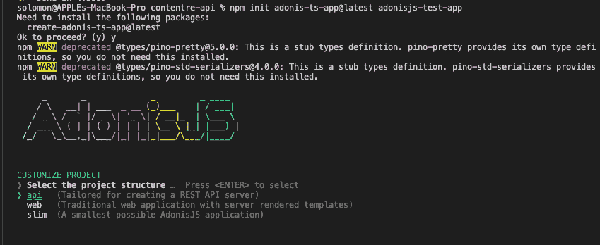
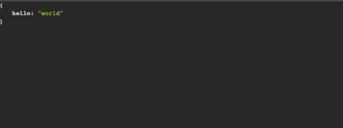
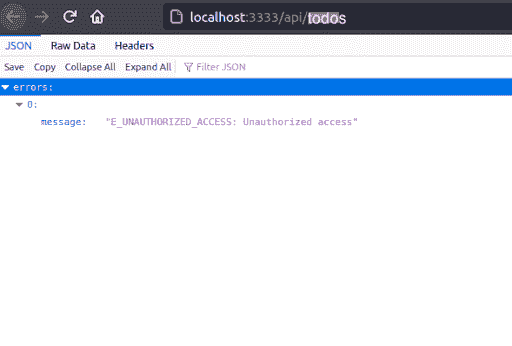
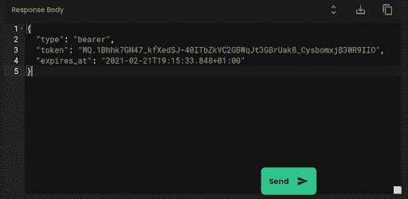
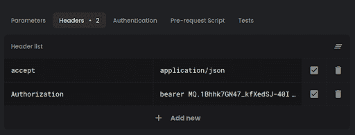
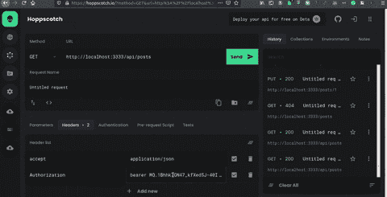

# 如何用 AdonisJS 构建 RESTful API

> 原文：<https://www.freecodecamp.org/news/build-a-restful-api-with-adonisjs/>

作为一名开发人员，理解 API 是如何工作的非常重要。API 帮助弥合了前端和后端之间的鸿沟。它们还允许您分离大型代码库的各个部分，并利用微服务架构。

这种关注点的分离使得学习和构建 RESTful APIs 成为任何软件工程师都需要的技能，尤其是后端开发人员。

在本教程中，我们将探索用 AdonisJS 5 构建 RESTful APIs 的本质。您将了解如何在 AdonisJS 5 框架中正确构建身份验证和授权过程。

AdonisJS 是 JavaScript 的 Laravel，是一项非常受欢迎的技能。所以学习用它来构建你的第一个 REST API 将会是一个游戏改变者。

你可以通读《AdonisJS 5 终极指南》来了解更多。

# 您将学到的内容:

1.  如何设置 AdonisJS
2.  如何创建数据库
3.  如何设置授权和认证
4.  如何创建 Todo 模型
5.  如何创建 Todo 控制器
6.  如何创建端点路由
7.  如何测试 Todo API
8.  结论

# 如何设置 AdonisJS 5

随着 AdonisJS 框架最近越来越受欢迎，设置 adon isjs 变得更加容易。

如果您已经使用了 JavaScript 框架，那么您应该已经安装了 Node.js。如果没有，可以从[官方文档](https://nodejs.org/en/)安装 Node.js 的最新版本。

确保您安装了所需的 Node.js 版本，这也将安装正确的 NPM 版本。AdonisJS 5 需要 Node.js 版本 12 和 NPM 版本 6 及更高版本。

如果您已经按照文档中的步骤在本地计算机上正确安装并设置了 Node.js 和 NPM，则可以通过运行以下命令创建一个新的 AdonisJS 5 项目:

```
npm init adonis-ts-app@latest adonisjs-test-app
```

该命令将询问项目结构。只需选择 API 服务器并继续使用其他默认选项，如下所示:



Screenshot showing the API option to select

最后，在成功安装后，用任何文本编辑器打开文件夹，并运行以下命令来启动和检查项目的新更改:

```
cd <PROJECT_NAME>

node ace serve –watch
```

如果一切顺利，没有错误，用生成的 URL 打开浏览器。下面是欢迎页面的截图。



A screenshot of AdonisJS API preview page

# 如何创建数据库

现在我们已经成功安装了 Adonis，让我们继续构建一个 Todo 应用程序 API，以了解使用 AdonisJS 创建 RESTful API 的本质。

我们将从用适当的数据库模式和结构创建和播种数据库开始，这些模式和结构将表示 Todo 应用程序的数据存储。

首先，我们需要创建一个新的 MySQL 数据库。您可以使用这些数据库客户机来创建和管理您的数据库。

接下来，我们将安装和配置 AdonisJS Lucid。这是一个强大的 ORM for AdonisJS，您可以使用它来访问和操作数据库，而无需编写任何 SQL 查询。

让我们使用以下命令安装 Lucid:

```
npm install @adonisjs/lucid
```

要使用项目和新创建的数据库配置新安装的包，请运行以下命令:

```
node ace invoke @adonisjs/lucid
```

该命令将显示不同的数据库选项。选择 MySQL/MariaDB，最后选择`In the Terminal`查看说明。

通读说明，并使用正确的数据库凭证相应地更新您的`.env`文件，如下所示:

```
DB_CONNECTION=mysql
MYSQL_HOST=localhost
MYSQL_PORT=3306
MYSQL_USER= //DB_USER
MYSQL_PASSWORD= //DB_PASSWORD
MYSQL_DB_NAME= //DB_NAME
```

如果您在测试 Todo API 时遇到此错误–`Client does not support authentication protocol requested by server;`,请按照以下步骤解决它:

```
npm install mysql2
```

打开`config/database.ts`并将`client`字段更新为`mysql2`。这应该可以修复 bug，并为开发和测试做好准备。

AdonisJS 5 使得开发 RESTful APIs 变得非常容易。通过一个包，您可以建立一个完整的身份验证和授权流程。

在下一节中，我们将讨论如何通过认证和授权来保护我们的 API。

# 如何设置授权和认证

要设置身份验证和授权，请从 AdonisJS 安装 Auth 包，并配置您的身份验证和授权过程。

您可以使用以下命令安装授权包:

```
npm install @adonisjs/auth@alpha
```

接下来，使用以下命令调用`invoke`命令来配置新安装的 Auth 包:

```
node ace invoke @adonisjs/auth
```

当您调用 invoke 命令时，它将带您完成授权包的配置过程。按照以下步骤为 Todo 应用程序设置 API 令牌身份验证流程:

1.  选择`Lucid`和`API Token`，因为我们正在构建 API。
2.  键入`User`型号以进行身份验证。
3.  按`Y`创建新的用户迁移。
4.  选择`Database`作为您的提供商。
5.  按下`Y`创建一个`api_token`迁移。

成功完成这些步骤后，您应该在`database/migrations`文件夹中生成了 2 个迁移。您打开`xxxx_users.ts`迁移，根据您的应用程序需求更新信息。

这里是我们的用户为这个演示进行迁移的一个例子。

```
import BaseSchema from '@ioc:Adonis/Lucid/Schema'

export default class UsersSchema extends BaseSchema {
  protected tableName = 'users'

  public async up () {
    this.schema.createTable(this.tableName, (table) => {
      table.increments('id').primary()
      table.string('name', 255).notNullable()
      table.string('email', 255).notNullable()
      table.string('password', 180).notNullable()
      table.string('remember_me_token').nullable()
      table.timestamps(true)
    })
  }

  public async down () {
    this.schema.dropTable(this.tableName)
  }
}
```

最后，我们将把`auth`中间件添加到`start/kernel.ts`文件中。这将总是检查每个请求，以确保它得到正确的认证。

```
Server.middleware.registerNamed({
auth: 'App/Middleware/Auth',
})
```

在设置了身份验证和授权之后，我们需要为 Todo 应用程序创建更多的迁移。

在下一节中，我们将创建更多的迁移，并将数据植入 Todo 应用程序进行测试。

# 如何创建迁移

接下来，我们将按照下面概述的步骤为 Todo 模型创建剩余的迁移。

要创建新的迁移，请键入以下命令:

```
node ace make:migration todos
```

运行命令后，在`database/migrations/xxxx_todos.ts`中打开新文件，并粘贴以下代码。

```
import BaseSchema from "@ioc:Adonis/Lucid/Schema";

export default class Todos extends BaseSchema {
	protected tableName = "todos";

	public async up() {
        this.schema.createTable(this.tableName, (table) => {
            table.increments("id");
            table.string("title", 255).notNullable();
            table.string("desc", 255).notNullable();
            table.boolean("done").default(false);
            table.timestamps(true);
		});
	}

	public async down() {
		this.schema.dropTable(this.tableName);
	}
}
```

目前，我们保持简单，不定义任何数据库约束。最后，我们将运行迁移来生成和创建迁移中指定的数据库表。确保在运行迁移之前停止并再次启动服务器:

```
node ace serve --watch
// Then
node ace migration:run
```

您可以设置数据库种子来生成假数据，或者[克隆我的存储库](https://github.com/Kaperskyguru/adonisjs-todo-app)，因为我们已经配置好了。

# 如何创建 Todo 模型

为了与数据库通信，我们需要使用我们之前安装的 Lucid ORM 定义一个数据库模型。它让我们无需编写任何 SQL 查询就可以操作数据库。

我们将为我们创建的每个数据库模式创建不同的模型。但是我们只有两个数据库模式与我们的 Todo 应用程序相关。

我们将使用以下命令为用户和 todos 模式生成数据库模型:

```
node ace make:model User
node ace make:model Todo
```

在生成模型之后，我们将打开每个模型，并分别配置代表数据库列的数据和列。让我们看看用户模型的代码片段。

```
import { DateTime } from "luxon";
import Hash from "@ioc:Adonis/Core/Hash";
import {
  column,
  beforeSave,
  BaseModel,
  hasMany,
  HasMany,
} from "@ioc:Adonis/Lucid/Orm";
import Todo from "App/Models/Todo";

export default class User extends BaseModel {
  @column({ isPrimary: true })
  public id: number;

  @column()
  public name: string;

  @column()
  public email: string;

  @column({ serializeAs: null })
  public password: string;

  @column()
  public rememberMeToken?: string;

  @column.dateTime({ autoCreate: true })
  public createdAt: DateTime;

  @column.dateTime({ autoCreate: true, autoUpdate: true })
  public updatedAt: DateTime;

  @hasMany(() => Todo)
  public todos: HasMany<typeof Todo>;

  @beforeSave()
  public static async hashPassword(user: User) {
    if (user.$dirty.password) {
      user.password = await Hash.make(user.password);
    }
  }
}
```

## 代码走查

让我们浏览一下上面代码的细节:

### 步骤 1:要求打包

首先，我们导入上面所需的库和文件。接下来，我们创建一个用户类，并将每个数据库列映射到新创建的用户模型。这使我们能够通过使用 AdonisJS 自定义注释将列作为对象属性来调用，从而与数据库进行通信。

### 步骤 HashPassword 方法

最后，我们定义了数据库列，并创建了在将任何数据保存到数据库之前自动调用的 hashPassword 钩子。

```
@beforeSave()
    public static async hashPassword(user: User) {
        if (user.$dirty.password) {
        	user.password = await Hash.make(user.password);
        }
    } 
```

既然我们已经创建了这些单独的模型并对它们进行了相应的配置，那么在下一节中，我们将创建 AdonisJS 控制器。这些将与模型交互，以从数据库中创建、检索、更新和删除 todos。

# 如何创建 Todo 控制器

为了在请求被发送到 Todo 应用程序 API 时使用该模型操作数据库，我们将创建一个控制器来拦截指向 Todos 的每个请求。

控制器将使用正确的业务逻辑操作模型，并以适当的响应服务请求。

## 如何创建授权控制器

在 AdonisJS 中，我们可以使用以下命令生成控制器。首先，我们将生成 Auth 控制器来处理身份验证和授权的业务逻辑。

```
node ace make:controller Auth
```

接下来，在`app/Controllers/Http/AuthController.ts`中打开新创建的文件，并粘贴以下代码:

```
import { HttpContextContract } from "@ioc:Adonis/Core/HttpContext";
import User from "App/Models/User";
export default class AuthController {
public async login({ request, auth }: HttpContextContract) {

    const email = request.input("email");
    const password = request.input("password");

    const token = await auth.use("api").attempt(email, password, {
        expiresIn: "10 days",
        });
        return token.toJSON();
    }

    public async register({ request, auth }: HttpContextContract) {

        const email = request.input("email");
        const password = request.input("password");
        const name = request.input("name");

        /**
        * Create a new user
        */

        const user = new User();
        user.email = email;
        user.password = password;
        user.name = name;
        await user.save();

        const token = await auth.use("api").login(user, {
        	expiresIn: "10 days",
        });

        return token.toJSON();
    }
}
```

## 代码走查

### 第一步:需要软件包

首先，我们导入所需的库和文件。其次，我们在`AuthController`类中创建了两个重要的方法。

```
import { HttpContextContract } from "@ioc:Adonis/Core/HttpContext";
import User from "App/Models/User";
```

### 步骤 2:登录方法

第一种方法是 Login 方法，它通过检查数据库中是否存在具有电子邮件和密码的特定用户来处理用户成功登录的业务逻辑。

```
public async login({ request, auth }: HttpContextContract) {

    const email = request.input("email");
    const password = request.input("password");

    const token = await auth.use("api").attempt(email, password, {
    	expiresIn: "10 days",
    });

    return token.toJSON();
}
```

### 第三步:注册方法

第二种方法是 Register 方法，我们用它在数据库中创建新用户。成功创建新用户后，register 方法会自动登录用户。

```
public async register({ request, auth }: HttpContextContract) {

const email = request.input("email");
const password = request.input("password");
const name = request.input("name");

/**
* Create a new user
*/

const user = new User();
user.email = email;
user.password = password;
user.name = name;
await user.save();

const token = await auth.use("api").login(user, {
	expiresIn: "10 days",
});

return token.toJSON();
}
```

### 如何创建 Todo 控制器

接下来，我们将创建 Todo 控制器来处理 Todo 应用程序的业务逻辑。键入以下命令创建一个`TodoController`:

```
node ace make:controller Todo
```

接下来，打开`app/Controllers/Http`文件夹中的`TodosController.ts`文件，添加以下代码:

```
import { HttpContextContract } from "@ioc:Adonis/Core/HttpContext";
import Todo from "App/Models/Todo";

export default class TodosController {

    public async index({ request}: HttpContextContract)
    {
    const todos = await Todo.query();
    return todos
    }

    public async show({ request, params}: HttpContextContract)
    {
        try {
            const todo = await Todo.find(params.id);
            if(todo){
            return todo
        }
        } catch (error) {
        	console.log(error)
        }
    }

    public async update({ auth, request, params}: HttpContextContract)
    {
        const todo = await Todo.find(params.id);
        if (todo) {
            todo.title = request.input('title');
            todo.content = request.input('desc');
            todo.done = request.input('done')

            if (await todo.save()) {
            	return todo
        	}
        	return; // 422
        }
        return; // 401
    }

    public async store({ auth request, response}: HttpContextContract)
    {
        const user = await auth.authenticate();
        const todo = new Todo();
        todo.title = request.input('title');
        todo.desc = request.input('desc');
        await todo.save(todo)
        return todo
    }

    public async destroy({response, auth, request, params}: HttpContextContract)
    {
        const user = await auth.authenticate();
        const todo = await Todo.query().where('id', params.id).delete();
        return response.json({message:"Deleted successfully"})
    }
}
```

## 代码走查

让我们浏览一下代码的本质。

### 步骤 1:必需的包

首先，我们导入所需的库和文件，并创建了`TodosController`类。接下来，我们在类中创建了 5 个不同的方法，它们对应于 CRUD(创建、读取、更新、删除)操作。我们接下来将讨论的这些方法是`index`、`show`、`update`、`store`和`destroy`。

### 第二步:指数法

第一个方法是`index`方法，它返回用户创建的所有待办事项列表。如果待办事项列表太大而不能立即返回，还可以配置 index 方法使用分页。

```
public async index({ request}: HttpContextContract)
{
    const todos = await Todo.query();
    return todos
}
```

### 第三步:展示方法

第二个方法是`show`方法，通过在请求中提供 Todo 的 ID 来检索单个待办事项列表。

```
public async show({ request, params}: HttpContextContract)
{
    try {
    	const todo = await Todo.find(params.id);
        if(todo){
        	return todo
        }
    } catch (error) {
    	console.log(error)
    }
}
```

### 步骤 4:更新方法

第三个方法是`update`方法，用于更新 Todo 模式中每一列的值。顾名思义，您可以通过在请求中传递新数据来更改数据库中的任何特定列。

```
public async update({ auth, request, params}: HttpContextContract)
{
    const todo = await Todo.find(params.id);
    if (todo) {
        todo.title = request.input('title');
        todo.content = request.input('desc');
        todo.done = request.input('done')
        if (await todo.save()) {
        return todo
    }
    return; // 422
    }
    return; // 401
}
```

### 第五步:商店方法

第四个方法是`store`方法，用于在数据库中创建新的 Todo。通过调用方法并提供所需的信息，将创建一个新的 Todo。

```
public async store({ auth request, response}: HttpContextContract)
{
    const user = await auth.authenticate();
    const todo = new Todo();
    todo.title = request.input('title');
    todo.desc = request.input('desc');
    await todo.save(todo)
    return todo
}
```

### 步骤 6:销毁方法

最后，第五种方法是`destroy`方法。您可以使用此方法从数据库中删除单个 Todo。它需要要删除的待办事项的 ID。

```
public async destroy({response, auth, request, params}: HttpContextContract)
{
    const user = await auth.authenticate();
    const todo = await Todo.query().where('id', params.id).delete();
    return response.json({message:"Deleted successfully"})
}
```

到目前为止，我们已经在控制器内部创建了 Todo API 的业务逻辑，并使用该模型来操作数据库。此时，您可以克隆存储库，以了解更多信息或继续学习。

在下一节中，我们将创建前端应用程序用来访问控制器的所有端点。

# 如何创建端点路由

为了向前端或用户公开我们的业务逻辑，我们需要创建不同的端点来访问不同的`TodosController`方法。

为此，打开`start`文件夹中的`route.ts`文件，并添加以下代码:

```
//......

Route.group(() => {

    Route.post("register", "AuthController.register");
    Route.post("login", "AuthController.login");

        Route.group(() => {
        Route.get("todos", "TodosController.index");
        Route.get("todos/:id", "TodosController.show");
        Route.put("todos/update", "TodosController.update");
        Route.post("todos", "TodosController.store");
        }).middleware("auth:api");

}).prefix("api");

//......
```

现在我们已经为 Todo API 创建了不同的端点，让我们再次启动服务器并测试 Todo API。

# 如何测试 Todo API

当使用任何 HTTP 客户端(如[邮差](https://www.postman.com/))测试您的端点时，如果您遇到任何错误，说`Cannot find module 'phc-argon2'`只需运行下面的命令来安装包:

```
npm install phc-argon2
```

首先，让我们在没有身份验证的情况下测试 Todo API 端点，并查看它将生成的错误，因为我们还没有激活身份验证包。



A screenshot of testing the API without authentication

但是如果我们使用`/api/login`登录或者使用`/api/register`端点注册来检索我们的 API 令牌，我们会得到:



A screenshot of response with token after successful login

现在，我们可以在插入令牌作为 HTTP 客户机的授权头值之后访问受保护的端点。



A screenshot of adding the API token for authentication

现在，我们可以访问受保护的终端:



A screenshot of successful API preview

如果一切正常，恭喜你！您已经成功地用 AdonisJS 5 创建了第一个 RESTful API。

# 结论

在本教程中，您学习了如何使用 AdonisJS 5 构建 RESTful APIs，以及如何在 AdonisJS 5 框架中正确构建身份验证和授权过程。

我们讨论了不同的概念，从创建数据库、迁移和模型到控制器和端点，再到访问 Todo API。

让我知道你在建造什么-我很想知道！你也可以在 [Twitter](https://twitter.com/kaperskyguru) 、 [LinkedIn](https://www.linkedin.com/in/solomoneseme/) 和[我的博客](https://masteringbackend.com?source=freecodecamp)上关注我。