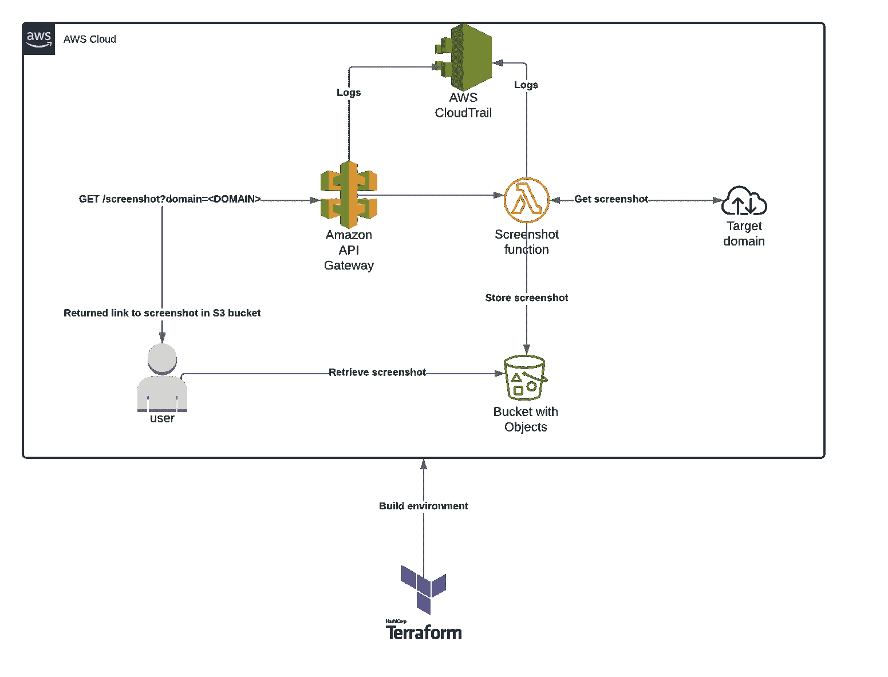

# 如何使用 Terraform、AWS API Gateway 和 AWS Lambda 构建截图捕捉 API

> 原文：<https://www.freecodecamp.org/news/build-a-screenshot-capture-api-using-terraform-aws-api-gateway-and-aws-lambda/>

最近，我真的想找到一种方法来构建一个 API，它可以接受一个 URL 并保存一个截图。

我最初的用例很简单:如果我在分析钓鱼电子邮件，我想要一种简单的方法来获取电子邮件试图将目标指向的 URL 的截图。

为了构建这个，我使用了 [Terraform](https://www.terraform.io/) 来创建在 AWS 中设置它所必需的所有基础设施，使用 Selenium、chromedriver 和 headless Chrome 来获取屏幕截图。



High level diagram illustrating what will be built in AWS by Terraform

*注意:所有代码示例都来自 PowerShell，因此请原谅“.“批注。*

### 要求

*   AWS 帐户
*   地形双星
*   存储地形状态([https://www.terraform.io/docs/backends/types/s3.html](https://www.terraform.io/docs/backends/types/s3.html))的现有 S3 存储桶
*   AWS IAM 用户和访问密钥是使用 Terraform 的适当权限(编程访问、管理组)创建的

## 如何设置项目

创建新目录并初始化 Terraform，如下所示:

```
mkdir .\screenshot-service
cd .\screenshot-service
.\terraform init
```

## 配置 AWS 提供程序

在项目目录的根目录下创建一个名为`provider.tf`的文件。然后为 AWS 访问密钥和密钥配置适当的值，以及将用于存储 Terraform 状态文件的现有 S3 存储桶的名称。

```
provider "aws" {
  region = "us-east-1"

  access_key = "ACCESSKEY"
  secret_key = "SECRETKEY"
}

terraform {
  backend "s3" {
    bucket = "EXISTING_BUCKET"
    region = "us-east-1"
    key = "KEYFORSTATE"
    access_key = "ACCESSKEY"
    secret_key = "SECRETKEY"
    encrypt = "true"
  }
}
```

## 配置 S3 存储桶

我们将使用一个 S3 桶来存储我们所有的截图。要配置 S3 服务，在项目的根目录下创建一个名为`s3.tf`的新文件，并添加以下内容:

```
resource "aws_s3_bucket" "screenshot_bucket" {
  bucket        = "STORAGE_BUCKET_NAME"
  force_destroy = true
  acl = "public-read"

  versioning {
    enabled = false
  }
}
```

## 创建λ层

让我们从创建 lambda 层开始，它将包含必要的二进制文件。首先，从项目的根目录，创建一个名为 chromedriver_layer: `mkdir .\chromedriver_layer`的文件夹。

接下来，下载 chromedriver 和 chromium 二进制文件:

```
cd .\chromedriver_layer
wget https://chromedriver.storage.googleapis.com/2.41/chromedriver_linux64.zip -OutFile .\chromedriver.zip
wget https://github.com/adieuadieu/serverless-chrome/releases/download/v1.0.0-54/stable-headless-chromium-amazonlinux-2017-03.zip -OutFile .\headless-chromium.zip
Expand-Archive .\headless-chromium.zip
rm *.zip 
```

最后，我们需要为 Terraform 做好准备:

```
cd ..\
Compress-Archive .\chromedriver_layer -DestinationPath \chromedriver_layer.zip 
```

## 如何配置 Lambda

### λ基础设施

在项目目录的根目录下创建一个名为`lambda.tf`的文件。首先，我们将创建我们的功能所需的执行角色:

```
resource "aws_iam_role" "lambda_exec_role" {
  name        = "lambda_exec_role"
  description = "Execution role for Lambda functions"

  assume_role_policy = <<EOF
{
        "Version"  : "2012-10-17",
        "Statement": [
            {
                "Action"   : "sts:AssumeRole",
                "Principal": {  
                    "Service": "lambda.amazonaws.com"
                },
                "Effect": "Allow",
                "Sid"   : ""
            }
        ]
}
EOF
} 
```

接下来，我们将向已创建的执行角色添加一些策略，这将使我们的功能能够访问所需的服务:

```
resource "aws_iam_role_policy" "lambda_logging" {
  name = "lambda_logging"

  role = aws_iam_role.lambda_exec_role.id

  policy = <<EOF
{
    "Version"  : "2012-10-17",
    "Statement": [
        {
            "Effect"  : "Allow",
            "Resource": "*",
            "Action"  : [
                "logs:CreateLogStream",
                "logs:PutLogEvents",
                "logs:CreateLogGroup"
            ]
        }
    ]
}
EOF
}

resource "aws_iam_role_policy" "lambda_s3_access" {
  name = "lambda_s3_access"

  role = aws_iam_role.lambda_exec_role.id

  # TODO: Change resource to be more restrictive
  policy = <<EOF
{
  "Version"  : "2012-10-17",
  "Statement": [
    {
      "Effect": "Allow",
      "Action": [
        "s3:ListBuckets",
        "s3:PutObject",
        "s3:PutObjectAcl",
        "s3:GetObjectAcl"
      ],
      "Resource": ["*"]
    }
  ]
}
EOF
} 
```

现在，我们的函数将能够访问 S3 并登录到 CloudWatch。让我们定义我们的功能:

```
resource "aws_lambda_function" "take_screenshot" {
  filename      = "./screenshot-service.zip"
  function_name = "take_screenshot"
  role          = aws_iam_role.lambda_exec_role.arn
  handler       = "screenshot-service.handler"
  runtime       = "python3.7"

  source_code_hash = filebase64sha256("./screenshot-service.zip")
  timeout          = 600
  memory_size      = 512 
  layers = ["${aws_lambda_layer_version.chromedriver_layer.arn}"]

  environment {
    variables = {
      s3_bucket = "${aws_s3_bucket.screenshot_bucket.bucket}"
    }
  }
} 
```

上面的代码指定我们正在使用 Python 3.7 运行时上传一个 lambda 函数包，将要调用的函数名为“handler”。

我已经将超时设置为 600 秒，但是您可以随意更改。此外，请随意使用 memory _ size——对我来说，这导致了超级快速的截图。

我们还设置了一个名为 **s3_bucket** 的环境变量，它将被传递给函数，包含用于存储截图的 bucket 的名称。

### Lambda 函数本身

在项目目录的根目录中创建一个名为`lambda`的文件夹，并在该文件夹中创建一个名为`screenshot-service.py`的文件。

将以下导入和日志记录配置添加到文件中:

```
#!/usr/bin/env python
# -*- coding utf-8 -*-

import json
import logging
from urllib.parse import urlparse, unquote # TODO: Can I use urllib3?
from selenium import webdriver
from datetime import datetime
import os
from shutil import copyfile
import boto3
import stat
import urllib.request
import tldextract

# Configure logging
logger = logging.getLogger()
logger.setLevel(logging.DEBUG) 
```

接下来，我们将创建一个从 lambda 层复制二进制文件并使它们可执行的函数:

```
def configure_binaries():
    """Copy the binary files from the lambda layer to /tmp and make them executable"""
    copyfile("/opt/chromedriver", "/tmp/chromedriver")
    copyfile("/opt/headless-chromium", "/tmp/headless-chromium")

    os.chmod("/tmp/chromedriver", 755)
    os.chmod("/tmp/headless-chromium", 755) 
```

接下来，我们将创建一个函数，该函数将对所提供的域进行截图。我们将传入 URL 和 S3 存储桶名称。

我们将添加一个可选参数，允许用户设置图像的标题。截图是 Selenium 自动化我们下载的无头 Chrome 浏览器拍摄的。

```
def get_screenshot(url, s3_bucket, screenshot_title = None):     
    configure_binaries()

    chrome_options = webdriver.ChromeOptions()
    chrome_options.add_argument('--headless')
    chrome_options.add_argument("disable-infobars")
    chrome_options.add_argument("enable-automation")

    chrome_options.add_argument('--no-sandbox')
    chrome_options.add_argument('--disable-gpu')
    chrome_options.add_argument('--window-size=1280x1696')
    chrome_options.add_argument('--user-data-dir=/tmp/user-data')
    chrome_options.add_argument('--hide-scrollbars')
    chrome_options.add_argument('--enable-logging')
    chrome_options.add_argument('--log-level=0')
    chrome_options.add_argument('--disable-dev-shm-usage')
    chrome_options.add_argument('--v=99')
    chrome_options.add_argument('--single-process')
    chrome_options.add_argument('--data-path=/tmp/data-path')
    chrome_options.add_argument('--ignore-certificate-errors')
    chrome_options.add_argument('--homedir=/tmp')
    chrome_options.add_argument('--disk-cache-dir=/tmp/cache-dir')
    chrome_options.add_argument(
        'user-agent=Mozilla/5.0 (X11; Linux x86_64) AppleWebKit/537.36 (KHTML, like Gecko) Chrome/61.0.3163.100 Safari/537.36')
    chrome_options.binary_location = "/tmp/headless-chromium"

    if screenshot_title is None: 
        ext = tldextract.extract(url)
        domain = f"{''.join(ext[:2])}:{urlparse(url).port}.{ext[2]}"
        screenshot_title = f"{domain}_{datetime.utcnow().strftime('%Y%m%d_%H%M%S')}"
    logger.debug(f"Screenshot title: {screenshot_title}")

    with webdriver.Chrome(chrome_options=chrome_options, executable_path="/tmp/chromedriver", service_log_path="/tmp/selenium.log") as driver: 
        driver.set_window_size(1024, 768)

        logger.info(f"Obtaining screenshot for {url}")
        driver.get(url)     

        driver.save_screenshot(f"/tmp/{screenshot_title}.png") # TODO: Delete the screenshot after
        logger.info(f"Uploading /tmp/{screenshot_title}.png to S3 bucket {s3_bucket}/{screenshot_title}.png")
        s3 = boto3.client("s3")
        s3.upload_file(f"/tmp/{screenshot_title}.png", s3_bucket, f"{screenshot_title}.png", ExtraArgs={'ContentType': 'image/png', 'ACL': 'public-read'})
    return f"https://{s3_bucket}.s3.amazonaws.com/{screenshot_title}.png" 
```

最后，让我们创建我们的处理程序，当 API 网关接收到合法请求时将调用它:

```
def handler(event, context): 
    logger.debug("## ENVIRONMENT VARIABLES ##")
    logger.debug(os.environ)
    logger.debug("## EVENT ##")
    logger.debug(event)

    bucket_name = os.environ["s3_bucket"]
    logger.debug(f"bucket_name: {bucket_name}")

    logger.info("Validating url")  

    if event["httpMethod"] == "GET":
        if event["queryStringParameters"]:
            try:
                url = event["queryStringParameters"]["url"]
            except Exception as e:
                logger.error(e)
                raise e
        else:
            return {
                "statusCode": 400,
                "body": json.dumps("No URL provided...")
            }
    elif event["httpMethod"] == "POST":
        if event["body"]:
            try:
                body = json.loads(event["body"])
                url = body["url"]
            except Exception as e:
                logger.error(e)
                raise e
        else:
            return {
                "statusCode": 400,
                "body": json.dumps("No URL provided...")
            }
    else:
        return {
            "statusCode": 405,
            "body": json.dumps(f"Invalid HTTP Method {event['httpMethod']} supplied")
        }

    logger.info(f"Decoding {url}")
    url = unquote(url)

    logger.info(f"Parsing {url}")
    try: 
        parsed_url = urlparse(url)
        if parsed_url.scheme != "http" and parsed_url.scheme != "https":
            logger.info("No valid scheme found, defaulting to http://")
            parsed_url = urlparse(f"http://{url}")
        if parsed_url.port is None:
            if parsed_url.scheme == "http":
                parsed_url = urlparse(f"{parsed_url.geturl()}:80")
            elif parsed_url.scheme == "https":
                parsed_url = urlparse(f"{parsed_url.geturl()}:443")

    except Exception as e: 
        logger.error(e)
        raise e

    logger.info("Getting screenshot")
    try: 
        screenshot_url = get_screenshot(parsed_url.geturl(), bucket_name) # TODO: Variable!
    except Exception as e:  
        logger.error(e)
        raise e

    response_body = {
        "message": f"Successfully captured screenshot of {parsed_url.geturl()}",
        "screenshot_url": screenshot_url
    }

    return {
        "statusCode": 200,
        "body"      : json.dumps(response_body)
    } 
```

接下来，我们需要将 lambda 函数使用的所有包安装到`lambda`目录中，因为这些包在 AWS 中不是默认安装的。

然后我们需要创建 zip 存档(一旦创建，如果您对代码进行更改，Terraform 将继续更新它):

```
cd .\lambda
pip install selenium tldextract -t .\
cd ..\
Compress-Archive .\lambda -DestinationPath .\screenshot-service.zip 
```

## 如何配置 API 网关

在项目目录的根目录下创建一个名为`apigw.tf`的文件。首先，我们将配置 REST API:

```
resource "aws_api_gateway_rest_api" "screenshot_api" {
  name        = "screenshot_api"
  description = "Lambda-powered screenshot API"
  depends_on = [
    aws_lambda_function.take_screenshot
  ]
} 
```

该 API 将用于指导所有针对屏幕截图服务的请求。我们使用`depends_on`特性来确保网关及其相关组件仅在创建了 lambda 函数之后*被创建。*

接下来，让我们为 lambda 函数创建 API 网关资源:

```
resource "aws_api_gateway_resource" "screenshot_api_gateway" {
  path_part   = "screenshot"
  parent_id   = aws_api_gateway_rest_api.screenshot_api.root_resource_id
  rest_api_id = aws_api_gateway_rest_api.screenshot_api.id
} 
```

我们现在已经定义了一个资源，它将在 API 服务的`/screenshot`端点做出响应。

接下来，我们将为 API 创建一个阶段。stage 是命名我们的 API 部署的一种奇特方式。您可以使用 stage 配置缓存、日志记录、请求限制等。

```
resource "aws_api_gateway_stage" "prod_stage" {
  stage_name = "prod"
  rest_api_id = aws_api_gateway_rest_api.screenshot_api.id
  deployment_id = aws_api_gateway_deployment.api_gateway_deployment_get.id
} 
```

接下来，我们将创建一个与我们的阶段相关联的 API 密钥和使用计划，以便只有知道密钥的用户才能使用该服务。(*注意:*如果你想公开访问，跳过这一步。)

```
resource "aws_api_gateway_usage_plan" "apigw_usage_plan" {
  name = "apigw_usage_plan"

  api_stages {
    api_id = aws_api_gateway_rest_api.screenshot_api.id
    stage = aws_api_gateway_stage.prod_stage.stage_name
  }
}

resource "aws_api_gateway_usage_plan_key" "apigw_usage_plan_key" {
  key_id = aws_api_gateway_api_key.apigw_prod_key.id
  key_type = "API_KEY"
  usage_plan_id = aws_api_gateway_usage_plan.apigw_usage_plan.id
}

resource "aws_api_gateway_api_key" "apigw_prod_key" {
  name = "prod_key"
} 
```

现在让我们配置 API，如果提供了有效的 API 网关密钥(如果您希望该方法对公众开放，请将该值设置为 false)，就可以响应 **GET** 或 **POST** 请求:

```
resource "aws_api_gateway_method" "take_screenshot_get" {
  rest_api_id   = aws_api_gateway_rest_api.screenshot_api.id
  resource_id   = aws_api_gateway_resource.screenshot_api_gateway.id
  http_method   = "GET"
  authorization = "NONE"
  api_key_required = true
}

resource "aws_api_gateway_method" "take_screenshot_post" {
  rest_api_id   = aws_api_gateway_rest_api.screenshot_api.id
  resource_id   = aws_api_gateway_resource.screenshot_api_gateway.id
  http_method   = "POST"
  authorization = "NONE"
  api_key_required = true
} 
```

我们现在需要给 API 网关权限来调用我们创建的 lambda 函数:

```
resource "aws_lambda_permission" "apigw" {
  statement_id  = "AllowAPIGatewayInvoke"
  action        = "lambda:InvokeFunction"
  function_name = aws_lambda_function.take_screenshot.arn
  principal     = "apigateway.amazonaws.com"

  source_arn = "${aws_api_gateway_rest_api.screenshot_api.execution_arn}/*/*/*"
} 
```

太好了，我们现在有适当的权限了。让我们设置与 lambda 函数的集成:

```
resource "aws_api_gateway_integration" "lambda_integration_get" {
  depends_on = [
    aws_lambda_permission.apigw
  ]
  rest_api_id = aws_api_gateway_rest_api.screenshot_api.id
  resource_id = aws_api_gateway_method.take_screenshot_get.resource_id
  http_method = aws_api_gateway_method.take_screenshot_get.http_method

  integration_http_method = "POST" # https://github.com/hashicorp/terraform/issues/9271 Lambda requires POST as the integration type
  type                    = "AWS_PROXY"
  uri                     = aws_lambda_function.take_screenshot.invoke_arn
}

resource "aws_api_gateway_integration" "lambda_integration_post" {
  depends_on = [
    aws_lambda_permission.apigw
  ]
  rest_api_id = aws_api_gateway_rest_api.screenshot_api.id
  resource_id = aws_api_gateway_method.take_screenshot_post.resource_id
  http_method = aws_api_gateway_method.take_screenshot_post.http_method

  integration_http_method = "POST" # https://github.com/hashicorp/terraform/issues/9271 Lambda requires POST as the integration type
  type                    = "AWS_PROXY"
  uri                     = aws_lambda_function.take_screenshot.invoke_arn
} 
```

这种集成告诉 API 网关，当它在指定的端点和 HTTP 方法接收到请求时，要调用什么 lambda 函数。

我保证大门快完工了。最后一步，让我们确保我们的 API 可以将日志发送到 CloudWatch:

```
resource "aws_api_gateway_account" "apigw_account" {
  cloudwatch_role_arn = aws_iam_role.apigw_cloudwatch.arn
}

resource "aws_iam_role" "apigw_cloudwatch" {
  # https://gist.github.com/edonosotti/6e826a70c2712d024b730f61d8b8edfc
  name = "api_gateway_cloudwatch_global"

  assume_role_policy = <<EOF
{
  "Version": "2012-10-17",
  "Statement": [
    {
      "Sid": "",
      "Effect": "Allow",
      "Principal": {
        "Service": "apigateway.amazonaws.com"
      },
      "Action": "sts:AssumeRole"
    }
  ]
}
EOF
}

resource "aws_iam_role_policy" "apigw_cloudwatch" {
  name = "default"
  role = aws_iam_role.apigw_cloudwatch.id

  policy = <<EOF
{
    "Version": "2012-10-17",
    "Statement": [
        {
            "Effect": "Allow",
            "Action": [
                "logs:CreateLogGroup",
                "logs:CreateLogStream",
                "logs:DescribeLogGroups",
                "logs:DescribeLogStreams",
                "logs:PutLogEvents",
                "logs:GetLogEvents",
                "logs:FilterLogEvents"
            ],
            "Resource": "*"
        }
    ]
}
EOF
} 
```

我们现在已经为 API Gateway 提供了必要的权限，以便将日志写入 CloudWatch。

最后但同样重要的是，我们部署我们的 API。我们使用`depends_on`来确保部署发生在所有依赖项被创建之后。

```
resource "aws_api_gateway_deployment" "api_gateway_deployment_get" {
  depends_on = [aws_api_gateway_integration.lambda_integration_get,  aws_api_gateway_method.take_screenshot_get, aws_api_gateway_integration.lambda_integration_post, aws_api_gateway_method.take_screenshot_post]

  rest_api_id = aws_api_gateway_rest_api.screenshot_api.id
} 
```

## λ包装

在`main.tf`中，添加以下内容:

```
data "archive_file" "screenshot_service_zip" {
  type        = "zip"
  source_dir  = "./lambda"
  output_path = "./screenshot-service.zip"
}

data "archive_file" "screenshot_service_layer_zip" {
  type = "zip"
  source_dir = "./chromedriver_layer"
  output_path = "./chromedriver_lambda_layer.zip"
} 
```

## 输出

在项目目录的根目录下创建一个名为`output.tf`的文件，并添加以下内容:

```
output "api_gateway_url" {
  value = "${aws_api_gateway_stage.prod_stage.invoke_url}/${aws_api_gateway_resource.screenshot_api_gateway.path_part}"
}

output "api_key" {
  value = aws_api_gateway_api_key.apigw_prod_key.value
} 
```

现在，一旦您运行`.\terraform apply`，您将获得带有 API 的 URL 和相关 API 键的输出。

恭喜你。你现在有一个工作截图服务。要查看我用过的代码，请随意查看我的 [Github](https://github.com/Caliburn-Security/screenshot-service) 库。