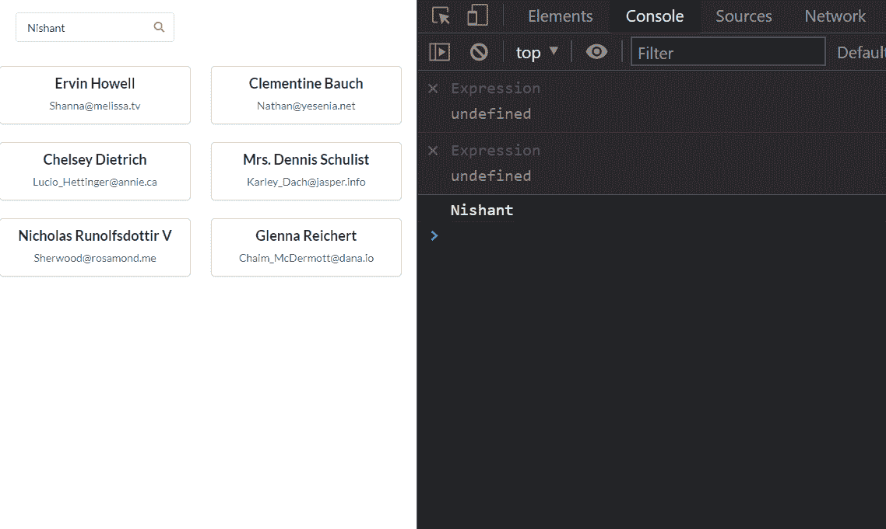
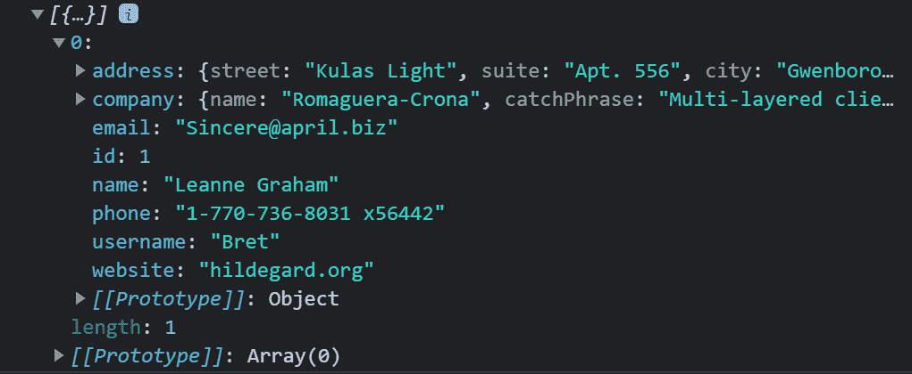

# 如何使用 React 和 React 挂钩构建搜索过滤器

> 原文：<https://www.freecodecamp.org/news/build-a-search-filter-using-react-and-react-hooks/>

当您向 API 发送 GET 请求时，您将从服务器获得响应数据。但有时管理这些数据可能是个问题。

在这篇博文中，我将向你展示如何在 React 中创建一个搜索过滤器。它将使用功能组件和 React 钩子在数据中搜索特定的术语。

## 如何向 API 发出 GET 请求

首先，让我们向一个 API 发出 GET 请求，该 API 将从服务器获取一些数据。您可以使用任何想要的服务器来获取数据，但是在本文中，我将使用{JSON}占位符来获取用户列表。

在这个例子中，我们有显示不同用户的姓名和电子邮件的卡片。我们还有一个搜索输入框，我们将使用它来搜索特定的用户。

```
import React, { useState, useEffect } from 'react';
import axios from 'axios';
import { Card, Input } from 'semantic-ui-react'
export default function Posts() {
    const [APIData, setAPIData] = useState([])
    useEffect(() => {
        axios.get(`https://jsonplaceholder.typicode.com/users`)
            .then((response) => {
                setAPIData(response.data);
            })
    }, [])

    return (
        <div style={{ padding: 20 }}>
            <Input icon='search'
                placeholder='Search...'
            />
            <Card.Group itemsPerRow={3} style={{ marginTop: 20 }}>
                {APIData.map((item) => {
                    return (
                        <Card>
                            <Card.Content>
                                <Card.Header>{item.name}</Card.Header>
                                <Card.Description>
                                    {item.email}
                                </Card.Description>
                            </Card.Content>
                        </Card>
                    )
                })}
            </Card.Group>
        </div>
    )
} 
```

Fetching Users List from JSON Placeholder


Getting the List of Users and a Search Input at the top

如果你不知道如何在 React 中处理 GET API 调用，请关注我在 [React CRUD Operations](https://www.freecodecamp.org/news/how-to-perform-crud-operations-using-react/) 上的博客或者我在 [React CRUD Operations](https://youtu.be/-ZMP8ZladIQ) 上的视频，在那里我向你展示了如何在 React 中处理 API 调用。

## 如何从搜索输入框中获取搜索输入

现在，让我们从搜索输入框中获取搜索查询。

为搜索输入创建一个状态。

```
const [searchInput, setSearchInput] = useState('');
```

Creating the state for search input

这里，`searchInput`是一个字符串，我们将使用`setSearchInput`来设置搜索输入。

现在，我们将创建一个函数来处理我们的搜索功能。

```
const searchItems = () => {

}
```

Creating a function to handle our search functionality

并通过`onChange`事件将该函数绑定到搜索输入。

```
<Input icon='search'
                placeholder='Search...'
                onChange={() => searchItems()}
            />
```

Binding the searchItems function to the Input field

因此，每当我们在输入字段中输入内容时，`searchItems`就会运行。

现在，我们需要将输入值传递给`searchItems`函数。

```
<Input icon='search'
                placeholder='Search...'
                onChange={(e) => searchItems(e.target.value)}
            />
```

Passing the Input value to the searchItems Function

接下来，让我们将搜索查询接收到函数中，并使用之前创建的`setSearchInput`将`searchInput`状态设置为这个值。

```
const searchItems = (searchValue) => {
        setSearchInput(searchValue)
    }
```

Setting the searchInput state to the searchValue

你可以通过安慰`searchValue`来检查它是否正在工作。



如你所见，我在这里输入了我的名字，它出现在控制台上。

## 如何根据搜索结果筛选项目

现在，我们将使用 filter 方法过滤掉我们的 APIData。

```
const searchItems = (searchValue) => {
        setSearchInput(searchValue)
        APIData.filter((item) => {
            return Object.values(item).join('').toLowerCase().includes(searchInput.toLowerCase())
        })
    }
```

Filtering the APIData according to the search term

在这个函数`searchTerm`中，您可以看到我们正在使用`filter`方法过滤出 APIData 状态，其中包含来自服务器的数据。

我们还使用`Object.values`从对象项中获取值。

然后，我们使用`join(' ')`方法将值转换成一个字符串。

接下来，我们使用`toLowerCase`方法将字符串值转换成小写。

最后，我们检查这个字符串是否包含我们在搜索栏中输入的搜索输入。我们还将其转换为小写，以确保如果我们以大写形式键入我们的术语，它会将字符串转换为小写，以使搜索更有效。

然后，我们返回整个查询。

现在我们需要将这个过滤后的数组设置为一个变量。

```
const filteredData = APIData.filter((item) => {
return Object.values(item).join('').toLowerCase().includes(searchInput.toLowerCase())
})
```

Storing the filtered data into a const filteredData

让我们通过安慰来检查上面的功能。所以，搜索一个用户名，你会看到你得到了这个用户名的数据。



Getting the search item into the console

现在，我们需要一个状态来存储过滤后的数据。所以，让我们创建一个。

```
const [filteredResults, setFilteredResults] = useState([]);
```

A new state for the filtered data

创建一个包含过滤数据的状态。

然后使用`setFilteredResults`将该状态设置为`searchItems`功能中的`filteredData`。

```
const searchItems = (searchValue) => {
        setSearchInput(searchValue)
        const filteredData = APIData.filter((item) => {
            return Object.values(item).join('').toLowerCase().includes(searchInput.toLowerCase())
        })
        setFilteredResults(filteredData)
    }
```

Setting filteredData into the filteredResults state.

## 如何在用户界面中显示过滤结果

现在，让我们在主 UI 中显示这些过滤后的结果。

首先，我们需要编写一些代码来检查我们的搜索输入是否为空，如果是，则显示所有数据。否则，它将根据搜索输入过滤它们。

```
const searchItems = (searchValue) => {
        setSearchInput(searchValue)
        if (searchInput !== '') {
            const filteredData = APIData.filter((item) => {
                return Object.values(item).join('').toLowerCase().includes(searchInput.toLowerCase())
            })
            setFilteredResults(filteredData)
        }
        else{
            setFilteredResults(APIData)
        }
    }
```

Checking the search term if it is empty

我们还需要在应用程序的返回部分进行检查。

因此，如果搜索词的长度大于 1，我们将显示过滤后的数据。否则，我们将显示存储在 API 数据状态中的所有数据。

```
<Card.Group itemsPerRow={3} style={{ marginTop: 20 }}>
                {searchInput.length > 1 ? (
                    filteredResults.map((item) => {
                        return (
                            <Card>
                                <Card.Content>
                                    <Card.Header>{item.name}</Card.Header>
                                    <Card.Description>
                                        {item.email}
                                    </Card.Description>
                                </Card.Content>
                            </Card>
                        )
                    })
                ) : (
                    APIData.map((item) => {
                        return (
                            <Card>
                                <Card.Content>
                                    <Card.Header>{item.name}</Card.Header>
                                    <Card.Description>
                                        {item.email}
                                    </Card.Description>
                                </Card.Content>
                            </Card>
                        )
                    })
                )}
            </Card.Group>
```

Checking if the data have the length of greater than one.

现在，如果我们在搜索字段中搜索某个用户名，我们将获得该特定用户的数据。


Getting the search input's results in the UI

如果我们去掉这个名字，我们会得到所有的数据。


Getting all the data if the search input is empty

以下是所有代码供您参考:

```
import React, { useState, useEffect } from 'react';
import axios from 'axios';
import { Card, Input } from 'semantic-ui-react'
export default function Posts() {
    const [APIData, setAPIData] = useState([])
    const [filteredResults, setFilteredResults] = useState([]);
    const [searchInput, setSearchInput] = useState('');
    useEffect(() => {
        axios.get(`https://jsonplaceholder.typicode.com/users`)
            .then((response) => {
                setAPIData(response.data);
            })
    }, [])

    const searchItems = (searchValue) => {
        setSearchInput(searchValue)
        if (searchInput !== '') {
            const filteredData = APIData.filter((item) => {
                return Object.values(item).join('').toLowerCase().includes(searchInput.toLowerCase())
            })
            setFilteredResults(filteredData)
        }
        else{
            setFilteredResults(APIData)
        }
    }

    return (
        <div style={{ padding: 20 }}>
            <Input icon='search'
                placeholder='Search...'
                onChange={(e) => searchItems(e.target.value)}
            />
            <Card.Group itemsPerRow={3} style={{ marginTop: 20 }}>
                {searchInput.length > 1 ? (
                    filteredResults.map((item) => {
                        return (
                            <Card>
                                <Card.Content>
                                    <Card.Header>{item.name}</Card.Header>
                                    <Card.Description>
                                        {item.email}
                                    </Card.Description>
                                </Card.Content>
                            </Card>
                        )
                    })
                ) : (
                    APIData.map((item) => {
                        return (
                            <Card>
                                <Card.Content>
                                    <Card.Header>{item.name}</Card.Header>
                                    <Card.Description>
                                        {item.email}
                                    </Card.Description>
                                </Card.Content>
                            </Card>
                        )
                    })
                )}
            </Card.Group>
        </div>
    )
} 
```

The whole code for search filter.

现在你有了它，React 中使用 React 钩子的全功能搜索过滤器。

我们通常通过在 API 端点中传递搜索查询参数来从后端处理这一功能。但是知道如何从前端处理它也很重要。

如果你想补充这篇文章，你也可以查看我在 YouTube 上的视频[使用 React 和 React Hooks](https://youtu.be/8YsQmvJ9UZE) 构建搜索过滤器。

> 这是所有的乡亲。快乐学习。