# 如何用 Node.js 搭建安全服务器，用 Cloudinary 表达和上传图片

> 原文：<https://www.freecodecamp.org/news/build-a-secure-server-with-node-and-express/>

在本教程中，我们将学习如何创建服务器。我们将在没有`express`的情况下开始，然后使用`express`加强服务器。之后，我们将看到如何从我们创建的应用程序上传图像到 Cloudinary。

我假设你已经理解了`Node.js`、`express`和`nodemon`的基础知识，所以我们将直接进入实用部分。

## 安装 Node.js 和 NPM

如果您还没有这样做，您需要在您的机器上安装 Node 和 npm。

1.  进入 [Node.js 网站](https://nodejs.org/en/)
2.  点击推荐下载按钮

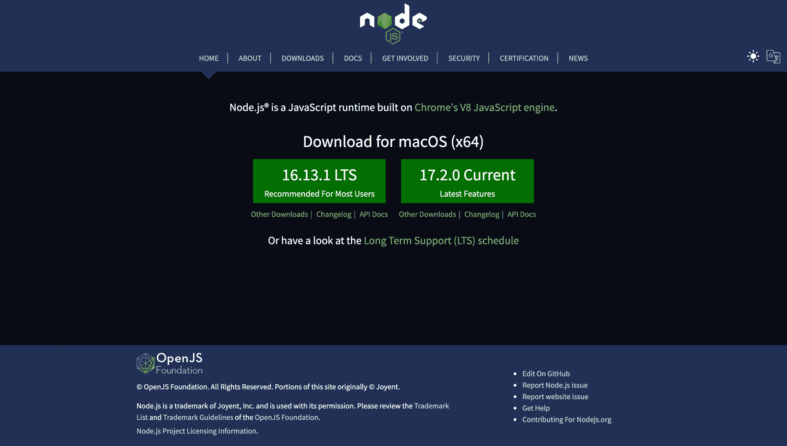

Nodejs home page

下载完成后，使用下载的`.exe`文件安装 Node(它遵循正常的安装过程)。

### 检查安装是否成功

1.  转到您的终端/命令提示符*(如果可能，以管理员身份运行)*
2.  键入以下每个命令，然后按 Enter 键

```
node -v 
npm -v 
```

您的输出应该类似于下图:

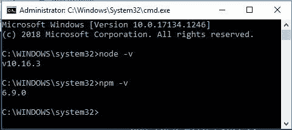

Terminal showing the versions of node and npm

版本可能不同，但没关系。

## 如何在没有 Express 的情况下创建节点服务器

对于本教程的其余部分，我将使用 VS 代码作为我的编辑器。你可以使用你选择的任何编辑器。

让我们首先创建一个项目目录。打开一个终端，键入以下内容创建一个目录并打开它:

```
 mkdir server-tutorial cd server-tutorial 
```

我把我的项目目录命名为`server-tutorial`，但是你可以随意命名你的目录。

在终端中，键入`npm init`。点击`Enter`按钮查看所有提示。完成后，您的项目目录中应该有一个`package.json`文件。

`package.json`文件只是一个包含项目所有细节的文件。你不必打开它。

创建一个名为`index.js`的文件。

在文件中，要求`HTTP`模块如下:

```
 const http = require('http'); 
```

对其调用`createServer()`方法，并将其赋给一个常量，如下所示:

```
 const server = http.createServer(); 
```

像这样调用服务器常量上的`listen()`方法:

```
 server.listen(); 
```

给它一个监听的端口。现在，这可以是任何自由端口，但是我们将使用端口`3000`，它是传统端口。所以我们有这个:

```
 const http = require('http');

  const server = http.createServer();

  server.listen(3000); 
```

基本上，这就是创建服务器所需要做的全部工作。

### 如何测试服务器

在您的终端中(应该在项目目录中)，键入`node index.js`并点击`Enter`按钮。

在 [`postman`](https://www.getpostman.com/) 或任何网页`browser`中打开一个新标签，在地址栏中键入`http://localhost:3000/`，点击`Enter`按钮。(我将使用 postman，因为它具有开箱即用的扩展功能。)

你会注意到你的浏览器或邮差像这样无限期地加载:

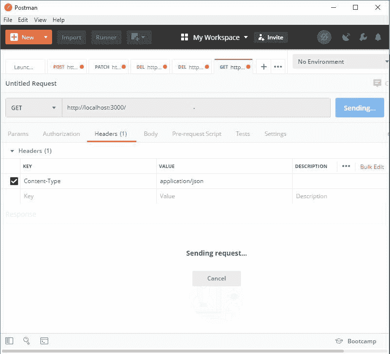

耶！那很好。我们的服务器已经启动并运行。

但是已经很无聊了。我们需要让服务器和我们说话。

让我们马上开始吧。

### 如何从服务器发回响应

回到代码中，将以下内容添加到`const server = http.createServer();`:

```
 (request, response) => {
    response.end('Hey! This is your server response!');
 } 
```

所以我们现在有:

```
 const http = require('http');

  const server = http.createServer((request, response) => {
    response.end('Hey! This is your server response!');
  });

server.listen(3000); 
```

基本上，`request`对象告诉`server`我们想要什么，`response`对象告诉我们`server`对我们的`request`说了什么，`end()`方法终止与`server` `response`的通信。

希望这是有意义的！

现在，按照我们上面概述的步骤再次测试服务器，您的服务器应该会与您对话。这是我的输出:

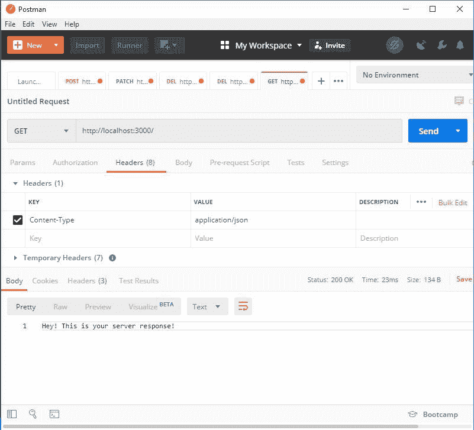

你可以随意改变琴弦。

使用`Control/Command + C`终止服务器，并运行`node index`再次启动服务器。

看起来很帅！对吗？一切都好...

## 如何使用 Express 创建节点服务器

在本节中，我们想通过使用`Express`和`Nodemon` (node-mon 或 no-demon，随你怎么念)让我们的生活变得更简单。

在终端中，安装以下组件:

```
npm install express --save 
npm install nodemon --save-dev 
```

创建一个名为`app.js`的新文件或任何适合你的名字

在文件中，

1.  要求这样表达:

`const express = require('express');`

2.将 express 方法赋给一个常量，如下所示:

`const app = express();`

3.导出 app 常量，使其可用于目录中的其他文件，如下所示:

`module.exports = app;`

所以我们有:

```
const express = require('express');

const app = express();

module.exports = app; 
```

在`index.js`文件中，需要我们之前导出的`app`:

`const app = require('./app');`

接下来，使用应用程序设置端口，如下所示:

`app.set('port', 3000);`

用下面的`app`替换`http.createServer()`方法中的代码:

`const server = http.createServer(app);`

这将所有 API 管理指向`app.js`文件，有助于分离关注点。

所以我们的`index.js`文件现在看起来像这样:

```
const http = require('http');
const app = require('./app');

app.set('port', 3000);
const server = http.createServer(app);

server.listen(3000); 
```

回到我们的`app.js`文件，因为我们已经将所有的 API 管理指向它，让我们创建一个端点来像以前一样与我们对话。

所以在`module.exports = app`之前，添加以下代码:

```
app.use((request, response) => {
   response.json({ message: 'Hey! This is your server response!' }); 
}); 
```

我们现在有:

```
const express = require('express');

const app = express();

app.use((request, response) => {
   response.json({ message: 'Hey! This is your server response!' }); 
});

module.exports = app; 
```

Ahaaa...是时候测试我们的应用了。

为了测试我们的应用程序，我们现在在终端中键入`nodemon index`并点击`Enter`按钮。这是我的终端:

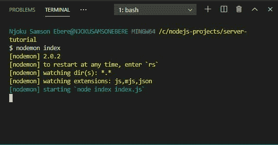

你是否注意到 nodemon 给了我们不同于 Node 的终端执行细节？这就是 nodemon 的妙处。

你现在可以转到`postman`或任何`browser`，在地址栏中键入`http://localhost:3000/`并点击`Enter`。查看我的输出:

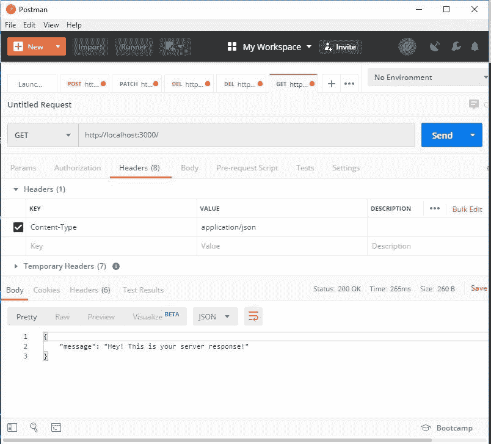

**瓦拉！起作用了。**

现在有更多的理由使用 nodemon。转到`app.js`文件，将`message`字符串更改为您选择的任何字符串，保存并观察`terminal`。

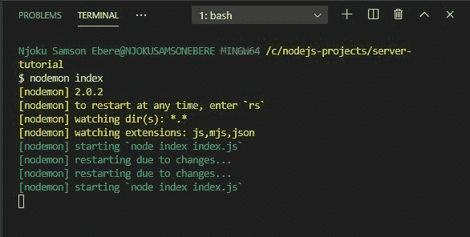

哇...它会自动重启服务器。这在 Node 上是不可能的。我们不得不自己重启服务器。

## 如何保护服务器并使其经得起未来考验

在`index.js`文件中，用以下代码替换所有代码:

```
const http = require('http');
const app = require('./app');

const normalizePort = val => {
  const port = parseInt(val, 10);

  if (isNaN(port)) {
    return val;
  }
  if (port >= 0) {
    return port;
  }
  return false;
};
const port = normalizePort(process.env.PORT || '3000');
app.set('port', port);

const errorHandler = error => {
  if (error.syscall !== 'listen') {
    throw error;
  }
  const address = server.address();
  const bind = typeof address === 'string' ? 'pipe ' + address : 'port: ' + port;
  switch (error.code) {
    case 'EACCES':
      console.error(bind + ' requires elevated privileges.');
      process.exit(1);
      break;
    case 'EADDRINUSE':
      console.error(bind + ' is already in use.');
      process.exit(1);
      break;
    default:
      throw error;
  }
};

const server = http.createServer(app);

server.on('error', errorHandler);
server.on('listening', () => {
  const address = server.address();
  const bind = typeof address === 'string' ? 'pipe ' + address : 'port ' + port;
  console.log('Listening on ' + bind);
});

server.listen(port); 
```

`process.env.PORT`使应用程序动态化，以便它可以在将来托管在实时服务器上时运行分配给它的任何端口。

`normalizePort`函数返回一个有效的端口，无论它是以数字还是字符串的形式提供。

`errorHandler`函数检查各种错误并适当地处理它们——然后注册到服务器。

还注册了一个`listening`事件监听器，将服务器运行的端口或命名管道记录到控制台。

哟呵！我们的服务器现在更加安全和强大。注意，nodemon 还显示了我们正在监听的端口。

这就是一个简单、安全和健壮的 Node.js 服务器。

## 如何上传图片到 Cloudinary

现在我们有一个很酷的服务器在运行，让我们学习如何在 Cloudinary 上保存我们的图像。这将只是一个基本的介绍，所以它应该很有趣😊。

[Cloudinary](https://cloudinary.com/) 帮助世界各地的开发人员轻松管理映像。

### 如何创建云账户

要创建帐户，请访问 [Cloudinary 网站](https://cloudinary.com/)。

1.  点击`top right`上的`sign up`按钮。
2.  填写相应显示的表格。
3.  使用`Create Account`按钮提交表格。
4.  检查您的电子邮件，最后验证您的电子邮件

您应该可以访问您的仪表盘，如下图所示:

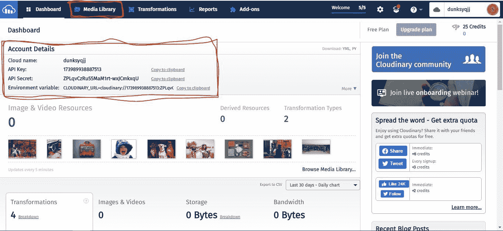

注意`Account details`。你**不应该把这个信息透露给任何人**。我在这里向你展示它，是因为这是一个临时帐户，我只在本教程中使用。

也检查一下`Media Library`选项卡。这是上传的图像将出现的地方。

如果你有这些表现，那么让我们开始摇滚吧...

### 如何在我们的项目中安装 Cloudinary

打开您的终端并导航到项目目录。

执行以下命令安装`Cloudinary`:

```
 npm install cloudinary --save 
```

### 如何在我们的项目中设置 Cloudinary

在 app.js 文件中，要求`const app = express();`下面的`cloudinary`如下:

```
 const cloudinary = require('cloudinary').v2 
```

接下来，从您的仪表板上的帐户详细信息中添加配置详细信息，如下所示:

```
 cloud_name: 'place your cloud_name here',
    api_key: 'place your api_key here',
    api_secret: 'place your api_secret here', 
```

这是我所拥有的:

```
 // cloudinary configuration
  cloudinary.config({
    cloud_name: "dunksyqjj",
    api_key: "173989938887513",
    api_secret: "ZPLqvCzRu55MaM1rt-wxJCmkxqU"
  }); 
```

### 如何创建上传图像的端点

为了避免代码中的错误，首先用下面的代码替换现有的 API:

```
 app.get("/", (request, response) => {
    response.json({ message: "Hey! This is your server response!" });
  }); 
```

基本上是一样的，但是这一次，我们用`get`动词代替了`use`动词，并且我们添加了一个词根端点(`/`)。

接下来，就在`module.exports = app;`行之前，我们将创建我们的`image-upload` API。

让我们先把这段代码放在这里:

```
// image upload API
app.post("/upload-image", (request, response) => {}); 
```

基本上，这就是我们如何设置一个 API。API 向`server`发出一个`POST` `request`，告诉`server`应该以一定程度的安全性来处理`request`。它使用两个参数来发出请求:一个`end-point` (/upload-image)和一个`callback function` ((request，response) = > {})。

让我们通过构建`callback function`为 API 注入活力。

### 如何构建回调函数

#### 安装[主体解析器](https://www.npmjs.com/package/body-parser)

这个 npm 包使我们能够根据具体情况使用`req.body`或`request.body`来处理传入的请求。我们将使用以下代码安装`body-parser`:

```
 npm install --save body-parser 
```

#### 为我们的项目配置 body-paser

要求在 app.js 中进行体解析，如下所示:

```
const bodyParser = require('body-parser'); 
```

接下来，添加以下代码，将其`json`函数设置为我们应用程序的全局中间件，如下所示:

```
 app.use(bodyParser.json());
  app.use(bodyParser.urlencoded({ extended: true })); 
```

我们现在可以适当地处理我们的请求体了。

### 回到构建我们的函数

在函数中，添加以下代码来收集用户输入的任何数据(图像):

```
 // collected image from a user
    const data = {
        image: request.body.image,
    }; 
```

接下来，使用以下代码将图像上传到`cloudinary`:

```
cloudinary.uploader.upload(data.image); 
```

基本上，这就是我们上传图像所需的全部内容。所以我们的`app.js`看起来是这样的:

```
const express = require("express");
const app = express();
const cloudinary = require("cloudinary").v2;
const bodyParser = require('body-parser');

// body parser configuration
app.use(bodyParser.json());
app.use(bodyParser.urlencoded({ extended: true }));

// cloudinary configuration
cloudinary.config({
  cloud_name: "dunksyqjj",
  api_key: "173989938887513",
  api_secret: "ZPLqvCzRu55MaM1rt-wxJCmkxqU"
});

app.get("/", (request, response) => {
  response.json({ message: "Hey! This is your server response!" });
});

// image upload API
app.post("/image-upload", (request, response) => {
    // collected image from a user
    const data = {
      image: request.body.image,
    }

    // upload image here
    cloudinary.uploader.upload(data.image);

});

module.exports = app; 
```

现在这看起来不错，它完美地工作。您可以使用`postman`进行测试。但是如果我们的应用程序能够在处理完我们的请求后给我们反馈，那就太棒了，对吧？

为了实现这一点，我们将把下面的`then...catch...`块添加到 cloudinary upload 中，如下所示:

```
 // upload image here
    cloudinary.uploader.upload(data.image)
    .then((result) => {
      response.status(200).send({
        message: "success",
        result,
      });
    }).catch((error) => {
      response.status(500).send({
        message: "failure",
        error,
      });
    }); 
```

所以我们最终的代码是:

```
const express = require("express");
const app = express();
const cloudinary = require("cloudinary").v2;
const bodyParser = require('body-parser');

// body parser configuration
app.use(bodyParser.json());
app.use(bodyParser.urlencoded({ extended: true }));

// cloudinary configuration
cloudinary.config({
  cloud_name: "dunksyqjj",
  api_key: "173989938887513",
  api_secret: "ZPLqvCzRu55MaM1rt-wxJCmkxqU"
});

app.get("/", (request, response) => {
  response.json({ message: "Hey! This is your server response!" });
});

// image upload API
app.post("/image-upload", (request, response) => {
    // collected image from a user
    const data = {
      image: request.body.image,
    }

    // upload image here
    cloudinary.uploader.upload(data.image)
    .then((result) => {
      response.status(200).send({
        message: "success",
        result,
      });
    }).catch((error) => {
      response.status(500).send({
        message: "failure",
        error,
      });
    });

});

module.exports = app; 
```

### 如何测试我们的 API

在根目录下创建一个文件夹/目录，并将其命名为`images`，如下所示:

```
 mkdir images 
```

将您选择的图像复制到该文件夹。(现在，你的图片相对于 app.js 文件的路径应该是这样的:`"images/<your-image.jpg">`。)

现在让我们继续进行`postman`。

1.  在地址栏中，输入以下内容:`http://localhost:3000/image-upload`
2.  将`Header`键设置为`Content-Type`，将数值设置为`application/json`
3.  将`body`设置为我们在代码中声明的`json`数据，如下所示:

```
 {
	   "image": "images/oskar-yildiz-gy08FXeM2L4-unsplash.jpg"
       } 
```

点击`Send`按钮，等待上传完成并获得您的回复:

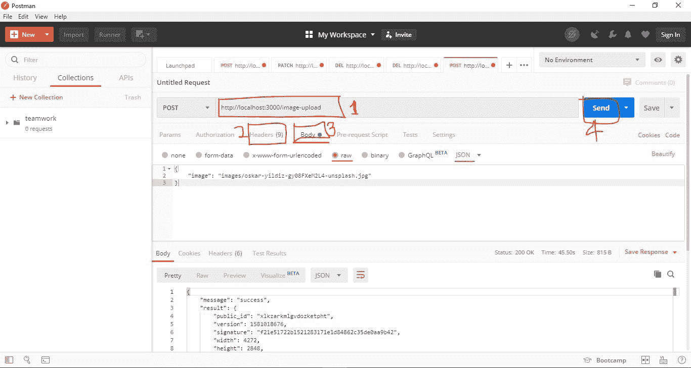

现在，这就是结果。该图像现在有一个由 Cloudinary 随机生成的唯一的`public_id`和一个全局可访问的`secure_url`(您可以将其加载到您的浏览器中查看)。

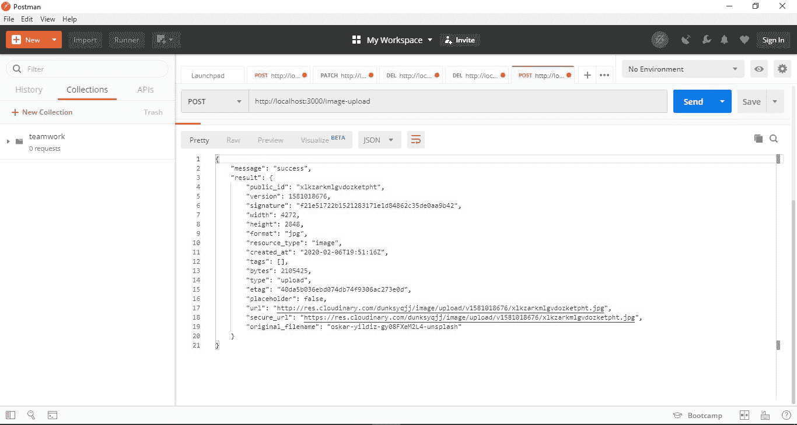

最后，检查您的 Cloudinary 仪表盘上的`Media Library`选项卡，您应该有一个带有`new`徽章的新图像。这将有一个唯一的 id，与我们在上面的 postman 结果中看到的`public_id`相匹配，如下图所示:

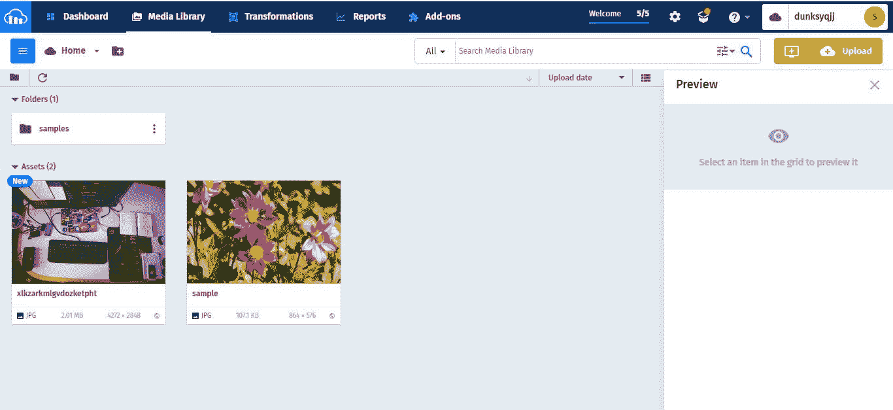

瓦拉！我们坚持没有压力的图像...感觉真好。

嗯，还有一件事——安全！

我们的云二进制配置细节在我们的 app.js 文件中公开。如果我们将我们的项目推送到 GitHub，它将对任何想要查看它的人公开。如果它落入坏人之手，就会成为一个问题。

但是不要担心这里的事情，这里有一个几乎所有东西的修复。我们将使用`dotenv` npm 包向公众隐藏我们的配置。

## 如何通过`dotenv`保护我们的配置

首先，如果您还没有安装 [dotenv](https://www.npmjs.com/package/dotenv) ,您需要安装:

```
npm install dotenv --save 
```

然后像这样要求`app.js`中的`dotenv`:

```
 require('dotenv').config() 
```

在根目录下创建一个新文件，命名为`.env`。

在该文件中，输入您的云二进制配置详细信息，如下所示:

```
 CLOUD_NAME=dunksyqjj
  API_KEY=173989938887513
  API_SECRET=ZPLqvCzRu55MaM1rt-wxJCmkxqU 
```

在 app.js 文件中，我们将通过`process.env`属性访问`.env`文件中的配置，如下所示:

```
// cloudinary configuration
cloudinary.config({
  cloud_name: process.env.CLOUD_NAME,
  api_key: process.env.API_KEY,
  api_secret: process.env.API_SECRET
}); 
```

这是我此刻的`app.js`代码:

```
const express = require("express");
const app = express();
const cloudinary = require("cloudinary").v2;
const bodyParser = require('body-parser');
require('dotenv').config()

// body parser configuration
app.use(bodyParser.json());
  app.use(bodyParser.urlencoded({ extended: true }));

// cloudinary configuration
cloudinary.config({
  cloud_name: process.env.CLOUD_NAME,
  api_key: process.env.API_KEY,
  api_secret: process.env.API_SECRET
});

app.get("/", (request, response, next) => {
  response.json({ message: "Hey! This is your server response!" });
  next();
});

// image upload API
app.post("/image-upload", (request, response) => {
    // collected image from a user
    const data = {
      image: request.body.image,
    }

    // upload image here
    cloudinary.uploader.upload(data.image)
    .then((result) => {
      response.status(200).send({
        message: "success",
        result,
      });
    }).catch((error) => {
      response.status(500).send({
        message: "failure",
        error,
      });
    });
});

module.exports = app; 
```

让我们再次测试我们的应用程序，以确保没有任何问题。这是我的结果:

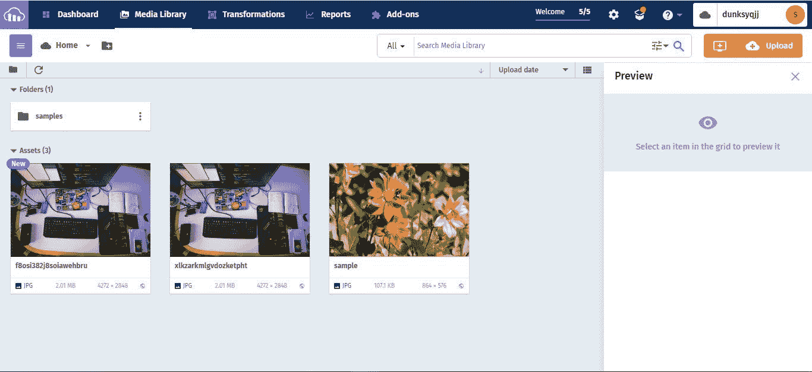

我现在有两个相同的图像，但是有不同的`public_id`。

就是这样！

耶！我们的应用程序比开始时更加安全。

## 结论

在本教程中，我们只使用 Node.js 完成了创建服务器的步骤，之后，我们使用 Express 和 nodemon 改进了我们的服务器。

最后，我们看到了如何通过我们的 Express 应用程序将图像上传到 Cloudinary，以及如何使用`dotenv`包保护我们的配置细节。

这只是一个介绍。如果您试用这个应用程序，您可以做更多的事情。

你可以在这里找到服务器创建代码[。](https://github.com/EBEREGIT/server-tutorial/tree/create-server)

此处提供了图片上传代码[。](https://github.com/EBEREGIT/server-tutorial/tree/cloudinary-upload)

谢谢你的时间。😊