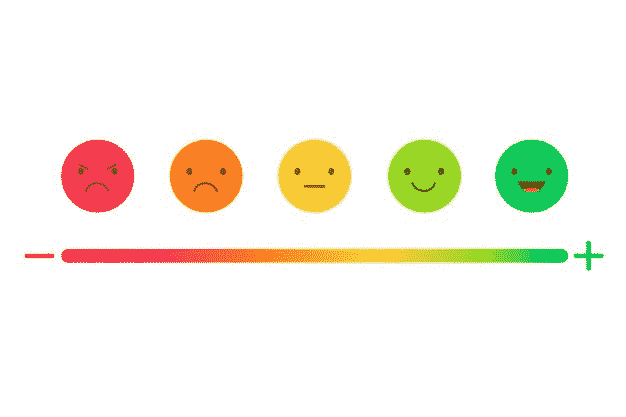
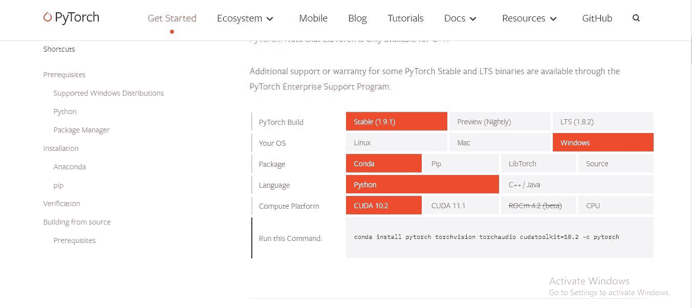
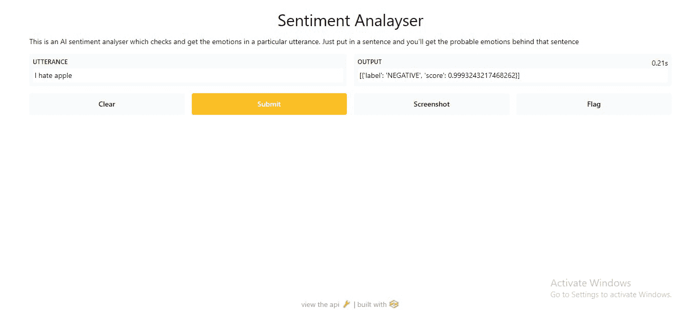

# 如何使用 Blenderbot 构建情感分析 App

> 原文：<https://www.freecodecamp.org/news/build-a-sentiment-analayis-app-using-blenderbot/>

将机器学习模型转化为其他人可以使用的实际应用程序不是大多数人工智能和机器学习教程中涵盖的内容。

在本文中，我们将使用 Gradio 和拥抱面部变形金刚创建一个端到端的人工智能情感分析 web 应用程序。

# 什么是情感分析？



根据[维基百科](https://en.wikipedia.org/wiki/Sentiment_analysis)，

> 情感分析是使用自然语言处理、文本分析、计算语言学和生物统计学来系统地识别、提取、量化和研究情感状态和主观信息。

简单来说，情感分析就是人工智能对一句话或一段文字进行分析，得出那句话或那段文字背后的情感的能力。

# 格拉迪欧是什么？


[Gradio 是一个开源的 Python 库](https://gradio.app/)，您可以使用它快速地为您的 ML 模型、任何 API 或任何任意函数创建和定制易于使用的 UI 组件，只需几行代码。

Gradio 使您可以非常轻松地构建图形用户界面和部署机器学习模型。

# 什么是抱脸？

[拥抱脸](https://huggingface.co/)是一个为机器学习工程师提供预训练和开源的自然语言处理模型和数据集的库。

这是一个开源的机器学习社区，你可以下载预先训练好的机器学习模型，并在自己的项目中使用它们。

# 是时候构建我们的项目了

## **先决条件**

*   安装 Python
*   拥有一个 IDE /文本编辑器(比如 [Visual Studio](https://code.visualstudio.com/) 、 [PyCharm](https://www.jetbrains.com/pycharm/) 或者 [Jupyter Notebook](https://jupyter.org/) )
*   有互联网连接

这里是项目的 [GitHub 仓库](https://github.com/EdemGold/sentiment-analysis-app)。

## **安装依赖关系**

在这里，我们将安装构建情感分析应用程序所需的库。

### 如何安装变压器

在这里，我们将安装变形金刚库。这个库将让我们访问拥抱脸 API。

```
#In a jupyter notebook
!pip install transformers

#In terminal
pip install transformers 
```

### 如何安装 PyTorch

我们准备安装 PyTorch 深度学习库。访问 [PyTorch 网站](https://pytorch.org/get-started/locally/)并安装您的专用版本。



下面是我安装的 PyTorch 版本。

```
#install in jupyter notebook
!pip3 install torch==1.9.1+cu111 torchvision==0.10.1+cu111 torchaudio===0.9.1 -f https://download.pytorch.org/whl/torch_stable.html

#Install in Terminal
pip3 install torch==1.9.1+cu111 torchvision==0.10.1+cu111 torchaudio===0.9.1 -f https://download.pytorch.org/whl/torch_stable.html 
```

### 导入并设置管道

在这里，我们将使用拥抱面部管道导入并设置我们的*情感分析模型*。

Hugging Face 提供了一个自动管道，帮助您处理标记化、预处理、编码和解码等事情，并让您专注于模型优化等核心事情。

```
#setting up hugging face pipeline
from transformers import pipeline
classifier = pipeline("sentiment-analysis") 
```

上面我们导入并实例化了 pipeline 对象，然后我们向情感分析模型传递了一个参数。

### 如何定义 Gradio 函数

我们将定义一个 Gadio 函数，它将帮助我们为 web 应用程序提供情感分析功能。

如果你读过我的[过去的文章](https://www.freecodecamp.org/news/build-gui-using-gradio-for-machine-learning-models/)关于使用 Gradio 为机器学习模型构建图形用户界面(GUI ),你会知道 Gradio 允许你为你的模型构建图形组件，它们通过函数提供模型的预测功能。

```
#model function for gradio

def func(utterance):
  return classifier(utterance) 
```

上面我们创建了一个名为`func`的函数，并添加了话语(也就是要被情感模型分析的单词)作为函数的参数。然后，我们让我们的函数返回先前传递的话语的情感分析，这将我们带到下一步。

### 如何建立我们的 Gradio 界面

在这里，我们将创建我们的 Gradio web 应用程序，向其添加图形组件，然后我们将启动该应用程序。

```
#getting gradio library
import gradio as gr
descriptions = "This is an AI sentiment analyzer which checks and gets the emotions in a particular utterance. Just put in a sentence and you'll get the probable emotions behind that sentence"

app = gr.Interface(fn=func, inputs="text", outputs="text", title="Sentiment Analayser", description=descriptions)
app.launch() 
```

上面我们导入了 Gradio 库，然后我们添加了对我们项目的描述，这将被传递到我们的 web 应用程序中。

然后，我们创建了一个 Gradio 接口实例，我们将在其中提供有关我们的 web 应用程序的详细信息。我们将模型的功能传递给`fn`参数，然后提供输入的类型。

Gradio 允许你创建任何形式的输入，可以是文本、单选按钮、复选框、数字等等。但是在这里，我们将使用我们的输入作为文本。

接下来，我们提供了输出格式，与 Gradio 允许您选择输入格式(即文本、数字、复选框等)的方式相同。它还允许您选择输出格式。

在这种情况下，我们也将使用文本。在传递输出参数后，我们给我们的 web 应用程序一个标题。

最后，我们启动应用程序。



现在你可以使用你的新情绪分析工具了！

感谢您的阅读。

## **重要资源**

*   [Gradio 官网](https://gradio.app/)
*   [Gradio 文档](https://gradio.app/docs)
*   [Gradio GitHub 回购](https://github.com/gradio-app/gradio)