# 如何用 React、Redux 和 Redux Saga 构建一个贪吃蛇游戏

> 原文：<https://www.freecodecamp.org/news/build-a-snake-game-with-react-redux-and-redux-sagas/>

在本文中，我将带领您使用 React 应用程序创建一个贪吃蛇游戏。这是一个使用 TypeScript 构建的简单 2d 游戏，我们不需要使用任何第三方图形库来构建它。

这是我们在本教程中要做的:

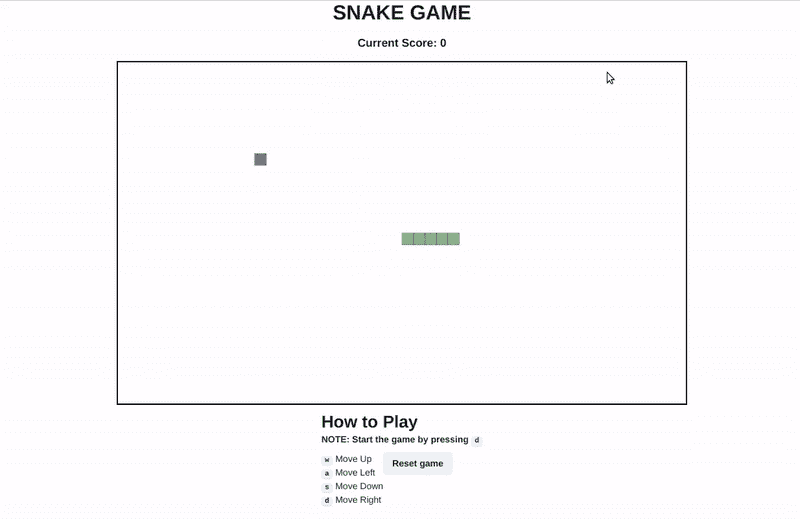

贪吃蛇是一款有趣的游戏，你可能在诺基亚 3310 等老式功能手机上玩过。

它背后的概念很简单:蛇在一个盒子里四处游荡，一旦它抓住了水果/物体，你的分数就会增加，蛇也会成长。如果蛇碰到盒子的边界或与自己碰撞，那么游戏就结束了。

这篇文章将为你提供从头开始创建你自己的贪吃蛇游戏的所有必要的技巧/步骤。我们将首先看看代码结构和它们的逻辑。然后我会解释当它们都连接在一起时，它们是如何工作的。

事不宜迟，我们开始吧。

## 目录

*   [先决条件](#prerequisites)
*   [什么是蛇游戏？我们要在里面用什么？](#what-is-a-snake-game-what-are-we-going-to-use-in-it)
*   [redux 是什么？我们为什么要用这个？](#what-is-redux-why-are-we-using-it)
*   [什么是 redux-saga？我们为什么要用这个？](#what-is-redux-saga-why-are-we-using-it)
*   [用例描述](#use-case-description)
*   [应用和数据层设置](#the-application-and-data-layer-set-up)
*   [了解 UI 层](#understanding-ui-layer)
*   [画布板](#canvas-board)
*   [绘制对象](#drawing-the-objects)
*   [在棋盘上移动蛇](#moving-the-snake-across-the-board)
*   [在任意位置抽取水果](#drawing-the-fruit-at-a-random-position)
*   [分数计算器](#score-calculator)
*   [指令组件](#instruction-component)
*   [决赛](#final-game)
*   [总结](#summary)

## 先决条件

在开始阅读本文之前，您应该对以下主题有一个基本的了解:

*   类图:我们将用它们来展示我们的例子。以下是一些资源，您可以使用它们来了解更多信息:
    *   [类图](https://drawio-app.com/uml-class-diagrams-in-draw-io/)
    *   [UML 图教程](https://www.freecodecamp.org/news/uml-diagrams-full-course/)
*   [上下文图和容器图](https://www.notion.so/JS-Classes-a-boon-to-the-society-6360d1a702fe49da9b7ba98b0e03fe37)
*   [反应](https://reactjs.org/)
*   发电机:
    *   [发电机](https://developer.mozilla.org/en-US/docs/Web/JavaScript/Reference/Global_Objects/Generator)
    *   [函数发生器](https://developer.mozilla.org/en-US/docs/Web/JavaScript/Reference/Statements/function*)

## 什么是贪吃蛇游戏？我们要在里面用什么？

蛇游戏是一种街机游戏，涉及一条蛇在一个盒子里移动。你的分数会根据蛇吃了多少东西/水果而增加。这也会增加蛇的大小。如果它与自己或盒子的边界发生碰撞，那么游戏就结束了。

你可以在 Wiki [链接](https://en.wikipedia.org/wiki/Snake_(video_game_genre))中阅读更多关于游戏历史或起源的内容。

我们将使用以下工具来构建我们的游戏:

*   Redux:创建和管理应用程序的全局状态。
*   Redux-saga:我们将用来管理异步任务的 Redux 中间件。
*   Canvas HTML 标签:我们将用它来画一个像蛇和水果这样的物体。
*   React: UI 库。
*   组件库。

## redux 是什么？我们为什么要使用它？

Redux 是一个状态容器，帮助您创建和管理应用程序的全局状态。Redux 由一些基本部分组成，如:

1.  全球状态
2.  Redux 商店
3.  动作和动作创建者
4.  还原剂

你可以从 Redux 文档的入门[部分](https://redux.js.org/introduction/getting-started)中了解所有上述主题以及 Redux 如何在内部工作。

我们使用状态管理库 Redux，因为它将帮助我们以更简单的方式管理全局状态。它将允许我们避免正确钻探。它还允许我们通过中间件执行复杂的异步操作。

你可以在这里了解更多关于中间件的知识。

## 什么是 redux-saga？我们为什么要使用它？

Redux-saga 是一个中间件，它帮助我们在调度的动作和 Redux 存储的缩减器之间建立联系。这允许我们在分派的动作和缩减器之间执行某些副作用，比如数据获取、监听特定的动作或设置订阅、生成动作等等。

Redux saga 使用生成器和生成器函数。典型的传奇应该是这样的:

```
function* performAction() {
    yield put({
        type: COPY_DATA,
        payload: "Hello"
    });
}
```

`performAction`是一个生成器函数。该生成器功能将执行`put`功能。它创建一个对象并将其返回给 saga，告诉它需要用什么样的有效负载执行什么类型的动作。然后`put`调用返回一个对象描述符，说明哪个 saga 可以在以后使用它并执行特定的动作。

**注意:**你可以通过参考先决条件一节来阅读更多关于生成器和生成器函数的内容。

现在问题来了*我们为什么要使用 redux-saga 中间件？*答案很简单:

1.  它提供了一种更好的方法来编写单元测试用例，这将帮助我们以更简单的方式测试生成器功能。
2.  它可以帮助您执行许多副作用，并提供对更改的更好控制。一个例子是，无论何时你想观察一个特定的动作 X 是否被执行，那么就执行动作 y。像`takeEvery`、`all`等函数使得执行这些操作变得简单。我们将在后面的章节中对此进行更多的讨论。

如果你不熟悉 redux-saga，那么我强烈推荐在这里浏览文档。

## 用例描述

**注意:**在这篇博文中绘制的上下文、容器和类图并没有准确地遵循这些图的确切约定。我在这里对它们进行了近似，这样你就可以理解基本概念了。

在我们开始之前，我建议阅读 C4 模型、容器图和上下文图。您可以在先决条件部分找到关于它们的参考资料。

在本文中，我们将考虑以下用例:*创建一个贪吃蛇游戏*。

用例非常简单明了，我们已经在上面讨论了贪吃蛇游戏需要什么。下面是我们用例的上下文图:

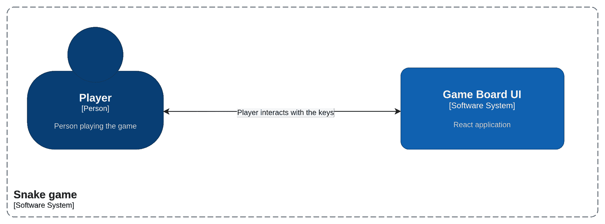

Snake game context diagram

我们的上下文图非常简单。玩家与 UI 进行交互。让我们更深入地研究容器游戏板 UI，并探索它里面还有哪些其他系统。

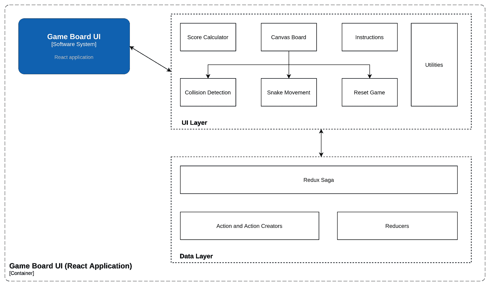

Container diagram for the snake game

从上图可以看出，我们的游戏板 UI 分为两层:

1.  用户界面层
2.  数据层

UI 层由以下组件组成:

1.  **分数计算器:**这是一个组件，每当蛇吃了水果，它就会显示分数。
2.  画布板:这是一个组件，处理我们游戏的主要 UI 部分。它的基本功能是在画布上画蛇并清除画布。它还处理以下职责:
    1.  它检测蛇是否与自身或边界壁发生碰撞(碰撞检测)。
    2.  通过键盘事件帮助沿着棋盘移动蛇。
    3.  游戏结束时重置游戏。
3.  **说明:**提供玩游戏的说明，还有重置按钮。
4.  **Utilities:** 这些是我们将在整个应用程序中任何需要的地方使用的实用函数。

现在让我们来谈谈数据层。它由以下组件组成:

1.  **Redux-saga:** 将执行特定动作的生成器函数集。
2.  **动作和动作创建者:**这些是常量和函数的集合，有助于分派适当的动作。
3.  **Reducers:** 这将有助于我们对动作创作者和传奇故事所派遣的各种动作做出反应。

我们将深入研究所有这些组件，并在后面的章节中了解它们是如何共同工作的。首先，让我们初始化我们的项目并设置我们的数据层——也就是 Redux 存储。

## 应用程序和数据层设置

在我们开始理解我们的游戏组件之前，让我们首先设置我们的 React 应用程序和数据层。

游戏是用 React 构建的。我强烈推荐使用 [create-react-app](https://create-react-app.dev/) 模板来安装启动 react 应用程序所需的所有东西。

要创建一个 CRA (create-react-app)项目，首先我们需要安装它。在您的终端中键入以下命令:

```
npm install -g create-react-app
```

**注意:**在运行这个命令之前，请确保您的系统中已经安装了 Node.js。按照这个[链接](https://nodejs.org/en/download/package-manager/)进行安装。

接下来，我们将开始创建我们的项目。让我们称之为蛇游戏。在您的终端中键入以下命令来创建项目:

```
npx create-react-app snake-game
```

这可能需要几分钟才能完成。完成后，使用下面的命令遍历新创建的项目:

```
cd snake-game
```

进入项目后，键入以下命令启动项目:

```
npm run start
```

该命令将在您的浏览器中打开一个新的选项卡，React 徽标在页面上旋转，如下所示:

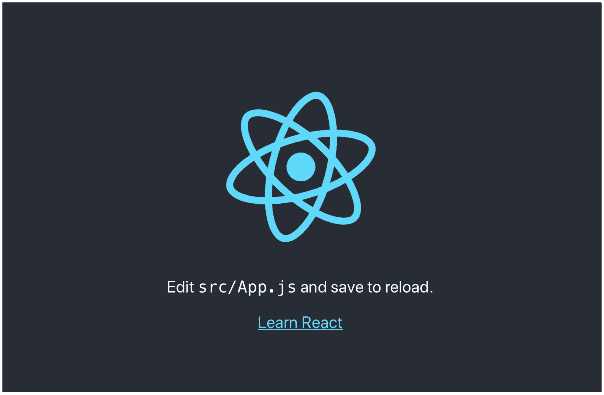

create-react-app initial page

现在，我们的初始项目设置已经完成。让我们配置我们的数据层(Redux 存储)。我们的数据层要求我们安装以下软件包:

*   Redux
*   还原传奇

首先，让我们从安装这些包开始。在我们开始之前，确保您在项目目录中。在终端中键入以下命令:

```
npm install redux react-redux redux-saga
```

一旦安装了这些包，我们将首先配置我们的 Redux 存储。首先，让我们创建一个名为`store`的文件夹:

```
mkdir store
```

这个`store`文件夹将包含所有与 Redux 相关的文件。我们将按照以下方式组织我们的商店文件夹:

```
store/
├── actions
│   └── index.ts
├── reducers
│   └── index.ts
└── sagas
    └── index.ts
├── index.ts
```

让我们讨论一下每个文件的作用:

*   这个文件由常量组成，这些常量代表了我们的应用程序可以执行并发送到 Redux 存储的动作。此类动作常数的一个示例如下:

```
export const MOVE_RIGHT = "MOVE_RIGHT"
```

我们将使用相同的 action 常量来创建一个函数，该函数将返回一个具有以下属性的对象:

*   `type`:动作类型，即动作常数
*   `payload`:作为有效载荷的附加数据。

这些返回带有`type`属性的对象的函数被称为动作创建器。我们使用这些函数将动作分派给 Redux 存储。

`payload`属性表示除了动作之外，我们还可以传递额外的数据，这些数据可以用来存储或更新全局状态中的值。

**注意**:动作创建者必须返回`type`属性。`payload`属性是可选的。另外，`payload`属性的名称可以是任何东西。

让我们看一个动作创建者的例子:

```
//Without payload
export const moveRight = () => ({
	type: MOVE_RIGHT
});

//With payload
export const moveRight = (data: string) => ({
	type: MOVE_RIGHT,
	payload: data
});
```

现在我们知道了什么是动作和动作创建者，我们可以继续配置我们的下一个工件，它是一个缩减器。

Reducers 是在每次调度动作时返回新的全局状态的函数。它们接受当前的全局状态，并基于被分派/调用的动作返回新的状态。这个新状态是根据以前的状态计算的。

我们应该小心，不要在这个函数中执行任何副作用。我们不应该改变全局状态——相反，我们应该将更新后的状态作为一个新对象本身返回。所以减速器功能应该是纯功能。

关于减压器的讨论到此为止。让我们来看看我们的样品减少器:

```
const GlobalState = {
    data: ""
};

const gameReducer = (state = GlobalState, action) => {
    switch (action.type) {
        case "MOVE_RIGHT":
            /**
             * Perform a certain set of operations
             */
            return {
                ...state, data: action.payload
            };

        default:
            return state;
    }
}
```

在这个例子中，我们创建了一个名为`gameReducer`的 reducer 函数。它接受状态(默认参数为全局状态)和动作。每当我们有符合开关情况的`action.type`时，它就会执行一个特定的动作，比如基于这个动作返回一个新的状态。

文件将包含我们将在应用程序中使用的所有故事。我们确实对这些传说有一些基本的了解，我们在上面的章节中已经简要地解释过了。当我们真正开始实现贪吃蛇游戏时，我们将更深入地研究这一部分。

现在，我们对制作 Redux 存储所涉及的工件有了基本的了解。让我们继续创建如下的`store/index.ts`:

```
import {
    createStore,
    applyMiddleware
} from "redux";
import createSagaMiddleware from "redux-saga";
import gameReducer from "./reducers";
import watcherSagas from "./sagas";
const sagaMiddleware = createSagaMiddleware();

const store = createStore(gameReducer, applyMiddleware(sagaMiddleware));

sagaMiddleware.run(watcherSagas);
export default store;
```

我们将首先导入我们的减速器和佐贺。接下来，我们将使用`createSagaMiddleware()`函数创建一个 saga 中间件。

接下来，我们将通过将它作为参数传递给用于创建商店的`createStore`中的`applyMiddleware`函数来将其连接到我们的商店。我们还将把`gameReducer`传递给这个函数，以便将一个 reducer 映射到我们的商店。

最后，我们将使用以下代码运行我们的 sagaMiddleware:

```
sagaMiddleware.run(watcherSagas);
```

我们的最后一步是使用`react-redux`提供的`Provider`组件在 React 应用程序的顶层注入这个`store`。您可以这样做:

```
import { Provider } from "react-redux";
import store from "./store";

const App = () => {
  return (
    <Provider store={store}>
    //   Child components...
    </Provider>
  );
};

export default App;
```

我还安装了 chakra-UI 作为我们项目的 UI 组件库。要安装 chakra-UI，请键入以下命令:

```
npm install @chakra-ui/react @emotion/react@^11 @emotion/styled@^11 framer-motion@^5
```

我们还需要设置将放入我们的`App.tsx`文件中的`ChakraProvider`。我们更新后的`App.tsx`文件将如下所示:

```
import { ChakraProvider, Container, Heading } from "@chakra-ui/react";
import { Provider } from "react-redux";
import store from "./store";

const App = () => {
  return (
    <Provider store={store}>
      <ChakraProvider>
        <Container maxW="container.lg" centerContent>
          <Heading as="h1" size="xl">SNAKE GAME</Heading>
	//Children components
        </Container>
      </ChakraProvider>
    </Provider>
  );
};

export default App;
```

## 了解 UI 层

让我们首先从 UI 的角度来理解我们的贪吃蛇游戏的动态。在我们开始之前，我们最终的贪吃蛇游戏将如下所示:

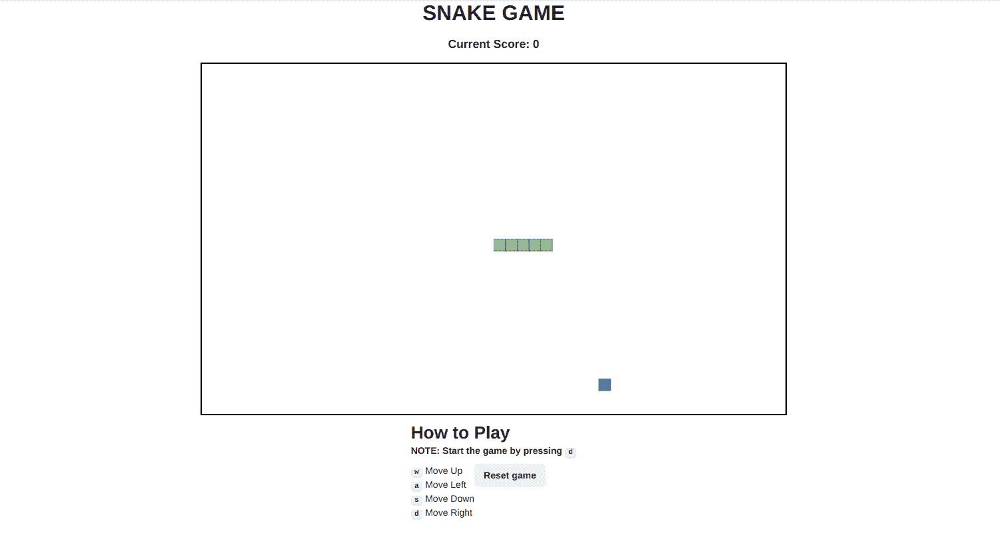

UI 层由三层组成:**分数计算器**、**画布**和**指令**。下图展示了这些部分:

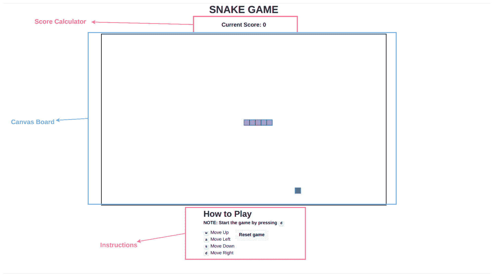

让我们更深入地了解这些部分，以理解我们的贪吃蛇游戏是如何工作的。

## 帆布纸板

我们将从了解画布板开始:

*   我们的画布板的尺寸是`height: 600, width: 1000`
*   整个棋盘被分成`20x20`大小的块。也就是说，在这个板上画的每个物体都有`height 20`和`width 20`。
*   我们使用`<canvas>` HTML 元素在画布板组件中绘制形状。

在我们的项目中，我们在文件`components/CanvasBoard.tsx`中编写画布板组件。现在我们对 CanvasBoard 组件有了基本的了解，让我们开始构建这个组件。

创建一个返回画布元素的简单组件，如下所示:

```
export interface ICanvasBoard {
  height: number;
  width: number;
}

const CanvasBoard = ({ height, width }: ICanvasBoard) => {
  return (
    <canvas
      style={{
        border: "3px solid black",
      }}
      height={height}
      width={width}
    />
  );
};
```

在我们的`App.tsx`文件中调用这个宽和高分别为 1000 和 600 的组件作为道具，如下所示:

```
import { ChakraProvider, Container, Heading } from "@chakra-ui/react";
import { Provider } from "react-redux";
import CanvasBoard from "./components/CanvasBoard";
import ScoreCard from "./components/ScoreCard";
import store from "./store";

const App = () => {
  return (
    <Provider store={store}>
      <ChakraProvider>
        <Container maxW="container.lg" centerContent>
          <Heading as="h1" size="xl">SNAKE GAME</Heading>
          <CanvasBoard height={600} width={1000} /> //Canvasboard component added 
        </Container>
      </ChakraProvider>
    </Provider>
  );
};

export default App;
```

这将创建一个高度=600，宽度=1000 的简单方框，带有黑色边框，如下所示:

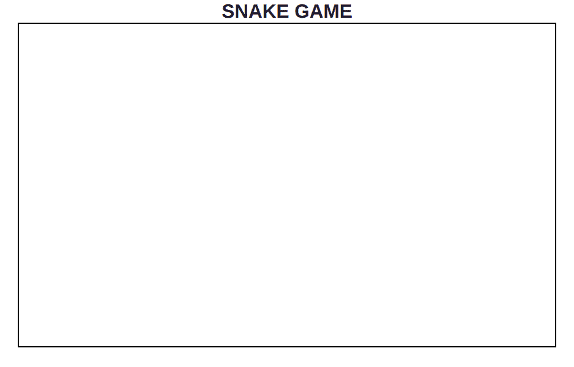

A blank canvas element with width=1000 and height=600

现在让我们在画布的中心画一条蛇。但是在我们开始绘制之前，我们需要得到这个`canvas`元素的上下文。

canvas 元素的上下文为您提供了与 canvas 元素相关的所有信息。它给你画布的尺寸，也帮助你在画布上画画。

为了获得画布元素的上下文，我们需要调用`getCanvas('2d')`函数，该函数返回画布的 2d 上下文。这个函数的返回类型是`CanvasRenderingContext2D`接口。

要在纯 JS 中做到这一点，我们应该做如下的事情:

```
const canvas = document.querySelector('canvas');
const canvasCtx = canvas.getContext('2d');
```

但是在 React 中要做到这一点，我们需要创建一个`ref`并将其传递给 canvas 元素，这样我们可以稍后在不同的钩子中处理它。为此，在我们的应用程序中，使用`useRef`钩子创建一个`ref`:

```
const canvasRef = useRef<HTMLCanvasElement | null>(null);
```

将 ref 传递给我们的`canvas`元素:

```
<canvas
  ref={canvasRef}
  style={{
    border: "3px solid black",
  }}
  height={height}
  width={width}
/>; 
```

一旦`canvasRef`被传递到`canvas`元素中，我们就可以在`useEffect`钩子中使用它，并将上下文存储在一个状态变量中。

```
export interface ICanvasBoard {
  height: number;
  width: number;
}

const CanvasBoard = ({ height, width }: ICanvasBoard) => {
  const canvasRef = (useRef < HTMLCanvasElement) | (null > null);
  const [context, setContext] =
    (useState < CanvasRenderingContext2D) | (null > null);

  useEffect(() => {
    //Draw on canvas each time
    setContext(canvasRef.current && canvasRef.current.getContext("2d")); //store in state variable
  }, [context]);

  return (
    <canvas
      ref={canvasRef}	
      style={{
        border: "3px solid black",
      }}
      height={height}
      width={width}
    />
  );
}; 
```

Storing canvas context in a state variable

## 绘制对象

获得上下文后，我们需要在每次组件更新时执行以下任务:

1.  清理画布
2.  用当前位置画蛇
3.  在盒子里的任意位置画一个水果

我们将多次清除画布，因此我们将使它成为一个实用函数。因此，让我们创建一个名为`utilities`的文件夹:

```
mkdir utilities
cd utilities
touch index.tsx
```

上面的命令还会在 utilities 文件夹中创建一个`index.tsx`文件。在`utilities/index.tsx`文件中添加以下代码:

```
export const clearBoard = (context: CanvasRenderingContext2D | null) => {
  if (context) {
    context.clearRect(0, 0, 1000, 600);
  }
};
```

Code for clearing the canvas

`clearBoard`函数非常简单。它执行以下操作:

1.  它接受 2d 画布上下文对象作为参数。
2.  它检查上下文是否不为空或未定义。
3.  `clearRect`功能将清除矩形内的所有像素或对象。该函数将宽度和高度作为要清除的矩形的参数。

我们将在我们的`CanvasBoard` useEffect 中使用这个`clearBoard`函数，在每次组件更新时清除画布。为了区分不同的`useEffects`，我们将上述 useEffect 命名为 useEffect1。

现在让我们从在任意位置画蛇和水果开始。由于我们要多次绘制对象，我们将为它创建一个名为`drawObject`的实用函数。在`utilities/index.tsx`文件中添加以下代码:

```
export interface IObjectBody {
  x: number;
  y: number;
}

export const drawObject = (
  context: CanvasRenderingContext2D | null,
  objectBody: IObjectBody[],
  fillColor: string,
  strokeStyle = "#146356"
) => {
  if (context) {
    objectBody.forEach((object: IObjectBody) => {
      context.fillStyle = fillColor;
      context.strokeStyle = strokeStyle;
      context?.fillRect(object.x, object.y, 20, 20);
      context?.strokeRect(object.x, object.y, 20, 20);
    });
  }
};
```

Function for drawing an object onto the canvas

`drawObject`函数接受以下参数:

1.  `context`–用于在画布上绘制对象的 2D 画布上下文对象。
2.  `objectBody`–这是一个对象数组，每个对象都有`x`和`y`属性，就像`IObjectBody`接口一样。
3.  `fillColor`–对象内部要填充的颜色。
4.  `strokeStyle`–填充对象轮廓的颜色。默认为`#146356`。

该函数将检查上下文是否未定义或为空。然后它通过 forEach 迭代`objectBody`。对于每个对象，它执行以下操作:

1.  它将在上下文中分配`fillStyle`和`strokeStyle`。
2.  它将使用`fillReact`创建一个填充的矩形，坐标为`object.x`和`object.y`，大小为`20x20`
3.  最后，它将使用`strokeRect`创建一个带有坐标`object.x`和尺寸`20x20`的`object.y`的矩形轮廓

为了画蛇，我们需要保持蛇的位置。为此，我们可以使用我们的全局状态管理工具`redux`。

我们需要更新我们的`reducers/index.ts`文件。由于我们想要跟踪蛇的位置，我们将把它添加到全局状态中，如下所示:

```
interface ISnakeCoord {
  x: number;
  y: number;
}

export interface IGlobalState {
  snake: ISnakeCoord[] | [];
}

const globalState: IGlobalState = {
  //Postion of the entire snake
  snake: [
    { x: 580, y: 300 },
    { x: 560, y: 300 },
    { x: 540, y: 300 },
    { x: 520, y: 300 },
    { x: 500, y: 300 },
  ],
};
```

Updating the global state

让我们在我们的`CanvasBoard`组件中调用这个状态。我们将使用 react-redux 的`useSelector`钩子从存储中获取所需的状态。下面将为我们呈现`snake`的全局状态:

```
const snake1 = useSelector((state: IGlobalState) => state.snake);
```

让我们将它嵌入到我们的`CanvasBoard`组件中，并将其传递给我们的`drawObject`函数，然后查看输出:

```
//Importing necessary modules
import { useSelector } from "react-redux";
import { clearBoard, drawObject, generateRandomPosition } from "../utils";

export interface ICanvasBoard {
  height: number;
  width: number;
}

const CanvasBoard = ({ height, width }: ICanvasBoard) => {
	const canvasRef = useRef<HTMLCanvasElement | null>(null);
	const [context, setContext] = useState<CanvasRenderingContext2D | null>(null);
	const snake1 = useSelector((state: IGlobalState) => state.snake);
	const [pos, setPos] = useState<IObjectBody>(
	    generateRandomPosition(width - 20, height - 20)
	  );

	useEffect(() => {
	  //Draw on canvas each time
	 setContext(canvasRef.current && canvasRef.current.getContext("2d")); //store in state variable
		drawObject(context, snake1, "#91C483"); //Draws snake at the required position
		drawObject(context, [pos], "#676FA3"); //Draws fruit randomly
	}, [context])

  return (
    <canvas
      style={{
        border: "3px solid black",
      }}
      height={height}
      width={width}
    />
  );
};
```

Code for drawing the snake and the fruit

让我们看看画出这条蛇后的输出是什么样的:

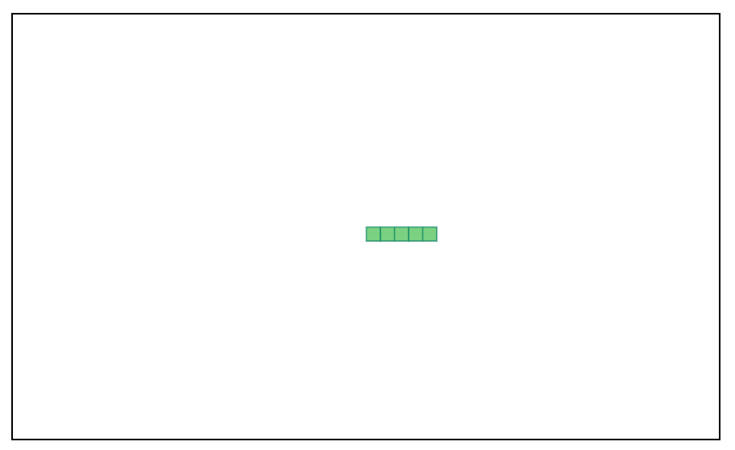

Drawing snake

## 将蛇移过棋盘

现在我们已经把蛇画到了画布上，让我们来学习如何在棋盘上移动蛇。

蛇的运动很简单。它应始终遵循以下几点:

1.  如果蛇是水平移动的，那么它只能向上、向下和在它当前移动的方向上移动。例如，如果蛇向右移动，那么它可以向上或向下移动或继续向右移动。
2.  如果这条蛇是垂直移动的，那么它只能向右、向左移动，或者继续它当前移动的方向。例如，如果蛇向上移动，那么它可以向右或向左移动(或继续向上)。
3.  蛇不能向与当前方向相反的方向移动。也就是说，如果蛇向左移动，那么它就不能马上向右移动。同样，如果它在上升，它就不能下降。

为了蛇的平稳移动，蛇应该总是以矩形的方式移动。而且它需要满足以上几点才能有那个动作。

下图有助于总结蛇在整个应用程序中的运动方式:

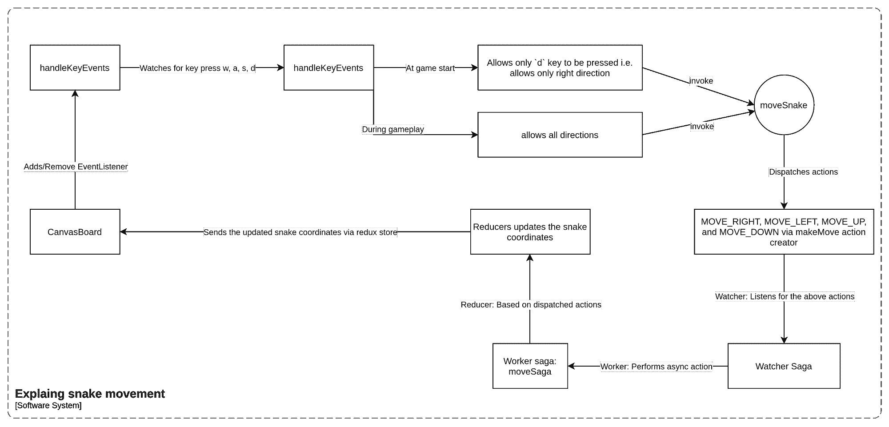

Snake movement explanation

**注意:**在上图中，蛇的整个运动从`CanvasBoard`组件开始。

**提示:**如果不能跟上上图也不用担心。只需阅读后面的章节，以获得更多的清晰度。

为了保持蛇的运动，我们将在全局状态中引入另一个状态变量`disallowedDirection`。这个变量的目的是跟踪蛇运动的相反方向。

例如，如果蛇向左移动，那么`disallowedDirection`将被设置为向右。总而言之，我们跟踪这个方向，这样我们就可以避免蛇向相反的方向移动。

让我们在全局状态中创建这个变量:

```
interface ISnakeCoord {
  x: number;
  y: number;
}

export interface IGlobalState {
  snake: ISnakeCoord[] | [];
  disallowedDirection: string;
}

const globalState: IGlobalState = {
	//Postion of the entire snake
  snake: [
    { x: 580, y: 300 },
    { x: 560, y: 300 },
    { x: 540, y: 300 },
    { x: 520, y: 300 },
    { x: 500, y: 300 },
  ],
	disallowedDirection: ""
};
```

Adding a new global state

现在让我们创建一些动作和动作创建器来帮助我们移动这条蛇。

对于这种情况，我们有两种类型的操作:

*   传奇行动
    *   这些是将从`CanvasBoard`组件分派的动作。这些行动将是:
        *   向右移动
        *   向左移动
        *   上移
        *   下移 _ 下
*   减速器的操作
    *   这些是 saga 将产生的动作，用于将调用传播给 reducers。这些行动将是:
        *   正确
        *   左边的
        *   向上
        *   向下

在接下来的章节中，我们将进一步研究这些操作。

我们将再创建一个名为`SET_DIS_DIRECTION`的动作来设置`disallowedDirection`状态。

让我们为蛇的运动创建一些动作创建器:

*   `setDisDirection`–该动作创建器将用于通过`SET_DIS_DIRECTION`动作设置`disallowedDirection`。下面是这个动作创建者的代码:

```
export const setDisDirection = (direction: string) => ({
  type: SET_DIS_DIRECTION,
  payload: direction
});
```

*   `makeMove`–这将用于通过更新`snake`状态变量来设置/更新蛇的新坐标。下面是这个动作创建者的代码:

```
export const makeMove = (dx: number, dy: number, move: string) => ({
  type: move,
  payload: [dx, dy]
});
```

参数`dx`和`dy`是增量。它们告诉 Redux store 我们应该增加/减少每个蛇块的坐标多少，以便在给定的方向上移动蛇。

`move`参数用于指定蛇将向哪个方向移动。在接下来的章节中，我们将会看到这些动作创建者。

最后，我们更新后的`actions/index.ts`文件将如下所示:

```
export const MOVE_RIGHT = "MOVE_RIGHT";
export const MOVE_LEFT = "MOVE_LEFT";
export const MOVE_UP = "MOVE_UP";
export const MOVE_DOWN = "MOVE_DOWN";

export const RIGHT = "RIGHT";
export const LEFT = "LEFT";
export const UP = "UP";
export const DOWN = "DOWN";

export const SET_DIS_DIRECTION = "SET_DIS_DIRECTION";

export interface ISnakeCoord {
  x: number;
  y: number;
}
export const makeMove = (dx: number, dy: number, move: string) => ({
  type: move,
  payload: [dx, dy]
});

export const setDisDirection = (direction: string) => ({
  type: SET_DIS_DIRECTION,
  payload: direction
});
```

现在，让我们来看看基于上面的动作我们正在使用的移动蛇的逻辑。所有蛇的运动将被下列动作跟踪:

*   正确
*   左边的
*   向上
*   向下

所有这些动作都是蛇运动的基础。这些动作在被分派时，将总是基于我们下面描述的逻辑来更新`snake`的全局状态。他们会计算蛇每次移动的新坐标。

为了在每次移动后计算蛇的新坐标，我们将使用以下逻辑:

1.  将坐标复制到一个名为`newSnake`的新变量中
2.  在`newSnake`的开头添加新的 x 和 y 坐标。这些坐标的 x 和 y 属性通过添加来自动作有效负载的 x 和 y 值来更新。
3.  最后，从`newSnake`数组中删除最后一个条目。

现在我们对蛇是如何移动的有了一些了解，让我们在`gameReducer`中添加以下案例:

```
 case RIGHT:
    case LEFT:
    case UP:
    case DOWN: {
      let newSnake = [...state.snake];
      newSnake = [{
        //New x and y coordinates
        x: state.snake[0].x + action.payload[0],
        y: state.snake[0].y + action.payload[1],
      }, ...newSnake];
      newSnake.pop();

      return {
        ...state,
        snake: newSnake,
      };
    }
```

Cases for the snake movement

对于蛇的每一次移动，我们更新新的 x 和 y 坐标，这些坐标由有效载荷`action.payload[0]`和`action.payload[1]`增加。我们成功地完成了动作、动作创建者和 reducer 逻辑的设置。

我们准备好了，现在可以在我们的`CanvasBoard`组件中使用所有这些。

首先，让我们在我们的`CanvasBoard`组件中添加一个 useEffect 钩子。我们将使用这个钩子来附加/添加一个事件处理程序。这个事件处理程序将被附加到事件`keypress`上。我们使用这个事件是因为每当我们按下`w` `a` `s` `d`键时，我们应该能够控制蛇的移动。

我们的使用效果如下所示:

```
useEffect(() => {
    window.addEventListener("keypress", handleKeyEvents);

    return () => {
      window.removeEventListener("keypress", handleKeyEvents);
    };
  }, [disallowedDirection, handleKeyEvents]); 
```

Captures keyboard events via useEffect hook

它的工作方式如下:

1.  在安装组件时，带有回调函数`handleKeyEvents`的事件监听器被附加到窗口对象。
2.  在卸载组件时，事件侦听器将从窗口对象中删除。
3.  如果方向或`handleKeyEvents`功能有任何变化，我们将重新运行这个 useEffect。因此，我们将`disallowedDirection`和`handleKeyEvents`添加到依赖数组中。

让我们来看看`handleKeyEvents`回调是如何创建的。下面是相同的代码:

```
const handleKeyEvents = useCallback(
    (event: KeyboardEvent) => {
      if (disallowedDirection) {
        switch (event.key) {
          case "w":
            moveSnake(0, -20, disallowedDirection);
            break;
          case "s":
            moveSnake(0, 20, disallowedDirection);
            break;
          case "a":
            moveSnake(-20, 0, disallowedDirection);
            break;
          case "d":
            event.preventDefault();
            moveSnake(20, 0, disallowedDirection);
            break;
        }
      } else {
        if (
          disallowedDirection !== "LEFT" &&
          disallowedDirection !== "UP" &&
          disallowedDirection !== "DOWN" &&
          event.key === "d"
        )
          moveSnake(20, 0, disallowedDirection); //Move RIGHT at start
      }
    },
    [disallowedDirection, moveSnake]
  );
```

我们已经用一个`useCallback`钩子包装了这个函数。这是因为我们想要这个函数的记忆版本，它在每次状态改变时被调用(也就是说，在`disallowedDirection`和`moveSnake`改变时)。在键盘上按下每个键时都会调用这个函数。

此事件处理程序回调函数用于以下目的:

*   如果`disallowedDirection`是空的，那么我们确保只有当用户按下`d`键时游戏才会开始。这意味着只有当蛇向右移动时，游戏才开始。

**注意**:最初全局状态变量`disallowedDirection`的值是一个空字符串。这样，我们知道如果它的值为空，那么它就是游戏的开始。

一旦游戏开始，`disallowedDirection`不会是空的，然后它会监听所有的键盘按键，如`w` `s`和`a`。

最后，在每次按键时，我们都调用名为`moveSnake`的函数。我们将在下一节中对此进行更深入的研究。

`moveSnake`函数是分派传递给`makeMove`动作创建者的动作的函数。该函数接受三个参数:

1.  **dx**-**x 轴的增量**。这告诉我们蛇应该沿着 x 轴移动多少。如果`dx`为正，那么它向右移动，如果为负，它向左移动。
2.  **y 轴的 dy-Delta**。这告诉我们蛇应该沿着 y 轴移动多少。如果`dy`为正，则向下移动，如果为负，则向上移动。
3.  **disallowedDirection -** 这个值告诉蛇不应该向相反的方向移动。这是我们的中间件传奇所捕捉到的一个动作。

`moveSnake`函数的代码如下所示:

```
const moveSnake = useCallback(
    (dx = 0, dy = 0, ds: string) => {
      if (dx > 0 && dy === 0 && ds !== "RIGHT") {
        dispatch(makeMove(dx, dy, MOVE_RIGHT));
      }

      if (dx < 0 && dy === 0 && ds !== "LEFT") {
        dispatch(makeMove(dx, dy, MOVE_LEFT));
      }

      if (dx === 0 && dy < 0 && ds !== "UP") {
        dispatch(makeMove(dx, dy, MOVE_UP));
      }

      if (dx === 0 && dy > 0 && ds !== "DOWN") {
        dispatch(makeMove(dx, dy, MOVE_DOWN));
      }
    },
    [dispatch]
  );
```

Dispatching the action for every movement of the snake

`moveSnake`是一个检查条件的简单函数:

1.  如果 dx > 0，并且`disallowedDirection`不是`RIGHT`，那么它可以向正确的方向移动。
2.  如果 dx < 0，并且`disallowedDirection`不是`LEFT`，那么它可以向左移动。
3.  如果 dy > 0，且`disallowedDirection`不是`DOWN`，则可以向下移动。
4.  如果 dy < 0，并且`disallowedDirection`不是`UP`，那么它可以向上移动。

这个`disallowedDirection`值是在我们的传奇故事中设定的，我们将在本文的后面部分详细讨论。如果我们现在重温一下`handleKeyEvents`函数，它会更有意义。让我们来看一个例子:

*   假设你想把蛇移到右边。然后该功能将检测到`d`键被按下。
*   一旦按下该键，调用`makeMove`功能(游戏开始条件)，其中`dx`为 20 (+ve)，`dy`为 0，之前设置的`disallowedDirection`在此处调用。

这样，我们就使蛇朝着一个特定的方向运动。现在让我们来看看我们使用过的`sagas`，以及它们是如何处理蛇的移动的。

让我们创建一个名为`saga/index.ts`的文件。这个档案将包括我们所有的传奇故事。这不是一个规则，但总的来说，我们创造了两个传奇。

第一个是将实际行动分派到商店的传奇故事，我们称之为*工人传奇故事*。第二个是守望者传奇，它监视任何被调度的动作——我们称之为*守望者传奇*。

现在，我们需要创建一个观察器传奇，它将观察以下动作:`MOVE_RIGHT`、`MOVE_LEFT`、`MOVE_UP`、`MOVE_DOWN`。

```
function* watcherSaga() {
	yield takeLatest(
      [MOVE_RIGHT, MOVE_LEFT, MOVE_UP, MOVE_DOWN],
      moveSaga
    ); 
}
```

Watcher saga

该观察者传奇将观察上述动作并执行`moveSaga`功能，该功能是一个工人传奇。

您会注意到我们使用了一个名为`takeLatest`的新函数。如果调度了第一个参数中提到的任何操作，该函数将调用 worker saga 并取消任何以前的 saga 调用。

用传奇[文件](https://redux-saga.js.org/docs/api/#takelatestpattern-saga-args)的话说:

> `takeLatest(pattern, saga, ...args)`
> 
> 在分派给商店的每个匹配`pattern`的动作上派生一个`saga`。并且自动取消任何以前开始的`saga`任务，如果它还在运行的话。
> 
> *   每次一个动作被分派到存储时。如果这个动作匹配`pattern`，`takeLatest`在后台开始一个新的`saga`任务。如果一个`saga`任务先前已经开始(在实际动作之前的最后一个动作上)，并且如果该任务仍在运行，则该任务将被取消。
> *   `pattern: String | Array | Function` -更多信息参见`[take(pattern)](https://redux-saga.js.org/docs/api/#takepattern)`的文档
> *   `saga: Function` -发电机功能
> *   `args: Array<any>` -要传递给已启动任务的参数。`takeLatest`会将传入的动作添加到参数列表中(即该动作将是提供给`saga`的最后一个参数)

现在让我们创建一个名为`moveSaga`的 worker 传奇，它实际上将把动作分派给 Redux store:

```
export function* moveSaga(params: {
    type: string;
    payload: ISnakeCoord;
  }): Generator<
    | PutEffect<{ type: string; payload: ISnakeCoord }>
    | PutEffect<{ type: string; payload: string }>
    | CallEffect<true>
  > {
    while (true) {
	//dispatches movement actions
	 yield put({
           type: params.type.split("_")[1],
           payload: params.payload,
	  }); 

      //Dispatches SET_DIS_DIRECTION action
      switch (params.type.split("_")[1]) {
        case RIGHT:
          yield put(setDisDirection(LEFT));
          break;

        case LEFT:
          yield put(setDisDirection(RIGHT));
          break;

        case UP:
          yield put(setDisDirection(DOWN));
          break;

        case DOWN:
          yield put(setDisDirection(UP));
          break;
      }
      yield delay(100);
    }
  }
```

Worker Saga

`moveSaga`工人传奇执行以下功能:

1.  它在无限循环中执行。
2.  因此，一旦给出了一个方向——也就是说，如果按下了`d`键并且分派了`MOVE_RIGHT`动作——那么它就开始分派相同的动作，直到给出新的动作(也就是方向)。这由下面的代码片段处理:

```
yield put({
    type: params.type.split("_")[1],
    payload: params.payload,
});
```

Dispatches movement actions

3.一旦上面的动作被分派，我们将不允许的方向设置为相反的方向，这由动作创建者`setDisDirection`负责。

现在让我们将这些传奇故事缝合到我们的`sagas/index.ts`文件中:

```
import {
    CallEffect,
    delay,
    put,
    PutEffect,
    takeLatest
} from "redux-saga/effects";
import {
    DOWN,
    ISnakeCoord,
    LEFT,
    MOVE_DOWN,
    MOVE_LEFT,
    MOVE_RIGHT,
    MOVE_UP, RIGHT,
    setDisDirection, UP
} from "../actions";

  export function* moveSaga(params: {
    type: string;
    payload: ISnakeCoord;
  }): Generator<
    | PutEffect<{ type: string; payload: ISnakeCoord }>
    | PutEffect<{ type: string; payload: string }>
    | CallEffect<true>
  > {
    while (true) {
      yield put({
        type: params.type.split("_")[1],
        payload: params.payload,
      });
      switch (params.type.split("_")[1]) {
        case RIGHT:
          yield put(setDisDirection(LEFT));
          break;

        case LEFT:
          yield put(setDisDirection(RIGHT));
          break;

        case UP:
          yield put(setDisDirection(DOWN));
          break;

        case DOWN:
          yield put(setDisDirection(UP));
          break;
      }
      yield delay(100);
    }
  }

  function* watcherSagas() {
    yield takeLatest(
      [MOVE_RIGHT, MOVE_LEFT, MOVE_UP, MOVE_DOWN],
      moveSaga
    );
  }

  export default watcherSagas;
```

Our saga file

现在，让我们更新我们的`CanvasBoard`组件来合并这些更改。

```
//Importing necessary modules
import { useSelector } from "react-redux";
import { drawObject, generateRandomPosition } from "../utils";

export interface ICanvasBoard {
    height: number;
    width: number;
}

const CanvasBoard = ({ height, width }: ICanvasBoard) => {
    const canvasRef = useRef < HTMLCanvasElement | null > (null);
    const [context, setContext] = useState < CanvasRenderingContext2D | null > (null);
    const snake1 = useSelector((state: IGlobalState) => state.snake);
    const [pos, setPos] = useState < IObjectBody > (
        generateRandomPosition(width - 20, height - 20)
    );

    const moveSnake = useCallback(
        (dx = 0, dy = 0, ds: string) => {
            if (dx > 0 && dy === 0 && ds !== "RIGHT") {
                dispatch(makeMove(dx, dy, MOVE_RIGHT));
            }

            if (dx < 0 && dy === 0 && ds !== "LEFT") {
                dispatch(makeMove(dx, dy, MOVE_LEFT));
            }

            if (dx === 0 && dy < 0 && ds !== "UP") {
                dispatch(makeMove(dx, dy, MOVE_UP));
            }

            if (dx === 0 && dy > 0 && ds !== "DOWN") {
                dispatch(makeMove(dx, dy, MOVE_DOWN));
            }
        },
        [dispatch]
    );

    const handleKeyEvents = useCallback(
        (event: KeyboardEvent) => {
            if (disallowedDirection) {
                switch (event.key) {
                    case "w":
                        moveSnake(0, -20, disallowedDirection);
                        break;
                    case "s":
                        moveSnake(0, 20, disallowedDirection);
                        break;
                    case "a":
                        moveSnake(-20, 0, disallowedDirection);
                        break;
                    case "d":
                        event.preventDefault();
                        moveSnake(20, 0, disallowedDirection);
                        break;
                }
            } else {
                if (
                    disallowedDirection !== "LEFT" &&
                    disallowedDirection !== "UP" &&
                    disallowedDirection !== "DOWN" &&
                    event.key === "d"
                )
                    moveSnake(20, 0, disallowedDirection); //Move RIGHT at start
            }
        },
        [disallowedDirection, moveSnake]
    );
    useEffect(() => {
        //Draw on canvas each time
        setContext(canvasRef.current && canvasRef.current.getContext("2d")); //store in state variable
					clearBoard(context);
        drawObject(context, snake1, "#91C483"); //Draws snake at the required position
    }, [context]);

    useEffect(() => {
        window.addEventListener("keypress", handleKeyEvents);

        return () => {
            window.removeEventListener("keypress", handleKeyEvents);
        };
    }, [disallowedDirection, handleKeyEvents]);

    return (
        <canvas
            style={{
                border: "3px solid black",
            }}
            height={height}
            width={width}
        />
    );
};
```

CanvasBoard component updated with moving of snake

一旦你做了这些改变，你可以试着移动蛇。瞧！您将看到以下输出:

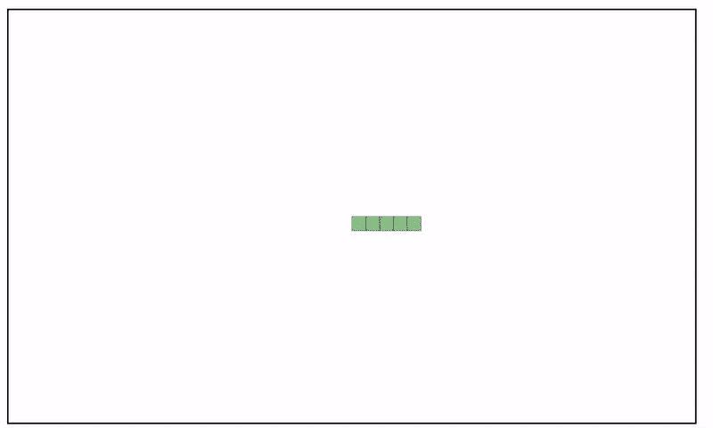

Moving snake across the board

## 在任意位置画水果

为了在棋盘上的任意位置画一个水果，我们将使用`generateRandomPosition`实用函数。让我们来看看这个函数:

```
function randomNumber(min: number, max: number) {
  let random = Math.random() * max;
  return random - (random % 20);
}
export const generateRandomPosition = (width: number, height: number) => {
  return {
    x: randomNumber(0, width),
    y: randomNumber(0, height),
  };
};
```

Generate random x and y coordinates on the board

这是一个函数，将产生随机的 x 和 y 坐标的倍数为 20。这些坐标将总是小于板的宽度和高度。它接受`width`和`height`作为参数。

一旦我们有了这个函数，我们就可以用它在棋盘的任意位置画出水果。

首先，让我们创建一个状态变量`pos`，它最初由一些随机位置组成。

```
const [pos, setPos] = useState<IObjectBody>(generateRandomPosition(width - 20, height - 20));
```

Generate random coordinates state variable

然后，我们将通过我们的`drawObject`函数来绘制水果。之后，我们将稍微更新一下我们的`useEffect`钩子:

```
 useEffect(() => {
        //Draw on canvas each time
        setContext(canvasRef.current &&   canvasRef.current.getContext("2d")); //store in state variable

        clearBoard(context);

        drawObject(context, snake1, "#91C483"); //Draws snake at the required position

        drawObject(context, [pos], "#676FA3"); //Draws object randomly
    }, [context]);
```

Draws fruit randomly along with snake

完成更改后，我们的评估板将如下所示:

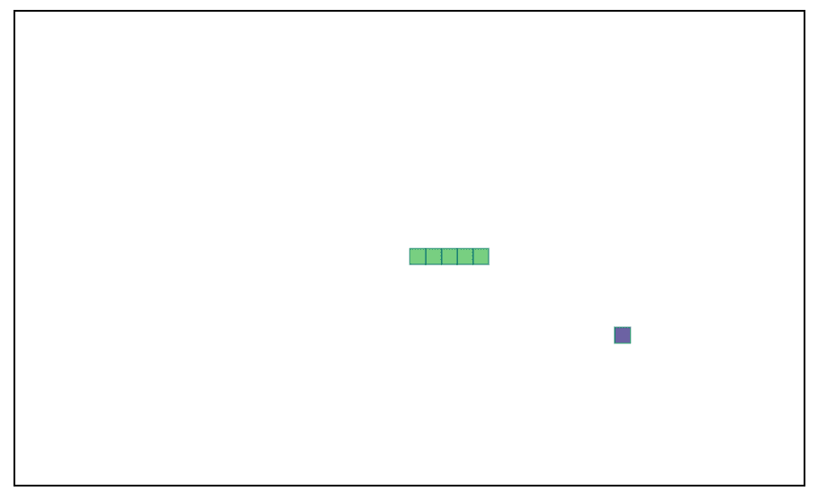

Snake and fruit drawn on the board

## 分数计算器

游戏分数是根据蛇在不与自己或盒子边界碰撞的情况下吃掉了多少水果来计算的。如果蛇吃了水果，那么蛇的大小就会增加。如果它撞上了盒子的边缘，那么游戏就结束了。

现在我们知道了计算分数的标准，让我们看看如何计算奖励。

### 计算奖励

蛇吃掉果实后的奖励如下:

1.  增加蛇的大小。
2.  提高分数。
3.  将新水果放在不同的随机位置。

如果蛇吃了水果，那么我们必须增加蛇的尺寸。这是一个非常简单的任务，我们可以添加新的 x 和 y 坐标，它们距离`snake`全局状态数组的最后一个元素不到 20。例如，如果蛇具有以下坐标:

```
{
snake: [
    { x: 580, y: 300 },
    { x: 560, y: 300 },
    { x: 540, y: 300 },
    { x: 520, y: 300 },
    { x: 500, y: 300 },
  ],
}
```

我们应该简单地将下面的对象添加到 snake 数组中:`{ x: 480, y: 280 }`

这样，我们增加了蛇的大小，并在它的末端添加了新的部分/块。为了通过 Redux 和 redux-saga 实现这一点，我们将需要以下动作和动作创建器:

```
export const INCREMENT_SCORE = "INCREMENT_SCORE"; //action

export const increaseSnake = () => ({  //action creator
    type: INCREASE_SNAKE
  });
```

我们也将更新我们的`gameReducer`来适应这些变化。我们将添加以下案例:

```
case INCREASE_SNAKE:
      const snakeLen = state.snake.length;
      return {
        ...state,
        snake: [
          ...state.snake,
          {
            x: state.snake[snakeLen - 1].x - 20,
            y: state.snake[snakeLen - 1].y - 20,
          },
        ],
      };
```

在我们的`CanvasBoard`组件中，我们将首先引入一个名为`isConsumed`的状态变量。这个变量将检查水果是否被消费。

```
const [isConsumed, setIsConsumed] = useState<boolean>(false);
```

在我们的`useEffect`钩子中，我们正在绘制我们的`snake`和正下方的`fruit`，我们将添加以下条件:

```
//When the object is consumed
    if (snake1[0].x === pos?.x && snake1[0].y === pos?.y) {
      setIsConsumed(true);
    }
```

上面的条件会检查蛇头`snake[0]`是否等于`pos`，或者水果的位置。如果为真，那么它将把`isConsumed`状态变量设置为真。

一旦水果被吃掉，我们需要增加蛇的大小。我们可以通过另一个`useEffect`轻松做到这一点。让我们创建另一个`useEffect`并将动作创建者称为`increaseSnake`:

```
//useEffect2
useEffect(() => {
    if (isConsumed) {
      //Increase snake size when object is consumed successfully
      dispatch(increaseSnake());
    }
  }, [isConsumed]);
```

现在，我们已经增加了蛇的大小，让我们看看如何更新分数，并在另一个随机位置生成一个新的水果。

为了在另一个随机位置生成一个新的水果，我们更新了`pos`状态变量，该变量将重新运行 useEffect1 并在`pos`绘制对象。我们应该用一个新的依赖项`pos`来更新我们的 useEffect1，并更新 useEffect2，如下所示:

```
useEffect(() => {
    //Generate new object
    if (isConsumed) {
      const posi = generateRandomPosition(width - 20, height - 20);
      setPos(posi);
      setIsConsumed(false);

      //Increase snake size when object is consumed successfully
      dispatch(increaseSnake());
    }
  }, [isConsumed, pos, height, width, dispatch]);
```

这个奖励系统中剩下的最后一件事是在蛇每次吃水果时更新分数。为此，请遵循以下步骤:

1.  引入一个新的全局状态变量`score`。在下面的`reducers/index.ts`文件中更新我们的全局状态:

```
export interface IGlobalState {
  snake: ISnakeCoord[] | [];
  disallowedDirection: string;
  score: number;
}

const globalState: IGlobalState = {
  snake: [
    { x: 580, y: 300 },
    { x: 560, y: 300 },
    { x: 540, y: 300 },
    { x: 520, y: 300 },
    { x: 500, y: 300 },
  ],
  disallowedDirection: "",
  score: 0,
};
```

2.在我们的`actions/index.ts`文件中创建以下动作和动作创建者:

```
export const INCREMENT_SCORE = "INCREMENT_SCORE"; //action

//action creator:
export const scoreUpdates = (type: string) => ({
  type
});
```

3.接下来，更新我们的减速器来处理`INCREMENT_SCORE`动作。这将简单地将全局状态`score`加 1。

```
case INCREMENT_SCORE:
      return {
        ...state,
        score: state.score + 1,
      };
```

4.然后，我们更新我们的分数状态，每次 snake 抓到水果时都调度`INCREMENT_SCORE`动作。为此，我们可以如下更新我们的 useEffect2:

```
useEffect(() => {
    //Generate new object
    if (isConsumed) {
      const posi = generateRandomPosition(width - 20, height - 20);
      setPos(posi);
      setIsConsumed(false);

      //Increase snake size when object is consumed successfully
      dispatch(increaseSnake());

      //Increment the score
      dispatch(scoreUpdates(INCREMENT_SCORE));
    }
  }, [isConsumed, pos, height, width, dispatch]);
```

5.最后，我们创建一个名为`ScoreCard`的组件。这将显示玩家当前的分数。我们将把它存储在文件`components/ScoreCard.tsx`中。

```
import { Heading } from "@chakra-ui/react";
import { useSelector } from "react-redux";
import { IGlobalState } from "../store/reducers";

const ScoreCard = () => {
    const score = useSelector((state: IGlobalState) => state.score);
    return (
        <Heading as="h2" size="md" mt={5} mb={5}>Current Score: {score}</Heading>
    );
}

export default ScoreCard;
```

在这之后，我们还应该将`ScoreCard`组件添加到`App.tsx`文件中，以便在我们的页面上显示它。

```
import { ChakraProvider, Container, Heading } from "@chakra-ui/react";
import { Provider } from "react-redux";
import CanvasBoard from "./components/CanvasBoard";
import ScoreCard from "./components/ScoreCard";
import store from "./store";

const App = () => {
  return (
    <Provider store={store}>
      <ChakraProvider>
        <Container maxW="container.lg" centerContent>
          <Heading as="h1" size="xl">SNAKE GAME</Heading>
          <ScoreCard />
          <CanvasBoard height={600} width={1000} />
        </Container>
      </ChakraProvider>
    </Provider>
  );
};

export default App;
```

一旦一切就绪，我们的蛇将有一个完整的奖励系统，增加蛇的大小来更新分数。

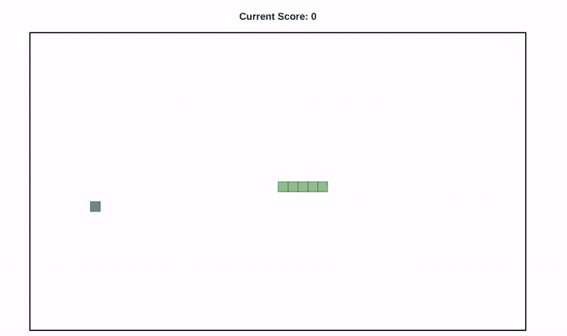

Player playing snake with updating score and snake length.

### 冲突检出

在这一节中，我们将看看如何为我们的贪吃蛇游戏实现碰撞检测。

在我们的贪吃蛇游戏中，如果检测到碰撞，那么游戏就结束了——也就是说，游戏停止了。发生碰撞有两种情况:

1.  Snake 与盒子的边界冲突，或者
2.  蛇与自己相撞。

我们来看看第一个条件。假设蛇头接触到盒子的边界。在这种情况下，我们将立即停止游戏。

为了将这一点融入到我们的游戏中，我们需要做如下工作:

1.  创建操作和操作创建者，如下所示:

```
export const STOP_GAME = "STOP_GAME"; //action

//action creator
export const stopGame = () => ({
  type: STOP_GAME
});
```

2.我们还需要更新我们的`sagas/index.ts`文件。我们将确保一旦遇到`STOP_GAME`动作，saga 停止分派动作。

```
export function* moveSaga(params: {
  type: string;
  payload: ISnakeCoord;
}): Generator<
  | PutEffect<{ type: string; payload: ISnakeCoord }>
  | PutEffect<{ type: string; payload: string }>
  | CallEffect<true>
> {
  while (params.type !== STOP_GAME) {
    yield put({
      type: params.type.split("_")[1],
      payload: params.payload,
    });
    switch (params.type.split("_")[1]) {
      case RIGHT:
        yield put(setDisDirection(LEFT));
        break;

      case LEFT:
        yield put(setDisDirection(RIGHT));
        break;

      case UP:
        yield put(setDisDirection(DOWN));
        break;

      case DOWN:
        yield put(setDisDirection(UP));
        break;
    }
    yield delay(100);
  }
}

function* watcherSagas() {
  yield takeLatest(
    [MOVE_RIGHT, MOVE_LEFT, MOVE_UP, MOVE_DOWN, STOP_GAME],
    moveSaga
  );
}
```

3.最后，我们需要通过添加以下条件来更新 useEffect1:

```
if ( //Checks if the snake head is out of the boundries of the obox
      snake1[0].x >= width ||
      snake1[0].x <= 0 ||
      snake1[0].y <= 0 ||
      snake1[0].y >= height
    ) {
      setGameEnded(true);
      dispatch(stopGame());
      window.removeEventListener("keypress", handleKeyEvents);
    }
```

我们还删除了事件监听器`handleKeyEvents`。这将确保一旦游戏结束，玩家不能移动蛇。

最后，我们来看看如何检测蛇的自撞。我们将使用一个名为`hasSnakeCollided`的实用函数。它接受两个参数:第一个是蛇数组，第二个是蛇的头部。如果蛇头接触到自身的任何部分，那么它返回 true，否则返回 false。

`hasSnakeCollided`函数如下所示:

```
export const hasSnakeCollided = (
  snake: IObjectBody[],
  currentHeadPos: IObjectBody
) => {
  let flag = false;
  snake.forEach((pos: IObjectBody, index: number) => {
    if (
      pos.x === currentHeadPos.x &&
      pos.y === currentHeadPos.y &&
      index !== 0
    ) {
      flag = true;
    }
  });

  return flag;
};
```

我们可能需要通过更新碰撞检测条件来更新我们的 useEffect1，如下所示:

```
if (  
      //Checks if the snake has collided with itself 
      hasSnakeCollided(snake1, snake1[0]) ||

      //Checks if the snake head is out of the boundries of the obox
      snake1[0].x >= width ||
      snake1[0].x <= 0 ||
      snake1[0].y <= 0 ||
      snake1[0].y >= height
    ) {
      setGameEnded(true);
      dispatch(stopGame());
      window.removeEventListener("keypress", handleKeyEvents);
    }
```

我们的 useEffect1 最终将如下所示:

```
//useEffect1
useEffect(() => {
    //Draw on canvas each time
    setContext(canvasRef.current && canvasRef.current.getContext("2d"));
    clearBoard(context);
    drawObject(context, snake1, "#91C483");
    drawObject(context, [pos], "#676FA3"); //Draws object randomly

    //When the object is consumed
    if (snake1[0].x === pos?.x && snake1[0].y === pos?.y) {
      setIsConsumed(true);
    }

    if (
      hasSnakeCollided(snake1, snake1[0]) ||
      snake1[0].x >= width ||
      snake1[0].x <= 0 ||
      snake1[0].y <= 0 ||
      snake1[0].y >= height
    ) {
      setGameEnded(true);
      dispatch(stopGame());
      window.removeEventListener("keypress", handleKeyEvents);
    } else setGameEnded(false);
  }, [context, pos, snake1, height, width, dispatch, handleKeyEvents]);
```

一旦我们添加了碰撞检测系统，我们的游戏将如下所示:

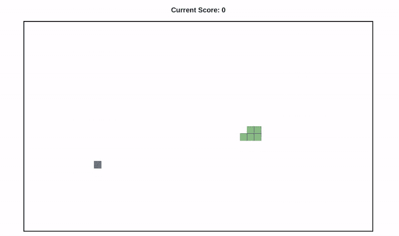

Collision detection

## 指令组件

我们现在处于最后阶段了！我们最后的组件将是`Instruction`组件。它将包括关于游戏的说明，如初始游戏条件，使用的键，和一个重置按钮。

让我们首先创建一个名为`components/Instructions.tsx`的文件。将以下代码放在该文件中:

```
import { Box, Button, Flex, Heading, Kbd } from "@chakra-ui/react";

export interface IInstructionProps {
  resetBoard: () => void;
}
const Instruction = ({ resetBoard }: IInstructionProps) => (
  <Box mt={3}>
    <Heading as="h6" size="lg">
      How to Play
    </Heading>
    <Heading as="h5" size="sm" mt={1}>
    NOTE: Start the game by pressing <Kbd>d</Kbd>
    </Heading>
    <Flex flexDirection="row" mt={3}>
      <Flex flexDirection={"column"}>
        <span>
          <Kbd>w</Kbd> Move Up
        </span>
        <span>
          <Kbd>a</Kbd> Move Left
        </span>
        <span>
          <Kbd>s</Kbd> Move Down
        </span>
        <span>
          <Kbd>d</Kbd> Move Right
        </span>
      </Flex>
      <Flex flexDirection="column">
        <Button onClick={() => resetBoard()}>Reset game</Button>
      </Flex>
    </Flex>
  </Box>
);

export default Instruction; 
```

`Instruction`组件将接受`resetBoard`作为道具，这是一个在游戏结束或当用户想要重置游戏时帮助用户的功能。

在我们深入研究`resetBoard`函数之前，我们需要对 Redux 商店和 saga 进行以下更新:

1.  在`actions/index.ts`文件中添加以下动作和动作创建者:

```
export const RESET_SCORE = "RESET_SCORE"; //action
export const RESET = "RESET"; //action

//Action creator:
export const resetGame = () => ({
  type: RESET
});
```

2.然后把下面的条件加到我们的`sagas/index.ts`里。我们将确保一旦遇到`RESET`和`STOP_GAME`动作，saga 将停止调度动作。

```
export function* moveSaga(params: {
  type: string;
  payload: ISnakeCoord;
}): Generator<
  | PutEffect<{ type: string; payload: ISnakeCoord }>
  | PutEffect<{ type: string; payload: string }>
  | CallEffect<true>
> {
  while (params.type !== RESET && params.type !== STOP_GAME) {
    yield put({
      type: params.type.split("_")[1],
      payload: params.payload,
    });
    switch (params.type.split("_")[1]) {
      case RIGHT:
        yield put(setDisDirection(LEFT));
        break;

      case LEFT:
        yield put(setDisDirection(RIGHT));
        break;

      case UP:
        yield put(setDisDirection(DOWN));
        break;

      case DOWN:
        yield put(setDisDirection(UP));
        break;
    }
    yield delay(100);
  }
}

function* watcherSagas() {
  yield takeLatest(
    [MOVE_RIGHT, MOVE_LEFT, MOVE_UP, MOVE_DOWN, RESET, STOP_GAME],
    moveSaga
  );
}
```

3.最后，我们更新`RESET_SCORE`案例的`reducers/index.ts`文件，如下所示:

```
case RESET_SCORE:
      return { ...state, score: 0 };
```

一旦我们的 sagas 和 reducers 被更新，我们可以看看`resetBoard`回调将执行什么操作。

`resetBoard`功能执行以下操作:

1.  移除事件监听器`handleKeyEvents`
2.  分派重置游戏所需的动作。
3.  调度重置分数的操作。
4.  清除画布。
5.  在初始位置再次绘制蛇
6.  在新的随机位置绘制水果。
7.  最后，为`keypress`事件添加事件监听器`handleKeyEvents`。

下面是我们的`resetBoard`函数的样子:

```
const resetBoard = useCallback(() => {
    window.removeEventListener("keypress", handleKeyEvents);
    dispatch(resetGame());
    dispatch(scoreUpdates(RESET_SCORE));
    clearBoard(context);
    drawObject(context, snake1, "#91C483");
    drawObject(
      context,
      [generateRandomPosition(width - 20, height - 20)],
      "#676FA3"
    ); //Draws object randomly
    window.addEventListener("keypress", handleKeyEvents);
  }, [context, dispatch, handleKeyEvents, height, snake1, width]);
```

您应该将这个函数放在`CanvasBoard`组件中，并将`resetBoard`函数作为道具传递给`Instruction`函数，如下所示:

```
<>
      <canvas
        ref={canvasRef}
        style={{
          border: `3px solid ${gameEnded ? "red" : "black"}`,
        }}
        width={width}
        height={height}
      />
      <Instruction resetBoard={resetBoard} />
    </>
```

一旦放置完毕，我们将有如下所示的指令组件设置:

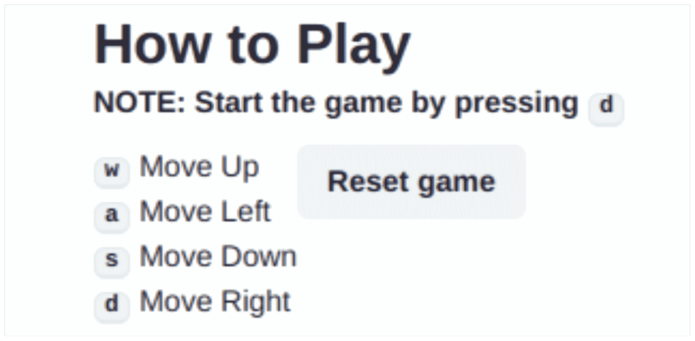

Instructions with reset button

## 决胜比赛

如果你已经了解了这一点，那么恭喜你！你已经成功地用 React、Redux 和 redux-sagas 创建了一个有趣的蛇游戏。一旦所有这些东西都连接起来，你的游戏将会如下图所示:


The complete snake game

## 摘要

这就是你如何从头开始构建一个贪吃蛇游戏。你可以在下面的资源库中找到游戏的完整源代码:

[https://github.com/keyurparalkar/snake-game](https://github.com/keyurparalkar/snake-game)

如果你喜欢从零开始构建自己的贪吃蛇游戏，那么你可以通过构建这些增强功能来将它提升一个档次:

*   用 three.js 构建贪吃蛇游戏
*   添加在线评分板

感谢您的阅读！

在 [Twitter](https://twitter.com/keurplkar) 、 [GitHub](https://github.com/keyurparalkar) 和 [LinkedIn](https://www.linkedin.com/in/keyur-paralkar-494415107/) 上关注我。