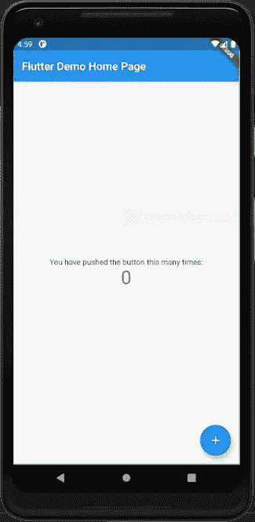
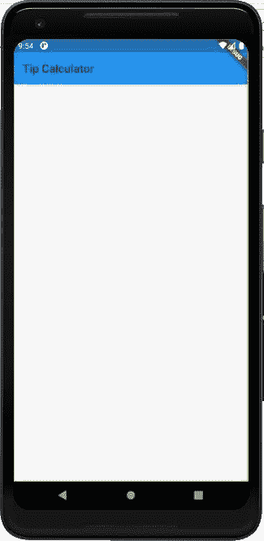
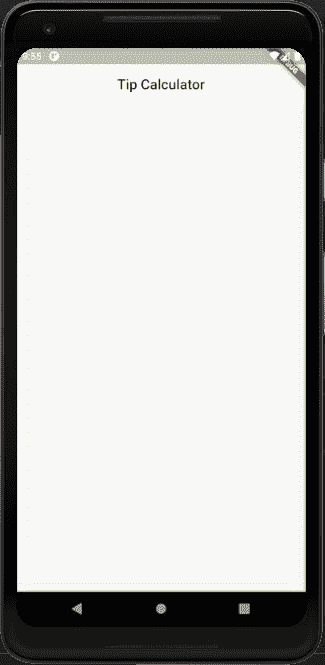
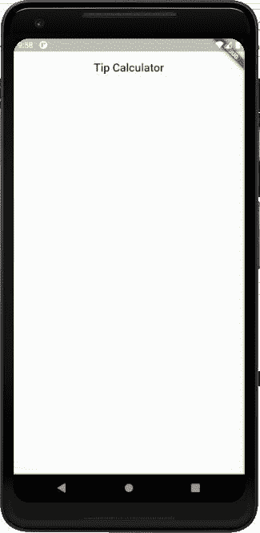
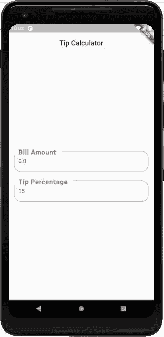
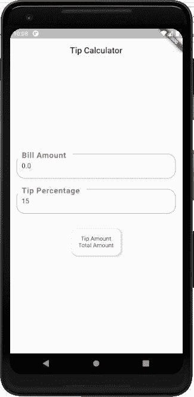
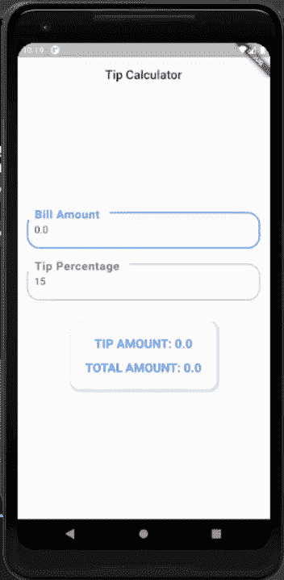

# 如何使用 Flutter 构建小费计算器

> 原文：<https://www.freecodecamp.org/news/build-a-tip-calculator-with-flutter/>

### 

随着 Flutter 移动应用程序开发框架变得越来越流行，许多企业都选择在他们的项目中使用它。

许多开发人员欣赏它使用简单的小部件结构开发具有完美用户界面的应用程序的能力。我认为 Flutter 是移动应用程序开发的未来，因为它在开发 ui 方面非常简单，并且能够使用 Dart 编程语言支持功能逻辑。

本教程主要通过构建一个简单的 Tip Calculator 应用程序，向您传授 Flutter 框架的基础知识。我们将介绍标准的编码模式，包括有状态和无状态的小部件类，以及一些在 Flutter 应用程序开发中最常用的小部件。

这里的想法是从建立一个初始颤振项目开始。然后，我们将继续实现整体 UI 和基本功能。

所以，让我们开始吧！

## 如何建立你的颤振项目

为了创建一个新的 Flutter 项目，您必须在您的系统上安装 Flutter SDK。对于简单快速的安装过程，你可以遵循官方的[颤振文档](https://flutter.dev/docs/get-started/install)。

请记住，如果您正在为 Android 平台开发应用程序，它还需要 Android Studio 和 Android SDK。

在按照文档成功设置好一切之后，您可以继续在终端中运行以下 Flutter 命令:

```
flutter create tipCalculator 
```

这个命令会自动下载并设置你的 starter Flutter 项目。现在，您可以在 Visual Studio 代码 IDE 中打开该项目。

如果您连接了设备模拟器或实际的智能手机设备，那么您只需运行以下命令即可启动该应用程序:

```
flutter run 
```

或者，您可以按键盘上的“F5 ”,这将触发 VSCode 中的菜单选项。从该菜单中，您可以选择要在其中启动应用程序的设备。

> 注意，您必须在扩展名为**的文件中。dart** 成功运行该命令。

使用上面的命令或 **F5** 构建并运行它，以在您的仿真器/实际设备中获得以下 starter 模板:



现在，您应该已经启动并运行了您的 Flutter 应用程序。

让我们更详细地了解一下主项目文件 **main.dart** 中发生了什么。

在 **main.dart** 文件中，我们有两个类对象。一个扩展到有状态小部件，另一个扩展到无状态小部件。这意味着什么呢？

*   有状态小部件:存放应用程序状态的类。状态可以改变并触发这个有状态小部件类中的小部件的呈现。它有助于动态状态变化。
*   无状态小部件:这个类不包含任何状态。它表示不变的小部件视图。它不会导致任何动态状态变化。

main.dart 文件还包含调用`runApp`方法中的`MyApp`类的`main()`函数，以便触发设备中 Flutter 应用程序的启动。

## 如何构建小费计算器的用户界面

为了开始实现我们的 UI，我们需要清除默认情况下出现在`MyHomePageState`类中的所有东西。

清除之后，我们将从构建函数中返回一个简单的`Scaffold`小部件。

`Scaffold`小部件提供了添加`appBar`和`body`的属性。现在，我们将添加一个简单的应用程序栏。您可以在下面的代码片段中看到整体实现:

```
class _MyHomePageState extends State<MyHomePage> {

  @override
  Widget build(BuildContext context) {
    return Scaffold(
      appBar: AppBar(
        title:Text('Tip Calculator', style: TextStyle(color: Colors.black87),),
      ),
      body: Container()
    );
  }
} 
```

使用带有`title`属性的`AppBar`小部件添加`appBar`后，构建并运行它。您将在模拟器屏幕中获得以下结果:



> 注意，Flutter 在保存 Dart 文件时有**热重装**。因此，每当您在项目的 Dart 文件中保存任何更改时，这些更改都会自动反映在模拟器中。

### **第一步:设计应用栏**

这里，我们将使用它提供的各种属性来修改`AppBar`小部件。您可以在下面的代码片段中看到修改后的代码:

```
appBar: AppBar(
  title: Text('Tip Calculator', style: TextStyle(color: Colors.black87),),
  centerTitle: true,
  elevation: 0.0,
  backgroundColor: Colors.white70,
), 
```

构建并运行它，您将在模拟器屏幕中获得以下结果:



这里，我们使用了一些基本的`AppBar`小部件属性，例如

*   `elevation`，使我们能够控制类似于 z-index 的 App 栏中的阴影效果，
*   `centerTitle`为了集中标题，
*   我们还把背景颜色改成了白色。

### **第二步:设计架体**

到目前为止，我们在`body`属性中只有一个空的`Container`小部件。现在，我们将向`Container`小部件添加一些属性和子小部件，如下面的代码片段所示:

```
body: Container(
  color: Colors.white70,
  padding: const EdgeInsets.all(16.0),
  child: Center(
    child: Form(
      child: Column(
        mainAxisAlignment: MainAxisAlignment.center,
        children: <Widget>[
        ],
      ),
    ),
  ), 
```

构建并运行它，您将在模拟器屏幕中获得以下结果:



正如你在上面的截图中看到的，我们已经将机身背景颜色改为白色。此外，我们还添加了一些`padding`和`Center`小部件作为子小部件，将整个 UI 集中在主体中。

`Center`小部件有一个`Form`小部件(它的一个子部件),我们将为它创建一个带有文本字段的简单表单。

最重要的是，我们将`Column`小部件作为`Form`的子小部件。`Column`小部件为我们提供了`children`小部件数组属性，我们可以在其中集成任意数量的小部件，这些小部件将垂直显示在屏幕上。

### **第三步:定义常量和变量**

在实现表单元素(包括文本字段)之前，我们需要定义一些常量来处理来自输入字段的输入。

您可以在下面的代码片段中看到所需的常量和变量:

```
// This is the default bill amount
  static const defaultBillAmount = 0.0;

  // This is the default tip percentage
  static const defaultTipPercentage = 15;

  // This is the TextEditingController which is used to keep track of the change in bill amount
  final _billAmountController =
      TextEditingController(text: defaultBillAmount.toString());

  // This is the TextEditingController which is used to keep track of the change in tip percentage
  final _tipPercentageController =
      TextEditingController(text: defaultTipPercentage.toString());

  // This stores the latest value of bill amount calculated
  double _billAmount = defaultBillAmount;

  // This stores the latest value of tip percentage calculated
  int _tipPercentage = defaultTipPercentage; 
```

在上面的代码片段中，您可以看到我们正在使用`TextEditingController`方法。这个控制器方法允许我们稍后处理被初始化为默认值的`TextFormField`小部件中的文本输入。

### **第四步:添加输入表单字段**

现在，我们将使用`TextFormField`小部件添加两个输入表单字段。

在使用这个小部件时，我们需要用我们之前定义的控制器变量强制分配控制器属性。您可以在下面的代码片段中看到小部件的整体编码实现:

```
body: Container(
        color: Colors.white70,
        padding: const EdgeInsets.all(16.0),
        child: Center(
          child: Form(
            child: Column(
              mainAxisAlignment: MainAxisAlignment.center,
              children: <Widget>[
                TextFormField(
                  key: Key("billAmount"),
                  controller: _billAmountController,
                  keyboardType: TextInputType.numberWithOptions(decimal: true),
                  decoration: InputDecoration(
                      hintText: 'Enter the Bill Amount',
                      labelText: 'Bill Amount',
                      labelStyle: TextStyle(
                        fontSize: 25,
                        letterSpacing: 1,
                        fontWeight: FontWeight.bold
                      ),
                      fillColor: Colors.white,
                      border: new OutlineInputBorder(
                        borderRadius: new BorderRadius.circular(20.0),
                      ),
                    ),
                ),
                SizedBox(height: 25,),
                TextFormField(
                  key: Key("tipPercentage"),
                  controller: _tipPercentageController,
                  keyboardType: TextInputType.number,
                  decoration: InputDecoration(
                    hintText: 'Enter the Tip Percentage',
                    labelText: 'Tip Percentage',
                    labelStyle: TextStyle(
                      fontSize: 25,
                      letterSpacing: 1,
                      fontWeight: FontWeight.bold
                    ),
                    fillColor: Colors.white,
                    border: new OutlineInputBorder(
                      borderRadius: new BorderRadius.circular(20.0),
                    ),
                  ),
                ),
              ],
            ),
          ),
        ),
      ), 
```

在这里，我们分配了`keyboardType`属性，使我们能够在用户点击输入字段时显示所需的键盘类型。

我们还拥有装饰属性，通过这些属性，我们可以使用`InputDecoration`小部件来设计输入字段的样式。

在`InputDecoration`小部件中，我们有几个属性帮助我们显示占位符文本以及输入上方的标签。我们还应用了`border`属性来显示弯曲的轮廓边框。

构建并运行它，您将在模拟器屏幕中获得以下结果:



### **第五步:添加事件监听器和函数**

因为我们将在用户输入账单金额或百分比后立即计算小费金额，所以我们需要监听文本输入字段中的变化。

为此，我们需要使用`addListener`方法向控制器添加事件监听器。

现在，一旦输入字段发生任何变化，我们还希望触发某个函数来更新账单金额和小费百分比。

为此，我们将使用所需的函数和`setState`方法，一旦发生一些变化，它们将帮助我们呈现整个 UI。

> 注意，`setState`方法触发了`build`方法的重新运行。

您可以在下面的代码片段中看到整体的编码实现:

```
@override
void initState() {
  super.initState();
  _billAmountController.addListener(_onBillAmountChanged);
  _tipPercentageController.addListener(_onTipAmountChanged);
}

_onBillAmountChanged() {
  setState(() {
    _billAmount = double.tryParse(_billAmountController.text) ?? 0.0;
  });
}

_onTipAmountChanged() {
  setState(() {
    _tipPercentage = int.tryParse(_tipPercentageController.text) ?? 0;
  });
} 
```

这里，我们也有`initState`方法。我们一进入应用程序的这个屏幕，这个方法就开始运行。所以我们一进入屏幕就添加事件监听器。

### **第 6 步:添加金额部分**

现在回到我们的 UI 小部件。我们将在 Column 小部件中输入字段的正下方添加 Amounts 部分。

这里，我们还将使用`SizedBox`小部件，它使我们能够在小部件之间提供一些所需的间距。您可以在下面的代码片段中看到 Amounts 部分的编码实现:

```
),
SizedBox(height: 20,),
Container(
  margin: EdgeInsets.all(15),
  padding: EdgeInsets.all(15),
  decoration: BoxDecoration(
    color: Colors.white,
    borderRadius: BorderRadius.all(
      Radius.circular(15),
    ),
    border: Border.all(color: Colors.white),
    boxShadow: [
      BoxShadow(
        color: Colors.black12,
        offset: Offset(2, 2),
        spreadRadius: 2,
        blurRadius: 1,
      ),
    ],
  ),
  child: Column(
    children: [
      Text("Tip Amount"),
      Text("Total Amount")
    ],
  ),
), 
```

在这里，我们有一个`Container`与一些需要的风格装饰。`child`属性包含另一个`Column`小部件，其中两个`Text`小部件垂直排列。

构建并运行它，您将在模拟器屏幕中获得以下结果:



### **步骤 7:制作一个单独的无状态小部件来显示金额**

因为我们想用一点样式来显示小费的数量和总额。它不包含任何状态，但是依赖于有状态小部件传递的值。

您可以在下面的代码片段中看到`AmountText`无状态小部件类的整体编码实现:

```
class AmountText extends StatelessWidget {
  final String text;

  const AmountText(
    this.text, {
    Key key,
  }) : super(key: key);

  @override
  Widget build(BuildContext context) {
    return Container(
      padding: EdgeInsets.all(8),
      child: Text(text.toUpperCase(),
          style: TextStyle(fontWeight: FontWeight.bold, color: Colors.blueAccent, fontSize: 20)),
    );
  }
} 
```

这里，我们使用了构造函数类来获取要显示的实际文本的值。这个类的构建方法返回带有简单的`padding`的`Container`小部件和作为子小部件的`Text`小部件。

既然我们的`AmountText`小部件已经准备好了，现在我们可以在有状态小部件中调用这个小部件。

我们将在之前用简单的`Text`小部件定义的`Column`小部件中添加小部件。我们只需要用`AmountText`小部件替换文本小部件，并传递所需的文本值。

您可以在下面的代码片段中看到编码实现:

```
Container(
  margin: EdgeInsets.all(15),
  padding: EdgeInsets.all(15),
  decoration: BoxDecoration(
    color: Colors.white,
    borderRadius: BorderRadius.all(
      Radius.circular(15),
    ),
    border: Border.all(color: Colors.white),
    boxShadow: [
      BoxShadow(
        color: Colors.black12,
        offset: Offset(2, 2),
        spreadRadius: 2,
        blurRadius: 1,
      ),
    ],
  ),
  child: Column(
    children: [
      AmountText(
        'Tip Amount: ${_getTipAmount()}',
        key: Key('tipAmount'),
      ),
      AmountText(
        'Total Amount: ${_getTotalAmount()}',
        key: Key('totalAmount'),
      ),
    ],
  ),
), 
```

这里，我们传递了`AmountText`小部件中的函数。该函数返回相应的小费金额和总金额值，如下面的代码片段所示:

```
 _getTipAmount() => _billAmount * _tipPercentage / 100;

  _getTotalAmount() => _billAmount + _getTipAmount(); 
```

最后，我们需要在退出视图时终止控制器。为此，我们需要使用内置的`dispose`函数。该功能在我们退出当前屏幕时运行。

在这个方法中，我们需要用`dispose`方法调用控制器，以便终止输入文本控制器。这将导致控制器停止监听输入字段中的变化。

您可以在下面的代码片段中看到 dispose 函数:

```
@override
void dispose() {
  // To make sure we are not leaking anything, dispose any used TextEditingController
  // when this widget is cleared from memory.
  _billAmountController.dispose();
  _tipPercentageController.dispose();
  super.dispose();
} 
```

构建并运行它，以获得我们实现 Tip Calculator 的最终结果，您可以在下面的演示中看到:



您会注意到，当我们更改输入字段中的输入时，两个金额的值都会发生变化。

我们现在已经到了本教程的结尾。您使用 Flutter 框架和 Dart 成功实现了一个简单的提示计算器。

## 从这里去哪里？

本教程的主要目的是通过构建一个简单的提示计算器，教你在 Flutter 应用程序开发框架中的基本编程模式。

您可以探索更多有趣的小部件和附加功能。你可以改变你的应用程序的用户界面，同时保持功能组件不变。

总的来说，Flutter 使用小部件模式简化了复杂的 UI 设计。您可以简单地创建一个很棒的 UI，只需使用它们的子属性将小部件堆叠在一起。

下一步可能是使用 Flutter 的导航机制来导航到不同的屏幕。Flutter 还简化了自定义抽屉菜单和底部标签的添加。

这只是颤振发展的起点。事情远比看上去的要复杂。我们只需要继续探索和编码。

整个项目的演示可在 [Codepen](https://codepen.io/razorabhu1995/pen/OJXwONm) 中获得。

你可以从已经存在的其他人那里获得你的 [Flutter](http://instaflutter.com) 应用的灵感。

*编码快乐！*