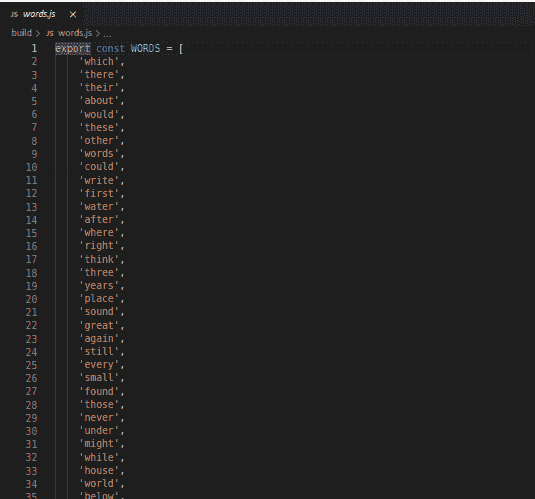
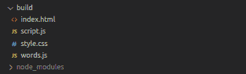
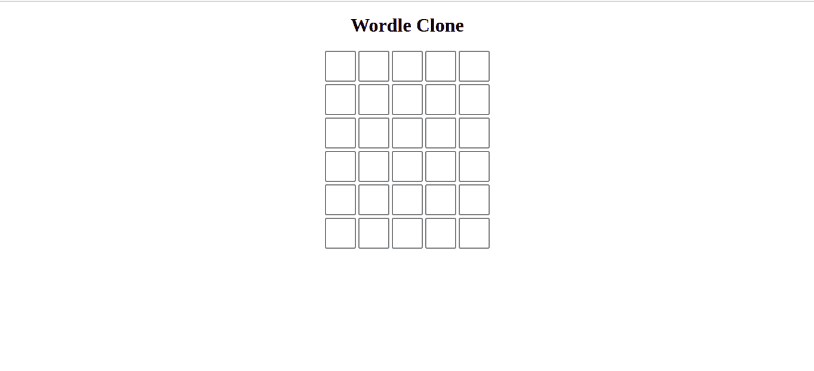
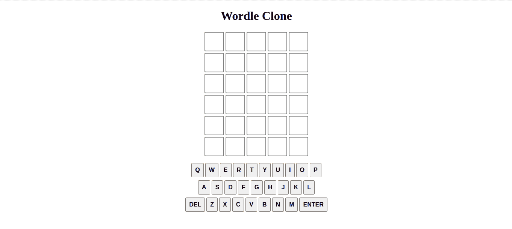

# 如何用 JavaScript 构建一个 Wordle 克隆

> 原文：<https://www.freecodecamp.org/news/build-a-wordle-clone-in-javascript/>

在本文中，您将重新创建猜谜游戏 [Wordle](https://www.nytimes.com/games/wordle/index.html) 。本文涵盖了核心的游戏逻辑，但没有实现分享你的结果。本文也没有介绍生成游戏统计数据的功能。

本教程面向想要构建一个有趣的普通 JavaScript 项目的初级前端开发人员。

你可以点击查看已完成项目[的演示。](https://wordle-clone-drab.vercel.app)

## 先决条件

本教程假设您对以下内容有基本的了解:

*   超文本标记语言
*   半铸钢ˌ钢性铸铁(Cast Semi-Steel)
*   java 描述语言
*   NPM

## 如何构建 Wordle 克隆

以下是构建 Wordle 克隆的步骤:

*   项目设置
*   创建游戏板
*   创建屏幕键盘
*   接受用户输入
*   添加通知
*   使屏幕键盘产生输入
*   添加动画

## 项目设置

在构建游戏之前，你需要准备好一些组件。首先，您需要为我们克隆的所有源代码创建一个文件夹。将此文件夹称为 build。

完成之后，设置您的开发服务器。

### 实时服务器

您将使用一个名为 live-server 的开发服务器。这一步是可选的，但是可以省去每次修改源代码后重新加载页面的麻烦。

通过在终端中键入以下命令来安装 live-server:

```
npm install live-server
```

### HTML 设置

在内部构建，创建一个 HTML 文件，并将其命名为 index.html。将以下代码放入其中:

```
<!DOCTYPE html>
<html lang="en">
<head>
    <meta charset="UTF-8">
    <meta http-equiv="X-UA-Compatible" content="IE=edge">
    <meta name="viewport" content="width=device-width, initial-scale=1.0">
    <title>Wordle</title>
</head>
<body>
    <h1> Wordle Clone </h1>

    <div id="game-board">

    </div>
</body>
</html>
```

HTML 代码为我们的游戏创建了一个标题，并为游戏板制作了容器。

你将使用一个名为 [Toastr](https://github.com/CodeSeven/toastr) 的 JavaScript 库用于游戏内通知，使用一个名为 [Animate.css](https://animate.style) 的 CSS 库用于棋盘动画。

要将它们包含在您的项目中，请将以下链接添加到您的 index.html 文件的文件头。

```
 <link href="https://cdnjs.cloudflare.com/ajax/libs/toastr.js/latest/toastr.min.css" rel="stylesheet"/>

<link
    rel="stylesheet"
		href="https://cdnjs.cloudflare.com/ajax/libs/animate.css/4.1.1/animate.min.css"
  />
```

这些链接将获取 Animate.css 和 Toastr 的 CSS。将以下代码放在 index.html 中，就在结束 body 标记之前:

```
<script
src="https://code.jquery.com/jquery-3.6.0.min.js"
integrity="sha256-/xUj+3OJU5yExlq6GSYGSHk7tPXikynS7ogEvDej/m4="
crossorigin="anonymous"></script>
<script src="https://cdnjs.cloudflare.com/ajax/libs/toastr.js/latest/toastr.min.js"></script> 
```

该代码将获取 Toastr 和 jQuery 的 JavaScript(因为 Toastr 依赖于它)。

### JavaScript 设置

您的 JavaScript 将位于一个名为 script.js 的文件中。

将这段代码放在 script.js 的顶部:

```
import { WORDS } from "./words.js";

const NUMBER_OF_GUESSES = 6;
let guessesRemaining = NUMBER_OF_GUESSES;
let currentGuess = [];
let nextLetter = 0;
let rightGuessString = WORDS[Math.floor(Math.random() * WORDS.length)]
console.log(rightGuessString)
```

这段代码片段初始化了我们将在游戏中使用的全局变量，并从数组`WORDS`中随机选取一个单词作为这一轮的正确猜测。我们还将正确的猜测记录到控制台，以便在必要时调试我们的代码。

我们将使用的允许单词列表将被硬编码并作为数组存储在 words.js 文件中。在 build 内部创建 words.js，并将 JavaScript 从这个[链接](https://github.com/Morgenstern2573/wordle_clone/blob/master/build/words.js)复制到其中。

Words.js 应该是这样的:



what words.js should look like

### CSS 设置

将 CSS 文件命名为 style.css，Style.css 也应该放在 build 中。

```
h1 {
 text-align: center;
}
```

我们唯一需要的 CSS 设置是一点代码来使我们的标题文本居中

### 把所有的放在一起

最后，将 script.js 链接为 index.html 中的一个模块，然后链接 style.css

此时，您的 index.html 应该是这样的:

```
<!DOCTYPE html>
<html lang="en">
<head>
    <meta charset="UTF-8">
    <meta http-equiv="X-UA-Compatible" content="IE=edge">
    <meta name="viewport" content="width=device-width, initial-scale=1.0">
    <title>Wordle</title>
    <link rel="stylesheet" href="style.css">
    <link href="https://cdnjs.cloudflare.com/ajax/libs/toastr.js/latest/toastr.min.css" rel="stylesheet"/>
    <link
    rel="stylesheet"
    href="https://cdnjs.cloudflare.com/ajax/libs/animate.css/4.1.1/animate.min.css"
  />
</head>
<body>
    <h1> Wordle Clone </h1>

    <div id="game-board">

    </div>
<script
src="https://code.jquery.com/jquery-3.6.0.min.js"
integrity="sha256-/xUj+3OJU5yExlq6GSYGSHk7tPXikynS7ogEvDej/m4="
crossorigin="anonymous"></script>
<script src="https://cdnjs.cloudflare.com/ajax/libs/toastr.js/latest/toastr.min.js"></script>
<script src="script.js" type="module"></script>
</body>
</html>
```

您的文件结构应该如下所示:



screenshot of file tree

通过在控制台中键入以下命令启动 live-server:

```
live-server build
```

这就是设置。

## 如何创建游戏板

您将通过编写一个 JavaScript 函数来创建游戏板。让我们调用函数`initBoard`。将此代码添加到 script.js 文件中:

```
function initBoard() {
    let board = document.getElementById("game-board");

    for (let i = 0; i < NUMBER_OF_GUESSES; i++) {
        let row = document.createElement("div")
        row.className = "letter-row"

        for (let j = 0; j < 5; j++) {
            let box = document.createElement("div")
            box.className = "letter-box"
            row.appendChild(box)
        }

        board.appendChild(row)
    }
}

initBoard()
```

那么这段代码是做什么的呢？`initBoard`为我们给用户的每个猜测创建一行，并为每行创建 5 个框。猜测的每个字母都有一个框，函数使它们都成为该行的子元素。

然后将每一行添加到 board 容器中。每一行被赋予类别`letter-row`，每一个盒子被赋予`letter-box`。

接下来，您将使用一些 CSS 来设计电路板的样式。将以下代码放在 style.css 文件中:

```
#game-board {
  display: flex;
  align-items: center;
  flex-direction: column;
}

.letter-box {
  border: 2px solid gray;
  border-radius: 3px;
  margin: 2px;
  font-size: 2.5rem;
  font-weight: 700;
  height: 3rem;
  width: 3rem;
  display: flex;
  justify-content: center;
  align-items: center;
  text-transform: uppercase;
}

.filled-box {
  border: 2px solid black;
}

.letter-row {
  display: flex;
}
```

这个 CSS 做了几件事:

*   将棋盘的行水平和垂直居中
*   为棋盘上的每个方框设置高度、宽度和边框
*   为装满信件的盒子创造独特的外观

此时，当您在浏览器中加载 index.html 时，它应该是这样的:



screenshot of game

## 如何创建屏幕键盘

创建键盘最简单的方法是使用 HTML。将此代码添加到您的 index.html 中，在游戏板 div 之后:

```
 <div id="keyboard-cont">
        <div class="first-row">
            <button class="keyboard-button">q</button>
            <button class="keyboard-button">w</button>
            <button class="keyboard-button">e</button>
            <button class="keyboard-button">r</button>
            <button class="keyboard-button">t</button>
            <button class="keyboard-button">y</button>
            <button class="keyboard-button">u</button>
            <button class="keyboard-button">i</button>
            <button class="keyboard-button">o</button>
            <button class="keyboard-button">p</button>
        </div>
        <div class="second-row">
            <button class="keyboard-button">a</button>
            <button class="keyboard-button">s</button>
            <button class="keyboard-button">d</button>
            <button class="keyboard-button">f</button>
            <button class="keyboard-button">g</button>
            <button class="keyboard-button">h</button>
            <button class="keyboard-button">j</button>
            <button class="keyboard-button">k</button>
            <button class="keyboard-button">l</button>
        </div>
        <div class="third-row">
            <button class="keyboard-button">Del</button>
            <button class="keyboard-button">z</button>
            <button class="keyboard-button">x</button>
            <button class="keyboard-button">c</button>
            <button class="keyboard-button">v</button>
            <button class="keyboard-button">b</button>
            <button class="keyboard-button">n</button>
            <button class="keyboard-button">m</button>
            <button class="keyboard-button">Enter</button>
        </div>
    </div>
```

现在，通过将此 CSS 添加到 style.css 的末尾来设置标记的样式:

```
#keyboard-cont {
  margin: 1rem 0;
  display: flex;
  flex-direction: column;
  align-items: center;
}

#keyboard-cont div {
  display: flex;
}

.second-row {
  margin: 0.5rem 0;
}

.keyboard-button {
  font-size: 1rem;
  font-weight: 700;
  padding: 0.5rem;
  margin: 0 2px;
  cursor: pointer;
  text-transform: uppercase;
} 
```

这是您的 index.html 现在在浏览器中的样子:



screenshot of on-screen keyboard

## 如何接受用户输入

用户输入的策略很简单:当玩家按下键盘上的一个键时，我们希望将该键放在棋盘上的正确位置。您将通过监听 keyup 事件来实现这一点。

当玩家按下一个键时，你想要找出那个键是什么。如果钥匙是一个字母，你要把它放在黑板上正确的位置。

你可以通过检查玩家已经猜了多少次，以及到目前为止玩家已经输入了多少个字母来找出棋盘上正确的位置。

如果按下的键是 Enter 或 Backspace，则检查猜测值或从当前猜测值中删除一个字母。其他我们忽略的键。

将此代码添加到 script.js:

```
 document.addEventListener("keyup", (e) => {

    if (guessesRemaining === 0) {
        return
    }

    let pressedKey = String(e.key)
    if (pressedKey === "Backspace" && nextLetter !== 0) {
        deleteLetter()
        return
    }

    if (pressedKey === "Enter") {
        checkGuess()
        return
    }

    let found = pressedKey.match(/[a-z]/gi)
    if (!found || found.length > 1) {
        return
    } else {
        insertLetter(pressedKey)
    }
})
```

该代码使用一个正则表达式来检查我们按下的键是否是代表单个字母的字母键。如果键的名称没有任何字母(它是一个数字)，或者它有多个字母(Shift，Tab)，我们忽略该事件。否则，我们将字母插入黑板。

### 插入字母

我们来定义一下`insertLetter`函数。看起来是这样的:

```
function insertLetter (pressedKey) {
    if (nextLetter === 5) {
        return
    }
    pressedKey = pressedKey.toLowerCase()

    let row = document.getElementsByClassName("letter-row")[6 - guessesRemaining]
    let box = row.children[nextLetter]
    box.textContent = pressedKey
    box.classList.add("filled-box")
    currentGuess.push(pressedKey)
    nextLetter += 1
}
```

`insertLetter`检查该字母的猜测值中是否还有空间，找到合适的行，并将该字母放入框中。

### 删除一封信

`deleteLetter`看起来是这样的:

```
function deleteLetter () {
    let row = document.getElementsByClassName("letter-row")[6 - guessesRemaining]
    let box = row.children[nextLetter - 1]
    box.textContent = ""
    box.classList.remove("filled-box")
    currentGuess.pop()
    nextLetter -= 1
}
```

获取正确的行，找到最后一个盒子并清空它，然后重置 nextLetter 计数器。

### 猜猜看

`checkGuess`函数看起来像这样:

```
function checkGuess () {
    let row = document.getElementsByClassName("letter-row")[6 - guessesRemaining]
    let guessString = ''
    let rightGuess = Array.from(rightGuessString)

    for (const val of currentGuess) {
        guessString += val
    }

    if (guessString.length != 5) {
        alert("Not enough letters!")
        return
    }

    if (!WORDS.includes(guessString)) {
        alert("Word not in list!")
        return
    }

    for (let i = 0; i < 5; i++) {
        let letterColor = ''
        let box = row.children[i]
        let letter = currentGuess[i]

        let letterPosition = rightGuess.indexOf(currentGuess[i])
        // is letter in the correct guess
        if (letterPosition === -1) {
            letterColor = 'grey'
        } else {
            // now, letter is definitely in word
            // if letter index and right guess index are the same
            // letter is in the right position 
            if (currentGuess[i] === rightGuess[i]) {
                // shade green 
                letterColor = 'green'
            } else {
                // shade box yellow
                letterColor = 'yellow'
            }

            rightGuess[letterPosition] = "#"
        }

        let delay = 250 * i
        setTimeout(()=> {
            //shade box
            box.style.backgroundColor = letterColor
            shadeKeyBoard(letter, letterColor)
        }, delay)
    }

    if (guessString === rightGuessString) {
        alert("You guessed right! Game over!")
        guessesRemaining = 0
        return
    } else {
        guessesRemaining -= 1;
        currentGuess = [];
        nextLetter = 0;

        if (guessesRemaining === 0) {
            alert("You've run out of guesses! Game over!")
            alert(`The right word was: "${rightGuessString}"`)
        }
    }
}
```

很长，所以让我们把它分解一下。它做了几件事:

*   确保猜测是 5 个字母
*   确保猜测是有效的列表
*   检查单词的每个字母并给它们加阴影
*   告诉用户游戏结束了

`checkGuess`使用简单的算法来决定每个字母的颜色:

1.  检查字母的单词是否正确
2.  如果该字母不在单词中，则用灰色显示该字母
3.  如果字母在单词中，检查它是否在正确的位置
4.  如果字母在正确的位置，会变成绿色
5.  否则，阴影为黄色

`checkGuess`使用一个函数`shadeKeyboard`来给屏幕键盘的按键上色，但是它还没有被定义。让我们接下来做那件事。

### shadeKeyboard

```
function shadeKeyBoard(letter, color) {
    for (const elem of document.getElementsByClassName("keyboard-button")) {
        if (elem.textContent === letter) {
            let oldColor = elem.style.backgroundColor
            if (oldColor === 'green') {
                return
            } 

            if (oldColor === 'yellow' && color !== 'green') {
                return
            }

            elem.style.backgroundColor = color
            break
        }
    }
}
```

`shadeKeyBoard`在屏幕键盘上接收我们想要着色的字母和我们想要着色的颜色。算法是这样的:

1.  找到与给定字母相匹配的键
2.  如果钥匙已经是绿色的，什么也不要做
3.  如果键当前是黄色的，只允许它变成绿色
4.  否则，遮蔽传递给函数的键

## 如何添加通知

接下来，您将使用 Toastr 将`checkGuess`中的 JavaScript 警告替换为 toast。

检查`checkGuess`，用对`toastr.error()`的调用替换所有通知用户错误的警告。

通知用户正确猜测的警告应该替换为`toastr.success()`，告诉用户正确猜测的警告应该替换为`toastr.info()`。

完成后，checkGuess 应该是这样的:

```
function checkGuess () {
    let row = document.getElementsByClassName("letter-row")[6 - guessesRemaining]
    let guessString = ''
    let rightGuess = Array.from(rightGuessString)

    for (const val of currentGuess) {
        guessString += val
    }

    if (guessString.length != 5) {
        toastr.error("Not enough letters!")
        return
    }

    if (!WORDS.includes(guessString)) {
        toastr.error("Word not in list!")
        return
    }

    for (let i = 0; i < 5; i++) {
        let letterColor = ''
        let box = row.children[i]
        let letter = currentGuess[i]

        let letterPosition = rightGuess.indexOf(currentGuess[i])
        // is letter in the correct guess
        if (letterPosition === -1) {
            letterColor = 'grey'
        } else {
            // now, letter is definitely in word
            // if letter index and right guess index are the same
            // letter is in the right position 
            if (currentGuess[i] === rightGuess[i]) {
                // shade green 
                letterColor = 'green'
            } else {
                // shade box yellow
                letterColor = 'yellow'
            }

            rightGuess[letterPosition] = "#"
        }

        let delay = 250 * i
        setTimeout(()=> {
            //shade box
            box.style.backgroundColor = letterColor
            shadeKeyBoard(letter, letterColor)
        }, delay)
    }

    if (guessString === rightGuessString) {
        toastr.success("You guessed right! Game over!")
        guessesRemaining = 0
        return
    } else {
        guessesRemaining -= 1;
        currentGuess = [];
        nextLetter = 0;

        if (guessesRemaining === 0) {
            toastr.error("You've run out of guesses! Game over!")
            toastr.info(`The right word was: "${rightGuessString}"`)
        }
    }
}
```

## 如何让屏幕键盘产生输入

为了让您的屏幕键盘正常工作，您所要做的就是每当您的屏幕键盘上的任何键被单击时，调度一个 key up 事件。为此，请将以下代码添加到 script.js:

```
document.getElementById("keyboard-cont").addEventListener("click", (e) => {
    const target = e.target

    if (!target.classList.contains("keyboard-button")) {
        return
    }
    let key = target.textContent

    if (key === "Del") {
        key = "Backspace"
    } 

    document.dispatchEvent(new KeyboardEvent("keyup", {'key': key}))
})
```

该函数监听键盘容器或其任何子容器(按钮)上的点击。如果点击的元素不是按钮，我们退出函数。否则，我们将分派一个与被点击的键相对应的 key up 事件。

## 如何添加动画

我们已经安装了 animate.css，所以现在让我们编写一个 JavaScript 函数来使用它。

```
const animateCSS = (element, animation, prefix = 'animate__') =>
  // We create a Promise and return it
  new Promise((resolve, reject) => {
    const animationName = `${prefix}${animation}`;
    // const node = document.querySelector(element);
    const node = element
    node.style.setProperty('--animate-duration', '0.3s');

    node.classList.add(`${prefix}animated`, animationName);

    // When the animation ends, we clean the classes and resolve the Promise
    function handleAnimationEnd(event) {
      event.stopPropagation();
      node.classList.remove(`${prefix}animated`, animationName);
      resolve('Animation ended');
    }

    node.addEventListener('animationend', handleAnimationEnd, {once: true});
});
```

这个函数来自于 [Animate.css 主页](https://animate.style#javascript)。它将类应用到动画目标以触发动画，当动画结束时，它会删除它添加的类。

该函数返回一个承诺，允许您执行只需要在动画结束后运行的动作，但是在本教程中您不需要实现它。

现在我们有了一个函数来激活任何元素，让我们来应用它。回到我们的`insertLetter`函数，在我们替换`box`的`textContent`之前添加下面一行:

```
 animateCSS(box, "pulse")
```

这是`insertLetter`现在应该的样子:

```
function insertLetter (pressedKey) {
    if (nextLetter === 5) {
        return
    }
    pressedKey = pressedKey.toLowerCase()

    let row = document.getElementsByClassName("letter-row")[6 - guessesRemaining]
    let box = row.children[nextLetter]
    animateCSS(box, "pulse")
    box.textContent = pressedKey
    box.classList.add("filled-box")
    currentGuess.push(pressedKey)
    nextLetter += 1
}
```

代码告诉`insertLetter`在我们用字母填充盒子之前，快速脉冲每个盒子。

接下来，您希望在检查的同时将猜测的每个字母制作成动画。

回去修改`checkGuess`，像这样:

```
let delay = 250 * i
setTimeout(()=> {
    //flip box
    animateCSS(box, 'flipInX')
    //shade box
    box.style.backgroundColor = letterColor
    shadeKeyBoard(letter, letterColor)
}, delay)
```

这段代码添加了一个动画来垂直翻转每个盒子，就在我们改变颜色之前。

## 结论

本教程到此结束。你刚刚创建了一个沃尔多克隆体，我希望你在这个过程中玩得开心。你可以在这个项目的 [GitHub 库](https://github.com/Morgenstern2573/wordle_clone)中找到完整的代码。

如果你喜欢这篇文章，你可以在我的[这里](https://www.freecodecamp.org/news/p/86e257bb-206c-402b-bbaa-493e4f7f644b/dev.to/morgenstern2573)找到更多我写的东西，或者在[推特](https://twitter.com/apexPaul09)上关注我。