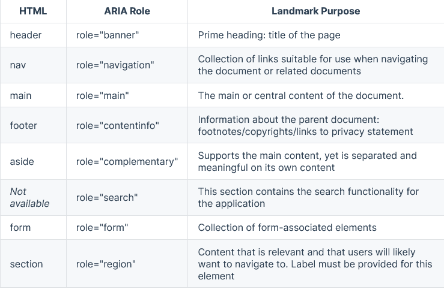
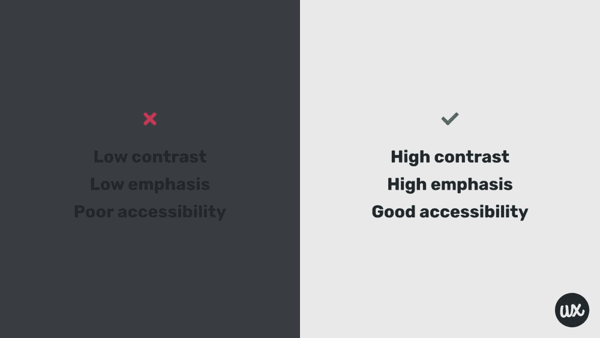
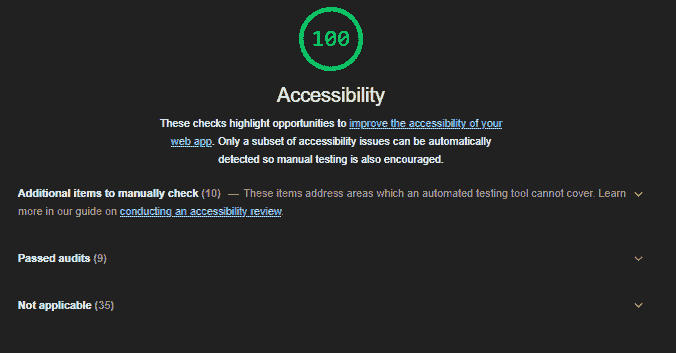

# 如何构建可访问的 Vue 应用

> 原文：<https://www.freecodecamp.org/news/build-accessible-vue-applications/>

开发网页通常需要编写 HTML、CSS 和一些脚本代码，比如 JavaScript 来实现功能。

但是随着时间的推移，我们已经开发了新的更先进的技术和框架来创建网页。我们现在使用像可重用组件、路由和呈现到文档对象模型(DOM)这样的东西。

这些新的框架已经帮助开发人员使 web 可访问性成为他们应用程序不可或缺的一部分。

在本文中，我们将研究 web 可访问性的概念，探索 Vue 应用程序的一些可访问特性，并构建一个包含所有这些可访问特性的演示 Vue 项目。

要阅读本文的教程部分，您应该对 Vue 和 JavaScript 有一些经验。

## 什么是网页可访问性？

网页可访问性是设计和开发网页应用程序和工具的实践，这些应用程序和工具对任何类型的残疾人都是可访问的。

简而言之，网页可访问性意味着让每个人都可以访问网页。网络应该对每个人开放，为用户提供平等的访问，这样每个人都可以体验到网络的全部好处和能力。

使你的 web 应用程序可访问的一个好处是提高你的站点的 SEO(搜索引擎优化)。这样更容易在不同的搜索引擎中找到。

[网页内容可访问性指南(WCAG)](https://www.w3.org/WAI/WCAG21/quickref/) 为网页可访问性提供了一套国际原则。你可以用它来指导你的开发，让所有人都能访问网络。

## 网页可访问性原则

WCAG 由四项原则组成，即所谓的倒:

可感知的

O -可操作的

U -可理解

R -鲁棒

### 让你的网站可感知

可感知原则意味着用户应该能够通过浏览器或辅助技术(如屏幕阅读器)使用一种或多种感官(视觉、触觉和听觉)来识别内容并与界面交互。

### 让你的网站可操作

使您的站点可操作意味着用户可以使用鼠标、键盘或辅助设备与所有控件和交互元素进行交互。在页面的不同部分也应该启用焦点。

### 让你的网站易于理解

要让一个网站易懂，就要使用清晰简洁的语言。我们应该努力消除拼写错误和复杂的语法。内容和功能都应该易于理解。

### 让你的网站更强大

要想健壮，你的网站应该兼容所有平台、设备和浏览器。web 内容应该与当前和未来的软件和工具兼容。各种各样的技术应该能够不受限制地访问网页内容。

## 要在您的 Vue 应用中实现的辅助功能

当您开发 Vue.js 应用程序时，您应该将一些重要的特性放在适当的位置，以使您的 web 应用程序对每个人都是可访问的。

### 为每个页面设置页面标题

页面标题为用户提供了页面的概览。搜索引擎也依靠它来确定一个页面是否与他们的搜索相关。

当您提供一个独特而简洁的标题时，它有助于辅助技术用户理解网页的内容。

在 Vue 应用中，您可以通过在路线中声明元标签来实现这一点:

```
 { 

      path: '/', 

      name: 'home', 

      component: HomePage, 

      meta: { 

        title: 'Home' 

      } 

    }, 

   { 

      path: '/login', 

      name: 'login', 

      component: LoginPage, 

      meta: { 

        title: 'Login' 

      } 

    },  

] 
```

对于要显示的元标签，使用`beforeEach` hook Vue-router 提供:

```
router.beforeEach((to, from, next) => { 

  document.title = to.meta.title 

  next() 

}) 
```

要了解更多关于路由器包的信息，请查看[官方 vue 路由器网站](https://router.vuejs.org/guide/essentials/dynamic-matching.html#reacting-to-params-changes)

随着时间的推移，Vue 社区成员已经开发了诸如 [vue-head](https://github.com/ktquez/vue-head) 和 [vue-meta](https://github.com/declandewet/vue-meta) 之类的包，用于在实例化组件时添加元数据。

### 指定文本内容的语言

当您使用 HTML lang 属性时，屏幕阅读器很容易识别文本内容语言。lang 属性将一个 [ISO 语言](https://www.loc.gov/standards/iso639-2/php/code_list.php)代码作为其值。

您可以在 index.html 文件中实现它:

```
<html lang="en"> 
```

如果应用程序没有指定语言，屏幕阅读器将使用其默认语言。如果页面实际上没有使用默认语言，这会导致一个问题。屏幕阅读器可能无法正确朗读页面文本。

### 使用地标帮助用户导航到各个部分

地标可让您轻松访问 Vue 应用程序中的各个部分。辅助技术用户可以导航到应用程序的每个部分并跳过内容。

您可以使用 HTML5 语义元素或可访问的富互联网应用程序(ARIA)角色来实现这一点。

以下是您可以在应用程序中使用的 HTML5 语义元素和替代 ARIA:



### 按照适当的层次顺序使用标题

您的 web 应用程序应该包括如下标题:

```
<h1></h1> 

<h2></h2> 

<h3></h3> 

<h4></h4> 

<h5></h5> 

<h6></h6> 
```

为了使你的内容易于访问，你的标题必须遵循适当的层次顺序，从 H1 到 H6，如果需要的话。此外，你的标题应该简短，清晰，信息丰富，独特。

### 在你的应用中使用足够的颜色对比



确保应用程序上的颜色有足够的对比度是很重要的。文本和背景颜色之间的对比必须鲜明，以使内容可读。

### 对图像使用替代文本

在如下的图像代码中，添加“alt”部分使您能够描述图像。

```
 
```

在图像中包含替换文本可以让看不见的人更容易使用屏幕阅读器来理解图像。

仅使用``标签来显示对内容有意义的内容图像，例如照片或插图。另外，在纯装饰性的图片上使用空的可选文字。

### 创建可访问的表单

制作可访问的 Vue 申请表可能涉及:

*   对表单元素使用 HTML5 语义元素，例如:

    `<form>, <label>,<input>, <textarea>, and <button>`

*   包括表单元素的标签:

```
<label for="name">Name</label>  
  <input type="text" name="name" id="name" v-model="name"  /> 
```

输入字段的“for”属性必须与其“id”属性相同，才能将它们绑定在一起，如上所示。这使屏幕阅读器能够在用户单击相关名称的文本字段时通知用户。

### 使用 ARIA 属性

可访问的富互联网应用程序(ARIA)是 HTML 语法的扩展，它将额外的信息传递给辅助技术。您可以使用 ARIA 属性来描述定制元素。

```
<button aria-label="close"  @click="modalClose" > X </button> 
```

在上面的例子中，aria 标签提供了一个描述，帮助辅助技术知道当你点击 X 按钮时应用程序将关闭。

### 使用键盘处理程序

对于每个鼠标事件处理程序，都应该有一个相应的键盘处理程序。这对于那些更愿意用键盘浏览平台的用户来说很重要。例如:

```
<button type="submit"  

            @keydown.enter="displayMessage" 

            @click.prevent="displayMessage" > 

             Submit 
</button> 
```

您可以通过简单地添加“Vue-directive”keyup 和修饰符”来做到这一点。如上所示输入“。

### 管理焦点并使元素成为可聚焦的

使用屏幕阅读器的人也使用键盘来访问信息。您需要通过使元素可聚焦来使您的应用程序键盘可访问。

给予元素焦点有不同的方式，例如:

*   使用 Vue refs:
    为了在 Vue 中聚焦一个元素，我们使用 ref 属性，这使您能够直接访问底层 DOM 节点。

```
<template> 
          <ul> 
             <li ref='projectList'> Vue project   </li> 
          </ul> 
</template> 
<script> 
    mounted() { 
       const projectListRef = this.$refs.projectList; 
        projectListRef.focus(); 
       } 

</script> 
```

在上面的代码片段中，一旦组件被挂载到 DOM，我们就能够将焦点添加到列表元素。

*   使用 tabindex:
    您还可以使用 tabindex 为元素添加焦点。要使用 tabindex:

1.  如果给定的值为 0，元素可以通过键盘获得焦点，并进入页面的跳转流。

2.  如果给定的值为" "-1 " "，则该元素不能被定位。

3.  大于 1 的值创建一个优先级，1 是最重要的。

```
<input type='search"   id='searchBar' tabindex="0"  /> 
```

在有多个链接的网页中，添加一个跳转到主要内容链接是一个好主意。这节省了用户的时间，并使他们能够专注于主要内容。跳转链接通常是隐藏的，直到它们被聚焦。

下面是在 Vue 中实现跳过链接的代码片段:

[https://codepen.io/coded_fae/embed/preview/MWppaBG?default-tabs=js%2Cresult&height=300&host=https%3A%2F%2Fcodepen.io&slug-hash=MWppaBG](https://codepen.io/coded_fae/embed/preview/MWppaBG?default-tabs=js%2Cresult&height=300&host=https%3A%2F%2Fcodepen.io&slug-hash=MWppaBG)

Code snippet to implement skip links in Vue

## Vue 播音员库

对于由各种页面组成的大型 Vue 应用程序， [vue 播音员库](https://announcer.vue-a11y.com/)为使用屏幕阅读器的人提供了一种简单的方式来告诉你的应用程序中正在发生什么。

要使用库:

```
import Vue from 'vue' 

import VueAnnouncer from '@vue-a11y/announcer' 

Vue.use(VueAnnouncer) 
```

可以去探索一下[官方文档指南。](https://announcer.vue-a11y.com/)了解更多信息。

* * *

## 演示 Vue 项目



在本节中，我们将构建一个遵循所有辅助功能和原则的单页面应用程序。在 [Github](https://github.com/Abiola-Farounbi/Accessibile-vue-app) 上查看[演示](https://accessibile-vue-app.netlify.app/)和代码库。

这个应用程序很简单。它分为不同的组件，我们将按照可访问性标准构建每个组件。

要构建应用程序，请按照下列步骤操作:

### 创建一个 Vue 项目

首先，安装 Vue 命令行界面(CLI):

`npm install -g @vue/cli`

然后，使用以下命令创建 Vue 应用程序:

`vue create accessibile-vue-app`

cd 到 accessible-vue-app，并运行下面的命令来启动应用程序:

`npm run serve`

### 如何创建不同的组件

页面分为不同的组件，并呈现在 App.vue 文件中。

*   [割台组件](https://github.com/Abiola-Farounbi/Accessible-vue-app/blob/master/src/components/Header.vue)
*   [welcomeCard 组件](https://github.com/Abiola-Farounbi/Accessible-vue-app/blob/master/src/components/welcomeCard.vue)
*   [表单组件](https://github.com/Abiola-Farounbi/Accessible-vue-app/blob/master/src/components/Form.vue)
*   [页脚组件](https://github.com/Abiola-Farounbi/Accessible-vue-app/blob/master/src/components/Footer.vue)

对于每个组件，语义 HTML 定义了结构。然后我们将它们作为一个整体呈现在`App.vue`中。

App .视图:

```
 <Header></Header> 
  <main> 
<section class='pageOptions'> 
   <button @click="selectedComponent = 'WelcomeCard'" > Welcome Message </button> 
  <button @click="selectedComponent = 'Form'" > Contact Form </button>  
</section> 
  <!-- binding the current component to the property  --> 
  <component :is="selectedComponent"></component> 
 </main> 
  <Footer></Footer> 
</template> 
```

你可以在 [Netlify](https://accessible-vue-app.netlify.app/) 上浏览这个演示。

## 测试 Vue 应用的辅助工具

有很多不同的工具可以用来测试你的网站内容是否符合可访问性指南。

以下是一些可用于检查网站是否可访问的工具和网站:

*   Chrome 开发工具中的灯塔
*   [网页无障碍评估工具(WAVE)](https://wave.webaim.org/)
*   [Chrome Vox](https://chrome.google.com/webstore/detail/screen-reader/kgejglhpjiefppelpmljglcjbhoiplfn?hl=en) 上的屏幕阅读器
*   [可访问性清单](https://www.a11yproject.com/checklist/#global-code)
*   在 [Vue axe](https://axe.vue-a11y.com/#links) 上对 Vue.js 应用程序进行可访问性审计
*   [WebAIM](https://webaim.org/resources/contrastchecker/) 上的色彩对比检查工具。

## 结论

在这篇文章中，我们了解了网页可访问性，它是什么，以及为什么使我们的网页可访问性很重要。

我们还研究了添加到 Vue.js 应用程序中的不同辅助功能，并学习了如何实现它们。

使用这些信息，您可以成功地构建每个人都可以使用的 Vue 应用程序。

要了解如何使您的 Vue 应用程序更易访问，请访问 [Vue.js 网站](https://v3.vuejs.org/guide/a11y-standards.html)。

如有疑问，您也可以通过 Twitter 联系我。感谢阅读！